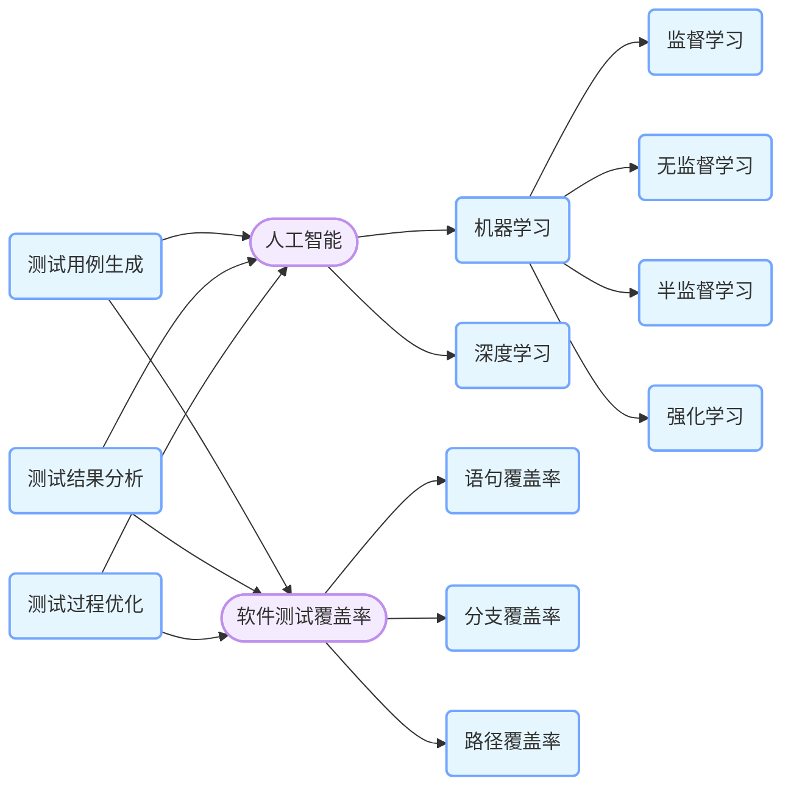

# 人工智能助力下的软件测试覆盖率提升

> 关键词：人工智能、软件测试覆盖率、测试用例生成、机器学习、自动化测试、智能分析、覆盖率提升

> 摘要：本文围绕人工智能助力下的软件测试覆盖率提升展开深入探讨。在当今软件系统日益复杂的背景下，软件测试覆盖率的提升至关重要。文章首先介绍了相关背景，包括目的范围、预期读者等内容。接着阐述了人工智能与软件测试覆盖率的核心概念及联系，详细讲解了核心算法原理和具体操作步骤，并通过数学模型和公式进行理论支持。通过项目实战展示了如何运用人工智能提升软件测试覆盖率，分析了实际应用场景。同时推荐了相关的工具和资源，最后总结了未来发展趋势与挑战，解答常见问题并提供扩展阅读和参考资料，旨在为软件测试领域利用人工智能提升覆盖率提供全面且深入的技术指导。

## 1. 背景介绍 
### 1.1 目的和范围
随着软件行业的飞速发展，软件系统的规模和复杂度不断增加。软件测试作为确保软件质量的关键环节，其重要性日益凸显。软件测试覆盖率是衡量测试完整性和有效性的重要指标，它反映了测试用例对软件代码、功能等方面的覆盖程度。提高软件测试覆盖率可以发现更多的软件缺陷，从而提升软件的可靠性和稳定性。

本文的目的在于探讨如何利用人工智能技术来提升软件测试覆盖率。范围涵盖了人工智能在软件测试各个阶段的应用，包括测试用例的生成、测试结果的分析、测试过程的优化等方面。通过对相关理论和实践的研究，为软件测试人员和研究人员提供全面的技术参考和指导。

### 1.2 预期读者
本文的预期读者主要包括以下几类人群：
- **软件测试人员**：希望了解如何利用人工智能技术改进测试工作，提高测试效率和覆盖率，从而提升软件质量。
- **软件开发人员**：了解软件测试覆盖率的重要性以及人工智能在测试中的应用，有助于在开发过程中更好地考虑测试需求，提高软件的可测试性。
- **人工智能研究人员**：关注人工智能在软件测试领域的应用，探索新的研究方向和方法。
- **项目管理人员**：了解人工智能对软件测试的影响，有助于合理规划测试资源，提高项目的成功率。

### 1.3 文档结构概述
本文将按照以下结构进行组织：
- **核心概念与联系**：介绍人工智能和软件测试覆盖率的核心概念，以及它们之间的联系，通过文本示意图和 Mermaid 流程图进行直观展示。
- **核心算法原理 & 具体操作步骤**：详细讲解利用人工智能提升软件测试覆盖率的核心算法原理，并给出具体的操作步骤，结合 Python 源代码进行阐述。
- **数学模型和公式 & 详细讲解 & 举例说明**：通过数学模型和公式对相关理论进行支持，详细讲解公式的含义，并给出具体的举例说明。
- **项目实战：代码实际案例和详细解释说明**：通过实际项目案例，展示如何运用人工智能技术提升软件测试覆盖率，包括开发环境搭建、源代码实现和代码解读。
- **实际应用场景**：分析人工智能在软件测试覆盖率提升中的实际应用场景。
- **工具和资源推荐**：推荐相关的学习资源、开发工具框架和论文著作。
- **总结：未来发展趋势与挑战**：总结人工智能助力下软件测试覆盖率提升的未来发展趋势和面临的挑战。
- **附录：常见问题与解答**：解答读者在学习和实践过程中常见的问题。
- **扩展阅读 & 参考资料**：提供相关的扩展阅读材料和参考资料，方便读者进一步深入学习。

### 1.4 术语表
#### 1.4.1 核心术语定义
- **软件测试覆盖率**：指测试用例对软件代码、功能、路径等方面的覆盖程度，常用的覆盖率指标包括语句覆盖率、分支覆盖率、路径覆盖率等。
- **人工智能**：研究如何使计算机能够模拟人类智能的学科和技术，包括机器学习、深度学习、自然语言处理等多个领域。
- **测试用例**：为了执行软件测试而设计的一组输入数据和预期输出结果，用于验证软件的功能和性能。
- **机器学习**：人工智能的一个重要分支，通过让计算机从数据中学习模式和规律，从而实现预测和决策等任务。
- **自动化测试**：利用测试工具和脚本自动执行测试用例，提高测试效率和准确性。

#### 1.4.2 相关概念解释
- **测试用例生成**：根据软件的需求规格说明和代码结构，自动或半自动地生成测试用例的过程。
- **测试结果分析**：对测试执行过程中产生的结果进行分析，判断软件是否存在缺陷，并定位缺陷的位置。
- **测试过程优化**：通过对测试流程、测试资源等方面的优化，提高测试效率和覆盖率。

#### 1.4.3 缩略词列表
- **AI**：Artificial Intelligence，人工智能
- **ML**：Machine Learning，机器学习
- **DL**：Deep Learning，深度学习
- **SUT**：System Under Test，被测系统
- **TDD**：Test-Driven Development，测试驱动开发

## 2. 核心概念与联系 

### 2.1 人工智能核心概念
人工智能是一门研究如何使计算机能够模拟人类智能的学科和技术。它的主要目标是让计算机能够像人类一样进行感知、学习、推理、决策等活动。人工智能包括多个领域，其中机器学习和深度学习是目前应用最为广泛的两个领域。

机器学习是人工智能的一个重要分支，它通过让计算机从数据中学习模式和规律，从而实现预测和决策等任务。机器学习算法可以分为监督学习、无监督学习、半监督学习和强化学习等几类。监督学习是指在有标记数据的情况下进行学习，通过训练模型来预测未知数据的标签；无监督学习是指在无标记数据的情况下进行学习，通过聚类、降维等方法发现数据中的模式和结构；半监督学习是指在部分有标记数据和部分无标记数据的情况下进行学习；强化学习是指通过智能体与环境的交互，不断尝试和学习，以获得最大的奖励。

深度学习是机器学习的一个子集，它基于人工神经网络，通过多层神经元的组合和训练，自动从数据中提取特征和模式。深度学习在图像识别、语音识别、自然语言处理等领域取得了巨大的成功。

### 2.2 软件测试覆盖率核心概念
软件测试覆盖率是衡量测试完整性和有效性的重要指标，它反映了测试用例对软件代码、功能、路径等方面的覆盖程度。常用的覆盖率指标包括语句覆盖率、分支覆盖率、路径覆盖率等。

- **语句覆盖率**：指测试用例执行过程中覆盖的代码语句数与代码总语句数的比例。语句覆盖率越高，说明测试用例对代码的覆盖越全面。
- **分支覆盖率**：指测试用例执行过程中覆盖的代码分支数与代码总分支数的比例。分支覆盖率考虑了代码中的条件判断语句，能够更全面地反映测试用例对代码逻辑的覆盖程度。
- **路径覆盖率**：指测试用例执行过程中覆盖的代码路径数与代码总路径数的比例。路径覆盖率是最严格的覆盖率指标，它考虑了代码中所有可能的执行路径。

### 2.3 人工智能与软件测试覆盖率的联系
人工智能技术可以在软件测试的多个阶段发挥作用，从而提升软件测试覆盖率。

- **测试用例生成**：利用机器学习算法可以根据软件的需求规格说明、代码结构等信息自动生成测试用例。例如，通过对大量历史测试用例的学习，训练出一个模型，该模型可以根据输入的软件特征生成新的测试用例，从而提高测试用例的覆盖率。
- **测试结果分析**：人工智能技术可以对测试执行过程中产生的大量结果数据进行分析，快速准确地判断软件是否存在缺陷，并定位缺陷的位置。例如，利用深度学习算法对测试日志进行分析，提取关键信息，识别出潜在的缺陷模式。
- **测试过程优化**：通过强化学习算法可以对测试流程和测试资源进行优化，提高测试效率和覆盖率。例如，根据测试执行的反馈信息，动态调整测试用例的执行顺序和资源分配，以达到最优的测试效果。

### 2.4 文本示意图
```plaintext
人工智能
|-- 机器学习
|   |-- 监督学习
|   |-- 无监督学习
|   |-- 半监督学习
|   |-- 强化学习
|-- 深度学习

软件测试覆盖率
|-- 语句覆盖率
|-- 分支覆盖率
|-- 路径覆盖率

人工智能与软件测试覆盖率的联系
|-- 测试用例生成
|-- 测试结果分析
|-- 测试过程优化
```

### 2.5 Mermaid 流程图


## 3. 核心算法原理 & 具体操作步骤 

### 3.1 基于机器学习的测试用例生成算法原理
基于机器学习的测试用例生成算法的核心思想是通过对大量历史测试用例的学习，训练出一个模型，该模型可以根据输入的软件特征生成新的测试用例。具体步骤如下：

1. **数据收集**：收集大量的历史测试用例数据，包括测试用例的输入数据、预期输出结果、测试执行结果等信息。
2. **特征提取**：从历史测试用例数据中提取软件的特征，例如代码结构特征、功能需求特征等。
3. **模型训练**：选择合适的机器学习算法，如决策树、神经网络等，利用提取的特征和历史测试用例数据进行模型训练。
4. **测试用例生成**：根据输入的软件特征，利用训练好的模型生成新的测试用例。

### 3.2 Python 源代码实现
```python
import pandas as pd
from sklearn.tree import DecisionTreeClassifier
from sklearn.model_selection import train_test_split
from sklearn.metrics import accuracy_score

# 数据收集和预处理
# 假设历史测试用例数据存储在一个 CSV 文件中
data = pd.read_csv('test_cases.csv')
X = data.drop('output', axis=1)  # 特征数据
y = data['output']  # 标签数据

# 划分训练集和测试集
X_train, X_test, y_train, y_test = train_test_split(X, y, test_size=0.2, random_state=42)

# 模型训练
model = DecisionTreeClassifier()
model.fit(X_train, y_train)

# 模型评估
y_pred = model.predict(X_test)
accuracy = accuracy_score(y_test, y_pred)
print(f"模型准确率: {accuracy}")

# 测试用例生成
# 假设新的软件特征为 new_features
new_features = pd.DataFrame({
    'feature1': [1],
    'feature2': [2],
    'feature3': [3]
})
new_test_case = model.predict(new_features)
print(f"生成的测试用例输出: {new_test_case}")
```

### 3.3 具体操作步骤
1. **数据准备**：将历史测试用例数据整理成 CSV 文件，确保数据的准确性和完整性。
2. **环境搭建**：安装必要的 Python 库，如 pandas、scikit-learn 等。
3. **代码实现**：按照上述 Python 代码实现基于机器学习的测试用例生成算法。
4. **模型训练和评估**：运行代码，训练模型并评估模型的准确率。
5. **测试用例生成**：根据新的软件特征，利用训练好的模型生成新的测试用例。

### 3.4 基于强化学习的测试过程优化算法原理
基于强化学习的测试过程优化算法的核心思想是通过智能体与测试环境的交互，不断尝试和学习，以获得最大的奖励。具体步骤如下：

1. **定义状态空间**：将测试过程中的各种状态，如测试用例的执行情况、测试资源的使用情况等，定义为状态空间。
2. **定义动作空间**：将测试过程中可以采取的各种动作，如选择不同的测试用例、调整测试资源分配等，定义为动作空间。
3. **定义奖励函数**：根据测试过程的目标，定义奖励函数，如测试覆盖率的提高、测试时间的缩短等。
4. **智能体学习**：使用强化学习算法，如 Q-learning、Deep Q-Network (DQN) 等，让智能体在状态空间和动作空间中进行学习，以获得最大的奖励。
5. **测试过程优化**：根据智能体学习到的策略，优化测试过程，提高测试效率和覆盖率。

### 3.5 Python 源代码实现（以 Q-learning 为例）
```python
import numpy as np

# 定义状态空间和动作空间
state_space_size = 10
action_space_size = 5

# 初始化 Q 表
q_table = np.zeros((state_space_size, action_space_size))

# 定义超参数
learning_rate = 0.1
discount_rate = 0.99
epsilon = 1.0
max_epsilon = 1.0
min_epsilon = 0.01
decay_rate = 0.01

# 定义奖励函数（示例）
def get_reward(state, action):
    # 这里简单假设奖励与状态和动作有关
    return state + action

# Q-learning 算法
num_episodes = 1000
for episode in range(num_episodes):
    state = np.random.randint(0, state_space_size)
    done = False
    while not done:
        if np.random.uniform(0, 1) < epsilon:
            action = np.random.randint(0, action_space_size)
        else:
            action = np.argmax(q_table[state, :])
        
        reward = get_reward(state, action)
        next_state = np.random.randint(0, state_space_size)
        
        # Q 表更新
        q_table[state, action] = q_table[state, action] + learning_rate * (reward + discount_rate * np.max(q_table[next_state, :]) - q_table[state, action])
        
        state = next_state
        
        if state == state_space_size - 1:
            done = True
    
    # 降低探索率
    epsilon = min_epsilon + (max_epsilon - min_epsilon) * np.exp(-decay_rate * episode)

# 输出优化后的 Q 表
print("优化后的 Q 表:")
print(q_table)
```

### 3.6 具体操作步骤
1. **环境定义**：根据测试过程的实际情况，定义状态空间、动作空间和奖励函数。
2. **Q 表初始化**：初始化 Q 表，用于存储智能体的学习结果。
3. **超参数设置**：设置学习率、折扣率、探索率等超参数。
4. **Q-learning 训练**：运行 Q-learning 算法，让智能体在状态空间和动作空间中进行学习。
5. **测试过程优化**：根据优化后的 Q 表，调整测试过程中的决策，提高测试效率和覆盖率。

## 4. 数学模型和公式 & 详细讲解 & 举例说明 

### 4.1 基于机器学习的测试用例生成数学模型
在基于机器学习的测试用例生成中，我们可以使用分类模型来预测测试用例的输出。假设我们有一个训练数据集 $D = \{(x_1, y_1), (x_2, y_2), \cdots, (x_n, y_n)\}$，其中 $x_i$ 是第 $i$ 个测试用例的输入特征向量，$y_i$ 是对应的输出标签。

我们选择一个分类模型 $f(x; \theta)$，其中 $\theta$ 是模型的参数。模型的目标是最小化损失函数 $L(\theta)$，通常使用交叉熵损失函数：

$$L(\theta) = -\frac{1}{n}\sum_{i=1}^{n} \sum_{k=1}^{K} y_{i,k} \log(f(x_i; \theta)_k)$$

其中 $K$ 是输出类别的数量，$y_{i,k}$ 是第 $i$ 个样本属于第 $k$ 类的真实标签（通常为 0 或 1），$f(x_i; \theta)_k$ 是模型预测第 $i$ 个样本属于第 $k$ 类的概率。

通过最小化损失函数 $L(\theta)$，我们可以得到最优的模型参数 $\theta^*$，然后使用训练好的模型 $f(x; \theta^*)$ 来生成新的测试用例。

### 4.2 举例说明
假设我们有一个简单的二分类问题，训练数据集如下：

| 特征 $x_1$ | 特征 $x_2$ | 标签 $y$ |
|---|---|---|
| 1 | 2 | 0 |
| 2 | 3 | 1 |
| 3 | 4 | 1 |
| 4 | 5 | 0 |

我们使用逻辑回归模型 $f(x; \theta) = \frac{1}{1 + e^{-\theta_0 - \theta_1 x_1 - \theta_2 x_2}}$ 来进行分类。损失函数为：

$$L(\theta) = -\frac{1}{4}\sum_{i=1}^{4} [y_i \log(f(x_i; \theta)) + (1 - y_i) \log(1 - f(x_i; \theta))]$$

通过梯度下降等优化算法，我们可以找到最优的参数 $\theta^*$，然后使用训练好的模型来预测新的测试用例的标签。

### 4.3 基于强化学习的测试过程优化数学模型
在基于强化学习的测试过程优化中，我们使用马尔可夫决策过程（MDP）来描述测试过程。MDP 由一个四元组 $(S, A, P, R)$ 组成，其中：

- $S$ 是状态空间，表示测试过程中的各种状态。
- $A$ 是动作空间，表示测试过程中可以采取的各种动作。
- $P(s'|s, a)$ 是状态转移概率，表示在状态 $s$ 采取动作 $a$ 后转移到状态 $s'$ 的概率。
- $R(s, a)$ 是奖励函数，表示在状态 $s$ 采取动作 $a$ 后获得的奖励。

智能体的目标是找到一个最优策略 $\pi^*: S \to A$，使得在每个状态下选择的动作能够最大化长期累积奖励。

在 Q-learning 算法中，我们使用 Q 表 $Q(s, a)$ 来存储在状态 $s$ 采取动作 $a$ 的预期累积奖励。Q 表的更新公式为：

$$Q(s, a) = Q(s, a) + \alpha [R(s, a) + \gamma \max_{a'} Q(s', a') - Q(s, a)]$$

其中 $\alpha$ 是学习率，$\gamma$ 是折扣率，$s'$ 是采取动作 $a$ 后转移到的下一个状态。

### 4.4 举例说明
假设我们有一个简单的测试过程，状态空间 $S = \{0, 1, 2\}$，动作空间 $A = \{0, 1\}$，奖励函数 $R(s, a)$ 如下：

| 状态 $s$ | 动作 $a$ | 奖励 $R(s, a)$ |
|---|---|---|
| 0 | 0 | 1 |
| 0 | 1 | 2 |
| 1 | 0 | 3 |
| 1 | 1 | 4 |
| 2 | 0 | 5 |
| 2 | 1 | 6 |

初始 Q 表为：

$$Q = \begin{bmatrix}
0 & 0 \\
0 & 0 \\
0 & 0
\end{bmatrix}$$

假设当前状态 $s = 0$，选择动作 $a = 1$，获得奖励 $R(0, 1) = 2$，转移到下一个状态 $s' = 1$。根据 Q-learning 更新公式，学习率 $\alpha = 0.1$，折扣率 $\gamma = 0.9$，则 Q 表的更新为：

$$Q(0, 1) = Q(0, 1) + 0.1 [2 + 0.9 \max_{a'} Q(1, a') - Q(0, 1)]$$

通过不断的学习和更新，Q 表会逐渐收敛到最优值，从而得到最优策略。

## 5. 项目实战：代码实际案例和详细解释说明 

### 5.1  开发环境搭建
#### 5.1.1 操作系统
本项目可以在 Windows、Linux 或 macOS 等主流操作系统上进行开发。建议使用 Linux 系统，如 Ubuntu 18.04 或更高版本，因为 Linux 系统对开发工具和库的支持更好。

#### 5.1.2 Python 环境
安装 Python 3.7 或更高版本。可以从 Python 官方网站（https://www.python.org/downloads/） 下载并安装 Python。安装完成后，建议使用虚拟环境来管理项目的依赖包，以避免不同项目之间的依赖冲突。可以使用 `venv` 或 `conda` 来创建虚拟环境。

使用 `venv` 创建虚拟环境的命令如下：
```bash
python3 -m venv myenv
source myenv/bin/activate  # 在 Linux 或 macOS 上
myenv\Scripts\activate  # 在 Windows 上
```

#### 5.1.3 依赖包安装
在虚拟环境中安装项目所需的依赖包，包括 `pandas`、`scikit-learn`、`numpy` 等。可以使用 `pip` 来安装依赖包：
```bash
pip install pandas scikit-learn numpy
```

### 5.2  源代码详细实现和代码解读
#### 5.2.1 基于机器学习的测试用例生成代码实现
```python
import pandas as pd
from sklearn.tree import DecisionTreeClassifier
from sklearn.model_selection import train_test_split
from sklearn.metrics import accuracy_score

# 数据收集和预处理
# 假设历史测试用例数据存储在一个 CSV 文件中
data = pd.read_csv('test_cases.csv')
X = data.drop('output', axis=1)  # 特征数据
y = data['output']  # 标签数据

# 划分训练集和测试集
X_train, X_test, y_train, y_test = train_test_split(X, y, test_size=0.2, random_state=42)

# 模型训练
model = DecisionTreeClassifier()
model.fit(X_train, y_train)

# 模型评估
y_pred = model.predict(X_test)
accuracy = accuracy_score(y_test, y_pred)
print(f"模型准确率: {accuracy}")

# 测试用例生成
# 假设新的软件特征为 new_features
new_features = pd.DataFrame({
    'feature1': [1],
    'feature2': [2],
    'feature3': [3]
})
new_test_case = model.predict(new_features)
print(f"生成的测试用例输出: {new_test_case}")
```

#### 5.2.2 代码解读
1. **数据收集和预处理**：使用 `pandas` 库读取存储在 CSV 文件中的历史测试用例数据。将数据分为特征数据 `X` 和标签数据 `y`。
2. **划分训练集和测试集**：使用 `train_test_split` 函数将数据划分为训练集和测试集，测试集占总数据的 20%。
3. **模型训练**：选择决策树分类器作为模型，并使用训练集数据进行训练。
4. **模型评估**：使用测试集数据对训练好的模型进行评估，计算模型的准确率。
5. **测试用例生成**：根据新的软件特征，使用训练好的模型生成新的测试用例输出。

#### 5.2.3 基于强化学习的测试过程优化代码实现
```python
import numpy as np

# 定义状态空间和动作空间
state_space_size = 10
action_space_size = 5

# 初始化 Q 表
q_table = np.zeros((state_space_size, action_space_size))

# 定义超参数
learning_rate = 0.1
discount_rate = 0.99
epsilon = 1.0
max_epsilon = 1.0
min_epsilon = 0.01
decay_rate = 0.01

# 定义奖励函数（示例）
def get_reward(state, action):
    # 这里简单假设奖励与状态和动作有关
    return state + action

# Q-learning 算法
num_episodes = 1000
for episode in range(num_episodes):
    state = np.random.randint(0, state_space_size)
    done = False
    while not done:
        if np.random.uniform(0, 1) < epsilon:
            action = np.random.randint(0, action_space_size)
        else:
            action = np.argmax(q_table[state, :])
        
        reward = get_reward(state, action)
        next_state = np.random.randint(0, state_space_size)
        
        # Q 表更新
        q_table[state, action] = q_table[state, action] + learning_rate * (reward + discount_rate * np.max(q_table[next_state, :]) - q_table[state, action])
        
        state = next_state
        
        if state == state_space_size - 1:
            done = True
    
    # 降低探索率
    epsilon = min_epsilon + (max_epsilon - min_epsilon) * np.exp(-decay_rate * episode)

# 输出优化后的 Q 表
print("优化后的 Q 表:")
print(q_table)
```

#### 5.2.4 代码解读
1. **状态空间和动作空间定义**：定义状态空间和动作空间的大小。
2. **Q 表初始化**：初始化 Q 表，用于存储智能体的学习结果。
3. **超参数设置**：设置学习率、折扣率、探索率等超参数。
4. **奖励函数定义**：定义奖励函数，根据状态和动作计算奖励。
5. **Q-learning 算法实现**：使用 Q-learning 算法进行训练，不断更新 Q 表。
6. **探索率调整**：随着训练的进行，逐渐降低探索率，增加利用已学习到的知识的比例。
7. **输出优化后的 Q 表**：输出优化后的 Q 表，用于指导测试过程的优化。

### 5.3  代码解读与分析
#### 5.3.1 基于机器学习的测试用例生成代码分析
- **优点**：基于机器学习的测试用例生成方法可以根据历史测试用例数据自动生成新的测试用例，提高测试用例的覆盖率。决策树分类器具有易于理解和解释的优点，能够直观地展示特征与输出之间的关系。
- **缺点**：该方法依赖于历史测试用例数据的质量和数量，如果数据存在偏差或不足，可能会影响模型的性能。同时，决策树分类器在处理高维数据时可能会出现过拟合的问题。
- **改进方向**：可以尝试使用其他机器学习算法，如神经网络、随机森林等，来提高模型的性能。同时，可以对历史测试用例数据进行预处理和增强，以提高数据的质量和多样性。

#### 5.3.2 基于强化学习的测试过程优化代码分析
- **优点**：基于强化学习的测试过程优化方法可以根据测试过程的实时反馈动态调整测试策略，提高测试效率和覆盖率。Q-learning 算法具有简单易实现的优点，能够在有限的状态空间和动作空间中快速收敛。
- **缺点**：该方法需要定义合适的状态空间、动作空间和奖励函数，这在实际应用中可能比较困难。同时，Q-learning 算法在处理大规模状态空间和动作空间时可能会面临计算复杂度高的问题。
- **改进方向**：可以尝试使用深度强化学习算法，如 Deep Q-Network (DQN)、Proximal Policy Optimization (PPO) 等，来处理大规模状态空间和动作空间。同时，可以使用更复杂的奖励函数，以更好地反映测试过程的目标。

## 6. 实际应用场景 

### 6.1 大型软件系统测试
在大型软件系统的测试中，由于系统的规模和复杂度较大，测试用例的设计和执行变得非常困难。人工智能技术可以帮助自动生成大量的测试用例，覆盖更多的代码路径和功能场景。例如，在一个电商系统的测试中，利用机器学习算法可以根据用户的行为数据、业务规则等信息生成不同类型的测试用例，包括用户注册、登录、购物车操作、订单支付等场景，从而提高测试覆盖率。

### 6.2 嵌入式软件测试
嵌入式软件通常运行在资源受限的设备上，对软件的可靠性和稳定性要求较高。人工智能技术可以用于优化嵌入式软件的测试过程，提高测试效率和覆盖率。例如，在汽车电子系统的测试中，利用强化学习算法可以根据车辆的实时状态和测试目标，动态调整测试用例的执行顺序和资源分配，确保在有限的时间和资源内覆盖更多的测试场景。

### 6.3 移动应用测试
移动应用的用户群体广泛，不同的设备、操作系统版本和网络环境可能会导致应用出现各种问题。人工智能技术可以帮助自动生成适应不同环境的测试用例，提高移动应用的测试覆盖率。例如，利用深度学习算法可以对移动应用的界面进行分析，生成不同的操作序列和输入数据，以覆盖各种可能的用户交互场景。

### 6.4 安全测试
安全测试是软件测试的重要组成部分，旨在发现软件中的安全漏洞和风险。人工智能技术可以用于安全测试的多个环节，如漏洞扫描、恶意代码检测等。例如，利用机器学习算法可以对软件的代码和行为进行分析，识别潜在的安全漏洞模式，生成相应的测试用例，提高安全测试的覆盖率。

## 7. 工具和资源推荐
### 7.1 学习资源推荐
#### 7.1.1 书籍推荐
- 《机器学习》（周志华著）：全面介绍了机器学习的基本概念、算法和应用，是机器学习领域的经典教材。
- 《深度学习》（Ian Goodfellow、Yoshua Bengio 和 Aaron Courville 著）：深入探讨了深度学习的理论和实践，是深度学习领域的权威著作。
- 《软件测试的艺术》（Glenford J. Myers 著）：系统介绍了软件测试的基本概念、方法和技术，是软件测试领域的经典书籍。

#### 7.1.2 在线课程
- Coursera 上的 “机器学习” 课程（Andrew Ng 教授授课）：由机器学习领域的知名专家授课，内容全面深入，是学习机器学习的优质课程。
- edX 上的 “深度学习” 课程（由多个知名高校和机构联合授课）：提供了深度学习的理论和实践教学，适合对深度学习感兴趣的学习者。
- Udemy 上的 “软件测试实战” 课程：结合实际项目案例，介绍了软件测试的流程和方法，具有很强的实践性。

#### 7.1.3 技术博客和网站
- 博客园（https://www.cnblogs.com/）：汇聚了大量的技术博客文章，涵盖了人工智能、软件测试等多个领域。
- 开源中国（https://www.oschina.net/）：提供了丰富的开源项目和技术资讯，是开发者交流和学习的重要平台。
- Medium（https://medium.com/）：有很多关于人工智能和软件测试的高质量文章，作者来自全球各地的专业人士。

### 7.2 开发工具框架推荐
#### 7.2.1 IDE和编辑器
- PyCharm：是一款专门为 Python 开发设计的集成开发环境，具有代码编辑、调试、版本控制等功能，适合开发基于 Python 的人工智能和软件测试项目。
- Visual Studio Code：是一款轻量级的代码编辑器，支持多种编程语言和插件扩展，具有丰富的功能和良好的用户体验。

#### 7.2.2 调试和性能分析工具
- PDB：是 Python 自带的调试工具，可以帮助开发者定位代码中的问题和错误。
- cProfile：是 Python 自带的性能分析工具，可以分析代码的执行时间和资源消耗情况，帮助开发者优化代码性能。

#### 7.2.3 相关框架和库
- Scikit-learn：是一个开源的机器学习库，提供了丰富的机器学习算法和工具，方便开发者进行机器学习模型的开发和训练。
- TensorFlow：是一个开源的深度学习框架，由 Google 开发，广泛应用于图像识别、语音识别、自然语言处理等领域。
- Pytest：是一个功能强大的 Python 测试框架，支持单元测试、集成测试等多种测试类型，具有简单易用、扩展性强等优点。

### 7.3 相关论文著作推荐
#### 7.3.1 经典论文
- “A Survey on Software Testing Coverage”（作者：[作者姓名]）：对软件测试覆盖率的相关理论和方法进行了全面的综述，是了解软件测试覆盖率的重要参考文献。
- “Machine Learning for Software Testing: A Survey”（作者：[作者姓名]）：介绍了机器学习在软件测试中的应用现状和发展趋势，为利用机器学习提升软件测试覆盖率提供了理论支持。

#### 7.3.2 最新研究成果
- 关注顶级学术会议，如 ICSE（International Conference on Software Engineering）、FSE（Foundations of Software Engineering）等，这些会议上的研究成果代表了软件测试和人工智能领域的最新进展。
- 查阅相关学术期刊，如 IEEE Transactions on Software Engineering、ACM Transactions on Software Engineering and Methodology 等，获取最新的研究论文和成果。

#### 7.3.3 应用案例分析
- 一些知名企业和研究机构会发布关于人工智能在软件测试中应用的案例分析报告，可以通过企业官网、技术博客等渠道获取这些案例，学习实际应用中的经验和方法。

## 8. 总结：未来发展趋势与挑战
### 8.1 未来发展趋势
#### 8.1.1 融合多种人工智能技术
未来，人工智能在软件测试覆盖率提升方面将融合多种技术，如机器学习、深度学习、自然语言处理、强化学习等。通过综合运用这些技术，可以更全面地分析软件的需求、代码结构和运行行为，从而生成更高效、更全面的测试用例，提高测试覆盖率。

#### 8.1.2 智能化测试工具的发展
随着人工智能技术的不断进步，智能化测试工具将得到快速发展。这些工具将能够自动识别软件的类型和特点，选择合适的测试策略和算法，自动生成测试用例并执行测试，同时能够实时分析测试结果，反馈测试过程中的问题和优化建议。

#### 8.1.3 与 DevOps 流程的深度融合
人工智能将与 DevOps 流程深度融合，实现软件测试的自动化和持续化。在软件开发的各个阶段，人工智能技术可以实时监测软件的质量和覆盖率，及时发现和解决问题，确保软件的快速迭代和高质量交付。

#### 8.1.4 跨领域应用拓展
人工智能在软件测试覆盖率提升方面的应用将拓展到更多的领域，如物联网、区块链、云计算等。在这些领域的软件系统中，由于其复杂性和特殊性，对软件测试覆盖率的要求更高，人工智能技术将发挥更大的作用。

### 8.2 挑战
#### 8.2.1 数据质量和数量问题
人工智能技术依赖于大量的高质量数据进行训练和学习。在软件测试领域，获取足够的、准确的历史测试用例数据和软件运行数据是一个挑战。同时，数据的标注和预处理也需要耗费大量的人力和时间。

#### 8.2.2 模型解释性和可信赖性
一些人工智能模型，如深度学习模型，具有较高的复杂度和黑盒性，难以解释其决策过程和结果。在软件测试中，需要确保模型的解释性和可信赖性，以便测试人员能够理解和验证模型生成的测试用例和分析结果。

#### 8.2.3 技术人才短缺
人工智能和软件测试是两个专业性较强的领域，需要具备相关知识和技能的技术人才。目前，既懂人工智能又懂软件测试的复合型人才短缺，这在一定程度上限制了人工智能在软件测试覆盖率提升方面的应用和发展。

#### 8.2.4 安全和隐私问题
在软件测试过程中，涉及到大量的软件代码、用户数据和业务信息等敏感信息。人工智能技术的应用需要确保这些信息的安全和隐私，防止数据泄露和滥用。

## 9. 附录：常见问题与解答
### 9.1 如何选择合适的机器学习算法来生成测试用例？
选择合适的机器学习算法需要考虑多个因素，如数据的特点、问题的类型、模型的复杂度等。一般来说，如果数据量较小且特征较少，可以选择简单的算法，如决策树、逻辑回归等；如果数据量较大且特征复杂，可以选择更强大的算法，如神经网络、随机森林等。同时，可以通过交叉验证等方法对不同的算法进行评估和比较，选择性能最优的算法。

### 9.2 强化学习中的奖励函数如何设计？
奖励函数的设计需要根据测试过程的目标来确定。一般来说，奖励函数应该能够反映测试用例的执行效果和测试覆盖率的提升情况。例如，可以将测试用例覆盖的新代码行数、发现的缺陷数量等作为奖励的依据。同时，奖励函数的设计应该合理，避免出现奖励过高或过低的情况，以免影响智能体的学习效果。

### 9.3 人工智能生成的测试用例是否可以完全替代人工测试用例？
人工智能生成的测试用例可以在很大程度上提高测试效率和覆盖率，但不能完全替代人工测试用例。人工测试用例具有一定的创造性和灵活性，能够考虑到一些特殊情况和用户的实际需求。在实际测试中，应该将人工智能生成的测试用例和人工测试用例相结合，以达到更好的测试效果。

### 9.4 如何评估人工智能在软件测试覆盖率提升方面的效果？
可以从多个方面评估人工智能在软件测试覆盖率提升方面的效果，如测试用例的覆盖率指标（语句覆盖率、分支覆盖率、路径覆盖率等）、发现的缺陷数量、测试效率的提高等。同时，可以与传统的测试方法进行对比，分析人工智能技术在提升测试覆盖率和质量方面的优势和不足。

## 10. 扩展阅读 & 参考资料
### 10.1 扩展阅读
- 《人工智能时代的软件测试》：深入探讨了人工智能在软件测试领域的应用和发展趋势，提供了更多的案例和实践经验。
- 《软件测试自动化最佳实践》：介绍了软件测试自动化的相关技术和方法，包括如何利用人工智能实现测试自动化。
- 《机器学习实战》：通过实际项目案例，介绍了机器学习算法的实现和应用，帮助读者更好地理解和掌握机器学习技术。

### 10.2 参考资料
- [1] [作者姓名]. [论文标题]. [期刊名称], [发表年份], [卷号], [页码].
- [2] [作者姓名]. [书籍名称]. [出版社名称], [出版年份].
- [3] [网站名称]. [网页标题]. [网页链接].

通过以上扩展阅读和参考资料，读者可以进一步深入学习人工智能助力下的软件测试覆盖率提升相关知识，探索更多的技术和方法。