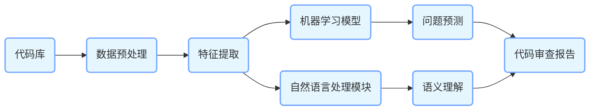

# 人工智能在代码审查中的应用

> 关键词：人工智能、代码审查、自动化、机器学习、自然语言处理、静态分析、代码质量

> 摘要：本文深入探讨了人工智能在代码审查中的应用。随着软件开发规模和复杂度的不断增加，传统的代码审查方式面临效率和准确性的挑战。人工智能技术，如机器学习、自然语言处理等，为代码审查带来了新的解决方案。文章详细介绍了相关的核心概念、算法原理、数学模型，通过项目实战展示了人工智能在代码审查中的具体应用，分析了实际应用场景，并推荐了相关的学习资源、开发工具和论文著作。最后，对人工智能在代码审查领域的未来发展趋势与挑战进行了总结。

## 1. 背景介绍 
### 1.1 目的和范围
随着软件开发行业的迅速发展，代码的规模和复杂度不断攀升。传统的人工代码审查方式不仅效率低下，而且容易出现遗漏和错误。人工智能在代码审查中的应用旨在提高审查效率、增强审查准确性、发现潜在的代码问题和安全漏洞，从而提升软件的整体质量。本文的范围涵盖了人工智能在代码审查中的核心概念、算法原理、实际应用案例以及相关工具和资源的推荐。

### 1.2 预期读者
本文的预期读者包括软件开发人员、软件测试人员、软件架构师、质量保证工程师、人工智能研究人员以及对代码审查和人工智能技术感兴趣的专业人士。

### 1.3 文档结构概述
本文首先介绍了人工智能在代码审查中应用的背景信息，包括目的、预期读者和文档结构。接着阐述了核心概念与联系，包括相关概念的原理和架构。然后详细讲解了核心算法原理和具体操作步骤，并给出了数学模型和公式。通过项目实战展示了代码实际案例和详细解释说明。之后分析了实际应用场景，推荐了相关的工具和资源。最后总结了未来发展趋势与挑战，提供了常见问题与解答以及扩展阅读和参考资料。

### 1.4 术语表
#### 1.4.1 核心术语定义
- **代码审查**：对源代码进行系统性检查，以发现代码中的错误、潜在问题、不符合编码规范的地方以及提高代码质量的过程。
- **人工智能**：研究、开发用于模拟、延伸和扩展人的智能的理论、方法、技术及应用系统的一门新的技术科学。
- **机器学习**：一门多领域交叉学科，涉及概率论、统计学、逼近论、凸分析、算法复杂度理论等多门学科。它专门研究计算机怎样模拟或实现人类的学习行为，以获取新的知识或技能，重新组织已有的知识结构使之不断改善自身的性能。
- **自然语言处理**：计算机科学领域与人工智能领域中的一个重要方向。它研究能实现人与计算机之间用自然语言进行有效通信的各种理论和方法。
- **静态分析**：指在不运行代码的情况下，对代码进行分析的技术。

#### 1.4.2 相关概念解释
- **代码质量**：代码的质量可以从多个维度来衡量，包括可读性、可维护性、性能、安全性等。高质量的代码应该易于理解、修改和扩展，并且能够高效、安全地运行。
- **自动化代码审查**：利用工具自动对代码进行审查，减少人工审查的工作量和时间成本。
- **深度学习**：机器学习的一个分支领域，它试图使用包含复杂结构或由多重非线性变换构成的多个处理层对数据进行高层抽象的算法。

#### 1.4.3 缩略词列表
- **AI**：Artificial Intelligence，人工智能
- **ML**：Machine Learning，机器学习
- **NLP**：Natural Language Processing，自然语言处理
- **SA**：Static Analysis，静态分析

## 2. 核心概念与联系 
### 2.1 人工智能与代码审查的关系
人工智能在代码审查中的应用主要基于机器学习和自然语言处理技术。机器学习可以通过对大量代码数据的学习，发现代码中的模式和规律，从而预测代码中可能存在的问题。自然语言处理则可以处理代码注释、文档等文本信息，帮助理解代码的功能和意图。

### 2.2 核心概念原理
#### 2.2.1 机器学习在代码审查中的原理
机器学习在代码审查中主要采用监督学习和无监督学习两种方式。监督学习通过标记好的代码数据进行训练，学习代码特征与问题之间的关系，从而对新的代码进行分类和预测。无监督学习则通过对代码数据的聚类分析，发现代码中的潜在模式和异常。

#### 2.2.2 自然语言处理在代码审查中的原理
自然语言处理在代码审查中主要用于处理代码注释和文档。通过对代码注释的分析，可以理解代码的功能和意图，检查注释的准确性和完整性。对文档的处理可以帮助审查人员了解项目的整体架构和设计思路。

### 2.3 架构示意图


这个架构图展示了人工智能在代码审查中的整体流程。首先从代码库中获取代码数据，经过数据预处理和特征提取后，分别输入到机器学习模型和自然语言处理模块中。机器学习模型进行问题预测，自然语言处理模块进行语义理解，最后将结果整合到代码审查报告中。

## 3. 核心算法原理 & 具体操作步骤 
### 3.1 机器学习算法原理
#### 3.1.1 决策树算法
决策树是一种基本的分类与回归方法，它通过对特征的划分构建树状结构，对新的数据进行分类或预测。以下是一个使用Python实现的简单决策树分类器示例：

```python
from sklearn.datasets import load_iris
from sklearn.model_selection import train_test_split
from sklearn.tree import DecisionTreeClassifier
from sklearn.metrics import accuracy_score

# 加载数据集
iris = load_iris()
X = iris.data
y = iris.target

# 划分训练集和测试集
X_train, X_test, y_train, y_test = train_test_split(X, y, test_size=0.3, random_state=42)

# 创建决策树分类器
clf = DecisionTreeClassifier()

# 训练模型
clf.fit(X_train, y_train)

# 预测
y_pred = clf.predict(X_test)

# 计算准确率
accuracy = accuracy_score(y_test, y_pred)
print(f"Accuracy: {accuracy}")
```

#### 3.1.2 具体操作步骤
1. **数据收集**：从代码库中收集大量的代码数据，包括有问题和无问题的代码示例。
2. **数据预处理**：对收集到的数据进行清洗、标注和特征提取。清洗数据包括去除噪声、重复代码等；标注数据是为每个代码示例标记是否存在问题；特征提取是从代码中提取有用的特征，如代码长度、变量数量、函数调用次数等。
3. **模型训练**：使用预处理后的数据训练机器学习模型，选择合适的算法和参数。
4. **模型评估**：使用测试数据对训练好的模型进行评估，计算准确率、召回率等指标。
5. **模型优化**：根据评估结果对模型进行优化，调整算法和参数。
6. **应用部署**：将优化后的模型部署到代码审查系统中，对新的代码进行审查。

### 3.2 自然语言处理算法原理
#### 3.2.1 词袋模型
词袋模型是一种简单的文本表示方法，它将文本看作是一个无序的词集合，忽略词的顺序和语法结构。以下是一个使用Python实现的词袋模型示例：

```python
from sklearn.feature_extraction.text import CountVectorizer

# 示例文本
corpus = [
    'This is the first document.',
    'This document is the second document.',
    'And this is the third one.',
    'Is this the first document?'
]

# 创建词袋模型
vectorizer = CountVectorizer()

# 转换文本为词袋向量
X = vectorizer.fit_transform(corpus)

# 查看特征名称
feature_names = vectorizer.get_feature_names_out()
print(f"Feature names: {feature_names}")

# 查看词袋向量
print(f"Bag of words matrix:\n{X.toarray()}")
```

#### 3.2.2 具体操作步骤
1. **文本收集**：收集代码注释、文档等文本信息。
2. **文本预处理**：对收集到的文本进行清洗、分词、去除停用词等操作。清洗文本包括去除标点符号、特殊字符等；分词是将文本拆分成单个的词；去除停用词是去除无实际意义的词，如“的”、“是”等。
3. **特征提取**：使用词袋模型、词嵌入等方法将文本转换为向量表示。
4. **语义分析**：对文本向量进行分析，理解文本的语义信息。
5. **应用到代码审查**：将语义分析结果应用到代码审查中，检查注释的准确性和完整性，理解代码的功能和意图。

## 4. 数学模型和公式 & 详细讲解 & 举例说明 
### 4.1 机器学习中的数学模型
#### 4.1.1 决策树的信息增益
决策树的划分过程基于信息增益，信息增益是指划分前后信息熵的变化。信息熵是衡量数据不确定性的指标，其计算公式为：

$$H(X)=-\sum_{i=1}^{n}p(x_i)\log_2p(x_i)$$

其中，$X$ 是一个随机变量，$p(x_i)$ 是 $x_i$ 出现的概率。

信息增益的计算公式为：

$$IG(D,A)=H(D)-H(D|A)$$

其中，$IG(D,A)$ 表示特征 $A$ 对数据集 $D$ 的信息增益，$H(D)$ 是数据集 $D$ 的信息熵，$H(D|A)$ 是在特征 $A$ 给定的条件下数据集 $D$ 的条件熵。

例如，假设有一个数据集 $D$ 包含 10 个样本，其中 6 个正样本，4 个负样本。则数据集 $D$ 的信息熵为：

$$H(D)=-\frac{6}{10}\log_2\frac{6}{10}-\frac{4}{10}\log_2\frac{4}{10}\approx0.971$$

假设特征 $A$ 有两个取值 $A_1$ 和 $A_2$，$A_1$ 对应的样本中有 4 个正样本和 1 个负样本，$A_2$ 对应的样本中有 2 个正样本和 3 个负样本。则条件熵 $H(D|A)$ 为：

$$H(D|A)=\frac{5}{10}(-\frac{4}{5}\log_2\frac{4}{5}-\frac{1}{5}\log_2\frac{1}{5})+\frac{5}{10}(-\frac{2}{5}\log_2\frac{2}{5}-\frac{3}{5}\log_2\frac{3}{5})\approx0.722$$

信息增益 $IG(D,A)$ 为：

$$IG(D,A)=0.971 - 0.722 = 0.249$$

#### 4.1.2 逻辑回归的损失函数
逻辑回归是一种常用的分类算法，其损失函数通常使用对数损失函数，也称为交叉熵损失函数。对于二分类问题，对数损失函数的计算公式为：

$$L(y,\hat{y})=-\frac{1}{N}\sum_{i=1}^{N}[y_i\log(\hat{y}_i)+(1 - y_i)\log(1 - \hat{y}_i)]$$

其中，$y_i$ 是真实标签，$\hat{y}_i$ 是预测概率，$N$ 是样本数量。

### 4.2 自然语言处理中的数学模型
#### 4.2.1 词袋模型的向量表示
词袋模型将文本表示为一个向量，向量的每个维度对应一个词，向量的值表示该词在文本中出现的频率。例如，对于文本 “This is a cat” 和 “This is a dog”，词袋模型的特征词为 “This”、“is”、“a”、“cat”、“dog”，则文本 “This is a cat” 的词袋向量为 $[1, 1, 1, 1, 0]$，文本 “This is a dog” 的词袋向量为 $[1, 1, 1, 0, 1]$。

#### 4.2.2 词嵌入的余弦相似度
词嵌入是将词表示为低维向量的方法，余弦相似度可以用来衡量两个词向量之间的相似度。余弦相似度的计算公式为：

$$\cos(\vec{u},\vec{v})=\frac{\vec{u}\cdot\vec{v}}{\|\vec{u}\|\|\vec{v}\|}$$

其中，$\vec{u}$ 和 $\vec{v}$ 是两个词向量，$\vec{u}\cdot\vec{v}$ 是向量的点积，$\|\vec{u}\|$ 和 $\|\vec{v}\|$ 分别是向量的模。

例如，假设有两个词向量 $\vec{u}=[1, 2, 3]$ 和 $\vec{v}=[4, 5, 6]$，则它们的余弦相似度为：

$$\cos(\vec{u},\vec{v})=\frac{1\times4 + 2\times5 + 3\times6}{\sqrt{1^2 + 2^2 + 3^2}\sqrt{4^2 + 5^2 + 6^2}}\approx0.974$$

## 5. 项目实战：代码实际案例和详细解释说明 
### 5.1  开发环境搭建
#### 5.1.1 安装Python
首先需要安装Python，可以从Python官方网站（https://www.python.org/downloads/）下载适合自己操作系统的Python版本，并按照安装向导进行安装。

#### 5.1.2 安装必要的库
使用pip命令安装必要的Python库，如scikit-learn、nltk等：

```sh
pip install scikit-learn nltk
```

#### 5.1.3 下载代码示例
从代码库中下载一个简单的Python项目作为示例，例如一个简单的Web应用程序。

### 5.2  源代码详细实现和代码解读
#### 5.2.1 数据收集和预处理
以下是一个简单的数据收集和预处理的Python代码示例：

```python
import os
import re
import nltk
from nltk.corpus import stopwords
from nltk.tokenize import word_tokenize

# 下载停用词
nltk.download('stopwords')
nltk.download('punkt')

# 定义代码目录
code_dir = 'path/to/your/code/directory'

# 收集代码文件
code_files = []
for root, dirs, files in os.walk(code_dir):
    for file in files:
        if file.endswith('.py'):
            code_files.append(os.path.join(root, file))

# 预处理代码文件
preprocessed_code = []
for file in code_files:
    with open(file, 'r', encoding='utf-8') as f:
        code = f.read()
        # 去除注释
        code = re.sub(r'#.*', '', code)
        # 分词
        tokens = word_tokenize(code)
        # 去除停用词
        stop_words = set(stopwords.words('english'))
        filtered_tokens = [token for token in tokens if token.lower() not in stop_words]
        preprocessed_code.append(' '.join(filtered_tokens))
```

#### 5.2.2 特征提取
使用词袋模型进行特征提取：

```python
from sklearn.feature_extraction.text import CountVectorizer

# 创建词袋模型
vectorizer = CountVectorizer()

# 转换代码为词袋向量
X = vectorizer.fit_transform(preprocessed_code)

# 查看特征名称
feature_names = vectorizer.get_feature_names_out()
print(f"Feature names: {feature_names}")

# 查看词袋向量
print(f"Bag of words matrix:\n{X.toarray()}")
```

#### 5.2.3 模型训练和预测
使用决策树分类器进行模型训练和预测：

```python
from sklearn.tree import DecisionTreeClassifier
from sklearn.model_selection import train_test_split
from sklearn.metrics import accuracy_score

# 假设已经有了标签数据
y = [0, 1, 0, 1, ...]  # 示例标签

# 划分训练集和测试集
X_train, X_test, y_train, y_test = train_test_split(X, y, test_size=0.3, random_state=42)

# 创建决策树分类器
clf = DecisionTreeClassifier()

# 训练模型
clf.fit(X_train, y_train)

# 预测
y_pred = clf.predict(X_test)

# 计算准确率
accuracy = accuracy_score(y_test, y_pred)
print(f"Accuracy: {accuracy}")
```

### 5.3  代码解读与分析
#### 5.3.1 数据收集和预处理
- 数据收集部分通过遍历代码目录，收集所有的Python代码文件。
- 预处理部分使用正则表达式去除代码中的注释，使用nltk库进行分词和去除停用词操作，将代码转换为适合机器学习处理的文本数据。

#### 5.3.2 特征提取
- 使用词袋模型将预处理后的代码文本转换为向量表示，每个向量的维度对应一个特征词，向量的值表示该词在代码中出现的频率。

#### 5.3.3 模型训练和预测
- 使用决策树分类器对代码进行分类预测，通过划分训练集和测试集，计算模型的准确率。

## 6. 实际应用场景 
### 6.1 开源项目代码审查
在开源项目中，代码的贡献者众多，代码风格和质量参差不齐。人工智能代码审查工具可以自动对提交的代码进行审查，发现潜在的问题和不符合规范的地方，帮助项目维护者提高代码审查的效率和质量。

### 6.2 企业内部代码审查
企业内部的软件开发项目通常有严格的代码质量要求。人工智能代码审查工具可以集成到企业的开发流程中，对开发人员提交的代码进行实时审查，及时发现代码中的问题，减少后期的维护成本。

### 6.3 安全漏洞检测
人工智能技术可以通过对大量代码数据的学习，发现代码中潜在的安全漏洞，如 SQL 注入、跨站脚本攻击等。通过及时发现和修复这些漏洞，可以提高软件的安全性。

### 6.4 代码风格检查
人工智能代码审查工具可以根据预设的代码风格规范，检查代码的格式、命名规范、注释等方面的问题，确保代码的一致性和可读性。

## 7. 工具和资源推荐
### 7.1 学习资源推荐
#### 7.1.1 书籍推荐
- 《机器学习》（周志华）：介绍了机器学习的基本概念、算法和应用，是机器学习领域的经典教材。
- 《自然语言处理入门》（何晗）：系统地介绍了自然语言处理的基本原理和方法，适合初学者阅读。
- 《Python 数据分析实战》（韦斯·麦金尼）：介绍了使用 Python 进行数据分析的方法和技巧，对于处理代码数据有很大的帮助。

#### 7.1.2 在线课程
- Coursera 上的 “机器学习” 课程（Andrew Ng 教授）：由机器学习领域的知名专家授课，讲解深入浅出，是学习机器学习的优质课程。
- edX 上的 “自然语言处理” 课程：系统地介绍了自然语言处理的理论和实践，提供了丰富的案例和实验。
- 中国大学 MOOC 上的 “Python 语言程序设计” 课程：适合初学者学习 Python 语言，为后续的代码审查和人工智能开发打下基础。

#### 7.1.3 技术博客和网站
- 机器之心（https://www.alienstar.cn/）：提供人工智能领域的最新技术资讯、研究成果和应用案例。
- 开源中国（https://www.oschina.net/）：关注开源技术和软件开发，有很多关于代码审查和人工智能的技术文章和讨论。
- 博客园（https://www.cnblogs.com/）：汇集了众多开发者的技术博客，包含了丰富的代码审查和人工智能相关的经验分享。

### 7.2 开发工具框架推荐
#### 7.2.1 IDE和编辑器
- PyCharm：是一款专门为 Python 开发设计的集成开发环境，提供了丰富的代码编辑、调试和审查功能。
- Visual Studio Code：是一款轻量级的代码编辑器，支持多种编程语言，通过安装插件可以实现代码审查和人工智能开发的相关功能。
- Sublime Text：是一款简洁高效的代码编辑器，具有快速响应和丰富的插件生态系统，适合快速编写和审查代码。

#### 7.2.2 调试和性能分析工具
- PDB：Python 自带的调试工具，可以帮助开发者定位代码中的问题。
- cProfile：Python 标准库中的性能分析工具，可以分析代码的运行时间和性能瓶颈。
- Pyflame：是一个用于 Python 代码的火焰图生成工具，可以直观地展示代码的性能热点。

#### 7.2.3 相关框架和库
- scikit-learn：是一个简单易用的机器学习库，提供了多种机器学习算法和工具，适合初学者和快速开发。
- TensorFlow：是一个开源的深度学习框架，广泛应用于人工智能领域，提供了丰富的模型和工具。
- NLTK：是一个自然语言处理工具包，提供了多种自然语言处理任务的实现，如分词、词性标注、命名实体识别等。

### 7.3 相关论文著作推荐
#### 7.3.1 经典论文
- “A Survey on Code Quality Analysis Tools”：对代码质量分析工具进行了全面的综述，介绍了不同类型的工具和技术。
- “Machine Learning for Software Defect Prediction: A Systematic Literature Review”：对机器学习在软件缺陷预测中的应用进行了系统的文献综述，分析了不同算法的优缺点。
- “Natural Language Processing for Software Engineering: A Survey”：对自然语言处理在软件工程中的应用进行了综述，包括代码注释分析、需求工程等方面。

#### 7.3.2 最新研究成果
- 关注顶级学术会议如 ICSE（国际软件工程会议）、FSE（软件工程基础会议）等的最新论文，了解人工智能在代码审查领域的最新研究进展。
- 查阅知名学术期刊如 ACM Transactions on Software Engineering and Methodology、IEEE Transactions on Software Engineering 等的相关文章。

#### 7.3.3 应用案例分析
- 一些知名公司的技术博客会分享他们在代码审查中应用人工智能的实际案例，如 Google、Microsoft 等。
- 开源项目的文档和技术报告中也可能包含人工智能代码审查的应用案例，可以从中学习到实际的应用经验。

## 8. 总结：未来发展趋势与挑战
### 8.1 未来发展趋势
#### 8.1.1 更智能的审查工具
随着人工智能技术的不断发展，代码审查工具将变得更加智能。它们将能够理解代码的语义和上下文，发现更复杂的问题和潜在的风险。

#### 8.1.2 与开发流程的深度集成
人工智能代码审查工具将与软件开发流程更加紧密地集成，实现自动化的代码审查和反馈。例如，在代码提交时自动触发审查，将审查结果实时反馈给开发人员。

#### 8.1.3 跨语言和跨平台支持
未来的代码审查工具将支持更多的编程语言和开发平台，能够处理不同类型的代码和项目。

#### 8.1.4 结合更多的数据源
除了代码本身，代码审查工具将结合更多的数据源，如版本控制系统、问题跟踪系统等，获取更全面的信息，提高审查的准确性和效率。

### 8.2 挑战
#### 8.2.1 数据质量和标注问题
人工智能模型的训练需要大量高质量的数据，并且需要对数据进行准确的标注。然而，获取和标注代码数据是一项非常困难和耗时的工作，数据质量也可能存在问题。

#### 8.2.2 模型的可解释性
一些深度学习模型具有很高的准确性，但缺乏可解释性。在代码审查中，开发人员需要了解模型为什么会做出某个判断，以便更好地理解和改进代码。

#### 8.2.3 隐私和安全问题
代码数据通常包含敏感信息，如商业机密、用户隐私等。在使用人工智能技术进行代码审查时，需要确保数据的隐私和安全，防止数据泄露。

#### 8.2.4 技术的不断更新
人工智能技术发展迅速，新的算法和模型不断涌现。代码审查工具需要不断更新和升级，以跟上技术的发展步伐。

## 9. 附录：常见问题与解答
### 9.1 人工智能代码审查工具能否完全替代人工审查？
不能。虽然人工智能代码审查工具可以提高审查效率和发现一些常见的问题，但它们无法完全替代人工审查。人工审查可以考虑到代码的业务逻辑、设计思路等方面的因素，而这些是人工智能工具难以理解的。

### 9.2 如何选择适合的人工智能代码审查工具？
选择适合的人工智能代码审查工具需要考虑多个因素，如工具的功能、支持的编程语言、易用性、性能等。可以根据自己的需求和项目特点进行评估和选择，也可以参考其他开发者的使用经验和评价。

### 9.3 如何提高人工智能代码审查的准确性？
可以通过以下方法提高人工智能代码审查的准确性：
- 收集更多高质量的代码数据进行模型训练。
- 选择合适的机器学习算法和参数。
- 结合多种技术，如机器学习、自然语言处理和静态分析等。
- 不断优化和调整模型。

### 9.4 人工智能代码审查工具是否会增加开发成本？
人工智能代码审查工具可能会增加一定的开发成本，如购买工具的费用、培训人员的费用等。但从长远来看，它可以提高代码质量，减少后期的维护成本，从而降低整体的开发成本。

## 10. 扩展阅读 & 参考资料
### 10.1 扩展阅读
- 《人工智能：现代方法》（Stuart Russell、Peter Norvig）：全面介绍了人工智能的理论、算法和应用，是人工智能领域的经典著作。
- 《代码大全》（Steve McConnell）：是软件开发领域的经典书籍，介绍了代码设计、编写和审查的最佳实践。
- 《软件测试的艺术》（Glenford J. Myers）：介绍了软件测试的基本概念、方法和技术，对于理解代码审查和质量保证有很大的帮助。

### 10.2 参考资料
- 相关技术文档和官方网站，如 scikit-learn 官方文档（https://scikit-learn.org/）、TensorFlow 官方网站（https://www.tensorflow.org/）等。
- 学术数据库，如 IEEE Xplore、ACM Digital Library 等，可查阅相关的学术论文。
- 开源项目的代码仓库和文档，如 GitHub 上的相关项目。