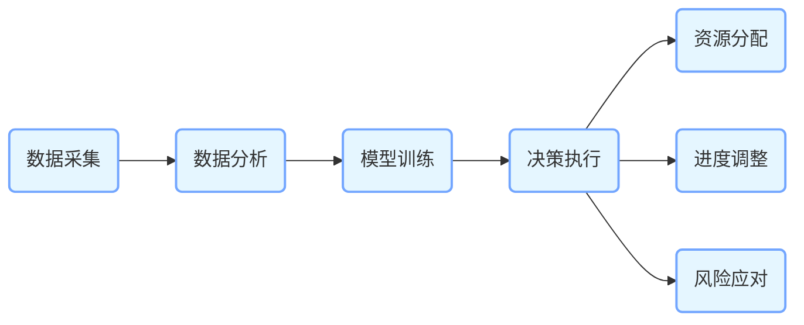

# 人工智能在软件项目资源管理中的应用

> 关键词：人工智能、软件项目资源管理、资源分配、进度预测、风险管理、智能调度、优化算法

> 摘要：本文深入探讨了人工智能在软件项目资源管理中的应用。首先介绍了软件项目资源管理的背景和人工智能在其中应用的目的与意义，接着阐述了相关核心概念及联系，详细讲解了核心算法原理与操作步骤，给出了对应的数学模型和公式。通过项目实战案例展示了如何在实际中运用人工智能进行资源管理，分析了其实际应用场景。同时推荐了相关的学习资源、开发工具框架和论文著作。最后总结了人工智能在软件项目资源管理中的未来发展趋势与挑战，并解答了常见问题，提供了扩展阅读和参考资料，旨在为软件项目资源管理中更好地应用人工智能提供全面且深入的指导。

## 1. 背景介绍 
### 1.1 目的和范围
软件项目资源管理是确保项目顺利进行的关键环节，它涉及到人力资源、物力资源、财力资源等多个方面的合理分配和有效利用。传统的资源管理方法往往依赖于经验和简单的规则，难以应对日益复杂的软件项目需求。人工智能技术的发展为软件项目资源管理带来了新的机遇，通过利用机器学习、深度学习、优化算法等人工智能技术，可以实现资源的智能分配、进度的精准预测、风险的有效识别和管理等，提高软件项目的成功率和效率。

本文的范围涵盖了人工智能在软件项目资源管理各个环节的应用，包括资源分配、进度管理、风险管理、调度优化等方面，旨在探讨如何利用人工智能技术提升软件项目资源管理的水平和质量。

### 1.2 预期读者
本文的预期读者包括软件项目管理人员、软件工程师、人工智能研究人员、对软件项目管理和人工智能技术感兴趣的学生和专业人士等。对于软件项目管理人员，本文可以提供实用的方法和技术，帮助他们更好地管理项目资源；对于软件工程师，本文可以让他们了解人工智能在项目管理中的应用，拓宽技术视野；对于人工智能研究人员，本文可以为他们提供应用场景和研究方向；对于学生和专业人士，本文可以作为学习和参考的资料，帮助他们深入了解相关领域的知识。

### 1.3 文档结构概述
本文共分为十个部分。第一部分是背景介绍，包括目的和范围、预期读者、文档结构概述和术语表；第二部分阐述核心概念与联系，通过文本示意图和 Mermaid 流程图展示人工智能与软件项目资源管理的关系；第三部分详细讲解核心算法原理和具体操作步骤，并给出 Python 源代码示例；第四部分介绍数学模型和公式，通过举例说明其应用；第五部分是项目实战，包括开发环境搭建、源代码详细实现和代码解读；第六部分分析实际应用场景；第七部分推荐相关的工具和资源，包括学习资源、开发工具框架和论文著作；第八部分总结未来发展趋势与挑战；第九部分是附录，解答常见问题；第十部分提供扩展阅读和参考资料。

### 1.4 术语表
#### 1.4.1 核心术语定义
- **人工智能（Artificial Intelligence，AI）**：是指计算机系统能够执行通常需要人类智能才能完成的任务，如学习、推理、解决问题等。
- **软件项目资源管理（Software Project Resource Management）**：是指对软件项目中涉及的人力资源、物力资源、财力资源等进行规划、分配、监控和控制的过程。
- **机器学习（Machine Learning，ML）**：是人工智能的一个分支，通过让计算机从数据中学习模式和规律，从而进行预测和决策。
- **深度学习（Deep Learning，DL）**：是机器学习的一种，通过构建深度神经网络来学习数据的复杂特征和模式。
- **资源分配（Resource Allocation）**：是指将有限的资源合理地分配到软件项目的各个任务和活动中，以实现项目目标。
- **进度预测（Schedule Prediction）**：是指根据项目的历史数据和当前状态，预测项目的完成时间和进度。
- **风险管理（Risk Management）**：是指识别、评估和应对软件项目中可能出现的风险，以降低风险对项目的影响。

#### 1.4.2 相关概念解释
- **智能调度**：是指利用人工智能技术，根据项目的需求和资源的状态，自动调整资源的分配和任务的执行顺序，以提高项目的效率和效益。
- **优化算法**：是指用于寻找最优解或近似最优解的算法，在软件项目资源管理中，可用于优化资源分配、进度安排等问题。
- **数据挖掘**：是指从大量的数据中提取有价值的信息和知识的过程，在软件项目资源管理中，可用于分析项目数据，发现潜在的问题和规律。

#### 1.4.3 缩略词列表
- **AI**：Artificial Intelligence（人工智能）
- **ML**：Machine Learning（机器学习）
- **DL**：Deep Learning（深度学习）
- **PM**：Project Management（项目管理）
- **RAM**：Resource Allocation Matrix（资源分配矩阵）

## 2. 核心概念与联系 
在软件项目资源管理中，人工智能与多个核心概念密切相关，它们相互作用，共同提升资源管理的效率和效果。以下是核心概念的原理和架构的文本示意图：

人工智能在软件项目资源管理中的应用主要涉及到数据采集、数据分析、模型训练和决策执行四个环节。首先，通过数据采集系统收集软件项目的各种数据，包括项目需求、任务信息、资源状态、历史数据等。然后，利用数据分析技术对采集到的数据进行清洗、预处理和特征提取，为模型训练提供高质量的数据。接着，选择合适的人工智能算法，如机器学习、深度学习等，对数据进行训练，构建预测模型、优化模型等。最后，将训练好的模型应用到实际的资源管理决策中，如资源分配、进度调整、风险应对等。

下面是对应的 Mermaid 流程图：


从流程图中可以看出，数据采集是整个过程的基础，为后续的分析和决策提供数据支持。数据分析是对采集到的数据进行处理和挖掘，提取有价值的信息。模型训练是利用数据分析的结果构建人工智能模型，以实现对资源管理问题的预测和优化。决策执行是将训练好的模型应用到实际的资源管理中，做出合理的决策。

## 3. 核心算法原理 & 具体操作步骤 （算法原理讲解必须使用Python源代码来详细阐述）
### 3.1 基于机器学习的资源分配算法
#### 3.1.1 算法原理
基于机器学习的资源分配算法的核心思想是通过学习历史项目数据，构建一个资源分配模型，根据项目的当前需求和资源状态，预测最佳的资源分配方案。常用的机器学习算法包括线性回归、决策树、支持向量机等。

以线性回归为例，线性回归是一种用于预测连续数值的机器学习算法，其基本模型可以表示为：

$y = \theta_0 + \theta_1x_1 + \theta_2x_2 + \cdots + \theta_nx_n$

其中，$y$ 是预测值，$x_1, x_2, \cdots, x_n$ 是输入特征，$\theta_0, \theta_1, \cdots, \theta_n$ 是模型的参数。

在资源分配问题中，输入特征可以包括项目的任务复杂度、任务优先级、资源的技能水平、资源的可用性等，预测值可以是每个任务分配的资源数量或资源类型。

#### 3.1.2 具体操作步骤
1. **数据准备**：收集历史项目数据，包括任务信息、资源信息和资源分配结果。对数据进行清洗和预处理，去除缺失值和异常值，将数据转换为适合机器学习算法处理的格式。
2. **特征选择**：从数据中选择与资源分配相关的特征，如任务复杂度、任务优先级、资源技能水平等。
3. **模型训练**：使用训练数据对线性回归模型进行训练，通过最小化预测值与实际值之间的误差，求解模型的参数。
4. **模型评估**：使用测试数据对训练好的模型进行评估，计算模型的性能指标，如均方误差（Mean Squared Error，MSE）、决定系数（Coefficient of Determination，$R^2$）等。
5. **资源分配预测**：根据项目的当前需求和资源状态，使用训练好的模型预测最佳的资源分配方案。

#### 3.1.3 Python 源代码示例
```python
import numpy as np
from sklearn.linear_model import LinearRegression
from sklearn.model_selection import train_test_split
from sklearn.metrics import mean_squared_error, r2_score

# 生成示例数据
np.random.seed(0)
X = np.random.rand(100, 3)  # 输入特征，假设有 3 个特征
y = 2 * X[:, 0] + 3 * X[:, 1] + 4 * X[:, 2] + np.random.randn(100)  # 目标值

# 划分训练集和测试集
X_train, X_test, y_train, y_test = train_test_split(X, y, test_size=0.2, random_state=42)

# 创建线性回归模型
model = LinearRegression()

# 模型训练
model.fit(X_train, y_train)

# 模型预测
y_pred = model.predict(X_test)

# 模型评估
mse = mean_squared_error(y_test, y_pred)
r2 = r2_score(y_test, y_pred)

print(f"均方误差 (MSE): {mse}")
print(f"决定系数 (R^2): {r2}")

# 预测新的资源分配方案
new_X = np.array([[0.1, 0.2, 0.3]])
new_y_pred = model.predict(new_X)
print(f"预测的资源分配值: {new_y_pred}")
```

### 3.2 基于遗传算法的资源调度优化算法
#### 3.2.1 算法原理
遗传算法是一种基于生物进化原理的优化算法，通过模拟自然选择和遗传机制，在解空间中搜索最优解。在资源调度优化问题中，遗传算法的基本步骤包括编码、初始化种群、选择、交叉、变异和终止条件判断。

编码是将资源调度方案表示为染色体的过程，每个染色体由多个基因组成，每个基因表示一个任务的资源分配和执行顺序。初始化种群是随机生成一组染色体作为初始解。选择是根据染色体的适应度值，选择优良的染色体作为父代。交叉是将父代染色体的部分基因进行交换，生成子代染色体。变异是对染色体的部分基因进行随机修改，增加种群的多样性。终止条件判断是判断算法是否达到终止条件，如达到最大迭代次数或找到满意的解。

#### 3.2.2 具体操作步骤
1. **问题定义**：明确资源调度优化问题的目标函数和约束条件，如最小化项目的总工期、最大化资源的利用率等。
2. **编码设计**：设计合适的染色体编码方式，将资源调度方案表示为染色体。
3. **初始化种群**：随机生成一组染色体作为初始种群。
4. **适应度评估**：计算每个染色体的适应度值，评估其优劣程度。
5. **选择操作**：根据染色体的适应度值，选择优良的染色体作为父代。
6. **交叉操作**：对父代染色体进行交叉操作，生成子代染色体。
7. **变异操作**：对子代染色体进行变异操作，增加种群的多样性。
8. **终止条件判断**：判断算法是否达到终止条件，如达到最大迭代次数或找到满意的解。如果未达到终止条件，返回步骤 4；否则，输出最优解。

#### 3.2.3 Python 源代码示例
```python
import numpy as np

# 问题定义：假设有 3 个任务和 2 个资源，目标是最小化总工期
num_tasks = 3
num_resources = 2
task_durations = np.array([[2, 3], [4, 5], [6, 7]])  # 每个任务在不同资源上的执行时间

# 编码设计：染色体表示为每个任务分配的资源编号
def generate_chromosome():
    return np.random.randint(0, num_resources, num_tasks)

# 适应度评估：计算总工期
def fitness(chromosome):
    total_duration = 0
    resource_times = np.zeros(num_resources)
    for i in range(num_tasks):
        resource_index = chromosome[i]
        resource_times[resource_index] += task_durations[i, resource_index]
        total_duration = max(total_duration, resource_times[resource_index])
    return -total_duration  # 最大化适应度，所以取负

# 选择操作：轮盘赌选择
def selection(population, fitness_values):
    total_fitness = sum(fitness_values)
    probabilities = [fitness / total_fitness for fitness in fitness_values]
    selected_indices = np.random.choice(len(population), size=len(population), p=probabilities)
    return [population[i] for i in selected_indices]

# 交叉操作：单点交叉
def crossover(parent1, parent2):
    crossover_point = np.random.randint(1, num_tasks)
    child1 = np.concatenate((parent1[:crossover_point], parent2[crossover_point:]))
    child2 = np.concatenate((parent2[:crossover_point], parent1[crossover_point:]))
    return child1, child2

# 变异操作：随机变异
def mutation(chromosome, mutation_rate):
    for i in range(num_tasks):
        if np.random.rand() < mutation_rate:
            chromosome[i] = np.random.randint(0, num_resources)
    return chromosome

# 遗传算法主函数
def genetic_algorithm(population_size, num_generations, mutation_rate):
    population = [generate_chromosome() for _ in range(population_size)]
    for _ in range(num_generations):
        fitness_values = [fitness(chromosome) for chromosome in population]
        selected_population = selection(population, fitness_values)
        new_population = []
        for i in range(0, population_size, 2):
            parent1 = selected_population[i]
            parent2 = selected_population[i + 1]
            child1, child2 = crossover(parent1, parent2)
            child1 = mutation(child1, mutation_rate)
            child2 = mutation(child2, mutation_rate)
            new_population.extend([child1, child2])
        population = new_population
    best_chromosome = max(population, key=fitness)
    best_fitness = fitness(best_chromosome)
    return best_chromosome, -best_fitness  # 恢复真实的总工期

# 运行遗传算法
population_size = 50
num_generations = 100
mutation_rate = 0.1
best_schedule, min_duration = genetic_algorithm(population_size, num_generations, mutation_rate)

print(f"最优资源调度方案: {best_schedule}")
print(f"最小总工期: {min_duration}")
```

## 4. 数学模型和公式 & 详细讲解 & 举例说明 
### 4.1 资源分配的线性规划模型
#### 4.1.1 数学模型
资源分配问题可以通过线性规划模型来描述。假设一个软件项目有 $n$ 个任务，$m$ 个资源，每个任务 $i$ 需要完成的工作量为 $w_i$，每个资源 $j$ 的可用工作时间为 $T_j$，每个资源 $j$ 完成任务 $i$ 的单位时间成本为 $c_{ij}$。目标是在满足资源约束的条件下，最小化总资源成本。

设 $x_{ij}$ 表示资源 $j$ 分配给任务 $i$ 的工作时间，则线性规划模型可以表示为：

**目标函数**：
$$\min \sum_{i=1}^{n} \sum_{j=1}^{m} c_{ij}x_{ij}$$

**约束条件**：
1. **任务工作量约束**：
$$\sum_{j=1}^{m} x_{ij} = w_i, \quad i = 1, 2, \cdots, n$$
2. **资源可用时间约束**：
$$\sum_{i=1}^{n} x_{ij} \leq T_j, \quad j = 1, 2, \cdots, m$$
3. **非负约束**：
$$x_{ij} \geq 0, \quad i = 1, 2, \cdots, n; j = 1, 2, \cdots, m$$

#### 4.1.2 详细讲解
目标函数表示最小化总资源成本，即所有任务分配的资源成本之和。任务工作量约束确保每个任务的工作量都能得到满足。资源可用时间约束限制了每个资源的使用时间不能超过其可用时间。非负约束保证了分配的工作时间为非负数。

#### 4.1.3 举例说明
假设有 2 个任务和 2 个资源，任务 1 的工作量为 10 小时，任务 2 的工作量为 15 小时，资源 1 的可用时间为 20 小时，资源 2 的可用时间为 18 小时，资源 1 完成任务 1 的单位时间成本为 5 元/小时，完成任务 2 的单位时间成本为 6 元/小时，资源 2 完成任务 1 的单位时间成本为 4 元/小时，完成任务 2 的单位时间成本为 7 元/小时。

则线性规划模型为：

**目标函数**：
$$\min 5x_{11} + 6x_{12} + 4x_{21} + 7x_{22}$$

**约束条件**：
1. **任务工作量约束**：
$$x_{11} + x_{21} = 10$$
$$x_{12} + x_{22} = 15$$
2. **资源可用时间约束**：
$$x_{11} + x_{12} \leq 20$$
$$x_{21} + x_{22} \leq 18$$
3. **非负约束**：
$$x_{11}, x_{12}, x_{21}, x_{22} \geq 0$$

可以使用 Python 的 `pulp` 库来求解该线性规划问题：
```python
from pulp import LpMinimize, LpProblem, LpVariable

# 创建线性规划问题
prob = LpProblem("Resource_Allocation", LpMinimize)

# 定义决策变量
x11 = LpVariable("x11", lowBound=0)
x12 = LpVariable("x12", lowBound=0)
x21 = LpVariable("x21", lowBound=0)
x22 = LpVariable("x22", lowBound=0)

# 定义目标函数
prob += 5 * x11 + 6 * x12 + 4 * x21 + 7 * x22

# 定义约束条件
prob += x11 + x21 == 10
prob += x12 + x22 == 15
prob += x11 + x12 <= 20
prob += x21 + x22 <= 18

# 求解线性规划问题
prob.solve()

# 输出结果
print(f"最优解:")
print(f"x11 = {x11.value()}")
print(f"x12 = {x12.value()}")
print(f"x21 = {x21.value()}")
print(f"x22 = {x22.value()}")
print(f"最小总资源成本: {prob.objective.value()}")
```

### 4.2 进度预测的时间序列模型
#### 4.2.1 数学模型
时间序列模型是一种用于预测时间序列数据的统计模型，常用的时间序列模型包括自回归积分滑动平均模型（Autoregressive Integrated Moving Average Model，ARIMA）。

ARIMA 模型的一般形式可以表示为：

$$\phi(B)(1 - B)^dY_t = \theta(B)\epsilon_t$$

其中，$Y_t$ 是时间序列数据，$B$ 是滞后算子，$(1 - B)^d$ 表示差分运算，$d$ 是差分阶数，$\phi(B)$ 是自回归多项式，$\theta(B)$ 是滑动平均多项式，$\epsilon_t$ 是白噪声序列。

#### 4.2.2 详细讲解
ARIMA 模型的核心思想是通过对时间序列数据进行差分运算，使其变为平稳序列，然后使用自回归和滑动平均模型来描述平稳序列的动态变化。自回归部分表示当前值与过去值之间的关系，滑动平均部分表示当前值与过去噪声之间的关系。

#### 4.2.3 举例说明
假设我们有一个软件项目的每周进度数据，需要预测未来的进度。可以使用 Python 的 `statsmodels` 库来拟合 ARIMA 模型并进行预测：
```python
import pandas as pd
from statsmodels.tsa.arima.model import ARIMA

# 生成示例数据
data = [10, 12, 15, 18, 20, 22, 25, 28, 30, 32]
index = pd.date_range(start='2023-01-01', periods=len(data), freq='W')
series = pd.Series(data, index=index)

# 拟合 ARIMA 模型
model = ARIMA(series, order=(1, 1, 1))
model_fit = model.fit()

# 预测未来 3 周的进度
forecast = model_fit.get_forecast(steps=3)
forecast_mean = forecast.predicted_mean

print(f"未来 3 周的进度预测: {forecast_mean}")
```

## 5. 项目实战：代码实际案例和详细解释说明 
### 5.1  开发环境搭建
在进行人工智能在软件项目资源管理的项目实战之前，需要搭建相应的开发环境。以下是具体的步骤：

#### 5.1.1 安装 Python
Python 是一种广泛使用的编程语言，许多人工智能库都是基于 Python 开发的。可以从 Python 官方网站（https://www.python.org/downloads/） 下载并安装 Python 3.x 版本。

#### 5.1.2 安装必要的库
在项目中，需要使用一些常用的人工智能库和数据处理库，如 `numpy`、`pandas`、`scikit-learn`、`tensorflow`、`pulp`、`statsmodels` 等。可以使用 `pip` 命令来安装这些库：
```sh
pip install numpy pandas scikit-learn tensorflow pulp statsmodels
```

#### 5.1.3 选择开发工具
可以选择 PyCharm、Jupyter Notebook 等开发工具来编写和运行代码。PyCharm 是一个功能强大的 Python 集成开发环境，适合大型项目的开发；Jupyter Notebook 是一个交互式的开发环境，适合快速验证和演示代码。

### 5.2  源代码详细实现和代码解读
以下是一个综合的项目实战案例，结合了资源分配和进度预测的功能。

```python
import numpy as np
import pandas as pd
from sklearn.linear_model import LinearRegression
from statsmodels.tsa.arima.model import ARIMA
from pulp import LpMinimize, LpProblem, LpVariable

# 资源分配模块
def resource_allocation():
    # 任务工作量
    task_workloads = np.array([10, 15])
    # 资源可用时间
    resource_available_times = np.array([20, 18])
    # 单位时间成本
    cost_matrix = np.array([[5, 6], [4, 7]])

    # 创建线性规划问题
    prob = LpProblem("Resource_Allocation", LpMinimize)

    # 定义决策变量
    num_tasks = len(task_workloads)
    num_resources = len(resource_available_times)
    x = [[LpVariable(f"x_{i}_{j}", lowBound=0) for j in range(num_resources)] for i in range(num_tasks)]

    # 定义目标函数
    prob += sum(cost_matrix[i][j] * x[i][j] for i in range(num_tasks) for j in range(num_resources))

    # 定义约束条件
    for i in range(num_tasks):
        prob += sum(x[i][j] for j in range(num_resources)) == task_workloads[i]
    for j in range(num_resources):
        prob += sum(x[i][j] for i in range(num_tasks)) <= resource_available_times[j]

    # 求解线性规划问题
    prob.solve()

    # 输出结果
    print("资源分配结果:")
    for i in range(num_tasks):
        for j in range(num_resources):
            print(f"任务 {i + 1} 分配给资源 {j + 1} 的时间: {x[i][j].value()}")
    print(f"最小总资源成本: {prob.objective.value()}")

# 进度预测模块
def schedule_prediction():
    # 生成示例进度数据
    data = [10, 12, 15, 18, 20, 22, 25, 28, 30, 32]
    index = pd.date_range(start='2023-01-01', periods=len(data), freq='W')
    series = pd.Series(data, index=index)

    # 拟合 ARIMA 模型
    model = ARIMA(series, order=(1, 1, 1))
    model_fit = model.fit()

    # 预测未来 3 周的进度
    forecast = model_fit.get_forecast(steps=3)
    forecast_mean = forecast.predicted_mean

    print("进度预测结果:")
    print(f"未来 3 周的进度预测: {forecast_mean}")

if __name__ == "__main__":
    # 执行资源分配
    resource_allocation()
    # 执行进度预测
    schedule_prediction()
```

### 5.3  代码解读与分析
#### 5.3.1 资源分配模块
- **数据定义**：定义了任务工作量、资源可用时间和单位时间成本等数据。
- **线性规划问题创建**：使用 `pulp` 库创建线性规划问题，目标是最小化总资源成本。
- **决策变量定义**：定义了每个任务分配给每个资源的工作时间作为决策变量。
- **目标函数定义**：根据单位时间成本和决策变量，定义了目标函数。
- **约束条件定义**：包括任务工作量约束和资源可用时间约束。
- **问题求解**：调用 `prob.solve()` 方法求解线性规划问题。
- **结果输出**：输出每个任务分配给每个资源的时间和最小总资源成本。

#### 5.3.2 进度预测模块
- **数据生成**：生成示例进度数据，并转换为 `pandas` 的 `Series` 对象。
- **ARIMA 模型拟合**：使用 `statsmodels` 库的 `ARIMA` 类拟合 ARIMA 模型。
- **预测**：使用拟合好的模型预测未来 3 周的进度。
- **结果输出**：输出未来 3 周的进度预测结果。

## 6. 实际应用场景 
### 6.1 资源分配优化
在软件项目中，资源分配是一个关键问题。人工智能可以根据项目的需求、任务的优先级、资源的技能水平和可用性等因素，自动优化资源分配方案。例如，在一个大型软件开发项目中，有多个开发团队和不同类型的任务，人工智能可以通过学习历史项目数据，预测每个任务所需的资源和时间，然后将资源合理地分配到各个任务中，提高项目的效率和质量。

### 6.2 进度预测与监控
人工智能可以利用时间序列分析、机器学习等技术，对软件项目的进度进行预测和监控。通过分析项目的历史数据、当前状态和任务依赖关系，人工智能可以预测项目的完成时间和可能出现的延迟，并及时发出预警。例如，在一个软件项目的开发过程中，人工智能可以实时监控任务的完成情况，根据实际进度调整预测结果，帮助项目管理人员及时采取措施，确保项目按时完成。

### 6.3 风险管理
软件项目中存在各种风险，如技术风险、人员风险、进度风险等。人工智能可以通过数据分析和机器学习算法，识别潜在的风险因素，并评估风险的可能性和影响程度。例如，通过分析历史项目数据和当前项目的状态，人工智能可以预测某个任务可能出现的技术难题、人员离职等风险，并提供相应的风险应对措施，降低风险对项目的影响。

### 6.4 智能调度
在软件项目的执行过程中，任务的执行顺序和资源的使用情况需要不断调整。人工智能可以根据项目的实时状态和变化，自动调整任务的调度方案，实现智能调度。例如，当某个任务提前完成或出现资源闲置时，人工智能可以及时调整其他任务的执行顺序，提高资源的利用率。

## 7. 工具和资源推荐
### 7.1 学习资源推荐
#### 7.1.1 书籍推荐
- 《Python 机器学习》（Sebastian Raschka 著）：这本书详细介绍了 Python 中常用的机器学习算法和库，适合初学者学习。
- 《深度学习》（Ian Goodfellow、Yoshua Bengio 和 Aaron Courville 著）：这是深度学习领域的经典教材，全面介绍了深度学习的理论和实践。
- 《项目管理知识体系指南》（Project Management Institute 著）：这本书是项目管理领域的权威指南，涵盖了项目管理的各个方面，包括资源管理。

#### 7.1.2 在线课程
- Coursera 上的“机器学习”课程（Andrew Ng 教授）：这是一门非常经典的机器学习课程，适合初学者入门。
- edX 上的“深度学习基础”课程：该课程由深度学习领域的专家授课，深入介绍了深度学习的基本原理和应用。
- Udemy 上的“软件项目管理实战”课程：该课程结合实际案例，介绍了软件项目管理的方法和技巧。

#### 7.1.3 技术博客和网站
- Medium：这是一个技术博客平台，有许多关于人工智能、项目管理等领域的优质文章。
- Towards Data Science：专注于数据科学和人工智能领域的技术博客，提供了大量的技术文章和案例。
- Project Management Institute（PMI）官网：提供了项目管理领域的最新资讯、研究报告和最佳实践。

### 7.2 开发工具框架推荐
#### 7.2.1 IDE和编辑器
- PyCharm：是一款功能强大的 Python 集成开发环境，提供了代码编辑、调试、版本控制等功能。
- Jupyter Notebook：是一个交互式的开发环境，适合快速验证和演示代码，支持多种编程语言。
- Visual Studio Code：是一个轻量级的代码编辑器，支持多种编程语言和插件，具有丰富的扩展功能。

#### 7.2.2 调试和性能分析工具
- PySnooper：是一个简单易用的 Python 调试工具，可以自动记录函数的调用过程和变量的值。
- cProfile：是 Python 内置的性能分析工具，可以分析代码的运行时间和函数调用次数。
- TensorBoard：是 TensorFlow 提供的可视化工具，可以用于可视化模型的训练过程和性能指标。

#### 7.2.3 相关框架和库
- Scikit-learn：是一个常用的机器学习库，提供了丰富的机器学习算法和工具，如分类、回归、聚类等。
- TensorFlow：是一个开源的深度学习框架，广泛应用于图像识别、自然语言处理等领域。
- PyTorch：是另一个流行的深度学习框架，具有动态图和易于使用的特点。
- Pulp：是一个用于线性规划和整数规划的 Python 库，可以求解资源分配、调度优化等问题。

### 7.3 相关论文著作推荐
#### 7.3.1 经典论文
- “A Tutorial on Hidden Markov Models and Selected Applications in Speech Recognition”（Lawrence R. Rabiner 著）：这是一篇关于隐马尔可夫模型的经典论文，介绍了隐马尔可夫模型的原理和在语音识别中的应用。
- “Gradient-Based Learning Applied to Document Recognition”（Yann LeCun、Léon Bottou、Yoshua Bengio 和 Patrick Haffner 著）：这篇论文介绍了卷积神经网络（CNN）的基本原理和在文档识别中的应用，是深度学习领域的经典之作。
- “Project Management in the 21st Century: A Research Agenda”（J. Rodney Turner 和 Ralf Müller 著）：这篇论文探讨了 21 世纪项目管理的发展趋势和研究方向。

#### 7.3.2 最新研究成果
- 可以关注顶级学术会议和期刊上的最新研究成果，如 ACM SIGKDD（知识发现与数据挖掘会议）、NeurIPS（神经信息处理系统大会）、IEEE Transactions on Software Engineering（软件工程汇刊）等。

#### 7.3.3 应用案例分析
- 可以参考一些实际的软件项目案例分析，了解人工智能在软件项目资源管理中的应用效果和经验教训。例如，一些大型互联网公司的技术博客会分享他们在项目管理中应用人工智能的实践经验。

## 8. 总结：未来发展趋势与挑战
### 8.1 未来发展趋势
#### 8.1.1 智能化程度不断提高
随着人工智能技术的不断发展，软件项目资源管理将变得更加智能化。未来的人工智能系统将能够自动学习和适应项目的变化，实时调整资源分配和调度方案，实现更加高效的资源管理。

#### 8.1.2 与其他技术深度融合
人工智能将与区块链、物联网、大数据等技术深度融合，为软件项目资源管理带来更多的创新应用。例如，区块链技术可以提供安全可靠的项目数据存储和共享机制，物联网技术可以实时采集项目现场的资源状态信息，大数据技术可以为人工智能模型提供更丰富的数据支持。

#### 8.1.3 个性化定制服务
未来的人工智能系统将能够根据不同项目的特点和需求，提供个性化的资源管理解决方案。例如，针对不同规模、不同类型的软件项目，人工智能系统可以自动调整算法和模型，为项目提供最适合的资源管理策略。

### 8.2 挑战
#### 8.2.1 数据质量和安全问题
人工智能系统的性能和效果依赖于高质量的数据。在软件项目资源管理中，数据的准确性、完整性和及时性是关键。同时，数据的安全和隐私保护也是一个重要问题，需要采取有效的措施来确保数据的安全。

#### 8.2.2 算法解释性和可信赖性
人工智能算法往往是复杂的黑盒模型，其决策过程和结果难以解释。在软件项目资源管理中，项目管理人员需要了解算法的决策依据，以便做出合理的决策。因此，提高算法的解释性和可信赖性是一个重要的挑战。

#### 8.2.3 人才短缺
人工智能在软件项目资源管理中的应用需要既懂人工智能技术又懂项目管理的复合型人才。目前，这类人才相对短缺，需要加强相关的教育和培训，培养更多的专业人才。

## 9. 附录：常见问题与解答
### 9.1 人工智能在软件项目资源管理中的应用是否会取代人类的决策？
不会。人工智能在软件项目资源管理中的应用主要是为人类决策提供支持和辅助。虽然人工智能可以处理大量的数据和复杂的问题，但人类的经验、判断力和创造力仍然是不可替代的。在实际应用中，需要将人工智能的分析结果与人类的决策相结合，才能做出更加合理和有效的决策。

### 9.2 如何选择适合的人工智能算法和模型？
选择适合的人工智能算法和模型需要考虑多个因素，如问题的类型、数据的特点、模型的复杂度和性能等。一般来说，可以先对问题进行分析和定义，然后根据问题的特点选择合适的算法和模型。同时，需要进行实验和评估，比较不同算法和模型的性能，选择最优的方案。

### 9.3 人工智能在软件项目资源管理中的应用需要多少数据？
数据的数量和质量对人工智能模型的性能有重要影响。一般来说，数据越多，模型的学习能力和泛化能力就越强。但数据的质量同样重要，需要确保数据的准确性、完整性和一致性。在实际应用中，需要根据问题的复杂程度和模型的需求，收集足够的高质量数据。

### 9.4 如何确保人工智能模型的安全性和可靠性？
确保人工智能模型的安全性和可靠性需要从多个方面入手。首先，需要对数据进行安全保护，防止数据泄露和篡改。其次，需要对模型进行验证和评估，确保模型的性能和稳定性。此外，还需要建立完善的监控和预警机制，及时发现和处理模型出现的问题。

## 10. 扩展阅读 & 参考资料
### 10.1 扩展阅读
- 《人工智能简史》：了解人工智能的发展历程和重要里程碑。
- 《敏捷项目管理》：学习敏捷开发模式下的项目管理方法。
- 《大数据时代》：了解大数据技术的应用和影响。

### 10.2 参考资料
- 相关的学术论文和研究报告。
- 开源项目的文档和代码。
- 技术博客和论坛上的讨论和分享。