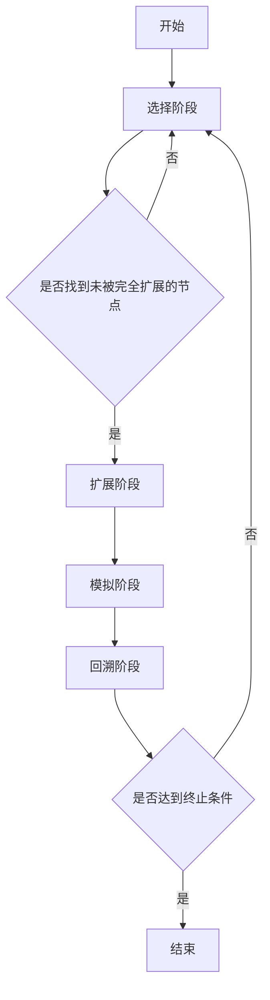
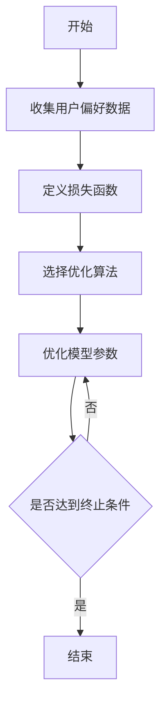

# 从MCTS到DPO:AI决策算法的演进

> 关键词：MCTS、DPO、AI决策算法、算法演进、蒙特卡洛树搜索、直接偏好优化

> 摘要：本文深入探讨了AI决策算法从MCTS（蒙特卡洛树搜索）到DPO（直接偏好优化）的演进过程。首先介绍了研究的背景和相关概念，包括目的、预期读者、文档结构和术语表。接着详细阐述了MCTS和DPO的核心概念、原理、架构以及它们之间的联系，并给出了相应的文本示意图和Mermaid流程图。通过Python源代码详细讲解了核心算法原理和具体操作步骤，同时给出了相关的数学模型和公式，并进行了详细说明和举例。在项目实战部分，通过实际案例展示了代码的实现和解读。还探讨了这些算法的实际应用场景，推荐了相关的学习资源、开发工具框架和论文著作。最后总结了未来发展趋势与挑战，并对常见问题进行了解答，提供了扩展阅读和参考资料，旨在帮助读者全面理解AI决策算法的发展脉络和技术细节。

## 1. 背景介绍 
### 1.1 目的和范围
AI决策算法在人工智能领域中占据着核心地位，它的发展推动了诸多领域的进步，如游戏、机器人、自动驾驶等。本文章的目的在于深入剖析AI决策算法从MCTS到DPO的演进过程，全面探讨这两种算法的原理、实现细节、应用场景以及它们之间的联系与区别。通过详细的分析和解释，帮助读者理解AI决策算法的发展脉络和技术要点，为相关领域的研究和实践提供参考。

本文章的范围涵盖了MCTS和DPO算法的基本概念、核心原理、数学模型、实现代码、实际应用等方面。同时，还会探讨这两种算法在不同领域的应用案例，以及相关的学习资源、开发工具和研究成果，力求为读者呈现一个全面而深入的AI决策算法演进图景。

### 1.2 预期读者
本文预期读者包括对人工智能、机器学习、决策算法等领域感兴趣的研究人员、工程师、学生以及技术爱好者。对于正在从事AI决策算法相关研究和开发的专业人士，本文可以提供深入的技术分析和实践指导；对于初学者，本文将以通俗易懂的方式介绍相关概念和算法原理，帮助他们建立起对AI决策算法的初步认识和理解。

### 1.3 文档结构概述
本文将按照以下结构进行组织：
1. **背景介绍**：介绍文章的目的、范围、预期读者、文档结构概述和术语表。
2. **核心概念与联系**：详细阐述MCTS和DPO的核心概念、原理、架构以及它们之间的联系，并给出相应的文本示意图和Mermaid流程图。
3. **核心算法原理 & 具体操作步骤**：通过Python源代码详细讲解MCTS和DPO的核心算法原理和具体操作步骤。
4. **数学模型和公式 & 详细讲解 & 举例说明**：给出MCTS和DPO相关的数学模型和公式，并进行详细说明和举例。
5. **项目实战：代码实际案例和详细解释说明**：通过实际案例展示MCTS和DPO代码的实现和解读。
6. **实际应用场景**：探讨MCTS和DPO在不同领域的实际应用场景。
7. **工具和资源推荐**：推荐相关的学习资源、开发工具框架和论文著作。
8. **总结：未来发展趋势与挑战**：总结AI决策算法从MCTS到DPO的演进过程，探讨未来发展趋势和面临的挑战。
9. **附录：常见问题与解答**：对读者可能关心的常见问题进行解答。
10. **扩展阅读 & 参考资料**：提供相关的扩展阅读材料和参考资料。

### 1.4 术语表
#### 1.4.1 核心术语定义
- **MCTS（蒙特卡洛树搜索）**：一种在决策过程中进行搜索的算法，通过模拟大量的随机游戏来评估不同的决策路径，从而找到最优的决策。
- **DPO（直接偏好优化）**：一种基于偏好的优化算法，通过直接优化模型的输出，使其更符合用户的偏好。
- **AI决策算法**：用于在人工智能系统中做出决策的算法，根据不同的目标和约束条件，选择最优的行动方案。
- **决策树**：一种树形结构的决策模型，每个内部节点表示一个属性上的测试，每个分支是一个测试输出，每个叶节点是一个类别或值。
- **蒙特卡洛方法**：一种通过随机抽样来估计数值的方法，常用于解决复杂的数学和统计问题。
- **偏好**：用户对不同事物的喜好程度，通常用偏好关系或偏好函数来表示。

#### 1.4.2 相关概念解释
- **搜索空间**：在决策过程中，所有可能的决策路径和状态的集合。
- **模拟**：在MCTS中，通过随机选择行动来模拟游戏的进行，直到游戏结束，以评估不同决策路径的价值。
- **优化**：在DPO中，通过调整模型的参数，使模型的输出更符合用户的偏好，从而提高模型的性能。
- **策略**：在决策过程中，选择行动的规则或方法。

#### 1.4.3 缩略词列表
- **MCTS**：蒙特卡洛树搜索（Monte Carlo Tree Search）
- **DPO**：直接偏好优化（Direct Preference Optimization）
- **AI**：人工智能（Artificial Intelligence）

## 2. 核心概念与联系 
### 2.1 MCTS核心概念
蒙特卡洛树搜索（MCTS）是一种在决策过程中进行搜索的算法，它结合了蒙特卡洛方法和树搜索的思想。MCTS的基本思想是通过模拟大量的随机游戏来评估不同的决策路径，从而找到最优的决策。

MCTS的核心是构建一棵决策树，树的每个节点表示一个游戏状态，每个边表示一个行动。在搜索过程中，MCTS会不断地扩展决策树，通过模拟游戏的进行来评估每个节点的价值。具体来说，MCTS的搜索过程包括四个阶段：选择、扩展、模拟和回溯。

- **选择阶段**：从根节点开始，根据一定的策略选择一个子节点，直到找到一个未被完全扩展的节点。
- **扩展阶段**：在未被完全扩展的节点上，选择一个未被访问过的子节点进行扩展。
- **模拟阶段**：从扩展的子节点开始，通过随机选择行动来模拟游戏的进行，直到游戏结束，得到一个模拟结果。
- **回溯阶段**：将模拟结果回溯到决策树的根节点，更新每个节点的统计信息，如访问次数和平均价值。

### 2.2 DPO核心概念
直接偏好优化（DPO）是一种基于偏好的优化算法，它的核心思想是直接优化模型的输出，使其更符合用户的偏好。在DPO中，用户的偏好通常用偏好关系或偏好函数来表示。

DPO的基本步骤包括：首先，收集用户的偏好数据，即用户对不同模型输出的喜好程度；然后，定义一个损失函数，用于衡量模型输出与用户偏好之间的差异；最后，通过优化算法（如梯度下降）来最小化损失函数，从而调整模型的参数，使模型的输出更符合用户的偏好。

### 2.3 MCTS与DPO的联系
MCTS和DPO虽然是两种不同的算法，但它们在AI决策领域中有着一定的联系。

一方面，MCTS和DPO都致力于解决AI决策中的优化问题。MCTS通过模拟大量的随机游戏来评估不同的决策路径，从而找到最优的决策；DPO通过直接优化模型的输出，使其更符合用户的偏好，从而提高决策的质量。

另一方面，MCTS和DPO可以结合使用。例如，在一些复杂的决策问题中，可以先使用MCTS来搜索可能的决策路径，然后使用DPO来对搜索结果进行优化，使其更符合用户的偏好。

### 2.4 文本示意图和Mermaid流程图
#### 2.4.1 MCTS文本示意图
MCTS的决策树可以用以下文本示意图表示：

```plaintext
Root Node
|-- Child Node 1
|   |-- Grandchild Node 1
|   |-- Grandchild Node 2
|-- Child Node 2
|   |-- Grandchild Node 3
|   |-- Grandchild Node 4
```

在这个示意图中，根节点表示当前的游戏状态，每个子节点表示一个可能的行动，每个叶节点表示一个游戏结束状态。

#### 2.4.2 MCTS Mermaid流程图


#### 2.4.3 DPO文本示意图
DPO的优化过程可以用以下文本示意图表示：

```plaintext
用户偏好数据 --> 损失函数 --> 优化算法 --> 模型参数更新
```

在这个示意图中，用户偏好数据是输入，损失函数用于衡量模型输出与用户偏好之间的差异，优化算法用于最小化损失函数，模型参数更新是输出。

#### 2.4.4 DPO Mermaid流程图


## 3. 核心算法原理 & 具体操作步骤 
### 3.1 MCTS核心算法原理及Python实现
#### 3.1.1 算法原理
MCTS的核心是通过模拟大量的随机游戏来评估不同的决策路径，从而找到最优的决策。具体来说，MCTS的搜索过程包括四个阶段：选择、扩展、模拟和回溯。

- **选择阶段**：从根节点开始，根据一定的策略选择一个子节点，直到找到一个未被完全扩展的节点。常用的选择策略是UCT（Upper Confidence Bound applied to Trees）算法，它结合了节点的平均价值和访问次数，以平衡探索和利用。
- **扩展阶段**：在未被完全扩展的节点上，选择一个未被访问过的子节点进行扩展。
- **模拟阶段**：从扩展的子节点开始，通过随机选择行动来模拟游戏的进行，直到游戏结束，得到一个模拟结果。
- **回溯阶段**：将模拟结果回溯到决策树的根节点，更新每个节点的统计信息，如访问次数和平均价值。

#### 3.1.2 Python实现
以下是一个简单的MCTS算法的Python实现：

```python
import math
import random

class Node:
    def __init__(self, parent=None, action=None):
        self.parent = parent
        self.action = action
        self.children = []
        self.visits = 0
        self.value = 0

    def uct_value(self, c=1.41):
        if self.visits == 0:
            return float('inf')
        return self.value / self.visits + c * math.sqrt(math.log(self.parent.visits) / self.visits)

    def select_child(self):
        if not self.children:
            return None
        best_child = max(self.children, key=lambda child: child.uct_value())
        return best_child

    def expand(self, actions):
        for action in actions:
            child = Node(parent=self, action=action)
            self.children.append(child)
        return random.choice(self.children)

    def simulate(self, game_state):
        while not game_state.is_terminal():
            actions = game_state.get_possible_actions()
            action = random.choice(actions)
            game_state = game_state.take_action(action)
        return game_state.get_reward()

    def backpropagate(self, reward):
        self.visits += 1
        self.value += reward
        if self.parent:
            self.parent.backpropagate(reward)

class MCTS:
    def __init__(self, root_state, num_simulations=1000):
        self.root = Node()
        self.root_state = root_state
        self.num_simulations = num_simulations

    def search(self):
        for _ in range(self.num_simulations):
            node = self.root
            state = self.root_state.copy()

            # 选择阶段
            while node.children and not state.is_terminal():
                node = node.select_child()
                state = state.take_action(node.action)

            # 扩展阶段
            if not state.is_terminal():
                actions = state.get_possible_actions()
                node = node.expand(actions)
                state = state.take_action(node.action)

            # 模拟阶段
            reward = node.simulate(state)

            # 回溯阶段
            node.backpropagate(reward)

        best_child = max(self.root.children, key=lambda child: child.visits)
        return best_child.action
```

### 3.2 DPO核心算法原理及Python实现
#### 3.2.1 算法原理
DPO的核心是直接优化模型的输出，使其更符合用户的偏好。具体来说，DPO的步骤包括：首先，收集用户的偏好数据，即用户对不同模型输出的喜好程度；然后，定义一个损失函数，用于衡量模型输出与用户偏好之间的差异；最后，通过优化算法（如梯度下降）来最小化损失函数，从而调整模型的参数，使模型的输出更符合用户的偏好。

#### 3.2.2 Python实现
以下是一个简单的DPO算法的Python实现：

```python
import torch
import torch.nn as nn
import torch.optim as optim

# 定义一个简单的模型
class SimpleModel(nn.Module):
    def __init__(self, input_size, output_size):
        super(SimpleModel, self).__init__()
        self.fc = nn.Linear(input_size, output_size)

    def forward(self, x):
        return self.fc(x)

# 定义损失函数
def preference_loss(model_outputs, preferences):
    loss = 0
    for i in range(len(preferences)):
        for j in range(i + 1, len(preferences)):
            if preferences[i] > preferences[j]:
                loss += torch.relu(model_outputs[j] - model_outputs[i])
    return loss

# DPO算法实现
def dpo(model, input_data, preferences, num_epochs=100, learning_rate=0.01):
    optimizer = optim.Adam(model.parameters(), lr=learning_rate)

    for epoch in range(num_epochs):
        model_outputs = model(input_data)
        loss = preference_loss(model_outputs, preferences)

        optimizer.zero_grad()
        loss.backward()
        optimizer.step()

        if epoch % 10 == 0:
            print(f'Epoch {epoch}, Loss: {loss.item()}')

    return model
```

## 4. 数学模型和公式 & 详细讲解 & 举例说明 
### 4.1 MCTS数学模型和公式
#### 4.1.1 UCT公式
在MCTS的选择阶段，常用的选择策略是UCT（Upper Confidence Bound applied to Trees）算法，其公式为：

$$ UCT = \frac{Q}{N} + c \sqrt{\frac{\ln N_p}{N}} $$

其中，$Q$ 是节点的累计价值，$N$ 是节点的访问次数，$N_p$ 是父节点的访问次数，$c$ 是一个常数，用于平衡探索和利用。

#### 4.1.2 详细讲解
UCT公式的第一项 $\frac{Q}{N}$ 表示节点的平均价值，反映了节点的利用程度；第二项 $c \sqrt{\frac{\ln N_p}{N}}$ 表示节点的置信上限，反映了节点的探索程度。随着节点访问次数的增加，第二项的值会逐渐减小，从而使算法更加倾向于利用已经被访问过的节点；而对于访问次数较少的节点，第二项的值会较大，从而使算法更加倾向于探索这些节点。

#### 4.1.3 举例说明
假设我们有一个节点，其累计价值 $Q = 10$，访问次数 $N = 5$，父节点的访问次数 $N_p = 20$，常数 $c = 1.41$。则该节点的UCT值为：

$$ UCT = \frac{10}{5} + 1.41 \sqrt{\frac{\ln 20}{5}} \approx 2 + 1.41 \sqrt{\frac{2.996}{5}} \approx 2 + 1.41 \times 0.774 \approx 2 + 1.091 = 3.091 $$

### 4.2 DPO数学模型和公式
#### 4.2.1 损失函数公式
在DPO中，常用的损失函数是基于偏好关系的损失函数，其公式为：

$$ L = \sum_{i=1}^{n-1} \sum_{j=i+1}^{n} \max(0, o_j - o_i) \cdot \mathbb{1}(p_i > p_j) $$

其中，$o_i$ 和 $o_j$ 是模型的输出，$p_i$ 和 $p_j$ 是用户的偏好，$\mathbb{1}(p_i > p_j)$ 是指示函数，如果 $p_i > p_j$ 则为1，否则为0。

#### 4.2.2 详细讲解
该损失函数的含义是，如果用户更喜欢输出 $o_i$ 而不是 $o_j$（即 $p_i > p_j$），但模型的输出 $o_j$ 大于 $o_i$，则会产生一个正的损失；否则，损失为0。通过最小化这个损失函数，可以使模型的输出更符合用户的偏好。

#### 4.2.3 举例说明
假设我们有三个模型输出 $o_1 = 0.2$，$o_2 = 0.5$，$o_3 = 0.3$，用户的偏好为 $p_1 > p_2 > p_3$。则损失函数的值为：

$$ L = \max(0, 0.5 - 0.2) \cdot 1 + \max(0, 0.3 - 0.2) \cdot 1 + \max(0, 0.3 - 0.5) \cdot 0 = 0.3 + 0.1 + 0 = 0.4 $$

## 5. 项目实战：代码实际案例和详细解释说明 
### 5.1  开发环境搭建
#### 5.1.1 MCTS开发环境搭建
对于MCTS的开发，我们需要安装Python环境，建议使用Python 3.7及以上版本。同时，为了方便代码的编写和调试，我们可以使用一些常见的开发工具，如PyCharm、VS Code等。

#### 5.1.2 DPO开发环境搭建
对于DPO的开发，除了Python环境外，我们还需要安装深度学习框架，如PyTorch。可以使用以下命令安装PyTorch：

```sh
pip install torch torchvision
```

### 5.2  源代码详细实现和代码解读
#### 5.2.1 MCTS源代码详细实现和代码解读
以下是一个完整的MCTS在简单游戏中的应用示例：

```python
import math
import random

# 定义一个简单的游戏状态类
class GameState:
    def __init__(self, current_player=1, board=[0] * 9):
        self.current_player = current_player
        self.board = board

    def is_terminal(self):
        # 检查是否有玩家获胜或平局
        winning_positions = [
            [0, 1, 2], [3, 4, 5], [6, 7, 8],
            [0, 3, 6], [1, 4, 7], [2, 5, 8],
            [0, 4, 8], [2, 4, 6]
        ]
        for positions in winning_positions:
            if all(self.board[i] == 1 for i in positions):
                return True
            if all(self.board[i] == -1 for i in positions):
                return True
        if all(self.board[i] != 0 for i in range(9)):
            return True
        return False

    def get_possible_actions(self):
        actions = []
        for i in range(9):
            if self.board[i] == 0:
                actions.append(i)
        return actions

    def take_action(self, action):
        new_board = self.board.copy()
        new_board[action] = self.current_player
        new_player = -self.current_player
        return GameState(current_player=new_player, board=new_board)

    def get_reward(self):
        winning_positions = [
            [0, 1, 2], [3, 4, 5], [6, 7, 8],
            [0, 3, 6], [1, 4, 7], [2, 5, 8],
            [0, 4, 8], [2, 4, 6]
        ]
        for positions in winning_positions:
            if all(self.board[i] == 1 for i in positions):
                return 1
            if all(self.board[i] == -1 for i in positions):
                return -1
        return 0

    def copy(self):
        return GameState(current_player=self.current_player, board=self.board.copy())

class Node:
    def __init__(self, parent=None, action=None):
        self.parent = parent
        self.action = action
        self.children = []
        self.visits = 0
        self.value = 0

    def uct_value(self, c=1.41):
        if self.visits == 0:
            return float('inf')
        return self.value / self.visits + c * math.sqrt(math.log(self.parent.visits) / self.visits)

    def select_child(self):
        if not self.children:
            return None
        best_child = max(self.children, key=lambda child: child.uct_value())
        return best_child

    def expand(self, actions):
        for action in actions:
            child = Node(parent=self, action=action)
            self.children.append(child)
        return random.choice(self.children)

    def simulate(self, game_state):
        while not game_state.is_terminal():
            actions = game_state.get_possible_actions()
            action = random.choice(actions)
            game_state = game_state.take_action(action)
        return game_state.get_reward()

    def backpropagate(self, reward):
        self.visits += 1
        self.value += reward
        if self.parent:
            self.parent.backpropagate(reward)

class MCTS:
    def __init__(self, root_state, num_simulations=1000):
        self.root = Node()
        self.root_state = root_state
        self.num_simulations = num_simulations

    def search(self):
        for _ in range(self.num_simulations):
            node = self.root
            state = self.root_state.copy()

            # 选择阶段
            while node.children and not state.is_terminal():
                node = node.select_child()
                state = state.take_action(node.action)

            # 扩展阶段
            if not state.is_terminal():
                actions = state.get_possible_actions()
                node = node.expand(actions)
                state = state.take_action(node.action)

            # 模拟阶段
            reward = node.simulate(state)

            # 回溯阶段
            node.backpropagate(reward)

        best_child = max(self.root.children, key=lambda child: child.visits)
        return best_child.action

# 主函数
if __name__ == '__main__':
    initial_state = GameState()
    mcts = MCTS(initial_state, num_simulations=1000)
    best_action = mcts.search()
    print(f'Best action: {best_action}')
```

代码解读：
- **GameState类**：表示游戏的状态，包括当前玩家和棋盘状态。提供了判断游戏是否结束、获取可能的行动、执行行动、获取奖励等方法。
- **Node类**：表示决策树的节点，包含父节点、行动、子节点、访问次数和累计价值等属性。提供了计算UCT值、选择子节点、扩展节点、模拟游戏和回溯统计信息等方法。
- **MCTS类**：实现了MCTS算法的核心逻辑，包括搜索过程的四个阶段：选择、扩展、模拟和回溯。
- **主函数**：创建一个初始游戏状态，实例化MCTS类，调用搜索方法获取最优行动并打印。

#### 5.2.2 DPO源代码详细实现和代码解读
以下是一个完整的DPO在简单模型优化中的应用示例：

```python
import torch
import torch.nn as nn
import torch.optim as optim

# 定义一个简单的模型
class SimpleModel(nn.Module):
    def __init__(self, input_size, output_size):
        super(SimpleModel, self).__init__()
        self.fc = nn.Linear(input_size, output_size)

    def forward(self, x):
        return self.fc(x)

# 定义损失函数
def preference_loss(model_outputs, preferences):
    loss = 0
    for i in range(len(preferences)):
        for j in range(i + 1, len(preferences)):
            if preferences[i] > preferences[j]:
                loss += torch.relu(model_outputs[j] - model_outputs[i])
    return loss

# DPO算法实现
def dpo(model, input_data, preferences, num_epochs=100, learning_rate=0.01):
    optimizer = optim.Adam(model.parameters(), lr=learning_rate)

    for epoch in range(num_epochs):
        model_outputs = model(input_data)
        loss = preference_loss(model_outputs, preferences)

        optimizer.zero_grad()
        loss.backward()
        optimizer.step()

        if epoch % 10 == 0:
            print(f'Epoch {epoch}, Loss: {loss.item()}')

    return model

# 主函数
if __name__ == '__main__':
    input_size = 10
    output_size = 5
    model = SimpleModel(input_size, output_size)

    input_data = torch.randn(1, input_size)
    preferences = [3, 2, 1, 0, 4]

    optimized_model = dpo(model, input_data, preferences)
    print('Model optimized successfully.')
```

代码解读：
- **SimpleModel类**：定义了一个简单的线性模型，包含一个全连接层。
- **preference_loss函数**：定义了基于偏好关系的损失函数，用于衡量模型输出与用户偏好之间的差异。
- **dpo函数**：实现了DPO算法的核心逻辑，包括定义优化器、计算损失、反向传播和更新模型参数等步骤。
- **主函数**：创建一个简单模型，生成随机输入数据和用户偏好，调用dpo函数对模型进行优化并打印优化成功信息。

### 5.3  代码解读与分析
#### 5.3.1 MCTS代码解读与分析
MCTS算法的核心在于通过模拟大量的随机游戏来评估不同的决策路径，从而找到最优的决策。在代码实现中，选择阶段使用UCT算法来平衡探索和利用，扩展阶段随机选择一个未被访问过的子节点进行扩展，模拟阶段通过随机选择行动来模拟游戏的进行，回溯阶段将模拟结果回溯到决策树的根节点，更新每个节点的统计信息。

MCTS算法的优点是可以在搜索空间较大的情况下找到较优的决策，并且不需要对游戏的规则和状态进行精确的建模。缺点是计算复杂度较高，需要进行大量的模拟，并且在某些情况下可能会陷入局部最优解。

#### 5.3.2 DPO代码解读与分析
DPO算法的核心在于直接优化模型的输出，使其更符合用户的偏好。在代码实现中，首先定义了一个基于偏好关系的损失函数，用于衡量模型输出与用户偏好之间的差异；然后使用优化算法（如梯度下降）来最小化损失函数，从而调整模型的参数。

DPO算法的优点是可以直接利用用户的偏好信息来优化模型，从而提高模型的性能。缺点是需要收集大量的用户偏好数据，并且损失函数的设计可能会影响优化的效果。

## 6. 实际应用场景 
### 6.1 MCTS实际应用场景
#### 6.1.1 游戏领域
MCTS在游戏领域有着广泛的应用，如围棋、国际象棋、扑克等。在围棋中，由于搜索空间非常大，传统的搜索算法难以处理，而MCTS通过模拟大量的随机游戏，可以在有限的时间内找到较优的落子位置。例如，AlphaGo就是基于MCTS算法的成功应用，它通过结合深度学习和MCTS算法，在围棋比赛中击败了人类冠军。

#### 6.1.2 机器人领域
在机器人领域，MCTS可以用于机器人的路径规划和决策。例如，在机器人导航中，MCTS可以通过模拟不同的路径选择，评估每个路径的价值，从而找到最优的导航路径。同时，MCTS还可以用于机器人的动作决策，如机器人的抓取、移动等动作的选择。

#### 6.1.3 自动驾驶领域
在自动驾驶领域，MCTS可以用于车辆的决策和规划。例如，在复杂的交通场景中，MCTS可以通过模拟不同的驾驶策略，评估每个策略的安全性和效率，从而选择最优的驾驶策略。同时，MCTS还可以用于车辆的路径规划，根据实时的交通信息和地图数据，找到最优的行驶路径。

### 6.2 DPO实际应用场景
#### 6.2.1 推荐系统领域
在推荐系统领域，DPO可以用于根据用户的偏好来优化推荐结果。例如，在电影推荐系统中，通过收集用户对不同电影的喜好程度，使用DPO算法来优化推荐模型的输出，使其更符合用户的偏好。这样可以提高推荐系统的准确性和用户满意度。

#### 6.2.2 对话系统领域
在对话系统领域，DPO可以用于优化对话模型的回复，使其更符合用户的偏好。例如，在智能客服系统中，通过收集用户对不同回复的满意度，使用DPO算法来调整对话模型的参数，从而提高对话系统的质量和用户体验。

#### 6.2.3 个性化教育领域
在个性化教育领域，DPO可以用于根据学生的学习偏好来优化教学内容和方法。例如，在在线教育平台中，通过收集学生对不同学习资源和教学方式的喜好程度，使用DPO算法来调整教学推荐模型的输出，使其更符合学生的学习需求和偏好，从而提高教育效果。

## 7. 工具和资源推荐
### 7.1 学习资源推荐
#### 7.1.1 书籍推荐
- 《人工智能：一种现代的方法》：这本书是人工智能领域的经典教材，全面介绍了人工智能的各个方面，包括搜索算法、机器学习、自然语言处理等，对于理解AI决策算法的基础理论非常有帮助。
- 《深度学习》：由Ian Goodfellow、Yoshua Bengio和Aaron Courville合著，这本书系统地介绍了深度学习的基本概念、算法和应用，对于深入理解DPO等基于深度学习的算法有很大的帮助。
- 《算法导论》：这本书是算法领域的经典著作，详细介绍了各种算法的原理、实现和分析，对于理解MCTS等搜索算法的核心思想和复杂度分析非常有帮助。

#### 7.1.2 在线课程
- Coursera上的“人工智能基础”课程：由知名教授授课，全面介绍了人工智能的基本概念、算法和应用，适合初学者入门。
- edX上的“深度学习微硕士学位课程”：该课程由多所知名高校联合推出，系统地介绍了深度学习的理论和实践，对于深入学习DPO等算法非常有帮助。
- 哔哩哔哩上的“AI决策算法系列教程”：一些博主会在哔哩哔哩上分享AI决策算法的相关教程，这些教程通常以通俗易懂的方式讲解，适合初学者学习。

#### 7.1.3 技术博客和网站
- Medium：这是一个技术博客平台，有很多关于AI决策算法的优秀文章，作者们会分享自己的研究成果、实践经验和技术见解。
- arXiv：这是一个预印本平台，提供了大量的学术论文，包括AI决策算法领域的最新研究成果。
- 机器之心：这是一个专注于人工智能领域的科技媒体，会及时报道AI决策算法的最新进展和应用案例。

### 7.2 开发工具框架推荐
#### 7.2.1 IDE和编辑器
- PyCharm：这是一款专门为Python开发设计的集成开发环境，具有强大的代码编辑、调试、代码分析等功能，非常适合开发MCTS和DPO等Python实现的算法。
- VS Code：这是一款轻量级的代码编辑器，支持多种编程语言，具有丰富的插件生态系统，可以方便地进行代码开发和调试。

#### 7.2.2 调试和性能分析工具
- Py-Spy：这是一个用于Python代码性能分析的工具，可以帮助开发者找出代码中的性能瓶颈，优化代码性能。
- TensorBoard：这是一个用于深度学习模型可视化和调试的工具，可以帮助开发者直观地观察模型的训练过程和性能指标。

#### 7.2.3 相关框架和库
- PyTorch：这是一个开源的深度学习框架，提供了丰富的深度学习模型和工具，非常适合实现DPO等基于深度学习的算法。
- NumPy：这是一个用于科学计算的Python库，提供了高效的数组操作和数学函数，对于实现MCTS等算法中的数值计算非常有帮助。

### 7.3 相关论文著作推荐
#### 7.3.1 经典论文
- “A Survey of Monte Carlo Tree Search Methods”：这篇论文全面介绍了蒙特卡洛树搜索算法的原理、应用和发展，是MCTS领域的经典论文。
- “Direct Preference Optimization: Your Language Model is Secretly a Reward Model”：这篇论文详细介绍了直接偏好优化算法的原理和实现，是DPO领域的重要文献。

#### 7.3.2 最新研究成果
- 在arXiv等预印本平台上，可以找到AI决策算法领域的最新研究成果，这些成果通常反映了该领域的最新发展趋势和技术创新。

#### 7.3.3 应用案例分析
- 一些学术会议和期刊上会发表AI决策算法在不同领域的应用案例分析，通过阅读这些案例可以了解算法在实际应用中的效果和挑战，以及如何进行优化和改进。

## 8. 总结：未来发展趋势与挑战
### 8.1 未来发展趋势
#### 8.1.1 算法融合
未来，MCTS和DPO等AI决策算法可能会与其他算法进行更深入的融合。例如，MCTS可以与深度学习算法结合，利用深度学习模型来更准确地评估游戏状态和预测行动的价值，从而提高搜索效率和决策质量。DPO可以与强化学习算法结合，通过强化学习来收集更多的用户偏好数据，进一步优化模型的输出。

#### 8.1.2 多智能体决策
随着人工智能技术的发展，多智能体系统的应用越来越广泛。未来，AI决策算法将更多地应用于多智能体决策场景中，如多机器人协作、自动驾驶车队等。在多智能体决策中，算法需要考虑多个智能体之间的协作和竞争关系，如何设计高效的决策算法是一个重要的研究方向。

#### 8.1.3 可解释性决策
随着AI决策算法在越来越多的关键领域得到应用，如医疗、金融等，算法的可解释性变得越来越重要。未来，研究人员将致力于开发具有可解释性的AI决策算法，使人们能够理解算法的决策过程和依据，从而提高算法的可信度和可靠性。

### 8.2 挑战
#### 8.2.1 计算资源限制
MCTS和DPO等算法通常需要大量的计算资源，特别是在处理复杂的决策问题时。随着搜索空间的增大和数据量的增加，算法的计算复杂度会显著提高，这对计算资源的要求也越来越高。如何在有限的计算资源下提高算法的效率是一个亟待解决的问题。

#### 8.2.2 用户偏好数据收集
DPO算法需要收集大量的用户偏好数据来进行优化，但用户偏好数据的收集往往面临着一些挑战。例如，用户的偏好可能是主观的、动态的，并且收集过程可能会受到隐私和安全等问题的限制。如何有效地收集和利用用户偏好数据是DPO算法应用中的一个关键问题。

#### 8.2.3 算法的泛化能力
在实际应用中，AI决策算法需要具有良好的泛化能力，即能够在不同的场景和任务中都能表现出较好的性能。然而，目前的算法在泛化能力方面还存在一定的不足，如何提高算法的泛化能力是未来研究的一个重要方向。

## 9. 附录：常见问题与解答
### 9.1 MCTS相关问题
#### 9.1.1 MCTS算法的收敛性如何保证？
MCTS算法的收敛性与模拟次数和选择策略有关。一般来说，随着模拟次数的增加，MCTS算法会逐渐收敛到最优解。在选择策略方面，UCT算法通过平衡探索和利用，在一定程度上保证了算法的收敛性。

#### 9.1.2 MCTS算法在处理大规模搜索空间时的效率如何？
MCTS算法在处理大规模搜索空间时，计算复杂度会显著提高。为了提高效率，可以采用一些优化方法，如剪枝技术、并行计算等。同时，可以结合深度学习等技术，利用模型来更准确地评估游戏状态和预测行动的价值，从而减少不必要的模拟。

### 9.2 DPO相关问题
#### 9.2.1 DPO算法对用户偏好数据的质量有什么要求？
DPO算法对用户偏好数据的质量要求较高。用户偏好数据应该准确地反映用户的真实喜好，并且数据的分布应该具有代表性。如果用户偏好数据存在噪声或偏差，可能会影响算法的优化效果。

#### 9.2.2 DPO算法在不同领域的应用效果如何？
DPO算法在不同领域的应用效果取决于具体的任务和数据。在一些领域，如推荐系统、对话系统等，DPO算法已经取得了较好的应用效果。但在其他领域，可能需要根据具体情况对算法进行调整和优化。

## 10. 扩展阅读 & 参考资料
### 10.1 扩展阅读
- 《强化学习：原理与Python实现》：这本书详细介绍了强化学习的原理和算法，对于理解AI决策算法中的强化学习思想有很大的帮助。
- 《自然语言处理入门》：这本书系统地介绍了自然语言处理的基本概念、算法和应用，对于理解DPO算法在自然语言处理领域的应用有一定的参考价值。

### 10.2 参考资料
- Silver, D., Huang, A., Maddison, C. J., et al. (2016). Mastering the game of Go with deep neural networks and tree search. Nature, 529(7587), 484-489.
- Ziegler, D. M., Stiennon, N., Wu, J., et al. (2023). Direct Preference Optimization: Your Language Model is Secretly a Reward Model. arXiv preprint arXiv:2305.18290.