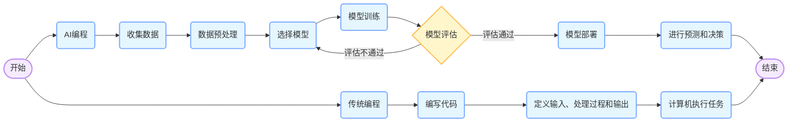

# 从传统编程到AI编程：程序员的进化史

> 关键词：传统编程、AI编程、程序员进化、编程范式转变、人工智能算法、机器学习、深度学习

> 摘要：本文深入探讨了从传统编程到AI编程的演变历程，阐述了程序员在这一进化过程中所面临的挑战与机遇。详细介绍了传统编程和AI编程的核心概念、算法原理、数学模型等内容，并通过项目实战展示了AI编程的实际应用。同时，推荐了相关的学习资源、开发工具和论文著作，最后对未来程序员的发展趋势与挑战进行了总结，旨在帮助程序员更好地理解和适应这一技术变革。

## 1. 背景介绍 
### 1.1 目的和范围
本文的目的在于全面梳理从传统编程到AI编程的发展脉络，深入分析这一转变对程序员带来的影响，以及程序员在这一过程中的进化路径。范围涵盖传统编程和AI编程的基本概念、技术原理、应用场景等方面，通过理论与实践相结合的方式，为程序员提供一个系统的学习和参考框架。

### 1.2 预期读者
本文主要面向广大程序员群体，无论是初入编程领域的新手，还是有一定经验的资深开发者，都能从本文中获取有价值的信息。同时，对于对编程技术发展感兴趣的相关专业学生、研究人员以及行业从业者，也具有一定的参考意义。

### 1.3 文档结构概述
本文将按照以下结构展开：首先介绍传统编程和AI编程的核心概念与联系，包括其原理和架构；接着详细阐述AI编程中核心算法的原理和具体操作步骤，并给出相应的Python源代码；然后介绍相关的数学模型和公式，并举例说明；通过项目实战展示AI编程的实际应用，包括开发环境搭建、源代码实现和代码解读；分析AI编程的实际应用场景；推荐相关的学习资源、开发工具和论文著作；最后总结未来程序员的发展趋势与挑战，并提供常见问题解答和扩展阅读参考资料。

### 1.4 术语表
#### 1.4.1 核心术语定义
- **传统编程**：指基于明确的规则和逻辑，通过编写一系列指令来实现特定功能的编程方式。程序员需要精确地定义输入、处理过程和输出，计算机按照预定的程序执行任务。
- **AI编程**：利用人工智能技术，使计算机能够模拟人类的智能行为，如学习、推理、决策等。主要包括机器学习、深度学习等技术，通过数据驱动的方式让计算机自动学习和优化模型。
- **机器学习**：是AI编程的一个重要分支，它通过算法让计算机从数据中学习模式和规律，并利用这些知识进行预测和决策。
- **深度学习**：是一种基于神经网络的机器学习技术，通过构建多层神经网络来学习数据的深层次特征，在图像识别、自然语言处理等领域取得了显著的成果。

#### 1.4.2 相关概念解释
- **编程范式**：是指编程的基本风格和方法，常见的编程范式包括面向过程编程、面向对象编程、函数式编程等。不同的编程范式有不同的特点和适用场景。
- **数据驱动**：在AI编程中，数据是核心。通过大量的数据来训练模型，让模型自动学习数据中的模式和规律，从而实现智能决策。
- **模型训练**：是机器学习和深度学习中的关键步骤，通过将数据输入到模型中，调整模型的参数，使模型能够更好地拟合数据，提高预测的准确性。

#### 1.4.3 缩略词列表
- **AI**：Artificial Intelligence，人工智能
- **ML**：Machine Learning，机器学习
- **DL**：Deep Learning，深度学习
- **NN**：Neural Network，神经网络
- **API**：Application Programming Interface，应用程序编程接口

## 2. 核心概念与联系 
### 2.1 传统编程的核心概念
传统编程主要基于确定性的逻辑和规则，程序员通过编写代码来告诉计算机如何执行任务。常见的编程范式包括面向过程编程、面向对象编程和函数式编程。

#### 2.1.1 面向过程编程
面向过程编程是一种以过程为中心的编程范式，将问题分解为一系列的步骤，每个步骤对应一个函数或子程序。程序的执行流程是按照预先定义的顺序依次调用这些函数。例如，一个简单的计算两个数之和的程序可以用Python实现如下：
```python
def add_numbers(a, b):
    return a + b

result = add_numbers(3, 5)
print(result)
```
#### 2.1.2 面向对象编程
面向对象编程是一种以对象为中心的编程范式，将数据和操作数据的方法封装在对象中。通过定义类和对象，利用继承、多态等特性来实现代码的复用和扩展。以下是一个简单的面向对象编程示例：
```python
class Rectangle:
    def __init__(self, length, width):
        self.length = length
        self.width = width

    def area(self):
        return self.length * self.width

rect = Rectangle(4, 5)
print(rect.area())
```
#### 2.1.3 函数式编程
函数式编程强调将计算视为函数的求值，避免使用共享状态和可变数据。函数式编程的特点包括不可变数据、纯函数、高阶函数等。以下是一个简单的函数式编程示例：
```python
numbers = [1, 2, 3, 4, 5]
squared_numbers = list(map(lambda x: x**2, numbers))
print(squared_numbers)
```

### 2.2 AI编程的核心概念
AI编程主要基于机器学习和深度学习技术，通过数据驱动的方式让计算机自动学习和优化模型。

#### 2.2.1 机器学习
机器学习是让计算机从数据中学习模式和规律的技术。常见的机器学习任务包括分类、回归、聚类等。以下是一个简单的线性回归示例：
```python
import numpy as np
from sklearn.linear_model import LinearRegression

# 生成一些示例数据
X = np.array([1, 2, 3, 4, 5]).reshape(-1, 1)
y = np.array([2, 4, 6, 8, 10])

# 创建线性回归模型
model = LinearRegression()
# 训练模型
model.fit(X, y)
# 进行预测
new_X = np.array([6]).reshape(-1, 1)
prediction = model.predict(new_X)
print(prediction)
```
#### 2.2.2 深度学习
深度学习是一种基于神经网络的机器学习技术，通过构建多层神经网络来学习数据的深层次特征。常见的深度学习模型包括卷积神经网络（CNN）、循环神经网络（RNN）等。以下是一个简单的使用Keras构建的神经网络示例：
```python
from keras.models import Sequential
from keras.layers import Dense

# 创建一个简单的神经网络模型
model = Sequential()
model.add(Dense(10, input_dim=1, activation='relu'))
model.add(Dense(1, activation='linear'))

# 编译模型
model.compile(loss='mean_squared_error', optimizer='adam')

# 训练模型
model.fit(X, y, epochs=100, batch_size=1)

# 进行预测
prediction = model.predict(new_X)
print(prediction)
```

### 2.3 传统编程与AI编程的联系
传统编程和AI编程并不是相互独立的，而是相互补充的。传统编程在处理确定性问题和实现基础功能方面具有优势，而AI编程在处理复杂的、不确定的问题和从数据中学习模式方面表现出色。在实际应用中，常常将传统编程和AI编程结合起来，发挥各自的优势。例如，在一个智能安防系统中，传统编程可以用于实现系统的基本架构和功能，如视频采集、数据传输等，而AI编程可以用于对视频中的图像进行分析和识别，实现目标检测和行为分析等功能。

### 2.4 核心概念原理和架构的文本示意图
传统编程主要基于程序员编写的规则和逻辑，计算机按照预定的程序执行任务。而AI编程则是通过数据驱动的方式，让计算机从数据中学习模式和规律，自动调整模型的参数，以实现智能决策。其原理和架构的文本示意图如下：

传统编程：程序员编写代码 -> 定义输入、处理过程和输出 -> 计算机按照程序执行任务

AI编程：收集数据 -> 数据预处理 -> 选择模型 -> 模型训练 -> 模型评估 -> 模型部署 -> 进行预测和决策

### 2.5 Mermaid流程图


## 3. 核心算法原理 & 具体操作步骤 
### 3.1 机器学习中的核心算法原理
#### 3.1.1 线性回归
线性回归是一种用于预测连续数值的机器学习算法。其基本原理是通过找到一条最佳拟合直线，使得数据点到该直线的误差平方和最小。

线性回归的数学模型可以表示为：$y = \theta_0 + \theta_1x_1 + \theta_2x_2 + \cdots + \theta_nx_n$，其中 $y$ 是预测值，$x_1, x_2, \cdots, x_n$ 是输入特征，$\theta_0, \theta_1, \cdots, \theta_n$ 是模型的参数。

具体操作步骤如下：
1. **数据准备**：收集包含输入特征和目标值的数据集，并将其划分为训练集和测试集。
2. **模型选择**：选择线性回归模型。
3. **模型训练**：使用训练集数据来估计模型的参数 $\theta$。常见的方法是最小二乘法，即通过最小化误差平方和来求解 $\theta$。
4. **模型评估**：使用测试集数据来评估模型的性能，常用的评估指标包括均方误差（MSE）、均方根误差（RMSE）等。
5. **模型预测**：使用训练好的模型对新的数据进行预测。

以下是一个使用Python实现线性回归的示例代码：
```python
import numpy as np
from sklearn.model_selection import train_test_split
from sklearn.linear_model import LinearRegression
from sklearn.metrics import mean_squared_error

# 生成一些示例数据
X = np.array([1, 2, 3, 4, 5, 6, 7, 8, 9, 10]).reshape(-1, 1)
y = np.array([2, 4, 6, 8, 10, 12, 14, 16, 18, 20])

# 划分训练集和测试集
X_train, X_test, y_train, y_test = train_test_split(X, y, test_size=0.2, random_state=42)

# 创建线性回归模型
model = LinearRegression()

# 训练模型
model.fit(X_train, y_train)

# 进行预测
y_pred = model.predict(X_test)

# 评估模型
mse = mean_squared_error(y_test, y_pred)
print(f"均方误差: {mse}")
```
#### 3.1.2 逻辑回归
逻辑回归是一种用于分类的机器学习算法，主要用于二分类问题。其基本原理是通过逻辑函数（Sigmoid函数）将线性回归的输出映射到 $[0, 1]$ 区间，从而得到样本属于某个类别的概率。

逻辑回归的数学模型可以表示为：$P(y=1|x) = \frac{1}{1 + e^{-(\theta_0 + \theta_1x_1 + \theta_2x_2 + \cdots + \theta_nx_n)}}$，其中 $P(y=1|x)$ 是样本 $x$ 属于正类的概率。

具体操作步骤如下：
1. **数据准备**：收集包含输入特征和类别标签的数据集，并将其划分为训练集和测试集。
2. **模型选择**：选择逻辑回归模型。
3. **模型训练**：使用训练集数据来估计模型的参数 $\theta$。常用的方法是最大似然估计，即通过最大化似然函数来求解 $\theta$。
4. **模型评估**：使用测试集数据来评估模型的性能，常用的评估指标包括准确率、召回率、F1值等。
5. **模型预测**：使用训练好的模型对新的数据进行预测，根据概率值判断样本的类别。

以下是一个使用Python实现逻辑回归的示例代码：
```python
from sklearn.datasets import make_classification
from sklearn.model_selection import train_test_split
from sklearn.linear_model import LogisticRegression
from sklearn.metrics import accuracy_score

# 生成一些示例数据
X, y = make_classification(n_samples=100, n_features=4, random_state=42)

# 划分训练集和测试集
X_train, X_test, y_train, y_test = train_test_split(X, y, test_size=0.2, random_state=42)

# 创建逻辑回归模型
model = LogisticRegression()

# 训练模型
model.fit(X_train, y_train)

# 进行预测
y_pred = model.predict(X_test)

# 评估模型
accuracy = accuracy_score(y_test, y_pred)
print(f"准确率: {accuracy}")
```

### 3.2 深度学习中的核心算法原理
#### 3.2.1 神经网络
神经网络是一种模仿人类神经系统的计算模型，由多个神经元组成。每个神经元接收输入信号，经过加权求和和激活函数处理后，输出一个信号。多个神经元组成一层，多层神经元相互连接形成神经网络。

神经网络的训练过程主要包括前向传播和反向传播两个阶段。前向传播是将输入数据从输入层传递到输出层，计算出模型的输出；反向传播是根据模型的输出和真实标签之间的误差，通过链式法则计算出每个参数的梯度，然后使用优化算法更新参数。

具体操作步骤如下：
1. **数据准备**：收集包含输入特征和目标值的数据集，并将其划分为训练集和测试集。对数据进行预处理，如归一化、标准化等。
2. **模型构建**：定义神经网络的结构，包括输入层、隐藏层和输出层的神经元数量，以及激活函数的选择。
3. **模型编译**：选择损失函数、优化算法和评估指标。
4. **模型训练**：使用训练集数据对模型进行训练，通过多次迭代更新模型的参数。
5. **模型评估**：使用测试集数据来评估模型的性能。
6. **模型预测**：使用训练好的模型对新的数据进行预测。

以下是一个使用Keras构建简单神经网络的示例代码：
```python
from keras.models import Sequential
from keras.layers import Dense
from sklearn.datasets import make_classification
from sklearn.model_selection import train_test_split
from sklearn.preprocessing import StandardScaler
from sklearn.metrics import accuracy_score

# 生成一些示例数据
X, y = make_classification(n_samples=1000, n_features=10, random_state=42)

# 划分训练集和测试集
X_train, X_test, y_train, y_test = train_test_split(X, y, test_size=0.2, random_state=42)

# 数据预处理
scaler = StandardScaler()
X_train = scaler.fit_transform(X_train)
X_test = scaler.transform(X_test)

# 创建神经网络模型
model = Sequential()
model.add(Dense(10, input_dim=10, activation='relu'))
model.add(Dense(1, activation='sigmoid'))

# 编译模型
model.compile(loss='binary_crossentropy', optimizer='adam', metrics=['accuracy'])

# 训练模型
model.fit(X_train, y_train, epochs=100, batch_size=32, validation_data=(X_test, y_test))

# 进行预测
y_pred = model.predict_classes(X_test)

# 评估模型
accuracy = accuracy_score(y_test, y_pred)
print(f"准确率: {accuracy}")
```
#### 3.2.2 卷积神经网络（CNN）
卷积神经网络是一种专门用于处理具有网格结构数据（如图像）的神经网络。其主要特点是使用卷积层、池化层和全连接层来提取数据的特征。

卷积层通过卷积核在输入数据上滑动，进行卷积操作，提取数据的局部特征。池化层用于降低数据的维度，减少计算量，同时增强模型的鲁棒性。全连接层将卷积层和池化层提取的特征进行整合，输出最终的预测结果。

具体操作步骤如下：
1. **数据准备**：收集图像数据集，并将其划分为训练集和测试集。对图像进行预处理，如缩放、裁剪、归一化等。
2. **模型构建**：定义CNN的结构，包括卷积层、池化层和全连接层的数量和参数。
3. **模型编译**：选择损失函数、优化算法和评估指标。
4. **模型训练**：使用训练集数据对模型进行训练，通过多次迭代更新模型的参数。
5. **模型评估**：使用测试集数据来评估模型的性能。
6. **模型预测**：使用训练好的模型对新的图像进行预测。

以下是一个使用Keras构建简单CNN的示例代码：
```python
from keras.models import Sequential
from keras.layers import Conv2D, MaxPooling2D, Flatten, Dense
from keras.datasets import mnist
from keras.utils import to_categorical

# 加载MNIST数据集
(X_train, y_train), (X_test, y_test) = mnist.load_data()

# 数据预处理
X_train = X_train.reshape(-1, 28, 28, 1).astype('float32') / 255
X_test = X_test.reshape(-1, 28, 28, 1).astype('float32') / 255
y_train = to_categorical(y_train)
y_test = to_categorical(y_test)

# 创建CNN模型
model = Sequential()
model.add(Conv2D(32, (3, 3), activation='relu', input_shape=(28, 28, 1)))
model.add(MaxPooling2D((2, 2)))
model.add(Conv2D(64, (3, 3), activation='relu'))
model.add(MaxPooling2D((2, 2)))
model.add(Flatten())
model.add(Dense(64, activation='relu'))
model.add(Dense(10, activation='softmax'))

# 编译模型
model.compile(loss='categorical_crossentropy', optimizer='adam', metrics=['accuracy'])

# 训练模型
model.fit(X_train, y_train, epochs=10, batch_size=32, validation_data=(X_test, y_test))

# 进行预测
y_pred = model.predict_classes(X_test)

# 评估模型
accuracy = model.evaluate(X_test, y_test)[1]
print(f"准确率: {accuracy}")
```

## 4. 数学模型和公式 & 详细讲解 & 举例说明 
### 4.1 线性回归的数学模型和公式
线性回归的数学模型可以表示为：
$$y = \theta_0 + \theta_1x_1 + \theta_2x_2 + \cdots + \theta_nx_n + \epsilon$$
其中 $y$ 是目标值，$x_1, x_2, \cdots, x_n$ 是输入特征，$\theta_0, \theta_1, \cdots, \theta_n$ 是模型的参数，$\epsilon$ 是误差项。

为了估计模型的参数 $\theta$，我们通常使用最小二乘法。最小二乘法的目标是最小化误差平方和：
$$J(\theta) = \frac{1}{2m}\sum_{i=1}^{m}(h_{\theta}(x^{(i)}) - y^{(i)})^2$$
其中 $m$ 是样本数量，$h_{\theta}(x^{(i)})$ 是模型对第 $i$ 个样本的预测值，$y^{(i)}$ 是第 $i$ 个样本的真实值。

通过对 $J(\theta)$ 求偏导数并令其等于0，可以得到 $\theta$ 的最优解。在实际应用中，我们通常使用梯度下降算法来迭代求解 $\theta$。

梯度下降算法的更新公式为：
$$\theta_j := \theta_j - \alpha\frac{\partial J(\theta)}{\partial \theta_j}$$
其中 $\alpha$ 是学习率，控制每次更新的步长。

举例说明：假设我们有一个简单的线性回归问题，输入特征 $x$ 和目标值 $y$ 满足 $y = 2x + 1$。我们收集了一些样本数据：
| $x$ | $y$ |
|---|---|
| 1 | 3 |
| 2 | 5 |
| 3 | 7 |
| 4 | 9 |
| 5 | 11 |

我们的目标是通过这些样本数据来估计模型的参数 $\theta_0$ 和 $\theta_1$。

首先，我们初始化 $\theta_0$ 和 $\theta_1$ 为0。然后，使用梯度下降算法进行迭代更新：
```python
import numpy as np

# 样本数据
X = np.array([1, 2, 3, 4, 5]).reshape(-1, 1)
y = np.array([3, 5, 7, 9, 11])

# 初始化参数
theta_0 = 0
theta_1 = 0

# 学习率
alpha = 0.01

# 迭代次数
num_iterations = 1000

# 梯度下降算法
for iteration in range(num_iterations):
    # 计算预测值
    h = theta_0 + theta_1 * X
    
    # 计算误差
    error = h - y
    
    # 计算梯度
    gradient_0 = np.sum(error) / len(X)
    gradient_1 = np.sum(error * X) / len(X)
    
    # 更新参数
    theta_0 = theta_0 - alpha * gradient_0
    theta_1 = theta_1 - alpha * gradient_1

print(f"估计的参数: theta_0 = {theta_0}, theta_1 = {theta_1}")
```
通过多次迭代，我们可以得到接近真实值的参数估计。

### 4.2 逻辑回归的数学模型和公式
逻辑回归的数学模型可以表示为：
$$P(y=1|x) = \frac{1}{1 + e^{-(\theta_0 + \theta_1x_1 + \theta_2x_2 + \cdots + \theta_nx_n)}}$$
其中 $P(y=1|x)$ 是样本 $x$ 属于正类的概率。

为了估计模型的参数 $\theta$，我们通常使用最大似然估计。最大似然估计的目标是最大化似然函数：
$$L(\theta) = \prod_{i=1}^{m}P(y^{(i)}|x^{(i)}; \theta)$$
为了方便计算，我们通常对似然函数取对数，得到对数似然函数：
$$\ell(\theta) = \log L(\theta) = \sum_{i=1}^{m}[y^{(i)}\log P(y^{(i)}|x^{(i)}; \theta) + (1 - y^{(i)})\log(1 - P(y^{(i)}|x^{(i)}; \theta))]$$

我们的目标是最大化 $\ell(\theta)$，可以使用梯度上升算法来迭代求解 $\theta$。梯度上升算法的更新公式为：
$$\theta_j := \theta_j + \alpha\frac{\partial \ell(\theta)}{\partial \theta_j}$$

举例说明：假设我们有一个二分类问题，输入特征 $x$ 和类别标签 $y$ 如下：
| $x$ | $y$ |
|---|---|
| 1 | 1 |
| 2 | 1 |
| 3 | 0 |
| 4 | 0 |
| 5 | 0 |

我们的目标是通过这些样本数据来估计模型的参数 $\theta_0$ 和 $\theta_1$。

```python
import numpy as np

# 样本数据
X = np.array([1, 2, 3, 4, 5]).reshape(-1, 1)
y = np.array([1, 1, 0, 0, 0])

# 初始化参数
theta_0 = 0
theta_1 = 0

# 学习率
alpha = 0.01

# 迭代次数
num_iterations = 1000

# 逻辑函数
def sigmoid(z):
    return 1 / (1 + np.exp(-z))

# 梯度上升算法
for iteration in range(num_iterations):
    # 计算线性组合
    z = theta_0 + theta_1 * X
    
    # 计算概率
    p = sigmoid(z)
    
    # 计算误差
    error = y - p
    
    # 计算梯度
    gradient_0 = np.sum(error)
    gradient_1 = np.sum(error * X)
    
    # 更新参数
    theta_0 = theta_0 + alpha * gradient_0
    theta_1 = theta_1 + alpha * gradient_1

print(f"估计的参数: theta_0 = {theta_0}, theta_1 = {theta_1}")
```
通过多次迭代，我们可以得到接近最优值的参数估计。

### 4.3 神经网络的数学模型和公式
神经网络的基本单元是神经元，神经元的输出可以表示为：
$$a = f(\sum_{i=1}^{n}w_ix_i + b)$$
其中 $x_1, x_2, \cdots, x_n$ 是输入信号，$w_1, w_2, \cdots, w_n$ 是权重，$b$ 是偏置，$f$ 是激活函数。

常见的激活函数包括Sigmoid函数、ReLU函数等。

在神经网络的训练过程中，我们使用反向传播算法来计算梯度并更新参数。反向传播算法的核心是链式法则，通过计算误差对每个参数的梯度，来更新参数。

举例说明：假设我们有一个简单的两层神经网络，输入层有2个神经元，隐藏层有3个神经元，输出层有1个神经元。输入数据为 $x = [1, 2]$，真实标签为 $y = 1$。

```python
import numpy as np

# 输入数据
x = np.array([1, 2]).reshape(-1, 1)
y = np.array([1])

# 初始化权重和偏置
W1 = np.random.rand(3, 2)
b1 = np.random.rand(3, 1)
W2 = np.random.rand(1, 3)
b2 = np.random.rand(1, 1)

# 学习率
alpha = 0.01

# 迭代次数
num_iterations = 1000

# 激活函数
def sigmoid(z):
    return 1 / (1 + np.exp(-z))

# 反向传播算法
for iteration in range(num_iterations):
    # 前向传播
    z1 = np.dot(W1, x) + b1
    a1 = sigmoid(z1)
    z2 = np.dot(W2, a1) + b2
    a2 = sigmoid(z2)
    
    # 计算误差
    error = a2 - y
    
    # 反向传播
    delta2 = error * a2 * (1 - a2)
    delta1 = np.dot(W2.T, delta2) * a1 * (1 - a1)
    
    # 计算梯度
    dW2 = np.dot(delta2, a1.T)
    db2 = delta2
    dW1 = np.dot(delta1, x.T)
    db1 = delta1
    
    # 更新参数
    W2 = W2 - alpha * dW2
    b2 = b2 - alpha * db2
    W1 = W1 - alpha * dW1
    b1 = b1 - alpha * db1

print(f"更新后的权重和偏置: W1 = {W1}, b1 = {b1}, W2 = {W2}, b2 = {b2}")
```
通过多次迭代，我们可以不断更新权重和偏置，使得模型的输出更接近真实标签。

## 5. 项目实战：代码实际案例和详细解释说明 
### 5.1  开发环境搭建
#### 5.1.1 安装Python
首先，需要安装Python开发环境。可以从Python官方网站（https://www.python.org/downloads/） 下载适合自己操作系统的Python安装包，并按照安装向导进行安装。

#### 5.1.2 安装必要的库
在AI编程中，常用的库包括NumPy、Pandas、Scikit-learn、Keras、TensorFlow等。可以使用pip命令来安装这些库：
```sh
pip install numpy pandas scikit-learn keras tensorflow
```

#### 5.1.3 选择开发工具
可以选择适合自己的开发工具，如PyCharm、Jupyter Notebook等。PyCharm是一款功能强大的Python集成开发环境，适合开发大型项目；Jupyter Notebook是一个交互式的开发环境，适合进行数据分析和模型训练的实验。

### 5.2  源代码详细实现和代码解读
#### 5.2.1 项目概述
我们将实现一个简单的手写数字识别项目，使用MNIST数据集和卷积神经网络（CNN）模型。

#### 5.2.2 源代码实现
```python
from keras.datasets import mnist
from keras.utils import to_categorical
from keras.models import Sequential
from keras.layers import Conv2D, MaxPooling2D, Flatten, Dense
from keras.optimizers import Adam

# 加载MNIST数据集
(X_train, y_train), (X_test, y_test) = mnist.load_data()

# 数据预处理
X_train = X_train.reshape(-1, 28, 28, 1).astype('float32') / 255
X_test = X_test.reshape(-1, 28, 28, 1).astype('float32') / 255
y_train = to_categorical(y_train)
y_test = to_categorical(y_test)

# 创建CNN模型
model = Sequential()
model.add(Conv2D(32, (3, 3), activation='relu', input_shape=(28, 28, 1)))
model.add(MaxPooling2D((2, 2)))
model.add(Conv2D(64, (3, 3), activation='relu'))
model.add(MaxPooling2D((2, 2)))
model.add(Flatten())
model.add(Dense(64, activation='relu'))
model.add(Dense(10, activation='softmax'))

# 编译模型
model.compile(optimizer=Adam(learning_rate=0.001), loss='categorical_crossentropy', metrics=['accuracy'])

# 训练模型
model.fit(X_train, y_train, epochs=10, batch_size=32, validation_data=(X_test, y_test))

# 评估模型
test_loss, test_acc = model.evaluate(X_test, y_test)
print(f"测试集损失: {test_loss}, 测试集准确率: {test_acc}")
```
#### 5.2.3 代码解读
1. **数据加载**：使用 `mnist.load_data()` 函数加载MNIST数据集，该数据集包含60000个训练样本和10000个测试样本。
2. **数据预处理**：将图像数据的形状调整为 `(28, 28, 1)`，并将像素值归一化到 `[0, 1]` 区间。将类别标签进行one-hot编码。
3. **模型构建**：使用 `Sequential` 模型构建CNN模型，包含两个卷积层、两个池化层和两个全连接层。
4. **模型编译**：选择Adam优化器，`categorical_crossentropy` 损失函数和 `accuracy` 评估指标。
5. **模型训练**：使用 `fit` 方法对模型进行训练，指定训练集、训练轮数、批次大小和验证集。
6. **模型评估**：使用 `evaluate` 方法对模型进行评估，得到测试集的损失和准确率。

### 5.3  代码解读与分析
#### 5.3.1 卷积层的作用
卷积层通过卷积核在输入图像上滑动，进行卷积操作，提取图像的局部特征。不同的卷积核可以提取不同的特征，如边缘、纹理等。

#### 5.3.2 池化层的作用
池化层用于降低图像的维度，减少计算量，同时增强模型的鲁棒性。常见的池化操作包括最大池化和平均池化。

#### 5.3.3 全连接层的作用
全连接层将卷积层和池化层提取的特征进行整合，输出最终的预测结果。在手写数字识别任务中，全连接层的输出是一个长度为10的向量，表示每个数字的概率。

#### 5.3.4 激活函数的作用
激活函数用于引入非线性因素，使得神经网络能够学习到更复杂的模式。在CNN中，常用的激活函数包括ReLU函数和Softmax函数。ReLU函数可以加速模型的训练，Softmax函数可以将输出转换为概率分布。

## 6. 实际应用场景 
### 6.1 图像识别
AI编程在图像识别领域有着广泛的应用，如人脸识别、物体检测、图像分类等。例如，在安防领域，人脸识别技术可以用于门禁系统、监控系统等，提高安全性；在医疗领域，图像识别技术可以用于医学影像诊断，辅助医生进行疾病的检测和诊断。

### 6.2 自然语言处理
自然语言处理是AI编程的另一个重要应用领域，包括文本分类、情感分析、机器翻译、问答系统等。例如，在智能客服领域，问答系统可以自动回答用户的问题，提高服务效率；在信息检索领域，文本分类和情感分析技术可以帮助用户快速找到相关的信息。

### 6.3 推荐系统
推荐系统是AI编程在电子商务、社交媒体等领域的重要应用。通过分析用户的历史行为和偏好，推荐系统可以为用户推荐个性化的商品、内容等。例如，在电商平台上，推荐系统可以根据用户的浏览记录和购买历史，为用户推荐相关的商品，提高用户的购买转化率。

### 6.4 自动驾驶
自动驾驶是AI编程在交通领域的重要应用。通过使用传感器、摄像头等设备收集车辆周围的环境信息，自动驾驶系统可以利用AI算法进行决策和控制，实现车辆的自动行驶。例如，特斯拉的自动驾驶技术就是利用了深度学习算法来实现目标检测、路径规划等功能。

### 6.5 金融风控
在金融领域，AI编程可以用于风险评估、欺诈检测等。通过分析用户的信用记录、交易行为等数据，金融机构可以利用AI算法来评估用户的风险等级，及时发现欺诈行为，保障金融安全。例如，银行可以利用机器学习算法来预测用户的违约概率，采取相应的风险控制措施。

## 7. 工具和资源推荐
### 7.1 学习资源推荐
#### 7.1.1 书籍推荐
- 《Python机器学习基础教程》：本书详细介绍了Python在机器学习中的应用，包括数据预处理、模型选择、评估等内容，适合初学者入门。
- 《深度学习》：由深度学习领域的三位先驱Ian Goodfellow、Yoshua Bengio和Aaron Courville撰写，是深度学习领域的经典著作，深入介绍了深度学习的理论和实践。
- 《机器学习》：周志华教授的著作，被称为“西瓜书”，全面介绍了机器学习的基本概念、算法和应用，是机器学习领域的权威教材。

#### 7.1.2 在线课程
- Coursera上的《机器学习》课程：由Andrew Ng教授授课，是机器学习领域的经典在线课程，涵盖了机器学习的基本概念、算法和应用。
- edX上的《深度学习》课程：由MIT的教授授课，深入介绍了深度学习的理论和实践，包括神经网络、卷积神经网络、循环神经网络等内容。
- 吴恩达的《深度学习专项课程》：包括《神经网络和深度学习》、《改善深层神经网络：超参数调试、正则化和优化》、《结构化机器学习项目》、《卷积神经网络》、《序列模型》等五门课程，全面介绍了深度学习的各个方面。

#### 7.1.3 技术博客和网站
- Medium：是一个技术博客平台，上面有很多关于AI编程的优秀文章，涵盖了机器学习、深度学习、自然语言处理等领域。
- Towards Data Science：是一个专注于数据科学和AI编程的技术博客，上面有很多高质量的文章和教程。
- Kaggle：是一个数据科学竞赛平台，上面有很多数据集和优秀的开源代码，可以学习到很多实际应用中的技巧和方法。

### 7.2 开发工具框架推荐
#### 7.2.1 IDE和编辑器
- PyCharm：是一款功能强大的Python集成开发环境，提供了代码编辑、调试、版本控制等功能，适合开发大型项目。
- Jupyter Notebook：是一个交互式的开发环境，适合进行数据分析和模型训练的实验。可以在浏览器中运行代码，并实时查看结果。
- Visual Studio Code：是一款轻量级的代码编辑器，支持多种编程语言和插件扩展，适合快速开发和调试。

#### 7.2.2 调试和性能分析工具
- TensorBoard：是TensorFlow的可视化工具，可以帮助用户可视化模型的训练过程、评估指标、网络结构等，方便用户进行调试和性能分析。
- PyTorch Profiler：是PyTorch的性能分析工具，可以帮助用户分析模型的性能瓶颈，优化代码的运行效率。
- Scikit-learn的GridSearchCV：可以帮助用户进行模型选择和超参数调优，通过网格搜索的方式找到最优的模型和参数组合。

#### 7.2.3 相关框架和库
- TensorFlow：是Google开发的深度学习框架，提供了丰富的工具和接口，支持多种深度学习模型的开发和训练。
- PyTorch：是Facebook开发的深度学习框架，具有动态图的特点，适合快速原型开发和研究。
- Scikit-learn：是一个简单而高效的机器学习库，提供了各种机器学习算法和工具，适合初学者入门和快速实现机器学习任务。
- Keras：是一个高级神经网络API，基于TensorFlow、Theano等后端，提供了简单易用的接口，适合快速搭建和训练神经网络模型。

### 7.3 相关论文著作推荐
#### 7.3.1 经典论文
- 《Gradient-Based Learning Applied to Document Recognition》：由Yann LeCun等人撰写，介绍了卷积神经网络（CNN）的基本原理和应用，是CNN领域的经典论文。
- 《ImageNet Classification with Deep Convolutional Neural Networks》：由Alex Krizhevsky等人撰写，介绍了AlexNet模型，开启了深度学习在图像识别领域的热潮。
- 《Long Short-Term Memory》：由Sepp Hochreiter和Jürgen Schmidhuber撰写，介绍了长短期记忆网络（LSTM）的基本原理和应用，是循环神经网络领域的经典论文。

#### 7.3.2 最新研究成果
- arXiv：是一个预印本平台，上面有很多最新的AI编程研究成果和论文，可以及时了解到领域内的最新动态。
- NeurIPS、ICML、CVPR等学术会议：是AI编程领域的顶级学术会议，上面有很多最新的研究成果和技术报告。

#### 7.3.3 应用案例分析
- 《Hands-On Machine Learning with Scikit-Learn, Keras, and TensorFlow: Concepts, Tools, and Techniques to Build Intelligent Systems》：本书通过大量的实际案例介绍了如何使用Scikit-learn、Keras和TensorFlow等工具和技术来构建智能系统，适合学习实际应用中的技巧和方法。
- 《Deep Learning in Practice: A Guide to Building Applied Machine Learning Systems》：本书介绍了深度学习在实际应用中的开发流程和方法，通过实际案例展示了如何解决实际问题。

## 8. 总结：未来发展趋势与挑战
### 8.1 未来发展趋势
#### 8.1.1 多模态融合
未来的AI编程将更加注重多模态融合，即结合图像、语音、文本等多种模态的数据，实现更加智能的交互和决策。例如，在智能客服领域，将语音识别、自然语言处理和图像识别技术相结合，可以实现更加自然和高效的交互。

#### 8.1.2 强化学习与决策智能
强化学习是一种通过智能体与环境进行交互，不断学习最优策略的机器学习技术。未来，强化学习将在自动驾驶、机器人控制、游戏等领域得到更广泛的应用，实现更加智能的决策和控制。

#### 8.1.3 边缘计算与AI
随着物联网的发展，边缘设备上的AI计算需求越来越大。未来，边缘计算与AI将深度融合，实现数据的实时处理和智能决策，减少数据传输的延迟和成本。

#### 8.1.4 可解释AI
随着AI技术的广泛应用，可解释AI变得越来越重要。未来，研究人员将致力于开发可解释的AI模型和算法，使得AI系统的决策过程和结果能够被人类理解和信任。

### 8.2 挑战
#### 8.2.1 数据隐私和安全
AI编程依赖于大量的数据，数据的隐私和安全问题成为了一个重要的挑战。如何保护用户的数据隐私，防止数据泄露和滥用，是未来需要解决的重要问题。

#### 8.2.2 模型可解释性
虽然深度学习模型在很多任务中取得了很好的效果，但其黑盒性质使得模型的决策过程难以理解。如何提高模型的可解释性，使得AI系统的决策能够被人类理解和信任，是未来需要解决的重要问题。

#### 8.2.3 计算资源和能源消耗
深度学习模型通常需要大量的计算资源和能源消耗，这限制了其在一些场景下的应用。如何优化模型结构和算法，降低计算资源和能源消耗，是未来需要解决的重要问题。

#### 8.2.4 伦理和法律问题
AI技术的发展也带来了一系列的伦理和法律问题，如算法偏见、责任归属等。如何制定相应的伦理和法律准则，规范AI技术的发展和应用，是未来需要解决的重要问题。

## 9. 附录：常见问题与解答
### 9.1 传统编程和AI编程有什么区别？
传统编程是基于明确的规则和逻辑，通过编写一系列指令来实现特定功能的编程方式。而AI编程是利用人工智能技术，使计算机能够模拟人类的智能行为，通过数据驱动的方式让计算机自动学习和优化模型。

### 9.2 学习AI编程需要具备哪些基础知识？
学习AI编程需要具备一定的数学基础，如线性代数、概率论、统计学等，以及编程基础，如Python语言。此外，还需要了解机器学习、深度学习等相关的概念和算法。

### 9.3 如何选择合适的AI编程框架？
选择合适的AI编程框架需要考虑多个因素，如项目需求、个人技术水平、框架的性能和易用性等。对于初学者来说，可以选择简单易用的框架，如Keras；对于有一定经验的开发者，可以选择功能强大的框架，如TensorFlow、PyTorch等。

### 9.4 如何提高AI模型的性能？
提高AI模型的性能可以从多个方面入手，如数据预处理、模型选择、超参数调优、模型融合等。此外，还可以使用