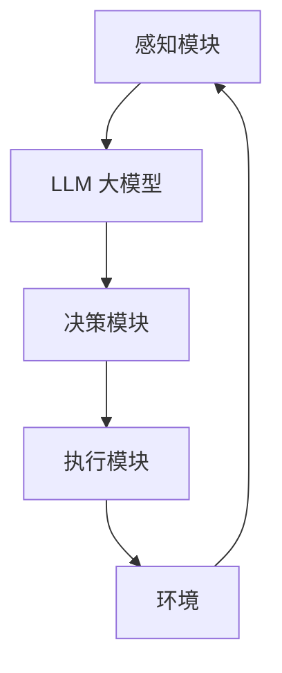

# 从零构建 AI Agent：LLM 大模型应用开发实践

> 关键词：AI Agent、LLM 大模型、应用开发、人工智能、自然语言处理、智能体、实践开发

> 摘要：本文聚焦于从零开始构建 AI Agent 的 LLM 大模型应用开发实践。首先介绍了开发的背景知识，包括目的、预期读者等内容。接着深入探讨了 AI Agent 和 LLM 大模型的核心概念及联系，详细阐述了核心算法原理与具体操作步骤，并结合数学模型和公式进行讲解。通过项目实战，给出了代码实际案例并进行详细解释。同时，介绍了该技术的实际应用场景，推荐了相关的工具和资源。最后对未来发展趋势与挑战进行总结，并提供了常见问题解答和扩展阅读参考资料，旨在为开发者全面呈现构建 AI Agent 的 LLM 大模型应用开发的全过程。

## 1. 背景介绍 
### 1.1 目的和范围
随着人工智能技术的飞速发展，大语言模型（LLM）在自然语言处理领域取得了显著的成果。AI Agent 作为一种能够自主感知环境、做出决策并执行动作的智能实体，结合 LLM 大模型的强大语言理解和生成能力，有着广阔的应用前景。本文的目的在于引导开发者从零开始构建基于 LLM 大模型的 AI Agent 应用，涵盖了从核心概念的理解、算法原理的掌握、代码实现的实践，到实际应用场景的探索等多个方面，帮助开发者全面掌握相关技术。

### 1.2 预期读者
本文预期读者包括对人工智能、自然语言处理领域感兴趣的开发者、研究人员，以及希望深入了解和实践基于 LLM 大模型构建 AI Agent 应用的技术爱好者。无论是初学者想要快速入门，还是有一定经验的开发者寻求技术提升，都能从本文中获得有价值的信息。

### 1.3 文档结构概述
本文首先介绍背景知识，让读者对开发实践的目的和相关概念有初步了解。接着详细讲解核心概念与联系，帮助读者建立理论基础。通过核心算法原理和具体操作步骤的阐述，结合数学模型和公式，深入剖析技术原理。项目实战部分给出具体的代码案例和详细解释，让读者能够将理论知识应用到实际开发中。随后介绍实际应用场景，展示该技术的实用价值。工具和资源推荐部分为读者提供学习和开发的参考。最后对未来发展趋势与挑战进行总结，并提供常见问题解答和扩展阅读参考资料，形成一个完整的知识体系。

### 1.4 术语表
#### 1.4.1 核心术语定义
- **AI Agent（人工智能智能体）**：是一种能够感知环境、基于感知信息做出决策，并通过执行器对环境产生影响的智能实体。它可以自主地完成一系列任务，具有一定的自主性和适应性。
- **LLM（大语言模型）**：是一类基于深度学习的语言模型，通常具有大量的参数和强大的语言理解与生成能力。例如 GPT 系列、BERT 等，能够处理各种自然语言处理任务，如文本生成、问答系统等。
- **自然语言处理（NLP）**：是人工智能的一个重要领域，研究如何让计算机理解、处理和生成人类语言。它涉及到语言的理解、分析、生成等多个方面，包括词法分析、句法分析、语义理解等任务。

#### 1.4.2 相关概念解释
- **智能体架构**：指 AI Agent 的内部结构和组织方式，包括感知模块、决策模块和执行模块等。不同的架构设计会影响智能体的性能和功能。
- **语言模型微调**：在预训练的大语言模型基础上，使用特定的数据集对模型进行进一步训练，以适应特定的任务和领域。通过微调可以提高模型在特定任务上的性能。

#### 1.4.3 缩略词列表
- **LLM**：Large Language Model（大语言模型）
- **NLP**：Natural Language Processing（自然语言处理）
- **API**：Application Programming Interface（应用程序编程接口）

## 2. 核心概念与联系 
### 2.1 AI Agent 核心概念
AI Agent 是一种具有自主性、反应性、社会性和主动性的智能实体。自主性意味着它能够独立地感知环境、做出决策和执行动作，不需要人类的实时干预。反应性体现在它能够根据环境的变化及时做出相应的反应。社会性表示它可以与其他智能体或人类进行交互。主动性则是指它能够主动地发起行动，追求自己的目标。

AI Agent 的一般架构包括感知模块、决策模块和执行模块。感知模块负责获取环境信息，例如通过传感器获取物理环境的数据，或者通过网络获取文本、图像等信息。决策模块根据感知到的信息进行分析和推理，做出决策。执行模块则根据决策结果执行相应的动作，例如控制机器人的运动、生成文本回复等。

### 2.2 LLM 大模型核心概念
LLM 大模型是基于深度学习的语言模型，通常采用Transformer架构。Transformer 架构具有强大的并行计算能力和长序列处理能力，能够有效地捕捉文本中的语义信息。LLM 大模型通过在大规模的文本数据上进行预训练，学习到语言的统计规律和语义表示。

预训练过程中，模型通过无监督学习的方式学习语言的特征，例如预测下一个单词、填空等任务。预训练后的模型具有很强的语言理解和生成能力，可以应用于各种自然语言处理任务。

### 2.3 AI Agent 与 LLM 大模型的联系
LLM 大模型可以为 AI Agent 提供强大的语言处理能力。在 AI Agent 的决策模块中，LLM 大模型可以用于对感知到的文本信息进行理解和分析，帮助智能体做出更准确的决策。例如，在一个智能客服 AI Agent 中，LLM 大模型可以对用户的问题进行理解，生成合适的回复。

同时，AI Agent 可以为 LLM 大模型提供应用场景和上下文信息。AI Agent 在执行任务的过程中，会积累大量的上下文信息，这些信息可以作为 LLM 大模型的输入，帮助模型更好地理解任务和用户需求。

### 2.4 核心概念原理和架构的文本示意图
AI Agent 与 LLM 大模型结合的架构可以表示为：感知模块获取环境信息，将文本信息传递给 LLM 大模型进行处理。LLM 大模型对文本进行理解和分析，生成决策建议。决策模块根据 LLM 大模型的输出和其他信息进行综合决策，然后执行模块根据决策结果执行相应的动作。执行结果又会反馈到感知模块，形成一个闭环系统。

### 2.5 Mermaid 流程图


## 3. 核心算法原理 & 具体操作步骤 
### 3.1 核心算法原理
在基于 LLM 大模型构建 AI Agent 的过程中，核心算法主要涉及到 LLM 大模型的推理和决策算法。LLM 大模型的推理过程是指根据输入的文本，生成相应的输出文本。在实际应用中，通常使用预训练好的 LLM 大模型，并通过 API 进行调用。

决策算法则是根据 LLM 大模型的输出和其他信息，综合考虑各种因素，做出最终的决策。常见的决策算法包括规则引擎、基于机器学习的分类算法等。

### 3.2 具体操作步骤
#### 3.2.1 选择合适的 LLM 大模型
目前市场上有许多开源和商业的 LLM 大模型可供选择，例如 GPT 系列、BLOOM、Llama 等。在选择模型时，需要考虑模型的性能、成本、适用场景等因素。

#### 3.2.2 获取 API 密钥
如果选择使用商业的 LLM 大模型，通常需要获取相应的 API 密钥。通过 API 密钥可以调用模型的接口，进行文本生成等操作。

#### 3.2.3 编写代码调用 API
使用 Python 等编程语言编写代码，调用 LLM 大模型的 API。以下是一个使用 OpenAI GPT 模型的示例代码：

```python
import openai

# 设置 API 密钥
openai.api_key = "your_api_key"

def generate_text(prompt):
    try:
        response = openai.Completion.create(
            engine="text-davinci-003",
            prompt=prompt,
            max_tokens=100,
            temperature=0.7
        )
        return response.choices[0].text.strip()
    except Exception as e:
        print(f"Error: {e}")
        return ""

# 测试代码
prompt = "请介绍一下人工智能的发展历程"
result = generate_text(prompt)
print(result)
```

#### 3.2.4 实现决策算法
根据具体的应用场景，实现相应的决策算法。例如，在一个智能客服系统中，可以根据用户的问题类型和历史对话记录，选择合适的回复策略。

```python
# 简单的决策算法示例
def decision_making(user_question, history):
    if "产品介绍" in user_question:
        return "这是我们的产品介绍..."
    elif "价格咨询" in user_question:
        return "产品价格是..."
    else:
        return generate_text(user_question)
```

#### 3.2.5 集成感知和执行模块
将感知模块和执行模块与决策模块集成在一起，形成一个完整的 AI Agent 系统。感知模块负责获取用户的输入信息，执行模块负责将决策结果输出给用户。

```python
# 简单的 AI Agent 示例
def ai_agent():
    history = []
    while True:
        user_question = input("请输入你的问题（输入 '退出' 结束对话）：")
        if user_question == "退出":
            break
        history.append(user_question)
        response = decision_making(user_question, history)
        print(response)
        history.append(response)

if __name__ == "__main__":
    ai_agent()
```

## 4. 数学模型和公式 & 详细讲解 & 举例说明 
### 4.1 Transformer 架构的数学模型
Transformer 架构是 LLM 大模型的核心，其主要由多头自注意力机制（Multi - Head Self - Attention）和前馈神经网络（Feed - Forward Neural Network）组成。

#### 4.1.1 自注意力机制
自注意力机制的核心思想是计算输入序列中每个位置与其他位置的相关性，从而得到每个位置的加权表示。给定输入序列 $X = [x_1, x_2, \cdots, x_n]$，其中 $x_i$ 是第 $i$ 个位置的向量表示。自注意力机制的计算过程如下：

首先，将输入向量 $x_i$ 分别乘以三个不同的权重矩阵 $W^Q$、$W^K$ 和 $W^V$，得到查询向量 $q_i$、键向量 $k_i$ 和值向量 $v_i$：

$q_i = W^Q x_i$

$k_i = W^K x_i$

$v_i = W^V x_i$

然后，计算查询向量 $q_i$ 与所有键向量 $k_j$ 的点积相似度：

$s_{ij} = q_i^T k_j$

为了防止点积结果过大，对相似度进行缩放：

$\hat{s}_{ij} = \frac{s_{ij}}{\sqrt{d_k}}$

其中 $d_k$ 是键向量的维度。

接着，使用 softmax 函数将相似度转换为概率分布：

$a_{ij} = \frac{\exp(\hat{s}_{ij})}{\sum_{j = 1}^{n} \exp(\hat{s}_{ij})}$

最后，根据概率分布对值向量进行加权求和，得到输出向量 $z_i$：

$z_i = \sum_{j = 1}^{n} a_{ij} v_j$

#### 4.1.2 多头自注意力机制
多头自注意力机制是将自注意力机制并行执行多次，然后将结果拼接起来。假设有 $h$ 个头，每个头的计算过程与自注意力机制相同。最后将 $h$ 个头的输出拼接起来，并乘以一个权重矩阵 $W^O$ 得到最终的输出：

$MultiHead(Q, K, V) = Concat(head_1, head_2, \cdots, head_h)W^O$

其中 $head_i = Attention(QW_i^Q, KW_i^K, VW_i^V)$，$W_i^Q$、$W_i^K$ 和 $W_i^V$ 是第 $i$ 个头的权重矩阵。

#### 4.1.3 前馈神经网络
前馈神经网络由两个线性层和一个激活函数组成。对于输入向量 $z$，前馈神经网络的计算过程如下：

$FFN(z) = \max(0, zW_1 + b_1)W_2 + b_2$

其中 $W_1$、$W_2$ 是权重矩阵，$b_1$、$b_2$ 是偏置向量。

### 4.2 举例说明
假设我们有一个输入序列 $X = [x_1, x_2, x_3]$，其中 $x_i$ 是一个 5 维的向量。我们设置键向量、查询向量和值向量的维度 $d_k = d_q = d_v = 3$，头数 $h = 2$。

首先，计算查询向量、键向量和值向量：

$W^Q$ 是一个 $5 \times 3$ 的矩阵，$W^K$ 是一个 $5 \times 3$ 的矩阵，$W^V$ 是一个 $5 \times 3$ 的矩阵。

$q_1 = W^Q x_1$，$k_1 = W^K x_1$，$v_1 = W^V x_1$

$q_2 = W^Q x_2$，$k_2 = W^K x_2$，$v_2 = W^V x_2$

$q_3 = W^Q x_3$，$k_3 = W^K x_3$，$v_3 = W^V x_3$

然后，计算相似度矩阵：

$s_{11} = q_1^T k_1$，$s_{12} = q_1^T k_2$，$s_{13} = q_1^T k_3$

$\cdots$

$s_{33} = q_3^T k_3$

接着，进行缩放和 softmax 计算，得到概率分布矩阵：

$a_{ij} = \frac{\exp(\frac{s_{ij}}{\sqrt{3}})}{\sum_{j = 1}^{3} \exp(\frac{s_{ij}}{\sqrt{3}})}$

最后，根据概率分布对值向量进行加权求和，得到每个头的输出。将两个头的输出拼接起来，并乘以一个 $6 \times 5$ 的权重矩阵 $W^O$ 得到最终的输出。

## 5. 项目实战：代码实际案例和详细解释说明 
### 5.1 开发环境搭建
#### 5.1.1 安装 Python
首先需要安装 Python 环境，建议使用 Python 3.7 及以上版本。可以从 Python 官方网站（https://www.python.org/downloads/） 下载并安装。

#### 5.1.2 安装必要的库
使用 pip 命令安装必要的库，例如 openai、numpy 等。

```bash
pip install openai numpy
```

#### 5.1.3 获取 API 密钥
如果使用 OpenAI GPT 模型，需要在 OpenAI 官方网站上注册账号，并获取 API 密钥。

### 5.2 源代码详细实现和代码解读
#### 5.2.1 完整代码示例
```python
import openai

# 设置 API 密钥
openai.api_key = "your_api_key"

def generate_text(prompt):
    try:
        response = openai.Completion.create(
            engine="text-davinci-003",
            prompt=prompt,
            max_tokens=100,
            temperature=0.7
        )
        return response.choices[0].text.strip()
    except Exception as e:
        print(f"Error: {e}")
        return ""

# 简单的决策算法示例
def decision_making(user_question, history):
    if "产品介绍" in user_question:
        return "这是我们的产品介绍..."
    elif "价格咨询" in user_question:
        return "产品价格是..."
    else:
        return generate_text(user_question)

# 简单的 AI Agent 示例
def ai_agent():
    history = []
    while True:
        user_question = input("请输入你的问题（输入 '退出' 结束对话）：")
        if user_question == "退出":
            break
        history.append(user_question)
        response = decision_making(user_question, history)
        print(response)
        history.append(response)

if __name__ == "__main__":
    ai_agent()
```

#### 5.2.2 代码解读
- **generate_text 函数**：该函数用于调用 OpenAI GPT 模型的 API 进行文本生成。通过 `openai.Completion.create` 方法发送请求，指定模型引擎、输入提示、最大生成的词数和温度等参数。如果请求成功，返回生成的文本；如果出现错误，打印错误信息并返回空字符串。
- **decision_making 函数**：该函数是一个简单的决策算法，根据用户的问题类型进行判断。如果问题中包含“产品介绍”，则返回固定的产品介绍信息；如果包含“价格咨询”，则返回固定的价格信息；否则，调用 `generate_text` 函数生成相应的回复。
- **ai_agent 函数**：该函数实现了一个简单的 AI Agent 系统。通过一个无限循环不断获取用户的输入，将用户的问题添加到历史记录中，调用 `decision_making` 函数生成回复，并将回复添加到历史记录中。当用户输入“退出”时，退出循环，结束对话。

### 5.3 代码解读与分析
#### 5.3.1 优点
- **简单易懂**：代码结构简单，易于理解和实现，适合初学者入门。
- **可扩展性**：决策算法部分可以根据具体的应用场景进行扩展和优化，例如使用更复杂的机器学习模型进行决策。
- **灵活性**：通过调用 LLM 大模型的 API，可以方便地利用模型的强大语言处理能力。

#### 5.3.2 缺点
- **依赖外部 API**：代码依赖于 OpenAI GPT 模型的 API，可能会受到网络延迟、API 限制等因素的影响。
- **决策算法简单**：当前的决策算法比较简单，可能无法处理复杂的问题和场景。

#### 5.3.3 改进建议
- **本地部署模型**：可以考虑使用开源的 LLM 大模型，并在本地进行部署，减少对外部 API 的依赖。
- **优化决策算法**：使用更复杂的机器学习模型，如深度学习模型、强化学习模型等，提高决策的准确性和灵活性。

## 6. 实际应用场景 
### 6.1 智能客服
在智能客服系统中，AI Agent 可以结合 LLM 大模型的语言理解和生成能力，自动回答用户的问题。通过感知用户的输入，利用 LLM 大模型进行问题理解和分析，然后根据决策算法生成合适的回复。智能客服可以 24 小时不间断地为用户提供服务，提高服务效率和用户满意度。

### 6.2 智能写作助手
AI Agent 可以作为智能写作助手，帮助用户生成文章、故事、文案等。用户输入相关的主题和要求，AI Agent 利用 LLM 大模型生成相应的文本内容。智能写作助手可以提高写作效率，为用户提供创意和灵感。

### 6.3 智能教学辅助
在教育领域，AI Agent 可以作为智能教学辅助工具。它可以根据学生的问题和学习情况，提供个性化的学习建议和解答。通过与学生的互动，帮助学生更好地理解知识，提高学习效果。

### 6.4 智能游戏 NPC
在游戏中，AI Agent 可以作为非玩家角色（NPC），与玩家进行交互。利用 LLM 大模型的语言处理能力，NPC 可以理解玩家的对话，并做出相应的回应。这可以增加游戏的趣味性和真实感，提升玩家的游戏体验。

## 7. 工具和资源推荐
### 7.1 学习资源推荐
#### 7.1.1 书籍推荐
- 《深度学习》（Deep Learning）：由 Ian Goodfellow、Yoshua Bengio 和 Aaron Courville 合著，是深度学习领域的经典教材，介绍了深度学习的基本原理和方法。
- 《自然语言处理入门》：由何晗著，系统地介绍了自然语言处理的基本概念、算法和技术，适合初学者入门。
- 《Python 深度学习》（Deep Learning with Python）：由 Francois Chollet 著，结合 Keras 框架介绍了深度学习的实践方法，通过大量的代码示例帮助读者理解和应用深度学习技术。

#### 7.1.2 在线课程
- Coursera 上的“深度学习专项课程”（Deep Learning Specialization）：由 Andrew Ng 教授授课，全面介绍了深度学习的各个方面，包括神经网络、卷积神经网络、循环神经网络等。
- edX 上的“自然语言处理”（Natural Language Processing）：由华盛顿大学的教授授课，深入讲解了自然语言处理的理论和实践。
- 哔哩哔哩（B 站）上有许多关于人工智能和自然语言处理的教程视频，可以根据自己的需求进行学习。

#### 7.1.3 技术博客和网站
- Medium：是一个技术博客平台，上面有许多关于人工智能、自然语言处理的优秀文章，可以关注一些知名的博主和专栏。
- arXiv：是一个预印本论文平台，上面有许多最新的研究成果和技术报告，可以及时了解领域的最新动态。
- OpenAI 官方博客：可以了解 OpenAI 公司在人工智能领域的最新进展和研究成果。

### 7.2 开发工具框架推荐
#### 7.2.1 IDE和编辑器
- PyCharm：是一款专业的 Python 集成开发环境（IDE），具有代码编辑、调试、版本控制等功能，适合开发大型的 Python 项目。
- Visual Studio Code：是一款轻量级的代码编辑器，支持多种编程语言，具有丰富的插件生态系统，可以方便地进行 Python 开发。

#### 7.2.2 调试和性能分析工具
- PDB：是 Python 自带的调试器，可以在代码中设置断点，逐步执行代码，查看变量的值和程序的执行流程。
- cProfile：是 Python 的性能分析工具，可以统计程序中各个函数的执行时间和调用次数，帮助开发者找出性能瓶颈。

#### 7.2.3 相关框架和库
- OpenAI Python 库：用于调用 OpenAI GPT 模型的 API，方便进行文本生成等操作。
- Hugging Face Transformers：是一个开源的自然语言处理库，提供了许多预训练的语言模型和工具，方便开发者进行模型的加载、微调等操作。
- TensorFlow 和 PyTorch：是两个流行的深度学习框架，提供了丰富的工具和接口，用于构建和训练深度学习模型。

### 7.3 相关论文著作推荐
#### 7.3.1 经典论文
- “Attention Is All You Need”：介绍了 Transformer 架构，是自然语言处理领域的经典论文，为后续的大语言模型发展奠定了基础。
- “BERT: Pre-training of Deep Bidirectional Transformers for Language Understanding”：提出了 BERT 模型，开创了预训练 - 微调的自然语言处理范式。

#### 7.3.2 最新研究成果
可以关注 arXiv 上的最新论文，了解基于 LLM 大模型构建 AI Agent 的最新研究进展。例如，一些关于如何提高 AI Agent 的自主性和适应性的研究。

#### 7.3.3 应用案例分析
可以参考一些实际应用案例的论文，了解如何将 AI Agent 和 LLM 大模型应用到不同的领域。例如，智能客服系统、智能写作助手等领域的应用案例分析。

## 8. 总结：未来发展趋势与挑战
### 8.1 未来发展趋势
#### 8.1.1 更强的自主性
未来的 AI Agent 将具有更强的自主性，能够在复杂的环境中独立地感知、决策和执行任务。通过结合强化学习、元学习等技术，AI Agent 可以不断地学习和优化自己的行为，提高任务执行的效率和质量。

#### 8.1.2 多模态融合
AI Agent 将不仅仅局限于处理文本信息，还将融合图像、语音、视频等多模态信息。通过多模态融合，AI Agent 可以更全面地感知环境，做出更准确的决策。例如，在智能安防领域，AI Agent 可以结合图像和视频信息，实时监测异常情况并做出响应。

#### 8.1.3 个性化服务
随着用户数据的不断积累，AI Agent 将能够为用户提供更加个性化的服务。通过分析用户的偏好、历史行为等信息，AI Agent 可以根据用户的需求和特点，提供定制化的解决方案。例如，在智能推荐系统中，AI Agent 可以根据用户的兴趣爱好，推荐符合用户需求的商品和内容。

### 8.2 挑战
#### 8.2.1 伦理和法律问题
随着 AI Agent 的广泛应用，伦理和法律问题日益凸显。例如，AI Agent 的决策责任归属问题、隐私保护问题等。如何在技术发展的同时，确保 AI Agent 的行为符合伦理和法律规范，是一个亟待解决的问题。

#### 8.2.2 计算资源和能源消耗
LLM 大模型通常具有大量的参数，训练和推理过程需要消耗大量的计算资源和能源。如何提高模型的效率，降低计算资源和能源消耗，是当前面临的一个挑战。

#### 8.2.3 鲁棒性和可靠性
AI Agent 在实际应用中需要面对各种复杂的环境和情况，其鲁棒性和可靠性至关重要。如何提高 AI Agent 在不确定环境中的适应性和容错能力，确保其在各种情况下都能稳定运行，是需要进一步研究的问题。

## 9. 附录：常见问题与解答
### 9.1 如何选择合适的 LLM 大模型？
选择合适的 LLM 大模型需要考虑多个因素，如模型的性能、成本、适用场景等。如果对模型的性能要求较高，且预算充足，可以选择商业的大模型，如 OpenAI GPT 系列；如果注重开源和可定制性，可以选择开源的大模型，如 BLOOM、Llama 等。同时，还需要根据具体的应用场景，选择适合的模型架构和参数。

### 9.2 如何解决 API 调用的限制问题？
如果遇到 API 调用的限制问题，可以考虑以下几种方法：一是优化 API 调用的频率和方式，减少不必要的请求；二是使用多个 API 密钥，分散请求压力；三是考虑本地部署开源的大模型，减少对外部 API 的依赖。

### 9.3 如何提高 AI Agent 的决策准确性？
可以从以下几个方面提高 AI Agent 的决策准确性：一是优化决策算法，使用更复杂的机器学习模型，如深度学习模型、强化学习模型等；二是增加训练数据的多样性和质量，让 AI Agent 学习到更多的知识和模式；三是结合多源信息，如历史对话记录、用户行为数据等，提高决策的依据。

### 9.4 如何处理 AI Agent 的错误回复？
当 AI Agent 出现错误回复时，可以采取以下措施：一是收集错误回复的数据，进行分析和总结，找出问题所在；二是对决策算法进行优化和调整，提高模型的准确性；三是引入人工干预机制，当 AI Agent 无法准确回答问题时，将问题转接给人工客服进行处理。

## 10. 扩展阅读 & 参考资料
### 10.1 扩展阅读
- 《人工智能：现代方法》（Artificial Intelligence: A Modern Approach）：全面介绍了人工智能的各个领域和方法，是人工智能领域的经典教材。
- 《语言与机器：计算机科学理论与实践》（Language and Machines: An Introduction to the Theory of Computer Science）：深入讲解了计算机科学的理论基础，包括自动机理论、形式语言等内容。

### 10.2 参考资料
- OpenAI 官方文档：https://platform.openai.com/docs/
- Hugging Face 官方文档：https://huggingface.co/docs/
- TensorFlow 官方文档：https://www.tensorflow.org/api_docs
- PyTorch 官方文档：https://pytorch.org/docs/stable/index.html