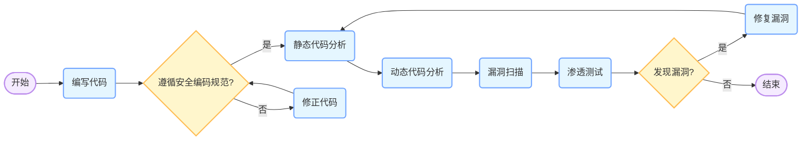

# 代码安全防护：漏洞预防方案

> 关键词：代码安全、漏洞预防、安全防护、软件漏洞、安全编程

> 摘要：本文围绕代码安全防护展开，深入探讨漏洞预防方案。从背景知识入手，介绍代码安全防护的重要性及相关概念，详细阐述核心算法原理、数学模型，通过项目实战案例展示具体实现和代码解读，分析实际应用场景，推荐相关工具和资源，最后总结未来发展趋势与挑战，并对常见问题进行解答，旨在为开发者提供全面、系统的代码安全防护和漏洞预防指导。

## 1. 背景介绍 
### 1.1 目的和范围
在当今数字化时代，软件系统广泛应用于各个领域，代码的安全性至关重要。一个小小的安全漏洞可能导致数据泄露、系统瘫痪、经济损失甚至危及国家安全。本文章的目的在于提供一套全面的代码安全防护和漏洞预防方案，涵盖多种常见的安全漏洞类型，包括但不限于 SQL 注入、跨站脚本攻击（XSS）、缓冲区溢出等。范围涉及从代码编写阶段到部署上线后的整个软件生命周期的安全防护措施。

### 1.2 预期读者
本文预期读者包括软件开发人员、软件测试人员、安全工程师、软件架构师以及对代码安全防护感兴趣的技术爱好者。无论是新手开发者还是经验丰富的专业人士，都能从本文中获取有价值的信息和实用的技术。

### 1.3 文档结构概述
本文将首先介绍相关的背景知识，包括术语定义和概念解释。接着阐述核心概念及其联系，给出原理和架构的文本示意图和 Mermaid 流程图。然后详细讲解核心算法原理和具体操作步骤，结合 Python 源代码进行说明。之后介绍数学模型和公式，并举例说明。通过项目实战展示代码实际案例和详细解释。分析实际应用场景，推荐相关的工具和资源。最后总结未来发展趋势与挑战，解答常见问题，并提供扩展阅读和参考资料。

### 1.4 术语表
#### 1.4.1 核心术语定义
- **代码安全**：指代码在运行过程中能够保护数据的机密性、完整性和可用性，防止未经授权的访问、修改和破坏。
- **漏洞**：软件系统中存在的缺陷或弱点，可能被攻击者利用来获取非法利益或破坏系统。
- **安全防护**：采取一系列措施来保护代码和系统免受安全威胁的过程。
- **漏洞预防**：在软件开发过程中采取措施，避免漏洞的产生。

#### 1.4.2 相关概念解释
- **静态代码分析**：在不运行代码的情况下，对代码进行语法、语义和逻辑分析，以发现潜在的安全漏洞。
- **动态代码分析**：在代码运行过程中，对其行为进行监测和分析，以发现运行时的安全问题。
- **安全编码规范**：一组指导开发者编写安全代码的规则和最佳实践。

#### 1.4.3 缩略词列表
- **SQL**：结构化查询语言（Structured Query Language）
- **XSS**：跨站脚本攻击（Cross - Site Scripting）
- **OWASP**：开放 Web 应用安全项目（Open Web Application Security Project）

## 2. 核心概念与联系 
### 核心概念原理
代码安全防护和漏洞预防的核心在于遵循安全编码原则，对代码进行全面的安全审查和测试。安全编码原则包括输入验证、输出编码、权限管理等。输入验证是指对用户输入的数据进行合法性检查，防止恶意数据进入系统；输出编码是指对输出到客户端的数据进行编码，防止跨站脚本攻击等；权限管理是指对用户的访问权限进行严格控制，确保用户只能访问其授权范围内的资源。

### 架构的文本示意图
```plaintext
代码安全防护架构
|-- 安全编码规范
|   |-- 输入验证
|   |-- 输出编码
|   |-- 权限管理
|-- 安全审查
|   |-- 静态代码分析
|   |-- 动态代码分析
|-- 安全测试
|   |-- 漏洞扫描
|   |-- 渗透测试
```

### Mermaid 流程图


## 3. 核心算法原理 & 具体操作步骤 
### 输入验证算法原理
输入验证的核心思想是对用户输入的数据进行合法性检查，确保数据符合预期的格式和范围。下面是一个简单的 Python 示例，用于验证用户输入的是否为有效的整数：

```python
def validate_integer(input_data):
    try:
        num = int(input_data)
        return True
    except ValueError:
        return False

# 测试示例
input_value = "123"
if validate_integer(input_value):
    print("输入是有效的整数")
else:
    print("输入不是有效的整数")
```

### 输出编码算法原理
输出编码的目的是将特殊字符转换为 HTML 实体，防止跨站脚本攻击。以下是一个 Python 示例，使用 `html.escape` 函数进行输出编码：

```python
import html

def encode_output(input_text):
    return html.escape(input_text)

# 测试示例
input_text = '<script>alert("XSS")</script>'
encoded_text = encode_output(input_text)
print(encoded_text)
```

### 权限管理算法原理
权限管理的核心是根据用户的角色和权限，控制其对系统资源的访问。以下是一个简单的 Python 示例，实现基本的权限管理：

```python
# 定义用户角色和权限
user_roles = {
    "admin": ["read", "write", "delete"],
    "user": ["read"]
}

def check_permission(user_role, action):
    if user_role in user_roles and action in user_roles[user_role]:
        return True
    else:
        return False

# 测试示例
user_role = "user"
action = "read"
if check_permission(user_role, action):
    print("用户有权限执行该操作")
else:
    print("用户没有权限执行该操作")
```

## 4. 数学模型和公式 & 详细讲解 & 举例说明 
### 输入验证的数学模型
输入验证可以用集合的概念来描述。设输入数据的全集为 $U$，合法输入数据的集合为 $L$。输入验证的目标是判断输入数据 $x$ 是否属于集合 $L$。可以用以下公式表示：

$$
f(x)=\begin{cases}
1, & x\in L\\
0, & x\notin L
\end{cases}
$$

例如，对于验证输入是否为正整数的情况，全集 $U$ 为所有实数，合法输入数据的集合 $L$ 为所有正整数。如果输入 $x = 5$，则 $x\in L$，$f(5)=1$；如果输入 $x = -2$，则 $x\notin L$，$f(-2)=0$。

### 输出编码的数学模型
输出编码可以看作是一个映射函数 $g$，将输入的字符串 $s$ 映射为编码后的字符串 $s'$。这个映射函数将特殊字符替换为对应的 HTML 实体。例如，对于字符 `<`，映射为 `&lt;`；对于字符 `>`，映射为 `&gt;`。

### 权限管理的数学模型
权限管理可以用二元组 $(R, P)$ 来表示，其中 $R$ 是用户角色的集合，$P$ 是权限的集合。每个角色 $r\in R$ 对应一个权限子集 $P_r\subseteq P$。用户的权限验证可以用以下公式表示：

设用户的角色为 $r$，要执行的操作对应的权限为 $p$，则权限验证函数为：

$$
h(r, p)=\begin{cases}
1, & p\in P_r\\
0, & p\notin P_r
\end{cases}
$$

例如，有用户角色集合 $R = \{"admin", "user"\}$，权限集合 $P = \{"read", "write", "delete"\}$，角色 "admin" 对应的权限子集 $P_{admin}=\{"read", "write", "delete"\}$，角色 "user" 对应的权限子集 $P_{user}=\{"read"\}$。如果用户角色 $r = "user"$，要执行的操作权限 $p = "write"$，则 $p\notin P_{user}$，$h("user", "write") = 0$。

## 5. 项目实战：代码实际案例和详细解释说明 
### 5.1  开发环境搭建
我们以一个简单的 Python Web 应用为例，使用 Flask 框架进行开发。首先，确保你已经安装了 Python 环境（建议使用 Python 3.6 及以上版本）。然后，使用以下命令安装 Flask：

```bash
pip install flask
```

### 5.2  源代码详细实现和代码解读
以下是一个简单的 Flask Web 应用，包含用户登录和数据显示功能，同时实现了基本的代码安全防护措施：

```python
from flask import Flask, request, render_template_string, session
import html

app = Flask(__name__)
app.secret_key = 'your_secret_key'

# 模拟用户数据库
users = {
    "user1": "password1"
}

# 输入验证函数
def validate_input(input_data):
    if isinstance(input_data, str) and input_data.strip():
        return True
    return False

# 输出编码函数
def encode_output(input_text):
    return html.escape(input_text)

# 权限管理函数
def check_permission(user_role):
    if user_role == "user":
        return True
    return False

@app.route('/')
def index():
    if 'username' in session:
        username = session['username']
        encoded_username = encode_output(username)
        return render_template_string(f"欢迎，{encoded_username}！")
    else:
        return render_template_string('<form action="/login" method="post"><input type="text" name="username" placeholder="用户名"><input type="password" name="password" placeholder="密码"><input type="submit" value="登录"></form>')

@app.route('/login', methods=['POST'])
def login():
    username = request.form.get('username')
    password = request.form.get('password')
    if validate_input(username) and validate_input(password):
        if username in users and users[username] == password:
            session['username'] = username
            return render_template_string('登录成功！')
        else:
            return render_template_string('用户名或密码错误！')
    else:
        return render_template_string('输入无效！')

@app.route('/logout')
def logout():
    session.pop('username', None)
    return render_template_string('已注销！')

if __name__ == '__main__':
    app.run(debug=True)
```

### 5.3  代码解读与分析
- **输入验证**：在 `login` 路由中，使用 `validate_input` 函数对用户输入的用户名和密码进行验证，确保输入不为空字符串。
- **输出编码**：在 `index` 路由中，使用 `encode_output` 函数对用户名进行输出编码，防止跨站脚本攻击。
- **权限管理**：在这个简单的示例中，权限管理主要体现在用户登录后才能访问欢迎页面，通过 `session` 来管理用户的登录状态。

## 6. 实际应用场景 
### Web 应用开发
在 Web 应用开发中，代码安全防护和漏洞预防至关重要。Web 应用面临着各种安全威胁，如 SQL 注入、XSS 攻击、CSRF 攻击等。通过遵循安全编码规范，进行输入验证、输出编码和权限管理，可以有效预防这些安全漏洞。

### 移动应用开发
移动应用也需要高度重视代码安全。移动应用可能会处理用户的敏感信息，如个人身份信息、银行卡信息等。如果存在安全漏洞，这些信息可能会被泄露。因此，在移动应用开发过程中，要进行严格的安全测试和漏洞预防。

### 企业级软件系统
企业级软件系统通常包含大量的业务逻辑和敏感数据，一旦出现安全漏洞，可能会给企业带来巨大的损失。企业级软件系统的开发需要遵循严格的安全标准，进行全面的安全防护和漏洞预防。

## 7. 工具和资源推荐
### 7.1 学习资源推荐
#### 7.1.1 书籍推荐
- 《代码大全（第 2 版）》：全面介绍了软件开发的各个方面，包括代码安全和质量保证。
- 《Web 应用安全权威指南》：详细讲解了 Web 应用的各种安全漏洞和防范措施。
- 《白帽子讲 Web 安全》：以通俗易懂的方式介绍了 Web 安全的相关知识和技术。

#### 7.1.2 在线课程
- Coursera 上的“Web 应用安全”课程：由知名高校的教授授课，系统地介绍了 Web 应用安全的理论和实践。
- edX 上的“软件安全”课程：深入探讨了软件安全的各个方面，包括漏洞分析和预防。

#### 7.1.3 技术博客和网站
- OWASP 官方网站：提供了丰富的 Web 应用安全资源和最佳实践。
- SANS Institute 博客：发布了许多关于网络安全和代码安全的技术文章和研究报告。

### 7.2 开发工具框架推荐
#### 7.2.1 IDE和编辑器
- PyCharm：功能强大的 Python IDE，提供了代码分析和安全检查功能。
- Visual Studio Code：轻量级的代码编辑器，支持多种编程语言，有丰富的安全相关插件。

#### 7.2.2 调试和性能分析工具
- PDB：Python 自带的调试工具，可用于调试代码中的安全问题。
- SonarQube：开源的代码质量管理平台，可对代码进行静态分析，发现潜在的安全漏洞。

#### 7.2.3 相关框架和库
- Django：Python Web 框架，内置了许多安全防护机制，如 CSRF 保护、密码哈希等。
- OWASP ESAPI：提供了一系列的安全编码工具和库，可帮助开发者编写安全的代码。

### 7.3 相关论文著作推荐
#### 7.3.1 经典论文
- "The Security of Practical Cryptosystems"：探讨了实际密码系统的安全性问题。
- "A Survey of Automated Dynamic Testing Techniques for Web Applications"：对 Web 应用的自动化动态测试技术进行了综述。

#### 7.3.2 最新研究成果
- 关注各大安全学术会议的最新论文，如 ACM CCS、IEEE S&P 等，了解代码安全防护和漏洞预防的最新研究进展。

#### 7.3.3 应用案例分析
- 参考一些知名企业的安全实践案例，如 Google、Microsoft 等，学习他们在代码安全防护和漏洞预防方面的经验和做法。

## 8. 总结：未来发展趋势与挑战
### 未来发展趋势
- **人工智能与机器学习在安全领域的应用**：利用人工智能和机器学习技术进行漏洞检测和预防，提高安全防护的效率和准确性。
- **零信任架构的普及**：零信任架构强调默认不信任，始终验证，将成为未来网络安全的主流架构。
- **安全即代码的理念深入人心**：将安全要求融入到代码开发的各个环节，实现安全与开发的深度融合。

### 挑战
- **日益复杂的攻击技术**：攻击者不断采用新的攻击技术和手段，给代码安全防护带来了更大的挑战。
- **人才短缺**：代码安全领域需要专业的人才，但目前相关人才短缺，难以满足市场需求。
- **合规性要求的增加**：不同行业和地区对软件安全的合规性要求越来越高，企业需要花费更多的精力来满足这些要求。

## 9. 附录：常见问题与解答
### 如何选择适合的安全编码规范？
选择适合的安全编码规范需要考虑项目的类型、目标平台和安全要求。可以参考 OWASP 安全编码指南、CWE/SANS 最危险的 25 个软件错误等标准。

### 静态代码分析和动态代码分析有什么区别？
静态代码分析是在不运行代码的情况下进行的，主要检查代码的语法、语义和逻辑错误；动态代码分析是在代码运行过程中进行的，主要检查代码的运行时行为和性能。

### 如何进行有效的漏洞扫描？
可以使用专业的漏洞扫描工具，如 Nessus、OpenVAS 等，定期对系统进行漏洞扫描。同时，要结合人工审查和渗透测试，提高漏洞扫描的准确性。

## 10. 扩展阅读 & 参考资料
- OWASP 官方文档：https://owasp.org/
- SANS Institute 官方网站：https://www.sans.org/
- Python 官方文档：https://docs.python.org/
- Flask 官方文档：https://flask.palletsprojects.com/