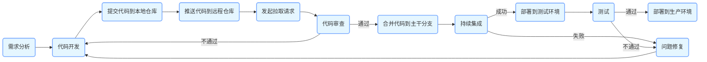

# 代码工程革新：协同开发实践

> 关键词：代码工程、协同开发、版本控制、持续集成、代码审查、团队协作、软件开发流程

> 摘要：本文聚焦于代码工程领域的协同开发实践，旨在探讨如何通过有效的协同开发策略和工具，提升软件开发团队的效率与质量。首先介绍了协同开发的背景和相关概念，包括目的、预期读者、文档结构和术语表等。接着深入讲解了协同开发的核心概念与联系，通过文本示意图和 Mermaid 流程图进行清晰展示。阐述了核心算法原理和具体操作步骤，结合 Python 源代码进行详细说明。介绍了相关的数学模型和公式，并举例说明。通过项目实战，详细解释了开发环境搭建、源代码实现和代码解读。分析了协同开发的实际应用场景，推荐了相关的工具和资源，包括学习资源、开发工具框架和论文著作等。最后总结了协同开发的未来发展趋势与挑战，提供了常见问题与解答以及扩展阅读和参考资料，为软件开发团队在协同开发实践中提供全面且深入的指导。

## 1. 背景介绍 
### 1.1 目的和范围
在当今软件开发的大环境下，软件项目的规模和复杂度不断增加，单个开发者很难独立完成一个完整的项目。协同开发成为了必然趋势，它能够整合团队成员的专业技能和知识，提高开发效率，保证软件质量。本文的目的在于详细阐述协同开发的原理、方法和实践经验，帮助软件开发团队更好地实施协同开发。范围涵盖了协同开发的各个方面，包括版本控制、代码审查、持续集成等关键环节，以及相关的工具和技术。

### 1.2 预期读者
本文的预期读者主要包括软件开发团队的成员，如程序员、软件工程师、软件架构师等，以及对协同开发感兴趣的技术爱好者和研究人员。对于正在进行软件项目开发的团队，本文可以作为协同开发实践的参考指南；对于初学者，能够帮助他们了解协同开发的基本概念和方法。

### 1.3 文档结构概述
本文将按照以下结构进行阐述：首先介绍协同开发的背景知识，包括目的、预期读者和文档结构等；接着深入探讨协同开发的核心概念与联系，通过示意图和流程图进行直观展示；然后讲解核心算法原理和具体操作步骤，结合 Python 代码进行详细说明；介绍相关的数学模型和公式，并举例说明；通过项目实战，详细解释开发环境搭建、源代码实现和代码解读；分析协同开发的实际应用场景；推荐相关的工具和资源；总结协同开发的未来发展趋势与挑战；提供常见问题与解答以及扩展阅读和参考资料。

### 1.4 术语表
#### 1.4.1 核心术语定义
- **协同开发**：指多个开发者在一个项目中共同工作，通过有效的沟通和协作，完成软件的开发任务。
- **版本控制**：一种管理软件版本的系统，用于记录文件的修改历史，方便开发者进行版本回溯和协作。
- **代码审查**：对代码进行系统性检查，以发现代码中的错误、提高代码质量和遵循编码规范。
- **持续集成**：一种软件开发实践，将开发者的代码频繁地集成到共享的代码库中，并自动进行构建和测试。
- **分支管理**：在版本控制系统中，通过创建不同的分支来并行开发不同的功能或修复问题。

#### 1.4.2 相关概念解释
- **分布式版本控制系统（DVCS）**：如 Git，每个开发者都有完整的代码库副本，开发者可以在本地进行版本控制操作，然后再与远程仓库进行同步。
- **主干分支**：通常是代码库的主分支，代表了项目的稳定版本。
- **特性分支**：用于开发新功能的分支，从主干分支派生，开发完成后合并回主干分支。
- **拉取请求（Pull Request）**：一种在分布式版本控制系统中用于请求合并代码的机制，开发者可以发起拉取请求，让其他团队成员审查和合并代码。

#### 1.4.3 缩略词列表
- **DVCS**：Distributed Version Control System（分布式版本控制系统）
- **CI**：Continuous Integration（持续集成）
- **PR**：Pull Request（拉取请求）

## 2. 核心概念与联系 

协同开发涉及多个核心概念，这些概念相互关联，共同构成了协同开发的整体框架。下面是核心概念原理和架构的文本示意图：

协同开发的核心概念主要包括版本控制、代码审查、持续集成和团队协作。版本控制是协同开发的基础，它记录了代码的修改历史，使得团队成员可以方便地管理和追溯代码的变化。代码审查是保证代码质量的重要环节，通过团队成员之间的互相审查，可以发现代码中的潜在问题，提高代码的可读性和可维护性。持续集成则是将开发者的代码频繁地集成到共享的代码库中，并自动进行构建和测试，及时发现集成过程中出现的问题。团队协作贯穿于整个协同开发过程，包括沟通、任务分配、问题解决等方面。

下面是使用 Mermaid 绘制的流程图，展示了协同开发的主要流程：



这个流程图展示了协同开发的主要步骤，从需求分析开始，经过代码开发、版本控制、代码审查、持续集成、测试等环节，最终将软件部署到生产环境。如果在某个环节出现问题，需要返回到代码开发阶段进行修复。

## 3. 核心算法原理 & 具体操作步骤 

### 版本控制算法原理
版本控制的核心算法是基于哈希算法和有向无环图（DAG）。以 Git 为例，Git 使用 SHA - 1 哈希算法对文件内容和目录结构进行哈希计算，生成唯一的哈希值。每个提交对象包含了本次提交的元数据（如作者、提交时间、提交信息等）和指向父提交对象的引用，这些提交对象构成了一个有向无环图。

下面是一个简单的 Python 代码示例，演示如何使用 Python 实现一个基本的哈希计算：

```python
import hashlib

def calculate_hash(data):
    """
    计算数据的 SHA - 1 哈希值
    :param data: 要计算哈希值的数据
    :return: 哈希值的十六进制表示
    """
    sha1 = hashlib.sha1()
    sha1.update(data.encode('utf-8'))
    return sha1.hexdigest()

# 示例数据
example_data = "Hello, World!"
hash_value = calculate_hash(example_data)
print(f"哈希值: {hash_value}")
```

### 具体操作步骤
#### 版本控制操作
1. **初始化本地仓库**：在项目目录下使用 `git init` 命令初始化一个本地 Git 仓库。
```bash
mkdir my_project
cd my_project
git init
```
2. **添加文件到暂存区**：使用 `git add` 命令将文件添加到暂存区。
```bash
touch example.txt
git add example.txt
```
3. **提交文件到本地仓库**：使用 `git commit` 命令将暂存区的文件提交到本地仓库。
```bash
git commit -m "Initial commit"
```
4. **关联远程仓库**：使用 `git remote add` 命令关联远程仓库。
```bash
git remote add origin <remote_repository_url>
```
5. **推送代码到远程仓库**：使用 `git push` 命令将本地仓库的代码推送到远程仓库。
```bash
git push -u origin master
```

#### 代码审查操作
1. **发起拉取请求**：在代码托管平台（如 GitHub、GitLab 等）上发起拉取请求，请求将自己的分支合并到主干分支。
2. **审查代码**：团队成员对拉取请求中的代码进行审查，提出意见和建议。
3. **修改代码**：根据审查意见，对代码进行修改。
4. **重新提交代码**：将修改后的代码重新提交到远程仓库，并更新拉取请求。

#### 持续集成操作
1. **配置持续集成工具**：选择一个持续集成工具（如 Jenkins、Travis CI 等），并进行相应的配置。
2. **编写构建脚本**：编写自动化构建脚本，包括编译代码、运行测试等步骤。
3. **触发持续集成**：当有新的代码提交到远程仓库时，自动触发持续集成流程。

## 4. 数学模型和公式 & 详细讲解 & 举例说明 

### 版本控制中的数学模型
在版本控制中，有向无环图（DAG）是一个重要的数学模型。DAG 由节点和边组成，节点表示提交对象，边表示提交对象之间的父子关系。

设 $V$ 是 DAG 中的节点集合，$E$ 是边的集合。对于每个节点 $v \in V$，它包含了提交的元数据和指向父节点的引用。如果节点 $v_1$ 是节点 $v_2$ 的父节点，则存在一条边 $(v_1, v_2) \in E$。

### 代码审查中的数学模型
代码审查可以使用一些指标来评估代码的质量和审查的效果。例如，代码变更率（Code Change Rate，CCR）可以用来衡量代码的修改程度。

设 $C_{old}$ 是代码修改前的代码行数，$C_{new}$ 是代码修改后的代码行数，则代码变更率 $CCR$ 的计算公式为：

$$CCR = \frac{\vert C_{new} - C_{old} \vert}{C_{old}}$$

举例说明：假设代码修改前有 100 行代码，修改后有 120 行代码，则代码变更率为：

$$CCR = \frac{\vert 120 - 100 \vert}{100} = 0.2 = 20\%$$

### 持续集成中的数学模型
在持续集成中，构建成功率（Build Success Rate，BSR）是一个重要的指标，用于衡量持续集成流程的稳定性。

设 $N_{total}$ 是总的构建次数，$N_{success}$ 是成功的构建次数，则构建成功率 $BSR$ 的计算公式为：

$$BSR = \frac{N_{success}}{N_{total}}$$

举例说明：假设总共进行了 100 次构建，其中 90 次成功，则构建成功率为：

$$BSR = \frac{90}{100} = 0.9 = 90\%$$

## 5. 项目实战：代码实际案例和详细解释说明 

### 5.1  开发环境搭建
#### 安装 Git
在不同的操作系统上安装 Git 的方法不同。以 Ubuntu 为例，可以使用以下命令安装：

```bash
sudo apt-get update
sudo apt-get install git
```

#### 选择代码托管平台
可以选择 GitHub、GitLab 或 Bitbucket 等代码托管平台。这里以 GitHub 为例，注册一个 GitHub 账号，并创建一个新的仓库。

#### 安装开发工具
根据项目的需求，安装相应的开发工具。例如，如果是 Python 项目，可以安装 Python 解释器和相关的开发环境，如 PyCharm 等。

### 5.2  源代码详细实现和代码解读
假设我们要开发一个简单的 Python 程序，用于计算两个数的和。以下是实现代码：

```python
# main.py
def add_numbers(a, b):
    """
    计算两个数的和
    :param a: 第一个数
    :param b: 第二个数
    :return: 两个数的和
    """
    return a + b

if __name__ == "__main__":
    num1 = 5
    num2 = 3
    result = add_numbers(num1, num2)
    print(f"The sum of {num1} and {num2} is {result}")
```

代码解读：
- `add_numbers` 函数接受两个参数 `a` 和 `b`，并返回它们的和。
- `if __name__ == "__main__":` 语句用于判断当前脚本是否作为主程序运行，如果是，则执行后续的代码。
- 在主程序中，定义了两个变量 `num1` 和 `num2`，调用 `add_numbers` 函数计算它们的和，并将结果打印输出。

### 5.3  代码解读与分析
#### 版本控制分析
- 初始化本地仓库后，将 `main.py` 文件添加到暂存区并提交到本地仓库。
- 关联远程仓库后，将本地仓库的代码推送到远程仓库。通过版本控制，我们可以记录代码的修改历史，方便团队成员之间的协作和代码的回溯。

#### 代码审查分析
在发起拉取请求后，团队成员可以对 `main.py` 代码进行审查。例如，检查代码的注释是否清晰、是否遵循编码规范、是否存在潜在的错误等。如果发现问题，可以在拉取请求中提出意见和建议，开发者根据这些意见进行修改。

#### 持续集成分析
配置持续集成工具（如 Travis CI），编写构建脚本，当有新的代码提交到远程仓库时，自动触发持续集成流程。在构建脚本中，可以编译代码、运行测试等。如果构建失败，持续集成工具会显示错误信息，开发者需要根据错误信息进行问题修复。

## 6. 实际应用场景 
### 开源项目开发
在开源项目中，全球各地的开发者可以共同参与项目的开发。通过协同开发，开发者可以在不同的地区、不同的时间进行代码贡献。版本控制工具（如 Git）使得开发者可以方便地管理自己的代码分支，发起拉取请求，让项目的维护者审查和合并代码。持续集成工具可以自动对提交的代码进行构建和测试，保证代码的质量。

### 企业级软件开发
在企业级软件开发中，通常有多个团队和开发者参与项目的开发。协同开发可以提高团队的协作效率，减少沟通成本。通过代码审查，可以保证代码的质量和遵循企业的编码规范。持续集成可以及时发现代码集成过程中出现的问题，提高软件的稳定性。

### 敏捷开发项目
在敏捷开发项目中，强调快速迭代和响应变化。协同开发可以支持团队成员之间的快速沟通和协作，及时调整开发计划。通过版本控制，可以方便地管理不同迭代版本的代码。代码审查和持续集成可以保证每个迭代版本的代码质量。

## 7. 工具和资源推荐
### 7.1 学习资源推荐
#### 7.1.1 书籍推荐
- 《Pro Git》：详细介绍了 Git 版本控制系统的原理和使用方法，是学习 Git 的经典书籍。
- 《Effective Python: 59 Specific Ways to Write Better Python》：提供了编写高质量 Python 代码的实用技巧和建议。
- 《Continuous Delivery: Reliable Software Releases through Build, Test, and Deployment Automation》：介绍了持续交付的原理和实践，对于理解持续集成和持续部署有很大帮助。

#### 7.1.2 在线课程
- Coursera 上的《Version Control with Git》：由专业讲师讲解 Git 的基本概念和使用方法。
- Udemy 上的《Python for Beginners》：适合初学者学习 Python 编程。
- edX 上的《Continuous Integration and Delivery》：深入介绍持续集成和持续交付的相关知识。

#### 7.1.3 技术博客和网站
- GitHub 官方博客：提供了关于版本控制、开源项目等方面的最新资讯和技术文章。
- Medium 上的软件开发相关博客：有很多开发者分享的关于协同开发、代码质量等方面的经验和技巧。
- Stack Overflow：一个知名的技术问答社区，可以在上面查找和解决开发过程中遇到的问题。

### 7.2 开发工具框架推荐
#### 7.2.1 IDE和编辑器
- PyCharm：一款功能强大的 Python 集成开发环境，提供了代码编辑、调试、版本控制等功能。
- Visual Studio Code：一款轻量级的代码编辑器，支持多种编程语言，有丰富的插件扩展。
- IntelliJ IDEA：适用于 Java 开发的集成开发环境，具有智能代码提示、代码分析等功能。

#### 7.2.2 调试和性能分析工具
- pdb：Python 内置的调试器，可以帮助开发者定位和解决代码中的问题。
- cProfile：Python 标准库中的性能分析工具，用于分析代码的性能瓶颈。
- VisualVM：一个可视化的 Java 性能分析工具，可以监控和分析 Java 应用程序的性能。

#### 7.2.3 相关框架和库
- Django：一个高级的 Python Web 框架，提供了快速开发 Web 应用的功能。
- Flask：一个轻量级的 Python Web 框架，适合初学者和小型项目开发。
- pytest：一个功能强大的 Python 测试框架，用于编写和运行单元测试和集成测试。

### 7.3 相关论文著作推荐
#### 7.3.1 经典论文
- 《Version Control Systems: A Taxonomy and Survey》：对版本控制系统进行了分类和综述，有助于深入理解版本控制的原理和发展。
- 《Continuous Integration: Improving Software Quality and Reducing Risk》：阐述了持续集成的重要性和实践方法。
- 《Code Review: A Defect Detection Process for Object - Oriented Systems》：介绍了代码审查在面向对象系统中的应用和效果。

#### 7.3.2 最新研究成果
可以通过学术数据库（如 IEEE Xplore、ACM Digital Library 等）查找关于协同开发、版本控制、持续集成等方面的最新研究论文。

#### 7.3.3 应用案例分析
- 一些开源项目（如 Linux 内核、Python 解释器等）的官方文档和开发日志中包含了很多关于协同开发的实践经验和案例分析。
- 企业级软件开发公司的技术博客和白皮书也会分享他们在协同开发方面的应用案例和最佳实践。

## 8. 总结：未来发展趋势与挑战
### 未来发展趋势
- **人工智能和机器学习的应用**：未来，人工智能和机器学习技术可能会在协同开发中得到更广泛的应用。例如，通过机器学习算法分析代码变更历史，预测潜在的代码问题；使用自然语言处理技术自动生成代码审查意见。
- **云原生开发**：随着云技术的发展，云原生开发将成为协同开发的主流趋势。开发者可以在云端进行代码开发、测试和部署，提高开发效率和资源利用率。
- **DevOps 文化的普及**：DevOps 强调开发和运维的紧密协作，未来 DevOps 文化将在更多的软件开发团队中得到普及，进一步促进协同开发的发展。

### 挑战
- **团队协作问题**：随着团队规模的扩大和分布范围的增加，团队成员之间的沟通和协作变得更加困难。如何有效地协调团队成员的工作，提高团队的协作效率，是协同开发面临的一个重要挑战。
- **代码安全问题**：在协同开发过程中，代码的安全性至关重要。如何保证代码的机密性、完整性和可用性，防止代码泄露和恶意攻击，是需要解决的问题。
- **技术更新换代快**：软件开发技术不断更新换代，协同开发工具和技术也在不断发展。开发者需要不断学习和掌握新的技术，以适应协同开发的需求。

## 9. 附录：常见问题与解答
### 版本控制相关问题
- **问题**：在使用 Git 时，如何撤销已经提交的 commit？
**解答**：可以使用 `git revert` 命令创建一个新的 commit，用于撤销指定的 commit。例如，要撤销上一个 commit，可以使用 `git revert HEAD` 命令。
- **问题**：如何处理 Git 中的冲突？
**解答**：当发生冲突时，Git 会在冲突的文件中标记出冲突的部分。开发者需要手动编辑这些文件，解决冲突后，使用 `git add` 命令将文件添加到暂存区，然后使用 `git commit` 命令提交修改。

### 代码审查相关问题
- **问题**：代码审查应该关注哪些方面？
**解答**：代码审查应该关注代码的正确性、可读性、可维护性、性能、安全性等方面。同时，还应该检查代码是否遵循编码规范和项目的要求。
- **问题**：如何提高代码审查的效率？
**解答**：可以制定明确的代码审查标准和流程，使用代码审查工具（如 GitHub 的 Pull Request 功能），合理分配审查任务，提高审查人员的专业水平等。

### 持续集成相关问题
- **问题**：持续集成失败的常见原因有哪些？
**解答**：持续集成失败的常见原因包括代码编译错误、测试用例失败、依赖项问题、环境配置问题等。
- **问题**：如何优化持续集成流程？
**解答**：可以优化构建脚本，减少构建时间；并行执行测试用例，提高测试效率；定期清理构建缓存，减少磁盘空间占用等。

## 10. 扩展阅读 & 参考资料
### 扩展阅读
- 《The Pragmatic Programmer: Your Journey to Mastery》：提供了软件开发的实用技巧和方法，对于提高开发者的编程水平有很大帮助。
- 《Clean Code: A Handbook of Agile Software Craftsmanship》：介绍了编写高质量代码的原则和实践，有助于提高代码的可读性和可维护性。

### 参考资料
- Git 官方文档：https://git-scm.com/doc
- GitHub 官方文档：https://docs.github.com/
- Travis CI 官方文档：https://docs.travis-ci.com/
- Python 官方文档：https://docs.python.org/