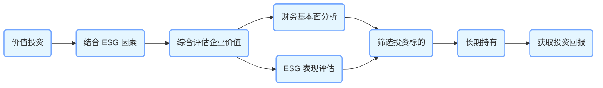

# 价值投资与ESG投资的结合

> 关键词：价值投资、ESG投资、可持续发展、投资策略、企业价值、社会责任、长期回报

> 摘要：本文深入探讨了价值投资与 ESG 投资相结合的投资理念与策略。首先介绍了价值投资和 ESG 投资的背景及相关概念，阐述了两者结合的核心原理与联系。接着分析了结合过程中的核心算法原理与具体操作步骤，并用数学模型和公式进行详细讲解与举例说明。通过项目实战展示了如何在实际投资中应用这一结合策略，包括开发环境搭建、源代码实现与解读。同时探讨了其实际应用场景，推荐了相关的学习资源、开发工具框架以及论文著作。最后总结了价值投资与 ESG 投资结合的未来发展趋势与挑战，并提供了常见问题解答和扩展阅读参考资料，旨在为投资者和相关研究人员提供全面深入的指导，促进可持续投资的发展。

## 1. 背景介绍 
### 1.1 目的和范围
价值投资作为一种传统且经典的投资策略，强调寻找被市场低估的资产，通过长期持有以获取资产价值回归带来的收益。而 ESG 投资近年来逐渐兴起，关注企业在环境（Environmental）、社会（Social）和治理（Governance）方面的表现，将可持续发展和社会责任纳入投资考量。本研究的目的在于探讨如何将这两种投资理念有机结合，形成一种更具前瞻性和可持续性的投资策略。范围涵盖了从理论基础到实际应用的各个方面，包括核心概念的阐述、算法原理的分析、实际案例的研究以及对未来发展趋势的展望。

### 1.2 预期读者
本文预期读者包括专业投资者、投资机构从业者、金融分析师、企业管理者以及对可持续投资感兴趣的研究人员和学生。对于专业投资者和投资机构从业者，希望能为他们优化投资组合、提高投资回报提供新的思路和方法；对于金融分析师，有助于其更全面地评估企业价值；企业管理者可以从中了解投资者对企业 ESG 表现的关注，从而调整企业战略；研究人员和学生则可以将其作为研究可持续投资领域的参考资料。

### 1.3 文档结构概述
本文首先介绍价值投资与 ESG 投资的背景信息，包括目的、预期读者和文档结构概述等内容，并对相关术语进行定义和解释。接着阐述两者的核心概念与联系，通过文本示意图和 Mermaid 流程图展示其原理和架构。然后详细分析核心算法原理和具体操作步骤，用 Python 源代码进行阐述。再用数学模型和公式对结合策略进行详细讲解并举例说明。通过项目实战展示实际应用中的代码实现和解读。探讨其实际应用场景，推荐相关的学习资源、开发工具框架和论文著作。最后总结未来发展趋势与挑战，提供常见问题解答和扩展阅读参考资料。

### 1.4 术语表
#### 1.4.1 核心术语定义
- **价值投资（Value Investing）**：一种投资策略，基于对资产内在价值的评估，寻找价格低于其内在价值的投资标的，通过长期持有等待价值回归来获取收益。
- **ESG 投资（ESG Investing）**：一种关注企业环境、社会和治理绩效的投资理念，将可持续发展和社会责任纳入投资决策过程，旨在实现长期的财务回报和社会价值。
- **企业内在价值（Intrinsic Value）**：企业在未来所能产生的全部现金流的现值，是价值投资中评估企业价值的核心指标。
- **ESG 评级（ESG Rating）**：对企业在环境、社会和治理方面表现的综合评估，通常由专业评级机构根据一系列指标和方法进行评定。

#### 1.4.2 相关概念解释
- **环境（Environmental）**：主要涉及企业在资源利用、污染防治、气候变化等方面的表现，如能源消耗、碳排放、废物处理等。
- **社会（Social）**：关注企业与员工、客户、社区等利益相关者的关系，包括员工权益、产品质量与安全、社区参与等方面。
- **治理（Governance）**：侧重于企业的内部管理和决策机制，如董事会结构、高管薪酬、信息披露等。

#### 1.4.3 缩略词列表
- **ESG**：Environmental, Social and Governance（环境、社会和治理）
- **ROE**：Return on Equity（净资产收益率）
- **DCF**：Discounted Cash Flow（现金流折现法）

## 2. 核心概念与联系 

### 价值投资核心概念
价值投资的核心思想源于本杰明·格雷厄姆（Benjamin Graham）和大卫·多德（David Dodd）在 1934 年出版的《证券分析》（Security Analysis）一书。其基本原理是通过对企业财务报表、经营状况等基本面因素的分析，评估企业的内在价值。如果股票价格低于其内在价值，就认为该股票被低估，具有投资价值。价值投资者通常采用以下方法评估企业内在价值：
- **资产价值法**：通过评估企业的净资产价值，包括固定资产、流动资产等，来确定企业的内在价值。例如，一家企业的固定资产价值为 1000 万元，流动资产价值为 500 万元，负债为 300 万元，则其净资产价值为 1200 万元。
- **盈利倍数法**：根据企业的盈利水平，结合行业平均市盈率等指标，估算企业的内在价值。例如，某企业每股收益为 2 元，行业平均市盈率为 15 倍，则该企业的每股内在价值为 30 元。

### ESG 投资核心概念
ESG 投资强调企业在环境、社会和治理方面的可持续发展能力。环境因素关注企业对自然环境的影响，社会因素注重企业与社会各利益相关者的关系，治理因素则聚焦于企业的内部管理和决策机制。专业的 ESG 评级机构会综合考虑多个指标对企业进行评级，评级结果反映了企业在可持续发展方面的表现。例如，MSCI（摩根士丹利资本国际公司）的 ESG 评级体系会从气候变化、人力资本、公司治理等多个维度对企业进行评估，评级结果从 AAA 到 CCC 不等。

### 两者的联系
价值投资与 ESG 投资并非相互独立，而是存在着紧密的联系。一方面，良好的 ESG 表现可以提升企业的长期竞争力和可持续发展能力，从而增加企业的内在价值。例如，一家注重环境保护的企业可以降低环境风险，减少潜在的环境成本；积极履行社会责任的企业可以提升品牌形象，增强客户忠诚度；完善的公司治理结构可以提高企业的决策效率，降低代理成本。另一方面，价值投资的长期投资理念与 ESG 投资所追求的可持续发展目标相契合。通过将 ESG 因素纳入价值投资的分析框架，可以更全面地评估企业的风险和机会，筛选出更具投资价值的企业。

### 文本示意图
```plaintext
              价值投资
                  |
                  | 结合 ESG 因素
                  v
         综合评估企业价值
        /                  \
  财务基本面分析       ESG 表现评估
        \                  /
         筛选投资标的
                  |
                  | 长期持有
                  v
            获取投资回报
```

### Mermaid 流程图


## 3. 核心算法原理 & 具体操作步骤 

### 核心算法原理
在将价值投资与 ESG 投资结合的过程中，我们可以采用多因素模型来综合评估企业的投资价值。该模型将财务指标和 ESG 指标作为输入变量，通过一定的权重分配，计算出企业的综合得分，以此作为筛选投资标的的依据。

假设我们有 $n$ 个财务指标 $x_1, x_2, \cdots, x_n$ 和 $m$ 个 ESG 指标 $y_1, y_2, \cdots, y_m$，每个指标都有相应的权重 $w_{x1}, w_{x2}, \cdots, w_{xn}$ 和 $w_{y1}, w_{y2}, \cdots, w_{ym}$，且 $\sum_{i=1}^{n} w_{xi} + \sum_{j=1}^{m} w_{yj} = 1$。则企业的综合得分 $S$ 可以表示为：

$S = \sum_{i=1}^{n} w_{xi} x_i + \sum_{j=1}^{m} w_{yj} y_j$

### 具体操作步骤
1. **数据收集**：收集企业的财务数据和 ESG 数据。财务数据可以从企业的财务报表中获取，如营业收入、净利润、净资产等；ESG 数据可以从专业的 ESG 评级机构、企业的社会责任报告等渠道获取。
2. **指标选择**：根据投资目标和策略，选择合适的财务指标和 ESG 指标。常见的财务指标包括市盈率（PE）、市净率（PB）、净资产收益率（ROE）等；常见的 ESG 指标包括碳排放强度、员工满意度、董事会独立性等。
3. **数据标准化**：由于不同指标的量纲和取值范围可能不同，为了使各指标具有可比性，需要对数据进行标准化处理。常用的标准化方法有 Z-score 标准化、Min-Max 标准化等。
4. **权重确定**：根据各指标的重要性，确定其相应的权重。权重的确定可以采用主观赋权法（如专家打分法）或客观赋权法（如主成分分析法、熵权法等）。
5. **计算综合得分**：将标准化后的数据代入上述公式，计算企业的综合得分。
6. **筛选投资标的**：根据综合得分对企业进行排序，选择得分较高的企业作为投资标的。

### Python 源代码实现
```python
import numpy as np
import pandas as pd
from sklearn.preprocessing import StandardScaler

# 模拟财务数据和 ESG 数据
financial_data = pd.DataFrame({
    'PE': [10, 15, 20, 25],
    'PB': [1.5, 2.0, 2.5, 3.0],
    'ROE': [0.1, 0.15, 0.2, 0.25]
})

esg_data = pd.DataFrame({
    'Carbon_Intensity': [100, 120, 150, 180],
    'Employee_Satisfaction': [0.8, 0.9, 0.7, 0.6],
    'Board_Independence': [0.5, 0.6, 0.7, 0.8]
})

# 数据标准化
scaler = StandardScaler()
financial_data_scaled = scaler.fit_transform(financial_data)
esg_data_scaled = scaler.fit_transform(esg_data)

# 确定权重
financial_weights = np.array([0.3, 0.3, 0.4])
esg_weights = np.array([0.3, 0.3, 0.4])

# 计算财务得分和 ESG 得分
financial_scores = np.dot(financial_data_scaled, financial_weights)
esg_scores = np.dot(esg_data_scaled, esg_weights)

# 计算综合得分
total_scores = 0.6 * financial_scores + 0.4 * esg_scores

# 筛选投资标的
top_indices = np.argsort(total_scores)[::-1][:2]  # 选择得分最高的前 2 个企业
print("Selected investment targets:", top_indices)
```

### 代码解释
1. **数据模拟**：使用 `pandas` 库模拟了企业的财务数据和 ESG 数据。
2. **数据标准化**：使用 `sklearn` 库中的 `StandardScaler` 对数据进行 Z-score 标准化处理，使各指标具有相同的量纲。
3. **权重确定**：手动设定了财务指标和 ESG 指标的权重。
4. **得分计算**：通过矩阵乘法计算财务得分、ESG 得分和综合得分。
5. **筛选投资标的**：根据综合得分对企业进行排序，选择得分最高的前 2 个企业作为投资标的。

## 4. 数学模型和公式 & 详细讲解 & 举例说明 

### 现金流折现法（DCF）与价值投资
现金流折现法是价值投资中常用的评估企业内在价值的方法。其基本原理是将企业未来的现金流按照一定的折现率折现到当前时刻，得到企业的内在价值。

假设企业在未来 $n$ 期的现金流分别为 $CF_1, CF_2, \cdots, CF_n$，折现率为 $r$，则企业的内在价值 $V$ 可以表示为：

$$V = \sum_{t=1}^{n} \frac{CF_t}{(1 + r)^t}$$

### 详细讲解
- **现金流（CF）**：指企业在未来各期产生的现金流入减去现金流出后的净额。现金流是企业价值的核心驱动因素，反映了企业的盈利能力和财务状况。
- **折现率（r）**：反映了投资者对投资风险的预期。折现率越高，说明投资者对风险的要求越高，企业的内在价值就越低。折现率通常可以采用资本资产定价模型（CAPM）来确定：

$$r = R_f + \beta (R_m - R_f)$$

其中，$R_f$ 为无风险利率，$\beta$ 为企业的贝塔系数，反映了企业股票相对于市场的波动性，$R_m$ 为市场收益率。

### 举例说明
假设某企业预计未来 3 年的现金流分别为 100 万元、120 万元和 150 万元，折现率为 10%。则该企业的内在价值为：

$$V = \frac{100}{(1 + 0.1)^1} + \frac{120}{(1 + 0.1)^2} + \frac{150}{(1 + 0.1)^3}$$

$$V = \frac{100}{1.1} + \frac{120}{1.21} + \frac{150}{1.331}$$

$$V \approx 90.91 + 99.17 + 112.70$$

$$V \approx 302.78 \text{（万元）}$$

### ESG 调整因子
在将 ESG 因素纳入价值投资分析时，可以引入 ESG 调整因子对企业的内在价值进行调整。假设 ESG 调整因子为 $\alpha$，则调整后的企业内在价值 $V'$ 为：

$$V' = V \times (1 + \alpha)$$

$\alpha$ 的取值可以根据企业的 ESG 评级来确定。例如，对于 ESG 评级较高的企业，$\alpha$ 可以取正值，表示该企业的可持续发展能力较强，具有更高的价值；对于 ESG 评级较低的企业，$\alpha$ 可以取负值，表示该企业存在较高的 ESG 风险，其价值应相应降低。

### 举例说明
假设上述企业的 ESG 评级较高，ESG 调整因子 $\alpha = 0.1$。则调整后的企业内在价值为：

$$V' = 302.78 \times (1 + 0.1)$$

$$V' = 302.78 \times 1.1$$

$$V' \approx 333.06 \text{（万元）}$$

## 5. 项目实战：代码实际案例和详细解释说明 

### 5.1  开发环境搭建
- **操作系统**：推荐使用 Windows、Linux 或 macOS 操作系统。
- **编程语言**：Python 3.x，Python 是一种功能强大、易于学习的编程语言，拥有丰富的数据分析和机器学习库。
- **开发工具**：推荐使用 PyCharm 或 Jupyter Notebook。PyCharm 是一款专业的 Python 集成开发环境，提供了代码编辑、调试、版本控制等功能；Jupyter Notebook 是一种交互式的开发环境，适合进行数据分析和模型验证。
- **相关库**：需要安装 `pandas`、`numpy`、`sklearn` 等库。可以使用以下命令进行安装：

```sh
pip install pandas numpy sklearn
```

### 5.2  源代码详细实现和代码解读
```python
import pandas as pd
import numpy as np
from sklearn.preprocessing import StandardScaler
from sklearn.decomposition import PCA

# 读取财务数据和 ESG 数据
financial_data = pd.read_csv('financial_data.csv')
esg_data = pd.read_csv('esg_data.csv')

# 数据预处理
# 处理缺失值
financial_data = financial_data.fillna(financial_data.mean())
esg_data = esg_data.fillna(esg_data.mean())

# 数据标准化
scaler = StandardScaler()
financial_data_scaled = scaler.fit_transform(financial_data)
esg_data_scaled = scaler.fit_transform(esg_data)

# 特征降维（使用主成分分析）
pca_financial = PCA(n_components=2)
financial_data_reduced = pca_financial.fit_transform(financial_data_scaled)

pca_esg = PCA(n_components=2)
esg_data_reduced = pca_esg.fit_transform(esg_data_scaled)

# 确定权重（使用熵权法）
def entropy_weight(data):
    n, m = data.shape
    p = data / data.sum(axis=0)
    e = -1 / np.log(n) * np.sum(p * np.log(p), axis=0)
    w = (1 - e) / np.sum(1 - e)
    return w

financial_weights = entropy_weight(financial_data_reduced)
esg_weights = entropy_weight(esg_data_reduced)

# 计算财务得分和 ESG 得分
financial_scores = np.dot(financial_data_reduced, financial_weights)
esg_scores = np.dot(esg_data_reduced, esg_weights)

# 计算综合得分
total_scores = 0.6 * financial_scores + 0.4 * esg_scores

# 筛选投资标的
top_indices = np.argsort(total_scores)[::-1][:5]  # 选择得分最高的前 5 个企业
selected_companies = financial_data.index[top_indices]
print("Selected investment targets:", selected_companies)
```

### 5.3  代码解读与分析
1. **数据读取**：使用 `pandas` 库的 `read_csv` 函数读取财务数据和 ESG 数据。
2. **数据预处理**：
    - **处理缺失值**：使用均值填充法处理数据中的缺失值。
    - **数据标准化**：使用 `StandardScaler` 对数据进行标准化处理，使各指标具有相同的量纲。
3. **特征降维**：使用主成分分析（PCA）对财务数据和 ESG 数据进行降维，减少数据的维度，提高计算效率。
4. **权重确定**：使用熵权法确定财务指标和 ESG 指标的权重。熵权法是一种客观赋权法，根据数据的信息熵来确定指标的权重，避免了主观因素的影响。
5. **得分计算**：通过矩阵乘法计算财务得分、ESG 得分和综合得分。
6. **筛选投资标的**：根据综合得分对企业进行排序，选择得分最高的前 5 个企业作为投资标的。

## 6. 实际应用场景 
### 机构投资者
对于养老基金、保险资金等机构投资者，他们通常具有长期投资的特点，注重投资的安全性和稳定性。将价值投资与 ESG 投资相结合，可以帮助他们筛选出具有良好财务基本面和可持续发展能力的企业，降低投资风险，实现长期的资产增值。例如，一些养老基金在投资组合中增加了对 ESG 表现优秀企业的配置，以提高投资组合的抗风险能力和长期回报。

### 社会责任投资者
社会责任投资者关注投资的社会和环境影响，希望通过投资来推动社会的可持续发展。价值投资与 ESG 投资的结合为他们提供了一种实现投资目标的有效途径。他们可以选择那些在环境、社会和治理方面表现出色的企业进行投资，同时获得合理的财务回报。例如，一些投资者专门设立了 ESG 主题基金，投资于清洁能源、环保产业等领域的企业。

### 企业战略决策
企业管理者可以借鉴价值投资与 ESG 投资的理念，将 ESG 因素纳入企业战略决策过程。通过改善企业的 ESG 表现，可以提升企业的品牌形象和市场竞争力，吸引更多的投资者和客户。例如，一些企业通过实施节能减排措施、加强员工培训和福利、完善公司治理结构等方式，提高了企业的 ESG 评级，从而获得了投资者的认可和市场的青睐。

## 7. 工具和资源推荐
### 7.1 学习资源推荐
#### 7.1.1 书籍推荐
- 《证券分析》（Security Analysis）：本杰明·格雷厄姆（Benjamin Graham）和大卫·多德（David Dodd）著，价值投资的经典著作，详细阐述了价值投资的理论和方法。
- 《聪明的投资者》（The Intelligent Investor）：本杰明·格雷厄姆（Benjamin Graham）著，被誉为投资界的“圣经”，为投资者提供了实用的投资策略和风险管理方法。
- 《ESG 投资：理念、方法与实践》：详细介绍了 ESG 投资的概念、评估方法和实际应用案例，是学习 ESG 投资的重要参考书籍。

#### 7.1.2 在线课程
- Coursera 平台上的“Investment Management Specialization”：由知名高校教授授课，涵盖了投资管理的各个方面，包括价值投资、资产定价等内容。
- edX 平台上的“ESG Investing: From Principles to Practice”：系统介绍了 ESG 投资的原理和实践，帮助学习者掌握 ESG 投资的方法和技巧。

#### 7.1.3 技术博客和网站
- Seeking Alpha：提供了丰富的投资分析文章和研究报告，包括价值投资和 ESG 投资的相关内容。
- MSCI ESG Research：MSCI 公司的 ESG 研究网站，提供了全球企业的 ESG 评级数据和研究报告，是了解 ESG 投资的重要信息来源。

### 7.2 开发工具框架推荐
#### 7.2.1 IDE和编辑器
- PyCharm：专业的 Python 集成开发环境，具有强大的代码编辑、调试和版本控制功能，适合进行数据分析和机器学习项目的开发。
- Jupyter Notebook：交互式的开发环境，支持 Python、R 等多种编程语言，适合进行数据探索、模型验证和结果展示。

#### 7.2.2 调试和性能分析工具
- IPython：Python 的交互式解释器，提供了丰富的调试和分析功能，如代码调试、变量查看、性能分析等。
- cProfile：Python 内置的性能分析工具，可以帮助开发者找出代码中的性能瓶颈，优化代码性能。

#### 7.2.3 相关框架和库
- pandas：Python 的数据处理和分析库，提供了高效的数据结构和数据操作方法，适合进行财务数据和 ESG 数据的处理和分析。
- numpy：Python 的数值计算库，提供了高效的数组操作和数学函数，是进行数据分析和机器学习的基础库。
- sklearn：Python 的机器学习库，提供了丰富的机器学习算法和工具，如数据预处理、特征选择、模型训练和评估等。

### 7.3 相关论文著作推荐
#### 7.3.1 经典论文
- “The Relationship between Corporate Social Performance and Corporate Financial Performance”：研究了企业社会责任表现与财务绩效之间的关系，为 ESG 投资提供了理论支持。
- “Value Investing: The Use of Historical Financial Statement Information to Separate Winners from Losers”：阐述了价值投资的理论和方法，通过实证研究证明了价值投资策略的有效性。

#### 7.3.2 最新研究成果
- 关注顶级金融期刊，如《Journal of Finance》、《Review of Financial Studies》等，这些期刊经常发表关于价值投资、ESG 投资等领域的最新研究成果。
- 参加国际金融学术会议，如美国金融协会（AFA）年会、欧洲金融协会（EFA）年会等，了解该领域的前沿研究动态。

#### 7.3.3 应用案例分析
- 国际金融机构的研究报告，如世界银行、国际货币基金组织等发布的关于可持续投资的报告，包含了大量的实际应用案例和分析。
- 专业投资机构的研究报告，如贝莱德、先锋集团等发布的关于 ESG 投资的研究报告，提供了丰富的实践经验和投资策略。

## 8. 总结：未来发展趋势与挑战
### 未来发展趋势
- **投资者关注度不断提高**：随着社会对可持续发展的关注度不断提升，投资者对 ESG 因素的重视程度也在逐渐增加。越来越多的投资者将 ESG 纳入投资决策过程，价值投资与 ESG 投资的结合将成为未来投资的主流趋势。
- **数据和评估方法不断完善**：随着 ESG 数据的不断丰富和评估方法的不断改进，投资者可以更准确地评估企业的 ESG 表现和投资价值。同时，人工智能、大数据等技术的应用也将为价值投资与 ESG 投资的结合提供更强大的工具和支持。
- **监管政策不断加强**：政府和监管机构对企业的 ESG 信息披露和社会责任履行的要求越来越高。这将促使企业更加重视 ESG 管理，提高 ESG 表现，也为价值投资与 ESG 投资的结合创造了更好的市场环境。

### 挑战
- **数据质量和可比性问题**：目前 ESG 数据的质量和可比性存在一定问题，不同评级机构的 ESG 评级结果可能存在差异，这给投资者的决策带来了一定的困难。
- **投资绩效评估难度较大**：由于 ESG 因素对企业价值和投资绩效的影响较为复杂，难以准确评估价值投资与 ESG 投资结合策略的实际效果。
- **企业 ESG 管理水平参差不齐**：部分企业对 ESG 管理的认识和实践还不够深入，ESG 表现较差，这增加了投资者筛选优质投资标的的难度。

## 9. 附录：常见问题与解答
### 1. 价值投资与 ESG 投资结合的投资回报一定更高吗？
不一定。虽然理论上良好的 ESG 表现可以提升企业的长期竞争力和可持续发展能力，从而增加投资回报，但投资回报受到多种因素的影响，如市场环境、行业竞争、企业经营管理等。价值投资与 ESG 投资的结合只是一种投资策略，不能保证一定能获得更高的回报。

### 2. 如何获取可靠的 ESG 数据？
可以从以下渠道获取 ESG 数据：
- 专业的 ESG 评级机构，如 MSCI、 Sustainalytics、汤森路透等，这些机构提供了全球企业的 ESG 评级数据和研究报告。
- 企业的社会责任报告，许多企业会在报告中披露自身的 ESG 表现和相关数据。
- 政府部门和行业协会发布的统计数据和报告。

### 3. 如何确定财务指标和 ESG 指标的权重？
可以采用主观赋权法或客观赋权法来确定指标的权重。主观赋权法如专家打分法，根据专家的经验和判断来确定权重；客观赋权法如主成分分析法、熵权法等，根据数据的特征和信息熵来确定权重。在实际应用中，可以结合两种方法，综合考虑主观和客观因素，确定合理的指标权重。

## 10. 扩展阅读 & 参考资料
### 扩展阅读
- 《可持续金融与投资》：深入探讨了可持续金融的理论和实践，包括价值投资、ESG 投资、绿色金融等领域的内容。
- 《企业社会责任与可持续发展》：介绍了企业社会责任的概念、理论和实践，以及企业如何通过履行社会责任实现可持续发展。

### 参考资料
- 相关金融期刊和学术论文，如《Journal of Financial Economics》、《Journal of Corporate Finance》等。
- 国际金融机构和专业投资机构的研究报告，如世界银行的《世界发展报告》、贝莱德的《全球投资展望》等。
- 企业的财务报表和社会责任报告。