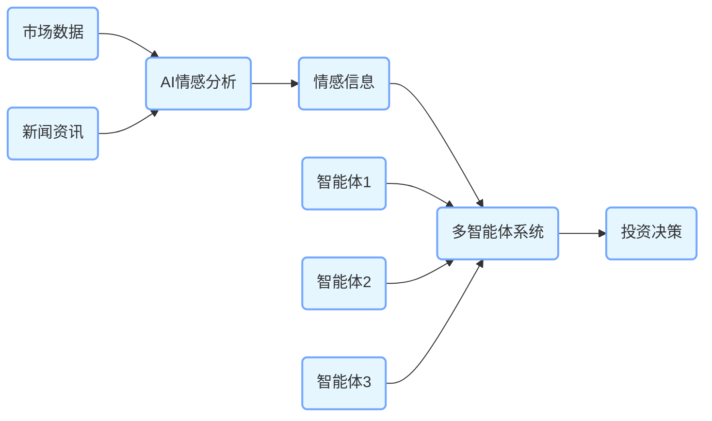

# 价值投资中的AI情感分析：多智能体系统解读市场心理

> 关键词：价值投资、AI情感分析、多智能体系统、市场心理、金融市场

> 摘要：本文聚焦于价值投资领域中运用AI情感分析与多智能体系统来解读市场心理。首先介绍了研究的背景、目的、预期读者等基础信息，深入阐述了核心概念及联系，包括AI情感分析和多智能体系统的原理与架构。通过Python代码详细讲解了核心算法原理及操作步骤，给出了相关数学模型和公式并举例说明。结合项目实战，展示了开发环境搭建、源代码实现与解读。探讨了该技术在金融市场的实际应用场景，推荐了学习资源、开发工具框架以及相关论文著作。最后总结了未来发展趋势与挑战，提供了常见问题解答及扩展阅读参考资料，旨在为价值投资者利用先进技术洞察市场心理提供全面的指导和深入的思考。

## 1. 背景介绍 
### 1.1 目的和范围
在金融投资领域，价值投资一直是备受关注的投资策略之一。其核心在于通过对企业基本面的分析，寻找被低估的资产并长期持有。然而，市场并非完全理性，投资者的情绪和心理因素在很大程度上影响着资产价格的波动。传统的价值投资方法往往难以全面捕捉这些市场心理因素。

本研究的目的在于探索如何利用AI情感分析和多智能体系统来更好地解读市场心理，为价值投资者提供更全面的信息和决策依据。范围涵盖了金融市场的各个领域，包括股票市场、债券市场、期货市场等，旨在揭示投资者情绪与资产价格之间的内在联系，提高价值投资决策的准确性和有效性。

### 1.2 预期读者
本文预期读者包括金融投资者，尤其是采用价值投资策略的投资者，他们希望借助先进的技术手段更好地理解市场心理，优化投资决策；金融分析师，需要深入研究市场动态和投资者情绪，以提供更准确的市场分析报告；人工智能领域的研究人员和开发者，对将AI技术应用于金融领域感兴趣，希望了解相关的技术原理和应用案例；以及对金融科技和投资领域有学习需求的学生和爱好者。

### 1.3 文档结构概述
本文将按照以下结构展开：首先介绍背景信息，包括目的、预期读者等；接着阐述核心概念与联系，包括AI情感分析和多智能体系统的原理与架构；然后详细讲解核心算法原理及具体操作步骤，通过Python代码进行说明；给出相关数学模型和公式并举例；结合项目实战，展示开发环境搭建、源代码实现与解读；探讨实际应用场景；推荐学习资源、开发工具框架以及相关论文著作；最后总结未来发展趋势与挑战，提供常见问题解答及扩展阅读参考资料。

### 1.4 术语表
#### 1.4.1 核心术语定义
- **价值投资**：一种基于对企业内在价值的评估，寻找被低估的资产并长期持有的投资策略。
- **AI情感分析**：利用人工智能技术对文本、语音等数据中的情感信息进行识别、分类和量化的过程。
- **多智能体系统**：由多个智能体组成的系统，每个智能体具有自主决策和交互能力，通过协作实现共同目标。
- **市场心理**：投资者在金融市场中的情绪、认知和行为倾向，会影响市场价格的波动。

#### 1.4.2 相关概念解释
- **情感极性**：指文本或数据中表达的情感倾向，通常分为积极、消极和中性。
- **智能体**：具有感知、决策和行动能力的实体，可以是软件程序、机器人等。
- **群体智能**：多个智能体通过交互和协作产生的集体智慧和行为模式。

#### 1.4.3 缩略词列表
- **AI**：Artificial Intelligence，人工智能
- **NLP**：Natural Language Processing，自然语言处理
- **ML**：Machine Learning，机器学习
- **DL**：Deep Learning，深度学习

## 2. 核心概念与联系 

### 2.1 AI情感分析原理
AI情感分析主要基于自然语言处理（NLP）和机器学习（ML）技术。其基本原理是对文本数据进行预处理，包括分词、词性标注、去除停用词等操作，然后提取文本的特征，如词频、词向量等。接着利用训练好的分类模型，将文本分类为积极、消极或中性等情感类别。

在深度学习时代，循环神经网络（RNN）、长短时记忆网络（LSTM）和卷积神经网络（CNN）等模型也被广泛应用于情感分析任务中。这些模型能够自动学习文本中的语义信息和情感特征，提高情感分析的准确性。

### 2.2 多智能体系统架构
多智能体系统由多个智能体组成，每个智能体具有以下基本组件：
- **感知模块**：用于感知环境信息，如市场数据、新闻资讯等。
- **决策模块**：根据感知到的信息和自身的目标，做出决策。
- **行动模块**：执行决策，与其他智能体或环境进行交互。

智能体之间通过通信协议进行信息交换和协作。常见的多智能体系统架构包括集中式架构、分布式架构和混合式架构。

### 2.3 核心概念联系示意图

在这个示意图中，市场数据和新闻资讯作为输入，经过AI情感分析提取出情感信息。这些情感信息被传递给多智能体系统，多个智能体在系统中进行交互和协作，最终做出投资决策。

## 3. 核心算法原理 & 具体操作步骤 

### 3.1 AI情感分析算法原理
以基于LSTM的情感分析算法为例，其原理如下：

LSTM是一种特殊的RNN，能够解决传统RNN中的梯度消失问题。在情感分析任务中，LSTM通过学习文本序列中的上下文信息，捕捉文本的语义和情感特征。

以下是一个简单的基于Keras库的LSTM情感分析Python代码示例：

```python
import numpy as np
from keras.preprocessing.text import Tokenizer
from keras.preprocessing.sequence import pad_sequences
from keras.models import Sequential
from keras.layers import Embedding, LSTM, Dense

# 示例数据
texts = ["This movie is great!", "I don't like this book.", "It's just okay."]
labels = [1, 0, 0.5]  # 1: 积极, 0: 消极, 0.5: 中性

# 文本预处理
tokenizer = Tokenizer(num_words=1000)
tokenizer.fit_on_texts(texts)
sequences = tokenizer.texts_to_sequences(texts)
max_length = max([len(seq) for seq in sequences])
padded_sequences = pad_sequences(sequences, maxlen=max_length)

# 构建LSTM模型
model = Sequential()
model.add(Embedding(input_dim=1000, output_dim=100, input_length=max_length))
model.add(LSTM(100))
model.add(Dense(1, activation='sigmoid'))

# 编译模型
model.compile(optimizer='adam', loss='binary_crossentropy', metrics=['accuracy'])

# 训练模型
model.fit(padded_sequences, np.array(labels), epochs=10, batch_size=1)
```

### 3.2 多智能体系统算法原理
多智能体系统中的智能体通常采用强化学习算法进行决策。以Q-learning算法为例，其原理如下：

Q-learning是一种无模型的强化学习算法，通过学习一个Q函数来估计在某个状态下采取某个动作的价值。智能体在环境中不断尝试不同的动作，根据获得的奖励来更新Q函数，最终找到最优的策略。

以下是一个简单的Q-learning算法的Python代码示例：

```python
import numpy as np

# 定义环境
num_states = 5
num_actions = 2
Q = np.zeros((num_states, num_actions))

# 定义参数
alpha = 0.1  # 学习率
gamma = 0.9  # 折扣因子
epsilon = 0.1  # 探索率
num_episodes = 100

# Q-learning算法
for episode in range(num_episodes):
    state = np.random.randint(0, num_states)
    done = False
    while not done:
        if np.random.uniform(0, 1) < epsilon:
            action = np.random.randint(0, num_actions)
        else:
            action = np.argmax(Q[state, :])
        
        # 模拟环境反馈
        next_state = np.random.randint(0, num_states)
        reward = np.random.randint(0, 10)
        done = np.random.choice([True, False])
        
        # 更新Q值
        Q[state, action] = Q[state, action] + alpha * (reward + gamma * np.max(Q[next_state, :]) - Q[state, action])
        state = next_state
```

### 3.3 具体操作步骤
1. **数据收集**：收集市场数据、新闻资讯等相关文本数据。
2. **数据预处理**：对文本数据进行清洗、分词、去除停用词等操作。
3. **AI情感分析**：使用训练好的情感分析模型对预处理后的数据进行情感分类。
4. **智能体设计**：设计多个智能体，每个智能体具有不同的目标和策略。
5. **多智能体交互**：智能体之间通过通信协议进行信息交换和协作。
6. **投资决策**：根据多智能体系统的输出，做出投资决策。

## 4. 数学模型和公式 & 详细讲解 & 举例说明 

### 4.1 AI情感分析数学模型
在基于机器学习的情感分析中，常用的数学模型是逻辑回归模型。逻辑回归是一种二分类模型，通过对输入特征进行线性组合，然后使用逻辑函数将其映射到[0, 1]区间，得到文本属于积极类别的概率。

逻辑回归的数学公式如下：
$$P(y = 1|x) = \frac{1}{1 + e^{-(w^T x + b)}}$$
其中，$x$ 是输入特征向量，$w$ 是权重向量，$b$ 是偏置项，$P(y = 1|x)$ 是文本属于积极类别的概率。

举例说明：假设我们有一个文本特征向量 $x = [0.2, 0.3, 0.5]$，权重向量 $w = [0.1, 0.2, 0.3]$，偏置项 $b = 0.1$。则文本属于积极类别的概率为：
$$P(y = 1|x) = \frac{1}{1 + e^{-(0.1\times0.2 + 0.2\times0.3 + 0.3\times0.5 + 0.1)}} \approx 0.6$$

### 4.2 多智能体系统数学模型
在多智能体系统中，常用的数学模型是马尔可夫决策过程（MDP）。MDP是一个五元组 $(S, A, P, R, \gamma)$，其中：
- $S$ 是状态空间，表示智能体所处的环境状态。
- $A$ 是动作空间，表示智能体可以采取的动作。
- $P$ 是状态转移概率，表示在某个状态下采取某个动作后转移到下一个状态的概率。
- $R$ 是奖励函数，表示在某个状态下采取某个动作后获得的奖励。
- $\gamma$ 是折扣因子，表示未来奖励的重要性。

智能体的目标是找到一个最优策略 $\pi$，使得长期累积奖励最大化。最优策略可以通过求解贝尔曼方程得到：
$$V^*(s) = \max_a \sum_{s'} P(s'|s, a) [R(s, a, s') + \gamma V^*(s')]$$
其中，$V^*(s)$ 是状态 $s$ 的最优价值函数。

举例说明：假设一个简单的多智能体系统，状态空间 $S = \{s_1, s_2\}$，动作空间 $A = \{a_1, a_2\}$，状态转移概率 $P(s_2|s_1, a_1) = 0.8$，奖励函数 $R(s_1, a_1, s_2) = 10$，折扣因子 $\gamma = 0.9$。则状态 $s_1$ 的最优价值函数为：
$$V^*(s_1) = \max_{a \in A} \sum_{s' \in S} P(s'|s_1, a) [R(s_1, a, s') + \gamma V^*(s')]$$
如果选择动作 $a_1$，则：
$$V^*(s_1) = 0.8\times(10 + 0.9\times V^*(s_2)) + 0.2\times(0 + 0.9\times V^*(s_1))$$
通过迭代求解上述方程，可以得到最优价值函数 $V^*(s_1)$ 和 $V^*(s_2)$。

## 5. 项目实战：代码实际案例和详细解释说明 

### 5.1  开发环境搭建
#### 5.1.1 安装Python
首先需要安装Python环境，建议使用Python 3.7及以上版本。可以从Python官方网站（https://www.python.org/downloads/）下载并安装。

#### 5.1.2 安装必要的库
使用以下命令安装必要的Python库：
```sh
pip install numpy pandas keras tensorflow scikit-learn
```

### 5.2  源代码详细实现和代码解读
以下是一个完整的项目实战代码示例，包括数据收集、预处理、AI情感分析和多智能体系统决策：

```python
import numpy as np
import pandas as pd
from keras.preprocessing.text import Tokenizer
from keras.preprocessing.sequence import pad_sequences
from keras.models import Sequential
from keras.layers import Embedding, LSTM, Dense

# 数据收集（模拟）
texts = ["The stock price is rising, it's a good investment!", "The market is crashing, be careful.", "The economic situation is stable."]
labels = [1, 0, 0.5]  # 1: 积极, 0: 消极, 0.5: 中性

# 数据预处理
tokenizer = Tokenizer(num_words=1000)
tokenizer.fit_on_texts(texts)
sequences = tokenizer.texts_to_sequences(texts)
max_length = max([len(seq) for seq in sequences])
padded_sequences = pad_sequences(sequences, maxlen=max_length)

# AI情感分析模型训练
model = Sequential()
model.add(Embedding(input_dim=1000, output_dim=100, input_length=max_length))
model.add(LSTM(100))
model.add(Dense(1, activation='sigmoid'))
model.compile(optimizer='adam', loss='binary_crossentropy', metrics=['accuracy'])
model.fit(padded_sequences, np.array(labels), epochs=10, batch_size=1)

# 多智能体系统（模拟）
class Agent:
    def __init__(self, id):
        self.id = id
        self.belief = 0.5  # 初始信念

    def update_belief(self, sentiment):
        # 根据情感信息更新信念
        self.belief = (self.belief + sentiment) / 2

    def make_decision(self):
        if self.belief > 0.6:
            return "Buy"
        elif self.belief < 0.4:
            return "Sell"
        else:
            return "Hold"

# 创建智能体
agents = [Agent(i) for i in range(3)]

# 模拟新的市场信息
new_text = "The company released a positive earnings report."
new_sequence = tokenizer.texts_to_sequences([new_text])
new_padded_sequence = pad_sequences(new_sequence, maxlen=max_length)
sentiment = model.predict(new_padded_sequence)[0][0]

# 智能体更新信念并决策
for agent in agents:
    agent.update_belief(sentiment)
    decision = agent.make_decision()
    print(f"Agent {agent.id} decision: {decision}")
```

### 5.3  代码解读与分析
- **数据收集**：通过模拟的方式生成市场文本数据和对应的情感标签。
- **数据预处理**：使用Keras的Tokenizer对文本进行分词和编码，然后使用pad_sequences对序列进行填充，使其长度一致。
- **AI情感分析模型训练**：构建一个基于LSTM的情感分析模型，使用二元交叉熵损失函数和Adam优化器进行训练。
- **多智能体系统**：定义一个智能体类，每个智能体有自己的信念值。智能体根据新的情感信息更新信念，并根据信念值做出投资决策。
- **模拟新的市场信息**：使用训练好的情感分析模型对新的市场文本进行情感预测，得到情感值。
- **智能体决策**：每个智能体根据新的情感值更新信念，并做出投资决策。

## 6. 实际应用场景 
### 6.1 股票投资决策
在股票投资中，投资者可以利用AI情感分析和多智能体系统来解读市场心理。通过分析新闻资讯、社交媒体等渠道的文本数据，了解投资者对某只股票的情绪和看法。多智能体系统可以综合考虑不同投资者的观点和策略，为投资者提供更全面的投资决策建议。

### 6.2 债券市场分析
在债券市场中，投资者可以关注市场参与者的情绪和预期，以及宏观经济数据和政策变化的情感倾向。AI情感分析和多智能体系统可以帮助投资者及时捕捉市场情绪的变化，调整债券投资组合，降低风险。

### 6.3 期货市场交易
期货市场的价格波动较大，投资者的情绪和心理因素对市场走势的影响更为明显。通过AI情感分析和多智能体系统，投资者可以更好地理解市场心理，把握市场趋势，制定合理的期货交易策略。

## 7. 工具和资源推荐
### 7.1 学习资源推荐
#### 7.1.1 书籍推荐
- 《Python机器学习》：介绍了Python在机器学习领域的应用，包括数据预处理、模型训练和评估等内容。
- 《深度学习》：由深度学习领域的三位大牛所著，系统地介绍了深度学习的理论和实践。
- 《金融市场技术分析》：讲解了金融市场的技术分析方法，包括趋势分析、图表分析等内容。

#### 7.1.2 在线课程
- Coursera上的“机器学习”课程：由斯坦福大学的Andrew Ng教授授课，是机器学习领域的经典课程。
- edX上的“深度学习基础”课程：介绍了深度学习的基本概念和算法，适合初学者。
- Udemy上的“Python金融分析与算法交易”课程：结合Python和金融市场，讲解了金融数据分析和算法交易的实践。

#### 7.1.3 技术博客和网站
- Medium：有很多关于AI、机器学习和金融科技的优质博客文章。
- Towards Data Science：专注于数据科学和机器学习领域的技术分享和讨论。
- Seeking Alpha：提供金融市场的分析和评论，以及投资者的观点和情绪。

### 7.2 开发工具框架推荐
#### 7.2.1 IDE和编辑器
- PyCharm：功能强大的Python集成开发环境，支持代码调试、版本控制等功能。
- Jupyter Notebook：交互式的开发环境，适合数据探索和模型实验。
- Visual Studio Code：轻量级的代码编辑器，支持多种编程语言和插件扩展。

#### 7.2.2 调试和性能分析工具
- TensorBoard：TensorFlow的可视化工具，用于监控模型训练过程和性能指标。
- PyTorch Profiler：PyTorch的性能分析工具，帮助开发者优化代码性能。
- cProfile：Python的内置性能分析工具，用于分析代码的执行时间和函数调用次数。

#### 7.2.3 相关框架和库
- Keras：高级神经网络API，简化了深度学习模型的构建和训练过程。
- Scikit-learn：机器学习库，提供了丰富的机器学习算法和工具。
- NLTK：自然语言处理库，用于文本预处理、词性标注、情感分析等任务。

### 7.3 相关论文著作推荐
#### 7.3.1 经典论文
- “A Neural Probabilistic Language Model”：提出了神经概率语言模型，为深度学习在自然语言处理中的应用奠定了基础。
- “Playing Atari with Deep Reinforcement Learning”：首次将深度强化学习应用于Atari游戏，展示了深度强化学习的强大能力。
- “Efficient Market Hypothesis”：提出了有效市场假说，对金融市场的理论和实践产生了深远影响。

#### 7.3.2 最新研究成果
- 关注顶级学术会议，如NeurIPS、ICML、KDD等，了解AI和金融领域的最新研究进展。
- 查阅知名学术期刊，如Journal of Financial Economics、Review of Financial Studies等，获取金融领域的前沿研究成果。

#### 7.3.3 应用案例分析
- 一些金融科技公司和研究机构会发布关于AI情感分析和多智能体系统在金融市场应用的案例分析报告，可以从中学习实际应用经验和方法。

## 8. 总结：未来发展趋势与挑战
### 8.1 未来发展趋势
- **技术融合**：AI情感分析和多智能体系统将与其他技术，如区块链、物联网等深度融合，为金融市场带来更全面、更智能的解决方案。
- **个性化服务**：根据投资者的个性化需求和风险偏好，提供定制化的投资决策建议和服务。
- **跨领域应用**：不仅应用于金融市场，还将拓展到其他领域，如市场营销、舆情监测等。

### 8.2 挑战
- **数据质量和隐私**：AI情感分析和多智能体系统依赖大量的数据，数据的质量和隐私保护是关键问题。
- **模型解释性**：深度学习模型通常是黑盒模型，其决策过程难以解释，这在金融领域可能会引起信任问题。
- **市场复杂性**：金融市场是一个复杂的系统，受到多种因素的影响，准确解读市场心理仍然是一个挑战。

## 9. 附录：常见问题与解答
### 9.1 AI情感分析的准确性如何提高？
可以通过以下方法提高AI情感分析的准确性：
- 增加训练数据的规模和多样性。
- 选择合适的特征提取方法和分类模型。
- 进行数据增强和模型调优。

### 9.2 多智能体系统中智能体之间如何协作？
智能体之间可以通过通信协议进行信息交换和协作。常见的协作方式包括协商、合作、竞争等。智能体根据自身的目标和策略，与其他智能体进行交互，以实现共同的目标。

### 9.3 如何将AI情感分析和多智能体系统应用于实际投资中？
可以按照以下步骤将其应用于实际投资中：
- 收集市场数据和新闻资讯。
- 进行数据预处理和情感分析。
- 设计多智能体系统，根据情感信息进行决策。
- 不断优化和调整策略，根据市场变化进行动态调整。

## 10. 扩展阅读 & 参考资料
### 10.1 扩展阅读
- 《人工智能：现代方法》：全面介绍了人工智能的理论和技术，包括搜索算法、机器学习、自然语言处理等内容。
- 《复杂适应系统》：探讨了复杂适应系统的概念和理论，对于理解多智能体系统的行为和机制有很大帮助。
- 《金融心理学》：研究了投资者的心理和行为对金融市场的影响，为价值投资中的市场心理分析提供了理论基础。

### 10.2 参考资料
- 相关学术论文和研究报告。
- 金融市场数据提供商的网站和数据库。
- 开源代码库，如GitHub上的相关项目。