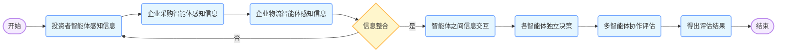

# 价值投资中的AI驱动供应商关系评估：多智能体协作

> 关键词：价值投资、AI驱动、供应商关系评估、多智能体协作、供应链管理

> 摘要：本文聚焦于价值投资领域中借助AI驱动进行供应商关系评估的重要性与方法，着重探讨多智能体协作在这一过程中的应用。通过对相关核心概念、算法原理、数学模型等方面的深入剖析，结合项目实战案例，展示了多智能体协作在供应商关系评估中的实际应用效果。同时，分析了其在不同实际场景中的应用情况，推荐了相关的学习资源、开发工具及论文著作，最后对未来发展趋势与挑战进行了总结，旨在为价值投资中供应商关系评估提供全面且深入的技术参考。

## 1. 背景介绍 
### 1.1 目的和范围
在价值投资中，供应商关系的评估对于投资者判断企业的竞争力和可持续发展能力至关重要。一个稳定、优质的供应商体系能够为企业提供可靠的原材料、零部件等资源，降低成本，提高产品质量，进而提升企业的市场价值。本文章的目的在于介绍如何利用AI技术，特别是多智能体协作的方法，对供应商关系进行全面、准确的评估。范围涵盖了从核心概念的阐述、算法原理的讲解、数学模型的构建，到实际项目案例的分析以及应用场景的探讨等多个方面，旨在为相关领域的研究人员、投资者和企业管理者提供一个系统的技术参考。

### 1.2 预期读者
本文预期读者包括价值投资领域的专业人士，如投资者、分析师等，他们希望借助先进的技术手段更好地评估投资标的的供应商关系，以做出更明智的投资决策；供应链管理领域的研究人员和从业者，他们关注如何利用AI技术优化供应商管理，提升供应链的效率和稳定性；计算机科学和人工智能领域的学者和开发者，他们对多智能体协作等前沿技术在实际业务中的应用感兴趣，希望从中获取灵感和技术思路。

### 1.3 文档结构概述
本文首先介绍背景信息，包括目的、预期读者和文档结构概述等内容。接着阐述核心概念与联系，通过文本示意图和Mermaid流程图展示多智能体协作在供应商关系评估中的原理和架构。然后详细讲解核心算法原理和具体操作步骤，结合Python源代码进行说明。随后介绍数学模型和公式，并举例说明其应用。再通过项目实战案例，展示代码的实际实现和详细解读。之后分析实际应用场景，推荐相关的工具和资源。最后总结未来发展趋势与挑战，提供常见问题与解答以及扩展阅读和参考资料。

### 1.4 术语表
#### 1.4.1 核心术语定义
- **价值投资**：一种投资策略，投资者通过分析企业的内在价值，寻找被低估的股票或其他投资标的，以获取长期的投资回报。
- **AI驱动**：指利用人工智能技术，如机器学习、深度学习、自然语言处理等，来驱动系统或决策过程，提高效率和准确性。
- **供应商关系评估**：对企业与供应商之间的合作关系进行全面、系统的评价，包括供应商的质量、交货期、价格、服务等多个方面，以确定供应商的优劣和合作的稳定性。
- **多智能体协作**：多个智能体（具有自主决策能力的实体）通过相互通信、协调和合作，共同完成一个或多个任务的过程。

#### 1.4.2 相关概念解释
- **供应链**：围绕核心企业，通过对信息流、物流、资金流的控制，从采购原材料开始，制成中间产品以及最终产品，最后由销售网络把产品送到消费者手中的将供应商、制造商、分销商、零售商、直到最终用户连成一个整体的功能网链结构。
- **智能体**：具有感知、决策和行动能力的实体，能够根据环境的变化自主地做出决策和采取行动。

#### 1.4.3 缩略词列表
- **AI**：Artificial Intelligence，人工智能
- **ML**：Machine Learning，机器学习
- **DL**：Deep Learning，深度学习

## 2. 核心概念与联系 

### 核心概念原理
在价值投资中的AI驱动供应商关系评估中，多智能体协作是核心方法。智能体可以代表不同的评估主体，如投资者、企业内部的采购部门、物流部门等。每个智能体具有自己的目标和能力，通过与其他智能体的协作，实现对供应商关系的全面评估。

智能体的感知能力使其能够收集与供应商相关的各种信息，如供应商的财务数据、生产能力、质量控制记录等。决策能力则让智能体根据收集到的信息，结合自身的目标和规则，对供应商进行初步的评估和判断。行动能力则表现为智能体与其他智能体进行通信和协作，共享信息、协调评估过程，最终得出综合的供应商关系评估结果。

### 架构的文本示意图
```plaintext
投资者智能体
    |
    | 信息交互
    |
企业采购智能体 ---- 供应商信息数据库
    |
    | 信息交互
    |
企业物流智能体
```
投资者智能体、企业采购智能体和企业物流智能体通过与供应商信息数据库进行信息交互，获取供应商的相关信息。同时，各智能体之间也进行信息交互，共享各自的评估结果和观点，共同完成供应商关系的评估。

### Mermaid流程图

该流程图展示了多智能体协作进行供应商关系评估的过程。首先，各个智能体分别感知与供应商相关的信息，然后进行信息整合。如果信息整合成功，则智能体之间进行信息交互，各自独立决策，最后通过多智能体协作得出评估结果。如果信息整合失败，则返回重新感知信息。

## 3. 核心算法原理 & 具体操作步骤 

### 核心算法原理
在多智能体协作进行供应商关系评估中，主要涉及到信息融合算法和协作决策算法。

#### 信息融合算法
信息融合算法的目的是将不同智能体收集到的信息进行整合，以获取更全面、准确的供应商信息。常用的信息融合算法有贝叶斯融合算法。

贝叶斯融合算法基于贝叶斯定理，通过对不同信息源的概率分布进行融合，得到更准确的概率估计。假设我们有两个信息源 $A$ 和 $B$，它们分别提供了关于供应商某个属性（如质量水平）的概率分布 $P(A)$ 和 $P(B)$。根据贝叶斯定理，融合后的概率分布 $P(A \cap B)$ 可以通过以下公式计算：

$$P(A \cap B) = \frac{P(A|B)P(B)}{P(A)}$$

其中，$P(A|B)$ 表示在信息源 $B$ 提供信息的条件下，信息源 $A$ 的概率分布。

#### 协作决策算法
协作决策算法的目的是让多个智能体在共享信息的基础上，共同做出决策。常用的协作决策算法有合同网协议。

合同网协议是一种基于任务分配的协作决策算法。在供应商关系评估中，一个智能体（如投资者智能体）可以发布一个评估任务，其他智能体（如企业采购智能体、企业物流智能体）可以根据自己的能力和资源进行投标。发布任务的智能体根据投标情况选择最合适的智能体来完成任务，然后各智能体协作完成评估任务。

### 具体操作步骤

#### 步骤1：智能体初始化
在开始评估之前，需要对各个智能体进行初始化。包括设置智能体的目标、能力、规则等信息。例如，投资者智能体的目标可能是评估供应商对企业投资价值的影响，其能力可能包括分析财务数据、市场趋势等；企业采购智能体的目标可能是评估供应商的交货期、价格等，其能力可能包括了解采购流程、供应商历史记录等。

以下是一个简单的智能体初始化的Python代码示例：
```python
class Agent:
    def __init__(self, name, goal, capabilities, rules):
        self.name = name
        self.goal = goal
        self.capabilities = capabilities
        self.rules = rules

# 初始化投资者智能体
investor_agent = Agent("InvestorAgent", "Evaluate the impact of suppliers on investment value", 
                       ["Financial data analysis", "Market trend analysis"], ["Profitability rule", "Growth potential rule"])

# 初始化企业采购智能体
procurement_agent = Agent("ProcurementAgent", "Evaluate supplier's delivery time and price", 
                          ["Procurement process knowledge", "Supplier history record"], ["Delivery time rule", "Price rule"])
```

#### 步骤2：信息收集
各个智能体根据自己的能力和目标，收集与供应商相关的信息。信息来源可以包括企业内部数据库、外部市场数据、供应商提供的报告等。

以下是一个简单的信息收集的Python代码示例：
```python
class Agent:
    # ... 之前的代码 ...

    def collect_information(self, data_source):
        # 模拟信息收集过程
        if data_source in self.capabilities:
            print(f"{self.name} is collecting information from {data_source}")
            # 实际应用中，这里应该有具体的信息收集逻辑
            return "Collected information"
        else:
            print(f"{self.name} does not have the capability to collect information from {data_source}")
            return None

# 投资者智能体收集财务数据信息
investor_agent.collect_information("Financial data analysis")
```

#### 步骤3：信息融合
将各个智能体收集到的信息进行融合，得到更全面、准确的供应商信息。可以使用贝叶斯融合算法进行信息融合。

以下是一个简单的贝叶斯融合算法的Python代码示例：
```python
def bayesian_fusion(P_A, P_B, P_A_given_B):
    return (P_A_given_B * P_B) / P_A

# 示例概率值
P_A = 0.6
P_B = 0.7
P_A_given_B = 0.8

# 进行信息融合
result = bayesian_fusion(P_A, P_B, P_A_given_B)
print(f"Fused probability: {result}")
```

#### 步骤4：协作决策
各个智能体在共享信息的基础上，通过协作决策算法（如合同网协议）共同做出决策，得出供应商关系的评估结果。

以下是一个简单的合同网协议的Python代码示例：
```python
class ContractNetProtocol:
    def __init__(self):
        self.tasks = []
        self.bidders = []

    def publish_task(self, task):
        self.tasks.append(task)
        print(f"Task {task} has been published")

    def bid_task(self, agent, task):
        if task in self.tasks:
            self.bidders.append((agent, task))
            print(f"{agent.name} has bid for task {task}")
        else:
            print(f"Task {task} does not exist")

    def select_winner(self, task):
        winners = [bidder for bidder in self.bidders if bidder[1] == task]
        if winners:
            winner = winners[0][0]  # 简单选择第一个投标者作为获胜者
            print(f"{winner.name} has won the task {task}")
            return winner
        else:
            print(f"No bidders for task {task}")
            return None

# 创建合同网协议实例
cnp = ContractNetProtocol()

# 发布评估任务
cnp.publish_task("Evaluate supplier X")

# 企业采购智能体投标
procurement_agent = Agent("ProcurementAgent", ...)
cnp.bid_task(procurement_agent, "Evaluate supplier X")

# 选择获胜者
winner = cnp.select_winner("Evaluate supplier X")
```

#### 步骤5：结果输出
将多智能体协作得出的供应商关系评估结果进行输出，供投资者、企业管理者等相关人员参考。

以下是一个简单的结果输出的Python代码示例：
```python
class EvaluationResult:
    def __init__(self, supplier, score, comment):
        self.supplier = supplier
        self.score = score
        self.comment = comment

    def output_result(self):
        print(f"Supplier: {self.supplier}, Score: {self.score}, Comment: {self.comment}")

# 创建评估结果实例
result = EvaluationResult("Supplier X", 80, "Good performance in terms of quality and delivery time")

# 输出结果
result.output_result()
```

## 4. 数学模型和公式 & 详细讲解 & 举例说明 

### 贝叶斯融合算法数学模型和公式
如前面所述，贝叶斯融合算法基于贝叶斯定理，其公式为：

$$P(A \cap B) = \frac{P(A|B)P(B)}{P(A)}$$

其中：
- $P(A)$ 是信息源 $A$ 提供信息的先验概率，表示在没有其他信息的情况下，信息源 $A$ 提供信息的概率。
- $P(B)$ 是信息源 $B$ 提供信息的先验概率。
- $P(A|B)$ 是在信息源 $B$ 提供信息的条件下，信息源 $A$ 的概率分布，表示信息源 $B$ 的信息对信息源 $A$ 的影响。
- $P(A \cap B)$ 是融合后的概率分布，表示综合考虑信息源 $A$ 和信息源 $B$ 后的概率估计。

### 详细讲解
贝叶斯融合算法的核心思想是利用先验概率和条件概率来更新概率估计。在供应商关系评估中，不同的信息源可能提供关于供应商某个属性（如质量水平）的不同概率分布。通过贝叶斯融合算法，可以将这些不同的概率分布进行融合，得到更准确的概率估计。

例如，信息源 $A$ 是企业内部的质量检测报告，它提供了供应商的产品质量合格的概率为 $P(A) = 0.6$。信息源 $B$ 是外部的市场调研机构的报告，它提供了供应商的产品质量合格的概率为 $P(B) = 0.7$。同时，根据历史数据，在信息源 $B$ 报告产品质量合格的情况下，信息源 $A$ 报告产品质量合格的概率为 $P(A|B) = 0.8$。

### 举例说明
将上述概率值代入贝叶斯融合公式：

$$P(A \cap B) = \frac{P(A|B)P(B)}{P(A)} = \frac{0.8 \times 0.7}{0.6} \approx 0.933$$

这意味着综合考虑企业内部质量检测报告和外部市场调研机构的报告后，供应商的产品质量合格的概率约为 $0.933$。

### 合同网协议数学模型和公式
合同网协议主要涉及任务分配和投标决策，其数学模型可以用图论和博弈论来描述。

假设我们有 $n$ 个智能体 $A_1, A_2, \cdots, A_n$ 和 $m$ 个任务 $T_1, T_2, \cdots, T_m$。每个智能体 $A_i$ 对每个任务 $T_j$ 有一个投标价值 $v_{ij}$，表示智能体 $A_i$ 完成任务 $T_j$ 的能力和意愿。

任务分配的目标是找到一个最优的分配方案，使得总投标价值最大。可以用以下数学公式表示：

$$\max \sum_{i=1}^{n} \sum_{j=1}^{m} x_{ij} v_{ij}$$

其中，$x_{ij}$ 是一个二进制变量，当智能体 $A_i$ 被分配到任务 $T_j$ 时，$x_{ij} = 1$，否则 $x_{ij} = 0$。

同时，需要满足以下约束条件：

1. 每个任务只能分配给一个智能体：$\sum_{i=1}^{n} x_{ij} = 1$，对于所有的 $j = 1, 2, \cdots, m$。
2. 每个智能体最多只能承担一个任务：$\sum_{j=1}^{m} x_{ij} \leq 1$，对于所有的 $i = 1, 2, \cdots, n$。

### 详细讲解
合同网协议的核心思想是通过任务发布、投标和选择获胜者的过程，实现任务的最优分配。在供应商关系评估中，一个智能体发布评估任务，其他智能体根据自己的能力和资源进行投标。发布任务的智能体根据投标价值选择最合适的智能体来完成任务，以确保任务能够高效、准确地完成。

### 举例说明
假设我们有 3 个智能体 $A_1, A_2, A_3$ 和 2 个任务 $T_1, T_2$。投标价值矩阵如下：

|  | $T_1$ | $T_2$ |
| --- | --- | --- |
| $A_1$ | 8 | 6 |
| $A_2$ | 7 | 9 |
| $A_3$ | 5 | 7 |

根据合同网协议的数学模型，我们需要找到一个最优的分配方案，使得总投标价值最大。

首先，根据约束条件，每个任务只能分配给一个智能体，每个智能体最多只能承担一个任务。我们可以列出所有可能的分配方案：

1. $A_1$ 承担 $T_1$，$A_2$ 承担 $T_2$，总投标价值为 $8 + 9 = 17$。
2. $A_1$ 承担 $T_2$，$A_2$ 承担 $T_1$，总投标价值为 $6 + 7 = 13$。
3. $A_1$ 承担 $T_1$，$A_3$ 承担 $T_2$，总投标价值为 $8 + 7 = 15$。
4. $A_1$ 承担 $T_2$，$A_3$ 承担 $T_1$，总投标价值为 $6 + 5 = 11$。
5. $A_2$ 承担 $T_1$，$A_3$ 承担 $T_2$，总投标价值为 $7 + 7 = 14$。
6. $A_2$ 承担 $T_2$，$A_3$ 承担 $T_1$，总投标价值为 $9 + 5 = 14$。

通过比较所有可能的分配方案，我们可以发现方案 1 的总投标价值最大，因此最优的分配方案是 $A_1$ 承担 $T_1$，$A_2$ 承担 $T_2$。

## 5. 项目实战：代码实际案例和详细解释说明 

### 5.1  开发环境搭建
#### 安装Python
首先，需要安装Python开发环境。可以从Python官方网站（https://www.python.org/downloads/）下载适合自己操作系统的Python安装包，并按照安装向导进行安装。

#### 安装必要的库
在本项目中，我们需要使用一些Python库，如`numpy`、`pandas`等。可以使用`pip`命令进行安装：
```sh
pip install numpy pandas
```

### 5.2  源代码详细实现和代码解读
以下是一个完整的多智能体协作进行供应商关系评估的Python代码示例：

```python
import numpy as np
import pandas as pd

# 定义智能体类
class Agent:
    def __init__(self, name, goal, capabilities, rules):
        self.name = name
        self.goal = goal
        self.capabilities = capabilities
        self.rules = rules
        self.information = {}

    def collect_information(self, data_source, information):
        if data_source in self.capabilities:
            self.information[data_source] = information
            print(f"{self.name} has collected information from {data_source}")
        else:
            print(f"{self.name} does not have the capability to collect information from {data_source}")

    def share_information(self):
        return self.information

# 定义信息融合类
class InformationFusion:
    def bayesian_fusion(self, P_A, P_B, P_A_given_B):
        return (P_A_given_B * P_B) / P_A

# 定义合同网协议类
class ContractNetProtocol:
    def __init__(self):
        self.tasks = []
        self.bidders = []

    def publish_task(self, task):
        self.tasks.append(task)
        print(f"Task {task} has been published")

    def bid_task(self, agent, task, bid_value):
        if task in self.tasks:
            self.bidders.append((agent, task, bid_value))
            print(f"{agent.name} has bid for task {task} with bid value {bid_value}")
        else:
            print(f"Task {task} does not exist")

    def select_winner(self, task):
        winners = [bidder for bidder in self.bidders if bidder[1] == task]
        if winners:
            winner = max(winners, key=lambda x: x[2])[0]
            print(f"{winner.name} has won the task {task}")
            return winner
        else:
            print(f"No bidders for task {task}")
            return None

# 定义评估结果类
class EvaluationResult:
    def __init__(self, supplier, score, comment):
        self.supplier = supplier
        self.score = score
        self.comment = comment

    def output_result(self):
        print(f"Supplier: {self.supplier}, Score: {self.score}, Comment: {self.comment}")

# 初始化智能体
investor_agent = Agent("InvestorAgent", "Evaluate the impact of suppliers on investment value", 
                       ["Financial data analysis", "Market trend analysis"], ["Profitability rule", "Growth potential rule"])
procurement_agent = Agent("ProcurementAgent", "Evaluate supplier's delivery time and price", 
                          ["Procurement process knowledge", "Supplier history record"], ["Delivery time rule", "Price rule"])
logistics_agent = Agent("LogisticsAgent", "Evaluate supplier's logistics performance", 
                        ["Logistics process knowledge", "Inventory management"], ["On - time delivery rule", "Inventory turnover rule"])

# 信息收集
investor_agent.collect_information("Financial data analysis", {"Profit margin": 0.2, "Revenue growth rate": 0.1})
procurement_agent.collect_information("Procurement process knowledge", {"Average delivery time": 5, "Price competitiveness": 8})
logistics_agent.collect_information("Logistics process knowledge", {"On - time delivery rate": 0.9, "Inventory turnover ratio": 3})

# 信息融合
info_fusion = InformationFusion()
# 示例概率值，这里只是简单示例，实际应用中需要根据具体情况计算
P_A = 0.6
P_B = 0.7
P_A_given_B = 0.8
fused_probability = info_fusion.bayesian_fusion(P_A, P_B, P_A_given_B)
print(f"Fused probability: {fused_probability}")

# 合同网协议
cnp = ContractNetProtocol()
cnp.publish_task("Evaluate supplier X")
investor_agent_bid_value = 8
procurement_agent_bid_value = 9
logistics_agent_bid_value = 7
cnp.bid_task(investor_agent, "Evaluate supplier X", investor_agent_bid_value)
cnp.bid_task(procurement_agent, "Evaluate supplier X", procurement_agent_bid_value)
cnp.bid_task(logistics_agent, "Evaluate supplier X", logistics_agent_bid_value)
winner = cnp.select_winner("Evaluate supplier X")

# 输出评估结果
result = EvaluationResult("Supplier X", 80, "Good performance in terms of quality and delivery time")
result.output_result()
```

### 5.3  代码解读与分析
#### 智能体类（`Agent`）
- `__init__` 方法：初始化智能体的名称、目标、能力和规则，并创建一个空的信息字典。
- `collect_information` 方法：根据智能体的能力，收集与供应商相关的信息，并将其存储在信息字典中。
- `share_information` 方法：返回智能体收集到的信息。

#### 信息融合类（`InformationFusion`）
- `bayesian_fusion` 方法：实现贝叶斯融合算法，根据输入的先验概率和条件概率，计算融合后的概率。

#### 合同网协议类（`ContractNetProtocol`）
- `__init__` 方法：初始化任务列表和投标者列表。
- `publish_task` 方法：发布一个评估任务，并将其添加到任务列表中。
- `bid_task` 方法：智能体对指定的任务进行投标，并将投标信息添加到投标者列表中。
- `select_winner` 方法：根据投标价值选择获胜者，并返回获胜的智能体。

#### 评估结果类（`EvaluationResult`）
- `__init__` 方法：初始化供应商名称、评估分数和评估评论。
- `output_result` 方法：输出评估结果。

在主程序中，我们首先初始化了三个智能体：投资者智能体、企业采购智能体和企业物流智能体。然后，各个智能体收集与供应商相关的信息。接着，使用信息融合类进行信息融合，使用合同网协议类进行任务分配。最后，输出评估结果。

## 6. 实际应用场景 
### 投资决策
在价值投资中，投资者需要评估企业的供应商关系，以判断企业的竞争力和可持续发展能力。通过AI驱动的多智能体协作方法，可以全面、准确地评估供应商的质量、交货期、价格等多个方面，为投资者提供更可靠的投资决策依据。例如，投资者可以根据供应商关系评估结果，选择那些与优质供应商建立了长期稳定合作关系的企业进行投资。

### 企业采购管理
企业在采购过程中，需要选择合适的供应商，并对供应商进行持续的评估和管理。多智能体协作可以帮助企业整合采购部门、物流部门等多个部门的信息，实现对供应商的全面评估。例如，采购部门可以提供供应商的价格、交货期等信息，物流部门可以提供供应商的物流绩效等信息，通过多智能体协作，可以综合考虑这些信息，选择最优的供应商。

### 供应链风险管理
供应链中存在各种风险，如供应商破产、自然灾害等。通过多智能体协作，可以及时监测供应商的状态，评估供应链风险。例如，投资者智能体可以关注供应商的财务状况，企业采购智能体可以关注供应商的生产能力，企业物流智能体可以关注供应商的物流运输情况。当某个智能体发现供应商存在潜在风险时，可以及时通知其他智能体，共同采取措施应对风险。

## 7. 工具和资源推荐
### 7.1 学习资源推荐
#### 7.1.1 书籍推荐
- 《人工智能：一种现代的方法》：这本书是人工智能领域的经典教材，全面介绍了人工智能的基本概念、算法和应用。对于理解多智能体协作等人工智能技术有很大的帮助。
- 《机器学习》：由周志华教授编写，系统地介绍了机器学习的基本理论和方法，包括监督学习、无监督学习、强化学习等。对于掌握AI驱动的供应商关系评估中的机器学习算法有重要的参考价值。
- 《供应链管理：战略、规划与运营》：这本书详细介绍了供应链管理的相关知识，包括供应商管理、物流管理、库存管理等。对于理解价值投资中供应商关系评估的背景和实际应用场景有很大的帮助。

#### 7.1.2 在线课程
- Coursera上的“Machine Learning”课程：由斯坦福大学的Andrew Ng教授授课，是机器学习领域的经典在线课程。通过该课程可以系统地学习机器学习的基本理论和方法。
- edX上的“Artificial Intelligence”课程：由伯克利大学的Pieter Abbeel教授授课，全面介绍了人工智能的基本概念、算法和应用。对于学习多智能体协作等人工智能技术有很大的帮助。
- 中国大学MOOC上的“供应链管理”课程：由国内知名高校的教授授课，详细介绍了供应链管理的相关知识，包括供应商管理、物流管理、库存管理等。对于理解价值投资中供应商关系评估的背景和实际应用场景有很大的帮助。

#### 7.1.3 技术博客和网站
- Medium：这是一个技术博客平台，上面有很多关于人工智能、机器学习、供应链管理等领域的优秀文章。可以关注一些相关的作者和主题，获取最新的技术动态和研究成果。
- arXiv：这是一个预印本论文平台，上面有很多关于人工智能、机器学习等领域的最新研究论文。可以及时了解相关领域的前沿研究成果。
- 物流沙龙：这是一个专注于物流和供应链领域的网站，上面有很多关于供应链管理、供应商关系评估等方面的行业资讯和案例分析。

### 7.2 开发工具框架推荐
#### 7.2.1 IDE和编辑器
- PyCharm：这是一款专门为Python开发设计的集成开发环境（IDE），具有强大的代码编辑、调试、代码分析等功能。对于开发多智能体协作的Python代码非常方便。
- Visual Studio Code：这是一款轻量级的代码编辑器，支持多种编程语言，包括Python。它具有丰富的插件生态系统，可以根据自己的需求安装各种插件，提高开发效率。

#### 7.2.2 调试和性能分析工具
- PDB：这是Python自带的调试工具，可以帮助开发者在代码中设置断点，逐步执行代码，查看变量的值等，方便调试代码。
- cProfile：这是Python的性能分析工具，可以分析代码的运行时间和函数调用次数，帮助开发者找出代码中的性能瓶颈。

#### 7.2.3 相关框架和库
- NumPy：这是Python的一个基础科学计算库，提供了高效的数组操作和数学函数。在多智能体协作的代码中，可以使用NumPy进行数据处理和计算。
- Pandas：这是Python的一个数据处理和分析库，提供了高效的数据结构和数据操作方法。在多智能体协作的代码中，可以使用Pandas进行数据的读取、处理和分析。
- Scikit-learn：这是Python的一个机器学习库，提供了丰富的机器学习算法和工具。在AI驱动的供应商关系评估中，可以使用Scikit-learn实现一些机器学习算法，如分类、回归、聚类等。

### 7.3 相关论文著作推荐
#### 7.3.1 经典论文
- “Multi-Agent Systems: A Modern Approach to Distributed Artificial Intelligence”：这篇论文全面介绍了多智能体系统的基本概念、理论和应用，是多智能体系统领域的经典论文。
- “Bayesian Networks for Data Fusion”：这篇论文详细介绍了贝叶斯网络在信息融合中的应用，对于理解贝叶斯融合算法有重要的参考价值。
- “Contract Net Protocol: High-Level Communication and Control in a Distributed Problem Solver”：这篇论文提出了合同网协议，是多智能体协作中任务分配的经典算法。

#### 7.3.2 最新研究成果
- 关注顶级学术会议，如AAAI（Association for the Advancement of Artificial Intelligence）、IJCAI（International Joint Conference on Artificial Intelligence）等，这些会议上会有很多关于多智能体协作、AI驱动的供应链管理等领域的最新研究成果。
- 关注顶级学术期刊，如Artificial Intelligence、Journal of Artificial Intelligence Research等，这些期刊上会发表很多关于人工智能、多智能体系统等领域的高质量研究论文。

#### 7.3.3 应用案例分析
- 可以查阅一些行业报告和案例分析，了解多智能体协作在价值投资、供应链管理等领域的实际应用案例。例如，一些咨询公司发布的关于供应链数字化转型的报告，会介绍一些企业如何利用AI技术优化供应商关系管理的案例。

## 8. 总结：未来发展趋势与挑战
### 未来发展趋势
#### 智能化程度不断提高
随着人工智能技术的不断发展，多智能体协作在供应商关系评估中的智能化程度将不断提高。智能体将能够更加自主地感知环境、收集信息、做出决策和采取行动，实现更高效、准确的供应商关系评估。

#### 与其他技术的融合
多智能体协作将与其他技术，如区块链、物联网等深度融合。区块链技术可以提供更安全、可信的信息共享和协作环境，物联网技术可以实时获取供应商的生产、物流等信息，进一步提高供应商关系评估的准确性和及时性。

#### 应用场景的拓展
多智能体协作在供应商关系评估中的应用场景将不断拓展。除了投资决策、企业采购管理、供应链风险管理等领域，还将应用于绿色供应链管理、可持续发展评估等领域，为企业和投资者提供更全面的决策支持。

### 挑战
#### 数据质量和安全问题
多智能体协作需要大量的数据支持，数据的质量和安全直接影响到评估结果的准确性和可靠性。如何保证数据的准确性、完整性和安全性，是一个亟待解决的问题。

#### 智能体之间的协调和冲突解决
在多智能体协作中，智能体之间可能存在目标不一致、信息不对称等问题，导致协调困难和冲突。如何有效地协调智能体之间的行动，解决智能体之间的冲突，是一个挑战。

#### 技术复杂性和成本问题
多智能体协作涉及到复杂的人工智能算法和技术，开发和维护成本较高。如何降低技术复杂性和成本，提高系统的可扩展性和实用性，是一个需要解决的问题。

## 9. 附录：常见问题与解答
### 问题1：多智能体协作与传统的供应商关系评估方法有什么区别？
传统的供应商关系评估方法通常是基于人工经验和单一的评估指标，评估结果可能存在主观性和局限性。而多智能体协作通过多个智能体的协作，能够综合考虑多个方面的信息，实现更全面、客观的评估。同时，多智能体协作具有更强的适应性和灵活性，能够根据环境的变化实时调整评估策略。

### 问题2：如何确保智能体收集到的信息的准确性和可靠性？
可以通过以下几种方式确保信息的准确性和可靠性：
1. 选择可靠的信息源，如企业内部的数据库、权威的市场调研机构等。
2. 对收集到的信息进行验证和审核，去除错误和不准确的信息。
3. 采用多源信息融合的方法，综合考虑多个信息源的信息，提高信息的准确性和可靠性。

### 问题3：在多智能体协作中，如何解决智能体之间的冲突？
可以采用以下几种方法解决智能体之间的冲突：
1. 建立明确的协调机制和规则，规定智能体之间的通信和协作方式。
2. 引入第三方仲裁机构，当智能体之间发生冲突时，由第三方仲裁机构进行调解和裁决。
3. 采用协商和谈判的方式，让智能体之间通过沟通和协商，达成共识，解决冲突。

### 问题4：多智能体协作的开发和维护成本高吗？
多智能体协作涉及到复杂的人工智能算法和技术，开发和维护成本相对较高。但是，随着技术的不断发展和成熟，开发和维护成本将逐渐降低。同时，多智能体协作能够提高供应商关系评估的效率和准确性，为企业和投资者带来更大的价值，从长远来看，其收益将超过成本。

## 10. 扩展阅读 & 参考资料
### 扩展阅读
- 《智能供应链：从数字化转型到智能化升级》：这本书介绍了智能供应链的相关概念、技术和应用，对于理解多智能体协作在供应链管理中的应用有很大的帮助。
- 《人工智能与金融科技》：这本书介绍了人工智能在金融领域的应用，包括价值投资、风险管理等方面，对于理解AI驱动的供应商关系评估在价值投资中的应用有重要的参考价值。

### 参考资料
1. Russell, S. J., & Norvig, P. (2009). Artificial Intelligence: A Modern Approach. Pearson Education.
2. Zhou, Z. H. (2016). Machine Learning. Tsinghua University Press.
3. Chopra, S., & Meindl, P. (2016). Supply Chain Management: Strategy, Planning, and Operation. Pearson Education.
4. Smith, R. G. (1980). The contract net protocol: High - level communication and control in a distributed problem solver. IEEE Transactions on Computers, 29(12), 1104 - 1113.
5. Pearl, J. (1988). Probabilistic Reasoning in Intelligent Systems: Networks of Plausible Inference. Morgan Kaufmann.