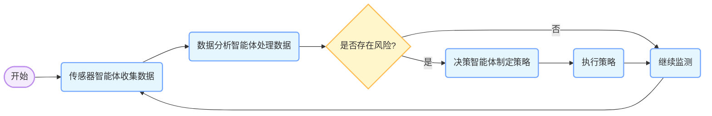

# 价值投资中的AI驱动供应链韧性评估：多智能体协作

> 关键词：价值投资、AI、供应链韧性评估、多智能体协作、人工智能、风险管理

> 摘要：本文聚焦于价值投资领域中借助AI驱动的供应链韧性评估，深入探讨多智能体协作的相关技术与应用。首先介绍了研究的背景和意义，明确了预期读者和文档结构。接着详细阐述了核心概念，包括多智能体系统、供应链韧性等，并给出了相应的原理和架构示意图。在核心算法原理部分，使用Python代码详细阐述了多智能体协作的实现过程。同时，通过数学模型和公式进一步解释了相关原理，并举例说明。在项目实战中，介绍了开发环境搭建、源代码实现及解读。还探讨了实际应用场景，推荐了相关的学习资源、开发工具框架和论文著作。最后对未来发展趋势与挑战进行了总结，并给出了常见问题的解答和参考资料，旨在为价值投资中供应链韧性评估提供全面且深入的技术支持和理论指导。

## 1. 背景介绍 
### 1.1 目的和范围
在当今复杂多变的商业环境中，供应链面临着各种不确定性和风险，如自然灾害、政治动荡、市场波动等。这些因素可能导致供应链中断，给企业带来巨大的损失。对于价值投资者来说，准确评估供应链的韧性至关重要，因为供应链的稳定性直接影响企业的长期价值和盈利能力。本研究的目的是利用人工智能技术，特别是多智能体协作，开发一种有效的供应链韧性评估方法，为价值投资决策提供科学依据。

本研究的范围涵盖了从理论基础到实际应用的多个方面。在理论层面，探讨了多智能体系统的原理、供应链韧性的概念和评估指标；在技术层面，研究了如何利用AI算法实现多智能体协作，并将其应用于供应链韧性评估；在应用层面，通过实际案例验证了所提出方法的有效性和实用性。

### 1.2 预期读者
本文的预期读者包括价值投资者、供应链管理人员、人工智能研究人员和相关领域的学者。对于价值投资者来说，本文提供了一种新的评估供应链韧性的方法，有助于他们做出更明智的投资决策；对于供应链管理人员来说，本文介绍的多智能体协作技术可以帮助他们提高供应链的稳定性和抗风险能力；对于人工智能研究人员来说，本文为多智能体系统在供应链领域的应用提供了新的思路和方法；对于相关领域的学者来说，本文可以作为进一步研究的参考资料。

### 1.3 文档结构概述
本文共分为十个部分。第一部分为背景介绍，阐述了研究的目的、范围、预期读者和文档结构；第二部分介绍了核心概念与联系，包括多智能体系统、供应链韧性等，并给出了相应的原理和架构示意图；第三部分详细讲解了核心算法原理和具体操作步骤，使用Python代码进行了详细阐述；第四部分介绍了数学模型和公式，并通过举例进行了说明；第五部分为项目实战，包括开发环境搭建、源代码详细实现和代码解读；第六部分探讨了实际应用场景；第七部分推荐了相关的学习资源、开发工具框架和论文著作；第八部分总结了未来发展趋势与挑战；第九部分为附录，解答了常见问题；第十部分提供了扩展阅读和参考资料。

### 1.4 术语表
#### 1.4.1 核心术语定义
- **价值投资**：一种投资策略，强调通过分析企业的内在价值来选择投资标的，注重长期投资回报。
- **人工智能（AI）**：计算机科学的一个分支，旨在使计算机能够模拟人类的智能行为，如学习、推理、决策等。
- **供应链韧性**：供应链在面临内外部干扰时，能够快速恢复到正常运行状态，并保持其功能和绩效的能力。
- **多智能体系统（MAS）**：由多个智能体组成的系统，这些智能体可以通过相互协作来完成复杂的任务。
- **智能体**：具有自主决策能力的实体，能够感知环境、处理信息，并根据目标和规则做出决策。

#### 1.4.2 相关概念解释
- **风险管理**：识别、评估和应对风险的过程，旨在降低风险对企业的影响。
- **数据分析**：对大量数据进行收集、整理、分析和解释的过程，以发现有价值的信息和知识。
- **机器学习**：人工智能的一个重要分支，通过让计算机从数据中学习模式和规律，来实现预测和决策。
- **深度学习**：一种基于神经网络的机器学习方法，能够自动提取数据的特征和模式。

#### 1.4.3 缩略词列表
- **AI**：Artificial Intelligence（人工智能）
- **MAS**：Multi - Agent System（多智能体系统）
- **ML**：Machine Learning（机器学习）
- **DL**：Deep Learning（深度学习）

## 2. 核心概念与联系 
### 2.1 多智能体系统原理
多智能体系统是由多个智能体组成的分布式系统，这些智能体具有自主决策能力和一定的智能水平。每个智能体可以感知环境中的信息，并根据自身的目标和规则做出决策。智能体之间通过通信和协作来完成复杂的任务。

多智能体系统的基本原理包括以下几个方面：
- **自主性**：每个智能体都有自己的目标和决策机制，能够独立地感知环境和做出决策。
- **交互性**：智能体之间可以通过通信和协作来交换信息、协调行动，以实现共同的目标。
- **适应性**：智能体能够根据环境的变化和其他智能体的行为调整自己的决策和行动。
- **分布性**：多智能体系统中的智能体可以分布在不同的地理位置，通过网络进行通信和协作。

### 2.2 供应链韧性概念
供应链韧性是指供应链在面临内外部干扰时，能够快速恢复到正常运行状态，并保持其功能和绩效的能力。供应链韧性的评估需要考虑多个方面的因素，如供应链的灵活性、可靠性、响应能力等。

供应链韧性的主要特征包括：
- **鲁棒性**：供应链在正常情况下能够稳定运行，对小的干扰具有一定的抵抗力。
- **恢复力**：当供应链受到干扰时，能够快速恢复到正常运行状态，减少损失。
- **适应性**：供应链能够根据环境的变化和市场需求的波动，及时调整自己的结构和策略。
- **创新性**：供应链能够通过创新来提高自身的竞争力和抗风险能力。

### 2.3 多智能体协作与供应链韧性评估的联系
多智能体协作可以为供应链韧性评估提供有效的方法和技术支持。通过将不同类型的智能体分配到供应链的各个环节，可以实现对供应链的全面监测和评估。智能体之间可以通过协作来共享信息、分析数据，从而更准确地评估供应链的韧性。

例如，可以使用传感器智能体来实时监测供应链中的物流、生产等环节的状态；使用数据分析智能体来对监测数据进行处理和分析，挖掘潜在的风险和问题；使用决策智能体来根据分析结果制定相应的应对策略。通过多智能体的协作，可以提高供应链韧性评估的效率和准确性，为价值投资决策提供更可靠的依据。

### 2.4 核心概念原理和架构的文本示意图
多智能体协作的供应链韧性评估系统主要由以下几个部分组成：
- **智能体层**：包括各种类型的智能体，如传感器智能体、数据分析智能体、决策智能体等。
- **通信层**：负责智能体之间的信息传递和通信。
- **数据层**：存储供应链的相关数据，如物流数据、生产数据、市场数据等。
- **决策层**：根据智能体的分析结果，制定供应链韧性评估的决策和策略。

其架构示意图如下：

```plaintext
+-------------------+
|    决策层         |
+-------------------+
        |
        v
+-------------------+
|    通信层         |
+-------------------+
        |
        v
+-------------------+
|    智能体层       |
|  - 传感器智能体   |
|  - 数据分析智能体 |
|  - 决策智能体     |
+-------------------+
        |
        v
+-------------------+
|    数据层         |
|  - 物流数据       |
|  - 生产数据       |
|  - 市场数据       |
+-------------------+
```

### 2.5 Mermaid流程图


## 3. 核心算法原理 & 具体操作步骤 
### 3.1 多智能体协作算法原理
多智能体协作算法的核心思想是通过智能体之间的通信和协作，实现对复杂任务的分解和求解。在供应链韧性评估中，多智能体协作算法可以用于数据收集、数据分析和决策制定等环节。

一种常见的多智能体协作算法是基于合同网协议的算法。合同网协议是一种分布式任务分配协议，其基本原理如下：
1. **任务发布**：当有任务需要完成时，一个智能体（称为管理者）会发布任务招标信息，包括任务的描述、要求和截止日期等。
2. **投标**：其他智能体（称为投标者）收到招标信息后，会根据自己的能力和资源情况进行评估，并向管理者发送投标信息，包括自己的报价和完成任务的计划。
3. **中标选择**：管理者收到投标信息后，会根据一定的标准（如报价、能力等）选择最合适的投标者，并向其发送中标通知。
4. **任务执行**：中标者收到中标通知后，会按照计划执行任务，并在任务完成后向管理者发送任务完成报告。

### 3.2 Python源代码实现
以下是一个简单的基于合同网协议的多智能体协作算法的Python实现示例：

```python
import random

# 定义智能体类
class Agent:
    def __init__(self, name, capabilities):
        self.name = name
        self.capabilities = capabilities
        self.tasks = []

    def receive_task_announcement(self, task):
        # 评估任务是否可以完成
        if all(cap in self.capabilities for cap in task['capabilities']):
            # 生成随机报价
            bid = random.randint(1, 10)
            return {'agent': self.name, 'bid': bid}
        else:
            return None

    def receive_award(self, task):
        self.tasks.append(task)
        print(f"{self.name} 收到任务: {task['name']}")

    def execute_task(self):
        for task in self.tasks:
            print(f"{self.name} 正在执行任务: {task['name']}")
        self.tasks = []

# 定义管理者类
class Manager:
    def __init__(self, agents):
        self.agents = agents

    def announce_task(self, task):
        bids = []
        for agent in self.agents:
            bid = agent.receive_task_announcement(task)
            if bid:
                bids.append(bid)
        if bids:
            # 选择报价最低的智能体
            winner = min(bids, key=lambda x: x['bid'])
            for agent in self.agents:
                if agent.name == winner['agent']:
                    agent.receive_award(task)
        else:
            print("没有合适的智能体可以完成任务")

# 示例任务
task = {
    'name': '供应链数据收集',
    'capabilities': ['数据收集', '数据分析']
}

# 示例智能体
agent1 = Agent('Agent1', ['数据收集', '数据分析'])
agent2 = Agent('Agent2', ['数据收集'])
agent3 = Agent('Agent3', ['数据分析'])

# 示例管理者
manager = Manager([agent1, agent2, agent3])

# 发布任务
manager.announce_task(task)

# 执行任务
agent1.execute_task()
```

### 3.3 具体操作步骤
1. **定义智能体和管理者**：根据实际需求，定义不同类型的智能体和管理者，每个智能体具有一定的能力和资源。
2. **发布任务**：管理者根据供应链韧性评估的需求，发布相应的任务招标信息。
3. **投标**：智能体收到招标信息后，根据自己的能力和资源情况进行评估，并向管理者发送投标信息。
4. **中标选择**：管理者收到投标信息后，根据一定的标准选择最合适的投标者，并向其发送中标通知。
5. **任务执行**：中标者收到中标通知后，按照计划执行任务，并在任务完成后向管理者发送任务完成报告。
6. **结果评估**：管理者对任务执行结果进行评估，根据评估结果调整后续的任务分配和决策。

## 4. 数学模型和公式 & 详细讲解 & 举例说明 
### 4.1 供应链韧性评估指标
供应链韧性评估需要综合考虑多个指标，常见的指标包括：
- **可靠性**：供应链在规定的条件和时间内，完成规定功能的能力。可以用故障率 $\lambda$ 来表示，可靠性 $R(t)$ 可以通过以下公式计算：
$$R(t)=e^{-\lambda t}$$
其中，$t$ 为时间。

- **响应时间**：供应链在受到干扰后，恢复到正常运行状态所需的时间。可以用平均响应时间 $T_{r}$ 来表示。

- **灵活性**：供应链能够快速调整生产和物流计划，以适应市场需求变化的能力。可以用灵活性指标 $F$ 来表示，$F$ 可以通过以下公式计算：
$$F=\frac{\text{可调整的范围}}{\text{总范围}}$$

### 4.2 多智能体协作的优化模型
在多智能体协作中，需要优化任务分配和资源利用，以提高供应链韧性评估的效率和准确性。可以建立以下优化模型：

设 $A = \{a_1, a_2, \cdots, a_n\}$ 为智能体集合，$T = \{t_1, t_2, \cdots, t_m\}$ 为任务集合。$c_{ij}$ 表示智能体 $a_i$ 完成任务 $t_j$ 的成本，$x_{ij}$ 为决策变量，当智能体 $a_i$ 被分配到任务 $t_j$ 时，$x_{ij} = 1$，否则 $x_{ij} = 0$。

目标函数是最小化总成本：
$$\min \sum_{i = 1}^{n} \sum_{j = 1}^{m} c_{ij} x_{ij}$$

约束条件包括：
1. 每个任务只能由一个智能体完成：
$$\sum_{i = 1}^{n} x_{ij} = 1, \quad j = 1, 2, \cdots, m$$
2. 每个智能体完成的任务数量不能超过其能力限制：
$$\sum_{j = 1}^{m} x_{ij} \leq k_i, \quad i = 1, 2, \cdots, n$$
其中，$k_i$ 为智能体 $a_i$ 的能力限制。

### 4.3 举例说明
假设现在有 3 个智能体 $A = \{a_1, a_2, a_3\}$ 和 2 个任务 $T = \{t_1, t_2\}$，成本矩阵 $C$ 如下：
$$C=\begin{bmatrix}
2 & 3 \\
4 & 1 \\
3 & 2
\end{bmatrix}$$
智能体的能力限制分别为 $k_1 = 1$，$k_2 = 1$，$k_3 = 1$。

根据上述优化模型，我们可以列出以下约束条件：
$$x_{11} + x_{21} + x_{31} = 1$$
$$x_{12} + x_{22} + x_{32} = 1$$
$$x_{11} + x_{12} \leq 1$$
$$x_{21} + x_{22} \leq 1$$
$$x_{31} + x_{32} \leq 1$$

目标函数为：
$$\min 2x_{11} + 3x_{12} + 4x_{21} + 1x_{22} + 3x_{31} + 2x_{32}$$

通过求解这个线性规划问题，可以得到最优的任务分配方案。在这个例子中，最优方案是 $x_{11} = 1$，$x_{22} = 1$，$x_{31} = 0$，$x_{32} = 0$，$x_{12} = 0$，$x_{21} = 0$，即智能体 $a_1$ 完成任务 $t_1$，智能体 $a_2$ 完成任务 $t_2$，总成本为 $2 + 1 = 3$。

## 5. 项目实战：代码实际案例和详细解释说明 
### 5.1 开发环境搭建
#### 5.1.1 安装Python
首先需要安装Python开发环境，建议使用Python 3.7及以上版本。可以从Python官方网站（https://www.python.org/downloads/）下载并安装适合自己操作系统的Python版本。

#### 5.1.2 安装必要的库
在本项目中，需要使用一些Python库，如`numpy`、`pandas`等。可以使用`pip`命令进行安装：
```sh
pip install numpy pandas
```

#### 5.1.3 选择开发工具
可以选择使用集成开发环境（IDE），如PyCharm、VS Code等，也可以使用文本编辑器，如Sublime Text等。

### 5.2 源代码详细实现和代码解读
以下是一个更完整的基于多智能体协作的供应链韧性评估系统的Python代码示例：

```python
import numpy as np
import pandas as pd

# 定义智能体类
class Agent:
    def __init__(self, name, capabilities, cost_matrix):
        self.name = name
        self.capabilities = capabilities
        self.cost_matrix = cost_matrix
        self.tasks = []

    def receive_task_announcement(self, task_index):
        # 评估任务是否可以完成
        if all(cap in self.capabilities for cap in task_index['capabilities']):
            # 获取完成任务的成本
            cost = self.cost_matrix[self.name][task_index['index']]
            return {'agent': self.name, 'cost': cost}
        else:
            return None

    def receive_award(self, task):
        self.tasks.append(task)
        print(f"{self.name} 收到任务: {task['name']}")

    def execute_task(self):
        for task in self.tasks:
            print(f"{self.name} 正在执行任务: {task['name']}")
        self.tasks = []

# 定义管理者类
class Manager:
    def __init__(self, agents, tasks, cost_matrix):
        self.agents = agents
        self.tasks = tasks
        self.cost_matrix = cost_matrix

    def announce_task(self):
        for task_index, task in enumerate(self.tasks):
            bids = []
            for agent in self.agents:
                bid = agent.receive_task_announcement({'index': task_index, 'capabilities': task['capabilities']})
                if bid:
                    bids.append(bid)
            if bids:
                # 选择成本最低的智能体
                winner = min(bids, key=lambda x: x['cost'])
                for agent in self.agents:
                    if agent.name == winner['agent']:
                        agent.receive_award(task)
            else:
                print(f"没有合适的智能体可以完成任务: {task['name']}")

# 示例任务
tasks = [
    {
        'name': '供应链数据收集',
        'capabilities': ['数据收集', '数据分析']
    },
    {
        'name': '供应链风险评估',
        'capabilities': ['数据分析', '风险评估']
    }
]

# 示例智能体
agent1 = Agent('Agent1', ['数据收集', '数据分析'], {
    'Agent1': [2, 3],
    'Agent2': [4, 1],
    'Agent3': [3, 2]
})
agent2 = Agent('Agent2', ['数据分析', '风险评估'], {
    'Agent1': [2, 3],
    'Agent2': [4, 1],
    'Agent3': [3, 2]
})
agent3 = Agent('Agent3', ['数据收集', '风险评估'], {
    'Agent1': [2, 3],
    'Agent2': [4, 1],
    'Agent3': [3, 2]
})

# 示例管理者
manager = Manager([agent1, agent2, agent3], tasks, {
    'Agent1': [2, 3],
    'Agent2': [4, 1],
    'Agent3': [3, 2]
})

# 发布任务
manager.announce_task()

# 执行任务
agent1.execute_task()
agent2.execute_task()
agent3.execute_task()
```

### 5.3 代码解读与分析
#### 5.3.1 智能体类（`Agent`）
- `__init__` 方法：初始化智能体的名称、能力和成本矩阵，并创建一个空的任务列表。
- `receive_task_announcement` 方法：接收任务招标信息，评估任务是否可以完成，如果可以完成，则返回自己的成本信息。
- `receive_award` 方法：接收中标通知，将任务添加到任务列表中。
- `execute_task` 方法：执行任务列表中的任务，并清空任务列表。

#### 5.3.2 管理者类（`Manager`）
- `__init__` 方法：初始化管理者的智能体列表、任务列表和成本矩阵。
- `announce_task` 方法：发布任务招标信息，收集投标信息，选择成本最低的智能体，并向其发送中标通知。

#### 5.3.3 主程序
- 定义示例任务、智能体和管理者。
- 调用管理者的 `announce_task` 方法发布任务。
- 调用智能体的 `execute_task` 方法执行任务。

通过这个代码示例，可以看到如何使用多智能体协作来实现供应链韧性评估系统的任务分配和执行。

## 6. 实际应用场景 
### 6.1 制造业
在制造业中，供应链的稳定性对于企业的生产和运营至关重要。通过AI驱动的供应链韧性评估和多智能体协作，可以实时监测供应链的各个环节，如原材料采购、生产制造、物流配送等。当出现供应链中断风险时，系统可以及时发出预警，并通过多智能体协作制定相应的应对策略，如调整生产计划、寻找替代供应商等，从而降低企业的损失。

例如，汽车制造企业可以利用传感器智能体实时监测零部件供应商的生产状态和物流运输情况。当某个供应商出现生产故障或运输延误时，数据分析智能体可以快速分析其对整个供应链的影响，决策智能体可以根据分析结果制定调整生产计划或寻找替代供应商的策略，以确保汽车生产的顺利进行。

### 6.2 零售业
在零售业中，供应链的韧性直接影响到企业的库存管理和客户满意度。通过AI驱动的供应链韧性评估和多智能体协作，可以实现对库存水平的实时监测和预测，优化物流配送路径，提高供应链的响应速度。

例如，电商企业可以利用数据分析智能体对销售数据进行分析，预测不同地区的商品需求趋势。传感器智能体可以实时监测仓库的库存水平和物流车辆的位置。决策智能体可以根据分析结果和监测数据，合理安排库存补货和物流配送，避免缺货和积压现象的发生，提高客户满意度。

### 6.3 医疗行业
在医疗行业中，供应链的韧性关系到医疗物资的及时供应和患者的生命安全。通过AI驱动的供应链韧性评估和多智能体协作，可以确保医疗物资的稳定供应，提高应对突发公共卫生事件的能力。

例如，在新冠疫情期间，医疗企业可以利用多智能体协作系统实时监测医疗物资的生产、运输和库存情况。数据分析智能体可以分析疫情发展趋势和医疗物资需求变化，决策智能体可以根据分析结果调整生产计划和物流配送方案，确保医疗物资能够及时送达疫情防控一线。

## 7. 工具和资源推荐
### 7.1 学习资源推荐
#### 7.1.1 书籍推荐
- 《人工智能：一种现代的方法》（Artificial Intelligence: A Modern Approach）：这是一本经典的人工智能教材，全面介绍了人工智能的基本概念、算法和应用。
- 《多智能体系统》（Multi - Agent Systems）：详细介绍了多智能体系统的原理、算法和应用，是学习多智能体系统的重要参考书籍。
- 《供应链管理》（Supply Chain Management）：系统介绍了供应链管理的基本理论、方法和实践，对于理解供应链韧性评估有很大的帮助。

#### 7.1.2 在线课程
- Coursera上的“人工智能基础”（Foundations of Artificial Intelligence）课程：由知名高校的教授授课，系统介绍了人工智能的基本概念和算法。
- edX上的“多智能体系统”（Multi - Agent Systems）课程：深入讲解了多智能体系统的原理和应用，提供了丰富的案例和实践项目。
- Udemy上的“供应链管理实战”（Supply Chain Management in Practice）课程：结合实际案例，介绍了供应链管理的实践经验和方法。

#### 7.1.3 技术博客和网站
- Medium：上面有很多关于人工智能、多智能体系统和供应链管理的技术博客文章，可以及时了解最新的技术动态和研究成果。
- arXiv：一个开放的学术预印本平台，提供了大量关于人工智能和供应链管理的研究论文。
- IEEE Xplore：电气和电子工程师协会（IEEE）的数字图书馆，包含了很多关于人工智能、多智能体系统和供应链管理的学术论文和会议记录。

### 7.2 开发工具框架推荐
#### 7.2.1 IDE和编辑器
- PyCharm：一款功能强大的Python集成开发环境，提供了代码编辑、调试、版本控制等一系列功能，适合Python开发。
- VS Code：一款轻量级的代码编辑器，支持多种编程语言，具有丰富的插件扩展功能，适合快速开发和调试。
- Jupyter Notebook：一个交互式的编程环境，适合进行数据分析和算法实验，方便展示代码和结果。

#### 7.2.2 调试和性能分析工具
- PDB：Python自带的调试工具，可以帮助开发者逐行调试代码，查找错误。
- cProfile：Python的性能分析工具，可以统计代码的运行时间和函数调用次数，帮助开发者优化代码性能。
- Py-Spy：一个轻量级的Python性能分析工具，可以实时监测Python程序的CPU使用率和函数调用情况。

#### 7.2.3 相关框架和库
- Mesa：一个基于Python的多智能体建模框架，提供了丰富的智能体模型和可视化工具，方便开发者快速搭建多智能体系统。
- TensorFlow：一个开源的机器学习框架，提供了丰富的深度学习算法和工具，可用于数据分析和决策制定。
- Scikit - learn：一个简单易用的机器学习库，提供了多种机器学习算法和工具，适合初学者使用。

### 7.3 相关论文著作推荐
#### 7.3.1 经典论文
- “The Contract Net Protocol: High - Level Communication and Control in a Distributed Problem Solver”：介绍了合同网协议的基本原理和实现方法，是多智能体协作领域的经典论文。
- “Supply Chain Resilience: Definition, Review, and Research Agenda”：对供应链韧性的定义、评估方法和研究现状进行了全面的综述，为供应链韧性评估提供了重要的理论基础。
- “Multi - Agent Systems for Supply Chain Management: A Review”：对多智能体系统在供应链管理中的应用进行了综述，分析了多智能体系统的优势和挑战。

#### 7.3.2 最新研究成果
- 关注顶级学术会议，如IJCAI（国际人工智能联合会议）、AAAI（美国人工智能协会会议）、SCM（供应链管理会议）等，这些会议上的研究论文反映了最新的研究成果和发展趋势。
- 关注知名学术期刊，如Artificial Intelligence、Journal of Supply Chain Management、IEEE Transactions on Intelligent Systems等，这些期刊上发表的论文具有较高的学术水平和研究价值。

#### 7.3.3 应用案例分析
- 分析一些知名企业的供应链管理案例，如亚马逊、沃尔玛、丰田等，了解它们在供应链韧性评估和管理方面的实践经验和方法。
- 参考一些咨询公司的研究报告，如麦肯锡、波士顿咨询等，这些报告通常包含了大量的行业数据和案例分析，对于理解供应链韧性评估的实际应用具有很大的帮助。

## 8. 总结：未来发展趋势与挑战
### 8.1 未来发展趋势
#### 8.1.1 智能化程度不断提高
随着人工智能技术的不断发展，多智能体系统的智能化程度将不断提高。智能体将具备更强的学习能力、推理能力和决策能力，能够更好地适应复杂多变的环境。例如，智能体可以通过深度学习算法自动学习供应链中的模式和规律，从而更准确地评估供应链的韧性。

#### 8.1.2 与物联网的深度融合
物联网技术的发展为供应链韧性评估提供了更多的数据来源。未来，多智能体系统将与物联网深度融合，通过传感器网络实时获取供应链中的各种数据，如温度、湿度、位置等。智能体可以根据这些数据进行实时监测和分析，及时发现潜在的风险和问题。

#### 8.1.3 跨领域应用不断拓展
供应链韧性评估不仅涉及到供应链管理领域，还涉及到人工智能、数据分析、运筹学等多个领域。未来，多智能体协作的供应链韧性评估方法将在更多的领域得到应用，如能源、金融、交通等。通过跨领域的应用，可以为不同行业的企业提供更全面、更有效的供应链韧性评估解决方案。

### 8.2 挑战
#### 8.2.1 数据质量和安全问题
在供应链韧性评估中，数据的质量和安全至关重要。由于供应链涉及到多个环节和多个企业，数据的来源和格式可能不一致，导致数据质量参差不齐。同时，供应链数据包含了企业的敏感信息，如商业机密、客户信息等，数据安全问题也不容忽视。因此，如何保证数据的质量和安全是未来需要解决的重要问题。

#### 8.2.2 智能体的协调和合作问题
在多智能体系统中，智能体之间的协调和合作是实现供应链韧性评估的关键。由于智能体具有自主性和独立性，它们的决策和行动可能会相互影响。因此，如何设计有效的协调机制和合作策略，确保智能体之间能够高效地协作，是未来需要研究的重要问题。

#### 8.2.3 算法的可解释性和可扩展性问题
随着人工智能算法的不断复杂，算法的可解释性和可扩展性问题日益突出。在供应链韧性评估中，需要对评估结果进行解释，以便企业管理者能够理解和接受。同时，随着供应链规模的不断扩大，算法的可扩展性也需要得到保证。因此，如何设计具有可解释性和可扩展性的算法是未来需要解决的重要问题。

## 9. 附录：常见问题与解答
### 9.1 什么是供应链韧性？
供应链韧性是指供应链在面临内外部干扰时，能够快速恢复到正常运行状态，并保持其功能和绩效的能力。它包括鲁棒性、恢复力、适应性和创新性等多个方面。

### 9.2 多智能体协作在供应链韧性评估中有什么优势？
多智能体协作可以实现对供应链的全面监测和评估。通过将不同类型的智能体分配到供应链的各个环节，可以实时收集数据、分析数据，并根据分析结果制定相应的应对策略。多智能体协作还可以提高系统的灵活性和适应性，能够更好地应对复杂多变的环境。

### 9.3 如何评估供应链的韧性？
评估供应链的韧性需要综合考虑多个指标，如可靠性、响应时间、灵活性等。可以使用数学模型和算法对这些指标进行量化分析，也可以结合专家经验和实际案例进行评估。

### 9.4 多智能体系统中的智能体是如何协作的？
多智能体系统中的智能体通过通信和协作来完成复杂的任务。常见的协作方式包括合同网协议、基于规则的协作、基于博弈论的协作等。在合同网协议中，管理者发布任务招标信息，投标者根据自己的能力和资源情况进行投标，管理者选择最合适的投标者并向其发送中标通知，中标者执行任务。

### 9.5 如何保证多智能体系统的安全性？
保证多智能体系统的安全性需要从多个方面入手。首先，需要对智能体的通信进行加密，防止信息泄露。其次，需要对智能体的身份进行认证，确保只有合法的智能体能够参与系统。此外，还需要建立安全审计机制，对系统的运行情况进行实时监测和审计。

## 10. 扩展阅读 & 参考资料
### 10.1 扩展阅读
- 《复杂适应系统》（Complex Adaptive Systems）：深入介绍了复杂适应系统的理论和方法，对于理解多智能体系统的原理和应用有很大的帮助。
- 《大数据分析与应用》（Big Data Analytics and Applications）：介绍了大数据分析的基本概念、算法和应用，对于处理供应链中的大量数据有一定的参考价值。
- 《智能供应链》（Intelligent Supply Chain）：探讨了智能供应链的发展趋势和应用实践，为供应链韧性评估提供了新的思路和方法。

### 10.2 参考资料
- [1] Russell, S. J., & Norvig, P. (2009). Artificial Intelligence: A Modern Approach. Prentice Hall.
- [2] Weiss, G. (2013). Multi - Agent Systems: A Modern Approach to Distributed Artificial Intelligence. MIT Press.
- [3] Chopra, S., & Meindl, P. (2016). Supply Chain Management: Strategy, Planning, and Operation. Pearson.
- [4] Smith, R. G. (1980). The Contract Net Protocol: High - Level Communication and Control in a Distributed Problem Solver. IEEE Transactions on Computers, 29(12), 1104 - 1113.
- [5] Ponomarov, S. Y., & Holcomb, M. C. (2009). Understanding the Concept of Supply Chain Resilience. Journal of Business Logistics, 30(1), 13 - 25.
- [6] Barros, A., & Alves, A. (2011). Multi - Agent Systems for Supply Chain Management: A Review. Computers in Industry, 62(6), 519 - 530.