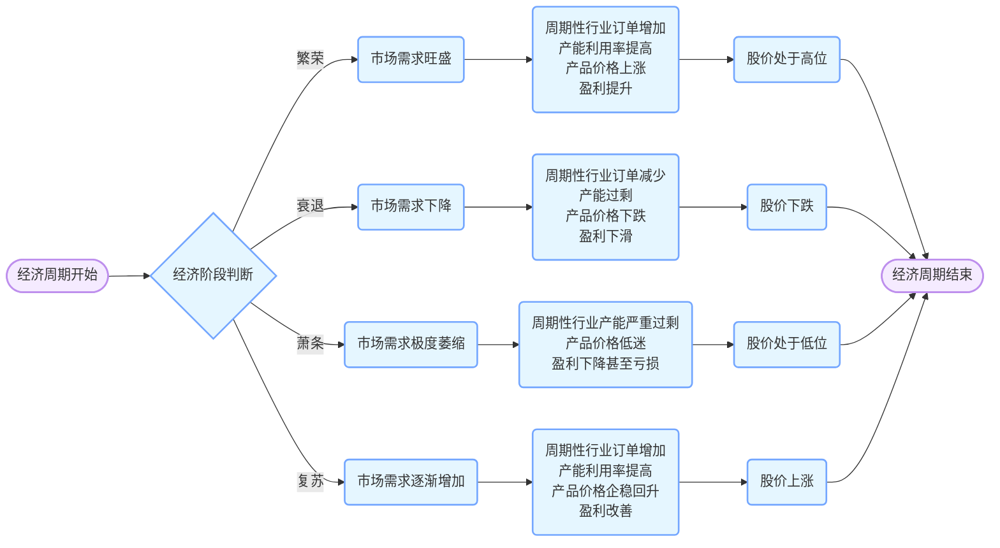

# 价值投资中的周期性行业分析

> 关键词：价值投资、周期性行业、行业分析、经济周期、投资策略

> 摘要：本文聚焦于价值投资中的周期性行业分析。首先介绍了研究的背景、目的、预期读者等内容，让读者对整体框架有初步了解。接着阐述周期性行业的核心概念、与经济周期的联系，并给出相关的文本示意图和 Mermaid 流程图。详细讲解了用于分析周期性行业的核心算法原理及具体操作步骤，配以 Python 源代码。通过数学模型和公式对周期性行业的关键指标进行深入剖析并举例说明。结合项目实战，展示代码实际案例并进行详细解释。探讨了周期性行业在不同领域的实际应用场景，推荐了相关的学习资源、开发工具框架以及论文著作。最后总结了周期性行业在价值投资中的未来发展趋势与挑战，还给出了常见问题与解答及扩展阅读参考资料，旨在为投资者在周期性行业的价值投资决策中提供全面且深入的参考。

## 1. 背景介绍 
### 1.1 目的和范围
在价值投资领域，准确分析不同行业的特点和发展趋势是做出明智投资决策的关键。周期性行业作为经济体系中的重要组成部分，其业绩和股价表现与宏观经济周期密切相关。本研究的目的在于深入剖析价值投资中周期性行业的特点、运行规律以及分析方法，为投资者提供全面且实用的投资指导。研究范围涵盖了各类典型的周期性行业，如钢铁、化工、汽车、房地产等，探讨其在不同经济周期阶段的表现和投资机会。

### 1.2 预期读者
本文预期读者包括对价值投资感兴趣的个人投资者、金融机构的投资分析师、基金经理以及相关领域的研究人员。无论是希望提升自身投资能力的初学者，还是寻求更深入行业分析方法的专业人士，都能从本文中获取有价值的信息。

### 1.3 文档结构概述
本文将按照以下结构展开：首先介绍周期性行业的核心概念和与经济周期的联系，包括相关的原理和架构示意图；接着详细讲解用于分析周期性行业的核心算法原理及具体操作步骤，并给出 Python 源代码；然后通过数学模型和公式对周期性行业的关键指标进行深入剖析并举例说明；结合项目实战，展示代码实际案例并进行详细解释；探讨周期性行业在不同领域的实际应用场景；推荐相关的学习资源、开发工具框架以及论文著作；最后总结周期性行业在价值投资中的未来发展趋势与挑战，给出常见问题与解答及扩展阅读参考资料。

### 1.4 术语表
#### 1.4.1 核心术语定义
- **价值投资**：一种基于对股票内在价值的分析，通过寻找价格低于内在价值的股票进行投资的策略。投资者相信，从长期来看，股票价格会回归其内在价值，从而获得投资收益。
- **周期性行业**：指那些经营业绩随着宏观经济的波动而呈现周期性变化的行业。这些行业的产品或服务需求在经济扩张期上升，在经济衰退期下降。
- **经济周期**：也称商业周期、景气循环，是指经济活动沿着经济发展的总体趋势所经历的有规律的扩张和收缩。一般分为繁荣、衰退、萧条和复苏四个阶段。

#### 1.4.2 相关概念解释
- **行业景气度**：反映行业在一定时期内的发展状况和市场前景的综合指标。行业景气度高时，行业内企业的盈利能力和市场表现较好；反之则较差。
- **产能利用率**：指企业实际产量与生产能力的比率。产能利用率的高低反映了行业的供需关系和生产效率。在周期性行业中，产能利用率的变化对企业的盈利水平有重要影响。

#### 1.4.3 缩略词列表
- **GDP**：国内生产总值（Gross Domestic Product），是衡量一个国家或地区经济活动总量的重要指标。
- **P/E**：市盈率（Price-to-Earnings Ratio），是股票价格与每股盈利的比率，用于衡量股票的估值水平。

## 2. 核心概念与联系 
### 2.1 周期性行业的核心概念
周期性行业的业绩和股价表现与宏观经济周期密切相关。在经济繁荣阶段，市场需求旺盛，周期性行业的产品或服务销量增加，企业盈利能力增强，股价往往上涨；而在经济衰退阶段，市场需求萎缩，企业业绩下滑，股价也随之下跌。常见的周期性行业包括钢铁、化工、汽车、房地产等。这些行业的特点是资本密集、生产周期长、固定成本高，对宏观经济环境的变化较为敏感。

### 2.2 周期性行业与经济周期的联系
经济周期一般分为繁荣、衰退、萧条和复苏四个阶段。在不同的阶段，周期性行业的表现各不相同：
- **繁荣阶段**：经济增长强劲，市场需求旺盛。周期性行业的企业订单增加，产能利用率提高，产品价格上涨，盈利水平大幅提升。此时，投资者对周期性行业的预期乐观，股价往往处于高位。
- **衰退阶段**：经济增长放缓，市场需求开始下降。周期性行业的企业订单减少，产能过剩，产品价格下跌，盈利水平下滑。投资者对周期性行业的信心下降，股价开始下跌。
- **萧条阶段**：经济陷入低谷，市场需求极度萎缩。周期性行业的企业面临严重的产能过剩，产品价格低迷，盈利水平大幅下降，甚至出现亏损。此时，股价处于低位。
- **复苏阶段**：经济开始企稳回升，市场需求逐渐增加。周期性行业的企业订单开始增加，产能利用率逐渐提高，产品价格企稳回升，盈利水平逐渐改善。投资者对周期性行业的预期逐渐好转，股价开始上涨。

### 2.3 文本示意图
周期性行业与经济周期的联系可以用以下文本示意图表示：

经济周期阶段 -> 市场需求变化 -> 周期性行业企业表现 -> 股价表现
繁荣 -> 旺盛 -> 订单增加、产能利用率提高、产品价格上涨、盈利提升 -> 高位
衰退 -> 下降 -> 订单减少、产能过剩、产品价格下跌、盈利下滑 -> 下跌
萧条 -> 极度萎缩 -> 产能严重过剩、产品价格低迷、盈利下降甚至亏损 -> 低位
复苏 -> 逐渐增加 -> 订单增加、产能利用率提高、产品价格企稳回升、盈利改善 -> 上涨

### 2.4 Mermaid 流程图


## 3. 核心算法原理 & 具体操作步骤 
### 3.1 核心算法原理
在价值投资中分析周期性行业，一个重要的方法是通过对行业关键指标的量化分析来判断行业所处的周期阶段和投资价值。这里我们介绍一种基于时间序列分析的算法，通过对行业的营收、利润、产能利用率等指标进行建模和预测，来辅助投资决策。

具体来说，我们使用自回归积分滑动平均模型（ARIMA）对行业关键指标进行时间序列分析。ARIMA 模型是一种广泛应用于时间序列预测的统计模型，它可以捕捉时间序列数据中的趋势、季节性和周期性特征。

### 3.2 Python 源代码实现
以下是使用 Python 实现 ARIMA 模型对周期性行业营收数据进行分析和预测的示例代码：
```python
import pandas as pd
import numpy as np
import matplotlib.pyplot as plt
from statsmodels.tsa.arima.model import ARIMA

# 生成示例数据
np.random.seed(0)
time_index = pd.date_range(start='2010-01-01', periods=120, freq='M')
revenue = np.sin(np.arange(120) * 0.2) + np.random.normal(0, 0.1, 120)
data = pd.Series(revenue, index=time_index)

# 划分训练集和测试集
train_data = data[:100]
test_data = data[100:]

# 拟合 ARIMA 模型
p, d, q = 1, 1, 1  # ARIMA 模型的参数
model = ARIMA(train_data, order=(p, d, q))
model_fit = model.fit()

# 进行预测
predictions = model_fit.get_forecast(steps=len(test_data)).predicted_mean

# 绘制结果
plt.figure(figsize=(12, 6))
plt.plot(train_data, label='Training Data')
plt.plot(test_data, label='Actual Data')
plt.plot(test_data.index, predictions, label='Predicted Data', color='r')
plt.title('ARIMA Model for Revenue Prediction')
plt.xlabel('Date')
plt.ylabel('Revenue')
plt.legend()
plt.show()
```

### 3.3 具体操作步骤
1. **数据准备**：收集周期性行业的关键指标数据，如营收、利润、产能利用率等，并将其整理成时间序列数据。
2. **数据预处理**：对时间序列数据进行平稳性检验，如果数据不平稳，需要进行差分处理使其平稳。
3. **模型选择**：根据数据的特点和经验，选择合适的 ARIMA 模型参数（p, d, q）。可以使用网格搜索等方法来优化参数。
4. **模型拟合**：使用训练数据拟合 ARIMA 模型。
5. **模型预测**：使用拟合好的模型对测试数据进行预测。
6. **结果评估**：比较预测结果和实际数据，评估模型的准确性和可靠性。可以使用均方误差（MSE）、均方根误差（RMSE）等指标来评估模型性能。

## 4. 数学模型和公式 & 详细讲解 & 举例说明 
### 4.1 ARIMA 模型的数学公式
ARIMA 模型的一般形式可以表示为：
$$
(1 - \sum_{i=1}^{p} \phi_i L^i)(1 - L)^d Y_t = (1 + \sum_{j=1}^{q} \theta_j L^j) \epsilon_t
$$
其中：
- $Y_t$ 是时间序列数据在时刻 $t$ 的值。
- $L$ 是滞后算子，$L^i Y_t = Y_{t - i}$。
- $p$ 是自回归（AR）部分的阶数，表示模型中使用的滞后项的数量。
- $d$ 是差分的阶数，用于使时间序列数据平稳。
- $q$ 是移动平均（MA）部分的阶数，表示模型中使用的误差项的滞后项的数量。
- $\phi_i$ 和 $\theta_j$ 分别是自回归和移动平均部分的系数。
- $\epsilon_t$ 是白噪声误差项，服从均值为 0、方差为 $\sigma^2$ 的正态分布。

### 4.2 详细讲解
- **自回归（AR）部分**：$1 - \sum_{i=1}^{p} \phi_i L^i$ 表示时间序列的当前值 $Y_t$ 可以由过去 $p$ 个时刻的值的线性组合来表示。自回归部分捕捉了时间序列数据中的趋势和相关性。
- **差分（I）部分**：$(1 - L)^d$ 表示对时间序列数据进行 $d$ 阶差分，使数据平稳。差分可以消除时间序列中的趋势和季节性。
- **移动平均（MA）部分**：$1 + \sum_{j=1}^{q} \theta_j L^j$ 表示时间序列的当前值 $Y_t$ 可以由过去 $q$ 个时刻的误差项的线性组合来表示。移动平均部分捕捉了时间序列数据中的随机波动。

### 4.3 举例说明
假设我们有一个时间序列数据 $Y_t$，其 ARIMA 模型的参数为 $p = 1$，$d = 1$，$q = 1$。则模型的具体形式为：
$$
(1 - \phi_1 L)(1 - L) Y_t = (1 + \theta_1 L) \epsilon_t
$$
展开可得：
$$
(1 - L - \phi_1 L + \phi_1 L^2) Y_t = \epsilon_t + \theta_1 \epsilon_{t - 1}
$$
即：
$$
Y_t - Y_{t - 1} - \phi_1 Y_{t - 1} + \phi_1 Y_{t - 2} = \epsilon_t + \theta_1 \epsilon_{t - 1}
$$
整理得：
$$
Y_t = (1 + \phi_1) Y_{t - 1} - \phi_1 Y_{t - 2} + \epsilon_t + \theta_1 \epsilon_{t - 1}
$$
这个公式表示时间序列的当前值 $Y_t$ 可以由过去两个时刻的值 $Y_{t - 1}$ 和 $Y_{t - 2}$ 以及当前和过去一个时刻的误差项 $\epsilon_t$ 和 $\epsilon_{t - 1}$ 来表示。

## 5. 项目实战：代码实际案例和详细解释说明 
### 5.1  开发环境搭建
1. **安装 Python**：可以从 Python 官方网站（https://www.python.org/downloads/）下载并安装 Python 3.x 版本。
2. **安装必要的库**：使用以下命令安装所需的库：
```sh
pip install pandas numpy matplotlib statsmodels
```

### 5.2  源代码详细实现和代码解读
以下是一个完整的项目实战代码，用于分析钢铁行业的营收数据并进行预测：
```python
import pandas as pd
import numpy as np
import matplotlib.pyplot as plt
from statsmodels.tsa.arima.model import ARIMA
from sklearn.metrics import mean_squared_error

# 读取钢铁行业营收数据
data = pd.read_csv('steel_revenue.csv', index_col='date', parse_dates=True)

# 划分训练集和测试集
train_data = data[:int(len(data) * 0.8)]
test_data = data[int(len(data) * 0.8):]

# 拟合 ARIMA 模型
p, d, q = 2, 1, 1  # ARIMA 模型的参数
model = ARIMA(train_data, order=(p, d, q))
model_fit = model.fit()

# 进行预测
predictions = model_fit.get_forecast(steps=len(test_data)).predicted_mean

# 计算均方误差
mse = mean_squared_error(test_data, predictions)
rmse = np.sqrt(mse)
print(f"均方误差 (MSE): {mse}")
print(f"均方根误差 (RMSE): {rmse}")

# 绘制结果
plt.figure(figsize=(12, 6))
plt.plot(train_data, label='Training Data')
plt.plot(test_data, label='Actual Data')
plt.plot(test_data.index, predictions, label='Predicted Data', color='r')
plt.title('ARIMA Model for Steel Industry Revenue Prediction')
plt.xlabel('Date')
plt.ylabel('Revenue')
plt.legend()
plt.show()
```
代码解读：
1. **数据读取**：使用 `pandas` 库的 `read_csv` 函数读取钢铁行业的营收数据，并将日期列作为索引。
2. **数据划分**：将数据按照 80:20 的比例划分为训练集和测试集。
3. **模型拟合**：使用 ARIMA 模型对训练数据进行拟合，指定模型参数 `p = 2`，`d = 1`，`q = 1`。
4. **模型预测**：使用拟合好的模型对测试数据进行预测。
5. **结果评估**：使用 `sklearn` 库的 `mean_squared_error` 函数计算预测结果的均方误差（MSE），并计算均方根误差（RMSE）。
6. **结果可视化**：使用 `matplotlib` 库绘制训练数据、实际数据和预测数据的曲线，直观展示模型的预测效果。

### 5.3  代码解读与分析
- **数据预处理**：在实际应用中，可能需要对数据进行更复杂的预处理，如缺失值处理、异常值处理等。
- **模型参数选择**：ARIMA 模型的参数 `p`，`d`，`q` 的选择对模型的性能有重要影响。可以使用网格搜索等方法来优化参数。
- **模型评估**：除了均方误差（MSE）和均方根误差（RMSE），还可以使用其他指标来评估模型的性能，如平均绝对误差（MAE）、平均绝对百分比误差（MAPE）等。
- **模型改进**：可以尝试使用其他时间序列分析模型，如季节性 ARIMA（SARIMA）、指数平滑模型等，来提高预测的准确性。

## 6. 实际应用场景 
### 6.1 投资决策
投资者可以通过对周期性行业的分析，判断行业所处的周期阶段，从而做出合理的投资决策。在行业处于衰退末期或复苏初期时，投资者可以考虑买入周期性行业的股票，等待行业复苏带来的股价上涨；而在行业处于繁荣末期时，投资者可以考虑卖出股票，避免行业衰退带来的损失。

### 6.2 企业战略规划
周期性行业的企业可以通过对行业周期的分析，合理安排生产计划、调整产能、优化库存管理等。在行业景气度上升时，企业可以增加生产、扩大产能，以满足市场需求；而在行业景气度下降时，企业可以减少生产、降低库存，以降低成本。

### 6.3 政策制定
政府可以通过对周期性行业的分析，制定相应的产业政策，促进产业的健康发展。在行业衰退时，政府可以出台刺激政策，如减税、增加基础设施投资等，以拉动行业需求；而在行业过热时，政府可以出台调控政策，如收紧信贷、加强环保监管等，以抑制行业过度扩张。

## 7. 工具和资源推荐
### 7.1 学习资源推荐
#### 7.1.1 书籍推荐
- 《聪明的投资者》（The Intelligent Investor）：作者本杰明·格雷厄姆（Benjamin Graham），被誉为价值投资的经典之作，书中详细阐述了价值投资的理念和方法。
- 《周期》（Mastering the Market Cycle）：作者霍华德·马克斯（Howard Marks），深入探讨了经济周期、市场周期和投资周期的规律和特点，对投资者理解周期性行业有很大帮助。
- 《金融炼金术》（The Alchemy of Finance）：作者乔治·索罗斯（George Soros），介绍了索罗斯的反身性理论和投资哲学，对理解市场的复杂性和周期性有重要启示。

#### 7.1.2 在线课程
- Coursera 上的“投资学原理”（Principles of Investing）课程：由哥伦比亚大学教授授课，系统介绍了投资学的基本原理和方法，包括价值投资和行业分析。
- edX 上的“金融市场”（Financial Markets）课程：由耶鲁大学教授罗伯特·席勒（Robert Shiller）授课，探讨了金融市场的运行机制和投资策略，对理解周期性行业的市场表现有很大帮助。

#### 7.1.3 技术博客和网站
- Seeking Alpha（https://seekingalpha.com/）：一个专业的金融投资网站，提供大量的股票分析、行业研究和投资策略文章，对周期性行业的分析和研究有很高的参考价值。
- 雪球（https://xueqiu.com/）：国内知名的投资社区，聚集了众多投资者和行业专家，提供丰富的投资资讯和交流平台，对周期性行业的讨论和分析很活跃。

### 7.2 开发工具框架推荐
#### 7.2.1 IDE和编辑器
- PyCharm：一款功能强大的 Python 集成开发环境（IDE），提供代码编辑、调试、版本控制等功能，适合开发和调试 Python 代码。
- Jupyter Notebook：一个交互式的开发环境，支持多种编程语言，特别适合进行数据分析和模型训练，方便代码的演示和分享。

#### 7.2.2 调试和性能分析工具
- pdb：Python 内置的调试器，可以帮助开发者逐行调试代码，查找和解决问题。
- cProfile：Python 内置的性能分析工具，可以分析代码的运行时间和资源消耗，帮助开发者优化代码性能。

#### 7.2.3 相关框架和库
- pandas：一个强大的数据分析库，提供了数据结构和数据处理工具，方便进行数据清洗、转换和分析。
- numpy：一个用于科学计算的基础库，提供了高效的数组操作和数学函数，是许多数据分析和机器学习库的基础。
- statsmodels：一个统计建模库，提供了多种统计模型和分析方法，包括时间序列分析模型，如 ARIMA 模型。

### 7.3 相关论文著作推荐
#### 7.3.1 经典论文
- Fama, E. F., & French, K. R. (1993). Common risk factors in the returns on stocks and bonds. Journal of Financial Economics, 33(1), 3-56. 该论文提出了著名的 Fama-French 三因子模型，对理解股票收益的影响因素有重要意义，也可用于分析周期性行业的股票表现。
- Shiller, R. J. (1981). Do stock prices move too much to be justified by subsequent changes in dividends? American Economic Review, 71(3), 421-436. 该论文探讨了股票价格的波动与股息变化之间的关系，对理解市场的周期性波动有重要启示。

#### 7.3.2 最新研究成果
- 关注顶级金融学术期刊，如 the Journal of Finance、the Review of Financial Studies 等，这些期刊上发表的最新研究成果可以帮助投资者了解周期性行业分析的前沿理论和方法。

#### 7.3.3 应用案例分析
- 一些专业的金融研究机构和咨询公司会发布周期性行业的应用案例分析报告，如麦肯锡（McKinsey）、波士顿咨询集团（BCG）等。这些报告通过实际案例分析，展示了周期性行业的分析方法和投资策略的应用效果，对投资者有很大的参考价值。

## 8. 总结：未来发展趋势与挑战
### 8.1 未来发展趋势
- **数字化转型加速**：随着信息技术的快速发展，周期性行业将加速数字化转型。通过大数据、人工智能、物联网等技术的应用，企业可以实现生产过程的智能化、供应链的优化和市场需求的精准预测，提高企业的运营效率和竞争力。
- **绿色发展成为主流**：在全球气候变化和环保意识增强的背景下，周期性行业将更加注重绿色发展。钢铁、化工等行业将加大节能减排、绿色制造的力度，开发和应用环保型产品和技术，实现可持续发展。
- **行业整合加剧**：周期性行业的竞争将更加激烈，行业整合将加剧。大型企业将通过并购、重组等方式扩大规模，提高市场份额，增强行业的集中度和竞争力。

### 8.2 挑战
- **宏观经济不确定性增加**：全球经济增长的不确定性增加，贸易摩擦、地缘政治冲突等因素将对周期性行业的发展带来挑战。企业需要加强风险管理，提高应对不确定性的能力。
- **技术创新压力增大**：数字化转型和绿色发展需要大量的技术创新投入，企业面临着技术创新的压力。同时，技术更新换代速度加快，企业需要不断提升自身的技术水平和创新能力，以适应市场的变化。
- **环保要求日益严格**：环保要求的日益严格将对周期性行业的生产和运营带来挑战。企业需要加大环保投入，改进生产工艺，减少污染物排放，以满足环保要求。

## 9. 附录：常见问题与解答
### 9.1 如何判断周期性行业所处的周期阶段？
可以通过分析宏观经济指标（如 GDP 增长率、通货膨胀率等）、行业关键指标（如营收、利润、产能利用率等）以及行业景气度指数等方法来判断周期性行业所处的周期阶段。同时，也可以参考历史数据和行业经验，对行业周期进行预测和判断。

### 9.2 ARIMA 模型的参数如何选择？
ARIMA 模型的参数 `p`，`d`，`q` 的选择可以使用网格搜索、信息准则（如 AIC、BIC）等方法。网格搜索是一种暴力搜索方法，通过遍历所有可能的参数组合，选择使模型性能最优的参数。信息准则是一种基于统计理论的方法，通过比较不同参数组合下模型的信息准则值，选择信息准则值最小的参数组合。

### 9.3 周期性行业的投资风险有哪些？
周期性行业的投资风险主要包括宏观经济风险、行业竞争风险、政策风险等。宏观经济的波动会直接影响周期性行业的业绩和股价表现；行业竞争的加剧可能导致企业盈利能力下降；政策的变化（如环保政策、产业政策等）也可能对周期性行业的发展带来不利影响。

## 10. 扩展阅读 & 参考资料
### 10.1 扩展阅读
- 《投资中最简单的事》：作者邱国鹭，介绍了价值投资的简单方法和原则，对投资者有很大的启发。
- 《漫步华尔街》（A Random Walk Down Wall Street）：作者伯顿·马尔基尔（Burton Malkiel），探讨了股票市场的有效性和投资策略，对理解周期性行业的市场表现有一定的帮助。

### 10.2 参考资料
- 国家统计局官方网站（https://www.stats.gov.cn/）：提供宏观经济数据和行业统计数据，是分析周期性行业的重要数据来源。
- 行业协会官方网站：如中国钢铁工业协会（https://www.chinaisa.org.cn/）、中国石油和化学工业联合会（https://www.cpcia.org.cn/）等，提供行业的最新动态、政策法规和统计数据。