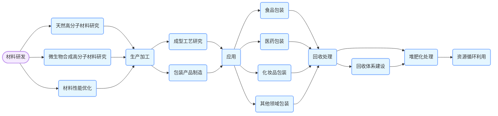

# 价值投资中的新一代生物可降解包装技术

> 关键词：价值投资、生物可降解包装技术、可持续发展、环保材料、市场趋势、技术创新、投资潜力

> 摘要：本文聚焦于价值投资领域中的新一代生物可降解包装技术。首先介绍该技术的背景，包括其目的、适用读者群体、文档结构和相关术语。接着阐述核心概念与联系，展示其原理和架构。深入剖析核心算法原理并给出Python代码示例，讲解相关数学模型和公式。通过项目实战呈现代码实现与解读，探讨实际应用场景。推荐相关的学习资源、开发工具框架以及论文著作。最后总结该技术的未来发展趋势与挑战，提供常见问题解答和扩展阅读参考资料，旨在为投资者和相关从业者全面了解新一代生物可降解包装技术提供有价值的参考。

## 1. 背景介绍 
### 1.1 目的和范围
随着全球环保意识的不断提高，传统包装材料对环境造成的污染问题日益凸显。新一代生物可降解包装技术应运而生，旨在解决传统包装材料不可降解、难以回收利用等问题，实现包装行业的可持续发展。本文的范围涵盖了生物可降解包装技术的原理、算法、数学模型、实际应用以及投资价值等多个方面，旨在为读者全面呈现该技术的全貌，为价值投资者提供决策依据，同时也为相关技术研发人员和行业从业者提供技术参考。

### 1.2 预期读者
本文预期读者包括价值投资者，他们希望通过了解新一代生物可降解包装技术，寻找具有潜力的投资项目；包装行业的从业者，如研发人员、生产厂家、市场营销人员等，他们可以从技术和市场的角度深入了解该技术，为企业的发展提供方向；环保组织和相关政策制定者，他们可以通过本文了解该技术对环境保护的重要意义，从而制定更加科学合理的政策。

### 1.3 文档结构概述
本文首先介绍新一代生物可降解包装技术的背景，包括目的、读者群体和文档结构等信息。然后阐述核心概念与联系，通过文本示意图和Mermaid流程图展示技术原理和架构。接着详细讲解核心算法原理，并用Python代码进行示例。之后介绍相关的数学模型和公式，并举例说明。通过项目实战展示代码的实际应用和解读。探讨该技术的实际应用场景，推荐相关的学习资源、开发工具框架和论文著作。最后总结未来发展趋势与挑战，提供常见问题解答和扩展阅读参考资料。

### 1.4 术语表
#### 1.4.1 核心术语定义
- **生物可降解包装技术**：指利用天然高分子材料或微生物合成的高分子材料制成的包装材料，在自然环境中能够被微生物分解为二氧化碳和水等无害物质的技术。
- **价值投资**：一种投资策略，投资者通过分析资产的内在价值，寻找被低估的投资对象，以获得长期的投资回报。
- **可持续发展**：既满足当代人的需求，又不损害后代人满足其需求的能力的发展模式。
- **环保材料**：在生产、使用和废弃过程中对环境影响较小，符合环保要求的材料。

#### 1.4.2 相关概念解释
- **生物基材料**：以可再生生物质为原料，通过生物合成、化学合成或物理加工等方法制备的材料。生物基材料是生物可降解包装技术的重要原料来源。
- **堆肥化**：一种将有机废弃物在微生物的作用下分解为腐殖质的过程。生物可降解包装材料可以通过堆肥化处理，实现资源的循环利用。
- **生命周期评估（LCA）**：一种对产品或服务从原材料获取、生产、使用到废弃的整个生命周期内的环境影响进行评估的方法。通过LCA可以全面了解生物可降解包装材料的环境性能。

#### 1.4.3 缩略词列表
- **PLA**：聚乳酸（Polylactic Acid），一种常见的生物可降解高分子材料。
- **PHA**：聚羟基脂肪酸酯（Polyhydroxyalkanoates），一类由微生物合成的生物可降解高分子材料。
- **LCA**：生命周期评估（Life Cycle Assessment）。

## 2. 核心概念与联系 
### 2.1 生物可降解包装技术原理
生物可降解包装技术的核心原理是利用生物可降解材料的特性，使其在自然环境中能够被微生物分解。这些生物可降解材料主要包括天然高分子材料（如淀粉、纤维素、蛋白质等）和微生物合成的高分子材料（如PLA、PHA等）。在自然环境中，微生物会分泌出特定的酶，这些酶能够将生物可降解材料分解为小分子物质，最终被微生物吸收利用，转化为二氧化碳和水等无害物质。

### 2.2 技术架构
生物可降解包装技术的架构主要包括材料研发、生产加工、应用和回收处理四个环节。材料研发环节主要致力于寻找和开发新型的生物可降解材料，提高材料的性能和质量。生产加工环节将研发出的生物可降解材料制成各种包装产品，如塑料袋、包装盒、餐具等。应用环节将这些包装产品应用于各个领域，如食品、医药、化妆品等。回收处理环节对使用后的生物可降解包装产品进行回收和处理，通过堆肥化等方式实现资源的循环利用。

### 2.3 文本示意图
```plaintext
生物可降解包装技术架构

|-- 材料研发
|   |-- 天然高分子材料研究
|   |-- 微生物合成高分子材料研究
|   |-- 材料性能优化
|
|-- 生产加工
|   |-- 成型工艺研究
|   |-- 包装产品制造
|
|-- 应用
|   |-- 食品包装
|   |-- 医药包装
|   |-- 化妆品包装
|   |-- 其他领域包装
|
|-- 回收处理
|   |-- 回收体系建设
|   |-- 堆肥化处理
|   |-- 资源循环利用
```

### 2.4 Mermaid流程图


## 3. 核心算法原理 & 具体操作步骤 
### 3.1 生物可降解材料降解速率预测算法原理
在生物可降解包装技术中，准确预测生物可降解材料的降解速率是非常重要的。这有助于评估包装材料的使用寿命和环境影响。一种常用的降解速率预测算法是基于动力学模型的方法。

假设生物可降解材料的降解过程符合一级反应动力学，其降解速率可以用以下方程表示：

$\frac{dC}{dt} = -kC$

其中，$C$ 是生物可降解材料的浓度，$t$ 是时间，$k$ 是降解速率常数。

对上述方程进行积分，可以得到：

$C(t) = C_0e^{-kt}$

其中，$C_0$ 是生物可降解材料的初始浓度。

通过实验测量不同时间点的生物可降解材料浓度，可以拟合出降解速率常数 $k$，从而预测材料的降解速率。

### 3.2 Python代码实现
```python
import numpy as np
from scipy.optimize import curve_fit
import matplotlib.pyplot as plt

# 定义一级反应动力学模型
def first_order_kinetics(t, k, C0):
    return C0 * np.exp(-k * t)

# 模拟实验数据
t_data = np.array([0, 1, 2, 3, 4, 5])  # 时间点
C_data = np.array([100, 80, 65, 50, 40, 30])  # 浓度数据

# 拟合数据
popt, pcov = curve_fit(first_order_kinetics, t_data, C_data)
k_fit = popt[0]
C0_fit = popt[1]

# 预测降解曲线
t_pred = np.linspace(0, 10, 100)
C_pred = first_order_kinetics(t_pred, k_fit, C0_fit)

# 绘制结果
plt.plot(t_data, C_data, 'ro', label='Experimental data')
plt.plot(t_pred, C_pred, 'b-', label='Fitted curve')
plt.xlabel('Time (days)')
plt.ylabel('Concentration')
plt.title('Biodegradable Material Degradation Rate Prediction')
plt.legend()
plt.show()

print(f"Fitted degradation rate constant k: {k_fit}")
print(f"Fitted initial concentration C0: {C0_fit}")
```

### 3.3 具体操作步骤
1. **数据收集**：通过实验测量生物可降解材料在不同时间点的浓度数据。
2. **定义模型**：根据一级反应动力学原理，定义降解速率预测模型。
3. **数据拟合**：使用Python中的 `curve_fit` 函数对实验数据进行拟合，得到降解速率常数 $k$ 和初始浓度 $C_0$。
4. **预测降解曲线**：根据拟合得到的参数，预测生物可降解材料的降解曲线。
5. **结果分析**：分析拟合结果，评估模型的准确性和可靠性。

## 4. 数学模型和公式 & 详细讲解 & 举例说明 
### 4.1 一级反应动力学模型
如前所述，一级反应动力学模型用于描述生物可降解材料的降解过程。其基本方程为：

$\frac{dC}{dt} = -kC$

这个方程表示生物可降解材料的降解速率与材料的浓度成正比，比例系数为降解速率常数 $k$。负号表示随着时间的增加，材料的浓度逐渐降低。

对上述方程进行积分：

$\int_{C_0}^{C(t)}\frac{dC}{C} = -\int_{0}^{t}kdt$

得到：

$\ln\frac{C(t)}{C_0} = -kt$

或

$C(t) = C_0e^{-kt}$

### 4.2 半衰期计算
半衰期是指生物可降解材料的浓度降低到初始浓度一半所需的时间。令 $C(t_{1/2}) = \frac{C_0}{2}$，代入 $C(t) = C_0e^{-kt}$ 中，可得：

$\frac{C_0}{2} = C_0e^{-kt_{1/2}}$

两边同时除以 $C_0$，并取自然对数：

$\ln\frac{1}{2} = -kt_{1/2}$

解得：

$t_{1/2} = \frac{\ln 2}{k}$

### 4.3 举例说明
假设某生物可降解材料的降解速率常数 $k = 0.1$ 天$^{-1}$，初始浓度 $C_0 = 100$ mg/L。

1. **计算不同时间点的浓度**：
当 $t = 5$ 天时，$C(5) = 100e^{-0.1\times5} \approx 60.65$ mg/L。

2. **计算半衰期**：
$t_{1/2} = \frac{\ln 2}{0.1} \approx 6.93$ 天。

这意味着该生物可降解材料的浓度降低到初始浓度一半大约需要 6.93 天。

## 5. 项目实战：代码实际案例和详细解释说明 
### 5.1  开发环境搭建
#### 5.1.1 安装Python
首先，确保你已经安装了Python。可以从Python官方网站（https://www.python.org/downloads/）下载并安装适合你操作系统的Python版本。建议安装Python 3.x 版本。

#### 5.1.2 安装必要的库
在命令行中使用以下命令安装所需的库：
```sh
pip install numpy scipy matplotlib
```
`numpy` 用于数值计算，`scipy` 用于数据拟合，`matplotlib` 用于绘制图表。

### 5.2  源代码详细实现和代码解读
```python
import numpy as np
from scipy.optimize import curve_fit
import matplotlib.pyplot as plt

# 定义一级反应动力学模型
def first_order_kinetics(t, k, C0):
    return C0 * np.exp(-k * t)

# 模拟实验数据
t_data = np.array([0, 1, 2, 3, 4, 5])  # 时间点
C_data = np.array([100, 80, 65, 50, 40, 30])  # 浓度数据

# 拟合数据
popt, pcov = curve_fit(first_order_kinetics, t_data, C_data)
k_fit = popt[0]
C0_fit = popt[1]

# 预测降解曲线
t_pred = np.linspace(0, 10, 100)
C_pred = first_order_kinetics(t_pred, k_fit, C0_fit)

# 绘制结果
plt.plot(t_data, C_data, 'ro', label='Experimental data')
plt.plot(t_pred, C_pred, 'b-', label='Fitted curve')
plt.xlabel('Time (days)')
plt.ylabel('Concentration')
plt.title('Biodegradable Material Degradation Rate Prediction')
plt.legend()
plt.show()

print(f"Fitted degradation rate constant k: {k_fit}")
print(f"Fitted initial concentration C0: {C0_fit}")
```

#### 代码解读
1. **导入必要的库**：
```python
import numpy as np
from scipy.optimize import curve_fit
import matplotlib.pyplot as plt
```
导入 `numpy`、`scipy.optimize` 中的 `curve_fit` 函数和 `matplotlib.pyplot` 库。

2. **定义一级反应动力学模型**：
```python
def first_order_kinetics(t, k, C0):
    return C0 * np.exp(-k * t)
```
定义一个函数 `first_order_kinetics`，用于计算不同时间点的生物可降解材料浓度。

3. **模拟实验数据**：
```python
t_data = np.array([0, 1, 2, 3, 4, 5])  # 时间点
C_data = np.array([100, 80, 65, 50, 40, 30])  # 浓度数据
```
创建两个数组 `t_data` 和 `C_data`，分别表示时间点和对应的生物可降解材料浓度。

4. **拟合数据**：
```python
popt, pcov = curve_fit(first_order_kinetics, t_data, C_data)
k_fit = popt[0]
C0_fit = popt[1]
```
使用 `curve_fit` 函数对实验数据进行拟合，得到降解速率常数 $k$ 和初始浓度 $C_0$ 的拟合值。

5. **预测降解曲线**：
```python
t_pred = np.linspace(0, 10, 100)
C_pred = first_order_kinetics(t_pred, k_fit, C0_fit)
```
生成一组时间点 `t_pred`，并使用拟合得到的参数计算对应的浓度 `C_pred`。

6. **绘制结果**：
```python
plt.plot(t_data, C_data, 'ro', label='Experimental data')
plt.plot(t_pred, C_pred, 'b-', label='Fitted curve')
plt.xlabel('Time (days)')
plt.ylabel('Concentration')
plt.title('Biodegradable Material Degradation Rate Prediction')
plt.legend()
plt.show()
```
使用 `matplotlib` 库绘制实验数据和拟合曲线，并添加标签和标题。

7. **打印拟合结果**：
```python
print(f"Fitted degradation rate constant k: {k_fit}")
print(f"Fitted initial concentration C0: {C0_fit}")
```
打印拟合得到的降解速率常数和初始浓度。

### 5.3  代码解读与分析
通过上述代码，我们可以看到如何使用一级反应动力学模型对生物可降解材料的降解速率进行预测。首先，我们定义了模型函数，然后使用模拟的实验数据进行拟合，得到模型参数。最后，我们使用拟合得到的参数预测降解曲线，并将实验数据和拟合曲线绘制在图表中，直观地展示了模型的拟合效果。

需要注意的是，实际应用中，实验数据可能存在误差，因此拟合结果可能存在一定的偏差。为了提高模型的准确性，可以增加实验数据的数量，或者采用更复杂的模型。

## 6. 实际应用场景 
### 6.1 食品包装
在食品包装领域，生物可降解包装技术具有广阔的应用前景。传统的食品包装材料大多是不可降解的塑料，这些塑料在使用后难以处理，对环境造成了严重的污染。而生物可降解包装材料可以在自然环境中快速分解，不会对环境造成危害。

例如，用聚乳酸（PLA）制成的食品包装盒可以用于包装水果、蔬菜、面包等食品。PLA具有良好的机械性能和热稳定性，能够满足食品包装的要求。同时，PLA在堆肥条件下可以在几个月内完全分解，实现资源的循环利用。

### 6.2 医药包装
医药包装对包装材料的安全性和稳定性要求较高。生物可降解包装材料具有良好的生物相容性和稳定性，能够满足医药包装的特殊要求。

例如，用PHA制成的药瓶可以用于包装药品。PHA具有良好的阻隔性能，能够防止药品受到外界因素的影响，保证药品的质量。同时，PHA在体内可以被酶分解，不会对人体造成危害。

### 6.3 化妆品包装
化妆品包装注重包装材料的美观性和环保性。生物可降解包装材料可以制成各种形状和颜色的包装容器，满足化妆品包装的美观需求。

例如，用淀粉基材料制成的化妆品包装盒可以用于包装口红、眼影等化妆品。淀粉基材料具有良好的可加工性和生物降解性，能够在自然环境中快速分解，减少对环境的污染。

### 6.4 快递包装
随着电子商务的快速发展，快递包装的数量急剧增加。传统的快递包装材料大多是不可降解的泡沫塑料和塑料袋，这些材料对环境造成了严重的污染。生物可降解包装材料可以用于替代传统的快递包装材料，实现快递包装的绿色化。

例如，用纸质生物可降解材料制成的快递包装盒可以用于包装各种商品。纸质生物可降解材料具有良好的强度和韧性，能够保护商品在运输过程中不受损坏。同时，纸质生物可降解材料可以在自然环境中快速分解，减少对环境的污染。

## 7. 工具和资源推荐
### 7.1 学习资源推荐
#### 7.1.1 书籍推荐
- 《生物可降解高分子材料》：本书系统地介绍了生物可降解高分子材料的分类、合成方法、性能和应用等方面的知识，是学习生物可降解包装技术的重要参考书籍。
- 《可持续包装设计》：该书从可持续发展的角度出发，介绍了包装设计的原则和方法，以及生物可降解包装材料在包装设计中的应用。
- 《环境材料学》：本书介绍了环境材料的基本概念、分类和性能，以及生物可降解材料在环境保护中的作用。

#### 7.1.2 在线课程
- Coursera上的“Biodegradable Polymers”：该课程由国外知名大学的教授授课，系统地介绍了生物可降解高分子材料的合成、性能和应用等方面的知识。
- edX上的“Sustainable Packaging Solutions”：该课程从可持续发展的角度出发，介绍了包装行业的现状和发展趋势，以及生物可降解包装技术在可持续包装中的应用。
- 中国大学MOOC上的“生物基与生物降解材料”：该课程由国内高校的专家授课，介绍了生物基与生物降解材料的基本概念、制备方法和应用领域。

#### 7.1.3 技术博客和网站
- 中国生物基材料产业技术创新战略联盟官网：该网站提供了生物基材料和生物可降解包装技术的最新资讯、政策法规、标准规范等信息。
- 欧洲生物塑料协会官网：该网站是欧洲生物塑料行业的权威组织，提供了生物可降解塑料的技术研发、市场动态、应用案例等方面的信息。
- 材料人网：该网站是一个材料领域的专业技术社区，提供了生物可降解材料的技术文章、研究成果、行业动态等信息。

### 7.2 开发工具框架推荐
#### 7.2.1 IDE和编辑器
- PyCharm：一款专门为Python开发设计的集成开发环境（IDE），具有代码编辑、调试、自动补全、版本控制等功能，适合开发生物可降解包装技术相关的Python代码。
- Visual Studio Code：一款轻量级的代码编辑器，支持多种编程语言，具有丰富的插件扩展功能，可以用于开发生物可降解包装技术相关的代码。
- Jupyter Notebook：一种交互式的开发环境，适合进行数据分析、模型训练和可视化等工作，可用于生物可降解包装技术的研究和开发。

#### 7.2.2 调试和性能分析工具
- pdb：Python自带的调试工具，可以帮助开发者定位和解决代码中的问题。
- cProfile：Python的性能分析工具，可以分析代码的运行时间和内存使用情况，帮助开发者优化代码性能。
- Py-Spy：一个轻量级的Python性能分析工具，可以实时监测Python程序的性能，帮助开发者快速定位性能瓶颈。

#### 7.2.3 相关框架和库
- NumPy：一个用于数值计算的Python库，提供了高效的数组操作和数学函数，可用于生物可降解包装技术中的数据处理和模型计算。
- SciPy：一个用于科学计算的Python库，提供了优化、插值、积分等功能，可用于生物可降解包装技术中的模型拟合和数据分析。
- Matplotlib：一个用于数据可视化的Python库，可用于绘制生物可降解包装技术中的实验数据和模型预测结果。

### 7.3 相关论文著作推荐
#### 7.3.1 经典论文
- “Biodegradable Polymers for Sustainable Packaging”：该论文系统地介绍了生物可降解聚合物在可持续包装中的应用，分析了生物可降解聚合物的性能、优缺点和发展趋势。
- “Life Cycle Assessment of Biodegradable Packaging Materials”：该论文采用生命周期评估方法，对生物可降解包装材料的环境影响进行了评估，为生物可降解包装技术的发展提供了理论依据。
- “Advances in Biodegradable Polymer Nanocomposites for Packaging Applications”：该论文介绍了生物可降解聚合物纳米复合材料在包装领域的研究进展，分析了纳米复合材料的性能和应用前景。

#### 7.3.2 最新研究成果
- 近年来，国内外学者在生物可降解包装技术领域取得了许多新的研究成果。例如，一些研究团队开发了新型的生物可降解材料，提高了材料的性能和质量；另一些研究团队探索了生物可降解包装材料的回收利用技术，实现了资源的循环利用。

#### 7.3.3 应用案例分析
- 一些企业在生物可降解包装技术的应用方面取得了成功的经验。例如，某食品企业采用生物可降解包装材料替代传统的塑料包装材料，减少了对环境的污染，同时提高了企业的品牌形象；某快递企业采用纸质生物可降解包装材料，降低了包装成本，实现了经济效益和环境效益的双赢。

## 8. 总结：未来发展趋势与挑战
### 8.1 未来发展趋势
#### 8.1.1 材料性能不断提高
未来，生物可降解包装材料的性能将不断提高。研究人员将致力于开发新型的生物可降解材料，提高材料的强度、韧性、阻隔性能等，使其能够更好地满足不同领域的包装需求。

#### 8.1.2 应用领域不断扩大
随着环保意识的不断提高和政策法规的不断完善，生物可降解包装技术的应用领域将不断扩大。除了食品、医药、化妆品、快递等领域，生物可降解包装技术还将在电子、汽车、建筑等领域得到广泛应用。

#### 8.1.3 产业规模不断壮大
随着生物可降解包装技术的不断发展和应用，生物可降解包装产业的规模将不断壮大。越来越多的企业将进入生物可降解包装领域，推动产业的发展和升级。

#### 8.1.4 技术创新不断涌现
未来，生物可降解包装技术将不断创新。例如，开发新型的合成方法，提高生物可降解材料的生产效率；探索生物可降解包装材料的智能应用，实现包装的智能化和个性化。

### 8.2 挑战
#### 8.2.1 成本较高
目前，生物可降解包装材料的成本相对较高，这限制了其大规模应用。未来，需要通过技术创新和规模化生产，降低生物可降解包装材料的成本，提高其市场竞争力。

#### 8.2.2 性能有待提高
虽然生物可降解包装材料的性能已经有了很大的提高，但与传统包装材料相比，仍存在一些不足之处。例如，生物可降解材料的阻隔性能、热稳定性等还需要进一步提高。

#### 8.2.3 回收体系不完善
目前，生物可降解包装材料的回收体系还不完善，这导致了生物可降解包装材料的回收利用率较低。未来，需要建立健全生物可降解包装材料的回收体系，提高资源的循环利用效率。

#### 8.2.4 标准规范不健全
目前，生物可降解包装材料的标准规范还不健全，这导致了市场上生物可降解包装产品的质量参差不齐。未来，需要制定统一的标准规范，加强对生物可降解包装产品的质量监管。

## 9. 附录：常见问题与解答
### 9.1 生物可降解包装材料与传统包装材料有什么区别？
生物可降解包装材料在自然环境中能够被微生物分解为二氧化碳和水等无害物质，而传统包装材料大多是不可降解的，在使用后会长期存在于环境中，对环境造成污染。此外，生物可降解包装材料通常采用可再生资源制成，具有可持续发展的优势。

### 9.2 生物可降解包装材料的降解时间是多久？
生物可降解包装材料的降解时间取决于多种因素，如材料的种类、环境条件等。一般来说，在堆肥条件下，一些常见的生物可降解材料（如PLA、PHA等）可以在几个月到几年内完全分解。

### 9.3 生物可降解包装材料的成本高吗？
目前，生物可降解包装材料的成本相对较高，主要原因是其生产工艺和原材料成本较高。随着技术的不断进步和规模化生产的实现，生物可降解包装材料的成本有望逐渐降低。

### 9.4 生物可降解包装材料的性能如何？
生物可降解包装材料的性能已经有了很大的提高，但与传统包装材料相比，仍存在一些不足之处。例如，生物可降解材料的强度、韧性、阻隔性能等还需要进一步提高。不过，随着技术的不断发展，生物可降解包装材料的性能将不断改善。

### 9.5 如何判断生物可降解包装产品的质量？
可以通过查看产品的相关认证和检测报告来判断生物可降解包装产品的质量。目前，国际上有一些权威的认证机构，如欧盟的OK Compost认证、美国的BPI认证等。此外，还可以参考相关的标准规范，对产品的性能和质量进行评估。

## 10. 扩展阅读 & 参考资料
### 10.1 扩展阅读
- 《循环经济与可持续发展》：该书介绍了循环经济的基本概念、理论和实践，探讨了循环经济在可持续发展中的作用，有助于读者进一步了解生物可降解包装技术在循环经济中的地位和作用。
- 《绿色化学与可持续发展》：该书介绍了绿色化学的基本概念、原理和方法，探讨了绿色化学在可持续发展中的应用，有助于读者了解生物可降解包装材料的绿色合成方法和可持续发展理念。
- 《包装工程》杂志：该杂志是包装领域的专业学术期刊，发表了大量关于包装材料、包装技术、包装设计等方面的研究论文和应用案例，有助于读者了解生物可降解包装技术的最新研究进展和应用情况。

### 10.2 参考资料
- 相关行业报告：可以查阅市场研究机构发布的关于生物可降解包装技术的行业报告，了解行业的发展现状、市场规模、竞争格局等信息。
- 政府政策文件：政府发布的关于环保、可持续发展、包装行业等方面的政策文件，对生物可降解包装技术的发展具有重要的指导作用。
- 企业官网：一些生物可降解包装材料生产企业和应用企业的官网，提供了产品信息、技术研发、应用案例等方面的内容，是了解生物可降解包装技术实际应用情况的重要渠道。