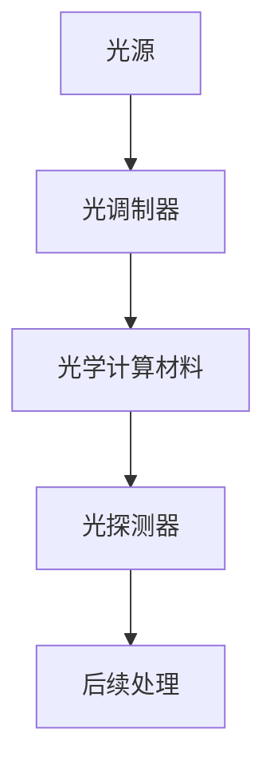

# 价值投资中的新型高效光学计算材料技术

> 关键词：价值投资、新型光学计算材料、高效技术、材料特性、应用前景

> 摘要：本文聚焦于价值投资领域中新型高效光学计算材料技术。旨在深入剖析该技术的核心概念、算法原理、数学模型等内容，通过项目实战案例展示其具体应用，探讨其在不同实际场景中的价值，同时推荐相关学习资源、开发工具及论文著作等。帮助投资者和技术人员全面了解该技术，把握其未来发展趋势与挑战，为价值投资决策和技术研发提供有价值的参考。

## 1. 背景介绍 
### 1.1 目的和范围
随着信息技术的飞速发展，传统的电子计算技术逐渐面临性能瓶颈，如功耗高、速度受限等问题。新型高效光学计算材料技术应运而生，有望突破这些限制，为计算领域带来新的变革。本文章的目的在于全面介绍该技术，从其核心概念、原理到实际应用，涵盖材料特性、算法实现、数学模型等多个方面，让读者深入了解该技术的全貌。同时，从价值投资的角度分析其潜在的经济价值和投资机会，范围涉及技术的基础理论、实践应用以及市场前景等领域。

### 1.2 预期读者
本文预期读者包括对价值投资感兴趣的投资者，他们希望通过了解新型技术来寻找具有潜力的投资项目；从事光学计算、材料科学等相关领域的科研人员和技术人员，他们可以从文章中获取该技术的最新进展和详细原理；以及相关专业的学生，有助于他们拓宽知识面，深入了解前沿技术。

### 1.3 文档结构概述
本文首先介绍新型高效光学计算材料技术的背景信息，包括目的、预期读者和文档结构等。接着阐述其核心概念与联系，通过文本示意图和 Mermaid 流程图展示原理和架构。然后详细讲解核心算法原理和具体操作步骤，结合 Python 源代码进行说明。之后介绍数学模型和公式，并举例说明。通过项目实战案例展示代码实现和详细解释。探讨该技术的实际应用场景，推荐相关的学习资源、开发工具和论文著作。最后总结未来发展趋势与挑战，提供常见问题解答和扩展阅读参考资料。

### 1.4 术语表
#### 1.4.1 核心术语定义
- **新型高效光学计算材料**：指具有独特光学性质，能够实现高效光学计算功能的一类材料，其具备高速度、低功耗等优势，可用于构建新型光学计算系统。
- **光学计算**：利用光的特性，如干涉、衍射等，进行信息处理和计算的一种计算方式，与传统电子计算相对。
- **价值投资**：一种投资策略，投资者通过分析资产的内在价值，寻找被低估的投资对象，以期在长期获得合理的回报。

#### 1.4.2 相关概念解释
- **光子**：光的基本量子，具有波粒二象性，是光学计算中信息的载体。
- **材料的光学响应**：材料在光的作用下所表现出的物理特性变化，如折射率改变、吸收或发射光等，这些响应是实现光学计算的基础。

#### 1.4.3 缩略词列表
- **CPU**：Central Processing Unit，中央处理器，传统电子计算中的核心组件。
- **GPU**：Graphics Processing Unit，图形处理器，常用于加速图形处理和一些计算任务。
- **OPS**：Operations Per Second，每秒操作次数，用于衡量计算系统的性能。

## 2. 核心概念与联系 

### 核心概念原理
新型高效光学计算材料技术基于光的特性来实现计算功能。光具有高速、并行性等优点，能够在短时间内处理大量信息。这些材料通过对光的调制、传输和检测等操作，将输入的光信号转换为所需的输出信号，从而完成计算任务。例如，某些材料可以根据光的强度、相位等特性改变自身的光学性质，实现逻辑运算和数据存储等功能。

### 架构的文本示意图
新型高效光学计算系统通常由光源、光学计算材料、光调制器、光探测器等部分组成。光源产生光信号，光调制器对光信号进行调制，使其携带所需的信息。光学计算材料利用其独特的光学性质对光信号进行处理，完成计算任务。光探测器则将处理后的光信号转换为电信号，以便后续的分析和应用。

### Mermaid 流程图


## 3. 核心算法原理 & 具体操作步骤 

### 核心算法原理
在光学计算中，一种常见的算法是基于光学傅里叶变换的算法。傅里叶变换在信号处理中起着重要作用，通过光学方法实现傅里叶变换可以大大提高计算速度。下面我们使用 Python 代码来详细阐述其原理。

```python
import numpy as np
import matplotlib.pyplot as plt

# 定义一个简单的信号
x = np.linspace(0, 1, 100)
y = np.sin(2 * np.pi * 5 * x) + np.sin(2 * np.pi * 10 * x)

# 进行离散傅里叶变换
y_fft = np.fft.fft(y)

# 计算频率轴
N = len(y)
freq = np.fft.fftfreq(N, x[1] - x[0])

# 绘制原始信号
plt.subplot(2, 1, 1)
plt.plot(x, y)
plt.title('Original Signal')
plt.xlabel('Time [s]')
plt.ylabel('Amplitude')

# 绘制傅里叶变换后的信号
plt.subplot(2, 1, 2)
plt.plot(freq[:N//2], np.abs(y_fft[:N//2]))
plt.title('Fourier Transform')
plt.xlabel('Frequency [Hz]')
plt.ylabel('Magnitude')

plt.tight_layout()
plt.show()
```

### 具体操作步骤
1. **信号生成**：首先，我们需要生成一个输入信号，例如上述代码中的 `y` 信号，它是由两个不同频率的正弦波叠加而成。
2. **傅里叶变换**：使用 `np.fft.fft` 函数对输入信号进行离散傅里叶变换，得到频域表示的信号 `y_fft`。
3. **频率轴计算**：通过 `np.fft.fftfreq` 函数计算频率轴，以便后续绘制频谱图。
4. **结果可视化**：使用 `matplotlib` 库绘制原始信号和傅里叶变换后的信号，直观地观察信号在时域和频域的特性。

## 4. 数学模型和公式 & 详细讲解 & 举例说明 

### 数学模型和公式
离散傅里叶变换（DFT）的数学公式为：
$$
X[k] = \sum_{n=0}^{N-1} x[n] \cdot e^{-i \frac{2\pi}{N} k n}
$$
其中，$x[n]$ 是离散时间信号，$X[k]$ 是其离散傅里叶变换结果，$N$ 是信号的长度，$k$ 是频率分量的索引。

### 详细讲解
离散傅里叶变换将一个离散时间信号从时域转换到频域，通过对信号的每个样本乘以一个复指数函数并求和，得到不同频率分量的幅度和相位信息。在上述 Python 代码中，`np.fft.fft` 函数就是实现了这个公式的计算。

### 举例说明
假设我们有一个长度为 4 的离散时间信号 $x = [1, 2, 3, 4]$，根据离散傅里叶变换公式计算其频域表示：
当 $k = 0$ 时：
$$
X[0] = \sum_{n=0}^{3} x[n] \cdot e^{-i \frac{2\pi}{4} 0 \cdot n} = 1 + 2 + 3 + 4 = 10
$$
当 $k = 1$ 时：
$$
X[1] = \sum_{n=0}^{3} x[n] \cdot e^{-i \frac{2\pi}{4} 1 \cdot n} = 1 - 2i - 3 + 4i = -2 + 2i
$$
以此类推，可以计算出 $k = 2$ 和 $k = 3$ 时的 $X[k]$ 值。

## 5. 项目实战：代码实际案例和详细解释说明 

### 5.1  开发环境搭建
- **操作系统**：推荐使用 Windows、Linux 或 macOS 等主流操作系统。
- **Python 环境**：安装 Python 3.x 版本，可以从 Python 官方网站（https://www.python.org/downloads/）下载安装包进行安装。
- **依赖库安装**：使用 `pip` 命令安装所需的依赖库，如 `numpy`、`matplotlib` 等。
```sh
pip install numpy matplotlib
```

### 5.2  源代码详细实现和代码解读
下面我们实现一个简单的光学计算模拟项目，模拟光在光学计算材料中的传播和处理过程。

```python
import numpy as np
import matplotlib.pyplot as plt

# 定义光学计算材料的参数
material_length = 10  # 材料长度
num_points = 100  # 采样点数
x = np.linspace(0, material_length, num_points)

# 定义输入光信号
input_signal = np.sin(2 * np.pi * 0.5 * x)

# 模拟光在材料中的传播和处理
# 这里简单假设材料对光信号进行线性放大
amplification_factor = 2
output_signal = amplification_factor * input_signal

# 绘制输入和输出信号
plt.plot(x, input_signal, label='Input Signal')
plt.plot(x, output_signal, label='Output Signal')
plt.title('Optical Signal Propagation in Material')
plt.xlabel('Position in Material')
plt.ylabel('Signal Amplitude')
plt.legend()
plt.show()
```

### 5.3  代码解读与分析
- **参数定义**：首先定义了光学计算材料的长度 `material_length` 和采样点数 `num_points`，并生成了对应的位置坐标 `x`。
- **输入信号生成**：使用 `np.sin` 函数生成一个正弦波作为输入光信号 `input_signal`。
- **信号处理**：假设材料对光信号进行线性放大，通过乘以放大因子 `amplification_factor` 得到输出信号 `output_signal`。
- **结果可视化**：使用 `matplotlib` 库绘制输入和输出信号，直观地展示光信号在材料中的传播和处理过程。

## 6. 实际应用场景 
### 数据中心
在数据中心中，随着数据量的不断增长，传统电子计算系统的能耗和处理速度成为瓶颈。新型高效光学计算材料技术可以用于构建高速、低功耗的光学计算芯片，提高数据处理速度，降低能耗。例如，在大规模数据的并行处理和深度学习训练中，光学计算芯片可以显著加速计算过程，提高数据中心的效率。

### 通信领域
在通信领域，光通信已经成为主流技术。新型光学计算材料可以进一步提升光通信系统的性能，实现高速的光信号处理和交换。例如，在光交换节点中，利用光学计算材料的快速响应特性，可以实现光信号的快速路由和交换，提高通信网络的带宽和可靠性。

### 人工智能
在人工智能领域，深度学习等算法需要大量的计算资源。光学计算的并行性和高速性使其非常适合用于加速人工智能算法的训练和推理过程。例如，利用光学计算材料构建的神经网络加速器，可以大大提高神经网络的计算速度，缩短训练时间，推动人工智能技术的发展。

## 7. 工具和资源推荐
### 7.1 学习资源推荐
#### 7.1.1 书籍推荐
- 《光学原理》：全面介绍了光学的基本原理和理论，是光学领域的经典教材。
- 《计算光学》：详细阐述了光学计算的原理、方法和应用，对于深入了解光学计算技术有很大帮助。
- 《材料科学基础》：帮助读者了解材料的基本性质和特性，为理解新型光学计算材料提供基础。

#### 7.1.2 在线课程
- Coursera 平台上的“Optics and Photonics”课程：由知名高校的教授授课，系统地介绍了光学和光子学的相关知识。
- edX 平台上的“Computational Optics”课程：专注于光学计算的理论和实践，提供了丰富的案例和实验。

#### 7.1.3 技术博客和网站
- IEEE Spectrum：提供了最新的科技资讯和研究成果，包括光学计算领域的相关内容。
- Optics.org：专注于光学领域的专业网站，提供了大量的光学技术文章和研究报告。

### 7.2 开发工具框架推荐
#### 7.2.1 IDE和编辑器
- PyCharm：一款功能强大的 Python 集成开发环境，提供了代码编辑、调试、版本控制等功能，适合开发光学计算相关的 Python 代码。
- Visual Studio Code：轻量级的代码编辑器，支持多种编程语言和插件扩展，方便进行快速开发和调试。

#### 7.2.2 调试和性能分析工具
- Numba：用于加速 Python 代码的工具，通过即时编译技术提高代码的执行速度，对于光学计算中的大规模数值计算有很好的优化效果。
- cProfile：Python 内置的性能分析工具，可以帮助开发者找出代码中的性能瓶颈，进行优化。

#### 7.2.3 相关框架和库
- SciPy：一个用于科学计算的 Python 库，提供了丰富的数学、科学和工程计算函数，适用于光学计算中的数值模拟和分析。
- TensorFlow：一个开源的机器学习框架，可以用于构建和训练光学计算相关的神经网络模型。

### 7.3 相关论文著作推荐
#### 7.3.1 经典论文
- “Optical Computing: A Review”：对光学计算的发展历程、原理和应用进行了全面的综述，是了解光学计算领域的重要文献。
- “Novel Optical Materials for High - Speed Computing”：介绍了新型光学计算材料的研究进展和应用前景，为相关研究提供了重要的参考。

#### 7.3.2 最新研究成果
- 定期关注《Nature Photonics》、《Optics Letters》等光学领域的顶级期刊，获取最新的研究成果和技术突破。

#### 7.3.3 应用案例分析
- 一些知名企业和研究机构的技术报告和白皮书，如 IBM、Intel 等公司关于光学计算技术在数据中心和人工智能领域的应用案例分析，为实际应用提供了借鉴。

## 8. 总结：未来发展趋势与挑战
### 未来发展趋势
- **集成化和小型化**：未来新型高效光学计算材料技术将朝着集成化和小型化的方向发展，将多个光学计算组件集成在一个芯片上，实现更高的计算密度和更低的功耗。
- **与其他技术融合**：与人工智能、量子计算等技术深度融合，发挥各自的优势，创造出更强大的计算系统。例如，光学计算与量子计算结合，可以解决一些复杂的科学计算问题。
- **应用领域拓展**：不断拓展应用领域，除了数据中心、通信和人工智能等领域，还将在医疗、航空航天等领域发挥重要作用。

### 挑战
- **材料制备和加工**：新型光学计算材料的制备和加工技术仍然面临挑战，需要提高材料的质量和性能稳定性，降低生产成本。
- **系统集成和兼容性**：将光学计算系统与现有的电子系统进行集成，需要解决兼容性问题，确保系统的稳定运行。
- **标准和规范**：目前光学计算领域缺乏统一的标准和规范，需要建立相关的标准体系，促进技术的发展和应用。

## 9. 附录：常见问题与解答
### 问题 1：新型高效光学计算材料技术与传统电子计算技术相比有哪些优势？
答：新型高效光学计算材料技术具有高速、并行性和低功耗等优势。光的传播速度快，可以在短时间内处理大量信息，实现高速计算。同时，光学计算可以并行处理多个数据，提高计算效率。此外，光学计算材料的功耗相对较低，有助于降低能源消耗。

### 问题 2：光学计算技术目前存在哪些局限性？
答：目前光学计算技术存在一些局限性，如材料制备难度大、成本高，光学器件的集成度和稳定性有待提高，与现有电子系统的兼容性问题等。此外，光学计算的算法和编程模型还不够成熟，需要进一步研究和发展。

### 问题 3：如何评估新型光学计算材料的性能？
答：可以从多个方面评估新型光学计算材料的性能，如光学响应速度、调制深度、损耗、带宽等。这些参数反映了材料对光信号的处理能力和性能优劣。同时，还需要考虑材料的稳定性、可靠性和可加工性等因素。

## 10. 扩展阅读 & 参考资料
- 相关学术论文和研究报告，可通过学术数据库如 IEEE Xplore、ACM Digital Library 等获取。
- 行业会议和研讨会的资料，如 Optical Fiber Communication Conference (OFC)、SPIE Photonics West 等。
- 相关企业的官方网站和技术文档，了解其在新型高效光学计算材料技术方面的研究和应用进展。