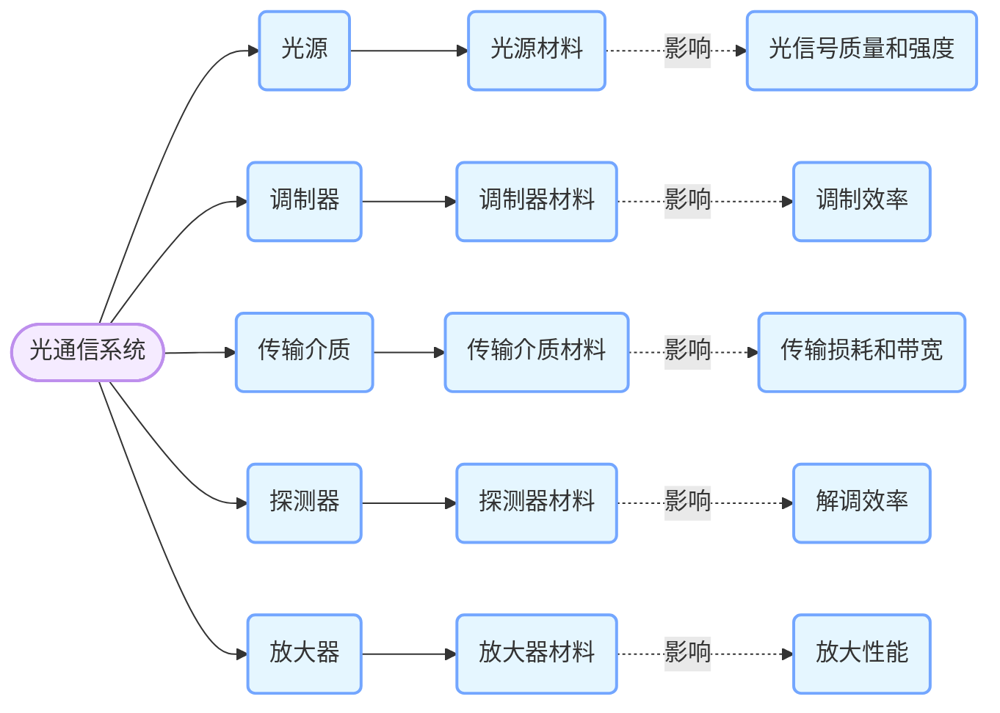

# 价值投资中的新型高效光通信材料技术前景

> 关键词：价值投资、新型高效光通信材料、技术前景、光通信产业、投资潜力

> 摘要：本文围绕价值投资视角下新型高效光通信材料技术前景展开探讨。首先介绍了光通信材料在现代通信领域的重要地位及新型高效光通信材料的发展背景，深入剖析了相关核心概念与联系，阐述了其背后的核心算法原理及操作步骤。通过数学模型和公式对其性能进行量化分析，并结合具体案例展示新型高效光通信材料在实际项目中的应用。详细介绍了该技术的实际应用场景，推荐了相关的学习资源、开发工具和研究论文。最后对新型高效光通信材料技术的未来发展趋势与挑战进行总结，为价值投资者提供全面的参考，助力其把握光通信材料技术领域的投资机遇。

## 1. 背景介绍 
### 1.1 目的和范围
随着信息技术的飞速发展，光通信作为现代通信的核心技术之一，其重要性日益凸显。新型高效光通信材料的研发和应用，对于提升光通信系统的性能、降低成本、拓展应用领域具有关键作用。本文旨在从价值投资的角度，全面分析新型高效光通信材料技术的发展现状、前景及投资潜力，为投资者提供专业的技术和市场分析，帮助其做出明智的投资决策。研究范围涵盖新型高效光通信材料的基本原理、技术进展、应用场景、市场需求以及相关的投资策略等方面。

### 1.2 预期读者
本文预期读者主要包括对光通信材料技术领域感兴趣的价值投资者，包括个人投资者、投资机构的专业人员等。同时，也适合从事光通信技术研发、生产的科研人员和企业管理人员，以及相关专业的高校师生阅读，帮助他们了解新型高效光通信材料技术的发展趋势和投资价值。

### 1.3 文档结构概述
本文将按照以下结构展开：首先介绍新型高效光通信材料技术的背景信息，包括目的、预期读者和文档结构概述等；接着阐述核心概念与联系，通过文本示意图和 Mermaid 流程图展示其原理和架构；然后讲解核心算法原理和具体操作步骤，并使用 Python 源代码进行详细阐述；再通过数学模型和公式对其性能进行分析，并举例说明；之后结合实际项目案例，详细解释代码实现和应用过程；随后介绍新型高效光通信材料技术的实际应用场景；推荐相关的学习资源、开发工具和研究论文；最后总结未来发展趋势与挑战，提供常见问题解答和扩展阅读参考资料。

### 1.4 术语表
#### 1.4.1 核心术语定义
- **光通信材料**：用于光通信系统中，能够实现光信号的产生、传输、调制、解调、放大等功能的材料。
- **新型高效光通信材料**：相对于传统光通信材料，具有更高的性能指标，如更高的传输速率、更低的损耗、更强的抗干扰能力等，能够显著提升光通信系统效率的新型材料。
- **价值投资**：一种基于对投资对象内在价值评估的投资策略，通过分析企业或项目的基本面、技术前景、市场潜力等因素，寻找被低估的投资机会，以获取长期稳定的投资回报。

#### 1.4.2 相关概念解释
- **光通信系统**：利用光信号作为信息载体，通过光纤等传输介质实现信息传输的通信系统，主要由光源、调制器、传输介质、探测器等部分组成。
- **材料性能指标**：衡量光通信材料性能优劣的参数，包括传输损耗、带宽、色散、非线性效应等。

#### 1.4.3 缩略词列表
- **WDM**：波分复用（Wavelength Division Multiplexing），一种在一根光纤中同时传输多个不同波长光信号的技术。
- **EDFA**：掺铒光纤放大器（Erbium-Doped Fiber Amplifier），用于放大光信号的关键器件。
- **PMMA**：聚甲基丙烯酸甲酯（Polymethyl Methacrylate），一种常见的塑料光通信材料。

## 2. 核心概念与联系 

### 2.1 光通信材料的基本原理
光通信材料的基本原理是基于光的传输和调制特性。在光通信系统中，光源产生光信号，通过调制器将电信号转换为光信号，然后光信号在传输介质中传输，最后通过探测器将光信号转换回电信号。不同的光通信材料在光信号的产生、传输、调制和解调过程中发挥着不同的作用。

例如，光纤作为主要的传输介质，其核心原理是利用光的全反射现象，将光信号限制在光纤内部进行长距离传输。光纤通常由纤芯和包层组成，纤芯的折射率高于包层，当光信号以一定角度入射到纤芯和包层的界面时，会发生全反射，从而实现光信号的低损耗传输。

### 2.2 新型高效光通信材料的特点
新型高效光通信材料相对于传统材料，具有以下显著特点：
- **低损耗**：能够有效降低光信号在传输过程中的能量损失，提高光通信系统的传输距离和可靠性。
- **高带宽**：可以支持更高的传输速率，满足日益增长的大数据、云计算等应用对高速通信的需求。
- **抗干扰能力强**：能够抵御外界环境因素的干扰，保证光信号的稳定传输。
- **可集成性好**：便于与其他光电器件集成，实现光通信系统的小型化和多功能化。

### 2.3 核心概念的联系
新型高效光通信材料与光通信系统的各个组成部分密切相关。光源材料的性能直接影响光信号的质量和强度，传输介质材料的特性决定了光信号的传输距离和带宽，调制器和解调器材料的性能则影响光信号的调制和解调效率。同时，新型高效光通信材料的发展也推动了光通信技术的不断进步，促进了光通信产业的升级和发展。

### 2.4 文本示意图
```plaintext
光通信系统
├── 光源
│   └── 光源材料（新型高效材料可提高光信号质量和强度）
├── 调制器
│   └── 调制器材料（新型高效材料可提高调制效率）
├── 传输介质
│   └── 传输介质材料（新型高效材料可降低损耗、提高带宽）
├── 探测器
│   └── 探测器材料（新型高效材料可提高解调效率）
└── 放大器
    └── 放大器材料（新型高效材料可提高放大性能）
```

### 2.5 Mermaid 流程图


## 3. 核心算法原理 & 具体操作步骤 

### 3.1 光信号传输算法原理
光信号在光纤中的传输可以用麦克斯韦方程组来描述。麦克斯韦方程组是描述电磁场变化规律的基本方程组，在光通信领域中，它可以用来分析光信号在光纤中的传播特性，如传输模式、色散、损耗等。

以下是使用 Python 实现简单的光信号传输模拟的代码示例：
```python
import numpy as np
import matplotlib.pyplot as plt

# 定义光纤参数
fiber_length = 100  # 光纤长度，单位：km
attenuation = 0.2  # 光纤衰减系数，单位：dB/km
input_power = 1  # 输入光功率，单位：mW

# 计算输出光功率
output_power = input_power * 10 ** (-attenuation * fiber_length / 10)

# 生成光信号传输距离数组
distances = np.linspace(0, fiber_length, 1000)
powers = input_power * 10 ** (-attenuation * distances / 10)

# 绘制光功率随传输距离变化的曲线
plt.plot(distances, powers)
plt.xlabel('传输距离 (km)')
plt.ylabel('光功率 (mW)')
plt.title('光信号在光纤中的传输')
plt.grid(True)
plt.show()

print(f"输入光功率: {input_power} mW")
print(f"输出光功率: {output_power} mW")
```
### 3.2 具体操作步骤
1. **参数设置**：根据实际的光纤系统，设置光纤长度、衰减系数、输入光功率等参数。
2. **计算输出光功率**：使用公式 $P_{out}=P_{in}\times10^{-\alpha L/10}$ 计算输出光功率，其中 $P_{in}$ 是输入光功率，$\alpha$ 是衰减系数，$L$ 是光纤长度。
3. **生成传输距离数组**：使用 `numpy` 库生成一系列传输距离值。
4. **计算不同距离处的光功率**：根据上述公式计算不同传输距离处的光功率。
5. **绘制曲线**：使用 `matplotlib` 库绘制光功率随传输距离变化的曲线，直观展示光信号在光纤中的传输情况。

### 3.3 算法优化与扩展
在实际应用中，光信号的传输还受到色散、非线性效应等因素的影响。为了更准确地模拟光信号的传输，可以考虑引入更复杂的算法模型，如分步傅里叶算法（SSFM）来处理色散和非线性效应。以下是一个简单的分步傅里叶算法的 Python 实现示例：
```python
import numpy as np
import matplotlib.pyplot as plt

# 定义光纤参数
fiber_length = 100  # 光纤长度，单位：km
beta2 = -20  # 色散系数，单位：ps^2/km
gamma = 1.5  # 非线性系数，单位：W^-1/km
input_power = 1  # 输入光功率，单位：mW
pulse_width = 100  # 脉冲宽度，单位：ps
bit_rate = 10  # 比特率，单位：Gbps

# 定义模拟参数
num_steps = 1000  # 模拟步数
dt = 0.1  # 时间步长，单位：ps
dz = fiber_length / num_steps  # 空间步长，单位：km

# 生成输入光脉冲
t = np.arange(-1000, 1000, dt)
input_pulse = np.sqrt(input_power) * np.exp(-(t / pulse_width) ** 2)

# 初始化光场
field = input_pulse.copy()

# 分步傅里叶算法模拟
for i in range(num_steps):
    # 线性传播
    field = np.fft.fft(field)
    omega = 2 * np.pi * np.fft.fftfreq(len(t), dt)
    field = field * np.exp(1j * 0.5 * beta2 * omega ** 2 * dz)
    field = np.fft.ifft(field)
    
    # 非线性传播
    field = field * np.exp(1j * gamma * np.abs(field) ** 2 * dz)

# 绘制输入和输出光脉冲
plt.figure(figsize=(10, 6))
plt.plot(t, np.abs(input_pulse) ** 2, label='输入光脉冲')
plt.plot(t, np.abs(field) ** 2, label='输出光脉冲')
plt.xlabel('时间 (ps)')
plt.ylabel('光功率 (mW)')
plt.title('分步傅里叶算法模拟光信号传输')
plt.legend()
plt.grid(True)
plt.show()
```

## 4. 数学模型和公式 & 详细讲解 & 举例说明 

### 4.1 光信号衰减模型
光信号在光纤中的衰减可以用指数衰减模型来描述，其数学公式为：
$$P(z)=P_0\times10^{-\alpha z/10}$$
其中，$P(z)$ 是距离输入端 $z$ 处的光功率，$P_0$ 是输入端的光功率，$\alpha$ 是光纤的衰减系数（单位：dB/km），$z$ 是传输距离（单位：km）。

**详细讲解**：该公式表明，光信号的功率随着传输距离的增加而呈指数衰减。衰减系数 $\alpha$ 反映了光纤对光信号的损耗程度，衰减系数越大，光信号的衰减越快。

**举例说明**：假设一根光纤的衰减系数为 $\alpha = 0.2$ dB/km，输入端的光功率为 $P_0 = 1$ mW，传输距离为 $z = 100$ km，则距离输入端 100 km 处的光功率为：
$$P(100)=1\times10^{-0.2\times100/10}=1\times10^{-2}=0.01\text{ mW}$$

### 4.2 色散模型
色散是指光信号中不同频率成分在光纤中传输速度不同而导致的信号展宽现象。对于单模光纤，色散主要由群速度色散（GVD）引起，其数学模型可以用二阶色散系数 $\beta_2$ 来描述。光信号在光纤中传输时，其频谱的变化可以用以下公式表示：
$$A(z,\omega)=A(0,\omega)\exp\left(i\frac{\beta_2}{2}z\omega^2\right)$$
其中，$A(z,\omega)$ 是距离输入端 $z$ 处、频率为 $\omega$ 的光信号频谱，$A(0,\omega)$ 是输入端的光信号频谱。

**详细讲解**：该公式表明，光信号的频谱在传输过程中会发生相位变化，这种相位变化与传输距离 $z$、二阶色散系数 $\beta_2$ 和频率 $\omega$ 有关。由于不同频率成分的相位变化不同，导致光信号在时域上展宽，从而引起色散。

**举例说明**：假设一个光脉冲的中心频率为 $\omega_0$，频谱宽度为 $\Delta\omega$，在光纤中传输距离为 $z$。根据上述公式，不同频率成分的相位变化不同，导致光脉冲在时域上展宽。展宽的程度可以通过计算光脉冲的均方根宽度来衡量。

### 4.3 非线性效应模型
在高功率光信号传输过程中，光纤中的非线性效应会对光信号产生影响。其中，最主要的非线性效应是自相位调制（SPM），其数学模型可以用以下公式表示：
$$\frac{\partial A}{\partial z}=i\gamma|A|^2A$$
其中，$A$ 是光信号的复振幅，$\gamma$ 是非线性系数（单位：W$^{-1}$/km）。

**详细讲解**：该公式表明，光信号的复振幅在传输过程中会受到自身光强的影响，导致相位发生变化。这种相位变化会引起光信号的频谱展宽，从而影响光信号的传输质量。

**举例说明**：假设一个光脉冲的峰值功率为 $P_0$，在光纤中传输距离为 $z$。根据上述公式，光脉冲的相位会发生变化，从而导致频谱展宽。频谱展宽的程度与非线性系数 $\gamma$、峰值功率 $P_0$ 和传输距离 $z$ 有关。

## 5. 项目实战：代码实际案例和详细解释说明 

### 5.1  开发环境搭建
#### 5.1.1 安装 Python
首先，需要安装 Python 环境。可以从 Python 官方网站（https://www.python.org/downloads/） 下载适合自己操作系统的 Python 安装包，按照安装向导进行安装。建议安装 Python 3.7 及以上版本。

#### 5.1.2 安装必要的库
在安装好 Python 后，需要安装一些必要的库，如 `numpy`、`matplotlib` 等。可以使用 `pip` 命令进行安装：
```sh
pip install numpy matplotlib
```

### 5.2  源代码详细实现和代码解读
以下是一个完整的光信号传输模拟项目的源代码：
```python
import numpy as np
import matplotlib.pyplot as plt

# 定义光纤参数
fiber_length = 100  # 光纤长度，单位：km
attenuation = 0.2  # 光纤衰减系数，单位：dB/km
input_power = 1  # 输入光功率，单位：mW

# 计算输出光功率
output_power = input_power * 10 ** (-attenuation * fiber_length / 10)

# 生成光信号传输距离数组
distances = np.linspace(0, fiber_length, 1000)
powers = input_power * 10 ** (-attenuation * distances / 10)

# 绘制光功率随传输距离变化的曲线
plt.plot(distances, powers)
plt.xlabel('传输距离 (km)')
plt.ylabel('光功率 (mW)')
plt.title('光信号在光纤中的传输')
plt.grid(True)
plt.show()

print(f"输入光功率: {input_power} mW")
print(f"输出光功率: {output_power} mW")
```
#### 代码解读
1. **导入必要的库**：`numpy` 用于数值计算，`matplotlib.pyplot` 用于绘制图形。
2. **定义光纤参数**：包括光纤长度、衰减系数和输入光功率。
3. **计算输出光功率**：使用指数衰减公式计算输出光功率。
4. **生成光信号传输距离数组**：使用 `numpy.linspace` 函数生成一系列传输距离值。
5. **计算不同距离处的光功率**：根据指数衰减公式计算不同传输距离处的光功率。
6. **绘制曲线**：使用 `matplotlib.pyplot.plot` 函数绘制光功率随传输距离变化的曲线，并添加标签和标题。
7. **显示结果**：使用 `matplotlib.pyplot.show` 函数显示图形，并打印输入和输出光功率。

### 5.3  代码解读与分析
#### 5.3.1 优点
- **简单易懂**：代码结构简单，易于理解和修改，适合初学者学习和掌握光信号传输模拟的基本原理。
- **可视化**：通过绘制光功率随传输距离变化的曲线，直观地展示了光信号在光纤中的传输情况，便于分析和理解。

#### 5.3.2 局限性
- **模型简化**：该代码只考虑了光信号的衰减，没有考虑色散、非线性效应等因素的影响，因此模拟结果可能与实际情况存在一定的偏差。
- **缺乏灵活性**：代码中的参数是固定的，无法根据实际需求进行灵活调整。

#### 5.3.3 改进方向
- **引入更复杂的模型**：可以引入色散、非线性效应等模型，更准确地模拟光信号的传输情况。
- **增加参数调整功能**：可以通过命令行参数或配置文件的方式，让用户可以灵活调整光纤参数和模拟参数。

## 6. 实际应用场景 
### 6.1 通信网络
新型高效光通信材料在通信网络中具有广泛的应用。在骨干网中，使用低损耗、高带宽的光纤材料可以实现长距离、高速率的光信号传输，满足大数据、云计算等应用对大容量通信的需求。在接入网中，塑料光纤等新型光通信材料具有柔韧性好、成本低等优点，可以实现光纤到楼、光纤到户等接入方式，提高用户的上网速度和质量。

### 6.2 数据中心
随着数据中心的规模不断扩大，对内部通信的带宽和速度要求越来越高。新型高效光通信材料可以用于数据中心内部的光互连，实现服务器之间、存储设备之间的高速数据传输。例如，硅基光电子材料可以将光电器件集成在硅芯片上，实现光通信系统的小型化和高性能化，提高数据中心的整体性能和效率。

### 6.3 智能交通
在智能交通领域，光通信技术可以用于车辆之间、车辆与基础设施之间的通信，实现车联网的功能。新型高效光通信材料可以提高光通信系统的可靠性和抗干扰能力，确保车辆在高速行驶过程中能够实时、准确地交换信息，从而提高交通安全和效率。例如，使用可见光通信技术，车辆可以通过车灯发出光信号，与周围的车辆和基础设施进行通信。

### 6.4 航空航天
在航空航天领域，光通信技术具有重量轻、抗电磁干扰等优点，被广泛应用于飞机、卫星等飞行器的内部通信和数据传输。新型高效光通信材料可以进一步提高光通信系统的性能和可靠性，满足航空航天领域对高可靠性、高安全性通信的需求。例如，使用光子晶体光纤等新型材料可以实现高速、稳定的光信号传输，确保飞行器在复杂的电磁环境中能够正常工作。

## 7. 工具和资源推荐
### 7.1 学习资源推荐
#### 7.1.1 书籍推荐
- 《光纤光学》（Fiber Optics）：这本书全面介绍了光纤光学的基本原理、技术和应用，是学习光通信材料和技术的经典教材。
- 《光通信技术》（Optical Communication Technology）：该书系统地阐述了光通信系统的各个组成部分和相关技术，包括光源、调制器、传输介质、探测器等，对新型高效光通信材料的介绍也很详细。
- 《光子学与光通信》（Photonics and Optical Communications）：本书涵盖了光子学和光通信领域的最新研究成果和发展趋势，对于深入了解新型高效光通信材料的前沿技术有很大帮助。

#### 7.1.2 在线课程
- Coursera 上的“Optical Communications”课程：由知名大学的教授授课，内容涵盖光通信的基本原理、技术和应用，通过视频讲解、作业和考试等方式，帮助学员系统地学习光通信知识。
- edX 上的“Fiber Optic Communications”课程：该课程详细介绍了光纤通信的技术和发展，包括光纤的结构、特性、光信号的传输和处理等内容，适合有一定基础的学员深入学习。

#### 7.1.3 技术博客和网站
- IEEE 光子学学会官网（https://photonics.ieee.org/）：提供了光通信领域的最新研究成果、技术动态和学术会议信息，是了解光通信技术前沿的重要渠道。
- Optics.org：这是一个专注于光学和光子学领域的网站，提供了丰富的技术文章、新闻报道和产品信息，对于学习新型高效光通信材料技术有很大帮助。

### 7.2 开发工具框架推荐
#### 7.2.1 IDE和编辑器
- PyCharm：一款专业的 Python 集成开发环境，具有代码编辑、调试、代码分析等功能，适合开发光通信模拟和分析相关的 Python 代码。
- Visual Studio Code：一款轻量级的代码编辑器，支持多种编程语言和插件扩展，通过安装相关插件可以实现 Python 代码的开发和调试。

#### 7.2.2 调试和性能分析工具
- NumPy 和 SciPy 库：提供了丰富的数值计算和科学计算功能，可以用于光通信算法的实现和性能分析。
- Matplotlib 库：用于绘制图形和可视化数据，方便分析光通信系统的性能和结果。

#### 7.2.3 相关框架和库
- PyOptical：一个用于光通信系统模拟和分析的 Python 库，提供了各种光通信组件的模型和算法，可以帮助开发者快速搭建光通信系统的模拟平台。
- Phoebe：一个开源的光子学设计和模拟软件，支持多种光通信器件和系统的设计和模拟，可用于新型高效光通信材料的研究和开发。

### 7.3 相关论文著作推荐
#### 7.3.1 经典论文
- “Optical Fiber Communication Systems” by G. P. Agrawal：该论文系统地阐述了光纤通信系统的基本原理和技术，是光纤通信领域的经典之作。
- “Nonlinear Fiber Optics” by G. P. Agrawal：这本书详细介绍了光纤中的非线性效应及其对光通信系统的影响，对于研究新型高效光通信材料的非线性特性有重要参考价值。

#### 7.3.2 最新研究成果
- 可以通过 IEEE Xplore、ACM Digital Library 等学术数据库搜索关于新型高效光通信材料的最新研究论文，了解该领域的前沿技术和发展趋势。

#### 7.3.3 应用案例分析
- 可以参考一些光通信企业的技术报告和案例分析，了解新型高效光通信材料在实际应用中的效果和经验，为实际项目的开发和应用提供参考。

## 8. 总结：未来发展趋势与挑战
### 8.1 未来发展趋势
- **高性能化**：新型高效光通信材料将不断向更高性能方向发展，如更低的损耗、更高的带宽、更强的抗干扰能力等，以满足日益增长的高速、大容量通信需求。
- **集成化**：光通信材料将与其他光电器件进一步集成，实现光通信系统的小型化、多功能化和低成本化。例如，硅基光电子技术将得到更广泛的应用，将光电器件集成在硅芯片上，提高光通信系统的集成度和性能。
- **智能化**：随着人工智能技术的发展，新型高效光通信材料将与智能化技术相结合，实现光通信系统的智能控制和优化。例如，通过机器学习算法对光信号进行实时监测和处理，提高光通信系统的可靠性和效率。
- **绿色化**：未来的光通信材料将更加注重环保和节能，采用绿色、可持续的材料和工艺，降低光通信系统的能耗和对环境的影响。

### 8.2 挑战
- **材料制备技术**：新型高效光通信材料的制备技术仍然面临挑战，需要进一步提高材料的纯度、均匀性和稳定性，以确保材料的性能和质量。
- **成本问题**：目前，一些新型高效光通信材料的制备成本较高，限制了其大规模应用。需要开发更加低成本的制备工艺和技术，降低材料的成本。
- **标准和规范**：随着新型高效光通信材料的不断涌现，需要建立相应的标准和规范，以确保材料的性能和质量符合要求，促进光通信产业的健康发展。
- **竞争压力**：光通信领域竞争激烈，新型高效光通信材料需要不断创新和提高性能，以在市场竞争中占据优势。

## 9. 附录：常见问题与解答
### 9.1 新型高效光通信材料与传统光通信材料有什么区别？
新型高效光通信材料相对于传统材料，具有更高的性能指标，如更低的损耗、更高的带宽、更强的抗干扰能力等。同时，新型高效光通信材料还具有更好的可集成性和智能化特性，能够满足未来光通信系统的发展需求。

### 9.2 新型高效光通信材料的研发难度大吗？
新型高效光通信材料的研发难度较大，需要涉及材料科学、物理学、化学等多个学科的知识和技术。同时，材料的制备工艺和性能测试也需要先进的设备和技术支持。因此，新型高效光通信材料的研发需要大量的人力、物力和财力投入。

### 9.3 新型高效光通信材料的市场前景如何？
随着信息技术的飞速发展，光通信市场对高性能、低成本的光通信材料的需求不断增加。新型高效光通信材料具有广阔的市场前景，将在通信网络、数据中心、智能交通、航空航天等领域得到广泛应用。

### 9.4 如何评估新型高效光通信材料的投资价值？
评估新型高效光通信材料的投资价值需要综合考虑多个因素，包括材料的性能、技术成熟度、市场需求、竞争态势、成本等。投资者可以通过分析相关企业的技术实力、研发投入、市场份额等指标，以及关注行业的发展趋势和政策动态，来评估新型高效光通信材料的投资价值。

## 10. 扩展阅读 & 参考资料
- 参考文献列表：列出本文引用的所有书籍、论文、报告、网站等参考资料。
- 相关领域的其他优秀书籍、论文和技术报告，供读者进一步深入学习和研究新型高效光通信材料技术。

以上是一篇关于“价值投资中的新型高效光通信材料技术前景”的技术博客文章，通过全面的分析和阐述，为读者提供了关于新型高效光通信材料技术的深入了解和投资参考。