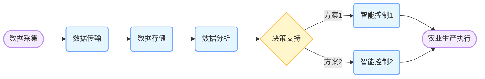

# 价值投资中的智能化精准农业系统分析

> 关键词：价值投资、智能化精准农业系统、农业技术、数据分析、投资回报

> 摘要：本文聚焦于价值投资视角下的智能化精准农业系统。首先介绍了智能化精准农业系统的背景，包括其目的、适用读者群体、文档结构和相关术语。接着阐述了该系统的核心概念与联系，剖析其原理和架构，并通过 Mermaid 流程图展示。详细讲解了核心算法原理及具体操作步骤，结合 Python 代码进行说明。给出了系统涉及的数学模型和公式，并举例阐释。通过项目实战，展示了开发环境搭建、源代码实现与解读。探讨了系统的实际应用场景，推荐了相关学习资源、开发工具框架以及论文著作。最后总结了智能化精准农业系统的未来发展趋势与挑战，解答常见问题并提供扩展阅读和参考资料，旨在为投资者和农业从业者全面深入地了解该系统提供有价值的参考。

## 1. 背景介绍 
### 1.1 目的和范围
智能化精准农业系统的出现是为了应对传统农业生产中存在的效率低下、资源浪费等问题。其目的在于通过运用先进的信息技术、传感器技术、数据分析技术等，实现对农业生产过程的精准管理和控制，提高农作物的产量和质量，降低生产成本，减少对环境的影响。

本文章的范围涵盖了智能化精准农业系统的各个方面，包括其核心概念、算法原理、数学模型、实际应用场景以及价值投资相关的分析等。旨在为读者提供一个全面、深入的了解该系统的视角，帮助投资者评估该领域的投资价值，同时为农业从业者提供技术参考和应用指导。

### 1.2 预期读者
本文预期读者包括但不限于以下几类人群：
- **投资者**：对农业领域投资感兴趣，希望了解智能化精准农业系统的投资潜力和风险，以便做出明智的投资决策。
- **农业从业者**：包括农民、农场主、农业企业管理人员等，希望通过引入智能化精准农业系统来提高农业生产效率和效益。
- **科研人员**：从事农业信息技术、传感器技术、数据分析等相关领域研究的科研人员，希望深入了解智能化精准农业系统的技术原理和发展趋势。
- **政策制定者**：政府部门中负责农业政策制定和管理的人员，希望通过了解智能化精准农业系统，制定相关政策来推动农业现代化发展。

### 1.3 文档结构概述
本文将按照以下结构进行阐述：
- **核心概念与联系**：介绍智能化精准农业系统的核心概念、原理和架构，通过文本示意图和 Mermaid 流程图展示系统的组成和运行机制。
- **核心算法原理 & 具体操作步骤**：详细讲解智能化精准农业系统中涉及的核心算法原理，并结合 Python 代码给出具体的操作步骤。
- **数学模型和公式 & 详细讲解 & 举例说明**：给出系统中涉及的数学模型和公式，进行详细讲解并通过实际例子进行说明。
- **项目实战：代码实际案例和详细解释说明**：通过一个具体的项目实战，展示智能化精准农业系统的开发环境搭建、源代码实现和代码解读。
- **实际应用场景**：探讨智能化精准农业系统在不同农业生产场景中的应用。
- **工具和资源推荐**：推荐相关的学习资源、开发工具框架以及论文著作，帮助读者进一步深入学习和研究。
- **总结：未来发展趋势与挑战**：总结智能化精准农业系统的未来发展趋势和面临的挑战。
- **附录：常见问题与解答**：解答读者在了解和应用智能化精准农业系统过程中常见的问题。
- **扩展阅读 & 参考资料**：提供相关的扩展阅读材料和参考资料，方便读者进一步查阅。

### 1.4 术语表
#### 1.4.1 核心术语定义
- **智能化精准农业系统**：是指利用信息技术、传感器技术、数据分析技术等现代科技手段，对农业生产过程进行精准监测、管理和控制的系统。
- **价值投资**：是一种投资策略，强调通过分析资产的内在价值，寻找被低估的资产进行投资，以获取长期稳定的投资回报。
- **传感器网络**：由大量的传感器节点组成的网络，用于实时采集农业生产环境中的各种数据，如土壤湿度、温度、光照强度等。
- **数据分析**：对采集到的农业生产数据进行处理、分析和挖掘，以提取有价值的信息和知识，为农业生产决策提供支持。

#### 1.4.2 相关概念解释
- **精准灌溉**：根据农作物的需水情况和土壤湿度等信息，精确控制灌溉水量和灌溉时间，避免水资源的浪费。
- **精准施肥**：根据土壤养分含量和农作物的营养需求，精确控制施肥量和施肥时间，提高肥料利用率。
- **作物生长模型**：描述农作物生长发育过程与环境因素之间关系的数学模型，用于预测农作物的生长状况和产量。

#### 1.4.3 缩略词列表
- **GIS**：地理信息系统（Geographic Information System）
- **GPS**：全球定位系统（Global Positioning System）
- **IoT**：物联网（Internet of Things）
- **AI**：人工智能（Artificial Intelligence）

## 2. 核心概念与联系 

智能化精准农业系统的核心概念主要包括传感器网络、数据分析、决策支持和智能控制等。这些概念相互联系、相互作用，共同构成了智能化精准农业系统的整体架构。

### 系统原理
智能化精准农业系统的原理是通过传感器网络实时采集农业生产环境中的各种数据，如土壤湿度、温度、光照强度、气象数据等。这些数据被传输到数据中心进行存储和处理。数据分析模块对采集到的数据进行分析和挖掘，提取有价值的信息和知识，如农作物的生长状况、土壤肥力状况、病虫害发生趋势等。决策支持模块根据数据分析结果，结合农业专家知识和经验，为农业生产决策提供建议和方案。智能控制模块根据决策支持模块提供的方案，自动控制农业生产设备，如灌溉系统、施肥系统、温室环境控制系统等，实现对农业生产过程的精准管理和控制。

### 系统架构
以下是智能化精准农业系统的架构文本示意图：

| 层次 | 组成部分 | 功能 |
| --- | --- | --- |
| 数据采集层 | 传感器网络（土壤传感器、气象传感器、作物生长传感器等） | 实时采集农业生产环境中的各种数据 |
| 数据传输层 | 通信网络（有线网络、无线网络） | 将采集到的数据传输到数据中心 |
| 数据处理层 | 数据存储系统（数据库、数据仓库）、数据分析模块（数据挖掘算法、机器学习算法） | 存储和处理采集到的数据，提取有价值的信息和知识 |
| 决策支持层 | 决策支持系统（农业专家系统、决策模型） | 根据数据分析结果，为农业生产决策提供建议和方案 |
| 智能控制层 | 农业生产设备（灌溉系统、施肥系统、温室环境控制系统等） | 根据决策支持模块提供的方案，自动控制农业生产设备 |

### Mermaid 流程图


该流程图展示了智能化精准农业系统的主要流程：首先进行数据采集，然后将采集到的数据传输到数据中心进行存储。接着对存储的数据进行分析，根据分析结果进行决策支持，生成不同的控制方案。最后根据控制方案进行智能控制，实现农业生产的执行。

## 3. 核心算法原理 & 具体操作步骤 

### 核心算法原理
智能化精准农业系统中涉及的核心算法主要包括数据挖掘算法、机器学习算法和优化算法等。以下以作物生长预测为例，介绍其中的机器学习算法——线性回归算法。

线性回归算法是一种用于建立自变量和因变量之间线性关系的统计模型。在作物生长预测中，我们可以将影响作物生长的因素（如土壤湿度、温度、光照强度等）作为自变量，将作物的生长指标（如株高、叶面积、产量等）作为因变量，通过线性回归算法建立它们之间的线性关系模型，从而预测作物的生长状况。

线性回归模型的一般形式为：

$$y = \beta_0 + \beta_1x_1 + \beta_2x_2 + \cdots + \beta_nx_n + \epsilon$$

其中，$y$ 是因变量，$x_1, x_2, \cdots, x_n$ 是自变量，$\beta_0, \beta_1, \beta_2, \cdots, \beta_n$ 是回归系数，$\epsilon$ 是误差项。

### 具体操作步骤
以下是使用 Python 实现线性回归算法进行作物生长预测的具体操作步骤：

```python
# 导入必要的库
import numpy as np
import pandas as pd
from sklearn.model_selection import train_test_split
from sklearn.linear_model import LinearRegression
from sklearn.metrics import mean_squared_error

# 1. 数据准备
# 假设我们有一个包含作物生长数据的 CSV 文件，文件名为 'crop_growth_data.csv'
# 数据包含土壤湿度、温度、光照强度等自变量和作物产量作为因变量
data = pd.read_csv('crop_growth_data.csv')

# 提取自变量和因变量
X = data.drop('yield', axis=1).values
y = data['yield'].values

# 2. 数据划分
# 将数据划分为训练集和测试集，测试集占比 20%
X_train, X_test, y_train, y_test = train_test_split(X, y, test_size=0.2, random_state=42)

# 3. 模型训练
# 创建线性回归模型
model = LinearRegression()

# 训练模型
model.fit(X_train, y_train)

# 4. 模型预测
# 使用训练好的模型对测试集进行预测
y_pred = model.predict(X_test)

# 5. 模型评估
# 计算均方误差
mse = mean_squared_error(y_test, y_pred)
print(f"均方误差: {mse}")

# 6. 输出回归系数
print(f"回归系数: {model.coef_}")
print(f"截距: {model.intercept_}")
```

### 代码解释
1. **数据准备**：使用 `pandas` 库读取包含作物生长数据的 CSV 文件，并提取自变量和因变量。
2. **数据划分**：使用 `sklearn.model_selection` 中的 `train_test_split` 函数将数据划分为训练集和测试集，以便评估模型的性能。
3. **模型训练**：创建线性回归模型，并使用训练集对模型进行训练。
4. **模型预测**：使用训练好的模型对测试集进行预测。
5. **模型评估**：使用 `sklearn.metrics` 中的 `mean_squared_error` 函数计算预测结果的均方误差，评估模型的性能。
6. **输出回归系数**：输出线性回归模型的回归系数和截距，以便分析自变量对因变量的影响程度。

## 4. 数学模型和公式 & 详细讲解 & 举例说明 

### 作物生长模型
作物生长模型是智能化精准农业系统中常用的数学模型之一，用于描述农作物生长发育过程与环境因素之间的关系。以下介绍一个简单的基于温度的作物生长度日模型。

#### 模型原理
作物生长度日模型基于作物生长需要一定的热量积累这一原理。作物生长度日（Growing Degree Days, GDD）是指在一定时间内，日平均温度减去作物生长的基点温度后的累积值。作物生长到某个阶段所需的 GDD 是相对固定的，因此可以通过计算 GDD 来预测作物的生长发育进程。

#### 数学公式
GDD 的计算公式为：

$$GDD = \frac{T_{max} + T_{min}}{2} - T_{base}$$

其中，$T_{max}$ 是日最高温度，$T_{min}$ 是日最低温度，$T_{base}$ 是作物生长的基点温度。

作物从播种到某个生长阶段所需的累积 GDD 可以表示为：

$$\sum_{i=1}^{n} GDD_i$$

其中，$n$ 是从播种到该生长阶段的天数，$GDD_i$ 是第 $i$ 天的 GDD。

#### 详细讲解
- **基点温度**：不同作物的基点温度不同，一般来说，温带作物的基点温度在 5℃ - 10℃ 之间，热带作物的基点温度在 10℃ - 15℃ 之间。基点温度是作物开始生长发育的最低温度，当温度低于基点温度时，作物生长停止。
- **日平均温度**：使用日最高温度和日最低温度的平均值来近似表示日平均温度。
- **累积 GDD**：通过累加每天的 GDD，可以得到作物从播种到某个生长阶段所需的热量积累。当累积 GDD 达到该生长阶段所需的阈值时，作物就会进入下一个生长阶段。

#### 举例说明
假设某作物的基点温度 $T_{base} = 10℃$，在连续 5 天内的日最高温度和日最低温度分别为：

| 天数 | 日最高温度 ($T_{max}$) | 日最低温度 ($T_{min}$) |
| --- | --- | --- |
| 1 | 20℃ | 10℃ |
| 2 | 22℃ | 12℃ |
| 3 | 25℃ | 15℃ |
| 4 | 23℃ | 13℃ |
| 5 | 21℃ | 11℃ |

计算每天的 GDD：

- 第 1 天：$GDD_1 = \frac{20 + 10}{2} - 10 = 5℃$
- 第 2 天：$GDD_2 = \frac{22 + 12}{2} - 10 = 7℃$
- 第 3 天：$GDD_3 = \frac{25 + 15}{2} - 10 = 10℃$
- 第 4 天：$GDD_4 = \frac{23 + 13}{2} - 10 = 8℃$
- 第 5 天：$GDD_5 = \frac{21 + 11}{2} - 10 = 6℃$

累积 GDD：

$$\sum_{i=1}^{5} GDD_i = 5 + 7 + 10 + 8 + 6 = 36℃$$

如果该作物从播种到开花所需的累积 GDD 阈值为 50℃，那么根据目前的热量积累情况，作物还需要一定的时间才能开花。

### 灌溉决策模型
灌溉决策模型用于确定何时进行灌溉以及灌溉的水量。以下介绍一个基于土壤水分平衡的灌溉决策模型。

#### 模型原理
土壤水分平衡是指土壤中水分的收入和支出之间的平衡关系。土壤水分的收入主要来自降雨和灌溉，支出主要包括作物蒸腾、土壤蒸发和深层渗漏。通过计算土壤水分平衡，可以确定土壤中水分的变化情况，从而做出合理的灌溉决策。

#### 数学公式
土壤水分平衡方程可以表示为：

$$\Delta S = P + I - ET - D$$

其中，$\Delta S$ 是土壤水分的变化量，$P$ 是降雨量，$I$ 是灌溉量，$ET$ 是作物蒸散量，$D$ 是深层渗漏量。

当土壤水分含量低于作物生长所需的临界值时，需要进行灌溉。灌溉量可以根据土壤水分的亏缺量来确定：

$$I = S_{fc} - S_{act} + ET - P$$

其中，$S_{fc}$ 是土壤田间持水量，$S_{act}$ 是土壤实际含水量。

#### 详细讲解
- **土壤田间持水量**：是指土壤在自然状态下所能保持的最大含水量，当土壤含水量达到田间持水量时，多余的水分会通过重力作用下渗。
- **作物蒸散量**：是指作物蒸腾和土壤蒸发的总和，受气象条件、作物生长阶段和土壤特性等因素的影响。
- **深层渗漏量**：是指土壤中多余的水分通过重力作用下渗到根系层以下的水量，与土壤质地、灌溉量和降雨量等因素有关。

#### 举例说明
假设某农田的土壤田间持水量 $S_{fc} = 200mm$，土壤实际含水量 $S_{act} = 150mm$，作物蒸散量 $ET = 10mm$，降雨量 $P = 5mm$。

计算灌溉量：

$$I = 200 - 150 + 10 - 5 = 55mm$$

因此，为了保持土壤水分含量在合适的范围内，需要进行 55mm 的灌溉。

## 5. 项目实战：代码实际案例和详细解释说明 

### 5.1  开发环境搭建
#### 硬件环境
- **传感器设备**：选择合适的传感器设备来采集农业生产环境中的数据，如土壤湿度传感器、温度传感器、光照强度传感器、气象站等。
- **数据传输设备**：根据传感器设备的通信接口和数据传输距离，选择合适的数据传输设备，如无线传输模块、网关等。
- **服务器**：选择一台性能稳定的服务器来存储和处理采集到的数据，可以使用云服务器或本地服务器。

#### 软件环境
- **操作系统**：选择适合服务器的操作系统，如 Linux（Ubuntu、CentOS 等）或 Windows Server。
- **数据库管理系统**：选择一个关系型数据库管理系统来存储采集到的数据，如 MySQL、PostgreSQL 等。
- **编程语言和开发框架**：选择 Python 作为主要的编程语言，并使用相关的开发框架，如 Django、Flask 等。

#### 开发工具
- **集成开发环境（IDE）**：选择一个适合 Python 开发的 IDE，如 PyCharm、Visual Studio Code 等。
- **版本控制系统**：使用 Git 作为版本控制系统，方便团队协作和代码管理。

### 5.2  源代码详细实现和代码解读
以下是一个简单的智能化精准农业系统的 Python 代码示例，用于实现数据采集、存储和简单的数据分析功能。

```python
# 导入必要的库
import serial
import time
import mysql.connector
import pandas as pd
from sklearn.linear_model import LinearRegression

# 1. 数据采集
def collect_data():
    # 假设使用串口通信来接收传感器数据
    ser = serial.Serial('COM3', 9600)  # 根据实际情况修改串口和波特率
    try:
        while True:
            line = ser.readline().decode('utf-8').strip()
            if line:
                data = line.split(',')
                soil_moisture = float(data[0])
                temperature = float(data[1])
                light_intensity = float(data[2])
                # 打印采集到的数据
                print(f"土壤湿度: {soil_moisture}，温度: {temperature}，光照强度: {light_intensity}")
                # 存储数据到数据库
                save_data(soil_moisture, temperature, light_intensity)
            time.sleep(1)
    except KeyboardInterrupt:
        ser.close()

# 2. 数据存储
def save_data(soil_moisture, temperature, light_intensity):
    # 连接到 MySQL 数据库
    mydb = mysql.connector.connect(
        host="localhost",
        user="your_username",
        password="your_password",
        database="agriculture_data"
    )
    mycursor = mydb.cursor()

    # 插入数据到数据表
    sql = "INSERT INTO sensor_data (soil_moisture, temperature, light_intensity) VALUES (%s, %s, %s)"
    val = (soil_moisture, temperature, light_intensity)
    mycursor.execute(sql, val)

    # 提交更改
    mydb.commit()

    # 关闭数据库连接
    mycursor.close()
    mydb.close()

# 3. 数据分析
def analyze_data():
    # 连接到 MySQL 数据库
    mydb = mysql.connector.connect(
        host="localhost",
        user="your_username",
        password="your_password",
        database="agriculture_data"
    )
    # 读取数据到 DataFrame
    df = pd.read_sql("SELECT * FROM sensor_data", mydb)

    # 提取自变量和因变量
    X = df[['soil_moisture', 'temperature']].values
    y = df['light_intensity'].values

    # 创建线性回归模型
    model = LinearRegression()

    # 训练模型
    model.fit(X, y)

    # 输出回归系数
    print(f"回归系数: {model.coef_}")
    print(f"截距: {model.intercept_}")

    # 关闭数据库连接
    mydb.close()

if __name__ == "__main__":
    # 启动数据采集
    # collect_data()

    # 进行数据分析
    analyze_data()
```

### 5.3  代码解读与分析
#### 数据采集部分
- `collect_data` 函数使用 `serial` 库来实现串口通信，接收传感器发送的数据。
- 读取到的数据进行解析，并提取土壤湿度、温度和光照强度等信息。
- 调用 `save_data` 函数将采集到的数据存储到数据库中。

#### 数据存储部分
- `save_data` 函数使用 `mysql.connector` 库连接到 MySQL 数据库。
- 执行 SQL 插入语句将数据插入到 `sensor_data` 数据表中。
- 提交更改并关闭数据库连接。

#### 数据分析部分
- `analyze_data` 函数使用 `pandas` 库从数据库中读取数据到 DataFrame。
- 提取自变量和因变量，并使用 `sklearn.linear_model` 中的 `LinearRegression` 模型进行线性回归分析。
- 输出回归系数和截距，分析自变量对因变量的影响程度。

## 6. 实际应用场景 
### 精准灌溉
智能化精准农业系统可以实时监测土壤湿度、气象数据等信息，根据作物的需水情况和土壤水分平衡原理，精确控制灌溉水量和灌溉时间。例如，在干旱地区，可以根据土壤湿度传感器的数据，及时启动灌溉系统，避免作物因缺水而受到影响；在多雨地区，可以根据降雨量和土壤水分含量，自动调整灌溉计划，避免水资源的浪费。

### 精准施肥
通过对土壤养分含量的实时监测和作物营养需求的分析，智能化精准农业系统可以精确控制施肥量和施肥时间。例如，在土壤肥力较低的区域，可以增加施肥量；在作物生长的关键时期，可以及时补充所需的养分，提高肥料利用率，减少环境污染。

### 病虫害防治
智能化精准农业系统可以通过图像识别技术、传感器监测等手段，实时监测作物的生长状况和病虫害发生情况。一旦发现病虫害迹象，系统可以及时发出警报，并提供相应的防治措施建议。例如，通过安装在田间的摄像头，实时监测作物的叶片图像，利用图像识别算法识别病虫害类型，并根据病虫害的严重程度推荐合适的农药和施药剂量。

### 温室环境控制
在温室种植中，智能化精准农业系统可以实时监测温室内部的温度、湿度、光照强度、二氧化碳浓度等环境参数，并根据作物的生长需求，自动控制温室的通风、遮阳、加热、降温、灌溉等设备，为作物创造适宜的生长环境。例如，当温室内温度过高时，系统可以自动打开通风设备或遮阳网，降低温度；当二氧化碳浓度过低时，系统可以自动补充二氧化碳气体。

### 农产品质量追溯
智能化精准农业系统可以记录农产品从种植、施肥、灌溉、病虫害防治到收获、加工、运输等全过程的信息，并通过二维码、区块链等技术，实现农产品质量的可追溯。消费者可以通过扫描农产品上的二维码，查询农产品的生产过程信息，了解农产品的质量安全情况，提高消费者对农产品的信任度。

## 7. 工具和资源推荐
### 7.1 学习资源推荐
#### 7.1.1 书籍推荐
- 《精准农业：原理与实践》：本书全面介绍了精准农业的基本原理、技术方法和应用案例，是学习精准农业的经典教材。
- 《Python 数据分析实战》：本书详细介绍了 Python 在数据分析领域的应用，包括数据处理、数据分析、数据可视化等方面的内容，对于学习智能化精准农业系统中的数据分析部分非常有帮助。
- 《机器学习实战》：本书通过实际案例介绍了机器学习的基本算法和应用，对于理解智能化精准农业系统中的机器学习算法原理和实现有很大的帮助。

#### 7.1.2 在线课程
- Coursera 平台上的“Precision Agriculture”课程：由国外知名高校的教授授课，系统介绍了精准农业的相关知识和技术。
- 中国大学 MOOC 平台上的“农业信息技术”课程：国内高校的教师讲解了农业信息技术的基本原理和应用，包括智能化精准农业系统的相关内容。
- 网易云课堂上的“Python 数据分析从入门到精通”课程：适合初学者学习 Python 数据分析的基础知识和技能。

#### 7.1.3 技术博客和网站
- 知乎：在知乎上搜索“智能化精准农业”、“精准农业技术”等关键词，可以找到很多相关的技术文章和讨论。
- 开源中国：该网站提供了大量的开源项目和技术文章，对于学习智能化精准农业系统的开发和实现有一定的参考价值。
- 中国农业信息网：该网站是中国农业领域的权威信息平台，提供了丰富的农业政策、技术、市场等方面的信息。

### 7.2 开发工具框架推荐
#### 7.2.1 IDE和编辑器
- PyCharm：一款功能强大的 Python 集成开发环境，提供了代码编辑、调试、版本控制等一系列功能，适合专业的 Python 开发者使用。
- Visual Studio Code：一款轻量级的代码编辑器，支持多种编程语言和插件扩展，对于初学者和快速开发非常方便。

#### 7.2.2 调试和性能分析工具
- Py-Spy：一个用于分析 Python 程序性能的工具，可以帮助开发者找出程序中的性能瓶颈。
- PDB：Python 自带的调试器，可以在代码中设置断点，逐步执行代码，帮助开发者调试程序。

#### 7.2.3 相关框架和库
- Django：一个功能强大的 Python Web 开发框架，适合开发大型的智能化精准农业系统的 Web 应用。
- Flask：一个轻量级的 Python Web 开发框架，适合快速开发小型的智能化精准农业系统的 Web 应用。
- Pandas：一个用于数据处理和分析的 Python 库，提供了丰富的数据结构和数据操作方法，对于处理农业生产数据非常方便。
- Scikit-learn：一个用于机器学习的 Python 库，提供了各种机器学习算法和工具，对于实现智能化精准农业系统中的机器学习算法非常有用。

### 7.3 相关论文著作推荐
#### 7.3.1 经典论文
- “Precision Agriculture: A Review”：该论文全面回顾了精准农业的发展历程、技术现状和应用前景，是精准农业领域的经典论文。
- “Machine Learning for Precision Agriculture: A Review”：该论文介绍了机器学习在精准农业中的应用，包括作物生长预测、病虫害防治、精准施肥等方面的研究成果。

#### 7.3.2 最新研究成果
- 可以通过学术数据库（如 IEEE Xplore、ACM Digital Library、ScienceDirect 等）搜索关于智能化精准农业系统的最新研究论文，了解该领域的最新技术和研究进展。

#### 7.3.3 应用案例分析
- 一些农业科技企业和研究机构会发布智能化精准农业系统的应用案例报告，可以通过搜索相关企业和机构的官方网站或行业报告，了解智能化精准农业系统在实际应用中的效果和经验。

## 8. 总结：未来发展趋势与挑战
### 未来发展趋势
#### 智能化程度不断提高
随着人工智能、物联网、大数据等技术的不断发展，智能化精准农业系统的智能化程度将不断提高。例如，智能传感器将更加智能化和小型化，能够实时、准确地采集更多的农业生产环境数据；数据分析算法将更加先进和智能，能够从海量的数据中提取更有价值的信息和知识；智能控制设备将更加自动化和智能化，能够根据数据分析结果自动调整农业生产设备的运行参数。

#### 与其他技术的融合不断加深
智能化精准农业系统将与地理信息系统（GIS）、全球定位系统（GPS）、遥感技术等其他技术不断融合，实现对农业生产的全方位、多层次的监测和管理。例如，通过 GIS 技术可以实现对农田的精准定位和管理，通过遥感技术可以实时监测大面积农田的作物生长状况和土壤肥力状况。

#### 向农业产业链上下游延伸
智能化精准农业系统将不仅仅局限于农业生产环节，还将向农业产业链的上下游延伸。例如，在农产品加工环节，可以通过智能化技术实现对农产品加工过程的精准控制和质量监测；在农产品流通环节，可以通过智能化物流管理系统实现对农产品的实时跟踪和配送优化。

#### 云服务和大数据平台的应用
云服务和大数据平台将在智能化精准农业系统中得到广泛应用。通过云服务，农业生产者可以方便地存储和管理农业生产数据，随时随地获取数据分析结果和决策支持建议；通过大数据平台，可以整合和分析来自不同地区、不同农户的农业生产数据，挖掘数据的潜在价值，为农业政策制定和农业产业发展提供决策依据。

### 挑战
#### 技术成本较高
智能化精准农业系统涉及到传感器技术、数据分析技术、智能控制技术等多种先进技术，这些技术的研发和应用成本较高，对于一些小型农户和农业企业来说，难以承受。因此，如何降低技术成本，提高智能化精准农业系统的性价比，是推广应用该系统的关键问题之一。

#### 数据安全和隐私问题
智能化精准农业系统需要采集和处理大量的农业生产数据，这些数据涉及到农户和农业企业的隐私和商业机密。因此，如何保障数据的安全和隐私，防止数据泄露和滥用，是智能化精准农业系统面临的重要挑战之一。

#### 农民素质和接受程度
智能化精准农业系统的推广应用需要农民具备一定的信息技术和农业科技知识。然而，目前我国农民的整体素质相对较低，对新技术的接受程度不高。因此，如何加强农民的培训和教育，提高农民的素质和接受程度，是推广应用智能化精准农业系统的重要任务之一。

#### 标准和规范不完善
目前，智能化精准农业系统的标准和规范还不完善，不同厂家生产的传感器设备、智能控制设备等可能存在兼容性问题，数据分析算法和决策支持模型也缺乏统一的标准和规范。因此，如何制定和完善智能化精准农业系统的标准和规范，促进系统的互联互通和互操作性，是推动该系统健康发展的重要保障。

## 9. 附录：常见问题与解答
### 问题 1：智能化精准农业系统的投资回报率如何？
答：智能化精准农业系统的投资回报率受到多种因素的影响，如系统的建设成本、运行成本、农产品价格、产量提高幅度等。一般来说，通过提高农作物的产量和质量、降低生产成本、减少资源浪费等方式，智能化精准农业系统可以在一定程度上提高投资回报率。但是，具体的投资回报率需要根据实际情况进行评估和分析。

### 问题 2：智能化精准农业系统对网络环境有什么要求？
答：智能化精准农业系统需要实时采集和传输大量的农业生产数据，因此对网络环境有一定的要求。一般来说，系统需要稳定、高速的网络连接，以确保数据的及时传输和处理。在一些偏远地区或网络信号较弱的地方，可以考虑使用无线传输技术（如 LoRa、ZigBee 等）或卫星通信技术来解决网络连接问题。

### 问题 3：智能化精准农业系统的维护难度大吗？
答：智能化精准农业系统的维护难度相对较大，需要专业的技术人员进行维护和管理。系统的维护工作包括传感器设备的校准和维护、数据中心的服务器维护、软件系统的升级和优化等。为了降低维护难度和成本，可以选择可靠的设备供应商和系统集成商，并建立完善的维护管理制度和应急预案。

### 问题 4：智能化精准农业系统可以应用于所有类型的农业生产吗？
答：智能化精准农业系统可以应用于大多数类型的农业生产，如大田作物种植、蔬菜种植、水果种植、畜牧养殖等。但是，不同类型的农业生产对系统的功能和性能要求可能会有所不同。例如，大田作物种植可能更注重土壤水分监测和精准灌溉，而蔬菜种植可能更注重温室环境控制和病虫害防治。因此，在应用智能化精准农业系统时，需要根据具体的农业生产需求进行定制化开发和配置。

## 10. 扩展阅读 & 参考资料
### 扩展阅读
- 《智慧农业：未来农业的发展方向》：介绍了智慧农业的概念、技术和应用前景，对于了解智能化精准农业系统的发展趋势有一定的帮助。
- 《农业物联网技术与应用》：详细介绍了农业物联网的相关技术和应用案例，包括传感器技术、通信技术、数据分析技术等，对于深入学习智能化精准农业系统的技术原理有很大的帮助。

### 参考资料
- 相关的农业行业标准和规范，如《精准农业术语》、《农业物联网传感器通用技术要求》等。
- 智能化精准农业系统相关的专利文献和技术报告。
- 各大农业科技企业和研究机构发布的智能化精准农业系统的产品介绍和应用案例。