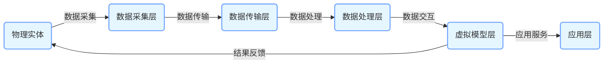

# 价值投资中的智能工厂数字孪生系统分析

> 关键词：价值投资、智能工厂、数字孪生系统、工业互联网、数据分析、智能制造、投资评估

> 摘要：本文围绕价值投资中的智能工厂数字孪生系统展开深入分析。首先介绍了智能工厂数字孪生系统的背景和相关概念，阐述其原理、架构和关键技术。接着详细讲解了数字孪生系统的核心算法原理，并给出具体的Python代码实现和操作步骤。同时，通过数学模型和公式对系统进行量化分析，辅以实际案例说明。在项目实战部分，介绍了开发环境搭建、源代码实现和代码解读。还探讨了智能工厂数字孪生系统的实际应用场景，推荐了相关的学习资源、开发工具框架和论文著作。最后总结了该系统未来的发展趋势与挑战，并对常见问题进行了解答，为价值投资者和相关从业者提供全面的参考。

## 1. 背景介绍 
### 1.1 目的和范围
随着全球制造业向智能化、数字化转型，智能工厂成为制造业发展的重要方向。数字孪生系统作为智能工厂的核心技术之一，能够实现物理实体与虚拟模型的实时映射和交互，为生产过程的优化、决策支持提供有力手段。本文的目的在于深入分析价值投资视角下的智能工厂数字孪生系统，探讨其技术原理、应用场景和投资价值，为投资者提供决策依据，同时为相关技术人员提供技术参考。

本文的范围涵盖智能工厂数字孪生系统的基本概念、核心算法、数学模型、项目实战、应用场景等多个方面，全面系统地介绍该系统的相关知识。

### 1.2 预期读者
本文预期读者包括对智能工厂、数字孪生技术感兴趣的投资者，希望了解智能制造前沿技术的制造业从业者，以及从事相关领域研究的科研人员和高校学生。

### 1.3 文档结构概述
本文将按照以下结构进行阐述：首先介绍智能工厂数字孪生系统的背景知识，包括目的、范围、预期读者等；接着讲解核心概念与联系，包括系统原理、架构和关键技术；然后详细阐述核心算法原理和具体操作步骤，给出Python代码示例；再通过数学模型和公式对系统进行量化分析，并举例说明；之后进行项目实战，介绍开发环境搭建、源代码实现和代码解读；随后探讨实际应用场景；接着推荐相关的工具和资源；最后总结未来发展趋势与挑战，解答常见问题，并提供扩展阅读和参考资料。

### 1.4 术语表
#### 1.4.1 核心术语定义
- **价值投资**：一种基于对资产内在价值评估的投资策略，投资者通过分析公司的基本面、财务状况、行业前景等因素，寻找被低估的资产进行投资。
- **智能工厂**：利用先进的信息技术、自动化技术和人工智能技术，实现生产过程的智能化、自动化和数字化的工厂。
- **数字孪生系统**：通过建立物理实体的虚拟模型，实现物理实体与虚拟模型之间的实时数据交互和映射，对物理实体的状态、行为和性能进行实时监测、分析和预测的系统。
- **工业互联网**：将互联网技术与工业生产相结合，实现工业生产过程的数字化、网络化和智能化的一种新型基础设施。

#### 1.4.2 相关概念解释
- **物理实体**：指实际存在的物理设备、生产线、工厂等。
- **虚拟模型**：通过计算机建模技术建立的与物理实体相对应的数字化模型，能够反映物理实体的结构、行为和性能。
- **数据交互**：物理实体与虚拟模型之间通过传感器、网络等手段进行数据的传输和共享。
- **实时映射**：虚拟模型能够实时反映物理实体的状态和变化，实现两者之间的同步。

#### 1.4.3 缩略词列表
- **IoT**：Internet of Things，物联网
- **AI**：Artificial Intelligence，人工智能
- **PLC**：Programmable Logic Controller，可编程逻辑控制器
- **CAD**：Computer-Aided Design，计算机辅助设计

## 2. 核心概念与联系 
### 2.1 智能工厂数字孪生系统原理
智能工厂数字孪生系统的核心原理是通过传感器、物联网等技术实时采集物理实体的运行数据，将这些数据传输到虚拟模型中，虚拟模型根据接收到的数据进行实时更新和仿真分析，同时将分析结果反馈给物理实体，实现物理实体与虚拟模型之间的双向交互和实时映射。

### 2.2 系统架构
智能工厂数字孪生系统通常由数据采集层、数据传输层、数据处理层、虚拟模型层和应用层组成。以下是其架构的文本示意图：

- **数据采集层**：负责采集物理实体的各种运行数据，包括温度、压力、转速、振动等，主要设备有传感器、PLC等。
- **数据传输层**：将采集到的数据通过网络传输到数据处理层，常用的网络技术有以太网、无线局域网、工业物联网等。
- **数据处理层**：对采集到的数据进行清洗、预处理、存储和分析，提取有价值的信息，常用的技术有大数据处理、机器学习等。
- **虚拟模型层**：建立物理实体的虚拟模型，包括几何模型、物理模型、行为模型等，通过与数据处理层的数据交互，实现虚拟模型的实时更新和仿真分析。
- **应用层**：根据虚拟模型的分析结果，为生产过程的优化、决策支持、故障诊断等提供应用服务。

### 2.3 Mermaid流程图


### 2.4 关键技术联系
智能工厂数字孪生系统涉及多种关键技术，这些技术相互关联、相互支撑，共同实现系统的功能。例如，物联网技术为数据采集和传输提供了基础，大数据处理技术为数据的存储和分析提供了手段，人工智能技术为虚拟模型的仿真分析和决策支持提供了智能算法，CAD技术为虚拟模型的建立提供了几何建模工具。

## 3. 核心算法原理 & 具体操作步骤 
### 3.1 核心算法原理
智能工厂数字孪生系统中常用的核心算法包括数据处理算法、机器学习算法和仿真算法等。以下以数据处理算法中的数据清洗和机器学习算法中的回归分析为例进行详细讲解。

#### 3.1.1 数据清洗算法
数据清洗是指对采集到的原始数据进行预处理，去除噪声、缺失值和异常值，提高数据的质量。常用的数据清洗方法包括均值填充、中位数填充、基于统计的异常值检测等。

#### 3.1.2 回归分析算法
回归分析是一种用于预测变量之间关系的统计方法，在智能工厂数字孪生系统中，可以用于预测设备的性能、故障发生的概率等。常见的回归分析方法包括线性回归、多项式回归、逻辑回归等。

### 3.2 Python源代码实现
以下是一个简单的数据清洗和线性回归分析的Python代码示例：

```python
import pandas as pd
import numpy as np
from sklearn.linear_model import LinearRegression
from sklearn.model_selection import train_test_split
from sklearn.metrics import mean_squared_error

# 生成示例数据
data = {
    'feature1': [1, 2, 3, 4, 5, np.nan, 7, 8, 9, 10],
    'feature2': [2, 4, 6, 8, 10, 12, 14, 16, 18, 20],
    'target': [3, 6, 9, 12, 15, 18, 21, 24, 27, 30]
}
df = pd.DataFrame(data)

# 数据清洗：均值填充缺失值
df.fillna(df.mean(), inplace=True)

# 划分特征和目标变量
X = df[['feature1', 'feature2']]
y = df['target']

# 划分训练集和测试集
X_train, X_test, y_train, y_test = train_test_split(X, y, test_size=0.2, random_state=42)

# 创建线性回归模型
model = LinearRegression()

# 训练模型
model.fit(X_train, y_train)

# 预测
y_pred = model.predict(X_test)

# 计算均方误差
mse = mean_squared_error(y_test, y_pred)
print(f"均方误差: {mse}")
```

### 3.3 具体操作步骤
1. **数据采集**：使用传感器、PLC等设备采集物理实体的运行数据。
2. **数据传输**：将采集到的数据通过网络传输到数据处理服务器。
3. **数据清洗**：对采集到的原始数据进行预处理，去除噪声、缺失值和异常值。
4. **特征工程**：从清洗后的数据中提取有价值的特征。
5. **模型训练**：使用机器学习算法对特征数据进行训练，建立预测模型。
6. **模型评估**：使用测试数据对训练好的模型进行评估，计算模型的性能指标。
7. **模型应用**：将训练好的模型应用到实际生产中，进行设备性能预测、故障诊断等。

## 4. 数学模型和公式 & 详细讲解 & 举例说明 
### 4.1 线性回归数学模型
线性回归是一种用于预测变量之间线性关系的统计方法，其数学模型可以表示为：

$$y = \beta_0 + \beta_1x_1 + \beta_2x_2 + \cdots + \beta_nx_n + \epsilon$$

其中，$y$ 是目标变量，$x_1, x_2, \cdots, x_n$ 是特征变量，$\beta_0, \beta_1, \beta_2, \cdots, \beta_n$ 是回归系数，$\epsilon$ 是误差项。

### 4.2 最小二乘法求解回归系数
线性回归模型的回归系数可以通过最小二乘法求解，最小二乘法的目标是使预测值与实际值之间的误差平方和最小。误差平方和的计算公式为：

$$S(\beta) = \sum_{i=1}^{m}(y_i - \hat{y}_i)^2 = \sum_{i=1}^{m}(y_i - \beta_0 - \beta_1x_{i1} - \beta_2x_{i2} - \cdots - \beta_nx_{in})^2$$

其中，$m$ 是样本数量，$y_i$ 是第 $i$ 个样本的实际值，$\hat{y}_i$ 是第 $i$ 个样本的预测值。

对 $S(\beta)$ 求偏导数并令其等于 0，可以得到回归系数的估计值：

$$\hat{\beta} = (X^TX)^{-1}X^Ty$$

其中，$X$ 是特征矩阵，$y$ 是目标向量。

### 4.3 举例说明
假设有一个简单的线性回归问题，已知一组数据点 $(x_1, y_1), (x_2, y_2), \cdots, (x_m, y_m)$，我们要通过线性回归模型预测 $y$ 与 $x$ 之间的关系。

首先，将数据点表示为矩阵形式：

$$X = \begin{bmatrix}
1 & x_1 \\
1 & x_2 \\
\vdots & \vdots \\
1 & x_m
\end{bmatrix}, y = \begin{bmatrix}
y_1 \\
y_2 \\
\vdots \\
y_m
\end{bmatrix}$$

然后，根据最小二乘法公式计算回归系数：

$$\hat{\beta} = (X^TX)^{-1}X^Ty$$

最后，得到线性回归模型：

$$\hat{y} = \hat{\beta}_0 + \hat{\beta}_1x$$

例如，已知数据点 $(1, 3), (2, 5), (3, 7), (4, 9), (5, 11)$，我们可以使用Python代码求解回归系数：

```python
import numpy as np

# 特征矩阵
X = np.array([[1, 1], [1, 2], [1, 3], [1, 4], [1, 5]])
# 目标向量
y = np.array([3, 5, 7, 9, 11])

# 计算回归系数
beta = np.linalg.inv(X.T.dot(X)).dot(X.T).dot(y)
print(f"回归系数: {beta}")
```

运行上述代码，得到回归系数 $\hat{\beta}_0 = 1$，$\hat{\beta}_1 = 2$，因此线性回归模型为 $\hat{y} = 1 + 2x$。

## 5. 项目实战：代码实际案例和详细解释说明 
### 5.1  开发环境搭建
#### 5.1.1 硬件环境
- **服务器**：建议使用配置较高的服务器，如Intel Xeon处理器、16GB以上内存、1TB以上硬盘。
- **传感器**：根据实际需求选择合适的传感器，如温度传感器、压力传感器、转速传感器等。
- **网络设备**：包括交换机、路由器等，确保网络稳定。

#### 5.1.2 软件环境
- **操作系统**：建议使用Linux操作系统，如Ubuntu、CentOS等。
- **开发工具**：Python开发环境，可使用Anaconda进行安装和管理。
- **数据库**：选择合适的数据库，如MySQL、MongoDB等，用于存储采集到的数据。

### 5.2  源代码详细实现和代码解读
以下是一个简单的智能工厂数字孪生系统的Python代码示例，包括数据采集、数据处理和虚拟模型仿真：

```python
import random
import time
import pandas as pd
from sklearn.linear_model import LinearRegression

# 模拟数据采集
def data_collection():
    temperature = random.uniform(20, 50)
    pressure = random.uniform(100, 200)
    speed = random.uniform(1000, 3000)
    return temperature, pressure, speed

# 数据处理
def data_processing(temperature, pressure, speed):
    data = {
        'temperature': [temperature],
        'pressure': [pressure],
        'speed': [speed]
    }
    df = pd.DataFrame(data)
    # 简单的数据清洗：去除异常值
    df = df[(df['temperature'] > 0) & (df['pressure'] > 0) & (df['speed'] > 0)]
    return df

# 虚拟模型仿真
def virtual_model_simulation(df):
    X = df[['temperature', 'pressure']]
    y = df['speed']
    model = LinearRegression()
    model.fit(X, y)
    # 预测新数据
    new_temperature = random.uniform(20, 50)
    new_pressure = random.uniform(100, 200)
    new_X = pd.DataFrame({'temperature': [new_temperature], 'pressure': [new_pressure]})
    new_speed = model.predict(new_X)
    return new_temperature, new_pressure, new_speed[0]

# 主程序
if __name__ == "__main__":
    while True:
        # 数据采集
        temperature, pressure, speed = data_collection()
        print(f"采集到的数据：温度={temperature}℃，压力={pressure}Pa，转速={speed}r/min")
        
        # 数据处理
        df = data_processing(temperature, pressure, speed)
        
        # 虚拟模型仿真
        new_temperature, new_pressure, new_speed = virtual_model_simulation(df)
        print(f"虚拟模型预测结果：温度={new_temperature}℃，压力={new_pressure}Pa，转速={new_speed}r/min")
        
        time.sleep(5)
```

### 5.3  代码解读与分析
- **数据采集**：`data_collection` 函数模拟传感器采集物理实体的运行数据，包括温度、压力和转速。
- **数据处理**：`data_processing` 函数对采集到的数据进行简单的清洗，去除异常值。
- **虚拟模型仿真**：`virtual_model_simulation` 函数使用线性回归模型对处理后的数据进行训练，并预测新的转速值。
- **主程序**：在主程序中，不断循环进行数据采集、数据处理和虚拟模型仿真，并打印采集到的数据和预测结果。

## 6. 实际应用场景 
### 6.1 生产过程优化
智能工厂数字孪生系统可以实时监测生产过程中的各种参数，通过虚拟模型的仿真分析，找出生产过程中的瓶颈和问题，提出优化方案，提高生产效率和产品质量。例如，通过对生产线的虚拟建模和仿真，可以优化生产线的布局、调整设备的运行参数，减少生产周期和成本。

### 6.2 设备故障诊断与预测
数字孪生系统可以实时监测设备的运行状态，通过对设备的虚拟建模和数据分析，预测设备的故障发生概率和剩余使用寿命，提前进行维护和维修，减少设备停机时间和维修成本。例如，通过对电机的振动、温度等参数的实时监测和分析，可以及时发现电机的故障隐患，提前进行维修。

### 6.3 产品设计与研发
数字孪生系统可以在产品设计阶段建立产品的虚拟模型，通过对虚拟模型的仿真分析，优化产品的设计方案，提高产品的性能和质量。例如，在汽车设计阶段，可以通过对汽车的虚拟建模和仿真，优化汽车的外形、结构和动力系统，提高汽车的燃油经济性和安全性。

### 6.4 供应链管理
数字孪生系统可以对供应链进行建模和仿真，实时监测供应链的运行状态，优化供应链的布局和物流路径，提高供应链的效率和可靠性。例如，通过对物流配送中心的虚拟建模和仿真，可以优化配送路线、提高车辆的利用率，减少物流成本。

## 7. 工具和资源推荐
### 7.1 学习资源推荐
#### 7.1.1 书籍推荐
- 《数字孪生：推动制造业数字化转型的关键技术》：系统介绍了数字孪生的基本概念、技术原理和应用案例。
- 《工业互联网：概念、技术与实践》：全面介绍了工业互联网的相关知识，包括数字孪生、物联网、大数据等。
- 《Python机器学习实战》：详细讲解了Python在机器学习中的应用，包括数据处理、模型训练、模型评估等。

#### 7.1.2 在线课程
- Coursera上的“Machine Learning”：由Andrew Ng教授主讲，是机器学习领域的经典课程。
- edX上的“Data Science MicroMasters Program”：涵盖了数据科学的各个方面，包括数据分析、机器学习、深度学习等。
- 中国大学MOOC上的“智能制造技术基础”：介绍了智能制造的相关技术，包括数字孪生、工业互联网等。

#### 7.1.3 技术博客和网站
- 工业互联网产业联盟官网：提供工业互联网领域的最新政策、技术动态和应用案例。
- 开源中国：提供开源项目和技术文章，涵盖了智能制造、数字孪生等领域。
- 知乎：有很多关于数字孪生、智能工厂的讨论和分享。

### 7.2 开发工具框架推荐
#### 7.2.1 IDE和编辑器
- PyCharm：是一款专业的Python集成开发环境，具有代码编辑、调试、版本控制等功能。
- Visual Studio Code：是一款轻量级的代码编辑器，支持多种编程语言，具有丰富的插件扩展功能。
- Jupyter Notebook：是一款交互式的编程环境，适合进行数据分析和模型训练。

#### 7.2.2 调试和性能分析工具
- PDB：Python自带的调试工具，可以帮助开发者调试代码。
- Py-Spy：是一款性能分析工具，可以分析Python代码的性能瓶颈。
- TensorBoard：是TensorFlow的可视化工具，可以帮助开发者可视化模型训练过程和结果。

#### 7.2.3 相关框架和库
- Pandas：是一款强大的数据处理库，提供了数据结构和数据处理方法，方便进行数据清洗、预处理和分析。
- Scikit-learn：是一款常用的机器学习库，提供了各种机器学习算法和工具，方便进行模型训练和评估。
- TensorFlow：是一款开源的深度学习框架，提供了丰富的深度学习模型和工具，适合进行复杂的数据分析和模型训练。

### 7.3 相关论文著作推荐
#### 7.3.1 经典论文
- “Digital Twin: Mitigating Unpredictable, Undesirable Emergent Behavior in Complex Systems”：首次提出了数字孪生的概念，并阐述了其在复杂系统中的应用。
- “A Survey on Digital Twin: Fundamental Concept, Reference Model, Applications and Research Issues”：对数字孪生的基本概念、参考模型、应用场景和研究问题进行了全面的综述。

#### 7.3.2 最新研究成果
- 关注IEEE、ACM等学术会议和期刊上的最新研究论文，了解数字孪生技术的最新发展动态。

#### 7.3.3 应用案例分析
- 查阅工业界的实际应用案例，了解数字孪生技术在不同行业的应用效果和经验教训。

## 8. 总结：未来发展趋势与挑战
### 8.1 未来发展趋势
- **与人工智能深度融合**：未来，智能工厂数字孪生系统将与人工智能技术深度融合，实现更智能的数据分析、决策支持和自动化控制。例如，利用深度学习算法对大量的生产数据进行分析，发现潜在的规律和模式，实现生产过程的自主优化和决策。
- **跨领域集成**：数字孪生系统将与工业互联网、物联网、云计算等技术进行跨领域集成，实现物理世界和虚拟世界的全面连接和交互。例如，通过工业互联网平台实现设备之间的互联互通，通过云计算平台提供强大的计算和存储能力。
- **应用场景拓展**：智能工厂数字孪生系统的应用场景将不断拓展，不仅应用于制造业，还将应用于能源、交通、医疗等领域。例如，在能源领域，利用数字孪生系统对电力系统进行建模和仿真，优化电力调度和能源管理。

### 8.2 挑战
- **数据安全与隐私**：智能工厂数字孪生系统涉及大量的生产数据和企业敏感信息，数据安全和隐私保护是一个重要的挑战。需要采取有效的数据加密、访问控制等技术手段，确保数据的安全性和隐私性。
- **标准与规范缺失**：目前，智能工厂数字孪生系统的标准和规范还不够完善，不同厂商的系统之间存在兼容性问题。需要加快标准和规范的制定，促进数字孪生技术的推广和应用。
- **人才短缺**：智能工厂数字孪生系统涉及多学科知识和技术，需要既懂制造业又懂信息技术的复合型人才。目前，这类人才短缺，制约了数字孪生技术的发展。

## 9. 附录：常见问题与解答
### 9.1 数字孪生系统与仿真系统有什么区别？
数字孪生系统与仿真系统有一定的相似性，但也存在一些区别。仿真系统主要是对物理系统进行建模和仿真，以预测系统的性能和行为；而数字孪生系统不仅可以对物理系统进行建模和仿真，还可以实现物理实体与虚拟模型之间的实时数据交互和映射，实时反映物理实体的状态和变化。

### 9.2 智能工厂数字孪生系统的建设成本高吗？
智能工厂数字孪生系统的建设成本取决于多个因素，如系统的规模、功能需求、硬件设备的选型等。一般来说，建设成本相对较高，但从长期来看，数字孪生系统可以提高生产效率、降低成本、提高产品质量，带来显著的经济效益。

### 9.3 如何选择适合的数字孪生平台？
选择适合的数字孪生平台需要考虑多个因素，如平台的功能、性能、易用性、开放性、安全性等。同时，还需要根据企业的实际需求和应用场景进行选择。可以参考其他企业的应用案例和用户评价，进行综合评估和比较。

## 10. 扩展阅读 & 参考资料
### 10.1 扩展阅读
- 《智能制造：从理念到实践》
- 《工业4.0：即将来袭的第四次工业革命》
- 《物联网：技术、应用与标准》

### 10.2 参考资料
- 工业互联网产业联盟相关报告
- IEEE、ACM等学术会议和期刊上的相关论文
- 相关企业的技术文档和白皮书