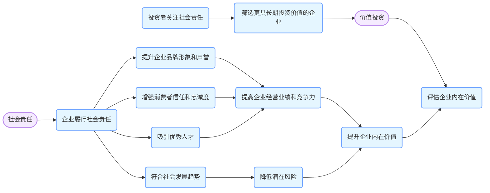

# 价值投资中的社会责任因素

> 关键词：价值投资、社会责任、可持续发展、企业道德、ESG、投资决策、社会影响

> 摘要：本文深入探讨了价值投资中社会责任因素的重要性和影响。在当今社会，投资者越来越关注企业在社会责任方面的表现，这不仅关系到企业的长期可持续发展，也对价值投资的理念和实践产生了深远的影响。文章首先介绍了相关背景，包括目的和范围、预期读者等内容。接着阐述了价值投资和社会责任的核心概念及两者之间的联系，通过文本示意图和Mermaid流程图进行清晰展示。然后详细讲解了涉及的核心算法原理和具体操作步骤，结合Python源代码进行说明。还介绍了相关的数学模型和公式，并举例分析。通过项目实战，给出代码实际案例和详细解释。探讨了社会责任因素在价值投资中的实际应用场景，推荐了相关的学习资源、开发工具框架和论文著作。最后总结了未来发展趋势与挑战，提供常见问题与解答及扩展阅读和参考资料，旨在为投资者和相关从业者提供全面且深入的指导。

## 1. 背景介绍 
### 1.1 目的和范围
随着全球经济的发展和社会意识的提高，投资者对于企业的评估不再仅仅局限于财务指标。价值投资作为一种长期的投资策略，旨在寻找被低估的优质企业。而社会责任因素逐渐成为衡量企业优质与否的重要维度。本文的目的在于全面探讨价值投资中社会责任因素的各个方面，包括其定义、与价值投资的关系、如何量化评估以及在实际投资中的应用等。范围涵盖了从理论原理到实际操作，从学术研究到市场实践的多个层面。

### 1.2 预期读者
本文预期读者包括投资者，无论是个人投资者还是机构投资者，希望他们能够在投资决策中更好地考虑社会责任因素，提高投资的质量和可持续性；金融从业者，如基金经理、分析师等，为他们的工作提供新的视角和方法；企业管理者，促使他们重视企业的社会责任，提升企业的综合竞争力；以及对价值投资和社会责任相关领域感兴趣的学者和研究人员。

### 1.3 文档结构概述
本文将按照以下结构展开：首先介绍价值投资和社会责任的核心概念以及它们之间的联系，通过示意图和流程图进行直观展示；接着阐述核心算法原理和具体操作步骤，用Python代码进行详细说明；然后介绍相关的数学模型和公式，并举例分析；通过项目实战，给出代码实际案例和详细解释；探讨社会责任因素在价值投资中的实际应用场景；推荐相关的学习资源、开发工具框架和论文著作；最后总结未来发展趋势与挑战，提供常见问题与解答及扩展阅读和参考资料。

### 1.4 术语表
#### 1.4.1 核心术语定义
- **价值投资**：一种投资策略，投资者通过分析企业的基本面，如财务状况、经营业绩等，寻找被市场低估的股票，以期在长期获得高于市场平均水平的回报。
- **社会责任**：企业在创造利润、对股东和员工承担法律责任的同时，还要承担对消费者、社区和环境的责任。企业的社会责任要求企业必须超越把利润作为唯一目标的传统理念，强调要在生产过程中对人的价值的关注，强调对环境、消费者、对社会的贡献。
- **ESG**：即环境（Environmental）、社会（Social）和治理（Governance），是一种关注企业环境、社会、治理绩效而非财务绩效的投资理念和企业评价标准。

#### 1.4.2 相关概念解释
- **可持续发展**：既满足当代人的需求，又不损害后代人满足其需求的能力的发展。在企业层面，可持续发展要求企业在经济、社会和环境三个维度上实现平衡发展。
- **企业道德**：企业在经营过程中遵循的道德原则和规范，包括诚实、公平、尊重他人等价值观。

#### 1.4.3 缩略词列表
- **ESG**：Environmental, Social and Governance（环境、社会和治理）
- **CSR**：Corporate Social Responsibility（企业社会责任）

## 2. 核心概念与联系 
### 2.1 价值投资的核心概念
价值投资的核心在于寻找那些内在价值被市场低估的企业。投资者通过对企业的财务报表、行业前景、竞争优势等基本面因素进行深入分析，来评估企业的内在价值。内在价值是指企业未来现金流的现值，它反映了企业的真实经济价值。价值投资者相信，市场有时会出现非理性的波动，导致股票价格偏离其内在价值。当股票价格低于其内在价值时，投资者就认为该股票具有投资价值，可以买入并持有，等待市场纠正错误，实现股票价格向内在价值的回归。

### 2.2 社会责任的核心概念
社会责任强调企业在经济活动中要考虑到社会和环境的影响。从社会层面来看，企业要为员工提供良好的工作环境和发展机会，保障消费者的合法权益，积极参与社区建设和公益事业。从环境层面来看，企业要采取措施减少对环境的污染和破坏，推动可持续发展。社会责任不仅是一种道德义务，也是企业长期发展的必然要求。一个积极履行社会责任的企业，能够提高自身的社会形象和声誉，增强消费者的信任和忠诚度，吸引优秀的人才，从而提升企业的竞争力。

### 2.3 价值投资与社会责任的联系
价值投资和社会责任之间存在着密切的联系。一方面，积极履行社会责任的企业往往具有更好的长期发展前景。企业通过关注社会和环境问题，能够更好地适应社会的发展趋势，降低潜在的风险，提高运营效率，从而提升企业的内在价值。例如，一家注重环境保护的企业，能够避免因环境问题而面临的法律风险和声誉损失，同时也可能通过开发环保产品和技术获得新的市场机会。另一方面，投资者对社会责任的关注也在不断增加。越来越多的投资者认识到，社会责任因素可以作为评估企业质量和可持续性的重要指标。在投资决策中考虑社会责任因素，能够帮助投资者筛选出更具长期投资价值的企业，降低投资风险。

### 2.4 文本示意图
价值投资与社会责任的联系可以用以下文本示意图表示：

价值投资关注企业内在价值，内在价值由企业的财务状况、经营业绩、竞争优势等基本面因素决定。社会责任作为企业的一种行为准则，影响着企业的多个方面。积极履行社会责任可以提升企业的品牌形象和声誉，增强消费者的信任和忠诚度，吸引优秀的人才，从而提高企业的经营业绩和竞争力，进而提升企业的内在价值。同时，投资者对社会责任的关注也促使企业更加重视社会责任的履行，形成一种良性循环。

### 2.5 Mermaid 流程图


## 3. 核心算法原理 & 具体操作步骤 
### 3.1 核心算法原理
在价值投资中考虑社会责任因素，需要对企业的社会责任表现进行量化评估。一种常用的方法是构建社会责任评分体系。该体系可以基于ESG指标，从环境、社会和治理三个维度对企业进行评估。每个维度下又包含多个具体的指标，例如环境维度可以包括能源消耗、污染物排放等指标；社会维度可以包括员工福利、社区参与等指标；治理维度可以包括董事会结构、信息披露等指标。通过对每个指标进行打分，并根据其重要性赋予相应的权重，最后汇总得到企业的社会责任综合得分。

### 3.2 具体操作步骤
1. **确定评估指标**：根据企业的行业特点和社会责任的重点领域，确定适合的ESG评估指标。
2. **收集数据**：通过企业的年报、社会责任报告、公开信息等渠道收集相关数据。
3. **指标打分**：根据设定的评分标准，对每个指标进行打分。
4. **确定权重**：根据各指标的重要性，确定其在综合得分中的权重。
5. **计算综合得分**：将每个指标的得分乘以其权重，然后汇总得到企业的社会责任综合得分。

### 3.3 Python源代码详细阐述
```python
# 定义评估指标和权重
esg_metrics = {
    "环境": {
        "能源消耗": 0.3,
        "污染物排放": 0.3,
        "可再生能源使用比例": 0.4
    },
    "社会": {
        "员工福利": 0.4,
        "社区参与": 0.3,
        "消费者权益保护": 0.3
    },
    "治理": {
        "董事会结构": 0.3,
        "信息披露": 0.4,
        "内部控制": 0.3
    }
}

# 收集企业数据
company_data = {
    "环境": {
        "能源消耗": 80,
        "污染物排放": 70,
        "可再生能源使用比例": 60
    },
    "社会": {
        "员工福利": 75,
        "社区参与": 85,
        "消费者权益保护": 70
    },
    "治理": {
        "董事会结构": 80,
        "信息披露": 75,
        "内部控制": 85
    }
}

# 计算各维度得分
environment_score = 0
for metric, weight in esg_metrics["环境"].items():
    environment_score += company_data["环境"][metric] * weight

social_score = 0
for metric, weight in esg_metrics["社会"].items():
    social_score += company_data["社会"][metric] * weight

governance_score = 0
for metric, weight in esg_metrics["治理"].items():
    governance_score += company_data["治理"][metric] * weight

# 计算综合得分
overall_score = (environment_score + social_score + governance_score) / 3

print(f"企业的社会责任综合得分: {overall_score}")
```

在上述代码中，首先定义了ESG评估指标和相应的权重。然后模拟收集了企业的相关数据。接着分别计算了环境、社会和治理三个维度的得分，最后将三个维度的得分取平均值得到企业的社会责任综合得分。

## 4. 数学模型和公式 & 详细讲解 & 举例说明 
### 4.1 数学模型和公式
设企业的社会责任综合得分用 $S$ 表示，环境维度得分用 $S_E$ 表示，社会维度得分用 $S_S$ 表示，治理维度得分用 $S_G$ 表示。每个维度下的指标得分用 $x_{ij}$ 表示，其中 $i$ 表示维度（$i = 1$ 表示环境，$i = 2$ 表示社会，$i = 3$ 表示治理），$j$ 表示该维度下的指标序号。指标的权重用 $w_{ij}$ 表示。

则各维度得分的计算公式为：
$$S_E = \sum_{j = 1}^{n_E} w_{1j}x_{1j}$$
$$S_S = \sum_{j = 1}^{n_S} w_{2j}x_{2j}$$
$$S_G = \sum_{j = 1}^{n_G} w_{3j}x_{3j}$$

其中 $n_E$、$n_S$、$n_G$ 分别表示环境、社会、治理维度下的指标数量。

企业的社会责任综合得分计算公式为：
$$S = \frac{S_E + S_S + S_G}{3}$$

### 4.2 详细讲解
上述数学模型和公式的核心思想是通过对每个维度下的指标进行加权求和，得到各维度的得分，然后将三个维度的得分取平均值得到企业的社会责任综合得分。权重的设置反映了各指标在评估中的重要性。通过这种方式，可以将企业的社会责任表现进行量化，方便投资者进行比较和决策。

### 4.3 举例说明
假设某企业的环境维度有三个指标：能源消耗、污染物排放、可再生能源使用比例，权重分别为 0.3、0.3、0.4，指标得分分别为 80、70、60。则环境维度得分 $S_E$ 为：
$$S_E = 0.3 \times 80 + 0.3 \times 70 + 0.4 \times 60 = 24 + 21 + 24 = 69$$

假设社会维度有三个指标：员工福利、社区参与、消费者权益保护，权重分别为 0.4、0.3、0.3，指标得分分别为 75、85、70。则社会维度得分 $S_S$ 为：
$$S_S = 0.4 \times 75 + 0.3 \times 85 + 0.3 \times 70 = 30 + 25.5 + 21 = 76.5$$

假设治理维度有三个指标：董事会结构、信息披露、内部控制，权重分别为 0.3、0.4、0.3，指标得分分别为 80、75、85。则治理维度得分 $S_G$ 为：
$$S_G = 0.3 \times 80 + 0.4 \times 75 + 0.3 \times 85 = 24 + 30 + 25.5 = 79.5$$

该企业的社会责任综合得分 $S$ 为：
$$S = \frac{69 + 76.5 + 79.5}{3} = \frac{225}{3} = 75$$

## 5. 项目实战：代码实际案例和详细解释说明 
### 5.1 开发环境搭建
在进行项目实战之前，需要搭建相应的开发环境。以下是具体步骤：
1. **安装 Python**：从 Python 官方网站（https://www.python.org/downloads/）下载并安装适合你操作系统的 Python 版本。建议安装 Python 3.7 及以上版本。
2. **安装开发工具**：可以选择使用 PyCharm、VS Code 等集成开发环境（IDE），或者使用 Jupyter Notebook 进行交互式开发。
3. **安装必要的库**：在本项目中，主要使用 Python 的内置库，无需额外安装其他库。

### 5.2 源代码详细实现和代码解读
以下是一个完整的项目实战代码示例，用于计算多个企业的社会责任综合得分：

```python
# 定义评估指标和权重
esg_metrics = {
    "环境": {
        "能源消耗": 0.3,
        "污染物排放": 0.3,
        "可再生能源使用比例": 0.4
    },
    "社会": {
        "员工福利": 0.4,
        "社区参与": 0.3,
        "消费者权益保护": 0.3
    },
    "治理": {
        "董事会结构": 0.3,
        "信息披露": 0.4,
        "内部控制": 0.3
    }
}

# 定义企业数据
companies_data = {
    "企业 A": {
        "环境": {
            "能源消耗": 80,
            "污染物排放": 70,
            "可再生能源使用比例": 60
        },
        "社会": {
            "员工福利": 75,
            "社区参与": 85,
            "消费者权益保护": 70
        },
        "治理": {
            "董事会结构": 80,
            "信息披露": 75,
            "内部控制": 85
        }
    },
    "企业 B": {
        "环境": {
            "能源消耗": 70,
            "污染物排放": 60,
            "可再生能源使用比例": 50
        },
        "社会": {
            "员工福利": 70,
            "社区参与": 80,
            "消费者权益保护": 65
        },
        "治理": {
            "董事会结构": 75,
            "信息披露": 70,
            "内部控制": 80
        }
    }
}

# 定义计算得分的函数
def calculate_score(company_data):
    environment_score = 0
    for metric, weight in esg_metrics["环境"].items():
        environment_score += company_data["环境"][metric] * weight

    social_score = 0
    for metric, weight in esg_metrics["社会"].items():
        social_score += company_data["社会"][metric] * weight

    governance_score = 0
    for metric, weight in esg_metrics["治理"].items():
        governance_score += company_data["治理"][metric] * weight

    overall_score = (environment_score + social_score + governance_score) / 3
    return overall_score

# 计算每个企业的得分
scores = {}
for company, data in companies_data.items():
    score = calculate_score(data)
    scores[company] = score

# 输出结果
for company, score in scores.items():
    print(f"{company} 的社会责任综合得分: {score}")
```

### 5.3 代码解读与分析
1. **评估指标和权重定义**：通过 `esg_metrics` 字典定义了 ESG 评估指标和相应的权重，包括环境、社会和治理三个维度下的多个指标。
2. **企业数据定义**：通过 `companies_data` 字典定义了多个企业的相关数据，每个企业的数据包含环境、社会和治理三个维度下的指标得分。
3. **计算得分的函数**：`calculate_score` 函数用于计算单个企业的社会责任综合得分。该函数首先分别计算环境、社会和治理三个维度的得分，然后将三个维度的得分取平均值得到综合得分。
4. **计算每个企业的得分**：通过循环遍历 `companies_data` 字典，调用 `calculate_score` 函数计算每个企业的得分，并将结果存储在 `scores` 字典中。
5. **输出结果**：通过循环遍历 `scores` 字典，输出每个企业的社会责任综合得分。

通过这个项目实战，我们可以看到如何使用 Python 代码实现对多个企业的社会责任综合得分的计算，为投资者在价值投资中考虑社会责任因素提供了一种量化的方法。

## 6. 实际应用场景 
### 6.1 投资决策
在价值投资中，投资者可以将企业的社会责任综合得分作为重要的参考指标之一。当选择投资标的时，优先考虑那些社会责任表现良好的企业。这些企业往往具有更好的长期发展前景，能够降低投资风险。例如，一些注重环境保护和员工福利的企业，在面对环境法规变化和人才竞争时，具有更强的适应能力。投资者可以将社会责任得分与企业的财务指标相结合，构建更全面的投资评估体系。

### 6.2 企业战略规划
企业管理者可以通过对自身社会责任表现的评估，发现企业在环境、社会和治理方面存在的问题和不足，从而制定相应的战略规划。例如，如果企业的环境维度得分较低，企业可以加大在环保技术研发和节能减排方面的投入；如果社会维度得分较低，企业可以加强员工福利管理和社区参与活动。通过提升企业的社会责任表现，企业可以提高自身的品牌形象和声誉，增强市场竞争力。

### 6.3 监管和政策制定
监管机构可以将企业的社会责任表现纳入监管范围，制定相关的政策和标准，引导企业积极履行社会责任。例如，对于社会责任表现良好的企业，可以给予税收优惠、财政补贴等政策支持；对于社会责任表现较差的企业，可以加强监管和处罚力度。通过政策的引导和约束，促进企业在经济活动中更好地考虑社会和环境因素，实现可持续发展。

### 6.4 行业比较和竞争分析
投资者和企业管理者可以通过比较不同企业在社会责任方面的表现，了解行业内的竞争态势。对于投资者来说，可以发现行业内具有竞争优势的企业；对于企业管理者来说，可以借鉴优秀企业的经验，提升自身的社会责任水平。例如，在同一行业中，社会责任得分较高的企业可能在市场份额、客户忠诚度等方面具有优势。

## 7. 工具和资源推荐
### 7.1 学习资源推荐
#### 7.1.1 书籍推荐
- 《价值投资：从格雷厄姆到巴菲特》：这本书系统地介绍了价值投资的理论和方法，是价值投资领域的经典著作。
- 《企业社会责任：理论与实践》：全面阐述了企业社会责任的概念、理论和实践案例，有助于读者深入了解企业社会责任的内涵和重要性。
- 《ESG投资：从理念到实践》：详细介绍了 ESG 投资的原理、方法和应用，为投资者在价值投资中考虑社会责任因素提供了具体的指导。

#### 7.1.2 在线课程
- Coursera 上的“价值投资原理与实践”课程：由知名高校的教授授课，讲解价值投资的基本原理和实际应用。
- edX 上的“企业社会责任与可持续发展”课程：介绍企业社会责任的相关理论和实践，以及如何在企业中实施可持续发展战略。
- Udemy 上的“ESG 投资入门”课程：适合初学者了解 ESG 投资的基本概念和方法。

#### 7.1.3 技术博客和网站
- 雪球网：是一个投资者交流的社区，上面有很多关于价值投资的讨论和分析文章。
- 财新网：提供丰富的财经资讯和深度报道，包括企业社会责任和 ESG 投资相关的内容。
- 联合国全球契约组织官方网站：发布企业社会责任的最新政策和实践案例，是了解全球企业社会责任发展趋势的重要渠道。

### 7.2 开发工具框架推荐
#### 7.2.1 IDE和编辑器
- PyCharm：是一款专业的 Python 集成开发环境，具有强大的代码编辑、调试和自动补全功能，适合开发 Python 代码。
- VS Code：是一款轻量级的代码编辑器，支持多种编程语言，通过安装相关插件可以实现 Python 开发的功能。
- Jupyter Notebook：是一个交互式的开发环境，适合进行数据探索和分析，非常适合进行社会责任评估相关的代码开发和测试。

#### 7.2.2 调试和性能分析工具
- PDB：是 Python 的内置调试器，可以帮助开发者定位代码中的问题。
- cProfile：是 Python 的性能分析工具，可以分析代码的运行时间和函数调用情况，帮助开发者优化代码性能。

#### 7.2.3 相关框架和库
- Pandas：是一个强大的数据处理和分析库，适合处理企业社会责任相关的数据。
- NumPy：是一个用于科学计算的库，提供了高效的数组操作和数学函数，可用于计算社会责任得分等数学运算。

### 7.3 相关论文著作推荐
#### 7.3.1 经典论文
- "The Social Responsibility of Business Is to Increase Its Profits" by Milton Friedman：这篇论文提出了企业的唯一社会责任是增加利润的观点，引发了关于企业社会责任的广泛讨论。
- "Stakeholder Theory of the Corporation" by R. Edward Freeman：阐述了利益相关者理论，强调企业在决策过程中要考虑到所有利益相关者的利益。

#### 7.3.2 最新研究成果
- 可以关注《Journal of Business Ethics》《Academy of Management Journal》等学术期刊，上面发表了很多关于企业社会责任和价值投资的最新研究成果。

#### 7.3.3 应用案例分析
- 《哈佛商业评论》上经常发表一些企业社会责任和价值投资的应用案例分析，通过实际案例可以更好地理解相关理论和方法的应用。

## 8. 总结：未来发展趋势与挑战
### 8.1 未来发展趋势
- **社会责任因素在价值投资中的重要性不断提升**：随着社会意识的提高和投资者对可持续发展的关注增加，社会责任因素将越来越成为价值投资决策的重要考量因素。投资者将更加注重企业在环境、社会和治理方面的表现，将其作为评估企业长期投资价值的重要指标。
- **ESG 投资市场持续增长**：ESG 投资作为一种将社会责任因素纳入投资决策的投资策略，市场规模将持续扩大。越来越多的投资者将选择 ESG 基金和其他 ESG 投资产品，推动 ESG 投资市场的发展。
- **企业更加重视社会责任**：企业将认识到履行社会责任不仅是一种道德义务，也是提升企业竞争力和长期发展的必然要求。企业将加大在社会责任方面的投入，积极推动可持续发展战略的实施。
- **社会责任评估标准和方法不断完善**：随着研究的深入和实践的积累，社会责任评估标准和方法将不断完善。评估指标将更加科学合理，评估方法将更加准确有效，为投资者和企业提供更可靠的参考依据。

### 8.2 挑战
- **数据质量和可靠性问题**：目前，企业社会责任数据的披露存在不规范、不完整、不准确等问题，影响了社会责任评估的准确性和可靠性。需要建立统一的数据披露标准和规范，提高数据质量。
- **评估标准和方法的一致性问题**：不同的评估机构和投资者可能采用不同的评估标准和方法，导致评估结果缺乏一致性和可比性。需要建立统一的评估标准和方法，提高评估结果的可信度。
- **社会责任与财务绩效的关系难以准确衡量**：虽然理论上认为积极履行社会责任的企业具有更好的长期发展前景，但在实际中，社会责任与财务绩效之间的关系难以准确衡量。需要进一步研究和探索两者之间的内在联系，为投资者提供更科学的决策依据。
- **投资者教育和意识提升问题**：目前，很多投资者对社会责任因素在价值投资中的重要性认识不足，缺乏相关的知识和技能。需要加强投资者教育，提高投资者的意识和能力。

## 9. 附录：常见问题与解答
### 9.1 什么是价值投资？
价值投资是一种投资策略，投资者通过分析企业的基本面，如财务状况、经营业绩等，寻找被市场低估的股票，以期在长期获得高于市场平均水平的回报。

### 9.2 什么是社会责任？
社会责任是指企业在创造利润、对股东和员工承担法律责任的同时，还要承担对消费者、社区和环境的责任。企业的社会责任要求企业必须超越把利润作为唯一目标的传统理念，强调要在生产过程中对人的价值的关注，强调对环境、消费者、对社会的贡献。

### 9.3 为什么要在价值投资中考虑社会责任因素？
在价值投资中考虑社会责任因素有以下几个原因：
- 积极履行社会责任的企业往往具有更好的长期发展前景，能够降低投资风险。
- 投资者对社会责任的关注不断增加，社会责任因素可以作为评估企业质量和可持续性的重要指标。
- 考虑社会责任因素有助于推动企业的可持续发展，促进社会的和谐与进步。

### 9.4 如何评估企业的社会责任表现？
可以通过构建社会责任评分体系，基于 ESG 指标，从环境、社会和治理三个维度对企业进行评估。具体步骤包括确定评估指标、收集数据、指标打分、确定权重和计算综合得分。

### 9.5 社会责任与企业财务绩效之间有什么关系？
虽然理论上认为积极履行社会责任的企业具有更好的长期发展前景，但在实际中，社会责任与财务绩效之间的关系较为复杂，难以准确衡量。一些研究表明，良好的社会责任表现可以提升企业的品牌形象和声誉，增强消费者的信任和忠诚度，吸引优秀的人才，从而对企业的财务绩效产生积极影响。但也有一些因素可能导致两者之间的关系不明显，例如社会责任投入的成本、市场环境的变化等。

## 10. 扩展阅读 & 参考资料
### 10.1 扩展阅读
- 《可持续投资：原则与实践》：进一步探讨了可持续投资的理论和实践，包括社会责任投资的最新发展趋势和案例分析。
- 《企业可持续发展战略》：介绍了企业如何制定和实施可持续发展战略，将社会责任融入企业的核心业务。

### 10.2 参考资料
- 相关企业的年报、社会责任报告等公开信息。
- 各评估机构发布的企业社会责任评估报告。
- 学术期刊上发表的关于价值投资、社会责任、ESG 投资等方面的研究论文。