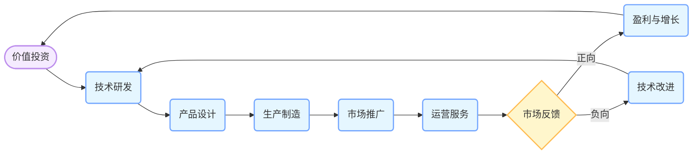

# 价值投资中的空间技术商业化前景

> 关键词：价值投资、空间技术、商业化前景、航天产业、投资回报、市场趋势、技术创新

> 摘要：本文围绕价值投资视角下的空间技术商业化前景展开深入探讨。首先介绍了价值投资与空间技术商业化的背景知识，包括目的、预期读者、文档结构和相关术语。接着阐述了空间技术商业化的核心概念及其内在联系，分析了核心算法原理与操作步骤，并通过数学模型和公式进行详细说明。在项目实战部分，给出代码实际案例并解读。然后探讨了空间技术商业化的实际应用场景，推荐了相关学习资源、开发工具和论文著作。最后总结了未来发展趋势与挑战，还设有常见问题解答和扩展阅读参考资料，旨在为投资者和相关从业者全面剖析空间技术商业化的价值与潜力。

## 1. 背景介绍 
### 1.1 目的和范围
价值投资强调寻找被低估的资产并长期持有以获取回报。而空间技术领域近年来发展迅速，从卫星通信到深空探测，技术不断突破。本研究的目的在于从价值投资的角度深入分析空间技术商业化的前景，探讨其中蕴含的投资机会和潜在风险。范围涵盖了整个空间技术产业链，包括卫星制造、发射服务、地面设备、空间应用等各个环节，以及与之相关的市场趋势、技术创新和政策环境。

### 1.2 预期读者
本文预期读者主要包括对价值投资和空间技术感兴趣的投资者，他们希望通过了解空间技术商业化的前景，为投资决策提供参考；也包括空间技术领域的从业者，如航天企业的管理人员、技术专家等，有助于他们更好地把握市场动态和商业机会；此外，还面向相关专业的学者和研究人员，为他们的学术研究提供实践案例和理论参考。

### 1.3 文档结构概述
本文首先介绍背景知识，让读者对价值投资和空间技术商业化有初步了解。接着阐述核心概念与联系，帮助读者建立起系统的认知体系。然后详细讲解核心算法原理、数学模型和公式，为后续的项目实战和分析提供理论基础。在项目实战部分，通过实际案例展示空间技术商业化的具体实现过程和代码解读。之后探讨实际应用场景，让读者了解空间技术商业化在现实中的应用情况。再推荐相关的工具和资源，为读者的进一步学习和研究提供便利。最后总结未来发展趋势与挑战，并解答常见问题，提供扩展阅读和参考资料。

### 1.4 术语表
#### 1.4.1 核心术语定义
- **价值投资**：一种投资策略，基于对资产内在价值的评估，寻找价格低于内在价值的投资标的，通过长期持有获得资产价值回归带来的收益。
- **空间技术**：探索、开发和利用太空以及地球以外天体的综合性工程技术，包括航天器设计、制造、发射、运行和应用等方面。
- **商业化**：将技术、产品或服务转化为商业价值的过程，通过市场机制实现盈利和可持续发展。
- **航天产业**：从事航天活动的经济部门，包括航天制造业、航天服务业等，是空间技术商业化的主要载体。

#### 1.4.2 相关概念解释
- **卫星通信**：利用人造地球卫星作为中继站进行通信的技术，具有覆盖范围广、通信容量大、不受地理条件限制等优点。
- **遥感技术**：通过非接触传感器获取目标物体信息的技术，在资源勘探、环境监测、气象预报等领域有广泛应用。
- **载人航天**：人类驾驶和乘坐载人航天器在太空从事各种探测、试验、研究、军事和生产等活动的技术。

#### 1.4.3 缩略词列表
- **GPS**：全球定位系统（Global Positioning System）
- **GIS**：地理信息系统（Geographic Information System）
- **RS**：遥感（Remote Sensing）
- **LEO**：低地球轨道（Low Earth Orbit）
- **GEO**：地球静止轨道（Geostationary Earth Orbit）

## 2. 核心概念与联系 

### 核心概念原理
价值投资的核心原理是基于对企业内在价值的分析。对于空间技术商业化领域，企业的内在价值取决于其技术实力、市场地位、商业模式和未来发展潜力等因素。空间技术的发展为商业化提供了技术支撑，其原理涉及多个学科领域，如物理学、天文学、电子学等。例如，卫星的轨道力学原理决定了卫星的运行轨迹和覆盖范围，通信技术原理保证了卫星与地面之间的信息传输。

空间技术商业化的过程是将空间技术转化为具有市场需求的产品或服务的过程。这需要经过技术研发、产品设计、生产制造、市场推广和运营服务等多个环节。在这个过程中，价值投资的理念贯穿始终，投资者通过评估企业在各个环节的表现来判断其投资价值。

### 架构的文本示意图
空间技术商业化的架构可以分为三个层次：技术层、产品层和市场层。

技术层是基础，包括航天器设计制造技术、发射技术、空间探测技术等。这些技术的不断创新和进步为空间技术商业化提供了可能性。

产品层是技术的具体体现，包括卫星通信服务、遥感数据产品、载人航天旅游等。这些产品满足了不同用户的需求，是商业化的核心内容。

市场层是商业化的实现环节，包括市场需求分析、市场推广、销售和运营服务等。通过市场机制，将产品转化为商业价值，实现投资回报。

### Mermaid 流程图


## 3. 核心算法原理 & 具体操作步骤 

### 核心算法原理
在价值投资中，常用的评估企业内在价值的方法是现金流折现法（DCF）。其原理是将企业未来的现金流按照一定的折现率折现到当前，得到企业的内在价值。对于空间技术商业化企业，其未来现金流主要来自于产品或服务的销售收入、成本节约和资产增值等。

现金流折现法的公式为：
$$V = \sum_{t=1}^{n} \frac{CF_t}{(1 + r)^t}$$
其中，$V$ 表示企业的内在价值，$CF_t$ 表示第 $t$ 期的现金流，$r$ 表示折现率，$n$ 表示预测期数。

### 具体操作步骤
1. **预测未来现金流**：对空间技术商业化企业的未来现金流进行预测，需要考虑市场需求、竞争状况、技术发展趋势等因素。可以通过市场调研、行业分析和企业财务报表等方式获取相关数据。
2. **确定折现率**：折现率反映了投资者对投资风险的预期。一般来说，空间技术商业化领域的投资风险较高，因此折现率也相对较高。可以参考市场上类似投资的收益率来确定折现率。
3. **计算内在价值**：将预测的未来现金流按照确定的折现率折现到当前，得到企业的内在价值。
4. **比较内在价值和市场价格**：如果企业的内在价值高于市场价格，则认为该企业被低估，具有投资价值；反之，则认为该企业被高估，不具有投资价值。

### Python 源代码实现
```python
def dcf_analysis(cash_flows, discount_rate):
    """
    现金流折现法计算企业内在价值
    :param cash_flows: 未来各期现金流列表
    :param discount_rate: 折现率
    :return: 企业内在价值
    """
    intrinsic_value = 0
    for t, cf in enumerate(cash_flows, start=1):
        present_value = cf / (1 + discount_rate) ** t
        intrinsic_value += present_value
    return intrinsic_value

# 示例数据
cash_flows = [100, 120, 150, 180, 200]  # 未来 5 年的现金流
discount_rate = 0.1  # 折现率为 10%

# 计算内在价值
intrinsic_value = dcf_analysis(cash_flows, discount_rate)
print(f"企业内在价值: {intrinsic_value}")
```

## 4. 数学模型和公式 & 详细讲解 & 举例说明 

### 数学模型和公式
除了现金流折现法，在空间技术商业化中还会用到一些其他的数学模型和公式。

#### 卫星轨道力学模型
卫星的轨道运动遵循开普勒定律和牛顿万有引力定律。开普勒第一定律指出，卫星绕地球运动的轨道是一个椭圆，地球位于椭圆的一个焦点上。开普勒第二定律指出，卫星与地球的连线在相等的时间内扫过相等的面积。开普勒第三定律指出，卫星绕地球运动的周期的平方与轨道半长轴的立方成正比。

牛顿万有引力定律公式为：
$$F = G \frac{m_1 m_2}{r^2}$$
其中，$F$ 表示两个物体之间的引力，$G$ 表示万有引力常数，$m_1$ 和 $m_2$ 分别表示两个物体的质量，$r$ 表示两个物体之间的距离。

#### 通信链路预算公式
在卫星通信中，需要进行通信链路预算，以确保通信系统的性能。通信链路预算公式为：
$$C/N_0 = EIRP + G/T - L - k - B$$
其中，$C/N_0$ 表示载波噪声功率谱密度比，$EIRP$ 表示等效全向辐射功率，$G/T$ 表示接收天线增益与系统噪声温度之比，$L$ 表示链路损耗，$k$ 表示玻尔兹曼常数，$B$ 表示信号带宽。

### 详细讲解
- **卫星轨道力学模型**：卫星的轨道参数决定了卫星的运行轨迹和覆盖范围。通过开普勒定律和牛顿万有引力定律，可以计算卫星的轨道参数，如轨道半长轴、偏心率、倾角等。这些参数对于卫星的设计、发射和运行具有重要意义。
- **通信链路预算公式**：通信链路预算是卫星通信系统设计的重要环节。通过计算载波噪声功率谱密度比，可以评估通信系统的性能。等效全向辐射功率表示发射天线的辐射能力，接收天线增益与系统噪声温度之比表示接收天线的接收能力，链路损耗包括自由空间损耗、大气损耗等。

### 举例说明
#### 卫星轨道力学模型举例
假设一颗卫星的轨道半长轴为 $a = 7000$ km，偏心率为 $e = 0.1$，倾角为 $i = 30^{\circ}$。根据开普勒定律，可以计算卫星的轨道周期：
$$T = 2\pi \sqrt{\frac{a^3}{\mu}}$$
其中，$\mu$ 表示地球的引力常数，$\mu = 3.986 \times 10^{14}$ m$^3$/s$^2$。

将 $a = 7000 \times 10^3$ m 代入公式，可得：
$$T = 2\pi \sqrt{\frac{(7000 \times 10^3)^3}{3.986 \times 10^{14}}} \approx 5800$$ s

#### 通信链路预算公式举例
假设一个卫星通信系统的等效全向辐射功率为 $EIRP = 50$ dBW，接收天线增益与系统噪声温度之比为 $G/T = 10$ dB/K，链路损耗为 $L = 200$ dB，玻尔兹曼常数为 $k = -228.6$ dBW/Hz/K，信号带宽为 $B = 10$ MHz。

将这些值代入通信链路预算公式，可得：
$$C/N_0 = 50 + 10 - 200 - (-228.6) - 10 = 78.6$$ dBHz

## 5. 项目实战：代码实际案例和详细解释说明 

### 5.1  开发环境搭建
在进行空间技术商业化项目实战时，需要搭建相应的开发环境。以下是一些常用的开发环境和工具：
- **编程语言**：Python 是一种常用的编程语言，具有丰富的科学计算库和机器学习库，适合用于空间技术数据处理和分析。
- **开发工具**：PyCharm 是一款功能强大的 Python 集成开发环境（IDE），可以提高开发效率。
- **数据处理库**：NumPy、Pandas 是常用的数据处理库，可以用于数据的存储、处理和分析。
- **可视化库**：Matplotlib、Seaborn 是常用的可视化库，可以用于数据的可视化展示。

### 5.2  源代码详细实现和代码解读
以下是一个简单的空间技术商业化项目实战案例，通过 Python 代码实现卫星轨道数据的处理和可视化。

```python
import numpy as np
import matplotlib.pyplot as plt

# 定义卫星轨道参数
a = 7000 * 1000  # 轨道半长轴（m）
e = 0.1  # 偏心率
i = np.radians(30)  # 倾角（弧度）
omega = np.radians(45)  # 近地点幅角（弧度）
Omega = np.radians(60)  # 升交点赤经（弧度）
M0 = np.radians(0)  # 平近点角（弧度）

# 定义地球引力常数
mu = 3.986 * 10**14  # m^3/s^2

# 计算轨道周期
T = 2 * np.pi * np.sqrt(a**3 / mu)

# 定义时间范围
t = np.linspace(0, T, 1000)

# 计算平近点角随时间的变化
M = M0 + 2 * np.pi * t / T

# 定义迭代函数，用于计算偏近点角
def kepler_eq(E, M, e):
    return E - e * np.sin(E) - M

def newton_raphson(E0, M, e, tol=1e-8, max_iter=100):
    E = E0
    for _ in range(max_iter):
        f = kepler_eq(E, M, e)
        df = 1 - e * np.cos(E)
        delta_E = f / df
        E -= delta_E
        if np.abs(delta_E) < tol:
            break
    return E

# 计算偏近点角
E = np.array([newton_raphson(0, m, e) for m in M])

# 计算真近点角
theta = 2 * np.arctan(np.sqrt((1 + e) / (1 - e)) * np.tan(E / 2))

# 计算卫星在轨道平面内的位置
r = a * (1 - e * np.cos(E))
x_orb = r * np.cos(theta)
y_orb = r * np.sin(theta)

# 计算卫星在惯性坐标系中的位置
R_x = np.array([[1, 0, 0], [0, np.cos(i), -np.sin(i)], [0, np.sin(i), np.cos(i)]])
R_y = np.array([[np.cos(omega), 0, np.sin(omega)], [0, 1, 0], [-np.sin(omega), 0, np.cos(omega)]])
R_z = np.array([[np.cos(Omega), -np.sin(Omega), 0], [np.sin(Omega), np.cos(Omega), 0], [0, 0, 1]])
R = np.dot(R_z, np.dot(R_x, R_y))

x = np.zeros_like(t)
y = np.zeros_like(t)
z = np.zeros_like(t)
for j in range(len(t)):
    r_orb = np.array([x_orb[j], y_orb[j], 0])
    r_inert = np.dot(R, r_orb)
    x[j] = r_inert[0]
    y[j] = r_inert[1]
    z[j] = r_inert[2]

# 可视化卫星轨道
fig = plt.figure()
ax = fig.add_subplot(111, projection='3d')
ax.plot(x, y, z)
ax.set_xlabel('X (m)')
ax.set_ylabel('Y (m)')
ax.set_zlabel('Z (m)')
ax.set_title('Satellite Orbit')
plt.show()
```

### 5.3  代码解读与分析
1. **轨道参数定义**：首先定义了卫星的轨道参数，包括轨道半长轴、偏心率、倾角、近地点幅角、升交点赤经和平近点角。
2. **轨道周期计算**：根据轨道半长轴和地球引力常数，计算卫星的轨道周期。
3. **平近点角计算**：定义时间范围，计算平近点角随时间的变化。
4. **偏近点角计算**：通过牛顿 - 拉夫逊迭代法求解开普勒方程，计算偏近点角。
5. **真近点角计算**：根据偏近点角计算真近点角。
6. **卫星位置计算**：计算卫星在轨道平面内的位置，然后通过坐标变换将其转换到惯性坐标系中。
7. **可视化**：使用 Matplotlib 库将卫星轨道可视化展示。

## 6. 实际应用场景 
### 卫星通信
卫星通信是空间技术商业化的重要应用场景之一。通过卫星通信系统，可以实现全球范围内的语音、数据和视频通信。例如，国际海事卫星组织（Inmarsat）提供的卫星通信服务，为海洋船舶、飞机和偏远地区提供了可靠的通信保障。此外，随着 5G 技术的发展，卫星通信与地面通信网络的融合将成为未来的发展趋势，为人们提供更高速、更广泛的通信服务。

### 遥感应用
遥感技术可以获取地球表面的各种信息，广泛应用于资源勘探、环境监测、气象预报等领域。例如，通过卫星遥感图像可以监测农作物生长情况、森林火灾、土地利用变化等。在资源勘探方面，遥感技术可以帮助发现矿产资源和油气资源。此外，遥感数据还可以为城市规划、灾害预警等提供决策支持。

### 导航定位
全球定位系统（GPS）是空间技术在导航定位领域的典型应用。GPS 可以为车辆、船舶、飞机等提供精确的位置信息和导航服务。除了 GPS，还有俄罗斯的格洛纳斯（GLONASS）、欧洲的伽利略（Galileo）和中国的北斗卫星导航系统（BDS）。这些卫星导航系统在交通运输、物流配送、智能交通等领域发挥着重要作用。

### 太空旅游
随着航天技术的不断发展，太空旅游逐渐成为一种新兴的商业活动。目前，已经有一些公司开展了太空旅游项目，如维珍银河（Virgin Galactic）和蓝色起源（Blue Origin）。太空旅游不仅可以满足人们对太空探索的好奇心，还可以为航天产业带来新的经济增长点。

### 空间资源开发
空间资源包括太阳能、小行星资源、月球资源等。随着航天技术的进步，空间资源开发具有广阔的前景。例如，在太空中建立太阳能电站，可以利用太阳能为地球提供清洁能源。此外，小行星资源中含有丰富的金属和稀有元素，开发小行星资源可以缓解地球资源短缺的问题。

## 7. 工具和资源推荐
### 7.1 学习资源推荐
#### 7.1.1 书籍推荐
- 《航天动力学基础》：本书系统地介绍了航天动力学的基本理论和方法，包括轨道力学、姿态动力学等内容，是学习航天技术的经典教材。
- 《卫星通信》：详细介绍了卫星通信的原理、系统组成和应用，对于了解卫星通信技术有很大帮助。
- 《遥感图像处理》：讲解了遥感图像处理的基本原理和方法，包括图像校正、分类、特征提取等内容，适合从事遥感应用的人员阅读。

#### 7.1.2 在线课程
- Coursera 上的“Space Systems Engineering”：该课程由美国斯坦福大学教授授课，介绍了空间系统工程的基本概念、设计方法和管理技术。
- edX 上的“Introduction to Satellite Communications”：课程涵盖了卫星通信的基本原理、系统设计和应用，通过视频、作业和讨论等方式进行教学。
- 中国大学 MOOC 上的“遥感原理与应用”：由国内知名高校的教授授课，系统地介绍了遥感的基本原理、数据获取和处理方法，以及遥感在各个领域的应用。

#### 7.1.3 技术博客和网站
- 航天爱好者网（https://www.space.com.cn/）：提供了丰富的航天资讯、技术文章和论坛交流平台，是航天爱好者学习和交流的好去处。
- NASA 官方网站（https://www.nasa.gov/）：美国国家航空航天局的官方网站，发布了大量的航天科研成果、图片和视频，对于了解国际航天动态有很大帮助。
- 中国航天科技集团有限公司官方网站（https://www.spacechina.com/）：发布了中国航天的最新动态、科研成果和产品信息，是了解中国航天发展的重要窗口。

### 7.2 开发工具框架推荐
#### 7.2.1 IDE和编辑器
- PyCharm：功能强大的 Python 集成开发环境，支持代码调试、自动补全、版本控制等功能，提高开发效率。
- Visual Studio Code：轻量级的代码编辑器，具有丰富的插件和扩展功能，支持多种编程语言，适合快速开发和调试。
- Jupyter Notebook：交互式的开发环境，支持代码、文本、图像等多种形式的展示，适合数据处理和分析。

#### 7.2.2 调试和性能分析工具
- Py-Spy：用于分析 Python 程序的性能，找出性能瓶颈和耗时的函数。
- cProfile：Python 内置的性能分析工具，可以统计函数调用次数、执行时间等信息。
- PDB：Python 内置的调试器，可以帮助开发者定位和解决代码中的问题。

#### 7.2.3 相关框架和库
- NumPy：用于科学计算的 Python 库，提供了高效的数组操作和数学函数。
- Pandas：用于数据处理和分析的 Python 库，提供了数据结构和数据操作方法。
- Matplotlib：用于数据可视化的 Python 库，支持多种图表类型的绘制。
- Astropy：用于天文学和航天领域的 Python 库，提供了天体物理计算、天文数据处理等功能。

### 7.3 相关论文著作推荐
#### 7.3.1 经典论文
- “Keplerian Orbits and the Two-Body Problem”：该论文详细介绍了开普勒轨道和二体问题的基本理论和求解方法，是轨道力学领域的经典文献。
- “A Review of Satellite Communication Systems”：对卫星通信系统的发展历程、技术原理和应用进行了全面的综述，对于了解卫星通信技术有重要参考价值。
- “Remote Sensing Image Classification: A Review”：对遥感图像分类的方法和技术进行了系统的总结和分析，为遥感图像处理提供了理论支持。

#### 7.3.2 最新研究成果
- 关注《Acta Astronautica》《IEEE Transactions on Aerospace and Electronic Systems》等国际知名期刊，这些期刊发表了空间技术领域的最新研究成果。
- 参加国际航天学术会议，如国际宇航大会（IAC）、美国航空航天学会（AIAA）会议等，了解最新的研究动态和前沿技术。

#### 7.3.3 应用案例分析
- 《Space Commercialization: Case Studies and Best Practices》：本书通过实际案例分析，介绍了空间技术商业化的成功经验和最佳实践，对于从事空间技术商业化的企业和投资者有很大的借鉴意义。
- 关注国内外航天企业的官方网站和年报，了解它们在空间技术商业化方面的实践和成果。

## 8. 总结：未来发展趋势与挑战
### 未来发展趋势
- **技术创新加速**：随着科技的不断进步，空间技术将迎来更多的创新和突破。例如，新型航天器的研发、高效能源技术的应用、人工智能在航天领域的应用等，将推动空间技术商业化的发展。
- **市场需求增长**：随着全球经济的发展和人们生活水平的提高，对空间技术产品和服务的需求将不断增长。例如，卫星通信的带宽需求、遥感数据的应用需求、太空旅游的市场需求等，将为空间技术商业化带来广阔的市场空间。
- **产业融合加深**：空间技术与其他产业的融合将越来越深入。例如，卫星通信与 5G 技术的融合、遥感技术与物联网的融合、太空旅游与文化旅游的融合等，将创造出更多的商业机会和新业态。
- **国际合作加强**：空间技术的发展需要全球范围内的合作。未来，各国将加强在空间技术研发、应用和商业化方面的合作，共同推动空间技术的发展和应用。

### 挑战
- **技术难题**：空间技术领域仍然存在一些技术难题，如深空探测技术、太空资源开发技术、航天器的可靠性和安全性等。解决这些技术难题需要大量的研发投入和技术创新。
- **投资风险**：空间技术商业化项目通常需要大量的资金投入，而且投资回报周期较长。此外，空间技术领域的市场竞争激烈，技术更新换代快，投资风险较高。
- **政策法规**：空间技术商业化涉及到国家安全、国际法律等多个方面的问题。目前，相关的政策法规还不够完善，需要进一步加强政策法规的制定和完善，为空间技术商业化提供良好的政策环境。
- **人才短缺**：空间技术领域需要大量的高素质人才，包括航天工程师、科学家、管理人员等。目前，人才短缺是制约空间技术商业化发展的重要因素之一。

## 9. 附录：常见问题与解答
### 问题 1：空间技术商业化的投资回报率如何？
空间技术商业化的投资回报率因项目而异。一般来说，早期的投资回报率可能较低，因为需要大量的研发投入和市场培育。但随着技术的成熟和市场的扩大，投资回报率可能会逐渐提高。例如，一些成功的卫星通信项目和遥感应用项目，在运营一段时间后可以获得较高的投资回报。

### 问题 2：空间技术商业化面临哪些风险？
空间技术商业化面临的风险主要包括技术风险、市场风险、投资风险、政策法规风险等。技术风险是指技术研发失败或技术更新换代快导致的风险；市场风险是指市场需求不足或市场竞争激烈导致的风险；投资风险是指投资回报周期长、投资回报率低等风险；政策法规风险是指政策法规变化或政策法规不完善导致的风险。

### 问题 3：如何评估空间技术商业化项目的投资价值？
可以从技术实力、市场需求、商业模式、团队能力、财务状况等方面评估空间技术商业化项目的投资价值。技术实力是指项目的技术水平和创新能力；市场需求是指项目的产品或服务是否有市场需求；商业模式是指项目的盈利模式和运营模式；团队能力是指项目团队的技术能力、管理能力和市场开拓能力；财务状况是指项目的盈利能力、偿债能力和现金流状况等。

### 问题 4：普通人如何参与空间技术商业化投资？
普通人可以通过购买航天企业的股票、投资航天产业基金等方式参与空间技术商业化投资。此外，还可以关注一些空间技术创新项目的众筹平台，参与项目的投资。但需要注意的是，空间技术商业化投资风险较高，需要谨慎投资。

## 10. 扩展阅读 & 参考资料
### 扩展阅读
- 《星际穿越》：一部关于太空探索的科幻电影，通过精彩的剧情和视觉效果，展示了太空的神秘和魅力，激发人们对空间技术的兴趣。
- 《三体》：一部著名的科幻小说，探讨了人类与外星文明的接触和宇宙的奥秘，引发人们对空间技术发展的思考。

### 参考资料
- 相关的航天行业报告和统计数据，如《中国航天年鉴》《全球航天市场报告》等。
- 国内外航天企业的官方网站和年报，如中国航天科技集团有限公司、美国太空探索技术公司（SpaceX）等。
- 学术期刊和会议论文，如《中国空间科学学报》《国际宇航大会论文集》等。