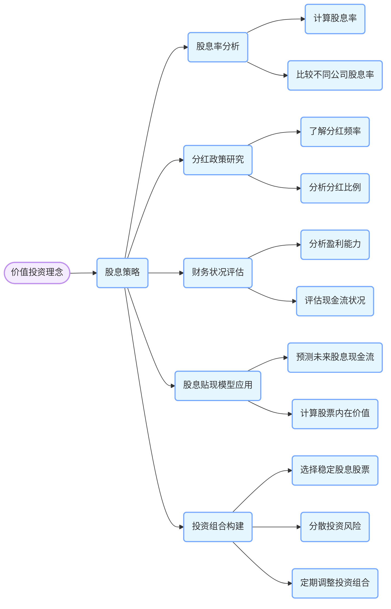

# 价值投资中的股息策略

> 关键词：价值投资、股息策略、股息率、现金流、投资组合

> 摘要：本文围绕价值投资中的股息策略展开深入探讨。首先介绍了价值投资及股息策略的背景知识，包括其目的、适用读者、文档结构和相关术语。接着阐述了股息策略的核心概念、原理与架构，通过 Mermaid 流程图呈现其逻辑关系。详细讲解了股息策略的核心算法原理，并用 Python 代码进行实现。深入分析了相关的数学模型和公式，并举例说明。通过项目实战，展示了股息策略在实际投资中的应用，包括开发环境搭建、源代码实现与解读。探讨了股息策略的实际应用场景，推荐了相关的学习资源、开发工具框架和论文著作。最后总结了股息策略的未来发展趋势与挑战，还提供了常见问题解答和扩展阅读参考资料，旨在帮助投资者深入理解并运用股息策略进行价值投资。

## 1. 背景介绍 
### 1.1 目的和范围
价值投资作为一种长期的投资理念，旨在寻找被市场低估的资产，并通过长期持有来获取资产价值回归所带来的收益。股息策略是价值投资中的重要组成部分，它主要关注公司的股息分配情况，通过投资那些具有稳定股息支付历史和较高股息率的公司，投资者不仅可以获得稳定的现金流，还能在一定程度上分享公司的成长收益。

本文的范围涵盖了股息策略的基本概念、原理、算法、数学模型，以及如何在实际投资中应用股息策略，同时提供相关的学习资源和工具推荐，帮助投资者更好地理解和运用股息策略进行价值投资。

### 1.2 预期读者
本文预期读者包括对价值投资感兴趣的个人投资者、金融从业者、投资研究人员以及相关专业的学生。无论你是投资新手，希望了解股息策略的基本概念和应用方法，还是有一定投资经验的专业人士，希望深入研究股息策略的原理和实践，本文都将为你提供有价值的信息和参考。

### 1.3 文档结构概述
本文将按照以下结构进行组织：首先介绍价值投资和股息策略的背景知识，包括目的、读者、文档结构和术语表；接着阐述股息策略的核心概念、原理与架构，并通过 Mermaid 流程图展示其逻辑关系；然后详细讲解股息策略的核心算法原理，并用 Python 代码进行实现；再深入分析相关的数学模型和公式，并举例说明；通过项目实战，展示股息策略在实际投资中的应用，包括开发环境搭建、源代码实现与解读；探讨股息策略的实际应用场景；推荐相关的学习资源、开发工具框架和论文著作；最后总结股息策略的未来发展趋势与挑战，提供常见问题解答和扩展阅读参考资料。

### 1.4 术语表
#### 1.4.1 核心术语定义
- **价值投资**：一种投资理念，强调通过分析公司的基本面，寻找被市场低估的资产，并长期持有，以获取资产价值回归所带来的收益。
- **股息**：公司按照一定的比例向股东分配的利润，通常以现金或股票的形式发放。
- **股息率**：股息与股票价格的比率，反映了投资者从股息中获得的收益率。计算公式为：$股息率 = \frac{每股股息}{股票价格} \times 100\%$。
- **股息贴现模型（DDM）**：一种股票估值模型，基于股票的未来股息现金流来计算股票的内在价值。

#### 1.4.2 相关概念解释
- **现金流**：企业在一定时期内现金的流入和流出情况，是衡量企业财务健康状况的重要指标。股息是投资者从公司获得的现金流入之一。
- **分红政策**：公司关于股息分配的政策，包括分红的频率、比例和方式等。不同的公司有不同的分红政策，这会影响投资者的股息收益。
- **留存收益**：公司在支付股息后剩余的利润，用于再投资和公司的发展。留存收益的多少会影响公司的成长潜力和未来的股息分配。

#### 1.4.3 缩略词列表
- **DDM**：股息贴现模型（Dividend Discount Model）

## 2. 核心概念与联系 

### 核心概念原理
股息策略的核心原理基于价值投资的理念，即寻找那些具有稳定盈利和良好现金流的公司，这些公司通常会将一部分利润以股息的形式分配给股东。通过投资这些公司，投资者可以获得稳定的股息收入，同时还能享受公司价值增长带来的资本利得。

股息率是股息策略中的一个重要指标，它反映了投资者从股息中获得的收益率。一般来说，股息率越高，说明投资者从股息中获得的收益越高。但是，高股息率并不一定意味着是好的投资机会，还需要考虑公司的财务状况、盈利能力、分红政策等因素。

股息贴现模型（DDM）是一种常用的股票估值模型，它基于股票的未来股息现金流来计算股票的内在价值。该模型认为，股票的价值等于其未来所有股息的现值之和。根据不同的假设条件，DDM 可以分为零增长模型、固定增长模型和多元增长模型等。

### 架构的文本示意图
```plaintext
价值投资理念
|
|-- 股息策略
|   |-- 股息率分析
|   |   |-- 计算股息率
|   |   |-- 比较不同公司的股息率
|   |
|   |-- 分红政策研究
|   |   |-- 了解公司的分红频率
|   |   |-- 分析公司的分红比例
|   |
|   |-- 财务状况评估
|   |   |-- 分析公司的盈利能力
|   |   |-- 评估公司的现金流状况
|   |
|   |-- 股息贴现模型应用
|       |-- 预测未来股息现金流
|       |-- 计算股票的内在价值
|
|-- 投资组合构建
|   |-- 选择具有稳定股息的股票
|   |-- 分散投资风险
|   |-- 定期调整投资组合
```

### Mermaid 流程图


## 3. 核心算法原理 & 具体操作步骤 

### 核心算法原理
股息策略的核心算法主要包括股息率的计算和股息贴现模型的应用。

#### 股息率计算
股息率的计算公式为：$股息率 = \frac{每股股息}{股票价格} \times 100\%$。通过计算不同公司的股息率，投资者可以比较它们的股息收益情况，从而选择具有较高股息率的公司进行投资。

#### 股息贴现模型（DDM）
股息贴现模型基于股票的未来股息现金流来计算股票的内在价值。下面介绍两种常见的 DDM 模型：

##### 零增长模型
假设股票的股息保持不变，即每年的股息都为 $D$。则股票的内在价值 $V$ 可以通过以下公式计算：
$$V = \frac{D}{r}$$
其中，$r$ 为投资者要求的必要收益率。

##### 固定增长模型
假设股票的股息以固定的增长率 $g$ 增长，则股票的内在价值 $V$ 可以通过以下公式计算：
$$V = \frac{D_1}{r - g}$$
其中，$D_1$ 为下一期的股息，$r$ 为投资者要求的必要收益率，$g$ 为股息的固定增长率。

### 具体操作步骤
1. **数据收集**：收集公司的财务报表、股息分配记录、股票价格等数据。
2. **计算股息率**：根据收集到的数据，计算不同公司的股息率。
3. **分析分红政策**：了解公司的分红频率、分红比例等分红政策，评估公司的股息稳定性。
4. **评估财务状况**：分析公司的盈利能力、现金流状况等财务指标，评估公司的财务健康状况。
5. **应用股息贴现模型**：根据公司的股息分配情况和预期增长率，选择合适的股息贴现模型，计算股票的内在价值。
6. **构建投资组合**：根据股息率、内在价值等指标，选择具有稳定股息和较高投资价值的股票，构建投资组合。
7. **定期调整投资组合**：根据市场情况和公司的基本面变化，定期调整投资组合，以保持投资组合的稳定性和盈利能力。

### Python 源代码实现
```python
# 股息率计算函数
def calculate_dividend_yield(dividend_per_share, stock_price):
    """
    计算股息率
    :param dividend_per_share: 每股股息
    :param stock_price: 股票价格
    :return: 股息率
    """
    return (dividend_per_share / stock_price) * 100

# 零增长模型计算股票内在价值函数
def zero_growth_ddm(dividend, required_return):
    """
    零增长模型计算股票内在价值
    :param dividend: 每股股息
    :param required_return: 投资者要求的必要收益率
    :return: 股票内在价值
    """
    return dividend / required_return

# 固定增长模型计算股票内在价值函数
def constant_growth_ddm(dividend_next_period, required_return, growth_rate):
    """
    固定增长模型计算股票内在价值
    :param dividend_next_period: 下一期的股息
    :param required_return: 投资者要求的必要收益率
    :param growth_rate: 股息的固定增长率
    :return: 股票内在价值
    """
    if required_return <= growth_rate:
        raise ValueError("必要收益率必须大于股息增长率")
    return dividend_next_period / (required_return - growth_rate)

# 示例数据
dividend_per_share = 2
stock_price = 50
dividend = 2
required_return = 0.1
dividend_next_period = 2.2
growth_rate = 0.05

# 计算股息率
dividend_yield = calculate_dividend_yield(dividend_per_share, stock_price)
print(f"股息率: {dividend_yield}%")

# 零增长模型计算股票内在价值
intrinsic_value_zero_growth = zero_growth_ddm(dividend, required_return)
print(f"零增长模型下股票内在价值: {intrinsic_value_zero_growth}")

# 固定增长模型计算股票内在价值
intrinsic_value_constant_growth = constant_growth_ddm(dividend_next_period, required_return, growth_rate)
print(f"固定增长模型下股票内在价值: {intrinsic_value_constant_growth}")
```

## 4. 数学模型和公式 & 详细讲解 & 举例说明 

### 股息率公式
股息率的计算公式为：
$$股息率 = \frac{每股股息}{股票价格} \times 100\%$$

#### 详细讲解
股息率反映了投资者从股息中获得的收益率。每股股息是公司向股东分配的每股利润，股票价格是当前股票的市场价格。通过计算股息率，投资者可以比较不同公司的股息收益情况，从而选择具有较高股息率的公司进行投资。

#### 举例说明
假设公司 A 的每股股息为 2 元，股票价格为 50 元，则公司 A 的股息率为：
$$股息率 = \frac{2}{50} \times 100\% = 4\%$$

### 股息贴现模型（DDM）公式

#### 零增长模型
零增长模型假设股票的股息保持不变，即每年的股息都为 $D$。则股票的内在价值 $V$ 可以通过以下公式计算：
$$V = \frac{D}{r}$$
其中，$r$ 为投资者要求的必要收益率。

##### 详细讲解
零增长模型适用于那些股息分配稳定、没有增长预期的公司。该模型认为，股票的价值等于其未来所有股息的现值之和。由于股息保持不变，因此可以将其看作是一个永续年金，其现值可以通过永续年金的计算公式来计算。

##### 举例说明
假设公司 B 的每股股息为 3 元，投资者要求的必要收益率为 10%，则公司 B 的股票内在价值为：
$$V = \frac{3}{0.1} = 30 \text{ 元}$$

#### 固定增长模型
固定增长模型假设股票的股息以固定的增长率 $g$ 增长，则股票的内在价值 $V$ 可以通过以下公式计算：
$$V = \frac{D_1}{r - g}$$
其中，$D_1$ 为下一期的股息，$r$ 为投资者要求的必要收益率，$g$ 为股息的固定增长率。

##### 详细讲解
固定增长模型适用于那些股息具有稳定增长预期的公司。该模型认为，股票的价值等于其未来所有股息的现值之和。由于股息以固定的增长率增长，因此可以将其看作是一个增长型永续年金，其现值可以通过增长型永续年金的计算公式来计算。

##### 举例说明
假设公司 C 下一期的股息为 2.2 元，股息的固定增长率为 5%，投资者要求的必要收益率为 10%，则公司 C 的股票内在价值为：
$$V = \frac{2.2}{0.1 - 0.05} = 44 \text{ 元}$$

## 5. 项目实战：代码实际案例和详细解释说明 

### 5.1  开发环境搭建
为了实现股息策略的代码，我们需要搭建一个 Python 开发环境。以下是具体的步骤：

1. **安装 Python**：从 Python 官方网站（https://www.python.org/downloads/）下载并安装 Python 3.x 版本。
2. **安装开发工具**：推荐使用 PyCharm 或 Jupyter Notebook 作为开发工具。PyCharm 是一个功能强大的 Python 集成开发环境（IDE），适合进行大型项目的开发；Jupyter Notebook 是一个交互式的开发环境，适合进行数据探索和代码演示。
3. **安装必要的库**：在本项目中，我们需要使用 `pandas`、`numpy` 等库来进行数据处理和分析。可以使用以下命令来安装这些库：
```sh
pip install pandas numpy
```

### 5.2  源代码详细实现和代码解读
以下是一个完整的股息策略代码示例，包括数据收集、股息率计算、股息贴现模型应用和投资组合构建等步骤：

```python
import pandas as pd
import numpy as np

# 模拟收集的公司数据
data = {
    '公司名称': ['公司 A', '公司 B', '公司 C', '公司 D'],
    '每股股息': [2, 3, 2.2, 1.5],
    '股票价格': [50, 60, 40, 30],
    '预期股息增长率': [0.03, 0.02, 0.05, 0.04],
    '必要收益率': [0.1, 0.1, 0.1, 0.1]
}

# 创建 DataFrame
df = pd.DataFrame(data)

# 计算股息率
df['股息率'] = (df['每股股息'] / df['股票价格']) * 100

# 定义股息贴现模型函数
def constant_growth_ddm(dividend_next_period, required_return, growth_rate):
    if required_return <= growth_rate:
        raise ValueError("必要收益率必须大于股息增长率")
    return dividend_next_period / (required_return - growth_rate)

# 计算下一期股息
df['下一期股息'] = df['每股股息'] * (1 + df['预期股息增长率'])

# 计算股票内在价值
df['内在价值'] = df.apply(lambda row: constant_growth_ddm(row['下一期股息'], row['必要收益率'], row['预期股息增长率']), axis=1)

# 计算估值比率（内在价值 / 股票价格）
df['估值比率'] = df['内在价值'] / df['股票价格']

# 筛选具有较高股息率和较低估值比率的股票
selected_stocks = df[(df['股息率'] > 3) & (df['估值比率'] > 1)]

# 构建投资组合
total_investment = 10000
weights = selected_stocks['股息率'] / selected_stocks['股息率'].sum()
selected_stocks['投资金额'] = weights * total_investment

# 输出结果
print("筛选后的股票：")
print(selected_stocks[['公司名称', '股息率', '内在价值', '估值比率', '投资金额']])
```

### 5.3  代码解读与分析
1. **数据收集**：使用字典 `data` 模拟收集的公司数据，包括每股股息、股票价格、预期股息增长率和必要收益率等信息。然后使用 `pandas` 的 `DataFrame` 来存储这些数据。
2. **股息率计算**：通过将每股股息除以股票价格，并乘以 100，计算出每家公司的股息率，并将结果存储在新的列 `股息率` 中。
3. **股息贴现模型应用**：定义了 `constant_growth_ddm` 函数来计算股票的内在价值。使用 `apply` 方法将该函数应用到每一行数据上，计算出每家公司的内在价值，并将结果存储在新的列 `内在价值` 中。
4. **估值比率计算**：计算内在价值与股票价格的比率，即估值比率，并将结果存储在新的列 `估值比率` 中。
5. **股票筛选**：筛选出股息率大于 3% 且估值比率大于 1 的股票，作为具有较高投资价值的股票。
6. **投资组合构建**：假设总投资金额为 10000 元，根据筛选出的股票的股息率计算投资权重，并计算出每家公司的投资金额，存储在新的列 `投资金额` 中。
7. **结果输出**：输出筛选后的股票信息，包括公司名称、股息率、内在价值、估值比率和投资金额。

## 6. 实际应用场景 
### 长期投资
股息策略非常适合长期投资者。对于那些追求稳定现金流和长期资本增值的投资者来说，投资具有稳定股息支付历史和较高股息率的公司是一个不错的选择。通过长期持有这些公司的股票，投资者可以获得稳定的股息收入，同时还能享受公司价值增长带来的资本利得。

### 退休规划
对于即将退休或已经退休的投资者来说，股息策略可以提供稳定的现金流，满足他们的生活需求。退休投资者通常更注重投资的安全性和稳定性，而具有稳定股息支付的公司股票可以在一定程度上满足这些需求。

### 资产配置
股息策略可以作为资产配置的一部分，与其他投资策略相结合，降低投资组合的风险。通过将一部分资金投资于具有稳定股息的股票，可以在市场波动时提供一定的缓冲，减少投资组合的波动性。

### 价值发现
股息策略可以帮助投资者发现被市场低估的公司。那些具有较高股息率但股价相对较低的公司可能被市场忽视，通过深入研究这些公司的基本面，投资者可能会发现它们的投资价值，从而获得超额收益。

## 7. 工具和资源推荐
### 7.1 学习资源推荐
#### 7.1.1 书籍推荐
- 《聪明的投资者》（The Intelligent Investor）：本杰明·格雷厄姆（Benjamin Graham）的经典著作，是价值投资领域的必读之书，书中详细介绍了价值投资的理念和方法，包括股息策略的相关内容。
- 《巴菲特致股东的信》（Letters to Shareholders of Berkshire Hathaway）：沃伦·巴菲特（Warren Buffett）每年写给股东的信，包含了他的投资哲学、选股标准和对股息策略的看法，是学习价值投资的宝贵资料。
- 《怎样选择成长股》（Common Stocks and Uncommon Profits）：菲利普·费雪（Philip Fisher）的著作，介绍了如何寻找具有成长潜力的公司，以及如何评估公司的股息政策和投资价值。

#### 7.1.2 在线课程
- Coursera 上的“投资学原理”（Principles of Investing）课程：由知名教授授课，系统介绍了投资学的基本原理和方法，包括价值投资和股息策略的相关内容。
- Udemy 上的“价值投资实战课程”（Value Investing Practical Course）：通过实际案例讲解价值投资的方法和技巧，包括如何运用股息策略进行股票筛选和投资组合构建。

#### 7.1.3 技术博客和网站
- Seeking Alpha（https://seekingalpha.com/）：一个专业的投资研究网站，提供大量的股票分析、投资策略和市场评论，包括对股息策略的深入分析和讨论。
- Motley Fool（https://www.fool.com/）：一个知名的投资教育网站，提供投资建议、股票分析和市场动态，帮助投资者学习和实践价值投资和股息策略。

### 7.2 开发工具框架推荐
#### 7.2.1 IDE和编辑器
- PyCharm：一个功能强大的 Python 集成开发环境（IDE），提供代码编辑、调试、版本控制等功能，适合进行大型项目的开发。
- Jupyter Notebook：一个交互式的开发环境，适合进行数据探索、代码演示和模型验证，方便用户快速验证股息策略的代码实现。

#### 7.2.2 调试和性能分析工具
- `pdb`：Python 自带的调试工具，可以帮助用户定位代码中的错误和问题。
- `cProfile`：Python 自带的性能分析工具，可以帮助用户分析代码的性能瓶颈，优化股息策略的代码实现。

#### 7.2.3 相关框架和库
- `pandas`：一个强大的数据处理和分析库，提供了丰富的数据结构和数据处理方法，方便用户进行股息数据的收集、整理和分析。
- `numpy`：一个用于科学计算的库，提供了高效的数组操作和数学函数，用于股息策略中的数值计算。

### 7.3 相关论文著作推荐
#### 7.3.1 经典论文
- Gordon, M. J., & Shapiro, E. (1956). Capital equipment analysis: The required rate of profit. Management science, 3(1), 102-110. 该论文提出了股息贴现模型（DDM）的基本思想，为股息策略的理论发展奠定了基础。
- Fama, E. F., & French, K. R. (1998). Value versus growth: The international evidence. The Journal of Finance, 53(6), 1975-1999. 该论文对价值投资和成长投资进行了深入研究，探讨了股息策略在不同市场环境下的有效性。

#### 7.3.2 最新研究成果
- Asness, C. S., Moskowitz, T. J., & Pedersen, L. H. (2013). Value and momentum everywhere. The Journal of Finance, 68(3), 929-985. 该论文研究了价值和动量策略在全球市场的表现，为股息策略的应用提供了新的视角。
- Arnott, R. D., & Asness, C. S. (2003). Surprise! Higher dividends = higher earnings growth. Financial Analysts Journal, 59(1), 70-87. 该论文探讨了股息与公司盈利增长之间的关系，对股息策略的理论基础进行了进一步的拓展。

#### 7.3.3 应用案例分析
- Damodaran, A. (2012). Investment valuation: Tools and techniques for determining the value of any asset. John Wiley & Sons. 该著作通过大量的实际案例，介绍了如何运用股息策略和其他估值方法进行股票投资分析和决策。

## 8. 总结：未来发展趋势与挑战
### 未来发展趋势
- **数字化和智能化**：随着科技的不断发展，股息策略的应用将越来越数字化和智能化。投资者可以利用大数据、人工智能等技术，更快速、准确地收集和分析股息数据，筛选出具有投资价值的股票。同时，智能投资顾问也将逐渐普及，为投资者提供个性化的股息策略建议。
- **全球投资**：随着全球经济的一体化，投资者将越来越关注全球市场的股息投资机会。不同国家和地区的公司具有不同的股息政策和投资价值，投资者可以通过全球投资来分散风险，获取更高的收益。
- **可持续投资**：越来越多的投资者开始关注公司的社会责任和可持续发展，将股息策略与可持续投资相结合。具有良好环境、社会和治理（ESG）表现的公司通常具有更稳定的经营业绩和股息分配，未来股息策略将更多地考虑 ESG 因素。

### 挑战
- **市场不确定性**：股票市场受到宏观经济、政策、行业竞争等多种因素的影响，具有较高的不确定性。股息政策也可能会随着公司的经营状况和市场环境的变化而调整，投资者需要面对股息减少或取消的风险。
- **数据质量和准确性**：股息策略的应用依赖于准确的股息数据和公司财务数据。然而，数据的质量和准确性可能存在问题，如数据延迟、错误或不完整等，这可能会影响投资者的决策。
- **模型局限性**：股息贴现模型等数学模型是基于一定的假设条件建立的，实际市场情况可能与假设条件不符，导致模型的预测结果存在偏差。投资者需要认识到模型的局限性，结合其他方法进行综合分析。

## 9. 附录：常见问题与解答
### 1. 高股息率的股票一定是好的投资吗？
不一定。高股息率可能是由于公司股价下跌导致的，而公司股价下跌可能是由于公司经营业绩不佳、财务状况恶化等原因引起的。因此，在选择高股息率的股票时，投资者还需要考虑公司的基本面情况，如盈利能力、现金流状况、分红政策等。

### 2. 股息贴现模型的假设条件有哪些局限性？
股息贴现模型的假设条件包括股息的增长模式（如零增长、固定增长等）、必要收益率的稳定性等。在实际市场中，股息的增长模式可能是复杂多变的，必要收益率也会受到市场利率、风险偏好等因素的影响。因此，股息贴现模型的预测结果可能存在一定的偏差。

### 3. 如何选择合适的必要收益率？
必要收益率是投资者要求的最低收益率，它反映了投资者对投资风险的补偿要求。选择合适的必要收益率需要考虑多种因素，如市场利率、投资风险、通货膨胀率等。一般来说，投资者可以参考市场上类似投资的收益率水平，并根据自己的风险偏好进行调整。

### 4. 股息策略适合短期投资吗？
股息策略更适合长期投资。因为股息策略的核心是通过长期持有具有稳定股息支付的股票，获得稳定的现金流和资本增值。短期投资可能会受到市场波动的影响，难以实现股息策略的预期收益。

### 5. 如何评估公司的分红政策是否稳定？
可以从以下几个方面评估公司的分红政策是否稳定：
- **分红历史**：查看公司过去的分红记录，了解其分红的频率和金额是否稳定。
- **盈利稳定性**：分析公司的盈利能力，了解其是否具有稳定的盈利来源，以支持持续的股息分配。
- **现金流状况**：评估公司的现金流状况，确保公司有足够的现金来支付股息。
- **分红政策声明**：查看公司的公告和年报，了解其对分红政策的明确声明和规划。

## 10. 扩展阅读 & 参考资料
### 扩展阅读
- 《财务报表分析与证券定价》（Financial Statement Analysis and Security Valuation）：介绍了如何通过财务报表分析来评估公司的投资价值，包括对股息政策的分析。
- 《投资策略实战分析》（Investment Strategy: A Practical Approach）：通过实际案例分析，介绍了各种投资策略的应用和实践，包括股息策略。

### 参考资料
- 本杰明·格雷厄姆（Benjamin Graham）. 《聪明的投资者》（The Intelligent Investor）. 机械工业出版社.
- 沃伦·巴菲特（Warren Buffett）. 《巴菲特致股东的信》（Letters to Shareholders of Berkshire Hathaway）. 机械工业出版社.
- 菲利普·费雪（Philip Fisher）. 《怎样选择成长股》（Common Stocks and Uncommon Profits）. 中信出版社.
- Gordon, M. J., & Shapiro, E. (1956). Capital equipment analysis: The required rate of profit. Management science, 3(1), 102-110.
- Fama, E. F., & French, K. R. (1998). Value versus growth: The international evidence. The Journal of Finance, 53(6), 1975-1999.
- Asness, C. S., Moskowitz, T. J., & Pedersen, L. H. (2013). Value and momentum everywhere. The Journal of Finance, 68(3), 929-985.
- Arnott, R. D., & Asness, C. S. (2003). Surprise! Higher dividends = higher earnings growth. Financial Analysts Journal, 59(1), 70-87.
- Damodaran, A. (2012). Investment valuation: Tools and techniques for determining the value of any asset. John Wiley & Sons.