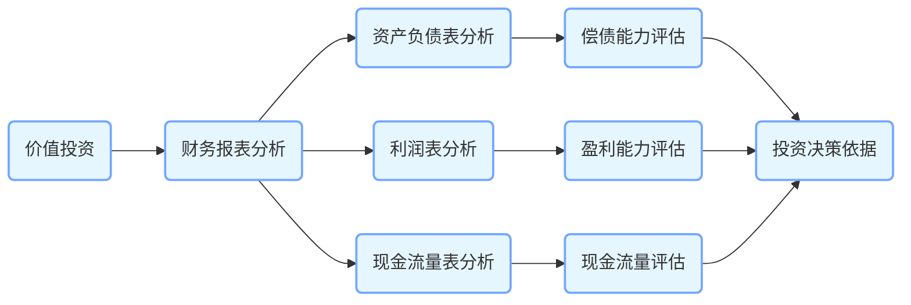

# 价值投资中的财务报表分析技巧

> 关键词：价值投资、财务报表分析、财务指标、投资决策、盈利能力、偿债能力、营运能力

> 摘要：本文聚焦于价值投资中的财务报表分析技巧。首先介绍了财务报表分析在价值投资中的重要性及相关背景知识，包括目的、预期读者等内容。接着深入阐述了财务报表分析的核心概念与联系，通过文本示意图和 Mermaid 流程图进行清晰展示。详细讲解了核心算法原理及具体操作步骤，并结合 Python 源代码进行说明。同时，给出了相关数学模型和公式，辅以举例进行详细讲解。在项目实战部分，通过实际案例对代码进行详细解释。还探讨了财务报表分析在不同场景下的实际应用，推荐了相关的学习资源、开发工具框架以及论文著作。最后总结了未来发展趋势与挑战，对常见问题进行解答并提供扩展阅读与参考资料，旨在帮助投资者掌握有效的财务报表分析技巧，做出更明智的价值投资决策。

## 1. 背景介绍 
### 1.1 目的和范围
价值投资强调通过对企业内在价值的评估来进行投资决策，而财务报表是反映企业财务状况和经营成果的重要依据。本文的目的在于系统地介绍在价值投资中如何运用财务报表分析技巧，帮助投资者深入了解企业的真实情况，从而筛选出具有投资价值的企业。范围涵盖了资产负债表、利润表和现金流量表三大主要财务报表的分析方法，以及相关财务指标的计算和解读。

### 1.2 预期读者
本文预期读者主要包括对价值投资有兴趣的个人投资者、金融从业者、财务分析师以及相关专业的学生。无论您是初学者还是有一定投资经验的人士，都可以从本文中获取有价值的信息，提升自己的财务报表分析能力和价值投资水平。

### 1.3 文档结构概述
本文将按照以下结构进行阐述：首先介绍财务报表分析的背景知识，包括目的、读者和术语表等；接着讲解核心概念与联系，通过示意图和流程图展示财务报表分析的原理和架构；然后详细介绍核心算法原理和具体操作步骤，结合 Python 代码进行说明；再给出相关数学模型和公式，并举例讲解；之后通过项目实战展示代码实际案例和详细解释；探讨实际应用场景；推荐相关工具和资源；总结未来发展趋势与挑战；解答常见问题并提供扩展阅读与参考资料。

### 1.4 术语表
#### 1.4.1 核心术语定义
- **价值投资**：一种投资策略，基于对企业内在价值的评估，寻找被市场低估的股票进行投资，期望在长期内获得超过市场平均水平的回报。
- **财务报表**：企业定期编制的反映其财务状况、经营成果和现金流量的书面文件，主要包括资产负债表、利润表和现金流量表。
- **财务指标**：用于衡量企业财务状况和经营绩效的一系列数据，如盈利能力指标（净利润率、净资产收益率等）、偿债能力指标（资产负债率、流动比率等）和营运能力指标（存货周转率、应收账款周转率等）。

#### 1.4.2 相关概念解释
- **资产负债表**：反映企业在某一特定日期财务状况的报表，展示了企业的资产、负债和所有者权益的情况。资产是企业拥有或控制的经济资源，负债是企业的债务，所有者权益是企业所有者对企业净资产的所有权。
- **利润表**：反映企业在一定会计期间经营成果的报表，展示了企业的收入、成本、费用和利润的情况。收入是企业在日常活动中形成的经济利益的总流入，成本和费用是企业为取得收入而发生的经济利益的总流出，利润是收入减去成本和费用后的余额。
- **现金流量表**：反映企业在一定会计期间现金和现金等价物流入和流出的报表，展示了企业的经营活动、投资活动和筹资活动的现金流量情况。现金流量是企业现金的实际收支情况，对于评估企业的资金流动性和财务健康状况具有重要意义。

#### 1.4.3 缩略词列表
- **ROE**：净资产收益率（Return on Equity）
- **ROA**：总资产收益率（Return on Assets）
- **EPS**：每股收益（Earnings Per Share）
- **PE**：市盈率（Price - Earnings Ratio）
- **PB**：市净率（Price - Book Ratio）

## 2. 核心概念与联系 
### 核心概念原理
财务报表分析的核心是通过对资产负债表、利润表和现金流量表的分析，评估企业的财务状况、经营成果和现金流量情况，从而判断企业的内在价值。资产负债表反映了企业的财务实力和偿债能力，利润表反映了企业的盈利能力和经营效率，现金流量表反映了企业的资金流动性和现金创造能力。这三张报表相互关联、相互印证，共同构成了企业财务信息的完整体系。

例如，企业的盈利能力会影响其资产的增长和负债的偿还能力，而资产的规模和质量又会影响企业的经营效率和盈利能力。同时，企业的现金流量情况也会对其资产、负债和利润产生重要影响。如果企业的经营活动现金流量不足，可能会导致其无法按时偿还债务，影响其信用评级，进而影响其盈利能力和资产价值。

### 架构的文本示意图
```plaintext
               价值投资
                   |
                   |
         财务报表分析
         /          |          \
  资产负债表分析  利润表分析  现金流量表分析
         |          |          |
         |          |          |
  偿债能力评估  盈利能力评估  现金流量评估
         |          |          |
         |          |          |
  投资决策依据  投资决策依据  投资决策依据
```

### Mermaid 流程图


## 3. 核心算法原理 & 具体操作步骤 
### 核心算法原理
财务报表分析主要通过计算和分析各种财务指标来评估企业的财务状况和经营绩效。这些财务指标可以分为盈利能力指标、偿债能力指标和营运能力指标等几类。

#### 盈利能力指标
- **净利润率**：反映企业每单位销售收入中净利润的比例，计算公式为：净利润率 = 净利润 / 营业收入 × 100%。净利润率越高，说明企业的盈利能力越强。
- **净资产收益率（ROE）**：反映企业运用自有资本的效率，计算公式为：ROE = 净利润 / 平均净资产 × 100%。ROE 越高，说明企业为股东创造价值的能力越强。

#### 偿债能力指标
- **资产负债率**：反映企业负债总额与资产总额的比例，计算公式为：资产负债率 = 负债总额 / 资产总额 × 100%。资产负债率越低，说明企业的偿债能力越强。
- **流动比率**：反映企业流动资产与流动负债的比例，计算公式为：流动比率 = 流动资产 / 流动负债。流动比率越高，说明企业的短期偿债能力越强。

#### 营运能力指标
- **存货周转率**：反映企业存货的周转速度，计算公式为：存货周转率 = 营业成本 / 平均存货余额。存货周转率越高，说明企业存货的管理效率越高。
- **应收账款周转率**：反映企业应收账款的回收速度，计算公式为：应收账款周转率 = 营业收入 / 平均应收账款余额。应收账款周转率越高，说明企业应收账款的回收速度越快。

### 具体操作步骤
1. **数据收集**：收集企业的财务报表数据，包括资产负债表、利润表和现金流量表。这些数据可以从企业的官方网站、证券交易所网站或专业的金融数据库中获取。
2. **数据整理**：对收集到的财务报表数据进行整理，确保数据的准确性和一致性。可以使用 Excel 等工具对数据进行清洗和预处理。
3. **指标计算**：根据上述财务指标的计算公式，使用 Python 等编程语言编写代码，计算各项财务指标。
4. **指标分析**：对计算得到的财务指标进行分析，与同行业其他企业或企业自身的历史数据进行比较，评估企业的财务状况和经营绩效。
5. **投资决策**：根据指标分析的结果，结合其他因素，如行业前景、企业战略等，做出投资决策。

### Python 源代码示例
```python
import pandas as pd

# 定义财务指标计算函数
def calculate_financial_ratios(data):
    # 计算净利润率
    data['净利润率'] = data['净利润'] / data['营业收入'] * 100
    
    # 计算净资产收益率（ROE）
    data['平均净资产'] = (data['期初净资产'] + data['期末净资产']) / 2
    data['ROE'] = data['净利润'] / data['平均净资产'] * 100
    
    # 计算资产负债率
    data['资产负债率'] = data['负债总额'] / data['资产总额'] * 100
    
    # 计算流动比率
    data['流动比率'] = data['流动资产'] / data['流动负债']
    
    # 计算存货周转率
    data['平均存货余额'] = (data['期初存货'] + data['期末存货']) / 2
    data['存货周转率'] = data['营业成本'] / data['平均存货余额']
    
    # 计算应收账款周转率
    data['平均应收账款余额'] = (data['期初应收账款'] + data['期末应收账款']) / 2
    data['应收账款周转率'] = data['营业收入'] / data['平均应收账款余额']
    
    return data

# 示例数据
data = {
    '营业收入': [1000, 1200, 1500],
    '净利润': [100, 120, 150],
    '期初净资产': [500, 600, 700],
    '期末净资产': [600, 700, 800],
    '负债总额': [300, 350, 400],
    '资产总额': [800, 900, 1000],
    '流动资产': [400, 450, 500],
    '流动负债': [200, 220, 250],
    '期初存货': [100, 120, 150],
    '期末存货': [120, 150, 180],
    '期初应收账款': [80, 100, 120],
    '期末应收账款': [100, 120, 150],
    '营业成本': [600, 700, 900]
}

df = pd.DataFrame(data)

# 计算财务指标
result = calculate_financial_ratios(df)

print(result)
```

## 4. 数学模型和公式 & 详细讲解 & 举例说明 
### 盈利能力指标
#### 净利润率
- **公式**：$净利润率 = \frac{净利润}{营业收入} \times 100\%$
- **详细讲解**：净利润率反映了企业在扣除所有成本和费用后，每单位销售收入所获得的净利润比例。它是衡量企业盈利能力的重要指标之一。净利润率越高，说明企业的盈利能力越强，能够在相同的销售收入下获得更多的利润。
- **举例说明**：假设企业 A 在某一年度的营业收入为 1000 万元，净利润为 100 万元。则该企业的净利润率为：$\frac{100}{1000} \times 100\% = 10\%$。这意味着企业 A 每销售 100 元的产品或服务，能够获得 10 元的净利润。

#### 净资产收益率（ROE）
- **公式**：$ROE = \frac{净利润}{平均净资产} \times 100\%$，其中$平均净资产 = \frac{期初净资产 + 期末净资产}{2}$
- **详细讲解**：ROE 反映了企业运用自有资本的效率，即股东投入的资本能够获得的回报率。ROE 越高，说明企业为股东创造价值的能力越强。一般来说，ROE 持续稳定在 15%以上的企业被认为具有较强的盈利能力和投资价值。
- **举例说明**：假设企业 B 在某一年度的期初净资产为 500 万元，期末净资产为 600 万元，净利润为 80 万元。则该企业的平均净资产为：$\frac{500 + 600}{2} = 550$（万元），ROE 为：$\frac{80}{550} \times 100\% \approx 14.55\%$。这意味着企业 B 每 100 元的自有资本能够创造约 14.55 元的净利润。

### 偿债能力指标
#### 资产负债率
- **公式**：$资产负债率 = \frac{负债总额}{资产总额} \times 100\%$
- **详细讲解**：资产负债率反映了企业负债总额与资产总额的比例关系，它衡量了企业的长期偿债能力。资产负债率越高，说明企业的负债越多，财务风险越大；反之，资产负债率越低，说明企业的负债越少，财务风险越小。一般来说，资产负债率在 40% - 60%之间被认为是比较合理的范围。
- **举例说明**：假设企业 C 在某一时刻的负债总额为 300 万元，资产总额为 800 万元。则该企业的资产负债率为：$\frac{300}{800} \times 100\% = 37.5\%$。这意味着企业 C 的负债占资产总额的 37.5%，财务风险相对较低。

#### 流动比率
- **公式**：$流动比率 = \frac{流动资产}{流动负债}$
- **详细讲解**：流动比率反映了企业流动资产与流动负债的比例关系，它衡量了企业的短期偿债能力。流动比率越高，说明企业的流动资产越多，能够及时偿还短期债务的能力越强。一般来说，流动比率在 2 左右被认为是比较合理的范围。
- **举例说明**：假设企业 D 在某一时刻的流动资产为 400 万元，流动负债为 200 万元。则该企业的流动比率为：$\frac{400}{200} = 2$。这意味着企业 D 的流动资产是流动负债的 2 倍，短期偿债能力较强。

### 营运能力指标
#### 存货周转率
- **公式**：$存货周转率 = \frac{营业成本}{平均存货余额}$，其中$平均存货余额 = \frac{期初存货 + 期末存货}{2}$
- **详细讲解**：存货周转率反映了企业存货的周转速度，即企业在一定时期内销售存货的次数。存货周转率越高，说明企业存货的管理效率越高，存货积压的风险越小。
- **举例说明**：假设企业 E 在某一年度的营业成本为 600 万元，期初存货为 100 万元，期末存货为 120 万元。则该企业的平均存货余额为：$\frac{100 + 120}{2} = 110$（万元），存货周转率为：$\frac{600}{110} \approx 5.45$（次）。这意味着企业 E 在该年度内平均约 5.45 次将存货销售出去。

#### 应收账款周转率
- **公式**：$应收账款周转率 = \frac{营业收入}{平均应收账款余额}$，其中$平均应收账款余额 = \frac{期初应收账款 + 期末应收账款}{2}$
- **详细讲解**：应收账款周转率反映了企业应收账款的回收速度，即企业在一定时期内收回应收账款的次数。应收账款周转率越高，说明企业应收账款的回收速度越快，资金回笼能力越强。
- **举例说明**：假设企业 F 在某一年度的营业收入为 1000 万元，期初应收账款为 80 万元，期末应收账款为 100 万元。则该企业的平均应收账款余额为：$\frac{80 + 100}{2} = 90$（万元），应收账款周转率为：$\frac{1000}{90} \approx 11.11$（次）。这意味着企业 F 在该年度内平均约 11.11 次将应收账款收回。

## 5. 项目实战：代码实际案例和详细解释说明 
### 5.1  开发环境搭建
在进行财务报表分析的项目实战之前，需要搭建相应的开发环境。以下是具体的步骤：

#### 安装 Python
Python 是一种广泛使用的编程语言，适合进行数据处理和分析。可以从 Python 官方网站（https://www.python.org/downloads/）下载并安装最新版本的 Python。

#### 安装必要的库
在 Python 中，需要安装一些必要的库来进行数据处理和分析，如 Pandas、Numpy 等。可以使用以下命令来安装这些库：
```sh
pip install pandas numpy
```

### 5.2  源代码详细实现和代码解读
以下是一个完整的财务报表分析的 Python 代码示例，包括数据读取、财务指标计算和结果输出：

```python
import pandas as pd

# 读取财务报表数据
def read_financial_data(file_path):
    try:
        data = pd.read_excel(file_path)
        return data
    except Exception as e:
        print(f"读取数据时出错: {e}")
        return None

# 定义财务指标计算函数
def calculate_financial_ratios(data):
    # 计算净利润率
    data['净利润率'] = data['净利润'] / data['营业收入'] * 100
    
    # 计算净资产收益率（ROE）
    data['平均净资产'] = (data['期初净资产'] + data['期末净资产']) / 2
    data['ROE'] = data['净利润'] / data['平均净资产'] * 100
    
    # 计算资产负债率
    data['资产负债率'] = data['负债总额'] / data['资产总额'] * 100
    
    # 计算流动比率
    data['流动比率'] = data['流动资产'] / data['流动负债']
    
    # 计算存货周转率
    data['平均存货余额'] = (data['期初存货'] + data['期末存货']) / 2
    data['存货周转率'] = data['营业成本'] / data['平均存货余额']
    
    # 计算应收账款周转率
    data['平均应收账款余额'] = (data['期初应收账款'] + data['期末应收账款']) / 2
    data['应收账款周转率'] = data['营业收入'] / data['平均应收账款余额']
    
    return data

# 主函数
def main():
    file_path = 'financial_data.xlsx'  # 替换为实际的文件路径
    data = read_financial_data(file_path)
    
    if data is not None:
        result = calculate_financial_ratios(data)
        print(result)

if __name__ == "__main__":
    main()
```

### 5.3  代码解读与分析
- **`read_financial_data` 函数**：该函数用于读取财务报表数据，使用 `pandas` 库的 `read_excel` 函数从 Excel 文件中读取数据。如果读取过程中出现错误，会捕获异常并打印错误信息。
- **`calculate_financial_ratios` 函数**：该函数用于计算各项财务指标，包括净利润率、ROE、资产负债率、流动比率、存货周转率和应收账款周转率。根据前面介绍的公式，使用 Pandas 的数据处理功能进行计算，并将结果添加到数据框中。
- **`main` 函数**：该函数是程序的入口点，首先调用 `read_financial_data` 函数读取数据，然后调用 `calculate_financial_ratios` 函数计算财务指标，最后打印计算结果。

在实际使用时，需要将 `file_path` 替换为实际的财务报表数据文件路径，确保文件中的列名与代码中使用的列名一致。

## 6. 实际应用场景 
### 股票投资
在股票投资中，财务报表分析是价值投资的重要工具。投资者可以通过分析企业的财务报表，评估企业的盈利能力、偿债能力和营运能力，从而筛选出具有投资价值的股票。例如，投资者可以选择净利润率高、ROE 稳定、资产负债率低的企业进行投资，以降低投资风险，提高投资回报率。

### 债券投资
在债券投资中，财务报表分析可以帮助投资者评估债券发行企业的信用风险。通过分析企业的偿债能力指标，如资产负债率、流动比率等，投资者可以判断企业是否有足够的能力按时偿还债券本息。如果企业的偿债能力较强，债券的违约风险较低，投资者可以考虑投资该债券；反之，如果企业的偿债能力较弱，债券的违约风险较高，投资者应谨慎投资。

### 企业并购
在企业并购中，财务报表分析可以帮助并购方了解被并购企业的财务状况和经营成果。通过分析被并购企业的资产负债表、利润表和现金流量表，并购方可以评估被并购企业的价值，确定合理的并购价格。同时，财务报表分析还可以帮助并购方发现被并购企业存在的潜在风险，如债务风险、财务造假风险等，从而采取相应的措施进行防范。

### 银行信贷
在银行信贷业务中，财务报表分析是银行评估借款人信用风险的重要手段。银行可以通过分析借款人的财务报表，了解借款人的偿债能力、盈利能力和营运能力，判断借款人是否有足够的能力按时偿还贷款本息。如果借款人的财务状况良好，信用风险较低，银行可以考虑给予贷款；反之，如果借款人的财务状况较差，信用风险较高，银行应谨慎放贷。

## 7. 工具和资源推荐
### 7.1 学习资源推荐
#### 7.1.1 书籍推荐
- 《财务报表分析与股票估值》：本书详细介绍了财务报表分析的方法和技巧，以及如何运用这些方法和技巧进行股票估值。书中结合了大量的实际案例，具有很强的实用性。
- 《聪明的投资者》：这是一本价值投资的经典著作，作者本杰明·格雷厄姆是价值投资理论的奠基人之一。书中介绍了价值投资的基本理念和方法，以及如何通过财务报表分析来选择具有投资价值的股票。
- 《手把手教你读财报》：本书以通俗易懂的语言，详细介绍了财务报表的基本概念和分析方法。书中结合了大量的实际案例，适合初学者阅读。

#### 7.1.2 在线课程
- Coursera 平台上的“Financial Markets”课程：该课程由耶鲁大学的教授授课，介绍了金融市场的基本原理和投资策略，包括财务报表分析的内容。
- 网易云课堂上的“财务报表分析实战”课程：该课程结合实际案例，详细介绍了财务报表分析的方法和技巧，适合有一定基础的学习者。

#### 7.1.3 技术博客和网站
- 雪球网：一个专注于投资的社区，上面有很多投资者分享的财务报表分析经验和投资心得。
- 东方财富网：提供了丰富的金融数据和财务报表信息，以及相关的分析报告和研究文章。

### 7.2 开发工具框架推荐
#### 7.2.1 IDE和编辑器
- PyCharm：一款专业的 Python 集成开发环境，具有强大的代码编辑、调试和自动完成功能，适合进行财务报表分析的 Python 代码开发。
- Jupyter Notebook：一个交互式的开发环境，支持 Python 等多种编程语言。它可以将代码、文本和可视化结果整合在一起，方便进行数据分析和展示。

#### 7.2.2 调试和性能分析工具
- Py-Spy：一个轻量级的 Python 性能分析工具，可以帮助开发者找出代码中的性能瓶颈。
- PDB：Python 自带的调试工具，可以帮助开发者调试代码，查找和解决代码中的错误。

#### 7.2.3 相关框架和库
- Pandas：一个强大的数据处理和分析库，提供了高效的数据结构和数据操作方法，适合进行财务报表数据的处理和分析。
- Numpy：一个用于科学计算的库，提供了高效的数组操作和数学函数，可用于财务指标的计算。
- Matplotlib：一个用于数据可视化的库，可以将财务指标的计算结果以图表的形式展示出来，方便进行分析和比较。

### 7.3 相关论文著作推荐
#### 7.3.1 经典论文
- “The Cross - Section of Expected Stock Returns” by Eugene F. Fama and Kenneth R. French：该论文提出了著名的 Fama - French 三因子模型，对股票收益率的影响因素进行了深入研究，其中包括财务指标对股票收益率的影响。
- “Valuation and Clean Surplus Accounting for Operating and Financial Activities” by James A. Ohlson：该论文提出了基于剩余收益模型的企业估值方法，强调了财务报表信息在企业估值中的重要性。

#### 7.3.2 最新研究成果
- 可以通过学术数据库，如知网、万方、Web of Science 等，搜索关于财务报表分析和价值投资的最新研究论文，了解该领域的前沿动态和研究成果。

#### 7.3.3 应用案例分析
- 一些专业的金融研究机构和咨询公司会发布关于企业财务报表分析和价值投资的应用案例分析报告，可以通过这些报告了解实际应用中的分析方法和决策过程。

## 8. 总结：未来发展趋势与挑战
### 未来发展趋势
#### 大数据和人工智能的应用
随着大数据和人工智能技术的不断发展，财务报表分析将越来越多地借助这些技术。通过大数据技术，可以收集和整合更多的财务和非财务数据，如企业的社交媒体数据、行业数据等，从而更全面地了解企业的情况。人工智能技术，如机器学习和深度学习算法，可以对大量的数据进行分析和挖掘，发现数据中的潜在规律和模式，提高财务报表分析的准确性和效率。

#### 非财务信息的重要性增加
传统的财务报表分析主要关注企业的财务数据，但未来非财务信息的重要性将不断增加。非财务信息，如企业的创新能力、品牌价值、社会责任等，对企业的长期发展和价值创造具有重要影响。因此，在进行财务报表分析时，需要将非财务信息纳入考虑范围，以更全面地评估企业的价值。

#### 国际化和全球化趋势
随着经济全球化的发展，企业的国际化程度越来越高。在进行财务报表分析时，需要考虑不同国家和地区的会计准则和财务报告要求的差异，以及国际经济环境和政治环境的变化对企业财务状况和经营成果的影响。同时，投资者也需要具备全球视野，对不同国家和地区的企业进行比较和分析，以寻找更有投资价值的机会。

### 挑战
#### 数据质量和可靠性问题
财务报表分析依赖于准确、可靠的财务数据，但在实际中，数据质量和可靠性可能存在问题。例如，企业可能存在财务造假行为，或者财务报表数据存在错误和遗漏。因此，在进行财务报表分析时，需要对数据进行严格的审核和验证，以确保数据的质量和可靠性。

#### 会计准则和政策的变化
不同国家和地区的会计准则和政策存在差异，而且会计准则和政策也会随着时间的推移而不断变化。这给财务报表分析带来了一定的挑战，需要分析师及时了解和掌握会计准则和政策的变化，调整分析方法和指标体系，以确保分析结果的准确性和可比性。

#### 复杂的经济环境和市场变化
经济环境和市场变化复杂多变，如宏观经济形势的波动、行业竞争的加剧、技术创新的加速等，都会对企业的财务状况和经营成果产生影响。在进行财务报表分析时，需要考虑这些因素的影响，对分析结果进行合理的调整和判断，以提高投资决策的准确性和可靠性。

## 9. 附录：常见问题与解答
### 问题 1：财务报表分析中应该重点关注哪些指标？
答：财务报表分析中应该重点关注盈利能力指标（如净利润率、ROE 等）、偿债能力指标（如资产负债率、流动比率等）和营运能力指标（如存货周转率、应收账款周转率等）。这些指标可以帮助投资者全面了解企业的财务状况和经营绩效。

### 问题 2：如何判断财务报表数据的真实性和可靠性？
答：可以通过以下方法判断财务报表数据的真实性和可靠性：查看审计报告，审计报告是由独立的审计机构对企业财务报表进行审计后出具的意见，具有较高的可信度；分析财务指标的合理性和一致性，如各项指标之间是否存在逻辑矛盾；与同行业其他企业的财务数据进行比较，看是否存在异常；关注企业的经营活动和行业动态，判断财务数据是否与企业的实际情况相符。

### 问题 3：财务报表分析结果是否可以直接作为投资决策的依据？
答：财务报表分析结果不能直接作为投资决策的依据。财务报表分析只是提供了企业的财务状况和经营绩效的信息，投资决策还需要考虑其他因素，如行业前景、企业战略、管理层能力、宏观经济环境等。因此，在进行投资决策时，需要综合考虑各种因素，做出全面、客观的判断。

### 问题 4：如何进行不同行业企业的财务报表分析比较？
答：在进行不同行业企业的财务报表分析比较时，需要注意以下几点：选择合适的比较指标，不同行业的企业具有不同的特点和经营模式，需要选择适合该行业的财务指标进行比较；考虑行业差异，不同行业的财务指标标准和水平可能存在较大差异，需要了解行业的平均水平和特点，进行合理的比较和分析；关注非财务因素，除了财务指标外，还需要考虑行业的发展趋势、竞争格局、技术创新等非财务因素，以更全面地了解企业的情况。

## 10. 扩展阅读 & 参考资料
### 扩展阅读
- 《金融炼金术》：作者乔治·索罗斯是著名的投资家，书中介绍了他的投资哲学和方法，以及对金融市场的深刻理解。
- 《资本论》：马克思的经典著作，对资本主义经济的本质和运行规律进行了深入分析，其中也涉及到了企业财务和经济活动的相关内容。

### 参考资料
- 企业会计准则委员会发布的《企业会计准则》
- 证券交易所发布的上市公司信息披露规则和要求
- 相关的金融数据库和统计机构发布的经济数据和行业报告