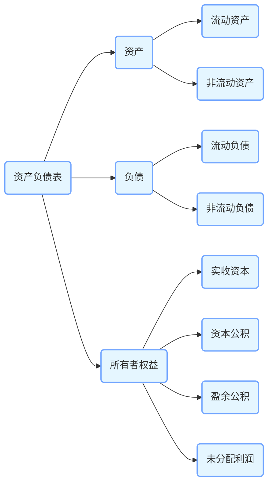

# 价值投资中的资产负债表分析

> 关键词：价值投资、资产负债表、财务分析、投资决策、财务指标、资产质量、负债结构

> 摘要：本文聚焦于价值投资领域中资产负债表分析的重要性与方法。首先介绍资产负债表分析在价值投资中的背景，包括目的、预期读者等。接着阐述资产负债表的核心概念及内在联系，详细讲解相关算法原理与操作步骤，通过数学模型和公式深入剖析财务指标。结合实际项目案例，展示如何进行资产负债表的分析及解读。探讨资产负债表分析在不同实际场景中的应用，推荐相关学习资源、开发工具和研究论文。最后总结未来价值投资中资产负债表分析的发展趋势与挑战，并对常见问题进行解答，为价值投资者提供全面且深入的资产负债表分析指导。

## 1. 背景介绍 
### 1.1 目的和范围
价值投资的核心在于寻找被市场低估的优质资产，通过长期持有实现资产的增值。资产负债表作为企业财务报表的重要组成部分，能够反映企业在特定日期的财务状况，包括资产、负债和所有者权益等信息。本文章的目的是深入探讨如何通过分析资产负债表来辅助价值投资决策，范围涵盖资产负债表的各个项目，以及相关财务指标的计算和解读，旨在帮助投资者更好地评估企业的财务健康状况、资产质量和偿债能力，从而筛选出具有投资价值的企业。

### 1.2 预期读者
本文预期读者包括有志于从事价值投资的个人投资者、金融从业者（如基金经理、分析师等）、企业财务管理人员以及对财务分析和价值投资感兴趣的研究人员。无论是初学者希望了解资产负债表分析的基础知识，还是有一定经验的投资者寻求更深入的分析方法，都能从本文中获得有价值的信息。

### 1.3 文档结构概述
本文首先介绍资产负债表分析在价值投资中的背景信息，包括目的、读者群体和文档结构等。接着阐述资产负债表的核心概念及其相互联系，通过流程图和文本示意图帮助读者理解。然后详细讲解分析资产负债表的核心算法原理和具体操作步骤，结合 Python 代码进行说明。再通过数学模型和公式对关键财务指标进行深入剖析，并举例说明。通过实际项目案例展示资产负债表分析的全过程，包括开发环境搭建、源代码实现和代码解读。探讨资产负债表分析在不同实际场景中的应用，推荐相关的学习资源、开发工具和研究论文。最后总结未来价值投资中资产负债表分析的发展趋势与挑战，解答常见问题，并提供扩展阅读和参考资料。

### 1.4 术语表
#### 1.4.1 核心术语定义
- **价值投资**：一种投资策略，通过分析企业的内在价值，寻找被市场低估的股票或其他资产，长期持有以获取资产增值收益。
- **资产负债表**：反映企业在某一特定日期财务状况的会计报表，主要包括资产、负债和所有者权益三个部分。
- **资产**：企业过去的交易或者事项形成的、由企业拥有或者控制的、预期会给企业带来经济利益的资源。
- **负债**：企业过去的交易或者事项形成的、预期会导致经济利益流出企业的现时义务。
- **所有者权益**：企业资产扣除负债后由所有者享有的剩余权益，也称为股东权益。

#### 1.4.2 相关概念解释
- **流动资产**：预计在一个正常营业周期中变现、出售或耗用，或者主要为交易目的而持有，或者预计在资产负债表日起一年内（含一年）变现的资产，以及自资产负债表日起一年内交换其他资产或清偿负债的能力不受限制的现金或现金等价物。
- **非流动资产**：流动资产以外的资产，通常具有较长的使用寿命和较低的流动性，如固定资产、无形资产等。
- **流动负债**：预计在一个正常营业周期中清偿，或者主要为交易目的而持有，或者自资产负债表日起一年内（含一年）到期应予以清偿，或者企业无权自主地将清偿推迟至资产负债表日后一年以上的负债。
- **非流动负债**：流动负债以外的负债，通常还款期限较长，如长期借款、应付债券等。

#### 1.4.3 缩略词列表
- **ROE**：Return on Equity，净资产收益率，反映股东权益的收益水平。
- **ROA**：Return on Assets，总资产收益率，衡量企业运用全部资产的总体获利能力。
- **PE**：Price - Earnings Ratio，市盈率，反映股票价格与每股收益之间的比率。
- **PB**：Price - to - Book Ratio，市净率，反映股票价格与每股净资产之间的比率。

## 2. 核心概念与联系 

资产负债表的基本结构基于会计恒等式：$资产 = 负债 + 所有者权益$。这个等式体现了企业资产的来源，即资产要么是通过负债融资获得，要么是由所有者投入和企业积累形成。

### 资产负债表的结构示意图


### 核心概念原理
- **资产**：资产是企业运营的基础，按照流动性可分为流动资产和非流动资产。流动资产如货币资金、应收账款、存货等，具有较强的变现能力，能够在短期内为企业带来现金流入。非流动资产如固定资产、无形资产等，是企业长期发展的物质基础，虽然变现能力较弱，但能够为企业创造长期的经济效益。
- **负债**：负债反映了企业的债务状况，分为流动负债和非流动负债。流动负债如短期借款、应付账款等，需要在短期内偿还，对企业的短期资金流动性有较大影响。非流动负债如长期借款、应付债券等，还款期限较长，通常用于企业的长期投资和发展。
- **所有者权益**：所有者权益是企业所有者对企业净资产的所有权，包括实收资本、资本公积、盈余公积和未分配利润等。实收资本是企业所有者投入的初始资本，资本公积是企业收到投资者出资额超出其在注册资本或股本中所占份额的部分，以及直接计入所有者权益的利得和损失等。盈余公积是企业从净利润中提取的积累资金，未分配利润是企业留待以后年度分配的利润或待分配利润。

### 各项目之间的联系
资产、负债和所有者权益之间存在着密切的联系。资产的增加可能是由于负债的增加（如借款购买资产）或所有者权益的增加（如股东投入资本）。负债的增加会导致企业的财务风险增加，而所有者权益的增加则会增强企业的财务实力。同时，企业的经营活动会影响资产、负债和所有者权益的变化。例如，企业实现盈利会增加所有者权益，而发生亏损则会减少所有者权益。

## 3. 核心算法原理 & 具体操作步骤 

### 关键财务指标的计算原理
在资产负债表分析中，有许多关键的财务指标可以帮助投资者评估企业的财务状况和经营绩效。以下是一些常见财务指标的计算原理和 Python 代码实现。

#### 1. 流动比率
流动比率是衡量企业短期偿债能力的重要指标，计算公式为：$流动比率 = \frac{流动资产}{流动负债}$。流动比率越高，说明企业的短期偿债能力越强。

```python
def current_ratio(current_assets, current_liabilities):
    if current_liabilities == 0:
        return None
    return current_assets / current_liabilities
```

#### 2. 资产负债率
资产负债率反映了企业的长期偿债能力，计算公式为：$资产负债率 = \frac{负债总额}{资产总额} \times 100\%$。资产负债率越高，说明企业的负债水平越高，财务风险越大。

```python
def debt_to_asset_ratio(total_liabilities, total_assets):
    if total_assets == 0:
        return None
    return (total_liabilities / total_assets) * 100
```

#### 3. 净资产收益率（ROE）
净资产收益率反映了股东权益的收益水平，计算公式为：$ROE = \frac{净利润}{平均净资产} \times 100\%$。平均净资产可以通过期初净资产和期末净资产的平均值来计算。

```python
def roe(net_income, average_equity):
    if average_equity == 0:
        return None
    return (net_income / average_equity) * 100
```

### 具体操作步骤
1. **数据收集**：从企业的财务报表中获取资产负债表的相关数据，包括流动资产、流动负债、资产总额、负债总额、净利润、净资产等。
2. **数据整理**：对收集到的数据进行整理和清洗，确保数据的准确性和一致性。
3. **指标计算**：根据上述公式和 Python 代码，计算各项财务指标。
4. **指标分析**：将计算得到的财务指标与同行业其他企业进行比较，分析企业的财务状况和经营绩效。同时，观察指标的变化趋势，判断企业的发展态势。

## 4. 数学模型和公式 & 详细讲解 & 举例说明 

### 流动比率
$流动比率 = \frac{流动资产}{流动负债}$

详细讲解：流动比率反映了企业流动资产在短期债务到期以前，可以变为现金用于偿还负债的能力。一般来说，流动比率在 2 左右比较合适，但不同行业的流动比率标准可能会有所不同。如果流动比率过高，可能意味着企业的资金闲置，没有得到充分利用；如果流动比率过低，则可能表明企业的短期偿债能力存在问题。

举例说明：假设 A 公司的流动资产为 1000 万元，流动负债为 500 万元，则其流动比率为：$流动比率 = \frac{1000}{500} = 2$。这表明 A 公司的流动资产是流动负债的 2 倍，短期偿债能力较强。

### 资产负债率
$资产负债率 = \frac{负债总额}{资产总额} \times 100\%$

详细讲解：资产负债率反映了企业的负债水平和财务风险。资产负债率越高，说明企业的负债越多，财务风险越大；反之，资产负债率越低，说明企业的负债越少，财务风险越小。一般来说，资产负债率在 40% - 60% 之间比较合理，但不同行业的资产负债率标准也会有所差异。

举例说明：假设 B 公司的负债总额为 800 万元，资产总额为 2000 万元，则其资产负债率为：$资产负债率 = \frac{800}{2000} \times 100\% = 40\%$。这表明 B 公司的负债占资产总额的 40%，处于比较合理的水平。

### 净资产收益率（ROE）
$ROE = \frac{净利润}{平均净资产} \times 100\%$

详细讲解：ROE 反映了股东权益的收益水平，是衡量企业盈利能力的重要指标。ROE 越高，说明企业运用自有资本的效率越高，股东的投资回报越高。一般来说，ROE 在 15% 以上比较优秀，但不同行业的 ROE 水平也会有所不同。

举例说明：假设 C 公司的净利润为 300 万元，期初净资产为 1500 万元，期末净资产为 1800 万元，则平均净资产为：$\frac{1500 + 1800}{2} = 1650$（万元），ROE 为：$ROE = \frac{300}{1650} \times 100\% \approx 18.18\%$。这表明 C 公司的 ROE 较高，股东的投资回报较好。

## 5. 项目实战：代码实际案例和详细解释说明 

### 5.1  开发环境搭建
- **编程语言**：Python 3.x
- **开发工具**：可以选择 PyCharm、Jupyter Notebook 等。
- **相关库**：需要安装 pandas、numpy 等库，用于数据处理和分析。可以使用以下命令进行安装：
```bash
pip install pandas numpy
```

### 5.2  源代码详细实现和代码解读
以下是一个完整的 Python 代码示例，用于读取企业的资产负债表数据，并计算相关财务指标。

```python
import pandas as pd

# 读取资产负债表数据
def read_balance_sheet(file_path):
    df = pd.read_excel(file_path)
    return df

# 计算流动比率
def current_ratio(df):
    current_assets = df['流动资产合计'].values[0]
    current_liabilities = df['流动负债合计'].values[0]
    if current_liabilities == 0:
        return None
    return current_assets / current_liabilities

# 计算资产负债率
def debt_to_asset_ratio(df):
    total_liabilities = df['负债合计'].values[0]
    total_assets = df['资产总计'].values[0]
    if total_assets == 0:
        return None
    return (total_liabilities / total_assets) * 100

# 计算净资产收益率
def roe(df):
    net_income = df['净利润'].values[0]
    beginning_equity = df['期初净资产'].values[0]
    ending_equity = df['期末净资产'].values[0]
    average_equity = (beginning_equity + ending_equity) / 2
    if average_equity == 0:
        return None
    return (net_income / average_equity) * 100

# 主函数
def main():
    file_path = 'balance_sheet.xlsx'
    df = read_balance_sheet(file_path)
    cr = current_ratio(df)
    dar = debt_to_asset_ratio(df)
    r = roe(df)
    print(f"流动比率: {cr}")
    print(f"资产负债率: {dar}%")
    print(f"净资产收益率: {r}%")

if __name__ == "__main__":
    main()
```

### 5.3  代码解读与分析
- **读取数据**：`read_balance_sheet` 函数使用 `pandas` 库的 `read_excel` 方法读取资产负债表数据，并返回一个 DataFrame 对象。
- **计算流动比率**：`current_ratio` 函数从 DataFrame 中提取流动资产和流动负债的数据，计算流动比率。如果流动负债为 0，则返回 `None`。
- **计算资产负债率**：`debt_to_asset_ratio` 函数从 DataFrame 中提取负债合计和资产总计的数据，计算资产负债率。如果资产总计为 0，则返回 `None`。
- **计算净资产收益率**：`roe` 函数从 DataFrame 中提取净利润、期初净资产和期末净资产的数据，计算平均净资产和净资产收益率。如果平均净资产为 0，则返回 `None`。
- **主函数**：`main` 函数调用上述函数，读取数据并计算各项财务指标，最后打印结果。

## 6. 实际应用场景 
### 股票投资
在股票投资中，资产负债表分析可以帮助投资者筛选出具有投资价值的股票。通过分析企业的资产质量、负债结构和偿债能力等指标，投资者可以评估企业的财务健康状况和经营风险。例如，如果一个企业的流动比率较高、资产负债率较低、净资产收益率较高，说明该企业的财务状况较好，具有较强的盈利能力和偿债能力，可能是一个值得投资的对象。

### 债券投资
在债券投资中，资产负债表分析可以帮助投资者评估债券的信用风险。债券发行人的资产质量和偿债能力是影响债券信用风险的重要因素。通过分析发行人的资产负债表，投资者可以了解其资产结构、负债水平和现金流状况，从而判断其是否有能力按时偿还债券本息。例如，如果一个债券发行人的资产负债率过高、流动比率过低，说明其偿债能力较弱，债券的信用风险较高。

### 企业并购
在企业并购中，资产负债表分析是评估目标企业价值的重要环节。通过分析目标企业的资产负债表，并购方可以了解其资产状况、负债情况和所有者权益结构，从而确定目标企业的真实价值。例如，并购方可以关注目标企业的固定资产、无形资产等非流动资产的价值，以及是否存在潜在的负债风险。同时，资产负债表分析还可以帮助并购方评估目标企业的财务协同效应，为并购决策提供依据。

### 银行信贷
在银行信贷业务中，资产负债表分析是评估借款人信用风险的重要手段。银行在发放贷款前，需要对借款人的财务状况进行全面评估，以确定其是否有能力按时偿还贷款本息。通过分析借款人的资产负债表，银行可以了解其资产质量、负债结构和偿债能力等情况，从而判断其信用风险。例如，如果一个借款人的资产负债率过高、流动比率过低，说明其偿债能力较弱，银行可能会降低其信用评级或拒绝发放贷款。

## 7. 工具和资源推荐
### 7.1 学习资源推荐
#### 7.1.1 书籍推荐
- 《财务报表分析与证券定价》：这本书系统地介绍了财务报表分析的方法和技术，以及如何运用财务报表信息进行证券定价。书中结合了大量的实际案例，对资产负债表分析等内容进行了深入讲解。
- 《聪明的投资者》：这是价值投资领域的经典著作，作者本杰明·格雷厄姆在书中阐述了价值投资的理念和方法，同时也涉及到了财务报表分析的相关内容，对于理解资产负债表在价值投资中的应用具有重要的指导意义。
- 《手把手教你读财报》：这本书以通俗易懂的语言介绍了财务报表的基本概念和分析方法，适合初学者阅读。书中对资产负债表的各个项目进行了详细解释，并通过实际案例展示了如何进行资产负债表分析。

#### 7.1.2 在线课程
- Coursera 上的“Financial Markets”：该课程由耶鲁大学教授罗伯特·席勒（Robert Shiller）讲授，涵盖了金融市场的各个方面，包括财务报表分析等内容。课程通过视频讲解、案例分析和在线讨论等方式，帮助学习者深入理解金融市场和财务分析的原理和方法。
- 网易云课堂上的“财务报表分析实战”：这是一门实战性较强的课程，通过实际案例详细讲解了财务报表分析的方法和技巧，包括资产负债表分析、利润表分析和现金流量表分析等内容。学习者可以通过课程中的练习和作业，提高自己的财务分析能力。

#### 7.1.3 技术博客和网站
- 雪球网：雪球网是一个投资社区，上面有许多投资者分享的财务分析文章和投资经验。通过阅读这些文章，学习者可以了解到不同投资者对资产负债表分析的观点和方法，同时还可以参与讨论，与其他投资者交流心得。
- 巨潮资讯网：巨潮资讯网是中国证监会指定的上市公司信息披露网站，上面可以获取到上市公司的财务报表等信息。学习者可以通过分析这些财务报表，练习资产负债表分析的方法和技巧。

### 7.2 开发工具框架推荐
#### 7.2.1 IDE和编辑器
- PyCharm：PyCharm 是一款专门为 Python 开发设计的集成开发环境（IDE），具有代码编辑、调试、代码分析等功能。它提供了丰富的插件和工具，可以提高开发效率。
- Jupyter Notebook：Jupyter Notebook 是一个交互式的开发环境，支持多种编程语言，包括 Python。它以网页的形式呈现代码和文档，方便用户进行数据分析和可视化。

#### 7.2.2 调试和性能分析工具
- PDB：PDB 是 Python 自带的调试工具，可以帮助开发者在代码中设置断点、单步执行代码、查看变量值等。通过使用 PDB，开发者可以快速定位和解决代码中的问题。
- cProfile：cProfile 是 Python 自带的性能分析工具，可以帮助开发者分析代码的性能瓶颈。通过使用 cProfile，开发者可以了解代码中各个函数的执行时间和调用次数，从而对代码进行优化。

#### 7.2.3 相关框架和库
- Pandas：Pandas 是一个强大的数据处理和分析库，提供了 DataFrame 和 Series 等数据结构，方便用户进行数据读取、清洗、处理和分析。在资产负债表分析中，Pandas 可以用于读取和处理财务报表数据。
- Numpy：Numpy 是一个用于科学计算的 Python 库，提供了高效的数组和矩阵运算功能。在资产负债表分析中，Numpy 可以用于进行数值计算和统计分析。

### 7.3 相关论文著作推荐
#### 7.3.1 经典论文
- “The Information Content of Annual Earnings Announcements”：该论文研究了年度盈利公告的信息含量，探讨了财务报表信息对投资者决策的影响。论文中涉及到了对资产负债表等财务报表的分析和解读，对于理解财务报表的信息价值具有重要的参考意义。
- “Financial Ratios and the Probabilistic Prediction of Bankruptcy”：这篇论文提出了一种基于财务比率的破产预测模型，通过对资产负债表等财务报表中的关键指标进行分析，预测企业破产的概率。该模型在财务风险管理领域具有重要的应用价值。

#### 7.3.2 最新研究成果
- 近年来，随着人工智能和大数据技术的发展，越来越多的研究开始将这些技术应用于财务报表分析中。例如，一些研究使用机器学习算法对资产负债表等财务报表数据进行分析，以预测企业的财务状况和经营绩效。这些研究成果为资产负债表分析提供了新的方法和思路。

#### 7.3.3 应用案例分析
- 一些知名企业的财务报表分析案例可以为学习者提供实际应用的参考。例如，对苹果公司、亚马逊公司等企业的资产负债表进行分析，可以了解到这些企业的财务状况和经营策略，以及如何通过资产负债表分析来评估企业的投资价值。

## 8. 总结：未来发展趋势与挑战
### 未来发展趋势
- **数字化和智能化**：随着信息技术的不断发展，财务报表数据的数字化程度将越来越高，资产负债表分析也将越来越智能化。人工智能和机器学习算法将被广泛应用于财务报表分析中，帮助投资者更快速、准确地分析资产负债表数据，发现潜在的投资机会和风险。
- **非财务信息的融合**：未来的资产负债表分析将不仅仅局限于财务数据，还将融合非财务信息，如企业的社会责任、环境影响、创新能力等。这些非财务信息可以为投资者提供更全面的企业画像，帮助他们更好地评估企业的长期价值。
- **全球视野**：随着经济全球化的发展，投资者的投资范围将越来越广泛，资产负债表分析也将具有全球视野。投资者需要了解不同国家和地区的会计制度和财务报表准则，以便对全球范围内的企业进行准确的财务分析。

### 挑战
- **数据质量和可靠性**：资产负债表分析的准确性依赖于数据的质量和可靠性。然而，在实际应用中，财务报表数据可能存在错误、遗漏或造假等问题，这给资产负债表分析带来了很大的挑战。投资者需要具备一定的数据分析和判断能力，以识别和处理这些数据问题。
- **会计政策的差异**：不同国家和地区的会计制度和财务报表准则存在差异，这使得对不同企业的资产负债表进行比较和分析变得困难。投资者需要了解这些会计政策的差异，并进行适当的调整，以便进行准确的财务分析。
- **复杂的金融工具**：随着金融市场的不断发展，越来越多的复杂金融工具被企业采用，如衍生品、资产支持证券等。这些复杂金融工具的会计处理和风险评估比较困难，给资产负债表分析带来了新的挑战。投资者需要具备一定的金融知识和分析能力，以理解和评估这些复杂金融工具对企业财务状况的影响。

## 9. 附录：常见问题与解答
### 1. 资产负债表中的数据都是准确无误的吗？
资产负债表中的数据并不一定都是准确无误的。企业可能会因为会计政策的选择、人为错误或故意造假等原因，导致财务报表数据存在偏差。投资者在进行资产负债表分析时，需要对数据的质量和可靠性进行评估，可以通过比较不同时期的财务报表、分析财务指标的变化趋势、参考其他信息来源等方式来识别和处理数据问题。

### 2. 如何判断一个企业的资产质量好坏？
判断一个企业的资产质量好坏可以从多个方面进行分析。首先，可以关注资产的流动性，流动资产占比高、变现能力强的企业，资产质量相对较好。其次，可以分析资产的盈利能力，如固定资产的使用效率、无形资产的价值创造能力等。此外，还可以关注资产的账面价值与市场价值的差异，以及是否存在潜在的资产减值风险。

### 3. 资产负债率越高越好还是越低越好？
资产负债率并不是越高越好或越低越好，而是需要根据企业的行业特点、经营模式和发展阶段等因素来综合判断。一般来说，资产负债率在 40% - 60% 之间比较合理，但不同行业的标准可能会有所差异。如果资产负债率过高，说明企业的负债水平较高，财务风险较大；如果资产负债率过低，说明企业可能没有充分利用财务杠杆，融资效率较低。

### 4. 净资产收益率受哪些因素影响？
净资产收益率受多个因素的影响，主要包括净利润、平均净资产、资产周转率、销售净利率和权益乘数等。净利润的增加会直接提高净资产收益率；平均净资产的减少也会导致净资产收益率的提高。资产周转率反映了企业资产的运营效率，销售净利率反映了企业的盈利能力，权益乘数反映了企业的财务杠杆水平。这些因素的变化都会对净资产收益率产生影响。

## 10. 扩展阅读 & 参考资料
### 扩展阅读
- 《财务分析与决策》：进一步深入探讨财务分析的方法和技术，以及如何运用财务分析进行决策。
- 《金融炼金术》：乔治·索罗斯的著作，介绍了他的投资理念和方法，以及对金融市场的深刻理解。

### 参考资料
- 企业会计准则：了解企业财务报表编制的规范和要求。
- 相关上市公司的财务报表：通过实际案例进行资产负债表分析的练习和研究。
- 金融学术期刊：如《Journal of Financial Economics》、《The Journal of Finance》等，获取最新的金融研究成果和学术观点。