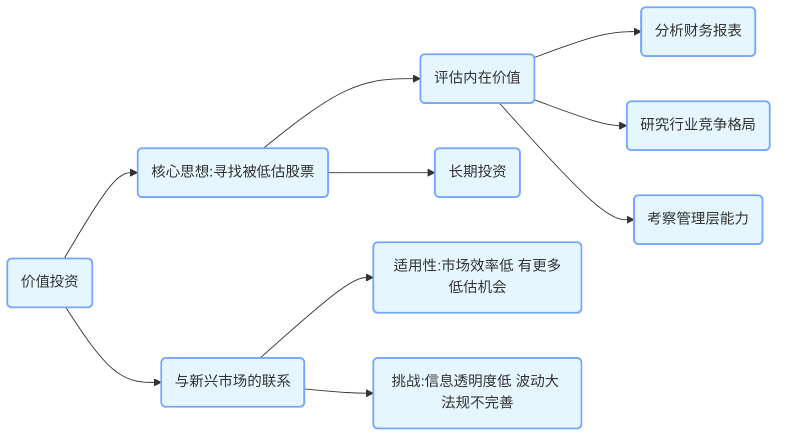

# 价值投资在新兴市场的应用

> 关键词：价值投资、新兴市场、投资策略、市场分析、风险评估、财务指标、长期回报

> 摘要：本文聚焦于价值投资在新兴市场的应用。首先介绍了价值投资和新兴市场的相关背景知识，明确了研究的目的、范围和预期读者等。接着阐述了价值投资的核心概念及其与新兴市场的联系，详细讲解了价值投资的核心算法原理与具体操作步骤，并结合数学模型和公式进行深入剖析。通过项目实战案例，展示了在新兴市场中价值投资策略的实际应用和代码实现。分析了价值投资在新兴市场的实际应用场景，推荐了相关的学习资源、开发工具和论文著作。最后总结了价值投资在新兴市场的未来发展趋势与挑战，并提供了常见问题的解答和扩展阅读参考资料，旨在为投资者在新兴市场运用价值投资策略提供全面、深入的指导。

## 1. 背景介绍 
### 1.1 目的和范围
价值投资作为一种经典的投资策略，在成熟市场已被广泛应用并取得了显著的成效。然而，新兴市场具有其独特的特点和复杂性，如市场波动较大、信息透明度相对较低、法律法规尚不完善等。本研究的目的在于探讨价值投资策略在新兴市场的适用性、有效性以及如何进行调整和优化，以帮助投资者在新兴市场中更好地运用价值投资理念实现资产的增值。

研究范围涵盖了全球主要的新兴市场，包括但不限于亚洲的印度、中国（部分市场），南美洲的巴西、阿根廷，以及非洲的一些国家的金融市场。研究内容包括价值投资的基本原理、新兴市场的特点、价值投资在新兴市场的应用方法、风险评估和控制等方面。

### 1.2 预期读者
本文预期读者包括专业的投资者、金融分析师、投资机构的从业人员、对价值投资和新兴市场感兴趣的学者以及有一定投资经验的个人投资者。通过阅读本文，读者可以深入了解价值投资在新兴市场的应用逻辑和实践方法，为其投资决策提供参考。

### 1.3 文档结构概述
本文共分为十个部分。第一部分背景介绍，阐述了研究的目的、范围、预期读者和文档结构，以及相关术语的定义。第二部分介绍价值投资的核心概念及其与新兴市场的联系，通过文本示意图和 Mermaid 流程图进行说明。第三部分详细讲解价值投资的核心算法原理，并给出具体操作步骤，同时使用 Python 源代码进行阐述。第四部分介绍价值投资的数学模型和公式，并通过举例进行详细讲解。第五部分通过项目实战案例，展示在新兴市场中价值投资策略的代码实现和详细解释。第六部分分析价值投资在新兴市场的实际应用场景。第七部分推荐相关的学习资源、开发工具和论文著作。第八部分总结价值投资在新兴市场的未来发展趋势与挑战。第九部分提供常见问题的解答。第十部分列出扩展阅读和参考资料。

### 1.4 术语表
#### 1.4.1 核心术语定义
- **价值投资**：一种基于公司内在价值进行投资的策略，投资者通过分析公司的财务状况、经营业绩、行业地位等因素，寻找被市场低估的股票进行投资，以期在长期内获得超过市场平均水平的回报。
- **新兴市场**：指那些经济发展较快、市场潜力较大，但金融市场相对不成熟、制度建设尚不完善的国家和地区的金融市场。

#### 1.4.2 相关概念解释
- **内在价值**：公司的真实价值，通常通过对公司未来现金流的折现计算得出。内在价值是价值投资的核心概念，投资者认为市场价格会围绕内在价值波动，当市场价格低于内在价值时，股票具有投资价值。
- **市场效率**：指市场价格反映所有可用信息的程度。在有效市场中，市场价格能够及时、准确地反映公司的内在价值；而在新兴市场中，由于信息不对称等因素，市场效率相对较低，为价值投资者提供了寻找被低估股票的机会。

#### 1.4.3 缩略词列表
- **PE**：市盈率（Price - Earnings Ratio），指股票价格与每股收益的比率，是衡量股票估值的常用指标。
- **PB**：市净率（Price - Book Ratio），指股票价格与每股净资产的比率，反映了股票价格相对于公司净资产的倍数。
- **DCF**：现金流折现模型（Discounted Cash Flow Model），一种通过预测公司未来现金流并折现到当前的方法来计算公司内在价值的模型。

## 2. 核心概念与联系 
### 价值投资的核心概念
价值投资的核心思想是寻找被市场低估的股票，即股票的市场价格低于其内在价值。投资者通过深入研究公司的基本面，包括财务报表、行业竞争格局、管理层能力等，来评估公司的内在价值。当市场价格低于内在价值时，投资者认为该股票具有投资价值，买入并持有，等待市场价格回归内在价值，从而获得投资收益。

价值投资强调长期投资，认为短期市场波动是不可预测的，但从长期来看，市场价格会向内在价值靠拢。投资者应该关注公司的长期发展潜力，而不是被短期的市场波动所影响。

### 新兴市场的特点
新兴市场具有以下特点：
- **高增长潜力**：新兴市场国家通常处于经济快速发展阶段，具有较高的经济增长率和市场潜力。随着经济的发展，企业的盈利水平也有望提高，为投资者带来较高的回报。
- **市场波动较大**：由于新兴市场的金融体系相对不成熟，市场参与者的投资经验和风险意识相对较低，导致市场波动较大。这种波动既带来了投资机会，也增加了投资风险。
- **信息透明度较低**：新兴市场的信息披露制度和监管机制可能不够完善，导致信息透明度较低。投资者获取准确、及时的信息相对困难，增加了投资决策的难度。
- **法律法规尚不完善**：新兴市场的法律法规体系可能不够健全，对投资者的保护力度相对较弱。这可能导致投资者的权益受到侵害，增加了投资风险。

### 价值投资与新兴市场的联系
价值投资在新兴市场具有一定的适用性。由于新兴市场的市场效率相对较低，信息不对称现象较为普遍，股票价格更容易偏离其内在价值，为价值投资者提供了更多寻找被低估股票的机会。

然而，新兴市场的特点也给价值投资带来了挑战。例如，由于信息透明度较低，投资者难以准确评估公司的内在价值；市场波动较大，可能导致投资者在持有股票期间面临较大的市值波动；法律法规不完善，可能影响投资者的权益保护。因此，在新兴市场应用价值投资策略需要进行适当的调整和优化。

### 文本示意图
```plaintext
价值投资
|
|-- 核心思想：寻找被低估股票
|   |
|   |-- 评估内在价值
|   |   |
|   |   |-- 分析财务报表
|   |   |-- 研究行业竞争格局
|   |   |-- 考察管理层能力
|   |
|   |-- 长期投资
|
|-- 与新兴市场的联系
    |
    |-- 适用性：市场效率低，有更多低估机会
    |
    |-- 挑战：信息透明度低、波动大、法规不完善
```

### Mermaid 流程图


## 3. 核心算法原理 & 具体操作步骤 
### 核心算法原理
价值投资的核心算法原理主要基于对公司内在价值的评估。常用的评估方法包括现金流折现模型（DCF）、相对估值法等。

#### 现金流折现模型（DCF）
现金流折现模型是一种基于公司未来现金流的折现计算公司内在价值的方法。其基本原理是将公司未来的现金流按照一定的折现率折现到当前，得到公司的内在价值。

DCF 模型的计算公式为：
$$V = \sum_{t=1}^{n} \frac{FCF_t}{(1 + r)^t} + \frac{TV}{(1 + r)^n}$$
其中，$V$ 表示公司的内在价值，$FCF_t$ 表示第 $t$ 期的自由现金流，$r$ 表示折现率，$n$ 表示预测期数，$TV$ 表示终值。

#### 相对估值法
相对估值法是通过比较公司与同行业其他公司的估值指标，如市盈率（PE）、市净率（PB）等，来评估公司的价值。相对估值法的基本假设是同行业的公司具有相似的估值水平。

### 具体操作步骤
#### 步骤 1：确定研究范围
首先，确定要研究的新兴市场和行业。可以根据自己的投资目标和风险偏好选择合适的市场和行业。

#### 步骤 2：收集数据
收集相关公司的财务报表、行业研究报告、宏观经济数据等信息。可以通过金融数据库、公司官网、证券交易所等渠道获取数据。

#### 步骤 3：分析财务报表
对收集到的财务报表进行分析，包括资产负债表、利润表、现金流量表等。重点关注公司的盈利能力、偿债能力、运营能力等指标，如净利润、毛利率、资产负债率等。

#### 步骤 4：评估公司内在价值
根据收集到的数据和分析结果，选择合适的估值方法评估公司的内在价值。可以使用 DCF 模型、相对估值法或其他方法。

#### 步骤 5：筛选被低估的股票
将公司的内在价值与市场价格进行比较，筛选出市场价格低于内在价值的股票。这些股票被认为是被低估的股票，具有投资价值。

#### 步骤 6：风险评估
对筛选出的股票进行风险评估，考虑公司的行业竞争风险、财务风险、宏观经济风险等因素。可以使用风险评估模型或其他方法进行风险评估。

#### 步骤 7：构建投资组合
根据风险评估结果，构建投资组合。可以根据自己的风险偏好和投资目标，选择不同的股票进行组合，以降低投资风险。

#### 步骤 8：跟踪和调整
定期跟踪投资组合的表现，根据市场变化和公司基本面的变化，及时调整投资组合。

### Python 源代码实现
```python
import pandas as pd
import numpy as np

# 步骤 3：分析财务报表
def analyze_financial_statements(financial_data):
    # 计算盈利能力指标：净利润率
    financial_data['net_profit_margin'] = financial_data['net_income'] / financial_data['revenue']
    # 计算偿债能力指标：资产负债率
    financial_data['debt_ratio'] = financial_data['total_debt'] / financial_data['total_assets']
    # 计算运营能力指标：存货周转率
    financial_data['inventory_turnover'] = financial_data['revenue'] / financial_data['inventory']
    return financial_data

# 步骤 4：评估公司内在价值 - 相对估值法（以市盈率为例）
def relative_valuation(financial_data, industry_pe):
    financial_data['intrinsic_value'] = financial_data['earnings_per_share'] * industry_pe
    return financial_data

# 步骤 5：筛选被低估的股票
def screen_undervalued_stocks(financial_data):
    undervalued_stocks = financial_data[financial_data['market_price'] < financial_data['intrinsic_value']]
    return undervalued_stocks

# 示例数据
data = {
    'revenue': [1000, 2000, 1500],
    'net_income': [100, 200, 150],
    'total_debt': [200, 300, 250],
    'total_assets': [800, 1500, 1200],
    'inventory': [100, 200, 150],
    'earnings_per_share': [2, 3, 2.5],
    'market_price': [30, 40, 35],
    'industry_pe': 15
}

financial_data = pd.DataFrame(data)

# 分析财务报表
financial_data = analyze_financial_statements(financial_data)
# 评估公司内在价值
financial_data = relative_valuation(financial_data, financial_data['industry_pe'][0])
# 筛选被低估的股票
undervalued_stocks = screen_undervalued_stocks(financial_data)

print(undervalued_stocks)
```

## 4. 数学模型和公式 & 详细讲解 & 举例说明 
### 现金流折现模型（DCF）
#### 公式详细讲解
现金流折现模型的公式为：
$$V = \sum_{t=1}^{n} \frac{FCF_t}{(1 + r)^t} + \frac{TV}{(1 + r)^n}$$
其中：
- $V$：公司的内在价值
- $FCF_t$：第 $t$ 期的自由现金流
- $r$：折现率
- $n$：预测期数
- $TV$：终值

自由现金流（$FCF$）是指公司在满足了所有必要的资本支出和营运资金需求后，剩余的可自由支配的现金流量。折现率（$r$）反映了投资者对投资风险的预期，通常使用加权平均资本成本（WACC）作为折现率。预测期数（$n$）是指预测公司未来现金流的期限，一般根据公司的行业特点和发展阶段确定。终值（$TV$）是指预测期结束后公司的价值，通常使用永续增长模型计算。

永续增长模型的计算公式为：
$$TV = \frac{FCF_{n+1}}{r - g}$$
其中，$FCF_{n+1}$ 是预测期结束后下一期的自由现金流，$g$ 是永续增长率。

#### 举例说明
假设一家公司预计未来三年的自由现金流分别为 100 万元、120 万元、150 万元，预测期结束后公司的自由现金流将以 3% 的增长率永续增长。折现率为 10%。

首先，计算预测期内的现金流现值：
$$PV_1 = \frac{100}{(1 + 0.1)^1} = 90.91 \text{ 万元}$$
$$PV_2 = \frac{120}{(1 + 0.1)^2} = 99.17 \text{ 万元}$$
$$PV_3 = \frac{150}{(1 + 0.1)^3} = 112.70 \text{ 万元}$$

然后，计算终值：
$$FCF_4 = 150 \times (1 + 0.03) = 154.5 \text{ 万元}$$
$$TV = \frac{154.5}{0.1 - 0.03} = 2207.14 \text{ 万元}$$

终值的现值为：
$$PV_{TV} = \frac{2207.14}{(1 + 0.1)^3} = 1659.23 \text{ 万元}$$

最后，计算公司的内在价值：
$$V = 90.91 + 99.17 + 112.70 + 1659.23 = 1962.01 \text{ 万元}$$

### 相对估值法
#### 公式详细讲解
相对估值法常用的指标包括市盈率（PE）、市净率（PB）等。

市盈率（PE）的计算公式为：
$$PE = \frac{P}{EPS}$$
其中，$P$ 是股票价格，$EPS$ 是每股收益。

市净率（PB）的计算公式为：
$$PB = \frac{P}{BVPS}$$
其中，$P$ 是股票价格，$BVPS$ 是每股净资产。

相对估值法的基本思路是通过比较公司与同行业其他公司的估值指标，来评估公司的价值。如果公司的估值指标低于同行业平均水平，则认为公司被低估；反之，则认为公司被高估。

#### 举例说明
假设同行业公司的平均市盈率为 20，某公司的每股收益为 2 元。则该公司的内在价值为：
$$V = 20 \times 2 = 40 \text{ 元}$$
如果该公司的股票价格为 35 元，则认为该公司被低估，具有投资价值。

## 5. 项目实战：代码实际案例和详细解释说明 
### 5.1  开发环境搭建
#### 安装 Python
首先，需要安装 Python 环境。可以从 Python 官方网站（https://www.python.org/downloads/） 下载适合自己操作系统的 Python 安装包，并按照安装向导进行安装。

#### 安装必要的库
在本项目中，需要使用以下 Python 库：
- `pandas`：用于数据处理和分析
- `numpy`：用于数值计算

可以使用以下命令安装这些库：
```sh
pip install pandas numpy
```

### 5.2  源代码详细实现和代码解读
```python
import pandas as pd
import numpy as np

# 步骤 3：分析财务报表
def analyze_financial_statements(financial_data):
    # 计算盈利能力指标：净利润率
    financial_data['net_profit_margin'] = financial_data['net_income'] / financial_data['revenue']
    # 计算偿债能力指标：资产负债率
    financial_data['debt_ratio'] = financial_data['total_debt'] / financial_data['total_assets']
    # 计算运营能力指标：存货周转率
    financial_data['inventory_turnover'] = financial_data['revenue'] / financial_data['inventory']
    return financial_data

# 步骤 4：评估公司内在价值 - 相对估值法（以市盈率为例）
def relative_valuation(financial_data, industry_pe):
    financial_data['intrinsic_value'] = financial_data['earnings_per_share'] * industry_pe
    return financial_data

# 步骤 5：筛选被低估的股票
def screen_undervalued_stocks(financial_data):
    undervalued_stocks = financial_data[financial_data['market_price'] < financial_data['intrinsic_value']]
    return undervalued_stocks

# 示例数据
data = {
    'revenue': [1000, 2000, 1500],
    'net_income': [100, 200, 150],
    'total_debt': [200, 300, 250],
    'total_assets': [800, 1500, 1200],
    'inventory': [100, 200, 150],
    'earnings_per_share': [2, 3, 2.5],
    'market_price': [30, 40, 35],
    'industry_pe': 15
}

financial_data = pd.DataFrame(data)

# 分析财务报表
financial_data = analyze_financial_statements(financial_data)
# 评估公司内在价值
financial_data = relative_valuation(financial_data, financial_data['industry_pe'][0])
# 筛选被低估的股票
undervalued_stocks = screen_undervalued_stocks(financial_data)

print(undervalued_stocks)
```

### 5.3  代码解读与分析
#### 函数 `analyze_financial_statements`
该函数用于分析财务报表，计算公司的盈利能力、偿债能力和运营能力指标。具体来说，计算了净利润率、资产负债率和存货周转率。

#### 函数 `relative_valuation`
该函数使用相对估值法（以市盈率为例）评估公司的内在价值。根据行业平均市盈率和公司的每股收益，计算出公司的内在价值。

#### 函数 `screen_undervalued_stocks`
该函数用于筛选被低估的股票。通过比较公司的市场价格和内在价值，筛选出市场价格低于内在价值的股票。

#### 主程序
首先，定义了示例数据，包括公司的财务数据和行业平均市盈率。然后，将数据转换为 `pandas` 数据框。接着，调用 `analyze_financial_statements` 函数分析财务报表，调用 `relative_valuation` 函数评估公司内在价值，最后调用 `screen_undervalued_stocks` 函数筛选被低估的股票，并打印筛选结果。

## 6. 实际应用场景 
### 股票投资
在新兴市场的股票投资中，价值投资策略可以帮助投资者寻找被低估的股票。通过分析公司的基本面和估值指标，投资者可以选择具有投资价值的股票进行长期投资。例如，在印度股票市场，一些传统行业的公司可能由于市场情绪等因素被低估，价值投资者可以通过深入研究这些公司的财务状况和发展前景，选择合适的投资标的。

### 基金投资
对于基金投资者来说，价值投资策略可以作为选择基金的参考。一些价值型基金通常采用价值投资策略，通过投资被低估的股票来获取超额收益。投资者可以通过分析基金的持仓情况、投资策略和业绩表现等因素，选择符合自己投资目标的价值型基金。

### 并购重组
在新兴市场的并购重组活动中，价值投资理念也具有重要的应用价值。收购方可以通过价值评估方法，评估目标公司的内在价值，确定合理的收购价格。同时，被收购方也可以通过展示自己的内在价值，争取更高的收购价格。

### 风险投资
在新兴市场的风险投资领域，价值投资策略可以帮助投资者筛选具有潜力的创业公司。虽然创业公司的未来发展具有较大的不确定性，但通过分析公司的商业模式、团队能力和市场前景等因素，投资者可以评估公司的潜在价值，选择具有投资价值的创业公司进行投资。

## 7. 工具和资源推荐
### 7.1 学习资源推荐
#### 7.1.1 书籍推荐
- 《聪明的投资者》（The Intelligent Investor）：作者本杰明·格雷厄姆（Benjamin Graham），被誉为价值投资的圣经。本书详细阐述了价值投资的基本原理和方法，对投资者具有重要的指导意义。
- 《证券分析》（Security Analysis）：同样是本杰明·格雷厄姆的著作，是价值投资领域的经典之作。本书深入探讨了证券分析的理论和实践，为投资者提供了全面的投资分析框架。
- 《巴菲特致股东的信》（Letters to Shareholders）：作者沃伦·巴菲特（Warren Buffett），收录了巴菲特历年致股东的信。通过阅读这些信件，投资者可以了解巴菲特的投资理念、投资策略和对市场的看法。

#### 7.1.2 在线课程
- Coursera 平台上的“投资学原理”（Principles of Investing）课程：该课程由知名大学的教授授课，系统地介绍了投资学的基本原理和方法，包括价值投资、资产定价等内容。
- edX 平台上的“金融市场”（Financial Markets）课程：由耶鲁大学的教授授课，深入讲解了金融市场的运行机制和投资策略，对价值投资在金融市场中的应用有详细的介绍。

#### 7.1.3 技术博客和网站
- Seeking Alpha：一个专业的金融投资网站，提供大量的股票分析、投资策略和市场评论文章。其中不乏关于价值投资在新兴市场应用的研究和分析。
- 雪球网：国内知名的投资交流社区，有很多投资者分享自己的投资经验和心得，包括价值投资在国内新兴市场的实践案例。

### 7.2 开发工具框架推荐
#### 7.2.1 IDE和编辑器
- PyCharm：一款专业的 Python 集成开发环境，具有强大的代码编辑、调试和分析功能，适合开发价值投资相关的 Python 程序。
- Jupyter Notebook：一个交互式的开发环境，支持 Python 等多种编程语言。可以方便地进行数据处理、分析和可视化，适合进行价值投资的数据分析和模型验证。

#### 7.2.2 调试和性能分析工具
- `pdb`：Python 内置的调试器，可以帮助开发者在代码执行过程中进行调试，查找问题。
- `cProfile`：Python 标准库中的性能分析工具，可以帮助开发者分析代码的性能瓶颈，优化代码性能。

#### 7.2.3 相关框架和库
- `pandas`：用于数据处理和分析的 Python 库，提供了丰富的数据结构和数据操作方法，适合处理金融数据。
- `numpy`：用于数值计算的 Python 库，提供了高效的数组操作和数学函数，在价值投资的模型计算中非常有用。
- `scikit-learn`：一个机器学习库，提供了多种机器学习算法和工具，可用于价值投资中的风险评估和预测模型。

### 7.3 相关论文著作推荐
#### 7.3.1 经典论文
- Fama, E. F., & French, K. R. (1992). The cross - section of expected stock returns. The Journal of Finance, 47(2), 427 - 465. 该论文提出了著名的 Fama - French 三因子模型，对价值投资的理论和实践产生了深远的影响。
- Graham, B., & Dodd, D. L. (1934). Security Analysis. McGraw - Hill. 本杰明·格雷厄姆和戴维·多德的经典著作，奠定了价值投资的理论基础。

#### 7.3.2 最新研究成果
- 可以通过 Google Scholar、Web of Science 等学术搜索引擎搜索关于价值投资在新兴市场应用的最新研究论文。这些论文通常会关注新兴市场的新特点和价值投资策略的新发展。

#### 7.3.3 应用案例分析
- 一些专业的金融研究机构和咨询公司会发布关于价值投资在新兴市场应用的案例分析报告。这些报告可以帮助投资者了解价值投资策略在实际应用中的效果和经验教训。

## 8. 总结：未来发展趋势与挑战
### 未来发展趋势
- **数字化和智能化**：随着信息技术的发展，价值投资将越来越多地借助数字化和智能化工具。例如，利用大数据分析、人工智能算法等技术，更准确地评估公司的内在价值和市场趋势，提高投资决策的效率和准确性。
- **多元化投资**：新兴市场的投资机会将越来越多元化，不仅包括股票、债券等传统资产，还包括新兴的金融科技、绿色能源等领域。价值投资者需要不断拓展投资视野，寻找更多的投资机会。
- **国际合作与交流**：随着全球经济一体化的发展，新兴市场与国际市场的联系将越来越紧密。价值投资者将更加注重国际合作与交流，借鉴国际先进的投资理念和经验，提高自身的投资水平。

### 挑战
- **信息不对称问题**：新兴市场的信息透明度较低，信息不对称问题仍然是价值投资面临的主要挑战之一。投资者需要花费更多的时间和精力去收集和分析信息，以降低投资风险。
- **市场波动风险**：新兴市场的市场波动较大，可能导致投资者在持有股票期间面临较大的市值波动。投资者需要具备较强的风险承受能力和投资耐心，避免因市场波动而做出错误的投资决策。
- **法律法规不完善**：新兴市场的法律法规体系可能不够健全，对投资者的保护力度相对较弱。投资者需要关注法律法规的变化，及时调整投资策略，以保护自己的合法权益。

## 9. 附录：常见问题与解答
### 问题 1：价值投资在新兴市场一定能获得成功吗？
答：价值投资在新兴市场不一定能获得成功。虽然新兴市场存在更多被低估的股票机会，但由于新兴市场的特点，如信息透明度低、市场波动大、法律法规不完善等，价值投资也面临着较大的风险。投资者需要具备较强的分析能力和风险承受能力，在充分了解市场和公司基本面的基础上，做出合理的投资决策。

### 问题 2：如何评估新兴市场公司的内在价值？
答：可以使用多种方法评估新兴市场公司的内在价值，如现金流折现模型（DCF）、相对估值法等。在使用这些方法时，需要考虑新兴市场的特点，如市场波动大、信息透明度低等。例如，在使用 DCF 模型时，需要更谨慎地预测公司的未来现金流和折现率；在使用相对估值法时，需要选择合适的同行业公司进行比较。

### 问题 3：价值投资在新兴市场需要注意哪些风险？
答：价值投资在新兴市场需要注意以下风险：
- **信息风险**：由于信息透明度低，投资者可能难以获取准确、及时的信息，导致投资决策失误。
- **市场风险**：新兴市场的市场波动较大，可能导致投资者在持有股票期间面临较大的市值波动。
- **法律风险**：新兴市场的法律法规体系可能不够健全，对投资者的保护力度相对较弱，投资者的权益可能受到侵害。
- **行业风险**：新兴市场的一些行业可能处于发展初期，面临着技术创新、市场竞争等风险。

### 问题 4：如何构建适合新兴市场的价值投资组合？
答：构建适合新兴市场的价值投资组合需要考虑以下因素：
- **分散投资**：选择不同行业、不同规模的股票进行投资，以降低投资风险。
- **风险评估**：对每只股票进行风险评估，根据自己的风险偏好和投资目标，选择合适的股票进行组合。
- **动态调整**：定期跟踪投资组合的表现，根据市场变化和公司基本面的变化，及时调整投资组合。

## 10. 扩展阅读 & 参考资料
### 扩展阅读
- 《漫步华尔街》（A Random Walk Down Wall Street）：作者伯顿·马尔基尔（Burton Malkiel），介绍了各种投资理论和投资策略，对价值投资和新兴市场投资有一定的参考价值。
- 《金融炼金术》（The Alchemy of Finance）：作者乔治·索罗斯（George Soros），讲述了索罗斯的投资理念和实践经验，对理解金融市场的运行机制和投资策略有帮助。

### 参考资料
- 相关金融数据库，如 Bloomberg、Wind 等，提供了大量的金融数据和市场信息。
- 各新兴市场国家的证券交易所网站，提供了上市公司的财务报表、公告等信息。
- 国际货币基金组织（IMF）、世界银行等国际组织发布的经济报告和研究论文，对了解新兴市场的宏观经济状况和发展趋势有重要参考价值。