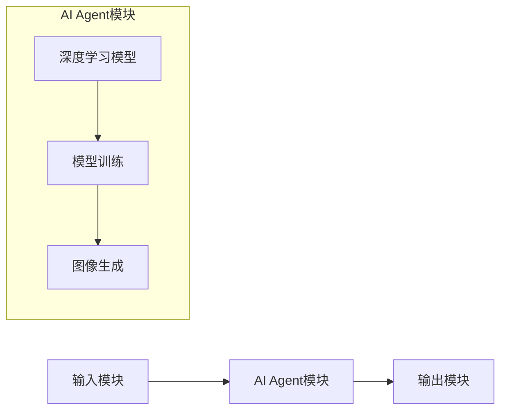

# 企业AI Agent的图像生成技术：产品设计与营销创意

> 关键词：企业AI Agent、图像生成技术、产品设计、营销创意、人工智能

> 摘要：本文聚焦于企业AI Agent的图像生成技术在产品设计与营销创意领域的应用。首先介绍了相关背景，包括目的范围、预期读者等内容。接着深入剖析核心概念与联系，阐述其原理和架构。详细讲解了核心算法原理及具体操作步骤，并结合数学模型和公式进行理论支持。通过项目实战展示代码实际案例并加以解读。探讨了该技术在实际中的应用场景，推荐了相关工具和资源。最后总结了未来发展趋势与挑战，还提供了常见问题解答及扩展阅读参考资料，旨在全面深入地探讨企业AI Agent的图像生成技术对产品设计与营销创意的推动作用和重要意义。

## 1. 背景介绍 
### 1.1 目的和范围
随着人工智能技术的飞速发展，AI Agent的图像生成技术逐渐成为企业在产品设计与营销创意领域的重要工具。本文章的目的在于深入探讨企业AI Agent的图像生成技术的原理、应用和发展趋势，帮助企业更好地理解和应用这一技术，提升产品设计的效率和质量，以及增强营销创意的吸引力和效果。

文章的范围涵盖了企业AI Agent图像生成技术的基本概念、核心算法、数学模型，以及在产品设计与营销创意中的具体应用案例，同时介绍了相关的学习资源、开发工具和研究成果。

### 1.2 预期读者
本文预期读者包括企业的产品设计师、营销人员、技术研发人员、管理人员，以及对人工智能图像生成技术感兴趣的学者和爱好者。产品设计师可以从中获取新的设计思路和方法，营销人员可以借鉴图像生成技术来提升营销创意的水平，技术研发人员可以深入了解算法原理和实现细节，管理人员可以了解该技术对企业发展的战略意义，学者和爱好者可以拓展相关知识领域。

### 1.3 文档结构概述
本文共分为十个部分。第一部分为背景介绍，阐述了文章的目的、范围、预期读者和文档结构概述，同时给出术语表。第二部分介绍核心概念与联系，包括核心概念的原理和架构，并配有文本示意图和Mermaid流程图。第三部分讲解核心算法原理及具体操作步骤，使用Python源代码详细阐述。第四部分介绍数学模型和公式，并进行详细讲解和举例说明。第五部分通过项目实战展示代码实际案例并进行详细解释说明。第六部分探讨实际应用场景。第七部分推荐相关工具和资源，包括学习资源、开发工具框架和相关论文著作。第八部分总结未来发展趋势与挑战。第九部分为附录，提供常见问题与解答。第十部分提供扩展阅读和参考资料。

### 1.4 术语表
#### 1.4.1 核心术语定义
- **企业AI Agent**：指在企业环境中运行的人工智能代理，它能够感知环境、做出决策并执行相应的任务，在图像生成技术中，可根据企业的需求生成特定的图像。
- **图像生成技术**：利用人工智能算法，从给定的输入（如文本描述、图像示例等）生成新的图像的技术。
- **产品设计**：对产品的功能、结构、外观等方面进行规划和设计的过程，AI Agent的图像生成技术可辅助产品设计人员快速生成产品的外观设计方案。
- **营销创意**：在市场营销活动中，为吸引消费者注意力、激发购买欲望而进行的创造性构思和设计，图像生成技术可用于生成具有吸引力的营销图像。

#### 1.4.2 相关概念解释
- **生成对抗网络（GAN）**：一种深度学习模型，由生成器和判别器组成。生成器尝试生成逼真的图像，判别器则尝试区分生成的图像和真实的图像，通过两者的对抗训练，提高生成图像的质量。
- **变分自编码器（VAE）**：一种概率生成模型，它不仅能够生成图像，还能学习图像数据的潜在分布，通过对潜在变量的采样来生成新的图像。
- **自然语言处理（NLP）**：涉及计算机与人类语言之间的交互，在图像生成技术中，可用于将文本描述转换为图像生成的输入。

#### 1.4.3 缩略词列表
- **GAN**：Generative Adversarial Network（生成对抗网络）
- **VAE**：Variational Autoencoder（变分自编码器）
- **NLP**：Natural Language Processing（自然语言处理）

## 2. 核心概念与联系 
### 核心概念原理
企业AI Agent的图像生成技术主要基于深度学习模型，其中生成对抗网络（GAN）和变分自编码器（VAE）是两种常见的模型。

#### 生成对抗网络（GAN）原理
GAN由生成器（Generator）和判别器（Discriminator）两个神经网络组成。生成器的任务是从随机噪声中生成图像，判别器的任务是判断输入的图像是真实图像还是生成器生成的假图像。在训练过程中，生成器和判别器进行对抗训练，生成器不断调整参数以生成更逼真的图像，判别器不断提高判别能力。最终，生成器能够生成高质量的图像。

#### 变分自编码器（VAE）原理
VAE是一种自编码器的扩展，它不仅能够将输入图像编码为潜在空间中的向量，还能学习潜在空间的概率分布。在生成图像时，通过对潜在空间中的向量进行采样，然后将采样得到的向量解码为图像。VAE的优点是能够生成多样化的图像，并且可以对生成图像的风格进行一定的控制。

### 架构的文本示意图
企业AI Agent的图像生成技术架构主要包括输入模块、AI Agent模块和输出模块。

输入模块接收用户的输入，如文本描述、图像示例等。AI Agent模块包含深度学习模型（如GAN或VAE），对输入进行处理和分析，生成图像。输出模块将生成的图像输出给用户。

### Mermaid流程图


## 3. 核心算法原理 & 具体操作步骤 
### 生成对抗网络（GAN）算法原理及Python实现
#### 算法原理
生成对抗网络（GAN）的核心思想是通过生成器和判别器的对抗训练来提高生成图像的质量。生成器接收随机噪声作为输入，生成假图像；判别器接收真实图像和假图像作为输入，判断图像的真实性。在训练过程中，生成器的目标是使判别器将其生成的假图像误判为真实图像，判别器的目标是准确区分真实图像和假图像。

#### Python实现
```python
import torch
import torch.nn as nn
import torch.optim as optim
import torchvision
import torchvision.datasets as datasets
import torchvision.transforms as transforms
from torch.utils.data import DataLoader

# 定义生成器
class Generator(nn.Module):
    def __init__(self, z_dim=100, img_dim=784):
        super(Generator, self).__init__()
        self.gen = nn.Sequential(
            nn.Linear(z_dim, 256),
            nn.LeakyReLU(0.1),
            nn.Linear(256, img_dim),
            nn.Tanh()
        )

    def forward(self, x):
        return self.gen(x)

# 定义判别器
class Discriminator(nn.Module):
    def __init__(self, img_dim=784):
        super(Discriminator, self).__init__()
        self.disc = nn.Sequential(
            nn.Linear(img_dim, 128),
            nn.LeakyReLU(0.1),
            nn.Linear(128, 1),
            nn.Sigmoid()
        )

    def forward(self, x):
        return self.disc(x)

# 超参数设置
device = torch.device("cuda" if torch.cuda.is_available() else "cpu")
lr = 3e-4
z_dim = 100
img_dim = 28 * 28
batch_size = 32
num_epochs = 50

# 加载数据集
transform = transforms.Compose([
    transforms.ToTensor(),
    transforms.Normalize((0.5,), (0.5,))
])
dataset = datasets.MNIST(root='./data', train=True, transform=transform, download=True)
dataloader = DataLoader(dataset, batch_size=batch_size, shuffle=True)

# 初始化生成器和判别器
gen = Generator(z_dim, img_dim).to(device)
disc = Discriminator(img_dim).to(device)

# 定义优化器和损失函数
opt_gen = optim.Adam(gen.parameters(), lr=lr)
opt_disc = optim.Adam(disc.parameters(), lr=lr)
criterion = nn.BCELoss()

# 训练循环
for epoch in range(num_epochs):
    for batch_idx, (real, _) in enumerate(dataloader):
        real = real.view(-1, 784).to(device)
        batch_size = real.shape[0]

        ### 训练判别器
        noise = torch.randn(batch_size, z_dim).to(device)
        fake = gen(noise)
        disc_real = disc(real).view(-1)
        lossD_real = criterion(disc_real, torch.ones_like(disc_real))
        disc_fake = disc(fake.detach()).view(-1)
        lossD_fake = criterion(disc_fake, torch.zeros_like(disc_fake))
        lossD = (lossD_real + lossD_fake) / 2
        disc.zero_grad()
        lossD.backward()
        opt_disc.step()

        ### 训练生成器
        output = disc(fake).view(-1)
        lossG = criterion(output, torch.ones_like(output))
        gen.zero_grad()
        lossG.backward()
        opt_gen.step()

    print(f"Epoch [{epoch + 1}/{num_epochs}] Loss D: {lossD.item():.4f}, Loss G: {lossG.item():.4f}")
```

### 具体操作步骤
1. **数据准备**：收集和整理用于训练的图像数据集，并进行预处理，如归一化、缩放等。
2. **模型定义**：定义生成器和判别器的神经网络结构。
3. **超参数设置**：设置学习率、批量大小、训练轮数等超参数。
4. **训练模型**：在训练过程中，交替训练生成器和判别器，不断调整模型参数。
5. **生成图像**：训练完成后，使用生成器生成图像。

## 4. 数学模型和公式 & 详细讲解 & 举例说明 
### 生成对抗网络（GAN）的数学模型和公式
#### 目标函数
GAN的目标函数可以表示为：
$$
\min_G \max_D V(D, G)=\mathbb{E}_{\mathbf{x} \sim p_{\text {data }}(\mathbf{x})}[\log D(\mathbf{x})]+\mathbb{E}_{\mathbf{z} \sim p_{\mathbf{z}}(\mathbf{z})}[\log (1 - D(G(\mathbf{z})))]
$$
其中，$D(\mathbf{x})$ 表示判别器对真实图像 $\mathbf{x}$ 的判别结果，$G(\mathbf{z})$ 表示生成器根据随机噪声 $\mathbf{z}$ 生成的假图像，$p_{\text {data }}(\mathbf{x})$ 是真实图像的分布，$p_{\mathbf{z}}(\mathbf{z})$ 是随机噪声的分布。

#### 详细讲解
- 对于判别器 $D$，其目标是最大化 $V(D, G)$，即尽可能准确地区分真实图像和假图像。当判别器看到真实图像时，希望 $D(\mathbf{x})$ 接近 1；当看到假图像时，希望 $D(G(\mathbf{z}))$ 接近 0。
- 对于生成器 $G$，其目标是最小化 $V(D, G)$，即生成的假图像能够让判别器误判为真实图像。

#### 举例说明
假设我们有一个简单的二分类问题，真实图像的标签为 1，假图像的标签为 0。判别器的输出是一个概率值，表示输入图像为真实图像的概率。生成器的任务是生成假图像，使得判别器将其误判为真实图像。在训练过程中，判别器不断提高判别能力，生成器不断调整参数以生成更逼真的图像。

### 变分自编码器（VAE）的数学模型和公式
#### 目标函数
VAE的目标函数可以表示为：
$$
\mathcal{L}(\boldsymbol{\theta}, \boldsymbol{\phi} ; \mathbf{x})=\mathbb{E}_{q_{\boldsymbol{\phi}}(\mathbf{z} \mid \mathbf{x})}[\log p_{\boldsymbol{\theta}}(\mathbf{x} \mid \mathbf{z})]-D_{\mathrm{KL}}(q_{\boldsymbol{\phi}}(\mathbf{z} \mid \mathbf{x}) \| p(\mathbf{z}))
$$
其中，$q_{\boldsymbol{\phi}}(\mathbf{z} \mid \mathbf{x})$ 是编码器的分布，$p_{\boldsymbol{\theta}}(\mathbf{x} \mid \mathbf{z})$ 是解码器的分布，$p(\mathbf{z})$ 是潜在变量的先验分布，$D_{\mathrm{KL}}$ 是KL散度。

#### 详细讲解
- 第一项 $\mathbb{E}_{q_{\boldsymbol{\phi}}(\mathbf{z} \mid \mathbf{x})}[\log p_{\boldsymbol{\theta}}(\mathbf{x} \mid \mathbf{z})]$ 表示重构损失，即解码器根据潜在变量 $\mathbf{z}$ 重构输入图像 $\mathbf{x}$ 的能力。
- 第二项 $D_{\mathrm{KL}}(q_{\boldsymbol{\phi}}(\mathbf{z} \mid \mathbf{x}) \| p(\mathbf{z}))$ 表示KL散度，用于约束编码器的分布 $q_{\boldsymbol{\phi}}(\mathbf{z} \mid \mathbf{x})$ 接近潜在变量的先验分布 $p(\mathbf{z})$。

#### 举例说明
假设我们有一张手写数字图像 $\mathbf{x}$，VAE的编码器将其编码为潜在变量 $\mathbf{z}$，解码器根据 $\mathbf{z}$ 重构图像。重构损失衡量重构图像与原始图像的差异，KL散度确保潜在变量的分布符合先验分布。通过优化目标函数，VAE可以学习到图像数据的潜在分布，并生成多样化的图像。

## 5. 项目实战：代码实际案例和详细解释说明 
### 5.1  开发环境搭建
#### 操作系统
推荐使用Linux系统，如Ubuntu 18.04或更高版本，也可以使用Windows 10或macOS。

#### 编程语言和框架
- **Python**：版本3.6或更高版本。
- **PyTorch**：深度学习框架，用于实现生成对抗网络和变分自编码器。
- **torchvision**：用于图像数据的加载和预处理。

#### 安装步骤
1. 安装Python：可以从Python官方网站下载安装包进行安装。
2. 安装PyTorch和torchvision：根据自己的CUDA版本和操作系统，选择合适的安装命令，例如：
```bash
pip install torch torchvision
```

### 5.2  源代码详细实现和代码解读
#### 生成对抗网络（GAN）实现
```python
import torch
import torch.nn as nn
import torch.optim as optim
import torchvision
import torchvision.datasets as datasets
import torchvision.transforms as transforms
from torch.utils.data import DataLoader

# 定义生成器
class Generator(nn.Module):
    def __init__(self, z_dim=100, img_dim=784):
        super(Generator, self).__init__()
        self.gen = nn.Sequential(
            nn.Linear(z_dim, 256),
            nn.LeakyReLU(0.1),
            nn.Linear(256, img_dim),
            nn.Tanh()
        )

    def forward(self, x):
        return self.gen(x)

# 定义判别器
class Discriminator(nn.Module):
    def __init__(self, img_dim=784):
        super(Discriminator, self).__init__()
        self.disc = nn.Sequential(
            nn.Linear(img_dim, 128),
            nn.LeakyReLU(0.1),
            nn.Linear(128, 1),
            nn.Sigmoid()
        )

    def forward(self, x):
        return self.disc(x)

# 超参数设置
device = torch.device("cuda" if torch.cuda.is_available() else "cpu")
lr = 3e-4
z_dim = 100
img_dim = 28 * 28
batch_size = 32
num_epochs = 50

# 加载数据集
transform = transforms.Compose([
    transforms.ToTensor(),
    transforms.Normalize((0.5,), (0.5,))
])
dataset = datasets.MNIST(root='./data', train=True, transform=transform, download=True)
dataloader = DataLoader(dataset, batch_size=batch_size, shuffle=True)

# 初始化生成器和判别器
gen = Generator(z_dim, img_dim).to(device)
disc = Discriminator(img_dim).to(device)

# 定义优化器和损失函数
opt_gen = optim.Adam(gen.parameters(), lr=lr)
opt_disc = optim.Adam(disc.parameters(), lr=lr)
criterion = nn.BCELoss()

# 训练循环
for epoch in range(num_epochs):
    for batch_idx, (real, _) in enumerate(dataloader):
        real = real.view(-1, 784).to(device)
        batch_size = real.shape[0]

        ### 训练判别器
        noise = torch.randn(batch_size, z_dim).to(device)
        fake = gen(noise)
        disc_real = disc(real).view(-1)
        lossD_real = criterion(disc_real, torch.ones_like(disc_real))
        disc_fake = disc(fake.detach()).view(-1)
        lossD_fake = criterion(disc_fake, torch.zeros_like(disc_fake))
        lossD = (lossD_real + lossD_fake) / 2
        disc.zero_grad()
        lossD.backward()
        opt_disc.step()

        ### 训练生成器
        output = disc(fake).view(-1)
        lossG = criterion(output, torch.ones_like(output))
        gen.zero_grad()
        lossG.backward()
        opt_gen.step()

    print(f"Epoch [{epoch + 1}/{num_epochs}] Loss D: {lossD.item():.4f}, Loss G: {lossG.item():.4f}")
```

#### 代码解读
1. **生成器（Generator）**：接收随机噪声作为输入，通过两层全连接层生成假图像。使用LeakyReLU激活函数增加模型的非线性能力，最后使用Tanh激活函数将输出范围限制在[-1, 1]之间。
2. **判别器（Discriminator）**：接收图像作为输入，通过两层全连接层判断图像的真实性。使用LeakyReLU激活函数，最后使用Sigmoid激活函数将输出范围限制在[0, 1]之间，表示图像为真实图像的概率。
3. **数据加载**：使用torchvision加载MNIST手写数字数据集，并进行预处理，将图像归一化到[-1, 1]之间。
4. **训练过程**：
    - **训练判别器**：首先生成随机噪声，通过生成器生成假图像。然后分别计算判别器对真实图像和假图像的损失，将两者平均得到判别器的总损失。最后更新判别器的参数。
    - **训练生成器**：生成随机噪声，通过生成器生成假图像。计算判别器对假图像的损失，目标是让判别器将假图像误判为真实图像。最后更新生成器的参数。

### 5.3  代码解读与分析
#### 损失函数分析
- **判别器损失**：判别器的损失由两部分组成，对真实图像的损失和对假图像的损失。判别器的目标是最大化这两部分损失，即准确区分真实图像和假图像。
- **生成器损失**：生成器的损失是判别器对假图像的损失，生成器的目标是最小化这部分损失，即生成的假图像能够让判别器误判为真实图像。

#### 模型性能分析
- **收敛性**：通过观察训练过程中的损失曲线，可以判断模型是否收敛。如果判别器和生成器的损失都趋于稳定，说明模型已经收敛。
- **生成图像质量**：可以通过观察生成的图像来评估模型的性能。如果生成的图像清晰、逼真，说明模型的性能较好。

## 6. 实际应用场景 
### 产品设计
- **快速原型设计**：企业AI Agent的图像生成技术可以根据产品设计师的需求，快速生成产品的外观设计方案。设计师可以根据生成的图像进行修改和优化，大大缩短产品设计的周期。
- **个性化设计**：通过分析用户的偏好和需求，图像生成技术可以生成个性化的产品设计方案。例如，在服装行业，可以根据用户的身材、肤色、喜好等因素，生成个性化的服装款式。

### 营销创意
- **广告图像生成**：在广告设计中，图像生成技术可以根据广告文案和品牌风格，生成具有吸引力的广告图像。例如，根据产品的特点和目标受众，生成不同风格的海报、横幅等广告素材。
- **虚拟代言人创建**：企业可以使用图像生成技术创建虚拟代言人，用于品牌宣传和营销活动。虚拟代言人可以具有不同的形象和性格，吸引消费者的注意力。

### 电子商务
- **商品图像补充**：在电子商务平台上，有些商品可能没有足够的图像展示。图像生成技术可以根据商品的描述和已有图像，生成补充的商品图像，提高商品的展示效果。
- **用户定制商品展示**：对于定制化商品，图像生成技术可以根据用户的选择，生成定制商品的图像，让用户更直观地看到商品的效果。

## 7. 工具和资源推荐
### 7.1 学习资源推荐
#### 7.1.1 书籍推荐
- 《深度学习》（Deep Learning）：由Ian Goodfellow、Yoshua Bengio和Aaron Courville所著，是深度学习领域的经典教材，涵盖了生成对抗网络、变分自编码器等图像生成技术的相关内容。
- 《Python深度学习》（Deep Learning with Python）：由Francois Chollet所著，介绍了如何使用Python和Keras框架进行深度学习实践，包括图像生成任务。

#### 7.1.2 在线课程
- Coursera上的“深度学习专项课程”（Deep Learning Specialization）：由Andrew Ng教授授课，包含多个深度学习相关的课程，对图像生成技术有详细的讲解。
- edX上的“强化学习基础”（Fundamentals of Reinforcement Learning）：虽然主要是关于强化学习的课程，但其中的一些概念和方法对理解AI Agent的图像生成技术也有帮助。

#### 7.1.3 技术博客和网站
- OpenAI博客（https://openai.com/blog/）：OpenAI发布的关于人工智能最新研究成果和技术进展的博客，其中有很多关于图像生成技术的文章。
- Medium上的AI相关专栏：如Towards Data Science等，有很多数据科学家和工程师分享的图像生成技术的实践经验和案例。

### 7.2 开发工具框架推荐
#### 7.2.1 IDE和编辑器
- PyCharm：一款专业的Python集成开发环境，具有代码编辑、调试、版本控制等功能，适合开发基于Python的图像生成项目。
- Jupyter Notebook：一种交互式的开发环境，适合进行数据探索、模型训练和可视化，对于学习和实践图像生成技术非常方便。

#### 7.2.2 调试和性能分析工具
- TensorBoard：TensorFlow提供的可视化工具，可以用于查看模型的训练过程、损失曲线、图像生成结果等，帮助调试和优化模型。
- PyTorch Profiler：PyTorch提供的性能分析工具，可以帮助分析模型的性能瓶颈，优化代码的运行效率。

#### 7.2.3 相关框架和库
- PyTorch：一个开源的深度学习框架，提供了丰富的神经网络层和优化算法，方便实现图像生成模型。
- TensorFlow：另一个流行的深度学习框架，具有强大的分布式训练和部署能力，也可以用于图像生成任务。
- Stable Diffusion：一个开源的文本到图像生成模型，提供了预训练的模型和API，方便快速实现图像生成功能。

### 7.3 相关论文著作推荐
#### 7.3.1 经典论文
- “Generative Adversarial Nets”（生成对抗网络）：由Ian Goodfellow等人发表，首次提出了生成对抗网络的概念，是图像生成技术领域的经典论文。
- “Auto-Encoding Variational Bayes”（变分自编码器）：由Diederik P. Kingma和Max Welling发表，介绍了变分自编码器的原理和实现方法。

#### 7.3.2 最新研究成果
- “DALL - E 2: Creating Images from Text”：OpenAI关于DALL - E 2模型的研究成果，展示了强大的文本到图像生成能力。
- “Stable Diffusion: High-Resolution Image Synthesis with Latent Diffusion Models”：关于Stable Diffusion模型的研究论文，介绍了该模型的原理和性能。

#### 7.3.3 应用案例分析
- “Using AI - Generated Images in Marketing: A Case Study”：关于在营销中使用AI生成图像的案例分析，介绍了实际应用中的经验和效果。
- “Product Design Innovation with AI Image Generation”：探讨了如何利用AI图像生成技术进行产品设计创新的案例研究。

## 8. 总结：未来发展趋势与挑战
### 未来发展趋势
- **更高质量的图像生成**：随着深度学习技术的不断发展，图像生成的质量将不断提高，生成的图像将更加逼真、清晰，细节更加丰富。
- **多模态融合**：图像生成技术将与自然语言处理、语音识别等技术进行融合，实现更加复杂的任务。例如，根据用户的语音描述生成图像，或者根据图像生成相关的文本描述。
- **个性化定制**：企业AI Agent的图像生成技术将更加注重个性化定制，根据用户的偏好和需求生成个性化的图像。例如，在游戏、动漫等领域，为用户生成个性化的角色形象。
- **实时交互**：未来的图像生成技术将支持实时交互，用户可以在交互过程中不断调整图像的生成结果，实现更加灵活的创作体验。

### 挑战
- **数据隐私和安全**：图像生成技术需要大量的数据进行训练，这些数据可能包含用户的隐私信息。如何保护数据的隐私和安全是一个重要的挑战。
- **模型可解释性**：深度学习模型通常是黑盒模型，其决策过程难以解释。在一些关键应用场景中，如医疗、金融等，模型的可解释性是非常重要的。
- **伦理和法律问题**：AI生成的图像可能会被用于虚假信息传播、恶意攻击等不良行为。如何制定相关的伦理和法律规范，确保图像生成技术的合理使用，是一个亟待解决的问题。

## 9. 附录：常见问题与解答
### 问题1：图像生成技术的训练数据从哪里获取？
- **公开数据集**：可以使用一些公开的图像数据集，如MNIST、CIFAR - 10、ImageNet等。
- **企业内部数据**：企业可以收集和整理自己的图像数据，用于训练适合自己业务需求的图像生成模型。
- **数据合成**：通过数据合成技术，生成一些模拟的图像数据，用于扩充训练数据集。

### 问题2：如何评估图像生成模型的性能？
- **视觉评估**：通过人工观察生成的图像，评估图像的质量、逼真度、多样性等。
- **定量指标**：使用一些定量指标，如Inception Score（IS）、Frechet Inception Distance（FID）等，评估生成图像的质量和与真实图像的相似度。

### 问题3：图像生成技术的计算资源需求大吗？
- 图像生成技术通常需要较大的计算资源，特别是在训练过程中。可以使用GPU加速训练过程，或者使用云计算平台提供的计算资源。

## 10. 扩展阅读 & 参考资料
### 扩展阅读
- 《人工智能简史》：了解人工智能的发展历程和重要里程碑，有助于更好地理解图像生成技术的发展背景。
- 《智能时代》：探讨了人工智能对社会和经济的影响，思考图像生成技术在未来社会中的应用前景。

### 参考资料
- Goodfellow, I. J., et al. (2014). Generative adversarial nets. Advances in neural information processing systems.
- Kingma, D. P., & Welling, M. (2013). Auto-encoding variational bayes. arXiv preprint arXiv:1312.6114.
- OpenAI. (2022). DALL - E 2: Creating Images from Text. [Online]. Available: https://openai.com/blog/dall - e - 2/
- Stability.ai. (2022). Stable Diffusion: High - Resolution Image Synthesis with Latent Diffusion Models. [Online]. Available: https://stability.ai/blog/stable - diffusion - public - release