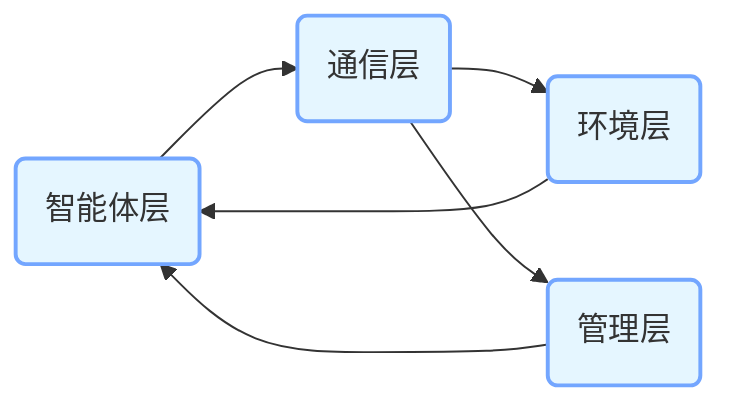

# 企业AI Agent的多智能体系统：协作与竞争策略

> 关键词：企业AI Agent、多智能体系统、协作策略、竞争策略、智能体交互

> 摘要：本文聚焦于企业AI Agent的多智能体系统，深入探讨了其中的协作与竞争策略。首先介绍了多智能体系统的背景知识，包括其目的、预期读者等。接着阐述了核心概念与联系，通过文本示意图和Mermaid流程图展示其架构。详细讲解了核心算法原理，并给出Python源代码示例。运用数学模型和公式对相关理论进行支撑。通过项目实战，给出实际代码案例并详细解释。分析了多智能体系统在企业中的实际应用场景，推荐了学习资源、开发工具框架和相关论文著作。最后总结了未来发展趋势与挑战，提供了常见问题解答和扩展阅读参考资料，旨在为企业在多智能体系统的应用中提供全面而深入的指导。

## 1. 背景介绍 
### 1.1 目的和范围
在当今数字化快速发展的时代，企业面临着越来越复杂的业务环境和激烈的市场竞争。企业AI Agent的多智能体系统作为一种新兴的技术手段，旨在通过多个智能体之间的协作与竞争，提高企业的决策效率、资源利用效率和创新能力。本文章的目的在于深入探讨企业AI Agent多智能体系统中协作与竞争策略的相关理论和实践，范围涵盖了多智能体系统的基本概念、算法原理、数学模型、项目实战、应用场景以及未来发展趋势等多个方面。

### 1.2 预期读者
本文预期读者包括企业的技术管理人员、人工智能领域的研究人员、软件开发工程师以及对企业数字化转型和多智能体系统感兴趣的相关人员。对于技术管理人员，本文可以帮助他们了解多智能体系统在企业中的应用潜力和策略选择；对于研究人员，提供了理论研究的新视角和实践案例；对于软件开发工程师，给出了具体的算法实现和代码示例；对于其他感兴趣的人员，能让他们对企业AI Agent多智能体系统有一个全面的认识。

### 1.3 文档结构概述
本文首先介绍多智能体系统的背景知识，包括目的、预期读者和文档结构概述等内容。接着阐述核心概念与联系，通过文本示意图和Mermaid流程图展示其架构。然后详细讲解核心算法原理，并给出Python源代码示例。运用数学模型和公式对相关理论进行支撑。通过项目实战，给出实际代码案例并详细解释。分析多智能体系统在企业中的实际应用场景，推荐学习资源、开发工具框架和相关论文著作。最后总结未来发展趋势与挑战，提供常见问题解答和扩展阅读参考资料。

### 1.4 术语表
#### 1.4.1 核心术语定义
- **企业AI Agent**：指在企业环境中运行的人工智能智能体，具有一定的自主决策能力和学习能力，能够感知环境信息并采取相应的行动来实现企业的目标。
- **多智能体系统（Multi - Agent System, MAS）**：由多个智能体组成的系统，这些智能体之间可以进行交互和协作，共同完成一个或多个复杂的任务。
- **协作策略**：智能体之间为了实现共同目标而采取的合作方式和方法，包括信息共享、任务分配、资源协调等。
- **竞争策略**：智能体之间为了争夺有限的资源或获得更好的收益而采取的竞争方式和方法，如价格竞争、市场份额竞争等。

#### 1.4.2 相关概念解释
- **智能体交互**：智能体之间通过某种通信机制进行信息交换和行为协调的过程。
- **自主决策**：智能体根据自身的目标、感知信息和内部状态，独立地做出决策和行动的能力。
- **学习能力**：智能体能够从环境中获取经验，并根据这些经验调整自己的行为和策略的能力。

#### 1.4.3 缩略词列表
- **MAS**：Multi - Agent System（多智能体系统）
- **AI**：Artificial Intelligence（人工智能）

## 2. 核心概念与联系 
### 核心概念原理
企业AI Agent的多智能体系统基于智能体理论和分布式计算思想。每个智能体都有自己的目标、知识和能力，它们可以在一定的环境中感知信息、做出决策并采取行动。智能体之间通过通信机制进行交互，根据不同的情况选择协作或竞争策略。

在协作场景中，智能体之间共享信息、协调任务和资源，以实现共同的目标。例如，在企业的供应链管理中，不同环节的智能体可以协作完成订单处理、库存管理和物流配送等任务。

在竞争场景中，智能体为了争夺有限的资源或获得更好的收益，会采取各种竞争策略。例如，在市场竞争中，不同企业的智能体可能会通过降低价格、提高产品质量等方式来争夺市场份额。

### 架构的文本示意图
企业AI Agent的多智能体系统架构主要包括以下几个部分：
1. **智能体层**：由多个企业AI Agent组成，每个智能体具有独立的决策和行动能力。
2. **通信层**：负责智能体之间的信息传递和交互，采用合适的通信协议和接口。
3. **环境层**：智能体所处的外部环境，包括市场环境、企业内部环境等，智能体通过感知环境信息来做出决策。
4. **管理层**：对整个多智能体系统进行管理和协调，包括任务分配、资源调度、策略制定等。

### Mermaid流程图


## 3. 核心算法原理 & 具体操作步骤 
### 核心算法原理
在企业AI Agent的多智能体系统中，常用的算法包括强化学习算法、博弈论算法等。下面以强化学习算法为例进行详细讲解。

强化学习是一种通过智能体与环境进行交互，不断尝试不同的行动并根据环境反馈的奖励信号来学习最优策略的算法。在多智能体系统中，每个智能体都可以看作是一个独立的强化学习智能体，通过与其他智能体和环境进行交互来学习协作或竞争策略。

### 具体操作步骤
1. **定义智能体的状态空间**：智能体的状态空间包括环境信息、自身状态和其他智能体的状态等。例如，在企业供应链管理中，智能体的状态可以包括库存水平、订单数量、物流状态等。
2. **定义智能体的动作空间**：智能体的动作空间包括可以采取的所有行动。例如，在市场竞争中，智能体的动作可以包括调整价格、推出新产品、进行广告宣传等。
3. **定义奖励函数**：奖励函数用于评估智能体采取某个行动后所获得的收益。在协作场景中，奖励函数可以根据共同目标的完成情况来定义；在竞争场景中，奖励函数可以根据自身的收益或市场份额来定义。
4. **选择合适的强化学习算法**：常用的强化学习算法包括Q - learning、Deep Q - Network (DQN)等。
5. **训练智能体**：智能体通过不断与环境进行交互，根据奖励信号更新自己的策略，直到收敛到最优策略。

### Python源代码示例
```python
import numpy as np

# 定义状态空间和动作空间
state_space = 10
action_space = 5

# 初始化Q表
Q_table = np.zeros((state_space, action_space))

# 定义超参数
alpha = 0.1  # 学习率
gamma = 0.9  # 折扣因子
epsilon = 0.1  # 探索率

# 定义奖励函数（示例）
def reward_function(state, action):
    if state == 0 and action == 1:
        return 10
    else:
        return -1

# 定义智能体的动作选择策略
def choose_action(state):
    if np.random.uniform(0, 1) < epsilon:
        action = np.random.choice(action_space)
    else:
        action = np.argmax(Q_table[state, :])
    return action

# 训练智能体
num_episodes = 1000
for episode in range(num_episodes):
    state = np.random.randint(0, state_space)
    done = False
    while not done:
        action = choose_action(state)
        reward = reward_function(state, action)
        next_state = np.random.randint(0, state_space)  # 简单示例，实际中根据环境动态变化
        Q_table[state, action] = Q_table[state, action] + alpha * (reward + gamma * np.max(Q_table[next_state, :]) - Q_table[state, action])
        state = next_state
        if reward == 10:
            done = True

print("训练完成后的Q表：")
print(Q_table)
```

## 4. 数学模型和公式 & 详细讲解 & 举例说明 
### 数学模型
在强化学习中，常用的数学模型是马尔可夫决策过程（Markov Decision Process, MDP）。一个MDP可以用一个五元组 $<S, A, P, R, \gamma>$ 来表示，其中：
- $S$ 是状态空间，表示智能体可能处于的所有状态。
- $A$ 是动作空间，表示智能体可以采取的所有行动。
- $P$ 是状态转移概率，表示在状态 $s$ 采取动作 $a$ 后转移到状态 $s'$ 的概率，即 $P(s'|s, a)$。
- $R$ 是奖励函数，表示在状态 $s$ 采取动作 $a$ 后获得的奖励，即 $R(s, a)$。
- $\gamma$ 是折扣因子，用于平衡当前奖励和未来奖励的重要性，取值范围为 $[0, 1]$。

### 公式
在Q - learning算法中，Q值的更新公式为：
$$Q(s, a) = Q(s, a) + \alpha [R(s, a) + \gamma \max_{a'} Q(s', a') - Q(s, a)]$$
其中：
- $Q(s, a)$ 表示在状态 $s$ 采取动作 $a$ 的Q值。
- $\alpha$ 是学习率，控制每次更新的步长。
- $R(s, a)$ 是在状态 $s$ 采取动作 $a$ 后获得的奖励。
- $\gamma$ 是折扣因子。
- $s'$ 是采取动作 $a$ 后转移到的下一个状态。

### 详细讲解
Q - learning算法的核心思想是通过不断更新Q值来学习最优策略。在每个时间步，智能体根据当前的Q表选择一个动作，执行该动作后获得奖励和下一个状态，然后根据Q值更新公式更新Q表。通过多次迭代，Q表逐渐收敛到最优Q值，智能体也就学习到了最优策略。

### 举例说明
假设一个简单的机器人导航问题，机器人在一个二维网格世界中移动，目标是到达网格的某个特定位置。状态空间 $S$ 可以表示机器人在网格中的位置，动作空间 $A$ 可以包括向上、向下、向左、向右移动。奖励函数 $R$ 可以定义为：如果机器人到达目标位置，获得正奖励；如果撞到障碍物或超出网格范围，获得负奖励；其他情况获得零奖励。

初始时，Q表中的所有Q值都为零。机器人在每个时间步根据Q表选择一个动作，执行动作后更新Q表。例如，机器人在状态 $s$ 选择动作 $a$ 移动到下一个状态 $s'$，获得奖励 $R(s, a)$，然后根据Q值更新公式更新 $Q(s, a)$。经过多次迭代，机器人就可以学习到从任意初始位置到达目标位置的最优路径。

## 5. 项目实战：代码实际案例和详细解释说明 
### 5.1  开发环境搭建
1. **安装Python**：建议使用Python 3.7及以上版本，可以从Python官方网站（https://www.python.org/downloads/）下载安装。
2. **安装必要的库**：在本项目中，我们使用`numpy`库进行数值计算，可以使用以下命令进行安装：
```sh
pip install numpy
```

### 5.2  源代码详细实现和代码解读
```python
import numpy as np

# 定义状态空间和动作空间
state_space = 10
action_space = 5

# 初始化Q表
Q_table = np.zeros((state_space, action_space))

# 定义超参数
alpha = 0.1  # 学习率
gamma = 0.9  # 折扣因子
epsilon = 0.1  # 探索率

# 定义奖励函数（示例）
def reward_function(state, action):
    if state == 0 and action == 1:
        return 10
    else:
        return -1

# 定义智能体的动作选择策略
def choose_action(state):
    if np.random.uniform(0, 1) < epsilon:
        action = np.random.choice(action_space)
    else:
        action = np.argmax(Q_table[state, :])
    return action

# 训练智能体
num_episodes = 1000
for episode in range(num_episodes):
    state = np.random.randint(0, state_space)
    done = False
    while not done:
        action = choose_action(state)
        reward = reward_function(state, action)
        next_state = np.random.randint(0, state_space)  # 简单示例，实际中根据环境动态变化
        Q_table[state, action] = Q_table[state, action] + alpha * (reward + gamma * np.max(Q_table[next_state, :]) - Q_table[state, action])
        state = next_state
        if reward == 10:
            done = True

print("训练完成后的Q表：")
print(Q_table)
```

### 代码解读与分析
1. **状态空间和动作空间的定义**：`state_space = 10` 和 `action_space = 5` 分别定义了状态空间的大小和动作空间的大小。
2. **Q表的初始化**：`Q_table = np.zeros((state_space, action_space))` 初始化了一个全零的Q表，用于存储每个状态 - 动作对的Q值。
3. **超参数的定义**：
    - `alpha = 0.1`：学习率，控制每次更新Q值的步长。
    - `gamma = 0.9`：折扣因子，平衡当前奖励和未来奖励的重要性。
    - `epsilon = 0.1`：探索率，用于控制智能体的探索和利用行为。
4. **奖励函数的定义**：`reward_function` 函数根据状态和动作返回相应的奖励值。
5. **动作选择策略的定义**：`choose_action` 函数根据探索率选择随机动作或根据Q表选择最优动作。
6. **智能体的训练**：通过多个回合的训练，智能体不断与环境进行交互，根据Q值更新公式更新Q表，直到收敛到最优策略。

## 6. 实际应用场景 
### 供应链管理
在企业的供应链管理中，多智能体系统可以用于协调供应商、生产商、经销商和零售商之间的活动。不同环节的智能体可以协作完成订单处理、库存管理、物流配送等任务。例如，供应商智能体可以根据生产商智能体的需求预测，提前安排生产和供货；生产商智能体可以根据经销商智能体的订单信息，合理安排生产计划；经销商智能体和零售商智能体可以协作进行市场推广和销售活动。

### 市场竞争
在市场竞争中，多智能体系统可以用于模拟不同企业之间的竞争行为。每个企业的智能体可以根据市场环境、竞争对手的策略和自身的目标，选择合适的竞争策略。例如，企业智能体可以通过调整价格、推出新产品、进行广告宣传等方式来争夺市场份额。同时，智能体之间也可以通过协作来实现资源共享、技术合作等，提高整个行业的竞争力。

### 企业决策支持
多智能体系统可以为企业的决策提供支持。不同领域的智能体可以根据自己的专业知识和信息，为企业决策提供建议和方案。例如，财务智能体可以分析企业的财务状况，提供投资、融资等方面的建议；市场智能体可以分析市场趋势，提供市场推广、产品定位等方面的建议；人力资源智能体可以分析企业的人力资源状况，提供招聘、培训等方面的建议。

## 7. 工具和资源推荐
### 7.1 学习资源推荐
#### 7.1.1 书籍推荐
- 《多智能体系统：原理与编程》：本书系统地介绍了多智能体系统的基本概念、理论和技术，包括智能体的建模、通信、协作和协调等方面，是学习多智能体系统的经典教材。
- 《强化学习：原理与Python实现》：详细介绍了强化学习的基本原理和算法，通过Python代码示例帮助读者理解和应用强化学习算法，对于学习企业AI Agent多智能体系统中的强化学习算法有很大的帮助。

#### 7.1.2 在线课程
- Coursera上的“Multi - Agent Systems”课程：由知名高校的教授授课，系统地介绍了多智能体系统的理论和应用，包括智能体的建模、通信、协作和协调等方面。
- edX上的“Reinforcement Learning”课程：深入讲解了强化学习的基本原理和算法，通过实际案例和编程作业帮助学生掌握强化学习的应用。

#### 7.1.3 技术博客和网站
- AI Stack Exchange：一个关于人工智能的问答社区，用户可以在这里提问、回答问题和分享经验，对于解决多智能体系统和强化学习中的技术问题很有帮助。
- Medium上的人工智能相关博客：许多人工智能领域的专家和从业者会在Medium上分享他们的研究成果和实践经验，对于了解多智能体系统的最新发展动态很有帮助。

### 7.2 开发工具框架推荐
#### 7.2.1 IDE和编辑器
- PyCharm：一款专业的Python集成开发环境，具有代码编辑、调试、版本控制等功能，对于开发企业AI Agent多智能体系统的Python代码非常方便。
- Visual Studio Code：一款轻量级的代码编辑器，支持多种编程语言和插件扩展，适合快速开发和调试多智能体系统的代码。

#### 7.2.2 调试和性能分析工具
- pdb：Python自带的调试工具，可以帮助开发者在代码中设置断点、单步执行代码、查看变量值等，方便调试多智能体系统的代码。
- cProfile：Python的性能分析工具，可以帮助开发者分析代码的执行时间和性能瓶颈，优化多智能体系统的性能。

#### 7.2.3 相关框架和库
- Mesa：一个用于构建基于智能体的模型的Python框架，提供了智能体的建模、交互和可视化等功能，适合开发企业AI Agent多智能体系统。
- OpenAI Gym：一个用于开发和比较强化学习算法的工具包，提供了多种环境和任务，方便开发者测试和验证多智能体系统中的强化学习算法。

### 7.3 相关论文著作推荐
#### 7.3.1 经典论文
- “Multi - Agent Systems: A Modern Approach to Distributed Artificial Intelligence”：该论文系统地介绍了多智能体系统的基本概念、理论和技术，是多智能体系统领域的经典论文之一。
- “Q - learning”：该论文首次提出了Q - learning算法，是强化学习领域的经典论文之一，对于理解和应用多智能体系统中的强化学习算法有重要的参考价值。

#### 7.3.2 最新研究成果
- 每年在人工智能领域的顶级会议（如AAAI、IJCAI等）上发表的关于多智能体系统的研究论文，这些论文反映了多智能体系统领域的最新研究成果和发展趋势。
- 相关学术期刊（如Artificial Intelligence、Journal of Artificial Intelligence Research等）上发表的关于多智能体系统的研究论文。

#### 7.3.3 应用案例分析
- 一些企业和研究机构发表的关于多智能体系统在实际应用中的案例分析报告，这些报告可以帮助读者了解多智能体系统在不同领域的应用场景和实践经验。

## 8. 总结：未来发展趋势与挑战
### 未来发展趋势
1. **与其他技术的融合**：企业AI Agent的多智能体系统将与区块链、物联网、大数据等技术深度融合，实现更加安全、高效、智能的协作和竞争。例如，区块链技术可以为多智能体系统提供可信的分布式账本，保障智能体之间的信息安全和交易可信；物联网技术可以为多智能体系统提供更丰富的环境感知信息，提高智能体的决策能力；大数据技术可以为多智能体系统提供数据分析和挖掘支持，帮助智能体更好地理解市场和用户需求。
2. **更加复杂的协作和竞争策略**：随着企业业务环境的日益复杂，多智能体系统中的智能体将需要采用更加复杂的协作和竞争策略。例如，智能体之间可能会形成动态联盟，根据不同的任务和目标进行灵活的协作和竞争；智能体可能会采用多层次的策略，包括短期策略和长期策略，以实现企业的可持续发展。
3. **智能体的个性化和自适应**：未来的智能体将具有更强的个性化和自适应能力。每个智能体可以根据自身的特点和目标，学习和调整自己的行为和策略；智能体可以根据环境的变化和其他智能体的行为，实时调整自己的协作和竞争策略，以适应不断变化的市场环境。

### 挑战
1. **智能体的信任和安全问题**：在多智能体系统中，智能体之间需要进行信息共享和协作，因此信任和安全问题至关重要。如何确保智能体之间的信息安全、防止恶意攻击和数据泄露，是多智能体系统面临的一个重要挑战。
2. **复杂环境下的决策和协调问题**：企业的业务环境通常非常复杂，智能体需要在不确定和动态变化的环境中做出决策和协调行动。如何提高智能体在复杂环境下的决策能力和协调能力，是多智能体系统需要解决的一个关键问题。
3. **伦理和法律问题**：随着多智能体系统的广泛应用，伦理和法律问题也日益凸显。例如，智能体的决策和行为可能会对人类社会产生影响，如何确保智能体的行为符合伦理和法律规范，是一个需要深入研究的问题。

## 9. 附录：常见问题与解答
### 问题1：多智能体系统中的智能体是如何进行通信的？
解答：多智能体系统中的智能体可以通过多种方式进行通信，常见的通信方式包括消息传递、共享内存、黑板系统等。消息传递是最常用的通信方式，智能体之间通过发送和接收消息来交换信息。共享内存方式是指智能体共享一块内存区域，通过读写该内存区域来进行信息交换。黑板系统是一种基于共享数据结构的通信方式，智能体可以在黑板上发布和获取信息。

### 问题2：如何选择合适的强化学习算法用于多智能体系统？
解答：选择合适的强化学习算法需要考虑多个因素，包括问题的复杂度、智能体的数量、环境的动态性等。对于简单的问题，可以选择Q - learning等传统的强化学习算法；对于复杂的问题，可以选择Deep Q - Network (DQN)、Actor - Critic等深度强化学习算法。同时，还需要考虑算法的收敛性、稳定性和计算效率等因素。

### 问题3：多智能体系统在实际应用中可能会遇到哪些问题？
解答：多智能体系统在实际应用中可能会遇到以下问题：智能体的决策冲突、信息不一致、通信延迟、资源竞争等。为了解决这些问题，需要设计合理的协作和竞争策略，采用有效的冲突解决机制和信息协调机制，优化通信协议和资源分配算法等。

## 10. 扩展阅读 & 参考资料
### 扩展阅读
- 《人工智能：一种现代方法》：全面介绍了人工智能的基本概念、理论和技术，对于深入理解企业AI Agent的多智能体系统有很大的帮助。
- 《博弈论与信息经济学》：介绍了博弈论的基本原理和应用，对于理解多智能体系统中的竞争策略有重要的参考价值。

### 参考资料
1. Shoham, Y., & Leyton - Brown, K. (2008). Multi - Agent Systems: Algorithmic, Game - Theoretic, and Logical Foundations. Cambridge University Press.
2. Sutton, R. S., & Barto, A. G. (2018). Reinforcement Learning: An Introduction. MIT Press.
3. Russell, S. J., & Norvig, P. (2016). Artificial Intelligence: A Modern Approach. Pearson.