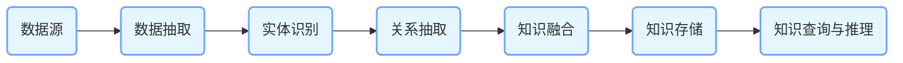

# 企业AI Agent的知识图谱构建与应用

> 关键词：企业AI Agent、知识图谱、构建方法、应用场景、语义网络

> 摘要：本文聚焦于企业AI Agent的知识图谱构建与应用。首先阐述了在企业智能化发展的背景下，知识图谱对于AI Agent的重要性。接着详细介绍了知识图谱的核心概念、相关算法原理、数学模型等内容。通过实际项目案例展示了知识图谱的构建过程和代码实现。探讨了其在企业多个领域的实际应用场景，同时推荐了相关的学习资源、开发工具和论文著作。最后对企业AI Agent知识图谱的未来发展趋势与挑战进行了总结，并提供了常见问题解答和参考资料，旨在为企业更好地利用知识图谱提升AI Agent的性能和应用效果提供全面的技术指导。

## 1. 背景介绍 
### 1.1 目的和范围
在当今数字化和智能化的时代，企业面临着海量的数据和复杂的业务场景。企业AI Agent作为一种智能化的助手，能够帮助企业更高效地处理信息、做出决策。知识图谱作为一种强大的知识表示和管理工具，可以为AI Agent提供丰富的语义信息，使其更好地理解企业内外部的知识。本文的目的在于深入探讨企业AI Agent的知识图谱构建方法和应用场景，范围涵盖知识图谱的基本概念、构建技术、算法原理、数学模型、实际项目案例以及相关工具和资源推荐等方面。

### 1.2 预期读者
本文预期读者包括企业的技术决策者、AI开发人员、数据科学家、知识工程师以及对企业智能化和知识图谱感兴趣的研究人员。通过阅读本文，读者可以了解企业AI Agent知识图谱的相关理论和实践，为其在企业中的应用提供技术支持和思路启发。

### 1.3 文档结构概述
本文首先介绍知识图谱的背景信息，包括目的、预期读者和文档结构概述等。接着详细阐述知识图谱的核心概念和相关联系，通过文本示意图和Mermaid流程图进行展示。然后讲解核心算法原理和具体操作步骤，结合Python源代码进行说明。随后介绍知识图谱的数学模型和公式，并通过举例进行详细讲解。通过实际项目案例展示知识图谱的构建过程和代码实现。探讨知识图谱在企业中的实际应用场景。推荐相关的学习资源、开发工具和论文著作。最后对企业AI Agent知识图谱的未来发展趋势与挑战进行总结，并提供常见问题解答和参考资料。

### 1.4 术语表
#### 1.4.1 核心术语定义
- **企业AI Agent**：是指在企业环境中运行的人工智能代理，能够感知环境、做出决策并采取行动，以实现企业的特定目标。
- **知识图谱**：是一种用图模型来描述知识和建模世界万物之间关联关系的技术方法，由实体、关系和属性组成。
- **实体**：是知识图谱中的基本对象，代表现实世界中的事物，如人、组织、产品等。
- **关系**：表示实体之间的联系，如“属于”、“合作”、“生产”等。
- **属性**：描述实体的特征和性质，如“姓名”、“年龄”、“价格”等。

#### 1.4.2 相关概念解释
- **语义网络**：是一种知识表示方法，通过节点和边来表示概念和概念之间的关系，与知识图谱有相似之处，但知识图谱更强调结构化和语义化。
- **本体**：是对概念化的明确说明，定义了领域内的概念、关系和属性，为知识图谱的构建提供了语义基础。
- **三元组**：是知识图谱的基本表示形式，由（实体1，关系，实体2）或（实体，属性，属性值）组成。

#### 1.4.3 缩略词列表
- **RDF**：Resource Description Framework，资源描述框架，是一种用于表示知识图谱的标准数据模型。
- **OWL**：Web Ontology Language，网络本体语言，用于定义本体和知识图谱的语义。
- **SPARQL**：SPARQL Protocol and RDF Query Language，是一种用于查询RDF数据的语言。

## 2. 核心概念与联系 

### 知识图谱的基本原理
知识图谱的核心思想是将现实世界中的各种实体及其关系以图的形式表示出来。每个实体作为图中的节点，实体之间的关系作为边，实体的属性作为节点的附加信息。通过这种方式，可以将复杂的知识结构化，便于计算机进行处理和理解。

### 知识图谱的架构
知识图谱的架构通常包括数据层和模式层。数据层是由一系列的三元组组成，存储了具体的知识。模式层定义了知识图谱的本体结构，包括实体类型、关系类型和属性类型等，为数据层提供了语义约束。

### 文本示意图
知识图谱的基本结构可以用以下文本示意图表示：

```plaintext
实体1 -[关系1]-> 实体2
|
| 属性1: 属性值1
| 属性2: 属性值2
```

### Mermaid流程图


这个流程图展示了知识图谱的构建和应用过程。首先从各种数据源中抽取数据，然后进行实体识别和关系抽取，将抽取的知识进行融合，存储到知识图谱中，最后可以进行知识查询和推理。

## 3. 核心算法原理 & 具体操作步骤 

### 实体识别算法
实体识别是知识图谱构建的重要步骤，其目的是从文本中识别出实体。常见的实体识别算法有基于规则的方法、基于机器学习的方法和基于深度学习的方法。

#### 基于规则的方法
基于规则的方法通过手工编写规则来识别实体。例如，在一个企业文档中，可以通过正则表达式来识别公司名称、产品名称等实体。以下是一个简单的Python示例：

```python
import re

text = "苹果公司推出了新款iPhone 14手机。"
company_pattern = re.compile(r'[^\s]+公司')
product_pattern = re.compile(r'iPhone \d+')

company_entities = company_pattern.findall(text)
product_entities = product_pattern.findall(text)

print("公司实体:", company_entities)
print("产品实体:", product_entities)
```

#### 基于机器学习的方法
基于机器学习的方法通常使用分类器来进行实体识别。常见的分类器有朴素贝叶斯、支持向量机等。以下是一个使用Python的`scikit-learn`库进行简单实体识别的示例：

```python
from sklearn.feature_extraction.text import CountVectorizer
from sklearn.naive_bayes import MultinomialNB

# 训练数据
train_texts = ["苹果公司是一家知名企业", "华为公司专注于通信技术"]
train_labels = ["公司", "公司"]

# 特征提取
vectorizer = CountVectorizer()
X_train = vectorizer.fit_transform(train_texts)

# 训练分类器
clf = MultinomialNB()
clf.fit(X_train, train_labels)

# 测试数据
test_text = "小米公司推出了新手机"
X_test = vectorizer.transform([test_text])

# 预测
predicted_label = clf.predict(X_test)
print("预测实体类型:", predicted_label[0])
```

#### 基于深度学习的方法
基于深度学习的方法通常使用循环神经网络（RNN）、长短期记忆网络（LSTM）或卷积神经网络（CNN）等模型。以下是一个使用`PyTorch`实现的简单LSTM实体识别模型示例：

```python
import torch
import torch.nn as nn
import torch.optim as optim

# 定义LSTM模型
class LSTMEntityRecognizer(nn.Module):
    def __init__(self, vocab_size, embedding_dim, hidden_dim, output_dim):
        super(LSTMEntityRecognizer, self).__init__()
        self.embedding = nn.Embedding(vocab_size, embedding_dim)
        self.lstm = nn.LSTM(embedding_dim, hidden_dim, batch_first=True)
        self.fc = nn.Linear(hidden_dim, output_dim)

    def forward(self, x):
        embedded = self.embedding(x)
        lstm_out, _ = self.lstm(embedded)
        output = self.fc(lstm_out[:, -1, :])
        return output

# 示例数据
vocab_size = 1000
embedding_dim = 100
hidden_dim = 128
output_dim = 2
model = LSTMEntityRecognizer(vocab_size, embedding_dim, hidden_dim, output_dim)

# 定义损失函数和优化器
criterion = nn.CrossEntropyLoss()
optimizer = optim.Adam(model.parameters(), lr=0.001)

# 训练模型（此处省略具体训练过程）
```

### 关系抽取算法
关系抽取的目的是识别实体之间的关系。常见的关系抽取算法有基于规则的方法、基于监督学习的方法和基于远程监督的方法。

#### 基于规则的方法
基于规则的方法通过手工编写规则来抽取关系。例如，在一个企业文档中，如果出现“XX公司生产了XX产品”，可以抽取“生产”关系。以下是一个简单的Python示例：

```python
text = "苹果公司生产了iPhone 14手机。"
if "生产了" in text:
    parts = text.split("生产了")
    company = parts[0].strip()
    product = parts[1].strip()
    print(f"关系: {company} - 生产 - {product}")
```

#### 基于监督学习的方法
基于监督学习的方法通常使用分类器来进行关系抽取。常见的分类器有逻辑回归、决策树等。以下是一个使用Python的`scikit-learn`库进行简单关系抽取的示例：

```python
from sklearn.feature_extraction.text import TfidfVectorizer
from sklearn.linear_model import LogisticRegression

# 训练数据
train_texts = ["苹果公司生产了iPhone 14手机", "华为公司研发了5G技术"]
train_labels = ["生产", "研发"]

# 特征提取
vectorizer = TfidfVectorizer()
X_train = vectorizer.fit_transform(train_texts)

# 训练分类器
clf = LogisticRegression()
clf.fit(X_train, train_labels)

# 测试数据
test_text = "小米公司生产了新手机"
X_test = vectorizer.transform([test_text])

# 预测
predicted_relation = clf.predict(X_test)
print("预测关系:", predicted_relation[0])
```

#### 基于远程监督的方法
基于远程监督的方法利用已有的知识库自动标注训练数据。例如，可以利用维基百科等知识库中的信息来标注文本中的实体关系。以下是一个简单的远程监督关系抽取的思路示例：

```python
# 假设已有知识库
knowledge_base = {
    ("苹果公司", "iPhone 14"): "生产"
}

text = "苹果公司生产了iPhone 14手机。"
# 实体识别（此处省略具体实体识别过程）
entities = ["苹果公司", "iPhone 14"]
if tuple(entities) in knowledge_base:
    relation = knowledge_base[tuple(entities)]
    print(f"远程监督抽取关系: {entities[0]} - {relation} - {entities[1]}")
```

### 知识融合算法
知识融合的目的是将不同来源的知识进行整合，消除冲突和冗余。常见的知识融合算法有基于相似度的方法和基于本体的方法。

#### 基于相似度的方法
基于相似度的方法通过计算实体之间的相似度来判断是否为同一实体。常见的相似度计算方法有编辑距离、余弦相似度等。以下是一个使用编辑距离进行实体融合的Python示例：

```python
import Levenshtein

entity1 = "苹果公司"
entity2 = "蘋果公司"
distance = Levenshtein.distance(entity1, entity2)
if distance < 3:
    print(f"{entity1} 和 {entity2} 可能是同一实体")
```

#### 基于本体的方法
基于本体的方法利用本体的语义信息来进行知识融合。例如，在本体中定义了实体的类型和关系，通过比较实体的类型和关系来判断是否可以融合。以下是一个简单的基于本体的知识融合思路示例：

```python
# 假设已有本体
ontology = {
    "苹果公司": {"类型": "公司", "关系": ["生产"]},
    "蘋果公司": {"类型": "公司", "关系": ["生产"]}
}

entity1 = "苹果公司"
entity2 = "蘋果公司"
if ontology[entity1]["类型"] == ontology[entity2]["类型"] and ontology[entity1]["关系"] == ontology[entity2]["关系"]:
    print(f"{entity1} 和 {entity2} 可以融合")
```

## 4. 数学模型和公式 & 详细讲解 & 举例说明 

### 向量空间模型
向量空间模型是知识图谱中常用的数学模型，用于将实体和关系表示为向量。在向量空间模型中，每个实体和关系都可以表示为一个向量，通过计算向量之间的相似度来衡量实体和关系之间的语义关系。

#### 向量相似度计算
常见的向量相似度计算方法有余弦相似度、欧几里得距离等。

- **余弦相似度**：余弦相似度用于衡量两个向量的夹角余弦值，其计算公式为：
$$
\cos(\vec{a}, \vec{b}) = \frac{\vec{a} \cdot \vec{b}}{\|\vec{a}\| \|\vec{b}\|}
$$
其中，$\vec{a}$ 和 $\vec{b}$ 是两个向量，$\vec{a} \cdot \vec{b}$ 是向量的点积，$\|\vec{a}\|$ 和 $\|\vec{b}\|$ 分别是向量的模。

以下是一个使用Python计算余弦相似度的示例：

```python
import numpy as np

a = np.array([1, 2, 3])
b = np.array([4, 5, 6])

dot_product = np.dot(a, b)
norm_a = np.linalg.norm(a)
norm_b = np.linalg.norm(b)

cosine_similarity = dot_product / (norm_a * norm_b)
print("余弦相似度:", cosine_similarity)
```

- **欧几里得距离**：欧几里得距离用于衡量两个向量之间的直线距离，其计算公式为：
$$
d(\vec{a}, \vec{b}) = \sqrt{\sum_{i=1}^{n} (a_i - b_i)^2}
$$
其中，$\vec{a}$ 和 $\vec{b}$ 是两个向量，$a_i$ 和 $b_i$ 分别是向量的第 $i$ 个分量，$n$ 是向量的维度。

以下是一个使用Python计算欧几里得距离的示例：

```python
import numpy as np

a = np.array([1, 2, 3])
b = np.array([4, 5, 6])

euclidean_distance = np.linalg.norm(a - b)
print("欧几里得距离:", euclidean_distance)
```

### 概率图模型
概率图模型是一种用于表示变量之间概率关系的数学模型，在知识图谱中可以用于知识推理和不确定性处理。常见的概率图模型有贝叶斯网络和马尔可夫随机场。

#### 贝叶斯网络
贝叶斯网络是一种有向无环图，节点表示随机变量，边表示变量之间的依赖关系。贝叶斯网络的联合概率分布可以表示为：
$$
P(X_1, X_2, \cdots, X_n) = \prod_{i=1}^{n} P(X_i | \text{Parents}(X_i))
$$
其中，$X_1, X_2, \cdots, X_n$ 是随机变量，$\text{Parents}(X_i)$ 是 $X_i$ 的父节点。

以下是一个简单的贝叶斯网络示例：

假设有三个变量 $A$、$B$ 和 $C$，其中 $A$ 是 $B$ 的父节点，$B$ 是 $C$ 的父节点。则联合概率分布为：
$$
P(A, B, C) = P(A) P(B | A) P(C | B)
$$

#### 马尔可夫随机场
马尔可夫随机场是一种无向图模型，节点表示随机变量，边表示变量之间的依赖关系。马尔可夫随机场的联合概率分布可以表示为：
$$
P(X) = \frac{1}{Z} \prod_{c \in \mathcal{C}} \psi_c(X_c)
$$
其中，$X$ 是随机变量集合，$\mathcal{C}$ 是图中的团集合，$\psi_c(X_c)$ 是团 $c$ 上的势函数，$Z$ 是归一化常数。

### 张量分解模型
张量分解模型是一种用于将高维张量分解为低维张量的数学模型，在知识图谱中可以用于知识表示和推理。常见的张量分解模型有RESCAL、DistMult等。

#### RESCAL模型
RESCAL模型将知识图谱中的三元组 $(h, r, t)$ 表示为一个三维张量 $\mathcal{X} \in \mathbb{R}^{n \times n \times m}$，其中 $n$ 是实体的数量，$m$ 是关系的数量。RESCAL模型的目标是将张量 $\mathcal{X}$ 分解为三个矩阵 $A \in \mathbb{R}^{n \times k}$、$R_r \in \mathbb{R}^{k \times k}$ 和 $A^T \in \mathbb{R}^{k \times n}$，使得：
$$
\mathcal{X}_{hrt} \approx \mathbf{a}_h^T R_r \mathbf{a}_t
$$
其中，$\mathbf{a}_h$ 和 $\mathbf{a}_t$ 分别是实体 $h$ 和 $t$ 的向量表示，$R_r$ 是关系 $r$ 的矩阵表示。

#### DistMult模型
DistMult模型是RESCAL模型的简化版本，将关系矩阵 $R_r$ 简化为对角矩阵。DistMult模型的目标是将三元组 $(h, r, t)$ 表示为：
$$
\mathcal{X}_{hrt} \approx \mathbf{a}_h^T \text{diag}(\mathbf{r}_r) \mathbf{a}_t
$$
其中，$\mathbf{r}_r$ 是关系 $r$ 的向量表示。

## 5. 项目实战：代码实际案例和详细解释说明 

### 5.1  开发环境搭建
#### 安装Python
首先需要安装Python环境，建议使用Python 3.7及以上版本。可以从Python官方网站（https://www.python.org/downloads/） 下载并安装。

#### 安装相关库
在项目中需要使用到一些Python库，如`numpy`、`pandas`、`scikit-learn`、`torch`等。可以使用`pip`命令进行安装：

```sh
pip install numpy pandas scikit-learn torch
```

#### 安装知识图谱存储系统
可以选择使用开源的知识图谱存储系统，如`GraphDB`、`Virtuoso`等。这里以`GraphDB`为例，介绍其安装步骤：

1. 从GraphDB官方网站（https://www.ontotext.com/products/graphdb/） 下载GraphDB安装包。
2. 解压安装包，进入解压后的目录，运行`graphdb-free`启动GraphDB服务。
3. 打开浏览器，访问`http://localhost:7200`，进入GraphDB的管理界面。

### 5.2  源代码详细实现和代码解读
#### 数据准备
假设我们有一个企业信息的CSV文件`company_info.csv`，包含企业名称、产品名称和关系类型等信息。以下是读取数据的代码：

```python
import pandas as pd

data = pd.read_csv('company_info.csv')
print(data.head())
```

#### 实体识别
使用`jieba`库进行中文分词和实体识别：

```python
import jieba

def entity_recognition(text):
    words = jieba.lcut(text)
    entities = []
    for word in words:
        # 简单的实体判断，这里可以根据实际需求进行扩展
        if "公司" in word:
            entities.append(word)
        elif "产品" in word:
            entities.append(word)
    return entities

data['entities'] = data['text'].apply(entity_recognition)
print(data.head())
```

#### 关系抽取
使用规则方法进行关系抽取：

```python
def relation_extraction(text):
    if "生产" in text:
        parts = text.split("生产")
        company = parts[0].strip()
        product = parts[1].strip()
        return (company, "生产", product)
    else:
        return None

data['relation'] = data['text'].apply(relation_extraction)
print(data.head())
```

#### 知识图谱构建
将抽取的实体和关系存储到GraphDB中：

```python
from rdflib import Graph, URIRef, Literal, Namespace

# 定义命名空间
ns = Namespace("http://example.org/")

g = Graph()

for index, row in data.iterrows():
    if row['relation'] is not None:
        company, relation, product = row['relation']
        subject = URIRef(ns + company.replace(" ", "_"))
        predicate = URIRef(ns + relation)
        object_ = URIRef(ns + product.replace(" ", "_"))
        g.add((subject, predicate, object_))

# 保存知识图谱到文件
g.serialize(destination='company_knowledge_graph.ttl', format='turtle')
```

### 5.3  代码解读与分析
- **数据准备**：使用`pandas`库读取CSV文件，将数据加载到DataFrame中，方便后续处理。
- **实体识别**：使用`jieba`库进行中文分词，根据简单的规则判断实体。在实际应用中，可以使用更复杂的实体识别算法，如基于深度学习的方法。
- **关系抽取**：使用规则方法根据文本中的关键词“生产”来抽取关系。同样，在实际应用中，可以使用更复杂的关系抽取算法。
- **知识图谱构建**：使用`rdflib`库将抽取的实体和关系表示为RDF三元组，并存储到GraphDB中。可以使用不同的RDF格式（如Turtle、XML等）进行存储。

## 6. 实际应用场景 
### 智能客服
在企业的智能客服系统中，知识图谱可以为客服机器人提供丰富的知识支持。客服机器人可以根据用户的问题，从知识图谱中查询相关的信息，快速准确地回答用户的问题。例如，当用户询问某产品的特点和使用方法时，客服机器人可以从知识图谱中获取该产品的相关信息，并进行回答。

### 企业决策支持
知识图谱可以整合企业内外部的各种信息，为企业决策提供全面的支持。例如，企业在进行市场分析时，可以从知识图谱中获取竞争对手的信息、市场趋势等，帮助企业制定更合理的市场策略。在进行投资决策时，可以从知识图谱中获取相关企业的财务信息、行业前景等，为投资决策提供参考。

### 产品推荐
在企业的电商平台中，知识图谱可以用于产品推荐。通过分析用户的历史行为和偏好，结合知识图谱中产品的属性和关系，为用户推荐更符合其需求的产品。例如，用户购买了某品牌的手机，知识图谱可以根据手机的品牌、型号等信息，推荐相关的手机配件。

### 风险预警
知识图谱可以对企业的风险进行预警。通过整合企业的财务数据、市场数据、法律数据等信息，知识图谱可以发现潜在的风险因素，并及时向企业发出预警。例如，当企业的供应商出现财务问题时，知识图谱可以及时提醒企业采取措施，降低风险。

## 7. 工具和资源推荐
### 7.1 学习资源推荐
#### 7.1.1 书籍推荐
- 《知识图谱：方法、实践与应用》：全面介绍了知识图谱的基本概念、技术方法和应用案例，是学习知识图谱的经典书籍。
- 《Python自然语言处理实战：核心技术与算法》：详细介绍了Python在自然语言处理中的应用，包括实体识别、关系抽取等知识图谱相关技术。
- 《深度学习》：深度学习是知识图谱中常用的技术之一，这本书介绍了深度学习的基本原理和算法，对理解知识图谱中的深度学习方法有很大帮助。

#### 7.1.2 在线课程
- Coursera上的“Knowledge Graphs”课程：由知名学者授课，系统地介绍了知识图谱的理论和实践。
- 网易云课堂上的“知识图谱技术与应用”课程：结合实际案例，讲解了知识图谱的构建和应用方法。
- 中国大学MOOC上的“自然语言处理”课程：涵盖了自然语言处理的各个方面，包括知识图谱相关的技术。

#### 7.1.3 技术博客和网站
- 语义网联盟（https://www.w3.org/2001/sw/）：提供了语义网和知识图谱的最新技术标准和研究成果。
- 知乎上的知识图谱相关话题：有很多专业人士分享知识图谱的经验和见解。
- 开源中国（https://www.oschina.net/）：有很多关于知识图谱的开源项目和技术文章。

### 7.2 开发工具框架推荐
#### 7.2.1 IDE和编辑器
- PyCharm：是一款专业的Python集成开发环境，提供了丰富的代码编辑、调试和项目管理功能。
- Visual Studio Code：是一款轻量级的代码编辑器，支持多种编程语言，有丰富的插件可以扩展功能。
- Jupyter Notebook：是一个交互式的编程环境，适合进行数据探索和模型实验。

#### 7.2.2 调试和性能分析工具
- PDB：Python自带的调试工具，可以帮助开发者调试Python代码。
- Py-Spy：是一个用于分析Python代码性能的工具，可以找出代码中的性能瓶颈。
- TensorBoard：是TensorFlow的可视化工具，可以用于可视化深度学习模型的训练过程和性能指标。

#### 7.2.3 相关框架和库
- RDFlib：是Python中用于处理RDF数据的库，提供了创建、解析和存储RDF数据的功能。
- Owlready2：是Python中用于处理OWL本体的库，方便进行本体的创建和推理。
- DGL-KE：是一个用于知识图谱嵌入的深度学习框架，提供了多种知识图谱嵌入模型的实现。

### 7.3 相关论文著作推荐
#### 7.3.1 经典论文
- “Translating Embeddings for Modeling Multi-relational Data”：提出了TransE模型，是知识图谱嵌入领域的经典论文。
- “Knowledge Graph Embedding: A Survey of Approaches and Applications”：对知识图谱嵌入的方法和应用进行了全面的综述。
- “Entity Resolution: A Survey”：对实体识别和实体匹配的方法进行了综述。

#### 7.3.2 最新研究成果
- 在顶级学术会议（如AAAI、IJCAI、KDD等）上发表的关于知识图谱的研究论文，反映了知识图谱领域的最新研究成果。
- 在知名学术期刊（如Journal of Artificial Intelligence Research、Artificial Intelligence等）上发表的关于知识图谱的研究论文。

#### 7.3.3 应用案例分析
- 一些企业发布的关于知识图谱应用的技术报告和案例分析，如谷歌、百度等公司在知识图谱应用方面的实践经验。
- 学术研究机构发布的关于知识图谱在特定领域应用的案例研究，如医疗、金融等领域。

## 8. 总结：未来发展趋势与挑战
### 未来发展趋势
- **与深度学习的深度融合**：知识图谱与深度学习的结合将越来越紧密。深度学习可以为知识图谱的构建和推理提供更强大的技术支持，而知识图谱可以为深度学习提供语义信息，提高深度学习模型的可解释性和泛化能力。
- **多模态知识图谱**：未来的知识图谱将不仅仅局限于文本信息，还将融合图像、音频、视频等多模态信息。多模态知识图谱可以更全面地表示现实世界的知识，为智能系统提供更丰富的信息。
- **知识图谱的行业应用深化**：知识图谱将在更多的行业得到广泛应用，如医疗、金融、教育等。不同行业的知识图谱将根据行业特点进行定制化开发，为行业的智能化发展提供有力支持。

### 挑战
- **数据质量和一致性**：知识图谱的构建依赖于大量的数据，数据的质量和一致性对知识图谱的性能有很大影响。如何保证数据的质量和一致性是一个挑战。
- **知识图谱的可扩展性**：随着知识图谱的规模不断增大，其存储和计算的复杂度也会增加。如何保证知识图谱的可扩展性，使其能够处理大规模的知识是一个挑战。
- **知识图谱的语义理解**：虽然知识图谱可以表示知识的结构和关系，但对知识的语义理解仍然是一个难题。如何提高知识图谱的语义理解能力，使其能够更好地理解人类的语言和意图是一个挑战。

## 9. 附录：常见问题与解答
### 问题1：知识图谱和数据库有什么区别？
知识图谱和数据库有一些相似之处，但也有明显的区别。数据库主要用于存储结构化的数据，以表格的形式组织数据。而知识图谱更注重数据的语义信息，通过图的形式表示实体和关系，能够更好地表示复杂的知识结构和语义关系。

### 问题2：如何选择合适的知识图谱存储系统？
选择合适的知识图谱存储系统需要考虑多个因素，如数据规模、查询性能、功能需求等。对于小规模的数据，可以选择一些轻量级的存储系统，如RDF4J。对于大规模的数据，可以选择一些分布式的存储系统，如JanusGraph。同时，还需要考虑存储系统的兼容性、易用性等因素。

### 问题3：知识图谱的构建过程中如何处理数据的噪声和错误？
在知识图谱的构建过程中，可以采用多种方法处理数据的噪声和错误。例如，可以使用数据清洗技术去除重复、错误的数据；可以使用机器学习和深度学习方法进行数据纠错和验证；可以引入人工审核机制，对数据进行人工检查和修正。

### 问题4：知识图谱在实际应用中如何进行更新和维护？
知识图谱的更新和维护可以分为增量更新和全量更新。增量更新是指只更新知识图谱中发生变化的部分，适用于数据变化较小的情况。全量更新是指重新构建整个知识图谱，适用于数据变化较大的情况。在更新和维护过程中，需要保证知识图谱的一致性和完整性。

## 10. 扩展阅读 & 参考资料
- 《人工智能》（Stuart Russell, Peter Norvig 著）
- 《自然语言处理入门》（何晗 著）
- 《Graph Databases》（Ian Robinson, Jim Webber, Emil Eifrem 著）
- https://www.w3.org/TR/rdf11-concepts/
- https://en.wikipedia.org/wiki/Knowledge_graph
- https://www.ontotext.com/knowledgehub/fundamentals/what-is-a-knowledge-graph/