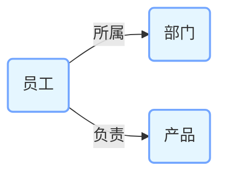

# 企业AI Agent的知识图谱构建与推理系统

> 关键词：企业AI Agent、知识图谱、构建、推理系统、信息整合、智能决策

> 摘要：本文围绕企业AI Agent的知识图谱构建与推理系统展开深入探讨。在企业数字化转型的大背景下，知识图谱能够有效整合企业内外部的多元信息，为AI Agent提供丰富的知识支撑，而推理系统则可基于知识图谱进行逻辑推理，辅助企业做出智能决策。文章详细阐述了知识图谱的核心概念、构建步骤、相关算法原理、数学模型，通过项目实战展示了具体的代码实现与分析，介绍了其实际应用场景、相关工具和资源，最后对未来发展趋势与挑战进行总结，并给出常见问题解答和参考资料，旨在为企业构建高效的AI Agent知识图谱与推理系统提供全面且深入的技术指导。

## 1. 背景介绍 
### 1.1 目的和范围
在当今数字化快速发展的时代，企业面临着海量且复杂的信息。企业AI Agent的知识图谱构建与推理系统的目的在于将企业内部的业务知识、客户信息、产品数据以及外部的市场动态、行业法规等信息进行整合，构建一个结构化的知识网络，即知识图谱。通过推理系统，能够从知识图谱中挖掘有价值的信息，辅助企业进行决策、优化业务流程、提供个性化服务等。

本文的范围涵盖了从知识图谱的基本概念、构建方法、推理算法到实际项目应用的整个过程，旨在为企业在该领域的实践提供全面的技术参考。

### 1.2 预期读者
本文预期读者包括企业的技术管理人员、数据科学家、人工智能工程师、软件开发人员以及对企业数字化转型和人工智能应用感兴趣的研究人员。对于希望深入了解企业AI Agent知识图谱构建与推理系统的相关人员，本文将提供理论和实践相结合的知识体系。

### 1.3 文档结构概述
本文首先介绍知识图谱和推理系统的背景知识，包括目的、读者对象和文档结构等。接着阐述核心概念与联系，通过文本示意图和Mermaid流程图展示知识图谱的原理和架构。然后详细讲解核心算法原理和具体操作步骤，结合Python源代码进行说明。随后介绍数学模型和公式，并举例说明。通过项目实战部分展示代码实际案例和详细解释。接着介绍实际应用场景，推荐相关的工具和资源。最后总结未来发展趋势与挑战，给出常见问题解答和参考资料。

### 1.4 术语表
#### 1.4.1 核心术语定义
- **企业AI Agent**：指在企业环境中，具备一定智能和自主决策能力的软件代理，能够根据企业的业务需求和知识进行交互和决策。
- **知识图谱**：是一种用图模型来描述知识和建模世界万物之间关联关系的技术方法，由实体、属性和关系构成。
- **推理系统**：基于知识图谱中的知识，运用逻辑规则和算法进行推理，以得出新的知识或结论的系统。

#### 1.4.2 相关概念解释
- **实体**：知识图谱中表示具体事物或抽象概念的对象，如企业中的员工、产品、客户等。
- **属性**：描述实体的特征或性质，例如员工的姓名、年龄、职位等。
- **关系**：表示实体之间的联系，如员工与部门之间的所属关系、产品与客户之间的购买关系等。

#### 1.4.3 缩略词列表
- **AI**：Artificial Intelligence，人工智能
- **KG**：Knowledge Graph，知识图谱

## 2. 核心概念与联系 
知识图谱是一种语义网络，它以图的形式表示实体、属性和关系。其基本原理是将现实世界中的各种事物抽象为实体，将事物的特征抽象为属性，将事物之间的联系抽象为关系，通过图的结构将这些信息组织起来。

### 知识图谱的架构
知识图谱的架构主要包括数据层和模式层。数据层是具体的实体、属性和关系数据的集合，模式层则定义了数据层中数据的结构和约束，类似于数据库中的模式定义。

#### 文本示意图
知识图谱的文本示意图可以描述为：以实体为节点，属性作为节点的标签，关系作为节点之间的边。例如，在企业知识图谱中，“员工”、“部门”、“产品”等是实体，“姓名”、“部门名称”、“产品名称”等是属性，“所属”、“负责”等是关系。

#### Mermaid 流程图


在这个流程图中，“员工”、“部门”、“产品”是实体，“所属”、“负责”是关系。通过这样的图结构，可以清晰地表示企业中员工、部门和产品之间的关系。

知识图谱与企业AI Agent的推理系统密切相关。知识图谱为推理系统提供了知识基础，推理系统则基于知识图谱中的知识进行推理，发现新的知识和关系。例如，在企业知识图谱中，如果已知员工A所属的部门B负责产品C，通过推理系统可以得出员工A可能参与产品C的相关工作。

## 3. 核心算法原理 & 具体操作步骤 
### 知识图谱构建算法 - 实体识别与关系抽取
实体识别和关系抽取是知识图谱构建的关键步骤。在这部分，我们将使用Python实现一个简单的实体识别和关系抽取算法。

#### 实体识别算法 - 基于规则的方法
基于规则的实体识别方法是根据预先定义的规则来识别文本中的实体。以下是一个简单的Python示例：

```python
import re

def entity_recognition(text, entity_patterns):
    entities = []
    for pattern in entity_patterns:
        matches = re.findall(pattern, text)
        for match in matches:
            entities.append(match)
    return entities

# 示例文本
text = "张三是ABC公司的员工，负责开发新产品XYZ。"
# 实体模式
entity_patterns = [r'[A-Za-z]+公司', r'[A-Za-z]+产品', r'[^\s]+']
entities = entity_recognition(text, entity_patterns)
print("识别出的实体:", entities)
```

在这个示例中，我们定义了一个`entity_recognition`函数，它接受文本和实体模式作为输入，使用正则表达式来匹配文本中的实体。

#### 关系抽取算法 - 基于依存句法分析
基于依存句法分析的关系抽取方法是通过分析句子的句法结构来抽取实体之间的关系。我们可以使用`spaCy`库来进行依存句法分析。

```python
import spacy

nlp = spacy.load("zh_core_web_sm")

def relation_extraction(text):
    doc = nlp(text)
    relations = []
    for token in doc:
        if token.dep_ == "nsubj":
            subject = token.text
            for child in token.head.children:
                if child.dep_ == "dobj":
                    object_ = child.text
                    relation = token.head.text
                    relations.append((subject, relation, object_))
    return relations

relations = relation_extraction(text)
print("抽取的关系:", relations)
```

在这个示例中，我们使用`spaCy`库对文本进行依存句法分析，通过判断依存关系来抽取实体之间的关系。

### 推理算法 - 基于规则的推理
基于规则的推理是根据预先定义的规则从知识图谱中推导出新的知识。以下是一个简单的Python示例：

```python
# 知识图谱数据
knowledge_graph = {
    ("张三", "所属", "ABC公司"),
    ("ABC公司", "负责开发", "XYZ产品")
}

# 推理规则
rules = [
    lambda x, y, z: (x, "参与开发", z) if (x, "所属", y) in knowledge_graph and (y, "负责开发", z) in knowledge_graph else None
]

def rule_based_reasoning(knowledge_graph, rules):
    new_knowledge = set()
    for rule in rules:
        for triple in knowledge_graph:
            result = rule(*triple)
            if result:
                new_knowledge.add(result)
    return new_knowledge

new_knowledge = rule_based_reasoning(knowledge_graph, rules)
print("推理出的新知识:", new_knowledge)
```

在这个示例中，我们定义了一个知识图谱和推理规则，通过遍历知识图谱中的三元组，应用推理规则来推导出新的知识。

## 4. 数学模型和公式 & 详细讲解 & 举例说明 
### 知识图谱的表示模型 - 向量空间模型
知识图谱的向量空间模型是将实体和关系映射到低维向量空间中，通过向量的运算来表示实体和关系之间的语义关系。常见的向量空间模型有TransE、TransH等。

#### TransE模型
TransE模型的核心思想是将实体和关系表示为向量，并且满足关系向量是头实体向量到尾实体向量的平移。即对于一个三元组 $(h, r, t)$，其中 $h$ 是头实体，$r$ 是关系，$t$ 是尾实体，有 $h + r \approx t$。

TransE模型的目标是最小化以下损失函数：
$$
L = \sum_{(h, r, t) \in S} \sum_{(h', r', t') \in S'} [\gamma + d(h + r, t) - d(h' + r', t')]_+
$$
其中，$S$ 是正样本集合，$S'$ 是负样本集合，$\gamma$ 是一个边际超参数，$d$ 是距离度量函数，通常使用L1或L2距离，$[x]_+ = \max(0, x)$。

#### 举例说明
假设我们有一个知识图谱中的三元组 ("苹果", "生产", "iPhone")，在TransE模型中，"苹果"、"生产"、"iPhone" 分别被表示为向量 $\mathbf{h}$、$\mathbf{r}$、$\mathbf{t}$。模型的训练过程就是不断调整这些向量，使得 $\mathbf{h} + \mathbf{r}$ 尽可能接近 $\mathbf{t}$。

### 推理的逻辑模型 - 一阶逻辑
一阶逻辑是一种形式化的逻辑语言，用于表示和推理知识。在知识图谱的推理中，可以使用一阶逻辑规则来推导新的知识。

#### 一阶逻辑规则示例
假设我们有以下一阶逻辑规则：
$$
\forall x, y, z \ (Employee(x) \land BelongsTo(x, y) \land ResponsibleFor(y, z) \rightarrow ParticipateIn(x, z))
$$
这个规则表示：对于任意的 $x$、$y$、$z$，如果 $x$ 是员工，$x$ 所属的部门是 $y$，且部门 $y$ 负责项目 $z$，那么员工 $x$ 参与项目 $z$。

#### 举例说明
在企业知识图谱中，如果已知员工 "张三" 所属的部门是 "技术部"，"技术部" 负责项目 "新产品开发"，根据上述一阶逻辑规则，可以推导出员工 "张三" 参与项目 "新产品开发"。

## 5. 项目实战：代码实际案例和详细解释说明 
### 5.1  开发环境搭建
#### 安装Python
首先，需要安装Python环境。可以从Python官方网站（https://www.python.org/downloads/） 下载适合自己操作系统的Python版本，并按照安装向导进行安装。

#### 安装相关库
在项目中，我们需要使用一些Python库，如`spaCy`、`networkx`等。可以使用`pip`命令进行安装：
```sh
pip install spacy
python -m spacy download zh_core_web_sm
pip install networkx
```

### 5.2  源代码详细实现和代码解读
#### 知识图谱构建代码实现
```python
import spacy
import networkx as nx

nlp = spacy.load("zh_core_web_sm")

def build_knowledge_graph(texts):
    knowledge_graph = nx.Graph()
    for text in texts:
        doc = nlp(text)
        entities = []
        for ent in doc.ents:
            entities.append(ent.text)
            knowledge_graph.add_node(ent.text)
        for token in doc:
            if token.dep_ == "nsubj":
                subject = token.text
                for child in token.head.children:
                    if child.dep_ == "dobj":
                        object_ = child.text
                        relation = token.head.text
                        knowledge_graph.add_edge(subject, object_, label=relation)
    return knowledge_graph

# 示例文本
texts = [
    "张三是ABC公司的员工，负责开发新产品XYZ。",
    "李四在ABC公司工作，参与了项目123。"
]

knowledge_graph = build_knowledge_graph(texts)

# 打印知识图谱中的节点和边
print("知识图谱节点:", knowledge_graph.nodes())
print("知识图谱边:", knowledge_graph.edges(data=True))
```

#### 代码解读
- 首先，我们导入了`spacy`和`networkx`库。`spacy`用于自然语言处理，`networkx`用于构建和操作图。
- 定义了`build_knowledge_graph`函数，它接受一个文本列表作为输入。
- 在函数内部，我们使用`spacy`对每个文本进行处理，提取实体并将其作为节点添加到知识图谱中。
- 然后，通过依存句法分析抽取实体之间的关系，并将其作为边添加到知识图谱中。
- 最后，返回构建好的知识图谱，并打印出节点和边的信息。

#### 推理系统代码实现
```python
def rule_based_reasoning(knowledge_graph):
    new_knowledge = []
    for u, v, data in knowledge_graph.edges(data=True):
        if data['label'] == '所属' and any(edge[2]['label'] == '负责' for edge in knowledge_graph.edges(data=True) if edge[0] == v):
            for edge in knowledge_graph.edges(data=True):
                if edge[0] == v and edge[2]['label'] == '负责':
                    new_knowledge.append((u, '参与', edge[1]))
    return new_knowledge

# 进行推理
new_knowledge = rule_based_reasoning(knowledge_graph)
print("推理出的新知识:", new_knowledge)
```

#### 代码解读
- 定义了`rule_based_reasoning`函数，它接受一个知识图谱作为输入。
- 在函数内部，遍历知识图谱中的边，如果发现某个节点的边标签为 "所属"，且该节点存在标签为 "负责" 的边，则推导出新的知识：该节点的源节点参与了负责的项目。
- 最后，返回推理出的新知识并打印。

### 5.3  代码解读与分析
#### 知识图谱构建代码分析
- 该代码通过自然语言处理技术，从文本中提取实体和关系，构建了一个简单的知识图谱。
- 使用`spacy`进行实体识别和依存句法分析，能够有效地处理中文文本。
- `networkx`库提供了方便的图操作接口，使得知识图谱的构建和管理变得简单。

#### 推理系统代码分析
- 推理系统基于规则进行推理，通过遍历知识图谱中的边，应用预先定义的规则推导出新的知识。
- 该方法简单直观，但对于复杂的知识图谱和推理规则，可能需要更高效的算法和数据结构。

## 6. 实际应用场景 
### 企业决策支持
企业AI Agent的知识图谱与推理系统可以整合企业内部的财务数据、市场数据、客户数据等，通过推理系统分析这些数据之间的关系，为企业决策提供支持。例如，通过分析客户购买行为和市场趋势，预测产品需求，帮助企业制定生产和销售策略。

### 客户服务
知识图谱可以存储企业的产品信息、服务流程、常见问题等知识，AI Agent可以基于这些知识为客户提供智能客服服务。当客户提出问题时，推理系统可以从知识图谱中找到相关的答案，并以自然语言的形式回复客户。

### 供应链管理
在供应链管理中，知识图谱可以整合供应商信息、物流信息、库存信息等。推理系统可以根据这些信息进行供应链优化，例如预测供应商交货时间、优化库存水平、选择最佳物流路线等。

### 员工培训与知识共享
知识图谱可以存储企业的业务知识、操作流程、技术文档等，为员工提供统一的知识平台。推理系统可以根据员工的岗位和需求，推荐相关的学习资源，帮助员工快速提升业务能力。

## 7. 工具和资源推荐
### 7.1 学习资源推荐
#### 7.1.1 书籍推荐
- 《知识图谱：方法、实践与应用》：全面介绍了知识图谱的理论、技术和应用，是学习知识图谱的经典书籍。
- 《人工智能：一种现代的方法》：涵盖了人工智能的各个领域，包括知识表示、推理等内容，对于理解知识图谱和推理系统的理论基础有很大帮助。

#### 7.1.2 在线课程
- Coursera上的“Knowledge Graphs”课程：由知名学者授课，系统地介绍了知识图谱的构建、推理和应用。
- 中国大学MOOC上的“人工智能基础”课程：包含了知识图谱和推理系统的相关内容，适合初学者学习。

#### 7.1.3 技术博客和网站
- 知乎：有很多关于知识图谱和人工智能的技术文章和讨论，可以从中获取最新的技术动态和实践经验。
- 博客园：有许多开发者分享的知识图谱和推理系统的实现案例和技术心得。

### 7.2 开发工具框架推荐
#### 7.2.1 IDE和编辑器
- PyCharm：功能强大的Python集成开发环境，提供了代码编辑、调试、版本控制等功能，适合开发知识图谱和推理系统的Python代码。
- Visual Studio Code：轻量级的代码编辑器，支持多种编程语言和插件，具有良好的扩展性。

#### 7.2.2 调试和性能分析工具
- Py-Spy：用于分析Python代码的性能瓶颈，帮助优化知识图谱和推理系统的性能。
-pdb：Python自带的调试工具，可以在代码中设置断点，逐步调试程序。

#### 7.2.3 相关框架和库
- RDFlib：用于处理RDF数据的Python库，RDF是知识图谱的一种常见表示格式。
- DGL-KE：用于知识图谱嵌入的深度学习框架，可以加速知识图谱的构建和推理。

### 7.3 相关论文著作推荐
#### 7.3.1 经典论文
- “Translating Embeddings for Modeling Multi-relational Data”：介绍了TransE模型，是知识图谱嵌入领域的经典论文。
- “Knowledge Graph Embedding: A Survey of Approaches and Applications”：对知识图谱嵌入的方法和应用进行了全面的综述。

#### 7.3.2 最新研究成果
- 关注顶级学术会议如AAAI、IJCAI、KDD等上关于知识图谱和推理系统的最新研究论文，了解该领域的前沿技术。

#### 7.3.3 应用案例分析
- 研究一些知名企业在知识图谱和推理系统方面的应用案例，如谷歌的知识图谱、亚马逊的商品推荐系统等，从中学习实践经验。

## 8. 总结：未来发展趋势与挑战
### 未来发展趋势
#### 与深度学习的融合
未来，知识图谱和推理系统将与深度学习技术更加紧密地融合。深度学习可以从大量的数据中学习到复杂的模式和特征，而知识图谱可以为深度学习提供结构化的知识，两者结合可以提高AI Agent的智能水平。

#### 多模态知识图谱
随着多媒体技术的发展，知识图谱将不仅仅局限于文本信息，还将融合图像、音频、视频等多模态信息，构建更加丰富和全面的知识图谱。

#### 联邦学习下的知识图谱
在数据隐私和安全要求越来越高的背景下，联邦学习将成为知识图谱构建和推理的重要技术。通过联邦学习，可以在不共享原始数据的情况下，实现多个参与方之间的知识图谱协同构建和推理。

### 挑战
#### 数据质量和一致性
知识图谱的构建依赖于大量的数据，数据的质量和一致性直接影响知识图谱的准确性和可靠性。如何处理数据中的噪声、错误和不一致性是一个挑战。

#### 推理效率
随着知识图谱的规模不断增大，推理系统的效率成为一个关键问题。如何设计高效的推理算法和数据结构，提高推理速度和性能是亟待解决的问题。

#### 知识更新和维护
企业的业务和环境不断变化，知识图谱需要及时更新和维护。如何实现知识图谱的自动化更新和维护，保证知识的时效性是一个挑战。

## 9. 附录：常见问题与解答
### 1. 知识图谱和数据库有什么区别？
知识图谱和数据库都用于存储数据，但它们的侧重点不同。数据库主要用于存储结构化数据，强调数据的一致性和完整性，以表格的形式组织数据。而知识图谱更注重数据之间的关系，以图的形式表示实体和关系，能够更好地表示复杂的语义信息。

### 2. 如何选择合适的知识图谱表示模型？
选择合适的知识图谱表示模型需要考虑多个因素，如知识图谱的规模、应用场景、推理需求等。对于大规模的知识图谱，可能需要选择高效的嵌入模型，如TransE、TransH等。对于需要处理复杂语义关系的应用场景，可能需要选择更复杂的模型，如基于深度学习的模型。

### 3. 推理系统的准确性如何保证？
推理系统的准确性取决于知识图谱的质量、推理规则的合理性和推理算法的正确性。首先，需要保证知识图谱中的知识准确无误。其次，推理规则需要经过严格的验证和测试，确保其逻辑正确性。最后，选择合适的推理算法，并对其进行优化和调参，以提高推理的准确性。

## 10. 扩展阅读 & 参考资料
### 扩展阅读
- 《深度学习》：深入学习深度学习的理论和技术，有助于理解知识图谱与深度学习的融合。
- 《数据挖掘：概念与技术》：了解数据挖掘的方法和技术，对于知识图谱的数据处理和分析有帮助。

### 参考资料
- [spaCy官方文档](https://spacy.io/)
- [networkx官方文档](https://networkx.org/)
- [RDFlib官方文档](https://rdflib.readthedocs.io/)
- [DGL-KE官方文档](https://dglke.dgl.ai/)