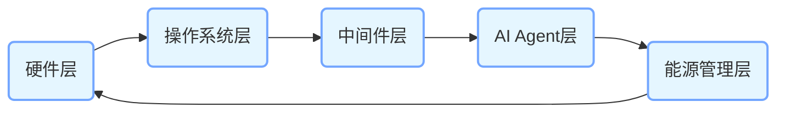

# 企业AI Agent的绿色计算与能源优化策略

> 关键词：企业AI Agent、绿色计算、能源优化、人工智能、可持续发展、资源管理、节能策略

> 摘要：随着人工智能技术的飞速发展，企业AI Agent在各个领域得到了广泛应用。然而，其高能耗问题也日益凸显，对环境和企业成本都带来了一定压力。本文旨在探讨企业AI Agent的绿色计算与能源优化策略，深入分析相关核心概念、算法原理、数学模型，并通过项目实战展示具体实现方法。同时，介绍实际应用场景、推荐相关工具和资源，最后总结未来发展趋势与挑战，为企业实现AI Agent的可持续发展提供全面的技术指导和参考。

## 1. 背景介绍 
### 1.1 目的和范围
本文章的目的在于系统地探讨企业AI Agent在绿色计算与能源优化方面的策略和方法。随着AI技术在企业中的广泛应用，AI Agent的能耗问题逐渐成为制约其可持续发展的关键因素。我们的研究范围涵盖了从AI Agent的核心概念、算法原理到实际应用场景的各个方面，旨在为企业提供全面的绿色计算与能源优化解决方案，降低能源消耗，减少对环境的影响，同时提高企业的经济效益。

### 1.2 预期读者
本文预期读者包括企业的技术决策者、人工智能研发人员、数据科学家、软件工程师以及对绿色计算和可持续发展感兴趣的相关人员。这些读者可以从本文中获取关于企业AI Agent绿色计算与能源优化的专业知识和实践经验，为其在实际工作中的决策和研发提供参考。

### 1.3 文档结构概述
本文将按照以下结构进行组织：首先介绍企业AI Agent绿色计算与能源优化的背景知识，包括目的、预期读者和文档结构概述等；接着阐述核心概念与联系，通过文本示意图和Mermaid流程图展示相关原理和架构；然后详细讲解核心算法原理和具体操作步骤，使用Python源代码进行阐述；再介绍数学模型和公式，并通过举例说明；之后进行项目实战，包括开发环境搭建、源代码实现和代码解读；随后介绍实际应用场景；接着推荐相关的工具和资源；最后总结未来发展趋势与挑战，并提供常见问题与解答以及扩展阅读和参考资料。

### 1.4 术语表
#### 1.4.1 核心术语定义
- **企业AI Agent**：指在企业环境中运行的人工智能代理，能够自主地执行特定任务，如自动化流程、数据分析、决策支持等。
- **绿色计算**：是指在计算机系统的设计、制造、使用和报废过程中，采用环保、节能的技术和方法，以降低能源消耗和对环境的影响。
- **能源优化**：通过各种技术和策略，对能源的生产、分配、使用等环节进行优化，以提高能源利用效率，降低能源消耗。

#### 1.4.2 相关概念解释
- **人工智能**：是一门研究如何使计算机能够模拟人类智能的学科，包括机器学习、深度学习、自然语言处理等多个领域。
- **可持续发展**：是指既满足当代人的需求，又不损害后代人满足其需求的能力的发展模式，强调经济、社会和环境的协调发展。
- **资源管理**：是指对企业的各种资源，如人力、物力、财力等进行合理配置和有效利用，以实现企业的目标。

#### 1.4.3 缩略词列表
- **AI**：Artificial Intelligence，人工智能
- **ML**：Machine Learning，机器学习
- **DL**：Deep Learning，深度学习
- **GPU**：Graphics Processing Unit，图形处理器
- **CPU**：Central Processing Unit，中央处理器

## 2. 核心概念与联系 
### 2.1 核心概念原理
企业AI Agent的绿色计算与能源优化涉及多个核心概念，它们相互关联，共同构成了一个复杂的系统。

企业AI Agent是基于人工智能技术的自动化系统，它通过感知环境、学习知识、推理决策等过程，实现对企业业务的自动化处理。然而，AI Agent的运行需要消耗大量的计算资源和能源，特别是在进行深度学习等复杂计算时，其能耗问题更为突出。

绿色计算的核心原理是通过采用低功耗硬件、优化算法、合理调度计算资源等方法，降低计算机系统的能源消耗。在企业AI Agent中，绿色计算可以从硬件和软件两个层面进行实现。在硬件层面，可以选择低功耗的处理器、存储设备等；在软件层面，可以优化算法结构，减少不必要的计算量。

能源优化则是在绿色计算的基础上，进一步对能源的使用进行优化。它包括能源的合理分配、负载均衡、能源回收等方面。通过能源优化，可以提高能源利用效率，降低企业的能源成本。

### 2.2 架构的文本示意图
企业AI Agent的绿色计算与能源优化架构可以分为以下几个层次：

- **硬件层**：包括服务器、存储设备、网络设备等，是AI Agent运行的物理基础。在硬件层，可以选择低功耗、高性能的硬件设备，以降低能源消耗。
- **操作系统层**：负责管理硬件资源，为上层应用提供运行环境。操作系统可以通过优化调度算法、节能模式等功能，实现对硬件资源的高效利用。
- **中间件层**：包括数据库管理系统、消息队列、容器化技术等，为AI Agent的开发和运行提供支持。中间件可以通过优化数据存储和传输方式，减少能源消耗。
- **AI Agent层**：是企业AI Agent的核心，包括各种人工智能算法和模型。在AI Agent层，可以通过优化算法结构、采用量化技术等方法，降低计算复杂度，减少能源消耗。
- **能源管理层**：负责对整个系统的能源使用进行监测、分析和优化。能源管理层可以通过实时监测能源消耗情况，调整系统的运行策略，实现能源的优化利用。

### 2.3 Mermaid流程图


这个流程图展示了企业AI Agent绿色计算与能源优化架构中各个层次之间的关系。硬件层为操作系统层提供物理支持，操作系统层为中间件层提供运行环境，中间件层为AI Agent层提供开发和运行支持，AI Agent层产生的能源消耗信息反馈给能源管理层，能源管理层根据反馈信息调整硬件层、操作系统层、中间件层和AI Agent层的运行策略，实现能源的优化利用。

## 3. 核心算法原理 & 具体操作步骤 
### 3.1 核心算法原理
在企业AI Agent的绿色计算与能源优化中，有几个核心算法起着关键作用，下面将详细介绍这些算法的原理。

#### 3.1.1 模型量化算法
模型量化是一种通过减少模型参数的表示精度来降低计算复杂度和能源消耗的技术。在深度学习模型中，通常使用32位浮点数来表示模型参数，但在实际应用中，很多参数并不需要这么高的精度。模型量化算法可以将32位浮点数的参数转换为8位整数或更低精度的表示，从而减少内存占用和计算量。

#### 3.1.2 动态电压频率调整（DVFS）算法
动态电压频率调整算法是一种根据系统负载情况动态调整处理器电压和频率的技术。当系统负载较低时，降低处理器的电压和频率，以减少能源消耗；当系统负载较高时，提高处理器的电压和频率，以保证系统的性能。

#### 3.1.3 负载均衡算法
负载均衡算法是一种将计算任务均匀分配到多个计算节点上的技术。通过负载均衡，可以避免某些计算节点过载，而其他计算节点闲置的情况，提高计算资源的利用率，从而降低能源消耗。

### 3.2 具体操作步骤
下面将使用Python源代码详细阐述这些算法的具体操作步骤。

#### 3.2.1 模型量化算法实现
```python
import torch
import torch.nn as nn

# 定义一个简单的神经网络模型
class SimpleNet(nn.Module):
    def __init__(self):
        super(SimpleNet, self).__init__()
        self.fc1 = nn.Linear(10, 20)
        self.fc2 = nn.Linear(20, 1)

    def forward(self, x):
        x = torch.relu(self.fc1(x))
        x = self.fc2(x)
        return x

# 创建模型实例
model = SimpleNet()

# 量化模型
quantized_model = torch.quantization.quantize_dynamic(
    model,  # 要量化的模型
    {nn.Linear},  # 要量化的层类型
    dtype=torch.qint8  # 量化后的数据类型
)

# 打印量化前后模型的大小
print(f"Original model size: {sum(p.numel() for p in model.parameters()) * 4} bytes")
print(f"Quantized model size: {sum(p.numel() for p in quantized_model.parameters())} bytes")
```
在这个代码示例中，我们首先定义了一个简单的神经网络模型`SimpleNet`，然后使用`torch.quantization.quantize_dynamic`函数对模型进行量化，将`nn.Linear`层的参数从32位浮点数转换为8位整数。最后，我们打印了量化前后模型的大小，可以看到量化后模型的大小明显减小。

#### 3.2.2 动态电压频率调整（DVFS）算法模拟
```python
import time

# 模拟系统负载
def get_system_load():
    # 这里简单返回一个随机数作为系统负载
    import random
    return random.uniform(0, 1)

# 模拟动态电压频率调整
def dvfs_algorithm():
    while True:
        load = get_system_load()
        if load < 0.3:
            # 低负载，降低电压和频率
            print("Low load, reducing voltage and frequency")
        elif load > 0.7:
            # 高负载，提高电压和频率
            print("High load, increasing voltage and frequency")
        else:
            # 正常负载，保持当前电压和频率
            print("Normal load, maintaining current voltage and frequency")
        time.sleep(1)

if __name__ == "__main__":
    dvfs_algorithm()
```
在这个代码示例中，我们首先定义了一个`get_system_load`函数，用于模拟系统负载。然后定义了一个`dvfs_algorithm`函数，根据系统负载情况动态调整电压和频率。最后，我们在主程序中调用`dvfs_algorithm`函数，不断模拟动态电压频率调整过程。

#### 3.2.3 负载均衡算法实现
```python
import random

# 定义计算节点
class ComputeNode:
    def __init__(self, id):
        self.id = id
        self.load = 0

    def add_task(self, task_load):
        self.load += task_load

    def get_load(self):
        return self.load

# 定义负载均衡器
class LoadBalancer:
    def __init__(self, num_nodes):
        self.nodes = [ComputeNode(i) for i in range(num_nodes)]

    def balance_load(self, task_load):
        # 选择负载最小的节点
        min_load_node = min(self.nodes, key=lambda node: node.get_load())
        min_load_node.add_task(task_load)
        print(f"Task with load {task_load} assigned to node {min_load_node.id}")

# 模拟任务分配
if __name__ == "__main__":
    load_balancer = LoadBalancer(3)
    for _ in range(10):
        task_load = random.uniform(1, 5)
        load_balancer.balance_load(task_load)
```
在这个代码示例中，我们首先定义了一个`ComputeNode`类，用于表示计算节点，每个节点有一个负载属性。然后定义了一个`LoadBalancer`类，用于实现负载均衡功能。在`balance_load`方法中，我们选择负载最小的节点来分配任务。最后，我们在主程序中模拟了10个任务的分配过程。

## 4. 数学模型和公式 & 详细讲解 & 举例说明 
### 4.1 模型量化的数学模型和公式
#### 4.1.1 线性量化公式
在模型量化中，常用的线性量化公式为：
$$
x_q = \text{round}\left(\frac{x}{S} + Z\right)
$$
其中，$x$ 是原始的浮点数，$x_q$ 是量化后的整数，$S$ 是缩放因子，$Z$ 是零点。

反量化公式为：
$$
x = S \times (x_q - Z)
$$

#### 4.1.2 详细讲解
缩放因子 $S$ 和零点 $Z$ 的计算是模型量化的关键步骤。通常，我们会根据原始数据的范围来计算 $S$ 和 $Z$。假设原始数据的最小值为 $x_{\min}$，最大值为 $x_{\max}$，量化后的整数范围为 $[q_{\min}, q_{\max}]$，则缩放因子 $S$ 和零点 $Z$ 的计算公式如下：
$$
S = \frac{x_{\max} - x_{\min}}{q_{\max} - q_{\min}}
$$
$$
Z = q_{\min} - \text{round}\left(\frac{x_{\min}}{S}\right)
$$

#### 4.1.3 举例说明
假设原始数据的范围是 $[-1, 1]$，量化后的整数范围是 $[-128, 127]$，则缩放因子 $S$ 和零点 $Z$ 的计算如下：
$$
S = \frac{1 - (-1)}{127 - (-128)} = \frac{2}{255} \approx 0.00784
$$
$$
Z = -128 - \text{round}\left(\frac{-1}{0.00784}\right) = -128 + 128 = 0
$$

如果原始数据 $x = 0.5$，则量化后的整数 $x_q$ 为：
$$
x_q = \text{round}\left(\frac{0.5}{0.00784} + 0\right) = \text{round}(63.7755) = 64
$$

反量化后的结果为：
$$
x = 0.00784 \times (64 - 0) = 0.50176 \approx 0.5
$$

### 4.2 动态电压频率调整（DVFS）的数学模型和公式
#### 4.2.1 功耗公式
处理器的功耗 $P$ 与电压 $V$ 和频率 $f$ 之间的关系可以用以下公式表示：
$$
P = C \times V^2 \times f
$$
其中，$C$ 是电容常数。

#### 4.2.2 详细讲解
从功耗公式可以看出，处理器的功耗与电压的平方和频率成正比。因此，通过降低电压和频率，可以显著降低处理器的功耗。在动态电压频率调整算法中，我们根据系统负载情况动态调整电压和频率，以实现能源的优化利用。

#### 4.2.3 举例说明
假设处理器的电容常数 $C = 10^{-9}$，初始电压 $V_0 = 1.2$ V，初始频率 $f_0 = 2$ GHz，则初始功耗为：
$$
P_0 = 10^{-9} \times (1.2)^2 \times 2 \times 10^9 = 2.88 \text{ W}
$$

如果系统负载较低，我们将电压降低到 $V_1 = 1$ V，频率降低到 $f_1 = 1$ GHz，则此时的功耗为：
$$
P_1 = 10^{-9} \times (1)^2 \times 1 \times 10^9 = 1 \text{ W}
$$

可以看到，通过降低电压和频率，处理器的功耗显著降低。

### 4.3 负载均衡的数学模型和公式
#### 4.3.1 负载均衡目标函数
负载均衡的目标是使各个计算节点的负载尽可能均匀。可以用以下目标函数来表示：
$$
\text{minimize} \quad \sum_{i=1}^{n} (L_i - \bar{L})^2
$$
其中，$n$ 是计算节点的数量，$L_i$ 是第 $i$ 个计算节点的负载，$\bar{L}$ 是所有计算节点的平均负载。

#### 4.3.2 详细讲解
这个目标函数的含义是使各个计算节点的负载与平均负载的差值的平方和最小。通过优化这个目标函数，可以实现负载的均衡分配。

#### 4.3.3 举例说明
假设有3个计算节点，它们的初始负载分别为 $L_1 = 5$，$L_2 = 3$，$L_3 = 7$，则平均负载为：
$$
\bar{L} = \frac{5 + 3 + 7}{3} = 5
$$

初始的目标函数值为：
$$
(5 - 5)^2 + (3 - 5)^2 + (7 - 5)^2 = 0 + 4 + 4 = 8
$$

如果我们将一个负载为2的任务分配给负载最小的节点 $L_2$，则新的负载分别为 $L_1 = 5$，$L_2 = 5$，$L_3 = 7$，新的平均负载为：
$$
\bar{L} = \frac{5 + 5 + 7}{3} = \frac{17}{3} \approx 5.67
$$

新的目标函数值为：
$$
(5 - 5.67)^2 + (5 - 5.67)^2 + (7 - 5.67)^2 \approx 0.45 + 0.45 + 1.77 = 2.67
$$

可以看到，通过负载均衡，目标函数值显著减小，说明各个计算节点的负载更加均匀。

## 5. 项目实战：代码实际案例和详细解释说明 
### 5.1  开发环境搭建
#### 5.1.1 硬件环境
- 服务器：选择具有多核处理器和高性能显卡的服务器，如Intel Xeon系列处理器和NVIDIA GPU。
- 存储设备：使用高速固态硬盘（SSD）来提高数据读写速度。
- 网络设备：确保网络带宽足够，以保证数据传输的高效性。

#### 5.1.2 软件环境
- 操作系统：选择Linux系统，如Ubuntu、CentOS等，因为Linux系统具有良好的稳定性和性能。
- 编程语言：使用Python作为主要的编程语言，因为Python具有丰富的机器学习和深度学习库。
- 深度学习框架：选择PyTorch或TensorFlow作为深度学习框架，这两个框架都提供了丰富的工具和接口，方便进行模型开发和训练。

#### 5.1.3 环境配置
- 安装Python：可以从Python官方网站下载Python安装包，并按照安装向导进行安装。
- 安装深度学习框架：使用pip或conda命令安装PyTorch或TensorFlow。例如，安装PyTorch的命令如下：
```sh
pip install torch torchvision
```
- 安装其他必要的库：根据项目需求，安装其他必要的库，如numpy、pandas、matplotlib等。

### 5.2  源代码详细实现和代码解读
#### 5.2.1 项目需求
我们将实现一个基于企业AI Agent的图像分类系统，并对其进行绿色计算与能源优化。该系统的主要功能是对输入的图像进行分类，判断图像属于哪个类别。

#### 5.2.2 数据准备
首先，我们需要准备图像分类所需的数据集。这里我们使用CIFAR-10数据集，该数据集包含10个不同类别的60000张彩色图像，其中训练集50000张，测试集10000张。

```python
import torch
import torchvision
import torchvision.transforms as transforms

# 定义数据预处理操作
transform = transforms.Compose(
    [transforms.ToTensor(),
     transforms.Normalize((0.5, 0.5, 0.5), (0.5, 0.5, 0.5))])

# 加载训练集
trainset = torchvision.datasets.CIFAR10(root='./data', train=True,
                                        download=True, transform=transform)
trainloader = torch.utils.data.DataLoader(trainset, batch_size=4,
                                          shuffle=True, num_workers=2)

# 加载测试集
testset = torchvision.datasets.CIFAR10(root='./data', train=False,
                                       download=True, transform=transform)
testloader = torch.utils.data.DataLoader(testset, batch_size=4,
                                         shuffle=False, num_workers=2)

# 定义类别名称
classes = ('plane', 'car', 'bird', 'cat',
           'deer', 'dog', 'frog', 'horse', 'ship', 'truck')
```
在这个代码中，我们使用`torchvision`库加载CIFAR-10数据集，并对数据进行预处理，包括将图像转换为张量和归一化操作。然后，我们使用`DataLoader`将数据集分成小批量，方便进行训练和测试。

#### 5.2.3 模型定义
接下来，我们定义一个简单的卷积神经网络模型。

```python
import torch.nn as nn
import torch.nn.functional as F

class Net(nn.Module):
    def __init__(self):
        super(Net, self).__init__()
        self.conv1 = nn.Conv2d(3, 6, 5)
        self.pool = nn.MaxPool2d(2, 2)
        self.conv2 = nn.Conv2d(6, 16, 5)
        self.fc1 = nn.Linear(16 * 5 * 5, 120)
        self.fc2 = nn.Linear(120, 84)
        self.fc3 = nn.Linear(84, 10)

    def forward(self, x):
        x = self.pool(F.relu(self.conv1(x)))
        x = self.pool(F.relu(self.conv2(x)))
        x = x.view(-1, 16 * 5 * 5)
        x = F.relu(self.fc1(x))
        x = F.relu(self.fc2(x))
        x = self.fc3(x)
        return x

net = Net()
```
在这个代码中，我们定义了一个名为`Net`的卷积神经网络模型，该模型包含两个卷积层、两个池化层和三个全连接层。

#### 5.2.4 模型训练
```python
import torch.optim as optim

# 定义损失函数和优化器
criterion = nn.CrossEntropyLoss()
optimizer = optim.SGD(net.parameters(), lr=0.001, momentum=0.9)

# 训练模型
for epoch in range(2):  # 训练2个epoch
    running_loss = 0.0
    for i, data in enumerate(trainloader, 0):
        # 获取输入数据
        inputs, labels = data

        # 梯度清零
        optimizer.zero_grad()

        # 前向传播 + 反向传播 + 优化
        outputs = net(inputs)
        loss = criterion(outputs, labels)
        loss.backward()
        optimizer.step()

        # 打印统计信息
        running_loss += loss.item()
        if i % 2000 == 1999:    # 每2000个小批量打印一次
            print(f'[{epoch + 1}, {i + 1:5d}] loss: {running_loss / 2000:.3f}')
            running_loss = 0.0

print('Finished Training')
```
在这个代码中，我们定义了交叉熵损失函数和随机梯度下降优化器，然后对模型进行训练。训练过程中，我们每2000个小批量打印一次损失值，以便观察训练进度。

#### 5.2.5 模型量化
```python
# 量化模型
quantized_net = torch.quantization.quantize_dynamic(
    net,  # 要量化的模型
    {nn.Linear},  # 要量化的层类型
    dtype=torch.qint8  # 量化后的数据类型
)

# 保存量化后的模型
torch.save(quantized_net.state_dict(), 'quantized_net.pth')
```
在这个代码中，我们使用`torch.quantization.quantize_dynamic`函数对训练好的模型进行量化，将`nn.Linear`层的参数从32位浮点数转换为8位整数。然后，我们将量化后的模型保存到文件中。

#### 5.2.6 模型测试
```python
# 测试量化后的模型
correct = 0
total = 0
with torch.no_grad():
    for data in testloader:
        images, labels = data
        outputs = quantized_net(images)
        _, predicted = torch.max(outputs.data, 1)
        total += labels.size(0)
        correct += (predicted == labels).sum().item()

print(f'Accuracy of the quantized network on the 10000 test images: {100 * correct / total} %')
```
在这个代码中，我们使用测试集对量化后的模型进行测试，计算模型的准确率。

### 5.3  代码解读与分析
#### 5.3.1 数据准备部分
数据准备部分的主要作用是加载和预处理数据集。我们使用`torchvision`库提供的`datasets`模块加载CIFAR-10数据集，并使用`transforms`模块对数据进行预处理。`DataLoader`模块将数据集分成小批量，方便进行训练和测试。

#### 5.3.2 模型定义部分
模型定义部分定义了一个简单的卷积神经网络模型。该模型包含两个卷积层、两个池化层和三个全连接层。卷积层用于提取图像的特征，池化层用于减少特征图的尺寸，全连接层用于将特征图转换为分类结果。

#### 5.3.3 模型训练部分
模型训练部分使用交叉熵损失函数和随机梯度下降优化器对模型进行训练。在训练过程中，我们不断调整模型的参数，使得模型的损失值逐渐减小。

#### 5.3.4 模型量化部分
模型量化部分使用`torch.quantization.quantize_dynamic`函数对训练好的模型进行量化。量化可以减少模型的内存占用和计算量，从而降低能源消耗。

#### 5.3.5 模型测试部分
模型测试部分使用测试集对量化后的模型进行测试，计算模型的准确率。通过测试，我们可以评估模型的性能，确保量化后的模型仍然具有较高的准确率。

## 6. 实际应用场景 
### 6.1 金融行业
在金融行业，企业AI Agent可以用于风险评估、信贷审批、投资决策等任务。通过绿色计算与能源优化策略，可以降低这些任务的计算成本和能源消耗，提高企业的经济效益。例如，在风险评估中，AI Agent可以通过分析大量的金融数据来评估风险，而模型量化和负载均衡等技术可以减少计算资源的使用，提高计算效率。

### 6.2 医疗行业
在医疗行业，企业AI Agent可以用于疾病诊断、药物研发、医疗影像分析等任务。这些任务通常需要处理大量的医疗数据，计算量较大。通过绿色计算与能源优化策略，可以降低计算成本和能源消耗，同时提高医疗服务的效率和质量。例如，在医疗影像分析中，AI Agent可以通过分析X光、CT等影像数据来辅助医生进行诊断，而动态电压频率调整等技术可以根据任务的负载情况动态调整计算资源的使用，减少能源消耗。

### 6.3 制造业
在制造业，企业AI Agent可以用于生产过程监控、质量检测、设备故障预测等任务。通过绿色计算与能源优化策略，可以提高生产效率，降低生产成本，减少对环境的影响。例如，在生产过程监控中，AI Agent可以实时监测生产设备的运行状态，及时发现异常情况并进行预警，而负载均衡算法可以将计算任务均匀分配到多个计算节点上，提高计算资源的利用率。

### 6.4 交通运输行业
在交通运输行业，企业AI Agent可以用于交通流量预测、智能驾驶、物流调度等任务。这些任务需要处理大量的实时数据，对计算资源的要求较高。通过绿色计算与能源优化策略，可以降低计算成本和能源消耗，提高交通运输的效率和安全性。例如，在交通流量预测中，AI Agent可以通过分析交通传感器的数据来预测交通流量，而模型量化和动态电压频率调整等技术可以减少计算资源的使用，提高计算效率。

## 7. 工具和资源推荐
### 7.1 学习资源推荐
#### 7.1.1 书籍推荐
- 《深度学习》（Deep Learning）：由Ian Goodfellow、Yoshua Bengio和Aaron Courville所著，是深度学习领域的经典教材，全面介绍了深度学习的基本概念、算法和应用。
- 《Python机器学习》（Python Machine Learning）：由Sebastian Raschka所著，详细介绍了Python在机器学习中的应用，包括各种机器学习算法的实现和案例分析。
- 《人工智能：一种现代的方法》（Artificial Intelligence: A Modern Approach）：由Stuart Russell和Peter Norvig所著，是人工智能领域的经典教材，全面介绍了人工智能的基本概念、算法和应用。

#### 7.1.2 在线课程
- Coursera上的“深度学习专项课程”（Deep Learning Specialization）：由Andrew Ng教授授课，全面介绍了深度学习的基本概念、算法和应用，包括神经网络、卷积神经网络、循环神经网络等。
- edX上的“人工智能基础”（Introduction to Artificial Intelligence）：由MIT的Patrick H. Winston教授授课，介绍了人工智能的基本概念、算法和应用，包括搜索算法、知识表示、机器学习等。
- 中国大学MOOC上的“机器学习”：由周志华教授授课，详细介绍了机器学习的基本概念、算法和应用，包括决策树、支持向量机、神经网络等。

#### 7.1.3 技术博客和网站
- Medium：是一个技术博客平台，上面有很多关于人工智能、机器学习、深度学习等领域的优秀文章。
- Towards Data Science：是一个专注于数据科学和机器学习的技术博客，上面有很多关于数据科学、机器学习、深度学习等领域的优秀文章。
- arXiv：是一个预印本数据库，上面有很多关于人工智能、机器学习、深度学习等领域的最新研究成果。

### 7.2 开发工具框架推荐
#### 7.2.1 IDE和编辑器
- PyCharm：是一款专门为Python开发设计的集成开发环境（IDE），具有代码编辑、调试、版本控制等功能，支持各种Python库和框架。
- Jupyter Notebook：是一个交互式的笔记本环境，支持Python、R等多种编程语言，方便进行数据探索、模型训练和可视化等工作。
- Visual Studio Code：是一款轻量级的代码编辑器，支持多种编程语言，具有丰富的插件和扩展功能，适合进行快速开发和调试。

#### 7.2.2 调试和性能分析工具
- TensorBoard：是TensorFlow提供的一个可视化工具，用于可视化训练过程中的各种指标，如损失值、准确率、模型结构等，方便进行调试和性能分析。
- PyTorch Profiler：是PyTorch提供的一个性能分析工具，用于分析模型的性能瓶颈，如计算时间、内存占用等，方便进行优化。
- cProfile：是Python标准库中的一个性能分析工具，用于分析Python代码的性能瓶颈，如函数调用时间、调用次数等，方便进行优化。

#### 7.2.3 相关框架和库
- PyTorch：是一个开源的深度学习框架，具有动态计算图、自动求导等功能，方便进行模型开发和训练。
- TensorFlow：是一个开源的深度学习框架，具有静态计算图、分布式训练等功能，适合进行大规模的模型训练和部署。
- Scikit-learn：是一个开源的机器学习库，提供了各种机器学习算法和工具，如分类、回归、聚类等，方便进行机器学习任务的开发。

### 7.3 相关论文著作推荐
#### 7.3.1 经典论文
- “ImageNet Classification with Deep Convolutional Neural Networks”：由Alex Krizhevsky、Ilya Sutskever和Geoffrey E. Hinton所著，介绍了AlexNet卷积神经网络模型，开启了深度学习在计算机视觉领域的革命。
- “Long Short-Term Memory”：由Sepp Hochreiter和Jürgen Schmidhuber所著，介绍了长短期记忆网络（LSTM），解决了循环神经网络中的梯度消失问题。
- “Attention Is All You Need”：由Ashish Vaswani等人所著，介绍了Transformer模型，提出了注意力机制，在自然语言处理领域取得了巨大成功。

#### 7.3.2 最新研究成果
- 关注arXiv、NeurIPS、ICML、CVPR等学术会议和数据库，及时了解人工智能、机器学习、深度学习等领域的最新研究成果。

#### 7.3.3 应用案例分析
- 可以参考一些知名企业的技术博客和案例分享，如Google AI Blog、Facebook AI Research、Microsoft Research等，了解企业AI Agent在实际应用中的案例和经验。

## 8. 总结：未来发展趋势与挑战
### 8.1 未来发展趋势
#### 8.1.1 绿色计算技术的不断创新
随着对环境保护和可持续发展的重视，绿色计算技术将不断创新。未来，可能会出现更加高效的低功耗硬件设备，如量子处理器、光计算芯片等，这些设备将大大降低AI Agent的能源消耗。同时，软件层面的优化算法也将不断发展，如更加智能的模型量化算法、动态电压频率调整算法等，进一步提高能源利用效率。

#### 8.1.2 AI Agent与能源管理系统的深度融合
未来，企业AI Agent将与能源管理系统深度融合，实现对能源的实时监测、分析和优化。AI Agent可以根据能源消耗情况和业务需求，自动调整系统的运行策略，实现能源的动态分配和优化利用。例如，在能源紧张时，AI Agent可以自动降低非关键任务的计算资源分配，优先保障关键任务的运行。

#### 8.1.3 跨领域合作与应用
企业AI Agent的绿色计算与能源优化将不再局限于单一领域，而是会与其他领域进行跨领域合作与应用。例如，与物联网技术结合，实现对设备的智能控制和能源管理；与区块链技术结合，实现能源交易的透明化和高效化。通过跨领域合作，可以拓展AI Agent的应用场景，提高能源利用效率，实现可持续发展。

### 8.2 挑战
#### 8.2.1 技术难题
虽然已经有一些绿色计算和能源优化技术，但仍然存在一些技术难题需要解决。例如，模型量化可能会导致模型精度下降，如何在保证模型精度的前提下实现高效的量化是一个挑战；动态电压频率调整算法需要准确地预测系统负载，如何提高负载预测的准确性也是一个难题。

#### 8.2.2 成本问题
采用绿色计算和能源优化技术可能会增加企业的成本。例如，购买低功耗硬件设备可能需要更高的成本；开发和维护能源管理系统也需要投入一定的人力和物力。如何在降低能源消耗的同时，控制成本，是企业面临的一个挑战。

#### 8.2.3 人才短缺
绿色计算和能源优化涉及到多个领域的知识，如人工智能、能源工程、计算机科学等。目前，缺乏既懂人工智能又懂能源管理的复合型人才。如何培养和吸引这样的人才，是推动企业AI Agent绿色计算与能源优化发展的关键。

## 9. 附录：常见问题与解答
### 9.1 模型量化会对模型性能产生多大影响？
模型量化通常会在一定程度上降低模型的性能，如准确率、召回率等。但是，通过合理的量化方法和参数调整，可以将性能损失控制在可接受的范围内。例如，在一些图像分类任务中，使用8位整数量化可以将模型的内存占用和计算量减少到原来的1/4左右，而准确率的损失通常在1% - 3%之间。

### 9.2 动态电压频率调整算法在实际应用中效果如何？
动态电压频率调整算法在实际应用中可以显著降低处理器的能源消耗。根据不同的系统负载情况，能源消耗可以降低20% - 50%左右。但是，该算法的效果也受到系统负载预测准确性、硬件设备性能等因素的影响。

### 9.3 如何评估企业AI Agent的能源消耗？
可以通过以下几种方法评估企业AI Agent的能源消耗：
- 使用硬件监控工具：如功率计、传感器等，直接测量硬件设备的功率消耗。
- 软件层面的监控：通过操作系统或应用程序提供的监控接口，获取CPU、GPU等硬件设备的使用率和能耗信息。
- 建立能源模型：根据AI Agent的计算任务、硬件设备性能等因素，建立能源消耗模型，预测AI Agent的能源消耗。

### 9.4 企业在实施绿色计算与能源优化策略时需要注意什么？
企业在实施绿色计算与能源优化策略时需要注意以下几点：
- 明确目标和需求：根据企业的业务需求和发展战略，明确绿色计算与能源优化的目标和需求。
- 综合考虑技术和成本：在选择绿色计算和能源优化技术时，需要综合考虑技术的可行性和成本效益。
- 加强人才培养和团队建设：培养和吸引既懂人工智能又懂能源管理的复合型人才，建立专业的技术团队。
- 持续监测和优化：对绿色计算与能源优化策略的实施效果进行持续监测和评估，及时调整策略，确保达到预期目标。

## 10. 扩展阅读 & 参考资料
### 10.1 扩展阅读
- “Green Computing: Principles and Practice”：详细介绍了绿色计算的基本原理和实践方法，包括硬件设计、软件优化、能源管理等方面。
- “Energy-Efficient Computing: Principles and Practice”：探讨了能源高效计算的相关技术和方法，包括低功耗硬件、节能算法、能源管理系统等。
- “Artificial Intelligence and Sustainable Development”：研究了人工智能在可持续发展中的应用，包括能源优化、环境保护、资源管理等方面。

### 10.2 参考资料
- 相关学术论文和研究报告，如IEEE Transactions on Sustainable Computing、ACM Transactions on Energy-Efficient Computing等期刊上的文章。
- 企业的技术博客和案例分享，如Google AI Blog、Facebook AI Research、Microsoft Research等。
- 行业标准和规范，如ISO 14001环境管理体系标准、IEEE 1888标准等。