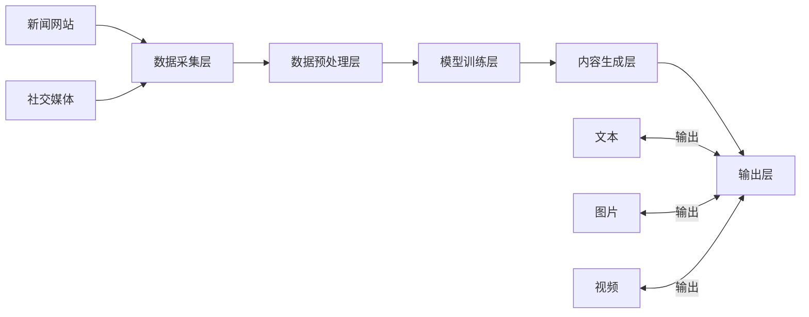

# 企业估值中的AI驱动的自动化新闻写作平台评估

> 关键词：企业估值、AI、自动化新闻写作平台、评估模型、市场趋势

> 摘要：本文聚焦于企业估值中AI驱动的自动化新闻写作平台评估这一重要课题。在当今数字化时代，自动化新闻写作平台凭借其高效、精准等优势逐渐崭露头角，对于此类平台的准确估值有助于投资者、企业管理者等做出科学决策。文章首先介绍了相关背景知识，包括目的范围、预期读者等。接着阐述了核心概念与联系，详细讲解了核心算法原理及具体操作步骤，给出了数学模型和公式并举例说明。通过项目实战展示了代码实际案例和详细解释。分析了实际应用场景，推荐了相关工具和资源。最后总结了未来发展趋势与挑战，解答常见问题并提供扩展阅读和参考资料，旨在全面、深入地探讨如何对AI驱动的自动化新闻写作平台进行有效评估。

## 1. 背景介绍 
### 1.1 目的和范围
在当前快速发展的媒体和科技领域，AI驱动的自动化新闻写作平台不断涌现，其市场价值和发展潜力备受关注。本文章的目的在于建立一套科学、合理的评估体系，用于准确评估此类平台的企业价值。范围涵盖了对自动化新闻写作平台的技术架构、内容生成能力、市场竞争力、财务状况等多方面的综合评估，以帮助投资者、企业管理者、行业研究人员等全面了解平台的实际价值和发展前景。

### 1.2 预期读者
本文预期读者包括但不限于金融投资者，他们希望通过准确的评估来决定是否对自动化新闻写作平台进行投资；企业管理者，需要了解自身平台的价值以制定发展战略和决策；媒体行业从业者，关注行业内新技术的发展和应用价值；以及学术研究人员，对相关领域的理论和实践进行深入研究。

### 1.3 文档结构概述
本文将按照以下结构展开：首先介绍背景知识，包括目的、读者和文档结构等内容；接着阐述核心概念与联系，明确自动化新闻写作平台评估相关的关键概念和它们之间的关系；然后详细讲解核心算法原理及具体操作步骤，结合Python代码进行说明；给出数学模型和公式并举例，以更精确地描述评估过程；通过项目实战展示代码实现和详细解释；分析实际应用场景，探讨平台在不同领域的价值；推荐相关的工具和资源，包括学习资料、开发工具和研究论文等；最后总结未来发展趋势与挑战，解答常见问题并提供扩展阅读和参考资料。

### 1.4 术语表
#### 1.4.1 核心术语定义
- **AI驱动的自动化新闻写作平台**：指利用人工智能技术，如自然语言处理、机器学习等，自动生成新闻内容的软件系统或平台。
- **企业估值**：对企业的经济价值进行评估和估算的过程，通常考虑企业的资产、收益、市场竞争力等多方面因素。
- **自然语言处理（NLP）**：是人工智能的一个分支领域，致力于使计算机能够理解、处理和生成人类语言。
- **机器学习（ML）**：是一门多领域交叉学科，涉及概率论、统计学、逼近论、凸分析、算法复杂度理论等多门学科。它专门研究计算机怎样模拟或实现人类的学习行为，以获取新的知识或技能，重新组织已有的知识结构使之不断改善自身的性能。

#### 1.4.2 相关概念解释
- **内容生成能力**：指自动化新闻写作平台能够生成的新闻内容的质量、数量、多样性和时效性等方面的综合能力。
- **市场竞争力**：平台在市场中与其他同类产品或服务竞争的能力，包括技术优势、品牌影响力、用户规模等因素。
- **财务状况**：反映平台的盈利能力、资产负债情况、现金流等财务指标，是企业估值的重要依据之一。

#### 1.4.3 缩略词列表
- **AI**：Artificial Intelligence（人工智能）
- **NLP**：Natural Language Processing（自然语言处理）
- **ML**：Machine Learning（机器学习）

## 2. 核心概念与联系 

### 核心概念原理
AI驱动的自动化新闻写作平台主要基于自然语言处理和机器学习技术。自然语言处理技术用于理解新闻文本的语义、语法和上下文信息，以便生成符合语言规范和逻辑的新闻内容。机器学习技术则通过对大量新闻数据的学习和训练，使平台能够不断优化内容生成的质量和效率。

平台的架构通常包括数据采集层、数据预处理层、模型训练层、内容生成层和输出层。数据采集层负责从各种数据源收集新闻素材，如新闻网站、社交媒体等。数据预处理层对采集到的数据进行清洗、标注和特征提取等操作，以便后续的模型训练。模型训练层使用机器学习算法对预处理后的数据进行训练，得到能够生成新闻内容的模型。内容生成层根据用户的需求和输入，利用训练好的模型生成新闻内容。输出层将生成的新闻内容以合适的格式输出，如文本、图片、视频等。

### 文本示意图
AI驱动的自动化新闻写作平台架构可以描述为：
数据采集层（从新闻网站、社交媒体等获取数据） -> 数据预处理层（清洗、标注、特征提取） -> 模型训练层（使用机器学习算法训练模型） -> 内容生成层（根据用户需求生成新闻） -> 输出层（以文本、图片、视频等形式输出）

### Mermaid流程图


## 3. 核心算法原理 & 具体操作步骤 

### 核心算法原理
在AI驱动的自动化新闻写作平台中，常用的算法包括循环神经网络（RNN）及其变体长短期记忆网络（LSTM）、门控循环单元（GRU），以及Transformer架构等。这里以LSTM为例进行讲解。

LSTM是一种特殊的RNN，能够解决传统RNN中的梯度消失问题，从而更好地处理序列数据。LSTM的核心结构包括输入门、遗忘门、输出门和细胞状态。输入门决定哪些新的信息将被添加到细胞状态中；遗忘门决定哪些信息将从细胞状态中被遗忘；输出门决定细胞状态的哪些部分将被输出。

### Python源代码详细阐述
```python
import numpy as np
import tensorflow as tf
from tensorflow.keras.layers import LSTM, Dense
from tensorflow.keras.models import Sequential

# 生成一些示例数据
# 假设我们有1000个新闻样本，每个样本的长度为100，每个时间步有50个特征
num_samples = 1000
sequence_length = 100
feature_dim = 50

# 生成随机输入数据
X = np.random.randn(num_samples, sequence_length, feature_dim)
# 生成随机标签数据，假设我们有10个类别
y = np.random.randint(0, 10, num_samples)

# 构建LSTM模型
model = Sequential()
# 添加LSTM层，设置隐藏单元数量为64
model.add(LSTM(64, input_shape=(sequence_length, feature_dim)))
# 添加全连接层，用于分类
model.add(Dense(10, activation='softmax'))

# 编译模型
model.compile(optimizer='adam', loss='sparse_categorical_crossentropy', metrics=['accuracy'])

# 训练模型
model.fit(X, y, epochs=10, batch_size=32)
```

### 具体操作步骤
1. **数据准备**：收集和整理新闻数据，对数据进行清洗、标注和特征提取等预处理操作，将数据转换为适合模型输入的格式。
2. **模型构建**：选择合适的算法，如LSTM，构建模型结构。设置模型的参数，如隐藏单元数量、层数等。
3. **模型编译**：选择合适的优化器、损失函数和评估指标，对模型进行编译。
4. **模型训练**：将预处理后的数据输入到模型中进行训练，设置训练的轮数和批次大小等参数。
5. **模型评估**：使用测试数据对训练好的模型进行评估，计算模型的准确率、召回率等指标。
6. **内容生成**：根据用户的需求和输入，使用训练好的模型生成新闻内容。

## 4. 数学模型和公式 & 详细讲解 & 举例说明 

### 数学模型
在企业估值中，对于AI驱动的自动化新闻写作平台的评估可以采用多种数学模型，如现金流折现模型（DCF）、相对估值模型等。这里以DCF模型为例进行讲解。

DCF模型的基本思想是将企业未来的现金流折现到当前时刻，以计算企业的内在价值。其数学公式为：

$$V = \sum_{t=1}^{n} \frac{CF_t}{(1 + r)^t} + \frac{TV}{(1 + r)^n}$$

其中：
- $V$ 表示企业的内在价值
- $CF_t$ 表示第 $t$ 期的自由现金流
- $r$ 表示折现率
- $n$ 表示预测期数
- $TV$ 表示终值

### 详细讲解
1. **自由现金流（$CF_t$）**：是指企业在满足了所有营运成本和资本支出后剩余的现金流量，它反映了企业实际可用于分配给投资者的现金数量。计算自由现金流需要考虑企业的营业收入、营业成本、折旧、摊销、资本支出等因素。
2. **折现率（$r$）**：是将未来现金流折现到当前时刻的利率，它反映了投资者对投资风险的预期。折现率通常由无风险利率、风险溢价等因素组成。
3. **预测期数（$n$）**：是指预测企业未来现金流的期限，通常根据企业的发展阶段和行业特点来确定。
4. **终值（$TV$）**：是指预测期结束后企业的价值，通常采用永续增长模型来计算。永续增长模型的公式为：

$$TV = \frac{CF_{n+1}}{r - g}$$

其中：
- $CF_{n+1}$ 表示预测期结束后下一期的自由现金流
- $g$ 表示永续增长率

### 举例说明
假设某AI驱动的自动化新闻写作平台的预测期为5年，每年的自由现金流分别为100万元、120万元、150万元、180万元和200万元。折现率为10%，预测期结束后企业的永续增长率为3%。

首先计算预测期内的现金流折现：

第1年：$\frac{100}{(1 + 0.1)^1} = 90.91$（万元）
第2年：$\frac{120}{(1 + 0.1)^2} = 99.17$（万元）
第3年：$\frac{150}{(1 + 0.1)^3} = 112.69$（万元）
第4年：$\frac{180}{(1 + 0.1)^4} = 122.94$（万元）
第5年：$\frac{200}{(1 + 0.1)^5} = 124.18$（万元）

预测期内现金流折现总和为：$90.91 + 99.17 + 112.69 + 122.94 + 124.18 = 549.89$（万元）

然后计算终值：

$CF_{6} = 200 \times (1 + 0.03) = 206$（万元）

$TV = \frac{206}{0.1 - 0.03} = 2942.86$（万元）

终值的折现值为：$\frac{2942.86}{(1 + 0.1)^5} = 1827.45$（万元）

最后计算企业的内在价值：

$V = 549.89 + 1827.45 = 2377.34$（万元）

## 5. 项目实战：代码实际案例和详细解释说明 

### 5.1  开发环境搭建
- **操作系统**：推荐使用Linux或Windows操作系统。
- **Python环境**：安装Python 3.7及以上版本。
- **深度学习框架**：安装TensorFlow或PyTorch深度学习框架。这里以TensorFlow为例，使用以下命令进行安装：
```bash
pip install tensorflow
```
- **其他依赖库**：安装numpy、pandas、matplotlib等常用库，使用以下命令进行安装：
```bash
pip install numpy pandas matplotlib
```

### 5.2  源代码详细实现和代码解读
```python
import numpy as np
import tensorflow as tf
from tensorflow.keras.layers import Embedding, LSTM, Dense
from tensorflow.keras.models import Sequential
from tensorflow.keras.preprocessing.text import Tokenizer
from tensorflow.keras.preprocessing.sequence import pad_sequences

# 示例新闻数据
news_data = [
    "这是一条关于科技的新闻，人工智能发展迅速。",
    "体育赛事精彩纷呈，运动员们表现出色。",
    "财经领域的动态值得关注，股市行情波动。"
]

# 标签数据
labels = [0, 1, 2]

# 分词器
tokenizer = Tokenizer()
tokenizer.fit_on_texts(news_data)
total_words = len(tokenizer.word_index) + 1

# 将文本转换为序列
sequences = tokenizer.texts_to_sequences(news_data)

# 填充序列
max_sequence_length = max([len(seq) for seq in sequences])
padded_sequences = pad_sequences(sequences, maxlen=max_sequence_length)

# 构建模型
model = Sequential()
model.add(Embedding(total_words, 100, input_length=max_sequence_length))
model.add(LSTM(128))
model.add(Dense(3, activation='softmax'))

# 编译模型
model.compile(optimizer='adam', loss='sparse_categorical_crossentropy', metrics=['accuracy'])

# 训练模型
model.fit(padded_sequences, np.array(labels), epochs=10, batch_size=1)

# 预测新的新闻
new_news = ["科技领域的创新不断涌现。"]
new_sequences = tokenizer.texts_to_sequences(new_news)
new_padded_sequences = pad_sequences(new_sequences, maxlen=max_sequence_length)
predictions = model.predict(new_padded_sequences)
predicted_label = np.argmax(predictions)
print("预测的标签：", predicted_label)
```

### 代码解读与分析
1. **数据准备**：
    - `news_data` 是示例新闻数据，`labels` 是对应的标签数据。
    - 使用 `Tokenizer` 对新闻文本进行分词处理，得到词索引字典。
    - `texts_to_sequences` 将文本转换为序列，`pad_sequences` 对序列进行填充，使所有序列长度一致。

2. **模型构建**：
    - `Embedding` 层将词索引转换为词向量，方便模型处理。
    - `LSTM` 层用于处理序列数据，提取文本的特征。
    - `Dense` 层用于分类，使用 `softmax` 激活函数输出概率分布。

3. **模型编译**：
    - 使用 `adam` 优化器，`sparse_categorical_crossentropy` 损失函数和 `accuracy` 评估指标。

4. **模型训练**：
    - 使用 `fit` 方法对模型进行训练，设置训练的轮数和批次大小。

5. **预测**：
    - 对新的新闻文本进行预处理，然后使用训练好的模型进行预测，输出预测的标签。

## 6. 实际应用场景 
### 金融领域
在金融领域，AI驱动的自动化新闻写作平台可以快速生成财经新闻、市场分析报告等内容。例如，平台可以实时收集和分析股票市场数据、宏观经济数据等，自动生成股票行情分析、经济形势预测等新闻报道，为投资者提供及时、准确的信息。

### 体育领域
在体育领域，平台可以根据体育赛事的实时数据，自动生成赛事报道、运动员表现分析等新闻内容。例如，在足球比赛中，平台可以根据球员的进球、助攻、传球成功率等数据，快速生成比赛的精彩回顾和球员评价，满足球迷对体育资讯的需求。

### 科技领域
在科技领域，平台可以跟踪科技行业的最新动态，自动生成科技新闻、产品评测等内容。例如，当有新的科技产品发布时，平台可以根据产品的特点、性能等信息，快速生成产品评测和报道，帮助用户了解科技行业的最新发展。

### 媒体行业
在媒体行业，自动化新闻写作平台可以提高新闻生产的效率和质量。媒体机构可以使用平台生成一些标准化、格式化的新闻内容，如天气预报、交通信息等，将记者从繁琐的重复性工作中解放出来，让他们有更多的时间和精力去挖掘深度新闻和独家报道。

## 7. 工具和资源推荐
### 7.1 学习资源推荐
#### 7.1.1 书籍推荐
- 《Python自然语言处理》：全面介绍了Python在自然语言处理领域的应用，包括文本预处理、词法分析、句法分析、语义分析等内容。
- 《深度学习》：深度学习领域的经典教材，详细介绍了深度学习的基本原理、算法和应用，对于理解AI驱动的自动化新闻写作平台的技术原理有很大帮助。
- 《机器学习》：介绍了机器学习的基本概念、算法和应用，是学习机器学习的入门书籍。

#### 7.1.2 在线课程
- Coursera上的“Natural Language Processing Specialization”：由知名大学的教授授课，系统地介绍了自然语言处理的理论和实践。
- edX上的“Deep Learning Specialization”：深度学习领域的专业课程，涵盖了深度学习的各个方面。
- 中国大学MOOC上的“机器学习基础”：国内优秀的机器学习课程，适合初学者学习。

#### 7.1.3 技术博客和网站
- Medium：一个技术博客平台，有很多关于AI、自然语言处理和自动化新闻写作的文章。
- arXiv：一个预印本论文平台，提供了最新的学术研究成果。
- 机器之心：专注于人工智能领域的资讯和技术分享平台。

### 7.2 开发工具框架推荐
#### 7.2.1 IDE和编辑器
- PyCharm：一款功能强大的Python集成开发环境，提供了代码编辑、调试、版本控制等功能。
- Jupyter Notebook：一个交互式的开发环境，适合进行数据探索和模型实验。
- Visual Studio Code：一款轻量级的代码编辑器，支持多种编程语言和插件扩展。

#### 7.2.2 调试和性能分析工具
- TensorBoard：TensorFlow的可视化工具，可以帮助用户监控模型的训练过程、分析模型的性能。
- PyTorch Profiler：PyTorch的性能分析工具，可以帮助用户找出模型中的性能瓶颈。
- cProfile：Python的内置性能分析工具，可以分析Python代码的执行时间和函数调用关系。

#### 7.2.3 相关框架和库
- TensorFlow：一个开源的深度学习框架，提供了丰富的深度学习模型和工具。
- PyTorch：另一个流行的深度学习框架，以其动态计算图和易用性受到广泛关注。
- NLTK：Python的自然语言处理工具包，提供了丰富的自然语言处理算法和数据集。
- SpaCy：一个高效的自然语言处理库，专注于处理大规模文本数据。

### 7.3 相关论文著作推荐
#### 7.3.1 经典论文
- “Attention Is All You Need”：提出了Transformer架构，是自然语言处理领域的里程碑式论文。
- “Long Short-Term Memory”：介绍了LSTM的基本原理和应用，是循环神经网络领域的经典论文。
- “BERT: Pre-training of Deep Bidirectional Transformers for Language Understanding”：提出了BERT模型，在自然语言处理任务中取得了优异的成绩。

#### 7.3.2 最新研究成果
- 关注arXiv等预印本平台上关于AI驱动的自动化新闻写作、自然语言处理和企业估值的最新研究论文。
- 参加相关的学术会议，如ACL（Association for Computational Linguistics）、EMNLP（Conference on Empirical Methods in Natural Language Processing）等，了解最新的研究动态。

#### 7.3.3 应用案例分析
- 研究国内外知名媒体机构和科技公司在AI驱动的自动化新闻写作平台方面的应用案例，分析其技术方案、业务模式和市场效果。
- 关注行业报告和研究机构发布的关于自动化新闻写作平台的市场分析和应用案例。

## 8. 总结：未来发展趋势与挑战
### 未来发展趋势
1. **技术不断创新**：随着人工智能技术的不断发展，自动化新闻写作平台的技术将不断创新。例如，Transformer架构的不断优化和改进，将进一步提高平台的内容生成质量和效率。同时，多模态技术的应用，如将文本、图片、视频等多种信息融合，将使新闻内容更加丰富和生动。
2. **个性化定制**：未来的自动化新闻写作平台将更加注重个性化定制。根据用户的兴趣、偏好和行为习惯，为用户提供个性化的新闻内容推荐和定制化的新闻报道。例如，为投资者提供个性化的财经新闻和投资建议，为球迷提供个性化的体育赛事报道等。
3. **跨领域融合**：自动化新闻写作平台将与其他领域进行更深入的融合。例如，与物联网技术结合，实时收集和分析传感器数据，生成相关的新闻报道；与虚拟现实和增强现实技术结合，为用户提供沉浸式的新闻体验。
4. **智能化升级**：平台将向智能化方向升级，具备更强的语义理解、逻辑推理和情感分析能力。例如，能够理解新闻事件的背景和含义，进行深度分析和解读；能够感知用户的情感状态，提供相应的新闻内容和情感支持。

### 挑战
1. **内容质量和可信度**：虽然自动化新闻写作平台能够快速生成大量的新闻内容，但内容的质量和可信度仍然是一个挑战。平台需要不断提高内容生成的准确性、客观性和深度，避免出现错误信息和虚假新闻。
2. **伦理和法律问题**：AI驱动的自动化新闻写作涉及到伦理和法律问题。例如，新闻内容的版权归属、隐私保护、算法偏见等问题。平台需要遵守相关的法律法规，建立健全的伦理准则，确保新闻内容的合法性和公正性。
3. **用户接受度**：部分用户可能对自动化生成的新闻内容存在疑虑和不信任。平台需要通过提高内容质量、加强用户沟通和互动等方式，提高用户的接受度和信任度。
4. **技术人才短缺**：开发和维护AI驱动的自动化新闻写作平台需要具备专业技术知识的人才。目前，相关领域的技术人才短缺，这给平台的发展带来了一定的困难。

## 9. 附录：常见问题与解答
### 问题1：自动化新闻写作平台生成的新闻内容是否能够替代记者的工作？
解答：目前，自动化新闻写作平台还不能完全替代记者的工作。虽然平台能够快速生成一些标准化、格式化的新闻内容，但在深度报道、独家采访、调查性新闻等方面，记者的专业知识、判断力和创造力仍然是不可替代的。平台更多的是作为记者的辅助工具，提高新闻生产的效率和质量。

### 问题2：如何评估自动化新闻写作平台的内容质量？
解答：评估自动化新闻写作平台的内容质量可以从多个方面进行，如准确性、客观性、深度、可读性、时效性等。可以通过人工评估和自动评估相结合的方式，建立评估指标体系，对平台生成的新闻内容进行全面、客观的评估。

### 问题3：自动化新闻写作平台是否存在算法偏见？
解答：自动化新闻写作平台可能存在算法偏见。算法偏见主要源于训练数据的偏差和算法设计的缺陷。为了减少算法偏见，需要确保训练数据的多样性和代表性，对算法进行优化和改进，同时建立算法审计和监督机制。

### 问题4：如何保障自动化新闻写作平台的信息安全和隐私？
解答：保障自动化新闻写作平台的信息安全和隐私需要从多个方面入手。例如，采用加密技术对数据进行保护，建立严格的用户认证和授权机制，定期进行安全漏洞扫描和修复，遵守相关的隐私保护法律法规等。

## 10. 扩展阅读 & 参考资料
### 扩展阅读
- 《AI未来进行式》：介绍了人工智能在各个领域的应用和发展趋势，对理解AI驱动的自动化新闻写作平台的未来发展有一定的帮助。
- 《智能时代》：探讨了人工智能对社会和经济的影响，以及人类如何应对智能时代的挑战。

### 参考资料
- 相关的学术论文、研究报告和行业统计数据。
- 自动化新闻写作平台的官方文档和技术资料。
- 媒体报道和行业资讯。