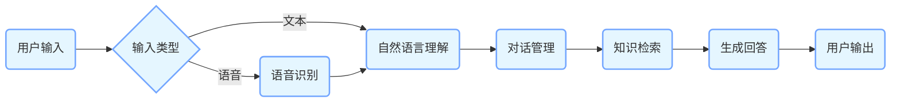

# 企业估值中的AI驱动的虚拟助理系统评估

> 关键词：企业估值、AI驱动、虚拟助理系统、评估方法、技术原理

> 摘要：本文聚焦于企业估值中AI驱动的虚拟助理系统评估这一关键议题。首先介绍了研究的背景和目的，明确预期读者与文档结构。接着深入阐述了虚拟助理系统的核心概念、联系及相关架构，通过Mermaid流程图进行直观呈现。详细讲解了核心算法原理，结合Python代码展开具体操作步骤的说明，并给出了相应的数学模型与公式。通过项目实战，从开发环境搭建到源代码实现与解读，全面展示了虚拟助理系统的实际应用。探讨了其在不同场景下的实际应用，推荐了相关的学习资源、开发工具框架以及论文著作。最后总结了该领域的未来发展趋势与挑战，还给出了常见问题的解答与参考资料，旨在为企业在估值中对AI驱动的虚拟助理系统进行科学评估提供全面且深入的技术指导。

## 1. 背景介绍 
### 1.1 目的和范围
在当今数字化和智能化飞速发展的时代，AI驱动的虚拟助理系统在企业中得到了越来越广泛的应用。企业在进行自身估值时，需要准确评估这些虚拟助理系统的价值，以全面反映企业的资产和竞争力。本研究的目的在于建立一套科学、合理且实用的评估方法，用于评估企业中AI驱动的虚拟助理系统的价值。范围涵盖了虚拟助理系统的技术原理、功能特性、市场影响、成本效益等多个方面，旨在为企业的估值提供全面、准确的参考依据。

### 1.2 预期读者
本文预期读者包括企业估值师、企业管理人员、AI技术研发人员、投资分析师以及对AI驱动的虚拟助理系统感兴趣的相关专业人士。这些读者希望通过本文了解如何在企业估值中科学评估虚拟助理系统的价值，以及该系统的技术原理和应用场景，为决策提供依据。

### 1.3 文档结构概述
本文将按照以下结构展开：首先介绍背景信息，包括目的、范围、预期读者和文档结构概述。接着阐述核心概念与联系，包括虚拟助理系统的原理和架构。然后详细讲解核心算法原理和具体操作步骤，给出相关的数学模型和公式。通过项目实战展示虚拟助理系统的实际应用，包括开发环境搭建、源代码实现和代码解读。探讨实际应用场景，推荐相关的工具和资源。最后总结未来发展趋势与挑战，提供常见问题解答和参考资料。

### 1.4 术语表
#### 1.4.1 核心术语定义
- **AI驱动的虚拟助理系统**：基于人工智能技术，能够模拟人类对话和交互，为用户提供信息查询、任务执行等服务的智能系统。
- **企业估值**：对企业的整体价值进行评估，包括企业的资产、负债、盈利能力、市场竞争力等多个方面。
- **自然语言处理（NLP）**：人工智能的一个分支，研究如何让计算机理解和处理人类语言。
- **机器学习（ML）**：让计算机通过数据和算法自动学习和改进性能的技术。

#### 1.4.2 相关概念解释
- **知识图谱**：一种用于表示实体及其关系的语义网络，可帮助虚拟助理系统更好地理解和处理知识。
- **对话管理**：负责管理虚拟助理系统与用户之间的对话流程，确保对话的连贯性和合理性。
- **语音识别**：将人类语音转换为文本的技术，是虚拟助理系统实现语音交互的基础。

#### 1.4.3 缩略词列表
- **AI**：Artificial Intelligence（人工智能）
- **NLP**：Natural Language Processing（自然语言处理）
- **ML**：Machine Learning（机器学习）
- **RNN**：Recurrent Neural Network（循环神经网络）
- **LSTM**：Long Short - Term Memory（长短期记忆网络）

## 2. 核心概念与联系 
### 2.1 核心概念原理
AI驱动的虚拟助理系统主要基于自然语言处理和机器学习技术。自然语言处理技术使系统能够理解用户输入的自然语言，包括语音和文本。通过词法分析、句法分析、语义分析等步骤，将用户的语言转换为计算机能够理解的形式。机器学习技术则用于训练系统的模型，使其能够不断学习和改进性能。常见的机器学习算法包括深度学习算法，如循环神经网络（RNN）和长短期记忆网络（LSTM），这些算法可以处理序列数据，非常适合处理自然语言。

虚拟助理系统的工作流程一般包括语音识别（如果支持语音交互）、自然语言理解、对话管理、知识检索和生成回答等步骤。用户输入的语音或文本首先经过语音识别转换为文本，然后自然语言理解模块对文本进行分析，提取语义信息。对话管理模块根据历史对话和当前用户输入，确定对话的状态和下一步操作。知识检索模块从知识库或互联网中查找相关信息，最后生成回答模块将检索到的信息转换为自然语言输出给用户。

### 2.2 架构示意图
以下是AI驱动的虚拟助理系统的架构文本示意图：

用户（语音/文本输入） -> 语音识别模块 -> 自然语言理解模块 -> 对话管理模块 -> 知识检索模块 -> 生成回答模块 -> 用户（语音/文本输出）

### 2.3 Mermaid流程图


## 3. 核心算法原理 & 具体操作步骤 
### 3.1 自然语言处理算法原理
自然语言处理中的一个重要任务是文本分类，下面以朴素贝叶斯算法为例进行讲解。朴素贝叶斯算法基于贝叶斯定理，假设特征之间相互独立。对于文本分类问题，我们将文本表示为词袋模型，即每个文本是一个词的集合。

贝叶斯定理公式为：$P(c|d)=\frac{P(d|c)P(c)}{P(d)}$

其中，$P(c|d)$ 是文档 $d$ 属于类别 $c$ 的概率，$P(d|c)$ 是类别 $c$ 中出现文档 $d$ 的概率，$P(c)$ 是类别 $c$ 的先验概率，$P(d)$ 是文档 $d$ 出现的概率。

在实际应用中，由于 $P(d)$ 对于所有类别都是相同的，我们可以忽略它，只需要比较 $P(d|c)P(c)$ 的大小来确定文档的类别。

### 3.2 Python代码实现文本分类
```python
import numpy as np
from sklearn.feature_extraction.text import CountVectorizer
from sklearn.naive_bayes import MultinomialNB
from sklearn.model_selection import train_test_split

# 示例数据
documents = [
    "This is a positive review",
    "This is a negative review",
    "The product is great",
    "The service is terrible"
]
labels = [1, 0, 1, 0]

# 数据预处理
vectorizer = CountVectorizer()
X = vectorizer.fit_transform(documents)

# 划分训练集和测试集
X_train, X_test, y_train, y_test = train_test_split(X, labels, test_size=0.2, random_state=42)

# 训练模型
clf = MultinomialNB()
clf.fit(X_train, y_train)

# 预测
predictions = clf.predict(X_test)
print("Predictions:", predictions)
```
### 3.3 具体操作步骤
1. **数据收集**：收集包含文本和对应类别的数据集。
2. **数据预处理**：使用 `CountVectorizer` 将文本转换为词频矩阵。
3. **划分数据集**：将数据集划分为训练集和测试集。
4. **模型训练**：使用 `MultinomialNB` 训练朴素贝叶斯分类器。
5. **模型评估**：使用测试集评估模型的性能。

## 4. 数学模型和公式 & 详细讲解 & 举例说明 
### 4.1 贝叶斯定理详细讲解
贝叶斯定理是概率论中的一个重要定理，它描述了在已知某些条件下，某个事件发生的概率。在自然语言处理中，我们可以利用贝叶斯定理来进行文本分类。

如前面所述，贝叶斯定理公式为 $P(c|d)=\frac{P(d|c)P(c)}{P(d)}$。其中，$P(c)$ 可以通过计算类别 $c$ 在数据集中出现的频率来估计，$P(d|c)$ 可以通过计算类别 $c$ 中每个词出现的频率来估计。

### 4.2 举例说明
假设我们有一个文本分类任务，要将文本分为“体育”和“科技”两类。我们有以下数据集：

| 文本 | 类别 |
|---|---|
| "The football game is exciting" | 体育 |
| "The new smartphone is amazing" | 科技 |
| "The basketball match was great" | 体育 |
| "The computer software is very useful" | 科技 |

首先，计算先验概率 $P(c)$：
- $P(体育)=\frac{2}{4}=0.5$
- $P(科技)=\frac{2}{4}=0.5$

然后，对于一个新的文本 “The football is cool”，计算 $P(d|c)$：
- 在“体育”类别中，“football” 出现的频率较高，假设 $P(d|体育)=0.8$
- 在“科技”类别中，“football” 出现的频率较低，假设 $P(d|科技)=0.2$

最后，计算 $P(c|d)$：
- $P(体育|d)=\frac{P(d|体育)P(体育)}{P(d)}\approx\frac{0.8\times0.5}{P(d)}$
- $P(科技|d)=\frac{P(d|科技)P(科技)}{P(d)}\approx\frac{0.2\times0.5}{P(d)}$

由于 $P(体育|d)>P(科技|d)$，所以该文本分类为“体育”。

## 5. 项目实战：代码实际案例和详细解释说明 
### 5.1  开发环境搭建
#### 5.1.1 安装Python
首先，确保你已经安装了Python 3.x 版本。可以从Python官方网站（https://www.python.org/downloads/） 下载并安装。

#### 5.1.2 安装必要的库
使用以下命令安装所需的库：
```sh
pip install numpy scikit-learn
```

### 5.2  源代码详细实现和代码解读
以下是一个简单的虚拟助理系统的代码示例，实现了基本的问答功能：
```python
import random

# 定义知识库
knowledge_base = {
    "你好": "你好呀！有什么我可以帮助你的？",
    "今天天气怎么样": "我还没办法获取实时天气信息哦，你可以查看天气预报网站。",
    "你会做什么": "我可以回答一些常见问题，和你聊天呢！"
}

def get_response(user_input):
    if user_input in knowledge_base:
        return knowledge_base[user_input]
    else:
        responses = ["不太理解你的意思呢", "请换一种表达方式", "我还在学习中哦"]
        return random.choice(responses)

# 主循环
while True:
    user_input = input("你有什么问题要问我吗？（输入 '退出' 结束对话）：")
    if user_input == "退出":
        break
    response = get_response(user_input)
    print("回答：", response)
```
### 5.3  代码解读与分析
- **知识库**：`knowledge_base` 是一个字典，存储了常见问题和对应的回答。
- **`get_response` 函数**：该函数接收用户输入，检查是否在知识库中。如果在，则返回对应的回答；否则，随机选择一个提示信息返回。
- **主循环**：不断接收用户输入，直到用户输入 “退出” 结束对话。

这个示例只是一个简单的虚拟助理系统，实际的系统会更加复杂，需要使用自然语言处理和机器学习技术来处理更复杂的问题。

## 6. 实际应用场景 
### 6.1 客户服务
AI驱动的虚拟助理系统可以在企业的客户服务中发挥重要作用。它可以自动回答客户的常见问题，如产品信息、订单状态、售后服务等，提高客户服务效率，降低人力成本。同时，虚拟助理系统可以24小时不间断服务，满足客户随时咨询的需求。

### 6.2 智能办公
在企业的办公场景中，虚拟助理系统可以帮助员工完成一些日常任务，如日程安排、文件检索、信息查询等。员工可以通过语音或文本与虚拟助理系统交互，快速获取所需信息，提高工作效率。

### 6.3 市场营销
虚拟助理系统可以用于企业的市场营销活动。它可以与潜在客户进行互动，了解客户需求，提供个性化的产品推荐，提高客户转化率。同时，虚拟助理系统可以收集客户反馈，为企业的市场营销策略调整提供依据。

## 7. 工具和资源推荐
### 7.1 学习资源推荐
#### 7.1.1 书籍推荐
- 《自然语言处理入门》：这本书系统地介绍了自然语言处理的基本概念、算法和应用，适合初学者入门。
- 《机器学习》：周志华教授的经典著作，全面讲解了机器学习的各种算法和理论。
- 《深度学习》：由Ian Goodfellow、Yoshua Bengio和Aaron Courville撰写，是深度学习领域的权威书籍。

#### 7.1.2 在线课程
- Coursera上的“Natural Language Processing Specialization”：由顶尖大学的教授授课，内容丰富全面。
- edX上的“Introduction to Artificial Intelligence”：介绍人工智能的基本概念和技术。
- 中国大学MOOC上的“机器学习基础”：国内知名高校的课程，适合国内学生学习。

#### 7.1.3 技术博客和网站
- Medium：有很多关于AI和自然语言处理的优秀博客文章。
- Towards Data Science：专注于数据科学和机器学习领域的技术分享。
- 开源中国：国内知名的开源技术社区，有很多关于AI的技术文章和项目。

### 7.2 开发工具框架推荐
#### 7.2.1 IDE和编辑器
- PyCharm：功能强大的Python集成开发环境，适合开发Python项目。
- Visual Studio Code：轻量级的代码编辑器，支持多种编程语言，有丰富的插件。
- Jupyter Notebook：交互式的开发环境，适合进行数据探索和模型训练。

#### 7.2.2 调试和性能分析工具
- PDB：Python自带的调试器，可以帮助调试Python代码。
- cProfile：Python的性能分析工具，可以分析代码的性能瓶颈。
- TensorBoard：用于可视化深度学习模型的训练过程和性能指标。

#### 7.2.3 相关框架和库
- NLTK：自然语言处理工具包，提供了丰富的自然语言处理功能。
- SpaCy：高效的自然语言处理库，支持多种语言。
- TensorFlow：开源的深度学习框架，广泛应用于自然语言处理和其他领域。

### 7.3 相关论文著作推荐
#### 7.3.1 经典论文
- “A Neural Probabilistic Language Model”：提出了神经概率语言模型，为深度学习在自然语言处理中的应用奠定了基础。
- “Long Short - Term Memory”：介绍了长短期记忆网络（LSTM），解决了循环神经网络中的梯度消失问题。
- “Attention Is All You Need”：提出了Transformer模型，在自然语言处理领域取得了巨大成功。

#### 7.3.2 最新研究成果
- 关注顶级学术会议如ACL（Association for Computational Linguistics）、EMNLP（Conference on Empirical Methods in Natural Language Processing）上的最新研究论文。
- 阅读知名学术期刊如Journal of Artificial Intelligence Research（JAIR）上的相关研究成果。

#### 7.3.3 应用案例分析
- 分析一些知名企业如谷歌、微软、亚马逊在虚拟助理系统方面的应用案例，了解他们的技术方案和商业策略。
- 研究一些初创公司在AI驱动的虚拟助理系统领域的创新应用，学习他们的成功经验。

## 8. 总结：未来发展趋势与挑战
### 8.1 未来发展趋势
- **多模态交互**：未来的虚拟助理系统将支持更多的交互方式，如视觉、触觉等，实现更加自然和丰富的人机交互。
- **个性化服务**：根据用户的历史行为和偏好，提供更加个性化的服务，提高用户满意度。
- **行业定制化**：针对不同行业的需求，开发定制化的虚拟助理系统，满足行业的特殊要求。
- **与物联网的融合**：虚拟助理系统将与物联网设备深度融合，实现对智能家居、智能工厂等设备的控制和管理。

### 8.2 挑战
- **数据隐私和安全**：虚拟助理系统需要处理大量的用户数据，如何保护用户数据的隐私和安全是一个重要挑战。
- **语义理解的准确性**：尽管自然语言处理技术取得了很大进展，但在复杂语义理解方面仍然存在不足，需要进一步提高。
- **跨语言和跨文化交流**：随着全球化的发展，虚拟助理系统需要支持多种语言和文化，这对系统的开发和优化提出了更高要求。
- **伦理和法律问题**：AI驱动的虚拟助理系统可能会引发一些伦理和法律问题，如虚假信息传播、算法偏见等，需要制定相应的规范和法律来解决。

## 9. 附录：常见问题与解答
### 9.1 如何评估虚拟助理系统的性能？
可以从多个方面评估虚拟助理系统的性能，如准确率（回答的正确性）、召回率（能够回答的问题比例）、响应时间（回答问题的速度）、用户满意度等。可以使用一些测试数据集和用户反馈来进行评估。

### 9.2 虚拟助理系统的开发成本高吗？
开发成本取决于系统的功能和复杂度。简单的基于规则的虚拟助理系统开发成本相对较低，而基于深度学习的复杂系统开发成本较高，包括数据收集、模型训练、硬件设备等方面的成本。

### 9.3 如何提高虚拟助理系统的智能水平？
可以通过不断优化自然语言处理算法、增加训练数据、采用更先进的机器学习模型等方式来提高虚拟助理系统的智能水平。同时，结合知识图谱、对话管理等技术也可以提升系统的性能。

## 10. 扩展阅读 & 参考资料
- 《人工智能：现代方法》
- 《Python自然语言处理实战》
- 相关学术论文：在IEEE Xplore、ACM Digital Library等学术数据库中搜索关于AI驱动的虚拟助理系统的研究论文。
- 行业报告：关注市场研究机构发布的关于虚拟助理系统市场的研究报告，了解行业动态和发展趋势。