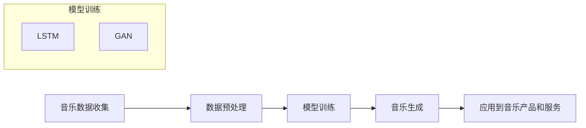

# 企业估值中的人工智能作曲技术评估

> 关键词：企业估值、人工智能作曲技术、技术评估、音乐产业、估值模型

> 摘要：本文聚焦于企业估值中人工智能作曲技术的评估问题。随着人工智能技术在音乐领域的深入应用，人工智能作曲技术展现出巨大的潜力和价值。文章旨在深入剖析人工智能作曲技术的核心概念、算法原理等，构建适用于该技术的估值模型，通过项目实战展示其在实际中的应用，并探讨其实际应用场景、推荐相关工具和资源，最后总结未来发展趋势与挑战，为企业在估值过程中准确评估人工智能作曲技术提供全面且专业的参考。

## 1. 背景介绍 
### 1.1 目的和范围
在当今数字化时代，人工智能技术正以前所未有的速度改变着各个行业，音乐产业也不例外。人工智能作曲技术的出现，不仅为音乐创作带来了新的思路和方法，也为相关企业带来了新的机遇和挑战。本文章的目的在于全面、系统地评估人工智能作曲技术在企业估值中的价值，明确该技术的优势、劣势以及其对企业未来发展的影响。

范围涵盖了人工智能作曲技术的核心原理、算法、数学模型，以及其在音乐创作、音乐产业中的实际应用场景。同时，通过项目实战分析，展示如何在实际中运用相关方法对企业的人工智能作曲技术进行估值。

### 1.2 预期读者
本文预期读者包括企业估值师、投资分析师、音乐产业从业者、人工智能技术开发者以及对人工智能作曲技术和企业估值感兴趣的研究人员。这些读者可能希望通过本文了解人工智能作曲技术的价值评估方法，以便在投资决策、企业战略规划等方面做出更明智的选择。

### 1.3 文档结构概述
本文首先介绍人工智能作曲技术评估的背景，包括目的、预期读者和文档结构。接着阐述核心概念与联系，包括人工智能作曲技术的原理和架构。然后详细讲解核心算法原理和具体操作步骤，并给出相应的Python源代码。随后介绍数学模型和公式，并举例说明。通过项目实战展示代码实际案例和详细解释。探讨实际应用场景，推荐相关工具和资源。最后总结未来发展趋势与挑战，并提供常见问题与解答以及扩展阅读和参考资料。

### 1.4 术语表
#### 1.4.1 核心术语定义
- **人工智能作曲技术**：利用人工智能算法，通过对大量音乐数据的学习和分析，自动生成音乐作品的技术。
- **企业估值**：对企业的整体价值进行评估的过程，通常考虑企业的资产、负债、盈利能力、市场前景等因素。
- **音乐语料库**：包含大量音乐作品的数据集，用于人工智能作曲技术的训练和学习。

#### 1.4.2 相关概念解释
- **深度学习**：一种基于人工神经网络的机器学习方法，通过多层神经网络对数据进行特征提取和学习，在人工智能作曲技术中常用于对音乐特征的学习和音乐生成。
- **生成对抗网络（GAN）**：由生成器和判别器组成的神经网络模型，在人工智能作曲中，生成器尝试生成逼真的音乐，判别器则判断生成的音乐是否真实，通过两者的对抗训练提高生成音乐的质量。

#### 1.4.3 缩略词列表
- **AI**：Artificial Intelligence，人工智能
- **GAN**：Generative Adversarial Networks，生成对抗网络
- **LSTM**：Long Short - Term Memory，长短期记忆网络

## 2. 核心概念与联系 

### 2.1 人工智能作曲技术原理
人工智能作曲技术的核心在于利用机器学习和深度学习算法对音乐数据进行学习和分析，从而生成新的音乐作品。其基本原理是通过对大量音乐作品的特征提取和模式识别，学习音乐的旋律、节奏、和声等元素的规律，然后根据这些规律生成新的音乐。

#### 2.1.1 数据收集与预处理
首先需要收集大量的音乐作品，构建音乐语料库。这些音乐作品可以来自各种渠道，如音乐平台、音乐库等。收集到的数据需要进行预处理，包括音频格式转换、音符提取、音乐特征提取等操作，将音乐数据转换为计算机能够处理的格式。

#### 2.1.2 模型训练
使用机器学习或深度学习模型对预处理后的数据进行训练。常见的模型包括长短期记忆网络（LSTM）、生成对抗网络（GAN）等。在训练过程中，模型不断学习音乐数据的特征和模式，调整模型的参数，以提高生成音乐的质量。

#### 2.1.3 音乐生成
在模型训练完成后，根据用户的需求和输入，模型可以生成新的音乐作品。生成的音乐可以根据不同的规则和约束进行调整，如音乐风格、节奏、时长等。

### 2.2 人工智能作曲技术架构
人工智能作曲技术的架构通常包括数据层、模型层和应用层。

#### 2.2.1 数据层
数据层主要负责音乐数据的收集、存储和管理。它包括音乐语料库的构建、数据的预处理和数据的存储。数据层为模型层提供了训练和学习的基础数据。

#### 2.2.2 模型层
模型层是人工智能作曲技术的核心，它包括各种机器学习和深度学习模型。这些模型通过对数据层提供的数据进行学习和训练，实现音乐的生成。模型层还包括模型的优化和调整，以提高模型的性能和生成音乐的质量。

#### 2.2.3 应用层
应用层是人工智能作曲技术的最终应用场景，它包括音乐创作、音乐推荐、音乐游戏等。应用层将模型层生成的音乐作品应用到实际的音乐产品和服务中，为用户提供更好的音乐体验。

### 2.3 文本示意图
人工智能作曲技术的核心原理和架构可以用以下文本示意图表示：

音乐数据收集 -> 数据预处理 -> 模型训练（LSTM、GAN等） -> 音乐生成 -> 应用到音乐产品和服务

### 2.4 Mermaid流程图


## 3. 核心算法原理 & 具体操作步骤 

### 3.1 长短期记忆网络（LSTM）算法原理
长短期记忆网络（LSTM）是一种特殊的循环神经网络（RNN），它能够有效地处理序列数据中的长期依赖关系。在人工智能作曲中，LSTM可以用于学习音乐的序列特征，如音符的顺序、节奏等。

#### 3.1.1 LSTM单元结构
LSTM单元由输入门、遗忘门、输出门和细胞状态组成。遗忘门决定了上一时刻的细胞状态有多少信息需要被遗忘；输入门决定了当前输入有多少信息需要被添加到细胞状态中；输出门决定了当前细胞状态有多少信息需要被输出。

#### 3.1.2 LSTM数学公式
遗忘门：
$$f_t = \sigma(W_f[h_{t - 1}, x_t] + b_f)$$
输入门：
$$i_t = \sigma(W_i[h_{t - 1}, x_t] + b_i)$$
候选细胞状态：
$$\tilde{C}_t = \tanh(W_C[h_{t - 1}, x_t] + b_C)$$
细胞状态更新：
$$C_t = f_t \odot C_{t - 1}+i_t \odot \tilde{C}_t$$
输出门：
$$o_t = \sigma(W_o[h_{t - 1}, x_t] + b_o)$$
隐藏状态更新：
$$h_t = o_t \odot \tanh(C_t)$$
其中，$f_t$、$i_t$、$o_t$ 分别表示遗忘门、输入门和输出门的输出，$\sigma$ 是 sigmoid 函数，$\tanh$ 是双曲正切函数，$W_f$、$W_i$、$W_C$、$W_o$ 是权重矩阵，$b_f$、$b_i$、$b_C$、$b_o$ 是偏置向量，$h_{t - 1}$ 是上一时刻的隐藏状态，$x_t$ 是当前时刻的输入，$C_{t - 1}$ 是上一时刻的细胞状态，$C_t$ 是当前时刻的细胞状态，$\odot$ 表示逐元素相乘。

### 3.2 生成对抗网络（GAN）算法原理
生成对抗网络（GAN）由生成器和判别器组成。生成器尝试生成逼真的音乐，判别器则判断生成的音乐是否真实。通过两者的对抗训练，生成器的生成能力不断提高。

#### 3.2.1 生成器
生成器接收一个随机噪声向量作为输入，通过一系列的神经网络层将其转换为音乐数据。生成器的目标是生成能够欺骗判别器的音乐。

#### 3.2.2 判别器
判别器接收音乐数据作为输入，判断该音乐数据是真实的还是生成的。判别器的目标是准确地区分真实音乐和生成音乐。

#### 3.2.3 对抗训练
在训练过程中，生成器和判别器交替训练。生成器尝试生成更好的音乐来欺骗判别器，判别器则不断提高自己的判断能力。最终，生成器能够生成高质量的音乐。

### 3.3 Python源代码实现
以下是一个使用Keras库实现简单LSTM音乐生成模型的Python代码示例：

```python
import numpy as np
from keras.models import Sequential
from keras.layers import LSTM, Dense

# 假设我们已经有了音乐数据，这里简单生成一些示例数据
# 生成输入序列和目标序列
sequence_length = 10
num_sequences = 100
num_features = 1

# 生成随机输入序列
input_sequences = np.random.rand(num_sequences, sequence_length, num_features)
# 生成目标序列，这里简单地将输入序列的下一个值作为目标
target_sequences = np.roll(input_sequences, -1, axis=1)

# 构建LSTM模型
model = Sequential()
model.add(LSTM(64, input_shape=(sequence_length, num_features)))
model.add(Dense(num_features, activation='linear'))

# 编译模型
model.compile(loss='mse', optimizer='adam')

# 训练模型
model.fit(input_sequences, target_sequences[:, -1, :], epochs=10, batch_size=32)

# 生成新的音乐序列
seed_sequence = input_sequences[0:1]
generated_sequence = []
for _ in range(20):
    next_note = model.predict(seed_sequence)
    generated_sequence.append(next_note[0, 0])
    seed_sequence = np.roll(seed_sequence, -1, axis=1)
    seed_sequence[0, -1, 0] = next_note[0, 0]

print("Generated sequence:", generated_sequence)
```

### 3.4 具体操作步骤
1. **数据准备**：收集和整理音乐数据，进行预处理，将其转换为适合模型输入的格式。
2. **模型构建**：根据需求选择合适的模型，如LSTM、GAN等，并构建模型的结构。
3. **模型训练**：使用准备好的数据对模型进行训练，调整模型的参数，以提高模型的性能。
4. **音乐生成**：在模型训练完成后，根据用户的需求和输入，使用模型生成新的音乐作品。

## 4. 数学模型和公式 & 详细讲解 & 举例说明 

### 4.1 信息熵在音乐特征分析中的应用
信息熵是信息论中的一个重要概念，用于衡量信息的不确定性。在音乐特征分析中，可以使用信息熵来衡量音乐的复杂度和多样性。

#### 4.1.1 信息熵公式
信息熵的公式为：
$$H(X)=-\sum_{i = 1}^{n}p(x_i)\log_2p(x_i)$$
其中，$X$ 是一个离散随机变量，$x_i$ 是 $X$ 的取值，$p(x_i)$ 是 $x_i$ 出现的概率，$n$ 是 $X$ 的取值个数。

#### 4.1.2 详细讲解
在音乐特征分析中，可以将音乐的音符、节奏等元素看作离散随机变量。通过计算这些元素的信息熵，可以了解音乐的复杂度和多样性。例如，如果一个音乐作品中音符的分布比较均匀，那么其信息熵就比较大，说明该音乐作品的复杂度和多样性较高；反之，如果音符的分布比较集中，那么其信息熵就比较小，说明该音乐作品的复杂度和多样性较低。

#### 4.1.3 举例说明
假设一个音乐作品中只有四个音符 $A$、$B$、$C$、$D$，它们出现的次数分别为 10、20、30、40。则总次数为 $10 + 20+30 + 40 = 100$。

音符 $A$ 出现的概率 $p(A)=\frac{10}{100}=0.1$，音符 $B$ 出现的概率 $p(B)=\frac{20}{100}=0.2$，音符 $C$ 出现的概率 $p(C)=\frac{30}{100}=0.3$，音符 $D$ 出现的概率 $p(D)=\frac{40}{100}=0.4$。

根据信息熵公式，该音乐作品的信息熵为：
$$H(X)=-(0.1\log_20.1 + 0.2\log_20.2+0.3\log_20.3 + 0.4\log_20.4)\approx 1.846$$

### 4.2 马尔可夫链在音乐生成中的应用
马尔可夫链是一种随机过程，它具有无后效性，即未来的状态只与当前状态有关，而与过去的状态无关。在音乐生成中，可以使用马尔可夫链来模拟音乐的生成过程。

#### 4.2.1 马尔可夫链公式
马尔可夫链的状态转移概率可以表示为：
$$P(X_{n + 1}=j|X_n = i)=p_{ij}$$
其中，$X_n$ 表示第 $n$ 时刻的状态，$p_{ij}$ 表示从状态 $i$ 转移到状态 $j$ 的概率。

#### 4.2.2 详细讲解
在音乐生成中，可以将音乐的音符、节奏等元素看作马尔可夫链的状态。通过统计大量音乐作品中这些元素的转移概率，构建马尔可夫链的状态转移矩阵。然后根据当前的音符或节奏，按照状态转移矩阵的概率选择下一个音符或节奏，从而生成音乐。

#### 4.2.3 举例说明
假设一个音乐作品中只有三个音符 $A$、$B$、$C$，其状态转移矩阵为：
$$P=\begin{bmatrix}0.2 & 0.3 & 0.5\\0.4 & 0.3 & 0.3\\0.1 & 0.6 & 0.3\end{bmatrix}$$
如果当前音符是 $A$，则下一个音符是 $A$ 的概率为 0.2，是 $B$ 的概率为 0.3，是 $C$ 的概率为 0.5。根据这些概率，可以随机选择下一个音符，从而生成音乐。

### 4.3 线性回归在音乐估值中的应用
线性回归是一种用于建立自变量和因变量之间线性关系的统计方法。在音乐估值中，可以使用线性回归来建立音乐的特征和其市场价值之间的关系。

#### 4.3.1 线性回归公式
线性回归的一般形式为：
$$y=\beta_0+\beta_1x_1+\beta_2x_2+\cdots+\beta_nx_n+\epsilon$$
其中，$y$ 是因变量，$x_1,x_2,\cdots,x_n$ 是自变量，$\beta_0,\beta_1,\cdots,\beta_n$ 是回归系数，$\epsilon$ 是误差项。

#### 4.3.2 详细讲解
在音乐估值中，可以将音乐的播放量、点赞数、评论数等作为自变量，将音乐的市场价值作为因变量。通过收集大量音乐作品的数据，使用线性回归方法估计回归系数，从而建立音乐特征和市场价值之间的线性关系。根据这个关系，可以对新的音乐作品进行估值。

#### 4.3.3 举例说明
假设我们收集了 100 首音乐作品的数据，包括播放量 $x_1$、点赞数 $x_2$ 和市场价值 $y$。使用线性回归方法估计得到回归系数 $\beta_0 = 100$，$\beta_1 = 0.1$，$\beta_2 = 0.2$。则对于一首新的音乐作品，其播放量为 1000，点赞数为 200，根据线性回归模型，其市场价值估计为：
$$y = 100+0.1\times1000 + 0.2\times200=100 + 100+40 = 240$$

## 5. 项目实战：代码实际案例和详细解释说明 

### 5.1  开发环境搭建
#### 5.1.1 安装Python
首先需要安装Python环境，建议使用Python 3.6及以上版本。可以从Python官方网站（https://www.python.org/downloads/）下载并安装Python。

#### 5.1.2 安装相关库
使用pip命令安装以下相关库：
```bash
pip install numpy
pip install keras
pip install tensorflow
```
其中，numpy是用于数值计算的库，keras是用于构建深度学习模型的高级库，tensorflow是keras的后端库。

### 5.2  源代码详细实现和代码解读
以下是一个使用LSTM和马尔可夫链结合的音乐生成项目的源代码：

```python
import numpy as np
from keras.models import Sequential
from keras.layers import LSTM, Dense

# 音乐数据准备
# 假设我们有一个音乐语料库，这里简单生成一些示例数据
music_corpus = [0, 1, 2, 3, 0, 1, 2, 3, 0, 1]
sequence_length = 3
num_sequences = len(music_corpus) - sequence_length
input_sequences = []
target_sequences = []

for i in range(num_sequences):
    input_sequences.append(music_corpus[i:i + sequence_length])
    target_sequences.append(music_corpus[i + sequence_length])

input_sequences = np.array(input_sequences)
target_sequences = np.array(target_sequences)

# 调整输入序列的形状以适应LSTM模型
input_sequences = np.reshape(input_sequences, (input_sequences.shape[0], input_sequences.shape[1], 1))

# 构建LSTM模型
model = Sequential()
model.add(LSTM(64, input_shape=(sequence_length, 1)))
model.add(Dense(1, activation='linear'))

# 编译模型
model.compile(loss='mse', optimizer='adam')

# 训练模型
model.fit(input_sequences, target_sequences, epochs=100, batch_size=1)

# 马尔可夫链状态转移矩阵
state_transition_matrix = np.zeros((4, 4))
for i in range(len(music_corpus) - 1):
    state_transition_matrix[music_corpus[i], music_corpus[i + 1]] += 1

# 归一化状态转移矩阵
state_transition_matrix = state_transition_matrix / state_transition_matrix.sum(axis=1, keepdims=True)

# 生成新的音乐序列
seed_sequence = input_sequences[0]
generated_sequence = list(seed_sequence.flatten())

for _ in range(20):
    next_note_lstm = model.predict(np.array([seed_sequence]))[0, 0]
    next_note_markov = np.random.choice(4, p=state_transition_matrix[int(generated_sequence[-1])])
    # 综合LSTM和马尔可夫链的结果
    next_note = (next_note_lstm + next_note_markov) / 2
    generated_sequence.append(int(next_note))
    seed_sequence = np.roll(seed_sequence, -1, axis=0)
    seed_sequence[-1, 0] = next_note

print("Generated sequence:", generated_sequence)
```

### 5.3  代码解读与分析
#### 5.3.1 数据准备
首先，我们生成了一个简单的音乐语料库 `music_corpus`，并将其分割成输入序列和目标序列。输入序列是长度为 `sequence_length` 的音符序列，目标序列是输入序列的下一个音符。

#### 5.3.2 模型构建
使用Keras构建了一个简单的LSTM模型，包含一个LSTM层和一个全连接层。LSTM层用于学习音乐的序列特征，全连接层用于输出预测的音符。

#### 5.3.3 模型训练
使用准备好的输入序列和目标序列对模型进行训练，训练100个epoch，批量大小为1。

#### 5.3.4 马尔可夫链状态转移矩阵
统计音乐语料库中音符的转移概率，构建马尔可夫链的状态转移矩阵，并进行归一化处理。

#### 5.3.5 音乐生成
使用训练好的LSTM模型和马尔可夫链状态转移矩阵生成新的音乐序列。每次生成下一个音符时，综合LSTM模型的预测结果和马尔可夫链的随机选择结果。

## 6. 实际应用场景 
### 6.1 音乐创作
人工智能作曲技术可以为音乐创作者提供灵感和辅助创作。创作者可以使用人工智能作曲系统生成一些初始的音乐片段，然后在此基础上进行修改和完善，提高创作效率。

### 6.2 音乐推荐
通过分析用户的音乐偏好和历史播放记录，使用人工智能作曲技术生成符合用户口味的音乐，为用户提供个性化的音乐推荐。

### 6.3 音乐游戏
在音乐游戏中，使用人工智能作曲技术实时生成与游戏场景和节奏相匹配的音乐，增加游戏的趣味性和沉浸感。

### 6.4 广告配乐
为广告制作量身定制的配乐，根据广告的主题、风格和情感需求，使用人工智能作曲技术生成独特的音乐，增强广告的吸引力和感染力。

## 7. 工具和资源推荐
### 7.1 学习资源推荐
#### 7.1.1 书籍推荐
- 《深度学习》（Deep Learning），作者：Ian Goodfellow、Yoshua Bengio和Aaron Courville。这本书是深度学习领域的经典著作，全面介绍了深度学习的基本概念、算法和应用。
- 《Python深度学习》（Deep Learning with Python），作者：Francois Chollet。这本书结合Keras库，详细介绍了如何使用Python进行深度学习的实践。
- 《音乐信息检索》（Music Information Retrieval），作者：Meinard Müller。这本书介绍了音乐信息检索的基本概念、算法和应用，对于理解音乐特征分析和人工智能作曲技术有很大帮助。

#### 7.1.2 在线课程
- Coursera上的“深度学习专项课程”（Deep Learning Specialization），由Andrew Ng教授授课，涵盖了深度学习的各个方面。
- edX上的“音乐信息检索”（Music Information Retrieval）课程，介绍了音乐信息检索的理论和实践。
- Udemy上的“人工智能音乐创作”（Artificial Intelligence for Music Creation）课程，专注于人工智能作曲技术的应用。

#### 7.1.3 技术博客和网站
- Medium上有很多关于人工智能和音乐技术的博客文章，可以关注相关的主题标签，如“AI Music”、“Music Technology”等。
- 音乐技术网站MusicTech（https://www.musictech.net/） 提供了最新的音乐技术资讯和教程。
- 人工智能研究网站ArXiv（https://arxiv.org/） 上有很多关于人工智能作曲技术的研究论文。

### 7.2 开发工具框架推荐
#### 7.2.1 IDE和编辑器
- PyCharm：一款功能强大的Python集成开发环境，提供了代码编辑、调试、版本控制等功能。
- Jupyter Notebook：一个交互式的笔记本环境，适合进行数据探索、模型训练和代码演示。
- Visual Studio Code：一款轻量级的代码编辑器，支持多种编程语言，有丰富的插件扩展。

#### 7.2.2 调试和性能分析工具
- TensorBoard：TensorFlow的可视化工具，可以用于监控模型训练过程中的损失函数、准确率等指标，以及可视化模型的结构。
- Py-Spy：一个用于Python程序性能分析的工具，可以分析程序的CPU使用情况和函数调用时间。
- Memory Profiler：一个用于Python程序内存分析的工具，可以分析程序中各个函数的内存使用情况。

#### 7.2.3 相关框架和库
- Keras：一个高级的深度学习框架，提供了简单易用的API，适合快速搭建和训练深度学习模型。
- TensorFlow：一个开源的深度学习框架，具有强大的计算能力和分布式训练功能。
- Music21：一个用于音乐分析和生成的Python库，提供了丰富的音乐数据处理和分析工具。

### 7.3 相关论文著作推荐
#### 7.3.1 经典论文
- “Generating Music with Recurrent Neural Networks”，作者：Alex Graves。这篇论文介绍了如何使用循环神经网络生成音乐。
- “Music Generation with LSTM Recurrent Neural Networks”，作者：Jiawei Huang。这篇论文详细阐述了使用LSTM网络进行音乐生成的方法。
- “A Neural Algorithm of Artistic Style”，作者：Leon A. Gatys、Alexander S. Ecker和Matthias Bethge。虽然这篇论文主要关于艺术风格迁移，但其中的思想和方法对音乐生成也有一定的启发。

#### 7.3.2 最新研究成果
- 关注ACM SIGMM（Special Interest Group on Multimedia）、ISMIR（International Society for Music Information Retrieval）等学术会议和期刊，获取关于人工智能作曲技术的最新研究成果。
- 一些知名的人工智能研究机构，如OpenAI、DeepMind等，也会发布相关的研究论文和技术报告。

#### 7.3.3 应用案例分析
- 分析一些成功的人工智能音乐创作项目，如Jukedeck（现名为Aiva）、Amper Music等，了解它们的技术实现和商业应用模式。

## 8. 总结：未来发展趋势与挑战
### 8.1 未来发展趋势
#### 8.1.1 技术融合
人工智能作曲技术将与其他技术，如虚拟现实、增强现实、物联网等深度融合，创造出更加沉浸式和互动性的音乐体验。例如，在虚拟现实环境中，用户可以与人工智能生成的音乐进行实时互动，根据自己的动作和行为改变音乐的节奏和旋律。

#### 8.1.2 个性化定制
随着人工智能技术的不断发展，音乐将更加个性化。人工智能作曲系统可以根据用户的情感状态、生活场景、个人喜好等因素，生成完全符合用户需求的音乐作品。

#### 8.1.3 跨文化音乐创作
人工智能作曲技术可以打破文化和语言的障碍，促进不同文化之间的音乐交流和融合。通过对不同文化音乐数据的学习和分析，人工智能可以生成具有跨文化特色的音乐作品。

### 8.2 挑战
#### 8.2.1 音乐版权问题
人工智能生成的音乐作品的版权归属问题是一个亟待解决的问题。由于人工智能作曲技术是基于大量的音乐数据进行学习和生成的，如何确定音乐作品的版权所有者，以及如何保护原创音乐作品的版权，是需要深入研究的问题。

#### 8.2.2 音乐质量和创造力
虽然人工智能作曲技术在不断发展，但目前生成的音乐作品在质量和创造力方面仍然存在一定的局限性。如何提高人工智能生成音乐的质量和创造力，使其能够与人类音乐家的作品相媲美，是未来需要解决的挑战。

#### 8.2.3 社会接受度
人工智能作曲技术的发展可能会对传统音乐产业和音乐家的职业产生影响，导致一些人对其产生抵触情绪。如何提高社会对人工智能作曲技术的接受度，促进其健康发展，是需要关注的问题。

## 9. 附录：常见问题与解答
### 9.1 人工智能作曲技术生成的音乐有版权吗？
目前，关于人工智能作曲技术生成的音乐的版权归属问题还没有明确的法律规定。一些观点认为，音乐的版权应该归属于开发人工智能作曲系统的公司或个人；另一些观点认为，应该根据具体的创作过程和参与人员来确定版权归属。这个问题需要进一步的法律研究和探讨。

### 9.2 人工智能作曲技术会取代人类音乐家吗？
人工智能作曲技术不会完全取代人类音乐家。虽然人工智能可以生成音乐作品，但它缺乏人类音乐家的情感表达和创造力。人类音乐家可以通过自己的生活经历、情感体验和艺术感悟，创作出具有独特魅力和深度的音乐作品。人工智能作曲技术更多的是作为人类音乐家的辅助工具，为音乐创作带来新的思路和方法。

### 9.3 如何评估人工智能作曲技术在企业估值中的价值？
评估人工智能作曲技术在企业估值中的价值需要综合考虑多个因素，如技术的创新性、市场需求、应用场景、商业前景、团队技术实力等。可以使用收益法、市场法、成本法等估值方法，结合音乐产业的特点和人工智能技术的发展趋势，对企业的人工智能作曲技术进行估值。

## 10. 扩展阅读 & 参考资料
### 10.1 扩展阅读
- 《未来简史：从智人到神人》（Homo Deus: A Brief History of Tomorrow），作者：尤瓦尔·赫拉利。这本书探讨了人工智能等技术对人类未来的影响，对于理解人工智能作曲技术的发展趋势有一定的启示。
- 《奇点临近》（The Singularity Is Near），作者：雷·库兹韦尔。这本书介绍了人工智能等技术的快速发展以及可能带来的奇点，为我们思考人工智能作曲技术的未来提供了广阔的视野。

### 10.2 参考资料
- 相关学术论文和研究报告，如ACM SIGMM、ISMIR等学术会议和期刊上发表的论文。
- 音乐产业的市场研究报告和统计数据，如国际唱片业协会（IFPI）发布的报告。
- 人工智能技术的官方文档和技术博客，如Keras、TensorFlow等框架的官方文档。