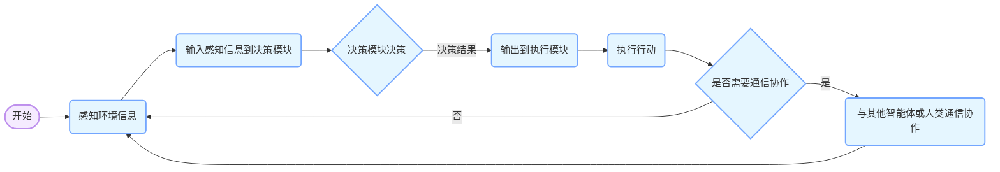

# 企业决策支持系统中的AI Agent角色

> 关键词：企业决策支持系统、AI Agent、智能决策、机器学习、多智能体系统、知识推理、决策优化

> 摘要：本文深入探讨了企业决策支持系统中AI Agent的角色。首先介绍了企业决策支持系统及AI Agent的背景知识，包括目的、预期读者等内容。接着阐述了AI Agent的核心概念、原理和架构，以及其与决策支持系统的联系。通过详细的Python代码讲解了相关核心算法原理和具体操作步骤，并给出了数学模型和公式。结合项目实战，展示了AI Agent在决策支持系统中的代码实现和详细解释。探讨了AI Agent在企业中的实际应用场景，推荐了学习资源、开发工具框架及相关论文著作。最后总结了AI Agent在企业决策支持系统中的未来发展趋势与挑战，并给出常见问题解答和参考资料，旨在全面剖析AI Agent在企业决策支持系统中的重要作用和价值。

## 1. 背景介绍 
### 1.1 目的和范围
企业决策支持系统（Enterprise Decision Support System，EDSS）旨在帮助企业管理者在复杂多变的环境中做出更明智、更科学的决策。随着人工智能技术的快速发展，AI Agent被引入到企业决策支持系统中，以增强系统的智能性和自主性。本文的目的是全面探讨AI Agent在企业决策支持系统中的角色、作用、实现原理和应用场景。范围涵盖了AI Agent的基本概念、相关算法、数学模型、项目实战以及未来发展趋势等方面。

### 1.2 预期读者
本文预期读者包括企业管理者、信息技术专业人员、人工智能研究人员、数据分析师以及对企业决策支持系统和AI Agent感兴趣的人士。企业管理者可以通过本文了解AI Agent如何为企业决策提供支持，信息技术专业人员和人工智能研究人员可以深入学习AI Agent的技术实现细节，数据分析师可以借鉴相关方法进行数据处理和分析，而对该领域感兴趣的人士可以获得全面的知识普及。

### 1.3 文档结构概述
本文将按照以下结构进行组织：首先介绍背景知识，包括目的、预期读者和文档结构概述等内容；接着阐述AI Agent的核心概念、原理和架构，以及其与企业决策支持系统的联系；然后详细讲解核心算法原理和具体操作步骤，并给出数学模型和公式；通过项目实战展示AI Agent在企业决策支持系统中的代码实现和详细解释；探讨AI Agent在企业中的实际应用场景；推荐学习资源、开发工具框架及相关论文著作；最后总结AI Agent在企业决策支持系统中的未来发展趋势与挑战，并给出常见问题解答和参考资料。

### 1.4 术语表
#### 1.4.1 核心术语定义
- **企业决策支持系统（Enterprise Decision Support System，EDSS）**：是一种基于计算机的信息系统，它通过收集、分析和处理企业内外部的数据，为企业管理者提供决策支持信息和工具，帮助他们做出更有效的决策。
- **AI Agent（人工智能智能体）**：是一种能够感知环境、自主决策并采取行动以实现特定目标的智能实体。在企业决策支持系统中，AI Agent可以模拟人类的决策过程，根据环境信息和预设的规则或模型进行决策，并为企业管理者提供决策建议。
- **多智能体系统（Multi - Agent System，MAS）**：由多个AI Agent组成的系统，这些智能体之间可以通过通信和协作来完成复杂的任务。在企业决策支持系统中，多智能体系统可以用于处理多方面的决策问题，各个智能体负责不同的任务或领域，通过协作提供更全面的决策支持。

#### 1.4.2 相关概念解释
- **机器学习（Machine Learning）**：是一门多领域交叉学科，涉及概率论、统计学、逼近论、凸分析、算法复杂度理论等多门学科。它专门研究计算机怎样模拟或实现人类的学习行为，以获取新的知识或技能，重新组织已有的知识结构使之不断改善自身的性能。在AI Agent中，机器学习可以用于训练智能体的决策模型，使其能够根据历史数据和环境信息进行准确的决策。
- **知识推理（Knowledge Reasoning）**：是指在已有知识的基础上，通过一定的推理规则和算法，推导出新的知识或结论的过程。在企业决策支持系统中，AI Agent可以利用知识推理来处理复杂的决策问题，根据已有的知识和规则进行逻辑推理，为企业管理者提供合理的决策建议。

#### 1.4.3 缩略词列表
- **EDSS**：Enterprise Decision Support System（企业决策支持系统）
- **AI**：Artificial Intelligence（人工智能）
- **MAS**：Multi - Agent System（多智能体系统）
- **ML**：Machine Learning（机器学习）

## 2. 核心概念与联系 
### 2.1 AI Agent的核心概念
AI Agent是一种具有自主性、反应性、社会性和主动性的智能实体。自主性是指AI Agent能够在没有人类干预的情况下，独立地感知环境、做出决策并采取行动；反应性是指AI Agent能够及时感知环境的变化，并做出相应的反应；社会性是指AI Agent能够与其他智能体或人类进行通信和协作；主动性是指AI Agent能够主动地采取行动以实现自己的目标。

在企业决策支持系统中，AI Agent可以被看作是一个智能的决策助手。它可以收集和分析企业内外部的数据，如市场数据、财务数据、生产数据等，根据预设的决策模型和规则，为企业管理者提供决策建议。同时，AI Agent还可以与其他智能体或人类进行交互，获取更多的信息和反馈，不断优化自己的决策模型和建议。

### 2.2 AI Agent与企业决策支持系统的联系
AI Agent与企业决策支持系统密切相关。企业决策支持系统为AI Agent提供了应用场景和数据支持，而AI Agent则为企业决策支持系统注入了智能性和自主性。具体来说，AI Agent可以在以下几个方面为企业决策支持系统提供支持：
- **数据处理和分析**：AI Agent可以收集、整理和分析企业内外部的大量数据，提取有价值的信息和知识，为企业决策提供数据支持。
- **决策模型构建和优化**：AI Agent可以利用机器学习等技术，根据历史数据和业务规则构建决策模型，并不断优化模型，提高决策的准确性和效率。
- **决策建议生成**：AI Agent可以根据当前的环境信息和决策模型，为企业管理者提供决策建议，帮助他们做出更明智的决策。
- **决策过程监控和调整**：AI Agent可以实时监控决策的执行过程，根据反馈信息及时调整决策策略，确保决策的顺利实施。

### 2.3 原理和架构的文本示意图
AI Agent的基本原理是基于感知 - 决策 - 行动的循环过程。具体来说，AI Agent通过传感器感知环境信息，将感知到的信息输入到决策模块中，决策模块根据预设的决策模型和规则进行决策，然后将决策结果输出到执行器，执行器根据决策结果采取相应的行动。

AI Agent的架构通常包括感知模块、决策模块、执行模块和通信模块。感知模块负责收集环境信息，决策模块负责根据感知信息进行决策，执行模块负责执行决策结果，通信模块负责与其他智能体或人类进行通信和协作。

### 2.4 Mermaid流程图


## 3. 核心算法原理 & 具体操作步骤 
### 3.1 核心算法原理
在企业决策支持系统中，AI Agent常用的核心算法包括机器学习算法、知识推理算法等。下面以机器学习中的决策树算法为例，详细讲解其原理。

决策树是一种基于树结构进行决策的算法。它通过对训练数据进行学习，构建一棵决策树，每个内部节点表示一个属性上的测试，每个分支表示一个测试输出，每个叶节点表示一个类别或值。决策树的构建过程是一个递归的过程，其基本思想是选择一个最优的属性作为当前节点的划分属性，将数据集划分为不同的子集，然后对每个子集递归地构建决策树。

### 3.2 Python源代码详细阐述
```python
import pandas as pd
from sklearn.tree import DecisionTreeClassifier
from sklearn.model_selection import train_test_split
from sklearn.metrics import accuracy_score

# 加载数据集
data = pd.read_csv('data.csv')

# 分离特征和标签
X = data.drop('target', axis=1)
y = data['target']

# 划分训练集和测试集
X_train, X_test, y_train, y_test = train_test_split(X, y, test_size=0.2, random_state=42)

# 创建决策树分类器
clf = DecisionTreeClassifier()

# 训练模型
clf.fit(X_train, y_train)

# 预测
y_pred = clf.predict(X_test)

# 计算准确率
accuracy = accuracy_score(y_test, y_pred)
print(f"模型准确率: {accuracy}")
```
### 3.3 具体操作步骤
1. **数据加载**：使用`pandas`库加载数据集，将数据集存储在`DataFrame`对象中。
2. **特征和标签分离**：将数据集中的特征和标签分离，分别存储在`X`和`y`中。
3. **数据集划分**：使用`train_test_split`函数将数据集划分为训练集和测试集，其中测试集占总数据集的20%。
4. **模型创建**：创建一个决策树分类器对象`clf`。
5. **模型训练**：使用训练集对决策树分类器进行训练，调用`fit`方法。
6. **预测**：使用训练好的模型对测试集进行预测，调用`predict`方法。
7. **准确率计算**：使用`accuracy_score`函数计算模型的准确率，并输出结果。

## 4. 数学模型和公式 & 详细讲解 & 举例说明 
### 4.1 信息增益公式
在决策树算法中，常用信息增益来选择最优的划分属性。信息增益的计算公式如下：
$$
IG(D, a) = Ent(D) - \sum_{v = 1}^{V}\frac{|D^{v}|}{|D|}Ent(D^{v})
$$
其中，$IG(D, a)$ 表示属性 $a$ 对数据集 $D$ 的信息增益，$Ent(D)$ 表示数据集 $D$ 的信息熵，$V$ 表示属性 $a$ 的取值个数，$D^{v}$ 表示属性 $a$ 取值为 $v$ 的样本子集，$|D|$ 表示数据集 $D$ 的样本数量，$|D^{v}|$ 表示样本子集 $D^{v}$ 的样本数量。

### 4.2 信息熵公式
信息熵是衡量数据集纯度的指标，其计算公式如下：
$$
Ent(D) = -\sum_{k = 1}^{K}p_{k}\log_{2}p_{k}
$$
其中，$Ent(D)$ 表示数据集 $D$ 的信息熵，$K$ 表示数据集 $D$ 中类别数量，$p_{k}$ 表示第 $k$ 个类别的样本在数据集 $D$ 中所占的比例。

### 4.3 详细讲解
信息增益的计算过程是先计算数据集 $D$ 的信息熵 $Ent(D)$，然后对于每个属性 $a$，计算其不同取值下的样本子集 $D^{v}$ 的信息熵 $Ent(D^{v})$，并根据公式计算信息增益 $IG(D, a)$。选择信息增益最大的属性作为当前节点的划分属性。

### 4.4 举例说明
假设有一个数据集 $D$ 包含 10 个样本，分为两个类别，其中类别 1 有 6 个样本，类别 2 有 4 个样本。则数据集 $D$ 的信息熵为：
$$
Ent(D) = -\frac{6}{10}\log_{2}\frac{6}{10}-\frac{4}{10}\log_{2}\frac{4}{10} \approx 0.971
$$
假设有一个属性 $a$ 有两个取值，取值 1 对应的样本子集 $D^{1}$ 包含 4 个样本，其中类别 1 有 3 个样本，类别 2 有 1 个样本；取值 2 对应的样本子集 $D^{2}$ 包含 6 个样本，其中类别 1 有 3 个样本，类别 2 有 3 个样本。则样本子集 $D^{1}$ 的信息熵为：
$$
Ent(D^{1}) = -\frac{3}{4}\log_{2}\frac{3}{4}-\frac{1}{4}\log_{2}\frac{1}{4} \approx 0.811
$$
样本子集 $D^{2}$ 的信息熵为：
$$
Ent(D^{2}) = -\frac{3}{6}\log_{2}\frac{3}{6}-\frac{3}{6}\log_{2}\frac{3}{6} = 1
$$
属性 $a$ 对数据集 $D$ 的信息增益为：
$$
IG(D, a) = Ent(D)-\frac{4}{10}Ent(D^{1})-\frac{6}{10}Ent(D^{2}) \approx 0.971 - \frac{4}{10} \times 0.811 - \frac{6}{10} \times 1 \approx 0.146
$$

## 5. 项目实战：代码实际案例和详细解释说明 
### 5.1 开发环境搭建
1. **安装Python**：从Python官方网站（https://www.python.org/downloads/）下载并安装Python 3.x版本。
2. **安装必要的库**：使用`pip`命令安装所需的库，如`pandas`、`scikit - learn`等。
```sh
pip install pandas scikit-learn
```
3. **选择开发工具**：可以选择使用PyCharm、Jupyter Notebook等开发工具。

### 5.2 源代码详细实现和代码解读
```python
import pandas as pd
from sklearn.tree import DecisionTreeClassifier
from sklearn.model_selection import train_test_split
from sklearn.metrics import accuracy_score
from sklearn.preprocessing import LabelEncoder

# 加载数据集
data = pd.read_csv('customer_churn.csv')

# 数据预处理
# 处理缺失值
data = data.dropna()

# 处理分类变量
categorical_columns = data.select_dtypes(include=['object']).columns
for column in categorical_columns:
    le = LabelEncoder()
    data[column] = le.fit_transform(data[column])

# 分离特征和标签
X = data.drop('Churn', axis=1)
y = data['Churn']

# 划分训练集和测试集
X_train, X_test, y_train, y_test = train_test_split(X, y, test_size=0.2, random_state=42)

# 创建决策树分类器
clf = DecisionTreeClassifier()

# 训练模型
clf.fit(X_train, y_train)

# 预测
y_pred = clf.predict(X_test)

# 计算准确率
accuracy = accuracy_score(y_test, y_pred)
print(f"模型准确率: {accuracy}")
```
### 5.3 代码解读与分析
1. **数据加载**：使用`pandas`的`read_csv`函数加载客户流失数据集`customer_churn.csv`。
2. **数据预处理**：
    - **处理缺失值**：使用`dropna`方法删除包含缺失值的行。
    - **处理分类变量**：使用`LabelEncoder`对分类变量进行编码，将其转换为数值类型。
3. **特征和标签分离**：将数据集中的特征和标签分离，分别存储在`X`和`y`中。
4. **数据集划分**：使用`train_test_split`函数将数据集划分为训练集和测试集，其中测试集占总数据集的20%。
5. **模型创建**：创建一个决策树分类器对象`clf`。
6. **模型训练**：使用训练集对决策树分类器进行训练，调用`fit`方法。
7. **预测**：使用训练好的模型对测试集进行预测，调用`predict`方法。
8. **准确率计算**：使用`accuracy_score`函数计算模型的准确率，并输出结果。

## 6. 实际应用场景 
### 6.1 市场决策支持
在市场决策方面，AI Agent可以收集和分析市场数据，如市场趋势、竞争对手信息、消费者需求等。通过对这些数据的分析，AI Agent可以为企业提供市场细分、目标市场选择、产品定位等方面的决策建议。例如，AI Agent可以根据消费者的购买行为和偏好，将市场细分为不同的群体，企业可以针对不同的群体制定不同的营销策略。

### 6.2 财务决策支持
在财务决策方面，AI Agent可以对企业的财务数据进行分析，如财务报表、成本数据、现金流等。通过对这些数据的分析，AI Agent可以为企业提供财务风险评估、投资决策、预算规划等方面的决策建议。例如，AI Agent可以通过分析企业的财务比率，评估企业的财务风险，并为企业提供降低风险的建议。

### 6.3 生产决策支持
在生产决策方面，AI Agent可以收集和分析生产数据，如生产进度、设备状态、原材料库存等。通过对这些数据的分析，AI Agent可以为企业提供生产计划制定、设备维护计划安排、原材料采购计划等方面的决策建议。例如，AI Agent可以根据生产进度和设备状态，合理安排设备维护计划，避免设备故障对生产造成影响。

### 6.4 人力资源决策支持
在人力资源决策方面，AI Agent可以收集和分析员工数据，如员工绩效、员工满意度、员工离职率等。通过对这些数据的分析，AI Agent可以为企业提供人员招聘、培训计划制定、薪酬管理等方面的决策建议。例如，AI Agent可以根据员工绩效和离职率，分析员工流失的原因，并为企业提供留住人才的建议。

## 7. 工具和资源推荐
### 7.1 学习资源推荐
#### 7.1.1 书籍推荐
- 《人工智能：一种现代的方法》：这本书是人工智能领域的经典教材，全面介绍了人工智能的基本概念、算法和应用。
- 《Python机器学习》：详细介绍了Python在机器学习中的应用，包括各种机器学习算法的实现和案例分析。
- 《多智能体系统》：系统地介绍了多智能体系统的理论、方法和应用，对于理解AI Agent在多智能体系统中的作用有很大帮助。

#### 7.1.2 在线课程
- Coursera上的“Machine Learning”课程：由Andrew Ng教授授课，是机器学习领域的经典课程，涵盖了机器学习的基本概念、算法和应用。
- edX上的“Artificial Intelligence”课程：全面介绍了人工智能的基本概念、算法和应用，适合初学者学习。
- 中国大学MOOC上的“人工智能基础”课程：由国内知名高校的教授授课，内容丰富，适合国内学生学习。

#### 7.1.3 技术博客和网站
- Medium：上面有很多关于人工智能和机器学习的技术博客文章，涵盖了最新的研究成果和应用案例。
- Towards Data Science：专注于数据科学和机器学习领域，提供了很多高质量的技术文章和教程。
- 开源中国：国内知名的开源技术社区，有很多关于人工智能和机器学习的技术文章和项目分享。

### 7.2 开发工具框架推荐
#### 7.2.1 IDE和编辑器
- PyCharm：一款专门为Python开发设计的集成开发环境，功能强大，提供了代码编辑、调试、版本控制等功能。
- Jupyter Notebook：一种交互式的开发环境，适合进行数据分析和机器学习实验，支持多种编程语言。
- Visual Studio Code：一款轻量级的代码编辑器，支持多种编程语言，有丰富的插件和扩展。

#### 7.2.2 调试和性能分析工具
- PySnooper：一个简单易用的Python调试工具，可以自动记录函数的执行过程和变量的值。
- cProfile：Python标准库中的性能分析工具，可以分析代码的性能瓶颈，找出需要优化的部分。
- TensorBoard：TensorFlow的可视化工具，可以用于可视化训练过程、模型结构等。

#### 7.2.3 相关框架和库
- Scikit - learn：一个简单易用的机器学习库，提供了各种机器学习算法的实现和工具，适合初学者使用。
- TensorFlow：一个开源的深度学习框架，广泛应用于图像识别、自然语言处理等领域。
- PyTorch：一个开源的深度学习框架，具有动态图的特点，适合研究和开发。

### 7.3 相关论文著作推荐
#### 7.3.1 经典论文
- “A Mathematical Theory of Communication”：香农的经典论文，奠定了信息论的基础，对于理解信息增益等概念有重要意义。
- “Learning Representations by Back - Propagating Errors”：介绍了反向传播算法，是神经网络领域的经典论文。
- “Playing Atari with Deep Reinforcement Learning”：首次将深度强化学习应用于Atari游戏，开创了深度强化学习的先河。

#### 7.3.2 最新研究成果
- 关注顶级学术会议如NeurIPS、ICML、CVPR等的最新论文，了解人工智能和机器学习领域的最新研究成果。
- 关注知名学术期刊如Journal of Artificial Intelligence Research、Artificial Intelligence等的最新论文。

#### 7.3.3 应用案例分析
- 一些企业和研究机构会发布关于AI Agent在企业决策支持系统中的应用案例分析，可以通过企业官网、研究机构网站等渠道获取。

## 8. 总结：未来发展趋势与挑战
### 8.1 未来发展趋势
- **深度融合**：AI Agent将与企业决策支持系统更加深度融合，不仅提供决策建议，还将参与到决策的执行和监控过程中，实现决策的自动化和智能化。
- **多智能体协作**：多智能体系统将得到更广泛的应用，不同的AI Agent可以负责不同的任务和领域，通过协作提供更全面、更高效的决策支持。
- **强化学习应用**：强化学习将在AI Agent中得到更广泛的应用，使AI Agent能够通过与环境的交互不断学习和优化决策策略，提高决策的适应性和灵活性。
- **与其他技术融合**：AI Agent将与区块链、物联网等技术融合，为企业决策支持系统提供更安全、更可靠的数据支持和决策环境。

### 8.2 挑战
- **数据质量和安全**：AI Agent的决策依赖于大量的数据，数据的质量和安全直接影响决策的准确性和可靠性。如何保证数据的质量和安全是一个重要的挑战。
- **模型可解释性**：一些复杂的机器学习模型如深度学习模型具有很强的预测能力，但缺乏可解释性。在企业决策支持系统中，需要模型能够提供可解释的决策建议，以便企业管理者理解和接受。
- **伦理和法律问题**：AI Agent的应用可能会带来一些伦理和法律问题，如隐私保护、算法歧视等。如何解决这些问题是AI Agent在企业决策支持系统中应用的关键。

## 9. 附录：常见问题与解答
### 9.1 AI Agent在企业决策支持系统中的准确性如何保证？
AI Agent的准确性可以通过以下几个方面来保证：
- **数据质量**：确保输入的数据准确、完整、一致，避免数据噪声和错误对模型的影响。
- **模型选择和优化**：选择合适的机器学习模型，并通过交叉验证、超参数调优等方法对模型进行优化，提高模型的准确性。
- **模型评估和监控**：使用评估指标如准确率、召回率等对模型进行评估，并实时监控模型的性能，及时调整模型。

### 9.2 AI Agent与人类决策者如何协作？
AI Agent与人类决策者可以通过以下方式协作：
- **决策建议提供**：AI Agent为人类决策者提供决策建议，人类决策者根据自己的经验和判断对建议进行评估和调整。
- **信息交互**：人类决策者可以向AI Agent提供额外的信息和反馈，帮助AI Agent优化决策模型和建议。
- **共同决策**：在一些复杂的决策问题中，AI Agent和人类决策者可以共同参与决策过程，发挥各自的优势，提高决策的质量。

### 9.3 AI Agent在企业决策支持系统中的应用成本高吗？
AI Agent在企业决策支持系统中的应用成本包括数据收集和处理成本、模型训练和优化成本、硬件和软件成本等。具体成本取决于企业的规模、应用场景和需求等因素。随着人工智能技术的发展和普及，应用成本逐渐降低，一些开源的工具和框架也可以帮助企业降低成本。

## 10. 扩展阅读 & 参考资料
### 10.1 扩展阅读
- 《智能时代》：介绍了人工智能对社会和经济的影响，以及未来的发展趋势。
- 《大数据时代》：探讨了大数据在各个领域的应用和价值。
- 《算法之美》：从数学和计算机科学的角度介绍了算法的设计和应用。

### 10.2 参考资料
- 相关学术论文和研究报告。
- 企业决策支持系统和AI Agent的相关技术文档和白皮书。
- 开源项目的代码和文档。