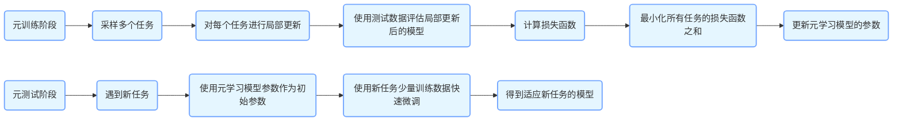

# 元学习驱动的AI Agent快速适应新环境

> 关键词：元学习、AI Agent、快速适应、新环境、学习算法、模型优化

> 摘要：本文聚焦于元学习驱动的AI Agent在快速适应新环境方面的技术。首先介绍了元学习和AI Agent的相关背景知识，深入剖析了元学习的核心概念、原理及架构。详细阐述了元学习的核心算法原理，通过Python代码进行了具体实现步骤的展示，并给出了相关的数学模型和公式。结合项目实战，提供了代码实际案例及详细解释说明。探讨了元学习驱动的AI Agent在多个实际场景中的应用，推荐了相关的学习资源、开发工具框架以及论文著作。最后总结了该领域未来的发展趋势与挑战，并对常见问题进行了解答，为相关领域的研究和实践提供了全面且深入的参考。

## 1. 背景介绍 
### 1.1 目的和范围
随着人工智能技术的不断发展，AI Agent在各种领域的应用越来越广泛。然而，传统的AI Agent在面对新环境时往往需要大量的数据和长时间的训练才能达到较好的性能。元学习作为一种新兴的学习范式，旨在让AI Agent能够快速适应新环境，减少对大量数据和长时间训练的依赖。本文的目的在于深入探讨元学习如何驱动AI Agent快速适应新环境，涵盖元学习的基本概念、算法原理、数学模型、项目实战、实际应用场景等多个方面，为读者全面呈现这一技术的全貌。

### 1.2 预期读者
本文预期读者包括人工智能领域的研究人员、工程师、学生以及对元学习和AI Agent技术感兴趣的技术爱好者。对于研究人员，本文可提供深入的理论分析和最新的研究思路；对于工程师，可作为实际项目开发的参考；对于学生，有助于系统地学习元学习和AI Agent相关知识；对于技术爱好者，能帮助他们了解该领域的前沿技术。

### 1.3 文档结构概述
本文首先介绍背景知识，包括目的、预期读者和文档结构概述等内容。接着阐述元学习和AI Agent的核心概念与联系，通过文本示意图和Mermaid流程图进行清晰展示。然后详细讲解元学习的核心算法原理，给出Python代码实现步骤。之后介绍相关的数学模型和公式，并举例说明。结合项目实战，展示代码实际案例并进行详细解释。探讨实际应用场景，推荐相关的学习资源、开发工具框架和论文著作。最后总结未来发展趋势与挑战，解答常见问题，并提供扩展阅读和参考资料。

### 1.4 术语表
#### 1.4.1 核心术语定义
- **元学习（Meta - Learning）**：也称为“学习如何学习”，是一种让模型能够快速学习新任务的学习方法，通过在多个任务上进行训练，学习到通用的学习策略和知识表示。
- **AI Agent（人工智能智能体）**：是一个能够感知环境、进行决策并采取行动以实现特定目标的智能实体。
- **快速适应**：指AI Agent在面对新环境或新任务时，能够在较短时间内调整自身的行为和策略，达到较好的性能表现。

#### 1.4.2 相关概念解释
- **任务（Task）**：在元学习中，任务是指一个具体的学习问题，例如图像分类任务、目标检测任务等。
- **元训练（Meta - Training）**：在元学习中，使用多个任务进行训练，以学习到通用的学习策略和知识表示的过程。
- **元测试（Meta - Testing）**：在元学习中，使用新的任务来测试模型在快速适应新环境方面的性能的过程。

#### 1.4.3 缩略词列表
- **MAML（Model - Agnostic Meta - Learning）**：模型无关元学习，是一种经典的元学习算法。
- **RL（Reinforcement Learning）**：强化学习，一种通过智能体与环境交互来学习最优策略的学习方法。

## 2. 核心概念与联系 
### 2.1 元学习的核心概念
元学习的核心思想是“学习如何学习”，即让模型能够在多个任务上进行训练，学习到通用的学习策略和知识表示，从而在面对新任务时能够快速适应。传统的机器学习方法通常是针对单个任务进行训练，而元学习则是在多个任务的集合上进行训练，以提高模型的泛化能力和快速适应能力。

### 2.2 AI Agent的核心概念
AI Agent是一个能够感知环境、进行决策并采取行动以实现特定目标的智能实体。它可以是一个机器人、一个软件程序或其他具有智能行为的系统。AI Agent通过传感器感知环境信息，然后根据内部的决策机制选择合适的行动，并通过执行器将行动施加到环境中。

### 2.3 元学习与AI Agent的联系
元学习为AI Agent提供了一种快速适应新环境的方法。通过元学习，AI Agent可以学习到通用的学习策略和知识表示，从而在面对新环境或新任务时能够快速调整自身的行为和策略。例如，在一个机器人导航任务中，AI Agent可以通过元学习学习到在不同环境中导航的通用策略，当它进入一个新的环境时，能够快速适应并找到正确的路径。

### 2.4 核心概念原理和架构的文本示意图
元学习驱动的AI Agent快速适应新环境的原理和架构可以描述如下：

元学习系统包括元训练阶段和元测试阶段。在元训练阶段，系统使用多个任务进行训练，学习到通用的学习策略和知识表示。具体来说，首先从任务分布中采样多个任务，每个任务包含训练数据和测试数据。对于每个任务，使用训练数据对模型进行局部更新，得到局部更新后的模型。然后，使用测试数据对局部更新后的模型进行评估，计算损失函数。最后，通过最小化所有任务的损失函数之和，更新元学习模型的参数。

在元测试阶段，当AI Agent遇到一个新的任务时，它使用元学习模型的参数作为初始参数，然后使用新任务的少量训练数据对模型进行快速微调，得到适应新任务的模型。

### 2.5 Mermaid流程图


## 3. 核心算法原理 & 具体操作步骤 
### 3.1 核心算法原理 - MAML
MAML（Model - Agnostic Meta - Learning）是一种经典的元学习算法，其核心思想是找到一个初始化的模型参数，使得模型在经过少量的梯度更新后，能够在新任务上取得较好的性能。

MAML的算法流程如下：
1. 初始化模型参数 $\theta$。
2. 在元训练阶段：
    - 从任务分布 $p(\mathcal{T})$ 中采样一批任务 $\{\mathcal{T}_1, \mathcal{T}_2, \cdots, \mathcal{T}_n\}$。
    - 对于每个任务 $\mathcal{T}_i$：
        - 从任务 $\mathcal{T}_i$ 中采样训练数据 $D_{train}^i$ 和测试数据 $D_{test}^i$。
        - 使用训练数据 $D_{train}^i$ 对模型进行一次或多次梯度更新，得到临时参数 $\theta_i'$：
            - 计算损失函数 $L(\theta; D_{train}^i)$。
            - 根据梯度下降法更新参数：$\theta_i' = \theta - \alpha \nabla_{\theta} L(\theta; D_{train}^i)$，其中 $\alpha$ 是学习率。
        - 使用测试数据 $D_{test}^i$ 计算临时参数 $\theta_i'$ 的损失函数 $L(\theta_i'; D_{test}^i)$。
    - 计算所有任务的损失函数之和 $\mathcal{L}(\theta) = \sum_{i = 1}^{n} L(\theta_i'; D_{test}^i)$。
    - 根据梯度下降法更新模型参数 $\theta$：$\theta = \theta - \beta \nabla_{\theta} \mathcal{L}(\theta)$，其中 $\beta$ 是元学习率。
3. 在元测试阶段：
    - 当遇到新任务时，使用元学习得到的参数 $\theta$ 作为初始参数。
    - 使用新任务的少量训练数据对模型进行快速微调，得到适应新任务的模型。

### 3.2 具体操作步骤 - Python代码实现
以下是一个简单的MAML算法的Python代码实现示例，使用PyTorch框架：

```python
import torch
import torch.nn as nn
import torch.optim as optim

# 定义一个简单的神经网络模型
class SimpleNet(nn.Module):
    def __init__(self):
        super(SimpleNet, self).__init__()
        self.fc1 = nn.Linear(10, 20)
        self.fc2 = nn.Linear(20, 1)

    def forward(self, x):
        x = torch.relu(self.fc1(x))
        x = self.fc2(x)
        return x

# 定义MAML算法类
class MAML:
    def __init__(self, model, inner_lr, meta_lr):
        self.model = model
        self.inner_lr = inner_lr
        self.meta_lr = meta_lr
        self.meta_optimizer = optim.Adam(self.model.parameters(), lr=meta_lr)

    def inner_update(self, model, x, y):
        loss_fn = nn.MSELoss()
        loss = loss_fn(model(x), y)
        grads = torch.autograd.grad(loss, model.parameters())
        fast_weights = list(map(lambda p: p[1] - self.inner_lr * p[0], zip(grads, model.parameters())))
        return fast_weights

    def meta_train(self, tasks):
        meta_loss = 0
        for task in tasks:
            x_train, y_train, x_test, y_test = task
            fast_weights = self.inner_update(self.model, x_train, y_train)
            loss_fn = nn.MSELoss()
            temp_model = SimpleNet()
            temp_model.load_state_dict(self.model.state_dict())
            for i, param in enumerate(temp_model.parameters()):
                param.data = fast_weights[i]
            loss = loss_fn(temp_model(x_test), y_test)
            meta_loss += loss
        meta_loss /= len(tasks)
        self.meta_optimizer.zero_grad()
        meta_loss.backward()
        self.meta_optimizer.step()
        return meta_loss.item()

    def meta_test(self, x_train, y_train, x_test, y_test):
        fast_weights = self.inner_update(self.model, x_train, y_train)
        loss_fn = nn.MSELoss()
        temp_model = SimpleNet()
        temp_model.load_state_dict(self.model.state_dict())
        for i, param in enumerate(temp_model.parameters()):
            param.data = fast_weights[i]
        loss = loss_fn(temp_model(x_test), y_test)
        return loss.item()

# 示例使用
if __name__ == "__main__":
    model = SimpleNet()
    maml = MAML(model, inner_lr=0.01, meta_lr=0.001)
    # 生成一些示例任务
    tasks = []
    for _ in range(10):
        x_train = torch.randn(20, 10)
        y_train = torch.randn(20, 1)
        x_test = torch.randn(10, 10)
        y_test = torch.randn(10, 1)
        tasks.append((x_train, y_train, x_test, y_test))
    # 元训练
    for epoch in range(100):
        meta_loss = maml.meta_train(tasks)
        if epoch % 10 == 0:
            print(f"Epoch {epoch}, Meta Loss: {meta_loss}")
    # 元测试
    x_train = torch.randn(20, 10)
    y_train = torch.randn(20, 1)
    x_test = torch.randn(10, 10)
    y_test = torch.randn(10, 1)
    test_loss = maml.meta_test(x_train, y_train, x_test, y_test)
    print(f"Test Loss: {test_loss}")
```

### 3.3 代码解释
1. **模型定义**：`SimpleNet` 类定义了一个简单的两层神经网络模型，用于处理输入数据。
2. **MAML类**：`MAML` 类实现了MAML算法的核心逻辑。
    - `__init__` 方法：初始化模型、内部学习率和元学习率，并定义元优化器。
    - `inner_update` 方法：对模型进行一次内部更新，根据训练数据计算损失函数和梯度，并更新临时参数。
    - `meta_train` 方法：在元训练阶段，对一批任务进行训练，计算元损失并更新模型参数。
    - `meta_test` 方法：在元测试阶段，使用新任务的少量训练数据对模型进行快速微调，并计算测试损失。
3. **示例使用**：生成一些示例任务，进行元训练和元测试，并打印出元损失和测试损失。

## 4. 数学模型和公式 & 详细讲解 & 举例说明 
### 4.1 数学模型和公式
#### 4.1.1 损失函数
在MAML算法中，损失函数用于衡量模型在任务上的性能。对于一个任务 $\mathcal{T}$，其训练数据为 $D_{train}$，测试数据为 $D_{test}$，模型参数为 $\theta$，则损失函数可以表示为：

- 内部损失函数：$L(\theta; D_{train}) = \frac{1}{|D_{train}|} \sum_{(x, y) \in D_{train}} \ell(f_{\theta}(x), y)$，其中 $\ell$ 是损失函数（如均方误差损失、交叉熵损失等），$f_{\theta}(x)$ 是模型在参数 $\theta$ 下对输入 $x$ 的输出。
- 外部损失函数：$L(\theta'; D_{test}) = \frac{1}{|D_{test}|} \sum_{(x, y) \in D_{test}} \ell(f_{\theta'}(x), y)$，其中 $\theta'$ 是经过内部更新后的临时参数。

#### 4.1.2 梯度更新
- 内部更新：$\theta' = \theta - \alpha \nabla_{\theta} L(\theta; D_{train})$，其中 $\alpha$ 是内部学习率。
- 元更新：$\theta = \theta - \beta \nabla_{\theta} \mathcal{L}(\theta)$，其中 $\beta$ 是元学习率，$\mathcal{L}(\theta) = \sum_{i = 1}^{n} L(\theta_i'; D_{test}^i)$ 是所有任务的外部损失函数之和。

### 4.2 详细讲解
- **内部更新**：内部更新的目的是在每个任务的训练数据上对模型进行一次或多次梯度更新，得到临时参数 $\theta'$。这样可以让模型快速适应每个任务的特点。
- **元更新**：元更新的目的是通过最小化所有任务的外部损失函数之和，更新模型的参数 $\theta$。这样可以让模型学习到通用的学习策略和知识表示，从而在面对新任务时能够快速适应。

### 4.3 举例说明
假设我们有一个简单的线性回归任务，输入数据 $x$ 是一维的，输出数据 $y$ 也是一维的。模型 $f_{\theta}(x) = \theta_1 x + \theta_0$，损失函数使用均方误差损失 $\ell(f_{\theta}(x), y) = (f_{\theta}(x) - y)^2$。

- 内部更新：
    - 训练数据 $D_{train} = \{(x_1, y_1), (x_2, y_2), \cdots, (x_n, y_n)\}$。
    - 计算内部损失函数 $L(\theta; D_{train}) = \frac{1}{n} \sum_{i = 1}^{n} (f_{\theta}(x_i) - y_i)^2$。
    - 计算梯度 $\nabla_{\theta} L(\theta; D_{train}) = (\frac{\partial L(\theta; D_{train})}{\partial \theta_0}, \frac{\partial L(\theta; D_{train})}{\partial \theta_1})$。
    - 内部更新：$\theta' = \theta - \alpha \nabla_{\theta} L(\theta; D_{train})$。
- 元更新：
    - 假设有 $m$ 个任务，每个任务的测试数据为 $D_{test}^i$。
    - 计算每个任务的外部损失函数 $L(\theta_i'; D_{test}^i)$。
    - 计算所有任务的外部损失函数之和 $\mathcal{L}(\theta) = \sum_{i = 1}^{m} L(\theta_i'; D_{test}^i)$。
    - 计算梯度 $\nabla_{\theta} \mathcal{L}(\theta)$。
    - 元更新：$\theta = \theta - \beta \nabla_{\theta} \mathcal{L}(\theta)$。

## 5. 项目实战：代码实际案例和详细解释说明 
### 5.1  开发环境搭建
#### 5.1.1 安装Python
首先需要安装Python环境，建议使用Python 3.7及以上版本。可以从Python官方网站（https://www.python.org/downloads/） 下载并安装。

#### 5.1.2 安装依赖库
本项目使用PyTorch框架，需要安装PyTorch及其相关依赖库。可以根据自己的系统和CUDA版本选择合适的安装方式，具体安装命令可以参考PyTorch官方网站（https://pytorch.org/get-started/locally/）。

```bash
# 安装PyTorch（以CPU版本为例）
pip install torch torchvision
```

### 5.2  源代码详细实现和代码解读
#### 5.2.1 数据集准备
在实际项目中，我们需要准备合适的数据集。这里以一个简单的图像分类任务为例，使用MNIST数据集。

```python
import torch
import torchvision
import torchvision.transforms as transforms

# 定义数据预处理
transform = transforms.Compose([
    transforms.ToTensor(),
    transforms.Normalize((0.1307,), (0.3081,))
])

# 加载训练集
trainset = torchvision.datasets.MNIST(root='./data', train=True,
                                      download=True, transform=transform)
trainloader = torch.utils.data.DataLoader(trainset, batch_size=64,
                                          shuffle=True)

# 加载测试集
testset = torchvision.datasets.MNIST(root='./data', train=False,
                                     download=True, transform=transform)
testloader = torch.utils.data.DataLoader(testset, batch_size=64,
                                         shuffle=False)
```

#### 5.2.2 模型定义
定义一个简单的卷积神经网络模型用于图像分类。

```python
import torch.nn as nn
import torch.nn.functional as F

class Net(nn.Module):
    def __init__(self):
        super(Net, self).__init__()
        self.conv1 = nn.Conv2d(1, 10, kernel_size=5)
        self.conv2 = nn.Conv2d(10, 20, kernel_size=5)
        self.fc1 = nn.Linear(320, 50)
        self.fc2 = nn.Linear(50, 10)

    def forward(self, x):
        x = F.relu(F.max_pool2d(self.conv1(x), 2))
        x = F.relu(F.max_pool2d(self.conv2(x), 2))
        x = x.view(-1, 320)
        x = F.relu(self.fc1(x))
        x = self.fc2(x)
        return x
```

#### 5.2.3 MAML算法实现
实现MAML算法的核心逻辑。

```python
import torch.optim as optim

class MAML:
    def __init__(self, model, inner_lr, meta_lr):
        self.model = model
        self.inner_lr = inner_lr
        self.meta_lr = meta_lr
        self.meta_optimizer = optim.Adam(self.model.parameters(), lr=meta_lr)

    def inner_update(self, model, x, y):
        loss_fn = nn.CrossEntropyLoss()
        loss = loss_fn(model(x), y)
        grads = torch.autograd.grad(loss, model.parameters())
        fast_weights = list(map(lambda p: p[1] - self.inner_lr * p[0], zip(grads, model.parameters())))
        return fast_weights

    def meta_train(self, tasks):
        meta_loss = 0
        for task in tasks:
            x_train, y_train, x_test, y_test = task
            fast_weights = self.inner_update(self.model, x_train, y_train)
            loss_fn = nn.CrossEntropyLoss()
            temp_model = Net()
            temp_model.load_state_dict(self.model.state_dict())
            for i, param in enumerate(temp_model.parameters()):
                param.data = fast_weights[i]
            loss = loss_fn(temp_model(x_test), y_test)
            meta_loss += loss
        meta_loss /= len(tasks)
        self.meta_optimizer.zero_grad()
        meta_loss.backward()
        self.meta_optimizer.step()
        return meta_loss.item()

    def meta_test(self, x_train, y_train, x_test, y_test):
        fast_weights = self.inner_update(self.model, x_train, y_train)
        loss_fn = nn.CrossEntropyLoss()
        temp_model = Net()
        temp_model.load_state_dict(self.model.state_dict())
        for i, param in enumerate(temp_model.parameters()):
            param.data = fast_weights[i]
        loss = loss_fn(temp_model(x_test), y_test)
        return loss.item()
```

#### 5.2.4 训练和测试
进行元训练和元测试。

```python
if __name__ == "__main__":
    model = Net()
    maml = MAML(model, inner_lr=0.01, meta_lr=0.001)
    # 生成一些示例任务
    tasks = []
    for _ in range(10):
        indices_train = torch.randperm(len(trainset))[:200]
        x_train = torch.stack([trainset[i][0] for i in indices_train])
        y_train = torch.tensor([trainset[i][1] for i in indices_train])
        indices_test = torch.randperm(len(testset))[:100]
        x_test = torch.stack([testset[i][0] for i in indices_test])
        y_test = torch.tensor([testset[i][1] for i in indices_test])
        tasks.append((x_train, y_train, x_test, y_test))
    # 元训练
    for epoch in range(100):
        meta_loss = maml.meta_train(tasks)
        if epoch % 10 == 0:
            print(f"Epoch {epoch}, Meta Loss: {meta_loss}")
    # 元测试
    indices_train = torch.randperm(len(trainset))[:200]
    x_train = torch.stack([trainset[i][0] for i in indices_train])
    y_train = torch.tensor([trainset[i][1] for i in indices_train])
    indices_test = torch.randperm(len(testset))[:100]
    x_test = torch.stack([testset[i][0] for i in indices_test])
    y_test = torch.tensor([testset[i][1] for i in indices_test])
    test_loss = maml.meta_test(x_train, y_train, x_test, y_test)
    print(f"Test Loss: {test_loss}")
```

### 5.3  代码解读与分析
#### 5.3.1 数据集准备
使用 `torchvision` 库加载MNIST数据集，并进行数据预处理，包括将图像转换为张量和归一化操作。

#### 5.3.2 模型定义
定义了一个简单的卷积神经网络模型 `Net`，包含两个卷积层和两个全连接层。

#### 5.3.3 MAML算法实现
`MAML` 类实现了MAML算法的核心逻辑，包括内部更新和元更新。内部更新使用训练数据对模型进行一次梯度更新，得到临时参数；元更新使用所有任务的测试数据计算元损失，并更新模型参数。

#### 5.3.4 训练和测试
生成一些示例任务，进行元训练和元测试，并打印出元损失和测试损失。通过观察损失的变化，可以评估模型在快速适应新环境方面的性能。

## 6. 实际应用场景 
### 6.1 机器人领域
在机器人领域，元学习驱动的AI Agent可以让机器人快速适应不同的环境和任务。例如，在一个未知的室内环境中，机器人可以通过元学习学习到通用的导航策略，当它进入一个新的房间时，能够快速找到目标位置。此外，机器人在执行不同的任务时，如抓取物体、搬运货物等，也可以使用元学习快速调整自身的行为和策略。

### 6.2 自动驾驶领域
在自动驾驶领域，元学习驱动的AI Agent可以让自动驾驶车辆快速适应不同的路况和驾驶场景。例如，当车辆行驶到一个新的城市时，由于道路规则、交通标志等可能不同，车辆可以使用元学习快速调整自身的驾驶策略，确保行驶安全。此外，在遇到突发情况时，如道路施工、交通事故等，车辆也可以快速适应并做出合理的决策。

### 6.3 医疗领域
在医疗领域，元学习驱动的AI Agent可以帮助医生快速诊断疾病。例如，在面对新的疾病类型或患者群体时，AI Agent可以通过元学习学习到通用的诊断策略，结合患者的症状、检查结果等信息，快速做出准确的诊断。此外，在药物研发过程中，元学习也可以帮助筛选出更有潜力的药物靶点和治疗方案。

### 6.4 金融领域
在金融领域，元学习驱动的AI Agent可以帮助投资者快速适应市场变化。例如，当市场出现新的行情或政策变化时，AI Agent可以通过元学习学习到通用的投资策略，结合市场数据和投资者的风险偏好，快速调整投资组合，降低风险并提高收益。

## 7. 工具和资源推荐
### 7.1 学习资源推荐
#### 7.1.1 书籍推荐
- 《Deep Learning》（深度学习）：由Ian Goodfellow、Yoshua Bengio和Aaron Courville合著，是深度学习领域的经典教材，涵盖了深度学习的基本概念、算法和应用。
- 《Reinforcement Learning: An Introduction》（强化学习导论）：由Richard S. Sutton和Andrew G. Barto合著，是强化学习领域的经典教材，详细介绍了强化学习的基本原理和算法。
- 《Meta - Learning: Theory and Practice》（元学习：理论与实践）：对元学习领域进行了系统的介绍，包括元学习的基本概念、算法、应用等方面的内容。

#### 7.1.2 在线课程
- Coursera上的“Deep Learning Specialization”（深度学习专项课程）：由Andrew Ng教授授课，涵盖了深度学习的各个方面，包括神经网络、卷积神经网络、循环神经网络等。
- edX上的“Artificial Intelligence: Principles and Techniques”（人工智能：原理与技术）：介绍了人工智能的基本原理和技术，包括机器学习、深度学习、强化学习等。
- OpenAI的“Spinning Up in Deep Reinforcement Learning”（深度学习强化学习入门）：提供了深度学习强化学习的入门教程和代码实现。

#### 7.1.3 技术博客和网站
- arXiv（https://arxiv.org/）：是一个预印本平台，提供了大量的学术论文，包括元学习、人工智能等领域的最新研究成果。
- Medium（https://medium.com/）：有许多技术博客文章，涵盖了人工智能、机器学习、元学习等领域的技术分享和经验总结。
- Towards Data Science（https://towardsdatascience.com/）：专注于数据科学和人工智能领域的技术文章，提供了很多有价值的学习资源。

### 7.2 开发工具框架推荐
#### 7.2.1 IDE和编辑器
- PyCharm：是一款专业的Python集成开发环境，提供了丰富的功能，如代码编辑、调试、版本控制等，适合Python项目的开发。
- Jupyter Notebook：是一个交互式的开发环境，支持多种编程语言，如Python、R等，适合进行数据分析、模型训练和实验验证。
- Visual Studio Code：是一款轻量级的代码编辑器，支持多种编程语言和插件，具有丰富的扩展功能，适合快速开发和调试。

#### 7.2.2 调试和性能分析工具
- PyTorch Profiler：是PyTorch提供的性能分析工具，可以帮助开发者分析模型的性能瓶颈，如计算时间、内存占用等。
- TensorBoard：是TensorFlow提供的可视化工具，也可以与PyTorch结合使用，用于可视化模型的训练过程、损失函数、准确率等指标。
- cProfile：是Python标准库中的性能分析工具，可以帮助开发者分析Python代码的性能瓶颈，找出运行时间较长的函数和代码段。

#### 7.2.3 相关框架和库
- PyTorch：是一个开源的深度学习框架，提供了丰富的神经网络层、优化器和损失函数，支持GPU加速，适合进行深度学习模型的开发和训练。
- TensorFlow：是另一个广泛使用的深度学习框架，提供了高级的API和分布式训练功能，适合进行大规模的深度学习项目开发。
- Meta - Learning Benchmarks（https://github.com/learnables/learn2learn）：是一个元学习基准测试库，提供了多种元学习算法的实现和数据集，方便开发者进行元学习算法的研究和实验。

### 7.3 相关论文著作推荐
#### 7.3.1 经典论文
- "Model - Agnostic Meta - Learning for Fast Adaptation of Deep Networks"（模型无关元学习用于深度网络的快速适应）：提出了MAML算法，是元学习领域的经典论文。
- "Matching Networks for One Shot Learning"（用于一次性学习的匹配网络）：提出了匹配网络算法，用于解决一次性学习问题。
- "Prototypical Networks for Few - Shot Learning"（用于少样本学习的原型网络）：提出了原型网络算法，在少样本学习领域取得了很好的效果。

#### 7.3.2 最新研究成果
- 关注arXiv上的最新论文，搜索关键词“meta - learning”、“AI agent adaptation”等，可以获取元学习和AI Agent快速适应新环境领域的最新研究成果。
- 参加相关的学术会议，如NeurIPS（神经信息处理系统大会）、ICML（国际机器学习会议）等，了解该领域的最新研究动态。

#### 7.3.3 应用案例分析
- 一些知名的科技公司和研究机构会发布关于元学习和AI Agent应用的案例分析报告，可以通过他们的官方网站或学术论文获取相关信息。例如，OpenAI、DeepMind等公司的研究成果和应用案例。

## 8. 总结：未来发展趋势与挑战
### 8.1 未来发展趋势
#### 8.1.1 与其他技术的融合
元学习将与其他技术如强化学习、迁移学习、进化算法等深度融合，形成更强大的学习方法。例如，元学习与强化学习的结合可以让AI Agent在复杂环境中更快地学习到最优策略；元学习与迁移学习的结合可以提高模型在不同任务之间的迁移能力。

#### 8.1.2 跨领域应用拓展
元学习驱动的AI Agent将在更多领域得到应用，如教育、娱乐、农业等。在教育领域，AI Agent可以根据学生的学习情况快速调整教学策略，提供个性化的学习方案；在娱乐领域，AI Agent可以根据用户的喜好快速生成个性化的游戏内容和推荐。

#### 8.1.3 理论和算法的创新
未来将不断涌现新的元学习理论和算法，提高模型的学习效率和性能。例如，研究更高效的元学习优化算法，减少训练时间和计算资源的消耗；探索新的元学习模型架构，提高模型的泛化能力和适应性。

### 8.2 挑战
#### 8.2.1 计算资源需求
元学习通常需要大量的计算资源和时间进行训练，尤其是在处理大规模数据集和复杂任务时。如何降低计算资源需求，提高训练效率是一个亟待解决的问题。

#### 8.2.2 数据质量和多样性
元学习的性能很大程度上依赖于数据的质量和多样性。如果数据存在噪声、偏差或不完整，会影响模型的学习效果。如何获取高质量、多样化的数据，并进行有效的数据预处理是一个挑战。

#### 8.2.3 可解释性
元学习模型通常是复杂的深度学习模型，其决策过程和内部机制难以解释。在一些对可解释性要求较高的领域，如医疗、金融等，如何提高元学习模型的可解释性是一个重要的问题。

## 9. 附录：常见问题与解答
### 9.1 元学习和传统机器学习有什么区别？
传统机器学习通常是针对单个任务进行训练，模型在训练过程中学习到的知识和策略只适用于该任务。而元学习是在多个任务的集合上进行训练，学习到通用的学习策略和知识表示，从而在面对新任务时能够快速适应。

### 9.2 MAML算法的复杂度如何？
MAML算法的复杂度主要取决于模型的复杂度、任务的数量和数据的规模。在元训练阶段，需要对每个任务进行内部更新和元更新，计算量较大。因此，MAML算法的时间复杂度和空间复杂度都比较高。

### 9.3 如何选择合适的内部学习率和元学习率？
内部学习率和元学习率的选择通常需要通过实验进行调优。一般来说，内部学习率可以设置得较小，以确保模型在每个任务上能够进行适当的调整；元学习率可以设置得比内部学习率更小，以避免模型在元更新过程中过度调整。可以使用网格搜索、随机搜索等方法来寻找合适的学习率。

### 9.4 元学习在少样本学习中有什么优势？
元学习在少样本学习中具有很大的优势。传统的机器学习方法在少样本情况下往往难以学习到有效的模型，而元学习可以通过在多个任务上进行训练，学习到通用的学习策略和知识表示，从而在少样本情况下也能快速适应新任务，提高模型的性能。

## 10. 扩展阅读 & 参考资料
### 10.1 扩展阅读
- "Meta - Learning for Neural Architectures Search"（用于神经网络架构搜索的元学习）：探讨了元学习在神经网络架构搜索中的应用。
- "Meta - Reinforcement Learning"（元强化学习）：介绍了元学习与强化学习的结合，以及在复杂环境中的应用。

### 10.2 参考资料
- 相关学术论文：在arXiv、IEEE Xplore、ACM Digital Library等学术数据库中搜索元学习、AI Agent等相关的学术论文。
- 开源代码库：在GitHub等开源代码平台上搜索元学习、MAML等相关的开源代码库，参考其实现和使用方法。
- 官方文档：参考PyTorch、TensorFlow等深度学习框架的官方文档，了解其相关功能和使用方法。