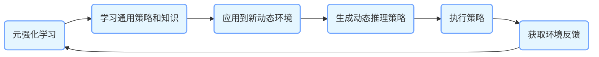

# 元强化学习在动态推理策略生成中的新方法

> 关键词：元强化学习、动态推理策略、强化学习算法、策略生成、机器学习

> 摘要：本文深入探讨了元强化学习在动态推理策略生成中的新方法。首先介绍了相关的背景知识，包括目的、预期读者、文档结构等内容。接着阐述了元强化学习和动态推理策略的核心概念及联系，详细讲解了核心算法原理并给出Python源代码示例，同时介绍了相关的数学模型和公式。通过项目实战展示了如何在实际中运用这些方法，并分析了其实际应用场景。最后推荐了相关的工具和资源，总结了未来发展趋势与挑战，还提供了常见问题解答和参考资料，旨在为读者全面呈现元强化学习在动态推理策略生成领域的最新进展和应用方法。

## 1. 背景介绍 
### 1.1 目的和范围
元强化学习在近年来成为了人工智能领域的研究热点，其在动态推理策略生成方面具有巨大的潜力。本文章的目的在于深入探讨元强化学习在动态推理策略生成中的新方法，详细介绍相关的理论知识、算法原理以及实际应用案例。范围涵盖了从基础概念的讲解到实际项目的开发，旨在为读者提供一个全面且深入的学习资源，帮助读者理解和掌握这一前沿技术。

### 1.2 预期读者
本文预期读者包括对人工智能、机器学习、强化学习等领域感兴趣的研究人员、工程师和学生。无论是想要深入学习元强化学习理论的学术研究者，还是希望将其应用到实际项目中的工程师，亦或是对该领域充满好奇的学生，都能从本文中获取有价值的信息。

### 1.3 文档结构概述
本文首先介绍背景知识，包括目的、预期读者和文档结构等内容。接着阐述核心概念与联系，展示相关的原理和架构示意图。然后详细讲解核心算法原理和具体操作步骤，给出Python源代码示例。之后介绍数学模型和公式，并进行详细讲解和举例说明。通过项目实战部分展示实际应用案例，包括开发环境搭建、源代码实现和代码解读。分析实际应用场景，推荐相关的工具和资源。最后总结未来发展趋势与挑战，提供常见问题解答和参考资料。

### 1.4 术语表
#### 1.4.1 核心术语定义
- **元强化学习（Meta-Reinforcement Learning）**：是一种强化学习的扩展，它允许智能体在多个任务上进行学习，从而快速适应新的任务。智能体不仅学习如何在特定任务中采取行动，还学习如何学习，即通过从以往的学习经验中提取通用的知识和策略，来加速在新任务中的学习过程。
- **动态推理策略（Dynamic Reasoning Strategy）**：是指在动态环境中，智能体根据实时的环境信息和自身的状态，快速做出合理决策的策略。这种策略需要能够适应环境的变化，具有灵活性和实时性。
- **强化学习（Reinforcement Learning）**：是一种机器学习范式，智能体通过与环境进行交互，根据环境反馈的奖励信号来学习最优的行为策略。智能体的目标是在长期内最大化累积奖励。

#### 1.4.2 相关概念解释
- **策略（Policy）**：在强化学习中，策略是智能体选择行动的规则。它将智能体的当前状态映射到一个行动上，决定了智能体在不同状态下应该采取的行为。
- **奖励（Reward）**：是环境给予智能体的反馈信号，用于表示智能体的行为在当前环境中的好坏程度。智能体的目标是通过选择合适的行动来最大化长期累积奖励。
- **状态（State）**：是对环境和智能体当前情况的描述。状态包含了智能体做出决策所需的所有相关信息。

#### 1.4.3 缩略词列表
- **MDP（Markov Decision Process）**：马尔可夫决策过程，是一种用于描述强化学习问题的数学模型。
- **Q - learning**：一种无模型的强化学习算法，用于学习最优的动作价值函数。
- **A2C（Advantage Actor - Critic）**：一种基于策略梯度的强化学习算法，结合了策略网络和价值网络。

## 2. 核心概念与联系 

### 元强化学习原理
元强化学习的核心思想是让智能体学会如何学习。传统的强化学习方法通常是针对单个任务进行训练，智能体需要在每个新任务上从头开始学习。而元强化学习通过在多个相关任务上进行训练，智能体可以提取出通用的学习策略和知识，从而在面对新任务时能够快速适应。

元强化学习的一个常见实现方式是基于元学习算法，如模型无关元学习（MAML）。MAML的目标是找到一个初始的策略参数，使得在经过少量的梯度更新后，智能体能够在新任务上快速收敛到较好的性能。

### 动态推理策略原理
动态推理策略强调在动态环境中智能体的决策能力。在实际应用中，环境往往是不断变化的，智能体需要实时地感知环境的变化，并根据新的信息调整自己的行为策略。动态推理策略通常需要结合实时的环境感知、状态估计和决策算法，以确保智能体能够在动态环境中做出最优的决策。

### 两者的联系
元强化学习为动态推理策略的生成提供了一种有效的方法。通过元强化学习，智能体可以学习到在不同动态环境下的通用学习策略，从而能够快速适应新的动态环境并生成有效的推理策略。同时，动态推理策略的需求也推动了元强化学习的发展，促使研究者探索更高效、更灵活的元强化学习算法。

### 文本示意图
元强化学习和动态推理策略的关系可以用以下示意图表示：

元强化学习通过在多个动态任务上进行训练，学习到通用的学习策略和知识。这些知识可以被应用到新的动态环境中，帮助智能体快速生成动态推理策略。动态推理策略的执行结果又可以反馈给元强化学习，进一步优化学习策略。

### Mermaid 流程图


## 3. 核心算法原理 & 具体操作步骤 

### 元强化学习算法原理
我们以基于模型无关元学习（MAML）的元强化学习算法为例进行讲解。MAML的核心思想是找到一个初始的策略参数 $\theta$，使得在经过少量的梯度更新后，智能体能够在新任务上快速收敛到较好的性能。

具体来说，MAML的训练过程可以分为两个阶段：内循环和外循环。

- **内循环**：在每个任务 $T_i$ 上，使用当前的策略参数 $\theta$ 进行一定步数的强化学习训练，得到更新后的参数 $\theta_i'$。
- **外循环**：在所有任务上计算更新后的参数 $\theta_i'$ 的损失函数 $L(\theta_i')$，并通过梯度下降更新初始参数 $\theta$，使得所有任务上的损失函数之和最小。

### Python 源代码实现
```python
import torch
import torch.nn as nn
import torch.optim as optim

# 定义策略网络
class PolicyNetwork(nn.Module):
    def __init__(self, input_dim, output_dim):
        super(PolicyNetwork, self).__init__()
        self.fc1 = nn.Linear(input_dim, 64)
        self.fc2 = nn.Linear(64, output_dim)

    def forward(self, x):
        x = torch.relu(self.fc1(x))
        x = self.fc2(x)
        return x

# 定义元强化学习类
class MetaReinforcementLearning:
    def __init__(self, input_dim, output_dim, lr=0.001):
        self.policy_network = PolicyNetwork(input_dim, output_dim)
        self.optimizer = optim.Adam(self.policy_network.parameters(), lr=lr)

    def inner_loop(self, task, num_steps):
        # 复制当前策略参数
        inner_policy = PolicyNetwork(*self.policy_network.state_dict().values())
        inner_optimizer = optim.Adam(inner_policy.parameters(), lr=0.01)

        for _ in range(num_steps):
            # 与环境交互，获取状态、动作和奖励
            state, action, reward = task.interact(inner_policy)
            # 计算损失
            loss = -torch.mean(reward)
            # 更新参数
            inner_optimizer.zero_grad()
            loss.backward()
            inner_optimizer.step()

        return inner_policy.state_dict()

    def outer_loop(self, tasks, num_steps):
        meta_loss = 0
        for task in tasks:
            # 内循环
            inner_params = self.inner_loop(task, num_steps)
            # 复制内循环后的参数
            outer_policy = PolicyNetwork(*inner_params.values())
            # 与环境交互，获取状态、动作和奖励
            state, action, reward = task.interact(outer_policy)
            # 计算损失
            loss = -torch.mean(reward)
            meta_loss += loss

        # 更新初始参数
        self.optimizer.zero_grad()
        meta_loss.backward()
        self.optimizer.step()
```

### 具体操作步骤
1. **初始化**：初始化策略网络的参数 $\theta$ 和优化器。
2. **内循环**：对于每个任务 $T_i$，使用当前的策略参数 $\theta$ 进行一定步数的强化学习训练，得到更新后的参数 $\theta_i'$。
3. **外循环**：在所有任务上计算更新后的参数 $\theta_i'$ 的损失函数 $L(\theta_i')$，并通过梯度下降更新初始参数 $\theta$，使得所有任务上的损失函数之和最小。
4. **重复步骤2和3**：直到策略网络收敛。

## 4. 数学模型和公式 & 详细讲解 & 举例说明 

### 马尔可夫决策过程（MDP）
马尔可夫决策过程是一种用于描述强化学习问题的数学模型，它由一个四元组 $(S, A, P, R)$ 组成，其中：
- $S$ 是状态空间，表示环境的所有可能状态。
- $A$ 是动作空间，表示智能体可以采取的所有可能动作。
- $P(s'|s, a)$ 是状态转移概率，表示在状态 $s$ 下采取动作 $a$ 后转移到状态 $s'$ 的概率。
- $R(s, a)$ 是奖励函数，表示在状态 $s$ 下采取动作 $a$ 后获得的奖励。

### 策略梯度定理
策略梯度定理是强化学习中的一个重要定理，它提供了一种直接优化策略参数的方法。策略梯度定理的公式为：
$$\nabla_{\theta} J(\theta) = \mathbb{E}_{\tau \sim \pi_{\theta}(\tau)} \left[ \sum_{t=0}^{T} \nabla_{\theta} \log \pi_{\theta}(a_t|s_t) Q^{\pi_{\theta}}(s_t, a_t) \right]$$
其中：
- $\theta$ 是策略网络的参数。
- $J(\theta)$ 是策略的性能指标，通常是长期累积奖励的期望。
- $\pi_{\theta}(a_t|s_t)$ 是策略网络在状态 $s_t$ 下选择动作 $a_t$ 的概率。
- $Q^{\pi_{\theta}}(s_t, a_t)$ 是动作价值函数，表示在状态 $s_t$ 下采取动作 $a_t$ 并遵循策略 $\pi_{\theta}$ 时的长期累积奖励的期望。

### 详细讲解
策略梯度定理的核心思想是通过计算策略参数的梯度，使得策略的性能指标 $J(\theta)$ 最大化。具体来说，策略梯度 $\nabla_{\theta} J(\theta)$ 表示在当前策略 $\pi_{\theta}$ 下，参数 $\theta$ 的微小变化对性能指标 $J(\theta)$ 的影响。通过沿着梯度的方向更新参数 $\theta$，可以逐步提高策略的性能。

### 举例说明
假设我们有一个简单的强化学习问题，智能体在一个二维网格世界中移动，目标是到达一个特定的位置。状态空间 $S$ 是网格世界中所有可能的位置，动作空间 $A$ 是上下左右四个方向的移动。奖励函数 $R(s, a)$ 在智能体到达目标位置时为正，否则为负。

我们可以使用策略梯度定理来优化智能体的策略。首先，我们定义一个策略网络 $\pi_{\theta}(a|s)$，它将状态 $s$ 映射到动作 $a$ 的概率分布。然后，我们通过与环境进行交互，收集状态、动作和奖励数据。根据策略梯度定理，计算策略参数 $\theta$ 的梯度，并使用梯度下降算法更新参数 $\theta$。通过不断地迭代这个过程，智能体的策略会逐渐优化，最终能够快速到达目标位置。

## 5. 项目实战：代码实际案例和详细解释说明 

### 5.1  开发环境搭建
#### 安装 Python
首先，确保你已经安装了 Python 3.x 版本。可以从 Python 官方网站（https://www.python.org/downloads/） 下载并安装适合你操作系统的 Python 版本。

#### 安装必要的库
我们需要安装一些必要的 Python 库，包括 `torch`、`numpy` 等。可以使用以下命令进行安装：
```sh
pip install torch numpy
```

### 5.2  源代码详细实现和代码解读
```python
import torch
import torch.nn as nn
import torch.optim as optim
import numpy as np

# 定义简单的任务环境
class SimpleTask:
    def __init__(self):
        self.state = np.random.rand(4)
        self.target = np.array([1, 1, 1, 1])

    def interact(self, policy_network):
        state_tensor = torch.FloatTensor(self.state)
        action = policy_network(state_tensor).detach().numpy()
        reward = -np.linalg.norm(self.state - self.target)
        self.state += action * 0.1
        return state_tensor, action, reward

# 定义策略网络
class PolicyNetwork(nn.Module):
    def __init__(self, input_dim, output_dim):
        super(PolicyNetwork, self).__init__()
        self.fc1 = nn.Linear(input_dim, 64)
        self.fc2 = nn.Linear(64, output_dim)

    def forward(self, x):
        x = torch.relu(self.fc1(x))
        x = self.fc2(x)
        return x

# 定义元强化学习类
class MetaReinforcementLearning:
    def __init__(self, input_dim, output_dim, lr=0.001):
        self.policy_network = PolicyNetwork(input_dim, output_dim)
        self.optimizer = optim.Adam(self.policy_network.parameters(), lr=lr)

    def inner_loop(self, task, num_steps):
        # 复制当前策略参数
        inner_policy = PolicyNetwork(*self.policy_network.state_dict().values())
        inner_optimizer = optim.Adam(inner_policy.parameters(), lr=0.01)

        for _ in range(num_steps):
            # 与环境交互，获取状态、动作和奖励
            state, action, reward = task.interact(inner_policy)
            # 计算损失
            loss = -torch.FloatTensor([reward])
            # 更新参数
            inner_optimizer.zero_grad()
            loss.backward()
            inner_optimizer.step()

        return inner_policy.state_dict()

    def outer_loop(self, tasks, num_steps):
        meta_loss = 0
        for task in tasks:
            # 内循环
            inner_params = self.inner_loop(task, num_steps)
            # 复制内循环后的参数
            outer_policy = PolicyNetwork(*inner_params.values())
            # 与环境交互，获取状态、动作和奖励
            state, action, reward = task.interact(outer_policy)
            # 计算损失
            loss = -torch.FloatTensor([reward])
            meta_loss += loss

        # 更新初始参数
        self.optimizer.zero_grad()
        meta_loss.backward()
        self.optimizer.step()

# 主函数
if __name__ == "__main__":
    input_dim = 4
    output_dim = 4
    num_tasks = 10
    num_steps = 5

    # 创建任务列表
    tasks = [SimpleTask() for _ in range(num_tasks)]

    # 创建元强化学习对象
    mrl = MetaReinforcementLearning(input_dim, output_dim)

    # 训练
    for epoch in range(100):
        mrl.outer_loop(tasks, num_steps)
        if epoch % 10 == 0:
            total_reward = 0
            for task in tasks:
                state, action, reward = task.interact(mrl.policy_network)
                total_reward += reward
            print(f"Epoch {epoch}: Total Reward = {total_reward}")
```

### 5.3  代码解读与分析
#### 任务环境类 `SimpleTask`
- `__init__` 方法：初始化任务环境的状态和目标状态。
- `interact` 方法：与策略网络进行交互，根据当前状态选择动作，计算奖励，并更新状态。

#### 策略网络类 `PolicyNetwork`
- `__init__` 方法：定义策略网络的结构，包括一个全连接层和一个输出层。
- `forward` 方法：定义前向传播过程，将输入状态映射到动作。

#### 元强化学习类 `MetaReinforcementLearning`
- `__init__` 方法：初始化策略网络和优化器。
- `inner_loop` 方法：在每个任务上进行内循环训练，更新策略参数。
- `outer_loop` 方法：在所有任务上进行外循环训练，更新初始策略参数。

#### 主函数
- 创建任务列表和元强化学习对象。
- 进行训练，并在每个 epoch 打印总奖励。

通过这个项目实战，我们可以看到如何使用元强化学习算法在多个任务上进行训练，从而让智能体快速适应新的任务。

## 6. 实际应用场景 

### 机器人控制
在机器人控制领域，环境通常是动态变化的。例如，机器人在不同的地形上移动，或者执行不同的任务。元强化学习可以帮助机器人快速适应新的环境和任务，生成有效的动态推理策略。机器人可以通过在多个类似任务上进行训练，学习到通用的控制策略，从而在面对新的任务时能够快速做出合理的决策。

### 自动驾驶
自动驾驶汽车需要在复杂多变的交通环境中行驶。元强化学习可以用于生成自动驾驶汽车的动态推理策略，使其能够快速适应不同的交通场景，如拥堵、道路施工等。通过在多个交通场景上进行训练，自动驾驶汽车可以学习到通用的驾驶策略，提高安全性和效率。

### 游戏 AI
在游戏领域，游戏环境通常是动态变化的，对手的策略也可能不同。元强化学习可以用于生成游戏 AI 的动态推理策略，使其能够快速适应不同的游戏场景和对手策略。游戏 AI 可以通过在多个游戏场景上进行训练，学习到通用的游戏策略，提高游戏水平。

## 7. 工具和资源推荐
### 7.1 学习资源推荐
#### 7.1.1 书籍推荐
- 《Reinforcement Learning: An Introduction》：由 Richard S. Sutton 和 Andrew G. Barto 所著，是强化学习领域的经典教材，全面介绍了强化学习的基本概念、算法和应用。
- 《Deep Reinforcement Learning Hands-On》：由 Maxim Lapan 所著，通过实践项目介绍了深度强化学习的原理和应用，适合有一定编程基础的读者。

#### 7.1.2 在线课程
- Coursera 上的《Reinforcement Learning Specialization》：由 University of Alberta 提供，包括多门课程，系统地介绍了强化学习的理论和实践。
- Udemy 上的《Complete Reinforcement Learning Course with Python》：通过实际项目介绍了强化学习的应用，适合初学者。

#### 7.1.3 技术博客和网站
- OpenAI Blog（https://openai.com/blog/）：OpenAI 发布的最新研究成果和技术文章，涵盖了人工智能的多个领域，包括强化学习。
- Towards Data Science（https://towardsdatascience.com/）：一个数据科学和人工智能领域的技术博客，有很多关于强化学习的文章和教程。

### 7.2 开发工具框架推荐
#### 7.2.1 IDE和编辑器
- PyCharm：一个功能强大的 Python 集成开发环境，提供了代码编辑、调试、版本控制等功能，适合开发强化学习项目。
- Jupyter Notebook：一个交互式的开发环境，适合进行数据分析和实验，方便展示代码和结果。

#### 7.2.2 调试和性能分析工具
- TensorBoard：一个用于可视化深度学习模型训练过程的工具，可以帮助用户分析模型的性能和训练过程。
- cProfile：Python 内置的性能分析工具，可以帮助用户找出代码中的性能瓶颈。

#### 7.2.3 相关框架和库
- PyTorch：一个开源的深度学习框架，提供了丰富的神经网络层和优化算法，适合开发强化学习算法。
- Gym：OpenAI 开发的一个用于开发和比较强化学习算法的工具包，提供了多种环境和任务。

### 7.3 相关论文著作推荐
#### 7.3.1 经典论文
- "Model-Agnostic Meta-Learning for Fast Adaptation of Deep Networks"：介绍了模型无关元学习（MAML）算法，是元学习领域的经典论文。
- "Asynchronous Methods for Deep Reinforcement Learning"：提出了异步优势演员 - 评论家（A3C）算法，是深度强化学习领域的重要论文。

#### 7.3.2 最新研究成果
- 关注 arXiv（https://arxiv.org/） 上的最新论文，搜索关键词如 "meta-reinforcement learning"、"dynamic reasoning strategy" 等，可以获取该领域的最新研究成果。

#### 7.3.3 应用案例分析
- 可以在 IEEE Xplore（https://ieeexplore.ieee.org/）、ACM Digital Library（https://dl.acm.org/） 等学术数据库中搜索关于元强化学习在实际应用中的案例分析，了解其在不同领域的应用效果和方法。

## 8. 总结：未来发展趋势与挑战
### 未来发展趋势
- **多智能体元强化学习**：随着多智能体系统的应用越来越广泛，多智能体元强化学习将成为一个重要的研究方向。通过元强化学习，多个智能体可以学习到协作和竞争的策略，提高整个系统的性能。
- **结合其他技术**：元强化学习可以与其他技术，如深度学习、迁移学习、进化算法等相结合，进一步提高智能体的学习能力和适应性。
- **实际应用拓展**：元强化学习将在更多的实际应用场景中得到应用，如医疗、金融、物流等领域，为这些领域带来更高效、更智能的解决方案。

### 挑战
- **计算资源需求**：元强化学习通常需要大量的计算资源和时间，尤其是在处理复杂的任务和大规模的数据集时。如何降低计算资源需求，提高算法的效率是一个挑战。
- **数据效率**：元强化学习需要在多个任务上进行训练，数据效率是一个重要的问题。如何在有限的数据下学习到有效的通用策略是一个需要解决的问题。
- **可解释性**：元强化学习算法通常是基于深度学习的，其决策过程往往难以解释。如何提高元强化学习算法的可解释性，使其在实际应用中更加可靠和可信是一个挑战。

## 9. 附录：常见问题与解答
### 元强化学习和传统强化学习有什么区别？
传统强化学习通常是针对单个任务进行训练，智能体需要在每个新任务上从头开始学习。而元强化学习允许智能体在多个任务上进行学习，从而快速适应新的任务。元强化学习不仅学习如何在特定任务中采取行动，还学习如何学习，通过从以往的学习经验中提取通用的知识和策略，来加速在新任务中的学习过程。

### 元强化学习算法的复杂度如何？
元强化学习算法的复杂度通常较高，尤其是在处理复杂的任务和大规模的数据集时。这是因为元强化学习需要在多个任务上进行训练，并且需要进行内循环和外循环的优化。为了降低复杂度，可以采用一些优化方法，如使用高效的算法、并行计算等。

### 如何选择合适的元强化学习算法？
选择合适的元强化学习算法需要考虑多个因素，如任务的复杂度、数据的规模、计算资源等。不同的元强化学习算法有不同的特点和适用场景。例如，MAML 算法适用于需要快速适应新任务的场景，而基于模型的元强化学习算法适用于对环境模型有一定了解的场景。在选择算法时，可以参考相关的文献和实验结果，根据实际情况进行选择。

## 10. 扩展阅读 & 参考资料
- Sutton, R. S., & Barto, A. G. (2018). Reinforcement Learning: An Introduction. MIT press.
- Lapan, M. (2018). Deep Reinforcement Learning Hands-On. Packt Publishing.
- Finn, C., Abbeel, P., & Levine, S. (2017). Model-Agnostic Meta-Learning for Fast Adaptation of Deep Networks. arXiv preprint arXiv:1703.03400.
- Mnih, V., Badia, A. P., Mirza, M., Graves, A., Lillicrap, T., Harley, T., ... & Kavukcuoglu, K. (2016). Asynchronous Methods for Deep Reinforcement Learning. In International conference on machine learning (pp. 1928-1937).
- OpenAI Gym Documentation (https://gym.openai.com/docs/)
- PyTorch Documentation (https://pytorch.org/docs/stable/index.html)