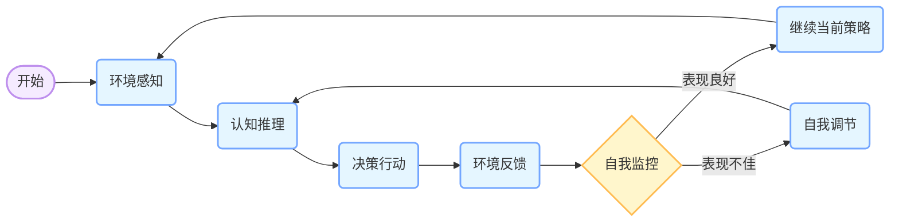

# 元认知AI Agent：自我监控与调节

> 关键词：元认知、AI Agent、自我监控、自我调节、智能系统、认知模型、适应性学习

> 摘要：本文围绕元认知AI Agent的自我监控与调节展开深入探讨。首先介绍了相关背景，包括研究目的、预期读者、文档结构和术语定义等。接着阐述了元认知AI Agent的核心概念与联系，通过文本示意图和Mermaid流程图清晰呈现其原理和架构。详细讲解了核心算法原理，结合Python源代码进行说明，并给出了数学模型和公式。在项目实战部分，通过具体案例展示了开发环境搭建、源代码实现及代码解读。还探讨了元认知AI Agent的实际应用场景，推荐了相关学习资源、开发工具框架和论文著作。最后总结了未来发展趋势与挑战，提供了常见问题解答和扩展阅读参考资料，旨在全面深入地剖析元认知AI Agent的自我监控与调节机制，推动该领域的研究与应用。

## 1. 背景介绍 
### 1.1 目的和范围
元认知AI Agent的研究旨在使人工智能系统能够像人类一样对自身的认知过程进行监控和调节，从而提高系统的智能水平和适应性。本文章的范围涵盖了元认知AI Agent的基本概念、核心算法、数学模型、实际应用以及未来发展趋势等方面，旨在为读者全面深入地介绍元认知AI Agent的自我监控与调节机制。

### 1.2 预期读者
本文预期读者包括人工智能领域的研究人员、开发者、学生以及对智能系统和认知科学感兴趣的专业人士。希望通过本文的介绍，能够帮助读者了解元认知AI Agent的相关知识，为进一步的研究和实践提供参考。

### 1.3 文档结构概述
本文首先介绍元认知AI Agent的背景信息，包括研究目的、预期读者和文档结构等。接着详细阐述核心概念与联系，通过文本示意图和流程图展示其原理和架构。然后讲解核心算法原理，结合Python代码进行说明，并给出数学模型和公式。在项目实战部分，通过具体案例展示开发环境搭建、源代码实现及代码解读。随后探讨实际应用场景，推荐相关学习资源、开发工具框架和论文著作。最后总结未来发展趋势与挑战，提供常见问题解答和扩展阅读参考资料。

### 1.4 术语表
#### 1.4.1 核心术语定义
- **元认知（Metacognition）**：指对认知的认知，即个体对自己的认知过程和结果的意识与控制。在AI Agent中，元认知表示Agent对自身的推理、决策、学习等认知过程的监控和调节能力。
- **AI Agent（人工智能智能体）**：是一个能够感知环境、进行决策并采取行动以实现特定目标的智能实体。
- **自我监控（Self - monitoring）**：AI Agent对自身内部状态、认知过程和行为表现进行实时监测和评估的过程。
- **自我调节（Self - regulation）**：基于自我监控的结果，AI Agent对自身的认知过程、行为策略等进行调整和优化的过程。

#### 1.4.2 相关概念解释
- **认知模型（Cognitive Model）**：用于描述AI Agent的认知过程和机制的模型，是实现元认知的基础。
- **适应性学习（Adaptive Learning）**：AI Agent根据环境变化和自身表现，动态调整学习策略和行为的学习方式，与元认知的自我调节密切相关。

#### 1.4.3 缩略词列表
- **AI**：Artificial Intelligence（人工智能）
- **ML**：Machine Learning（机器学习）
- **RL**：Reinforcement Learning（强化学习）

## 2. 核心概念与联系 
元认知AI Agent的核心在于其能够对自身的认知过程进行自我监控和调节。其基本原理是通过构建认知模型来描述自身的推理、决策和学习过程，然后利用自我监控机制对这些过程进行实时监测和评估，根据评估结果，使用自我调节机制对认知过程进行调整和优化。

### 文本示意图
元认知AI Agent主要由认知模块、元认知模块和环境交互模块组成。认知模块负责感知环境、进行推理和决策等基本认知活动；元认知模块对认知模块的过程和结果进行监控和调节；环境交互模块实现Agent与外部环境的信息交换。

```plaintext
+---------------------+
|    环境交互模块     |
+---------------------+
        |       ^
        v       |
+---------------------+
|      认知模块       |
+---------------------+
        |       ^
        v       |
+---------------------+
|     元认知模块      |
+---------------------+
```

### Mermaid流程图


该流程图展示了元认知AI Agent的工作流程。首先，Agent感知环境信息，然后进行认知推理和决策行动，接收环境反馈后进行自我监控。如果表现良好，则继续当前策略；如果表现不佳，则进行自我调节，然后重新进行认知推理。

## 3. 核心算法原理 & 具体操作步骤 
### 核心算法原理
元认知AI Agent的核心算法主要包括自我监控算法和自我调节算法。自我监控算法用于实时监测Agent的认知过程和行为表现，通常基于统计分析、模型评估等方法；自我调节算法根据自我监控的结果，对Agent的认知策略、学习参数等进行调整，常见的方法包括参数优化、策略更新等。

### Python源代码阐述
以下是一个简单的元认知AI Agent示例，用于说明自我监控和自我调节的基本原理。假设我们有一个简单的决策Agent，根据输入的环境信息进行决策，并根据决策结果进行自我评估和调节。

```python
import random

# 定义认知模块
class CognitiveModule:
    def __init__(self):
        # 初始化决策策略
        self.decision_strategy = random.randint(0, 1)

    def make_decision(self, environment_info):
        if self.decision_strategy == 0:
            return environment_info * 2
        else:
            return environment_info * 3

# 定义元认知模块
class MetacognitiveModule:
    def __init__(self):
        # 初始化评估阈值
        self.evaluation_threshold = 50
        # 初始化调节步长
        self.adjustment_step = 1

    def self_monitoring(self, decision_result):
        # 自我监控：评估决策结果
        if decision_result > self.evaluation_threshold:
            return True
        else:
            return False

    def self_regulation(self, cognitive_module):
        # 自我调节：调整决策策略
        if cognitive_module.decision_strategy == 0:
            cognitive_module.decision_strategy = 1
        else:
            cognitive_module.decision_strategy = 0

# 定义环境交互模块
class EnvironmentInteractionModule:
    def __init__(self):
        pass

    def get_environment_info(self):
        # 模拟获取环境信息
        return random.randint(10, 30)

    def get_feedback(self, decision_result):
        # 模拟获取环境反馈
        return decision_result

# 主程序
if __name__ == "__main__":
    cognitive_module = CognitiveModule()
    metacognitive_module = MetacognitiveModule()
    environment_interaction_module = EnvironmentInteractionModule()

    for i in range(10):
        # 获取环境信息
        environment_info = environment_interaction_module.get_environment_info()
        # 进行决策
        decision_result = cognitive_module.make_decision(environment_info)
        # 获取环境反馈
        feedback = environment_interaction_module.get_feedback(decision_result)
        # 自我监控
        is_good = metacognitive_module.self_monitoring(feedback)
        if not is_good:
            # 自我调节
            metacognitive_module.self_regulation(cognitive_module)
        print(f"Step {i}: Environment Info = {environment_info}, Decision Result = {decision_result}, Is Good = {is_good}")
```

### 具体操作步骤
1. **初始化模块**：创建认知模块、元认知模块和环境交互模块的实例。
2. **环境感知**：通过环境交互模块获取环境信息。
3. **认知推理和决策**：认知模块根据环境信息进行决策。
4. **环境反馈**：环境交互模块根据决策结果返回环境反馈。
5. **自我监控**：元认知模块对决策结果进行评估。
6. **自我调节**：如果评估结果不佳，元认知模块对认知模块的决策策略进行调整。
7. **重复步骤2 - 6**：循环执行上述步骤，直到达到指定的步数。

## 4. 数学模型和公式 & 详细讲解 & 举例说明 
### 数学模型
元认知AI Agent的数学模型可以用一个马尔可夫决策过程（MDP）来描述。马尔可夫决策过程由一个五元组 $<S, A, P, R, \gamma>$ 组成，其中：
- $S$ 是状态空间，表示Agent的内部状态和环境状态的集合。
- $A$ 是动作空间，表示Agent可以采取的动作集合。
- $P(s'|s, a)$ 是状态转移概率，表示在状态 $s$ 下采取动作 $a$ 后转移到状态 $s'$ 的概率。
- $R(s, a)$ 是奖励函数，表示在状态 $s$ 下采取动作 $a$ 所获得的奖励。
- $\gamma$ 是折扣因子，用于权衡当前奖励和未来奖励的重要性。

### 自我监控公式
自我监控可以通过计算Agent的性能指标来实现，例如平均奖励、成功率等。假设我们用平均奖励作为性能指标，其计算公式为：

$$\bar{R} = \frac{1}{T} \sum_{t = 1}^{T} R(s_t, a_t)$$

其中，$T$ 是时间步数，$R(s_t, a_t)$ 是在时间步 $t$ 时的奖励。

### 自我调节公式
自我调节可以通过更新Agent的策略来实现。在强化学习中，常用的策略更新方法是基于价值函数的更新。例如，使用Q - learning算法更新Q值：

$$Q(s, a) \leftarrow Q(s, a) + \alpha [R(s, a) + \gamma \max_{a'} Q(s', a') - Q(s, a)]$$

其中，$\alpha$ 是学习率，$Q(s, a)$ 是状态 $s$ 下采取动作 $a$ 的Q值，$s'$ 是转移后的状态。

### 举例说明
假设一个简单的迷宫问题，Agent的目标是从起点走到终点。状态空间 $S$ 表示迷宫中各个位置的集合，动作空间 $A$ 表示Agent可以采取的四个方向的移动动作（上、下、左、右）。奖励函数 $R(s, a)$ 定义为：如果Agent到达终点，获得奖励100；如果撞到墙壁，获得奖励 - 10；其他情况获得奖励 - 1。

在每一步，Agent根据当前状态 $s$ 选择一个动作 $a$，然后根据状态转移概率 $P(s'|s, a)$ 转移到下一个状态 $s'$，并获得奖励 $R(s, a)$。通过不断地进行自我监控（计算平均奖励 $\bar{R}$）和自我调节（更新Q值），Agent逐渐学习到最优的策略。

## 5. 项目实战：代码实际案例和详细解释说明 
### 5.1  开发环境搭建
本项目使用Python进行开发，需要安装以下库：
- `numpy`：用于数值计算。
- `matplotlib`：用于可视化。

可以使用以下命令进行安装：
```sh
pip install numpy matplotlib
```

### 5.2  源代码详细实现和代码解读
以下是一个基于强化学习的元认知AI Agent的完整代码示例，用于解决一个简单的网格世界问题。

```python
import numpy as np
import matplotlib.pyplot as plt

# 定义网格世界环境
class GridWorld:
    def __init__(self, grid_size):
        self.grid_size = grid_size
        self.start_state = (0, 0)
        self.goal_state = (grid_size - 1, grid_size - 1)
        self.current_state = self.start_state

    def reset(self):
        self.current_state = self.start_state
        return self.current_state

    def step(self, action):
        x, y = self.current_state
        if action == 0:  # 上
            x = max(x - 1, 0)
        elif action == 1:  # 下
            x = min(x + 1, self.grid_size - 1)
        elif action == 2:  # 左
            y = max(y - 1, 0)
        elif action == 3:  # 右
            y = min(y + 1, self.grid_size - 1)

        self.current_state = (x, y)
        if self.current_state == self.goal_state:
            reward = 100
            done = True
        else:
            reward = -1
            done = False

        return self.current_state, reward, done

# 定义认知模块（Q - learning Agent）
class CognitiveModule:
    def __init__(self, grid_size, num_actions, learning_rate=0.1, discount_factor=0.9):
        self.grid_size = grid_size
        self.num_actions = num_actions
        self.learning_rate = learning_rate
        self.discount_factor = discount_factor
        self.q_table = np.zeros((grid_size * grid_size, num_actions))

    def get_state_index(self, state):
        x, y = state
        return x * self.grid_size + y

    def choose_action(self, state, epsilon=0.1):
        state_index = self.get_state_index(state)
        if np.random.uniform(0, 1) < epsilon:
            action = np.random.choice(self.num_actions)
        else:
            action = np.argmax(self.q_table[state_index])
        return action

    def update_q_table(self, state, action, reward, next_state):
        state_index = self.get_state_index(state)
        next_state_index = self.get_state_index(next_state)
        max_q_next = np.max(self.q_table[next_state_index])
        self.q_table[state_index, action] += self.learning_rate * (
                reward + self.discount_factor * max_q_next - self.q_table[state_index, action])

# 定义元认知模块
class MetacognitiveModule:
    def __init__(self, evaluation_threshold=50, adjustment_step=0.01):
        self.evaluation_threshold = evaluation_threshold
        self.adjustment_step = adjustment_step
        self.episode_rewards = []

    def self_monitoring(self, episode_reward):
        self.episode_rewards.append(episode_reward)
        if len(self.episode_rewards) > 10:
            average_reward = np.mean(self.episode_rewards[-10:])
            if average_reward < self.evaluation_threshold:
                return False
        return True

    def self_regulation(self, cognitive_module):
        cognitive_module.learning_rate += self.adjustment_step

# 主程序
if __name__ == "__main__":
    grid_size = 5
    num_actions = 4
    num_episodes = 500

    environment = GridWorld(grid_size)
    cognitive_module = CognitiveModule(grid_size, num_actions)
    metacognitive_module = MetacognitiveModule()

    episode_rewards = []

    for episode in range(num_episodes):
        state = environment.reset()
        episode_reward = 0
        done = False

        while not done:
            action = cognitive_module.choose_action(state)
            next_state, reward, done = environment.step(action)
            cognitive_module.update_q_table(state, action, reward, next_state)
            state = next_state
            episode_reward += reward

        # 自我监控
        is_good = metacognitive_module.self_monitoring(episode_reward)
        if not is_good:
            # 自我调节
            metacognitive_module.self_regulation(cognitive_module)

        episode_rewards.append(episode_reward)
        print(f"Episode {episode}: Reward = {episode_reward}, Is Good = {is_good}")

    # 可视化训练过程
    plt.plot(episode_rewards)
    plt.xlabel('Episode')
    plt.ylabel('Reward')
    plt.title('Training Process')
    plt.show()
```

### 5.3  代码解读与分析
- **GridWorld类**：定义了网格世界环境，包括起点、终点、状态转移和奖励机制。
- **CognitiveModule类**：实现了Q - learning算法，用于学习最优策略。包括状态索引转换、动作选择和Q值更新等方法。
- **MetacognitiveModule类**：实现了自我监控和自我调节功能。自我监控通过计算最近10个回合的平均奖励来评估Agent的性能；自我调节通过增加学习率来调整Agent的学习策略。
- **主程序**：在每个回合中，Agent与环境进行交互，更新Q值，进行自我监控和调节。最后，使用`matplotlib`库可视化训练过程。

通过这个项目实战，我们可以看到元认知AI Agent如何通过自我监控和自我调节来提高自身的性能。

## 6. 实际应用场景 
### 智能机器人
在智能机器人领域，元认知AI Agent可以使机器人对自身的运动状态、传感器数据和任务执行情况进行自我监控。例如，当机器人在执行导航任务时，如果发现自己的定位误差较大或者运动效率低下，通过自我调节可以调整导航策略、优化运动规划，提高任务执行的准确性和效率。

### 自动驾驶
自动驾驶汽车可以利用元认知AI Agent进行自我监控，实时监测车辆的行驶状态、传感器的工作情况以及周围环境的变化。当检测到传感器故障或者遇到复杂路况时，自我调节机制可以使汽车调整行驶速度、更换行驶路线或者采取紧急制动等措施，确保行车安全。

### 智能医疗系统
在智能医疗系统中，元认知AI Agent可以对医疗诊断模型的准确性和可靠性进行自我监控。当模型的诊断结果与临床实际情况存在较大偏差时，通过自我调节可以调整模型的参数、更新训练数据，提高诊断的准确性和可靠性，为医生提供更准确的诊断建议。

### 教育领域
在智能教育系统中，元认知AI Agent可以对学生的学习过程和学习效果进行自我监控。根据学生的学习进度、答题准确率等信息，判断学生的学习状态。如果发现学生在某个知识点上存在困难，自我调节机制可以调整教学策略，提供更有针对性的学习资源和辅导，提高学生的学习效果。

## 7. 工具和资源推荐
### 7.1 学习资源推荐
#### 7.1.1 书籍推荐
- 《人工智能：一种现代的方法》（Artificial Intelligence: A Modern Approach）：这是人工智能领域的经典教材，全面介绍了人工智能的基本概念、算法和应用，对元认知AI Agent的相关理论和技术也有一定的涉及。
- 《强化学习：原理与Python实现》：详细介绍了强化学习的基本原理和算法，对于理解元认知AI Agent中的自我调节机制有很大的帮助。

#### 7.1.2 在线课程
- Coursera上的“人工智能基础”课程：由知名高校的教授授课，系统地介绍了人工智能的基础知识和前沿技术，包括元认知AI Agent的相关内容。
- edX上的“强化学习”课程：深入讲解了强化学习的理论和实践，通过大量的案例和实验，帮助学习者掌握强化学习的核心算法和应用。

#### 7.1.3 技术博客和网站
- Medium：上面有很多关于人工智能和机器学习的技术博客，其中不乏关于元认知AI Agent的研究和实践分享。
- arXiv：提供了大量的学术论文，包括元认知AI Agent领域的最新研究成果。

### 7.2 开发工具框架推荐
#### 7.2.1 IDE和编辑器
- PyCharm：一款专门为Python开发设计的集成开发环境，具有强大的代码编辑、调试和自动补全功能，非常适合开发元认知AI Agent相关的Python代码。
- Visual Studio Code：一款轻量级的代码编辑器，支持多种编程语言和插件扩展，可以方便地进行人工智能项目的开发。

#### 7.2.2 调试和性能分析工具
- PDB：Python自带的调试器，可以帮助开发者在代码中设置断点、单步执行和查看变量值，方便调试元认知AI Agent的代码。
- cProfile：Python的性能分析工具，可以帮助开发者找出代码中的性能瓶颈，优化代码性能。

#### 7.2.3 相关框架和库
- TensorFlow：一个开源的机器学习框架，提供了丰富的工具和函数，可用于构建和训练元认知AI Agent的模型。
- PyTorch：另一个流行的深度学习框架，具有简洁的API和高效的计算性能，适合开发元认知AI Agent的相关算法。

### 7.3 相关论文著作推荐
#### 7.3.1 经典论文
- "A Theory of Metacognitive Learning"：该论文提出了元认知学习的理论框架，为元认知AI Agent的研究提供了理论基础。
- "Self - Monitoring and Self - Regulation in Artificial Intelligence"：详细探讨了人工智能中的自我监控和自我调节机制，对元认知AI Agent的发展具有重要的指导意义。

#### 7.3.2 最新研究成果
- 关注顶级人工智能学术会议（如NeurIPS、ICML、AAAI等）上的相关论文，这些论文反映了元认知AI Agent领域的最新研究进展和技术趋势。

#### 7.3.3 应用案例分析
- 一些实际应用领域的研究论文，如智能机器人、自动驾驶等，会介绍元认知AI Agent在这些领域的具体应用案例和效果评估，对于理解元认知AI Agent的实际应用有很大的帮助。

## 8. 总结：未来发展趋势与挑战
### 未来发展趋势
- **与认知科学的深度融合**：未来元认知AI Agent将与认知科学进行更深入的融合，借鉴人类认知过程中的元认知机制，进一步提高AI Agent的智能水平和适应性。例如，研究人类的注意力机制、记忆机制等，将其应用到元认知AI Agent中，使其能够更好地处理复杂的信息和任务。
- **多Agent协作**：元认知AI Agent将不再是孤立的个体，而是多个Agent之间进行协作和交互。通过相互监控和调节，实现更高效的团队协作和任务执行。例如，在智能交通系统中，多个自动驾驶汽车可以通过元认知机制进行信息共享和协作，优化交通流量。
- **跨领域应用拓展**：元认知AI Agent的应用领域将不断拓展，除了现有的智能机器人、自动驾驶、智能医疗等领域，还将应用到金融、教育、工业制造等更多领域，为各行业的智能化发展提供支持。

### 挑战
- **理论模型的完善**：目前元认知AI Agent的理论模型还不够完善，需要进一步深入研究人类元认知的本质和机制，构建更加准确和有效的数学模型和算法。
- **计算资源的需求**：元认知AI Agent的自我监控和调节过程需要大量的计算资源，尤其是在处理复杂任务和大规模数据时。如何降低计算成本，提高计算效率是一个亟待解决的问题。
- **伦理和安全问题**：随着元认知AI Agent的广泛应用，伦理和安全问题也日益凸显。例如，AI Agent的自我调节可能会导致不可预测的行为，如何确保其行为符合人类的价值观和安全要求是一个重要的挑战。

## 9. 附录：常见问题与解答
### 问题1：元认知AI Agent与普通AI Agent有什么区别？
普通AI Agent主要关注如何完成特定的任务，而元认知AI Agent不仅能够完成任务，还能够对自身的认知过程进行自我监控和调节。元认知AI Agent具有更高的智能水平和适应性，能够根据环境变化和自身表现动态调整策略。

### 问题2：实现元认知AI Agent需要哪些技术？
实现元认知AI Agent需要多种技术，包括机器学习、强化学习、认知建模、数据分析等。其中，机器学习和强化学习用于构建Agent的认知模型和学习策略，认知建模用于描述Agent的认知过程，数据分析用于自我监控和评估。

### 问题3：元认知AI Agent在实际应用中面临哪些困难？
元认知AI Agent在实际应用中面临的困难包括理论模型不完善、计算资源需求大、伦理和安全问题等。此外，还需要解决如何将元认知机制与具体应用场景相结合，以及如何评估元认知AI Agent的性能等问题。

## 10. 扩展阅读 & 参考资料
### 扩展阅读
- 关于人类元认知的相关研究，如认知心理学的经典著作，有助于深入理解元认知的本质和机制，为元认知AI Agent的研究提供理论支持。
- 人工智能领域的前沿研究，如量子计算、脑机接口等，可能会为元认知AI Agent的发展带来新的机遇和挑战。

### 参考资料
- 相关学术论文和研究报告，如前面推荐的经典论文和最新研究成果。
- 开源项目和代码库，如GitHub上的元认知AI Agent相关项目，可以参考其实现代码和思路。