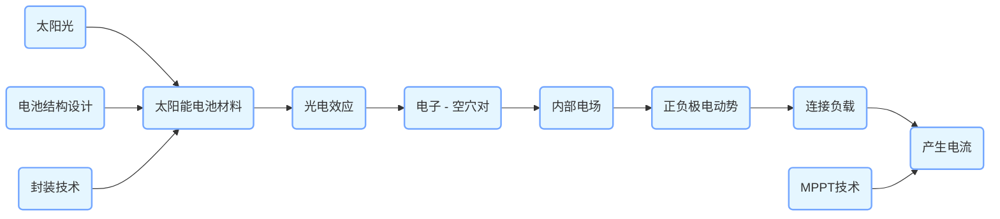

# 光伏发电效率提升带来的新一轮投资机会

> 关键词：光伏发电效率、投资机会、光伏技术、新能源、电力市场、成本效益、产业发展

> 摘要：随着全球对清洁能源需求的不断增长，光伏发电作为重要的可再生能源形式备受关注。近年来，光伏发电效率的不断提升为行业带来了新的发展契机，也催生出了新一轮的投资机会。本文将深入探讨光伏发电效率提升的原理、相关技术发展，分析其在不同场景下带来的投资潜力，包括产业链各环节的投资方向、市场前景以及面临的挑战等，旨在为投资者和相关从业者提供全面的参考，以便更好地把握这一新兴的投资浪潮。

## 1. 背景介绍 
### 1.1 目的和范围
本文旨在全面分析光伏发电效率提升所带来的投资机会。范围涵盖光伏发电的技术原理、产业现状、不同应用场景下的投资潜力，以及与之相关的政策环境、市场动态等方面。通过对这些因素的综合研究，为投资者提供清晰的投资方向和决策依据，帮助其在光伏发电领域实现合理的资产配置和价值增长。

### 1.2 预期读者
本文的预期读者包括各类投资者，如风险投资机构、私募股权投资基金、个人投资者等；光伏产业的从业者，包括技术研发人员、企业管理人员、市场营销人员等；政策制定者和相关研究机构的学者，以便他们更好地了解光伏发电效率提升对行业和经济的影响，为政策制定和学术研究提供参考。

### 1.3 文档结构概述
本文首先介绍光伏发电效率提升的背景和相关概念，包括核心术语和原理。接着阐述提升光伏发电效率的核心算法和具体操作步骤，以及涉及的数学模型和公式。通过项目实战案例，详细解释实际应用中的代码实现和技术细节。然后分析光伏发电效率提升在不同场景下的实际应用和投资机会，推荐相关的学习资源、开发工具和研究论文。最后总结未来发展趋势与挑战，提供常见问题解答和扩展阅读参考资料。

### 1.4 术语表
#### 1.4.1 核心术语定义
- **光伏发电效率**：指太阳能电池将太阳能转化为电能的能力，通常用百分比表示。它是衡量光伏电池性能的重要指标，反映了光伏系统将光能转化为电能的有效程度。
- **太阳能电池**：一种利用半导体材料的光电效应将太阳能直接转化为电能的装置，是光伏发电系统的核心部件。
- **光伏组件**：由多个太阳能电池通过串联、并联等方式连接封装而成的发电单元，是光伏发电系统中可独立提供直流电输出的最小单元。
- **最大功率点跟踪（MPPT）**：一种通过调节光伏电池的工作点，使其始终工作在最大功率点附近，从而提高光伏发电系统效率的技术。
- **平准化度电成本（LCOE）**：指在整个生命周期内，光伏发电系统的总成本与总发电量之比，是衡量光伏发电成本效益的重要指标。

#### 1.4.2 相关概念解释
- **光电效应**：当光线照射到半导体材料上时，材料中的电子吸收光子的能量后被激发，从而产生电子 - 空穴对，在电场作用下形成电流的现象。
- **光伏产业链**：包括上游的硅料、硅片生产，中游的电池片、光伏组件制造，下游的光伏发电系统集成、运营和维护等环节。
- **分布式光伏发电**：指在用户场地附近建设，运行方式以用户侧自发自用、多余电量上网，且在配电网系统平衡调节为特征的光伏发电设施。
- **集中式光伏发电**：指在广阔的沙漠、戈壁等地区建设大型光伏发电电站，所发电能直接并入高压输电网络，输送到远距离负荷中心的发电方式。

#### 1.4.3 缩略词列表
- **PV**：Photovoltaic，光伏发电
- **MPPT**：Maximum Power Point Tracking，最大功率点跟踪
- **LCOE**：Levelized Cost of Energy，平准化度电成本
- **PERC**：Passivated Emitter and Rear Cell，钝化发射极和背面电池
- **HJT**：Heterojunction with Intrinsic Thin - layer，异质结电池

## 2. 核心概念与联系 

### 2.1 光伏发电原理
光伏发电的基本原理是基于半导体材料的光电效应。当太阳光照射到太阳能电池上时，光子的能量被半导体材料中的电子吸收，使电子从价带跃迁到导带，形成电子 - 空穴对。在电池内部电场的作用下，电子和空穴分别向电池的两端移动，从而在电池的正负极之间产生电动势。如果将电池与外部负载连接，就会形成电流，实现将太阳能转化为电能的过程。

以下是光伏发电原理的文本示意图：

太阳光（光子）→ 太阳能电池（半导体材料）→ 光电效应（产生电子 - 空穴对）→ 内部电场（电子和空穴分离）→ 正负极产生电动势 → 连接负载形成电流

### 2.2 光伏发电效率提升的关键因素
光伏发电效率的提升受到多种因素的影响，主要包括以下几个方面：
- **太阳能电池材料**：不同的半导体材料具有不同的光电转换特性。例如，单晶硅太阳能电池具有较高的转换效率和较好的稳定性，多晶硅太阳能电池成本较低，而新型的钙钛矿太阳能电池具有较高的理论转换效率和较低的制造成本。
- **电池结构设计**：优化电池的结构可以减少光反射、提高载流子收集效率等。例如，PERC 电池通过在背面增加钝化层，减少了背面复合，提高了电池的效率；HJT 电池采用异质结结构，具有更高的开路电压和转换效率。
- **封装技术**：良好的封装可以保护太阳能电池免受外界环境的影响，同时提高光的透过率和电池的散热性能。例如，采用高透光率的玻璃和抗老化的封装材料，可以提高光伏组件的长期稳定性和发电效率。
- **最大功率点跟踪技术**：由于太阳能电池的输出功率会随着光照强度、温度等环境因素的变化而变化，MPPT 技术可以实时跟踪太阳能电池的最大功率点，使光伏系统始终工作在最佳状态，提高发电效率。

### 2.3 核心概念联系的 Mermaid 流程图


## 3. 核心算法原理 & 具体操作步骤 

### 3.1 最大功率点跟踪（MPPT）算法原理
MPPT 算法的目的是使光伏电池始终工作在最大功率点附近，以提高光伏发电系统的效率。常见的 MPPT 算法有扰动观察法（P&O）、电导增量法（INC）等。

#### 3.1.1 扰动观察法（P&O）原理
扰动观察法的基本思想是通过周期性地改变光伏电池的工作电压，观察其输出功率的变化。如果功率增加，则继续沿相同方向扰动电压；如果功率减小，则沿相反方向扰动电压，直到找到最大功率点。

以下是扰动观察法的 Python 源代码实现：
```python
import numpy as np

# 模拟光伏电池的 I - V 特性曲线
def pv_iv_curve(v, irradiance, temperature):
    # 简化的光伏电池模型参数
    i_sc = 5.0 * (irradiance / 1000)  # 短路电流
    v_oc = 22.0 * (1 - 0.0025 * (temperature - 25))  # 开路电压
    a = 1.2
    i = i_sc * (1 - np.exp(-(v / (a * v_oc))))
    return i

# 扰动观察法 MPPT 算法
def perturb_and_observe(v, i, step_size):
    p = v * i
    v_new = v + step_size
    i_new = pv_iv_curve(v_new, 1000, 25)  # 假设光照强度为 1000 W/m²，温度为 25°C
    p_new = v_new * i_new
    if p_new > p:
        v = v_new
        i = i_new
    else:
        step_size = -step_size
        v = v + step_size
        i = pv_iv_curve(v, 1000, 25)
    return v, i
```

#### 3.1.2 具体操作步骤
1. **初始化**：设定初始的工作电压 $V_0$ 和步长 $\Delta V$。
2. **测量**：测量当前的工作电压 $V$ 和电流 $I$，计算当前的输出功率 $P = V \times I$。
3. **扰动**：增加电压 $V_{new}=V + \Delta V$，测量新的电流 $I_{new}$，计算新的功率 $P_{new}=V_{new} \times I_{new}$。
4. **比较**：比较 $P_{new}$ 和 $P$ 的大小。如果 $P_{new}>P$，则保持扰动方向不变；如果 $P_{new}<P$，则改变扰动方向（即 $\Delta V = -\Delta V$）。
5. **重复**：重复步骤 2 - 4，直到找到最大功率点。

### 3.2 电池结构优化算法原理
电池结构优化的目的是通过调整电池的物理结构和材料参数，提高电池的光电转换效率。例如，在 PERC 电池中，通过优化背面钝化层的厚度和折射率，可以减少背面复合，提高电池的短路电流和开路电压。

以下是一个简化的电池结构优化算法的 Python 示例：
```python
import numpy as np

# 定义电池效率计算函数
def calculate_cell_efficiency(structure_params):
    # 简化的效率计算模型，实际中需要更复杂的物理模型
    thickness_back_passivation = structure_params[0]
    refractive_index_back_passivation = structure_params[1]
    efficiency = 0.2 + 0.01 * thickness_back_passivation - 0.005 * refractive_index_back_passivation
    return efficiency

# 优化算法（简单的梯度下降法）
def optimize_cell_structure(initial_params, learning_rate, num_iterations):
    params = np.array(initial_params)
    for i in range(num_iterations):
        # 计算梯度（简化计算）
        gradient = np.array([0.01, -0.005])
        params = params + learning_rate * gradient
        efficiency = calculate_cell_efficiency(params)
        print(f'Iteration {i}: Efficiency = {efficiency}, Params = {params}')
    return params
```

#### 3.2.1 具体操作步骤
1. **定义目标函数**：确定需要优化的目标，如电池的转换效率。
2. **初始化参数**：设定电池结构的初始参数，如钝化层厚度、折射率等。
3. **计算梯度**：通过数值方法或解析方法计算目标函数关于参数的梯度。
4. **更新参数**：根据梯度和学习率更新参数，使目标函数向最优值方向移动。
5. **重复迭代**：重复步骤 3 - 4，直到满足收敛条件（如目标函数变化小于某个阈值）。

## 4. 数学模型和公式 & 详细讲解 & 举例说明 

### 4.1 光伏电池的等效电路模型
光伏电池的等效电路模型通常由一个理想电流源、一个二极管、一个串联电阻和一个并联电阻组成。其数学表达式为：

$$I = I_{ph}-I_0\left[\exp\left(\frac{q(V + IR_s)}{nkT}\right)-1\right]-\frac{V + IR_s}{R_{sh}}$$

其中：
- $I$ 是光伏电池的输出电流；
- $I_{ph}$ 是光生电流，与光照强度成正比；
- $I_0$ 是二极管的反向饱和电流；
- $q$ 是电子电荷量（$q = 1.6\times10^{-19}\ C$）；
- $V$ 是光伏电池的输出电压；
- $R_s$ 是串联电阻，反映了电池内部的电阻损耗；
- $R_{sh}$ 是并联电阻，反映了电池的漏电情况；
- $n$ 是二极管的理想因子；
- $k$ 是玻尔兹曼常数（$k = 1.38\times10^{-23}\ J/K$）；
- $T$ 是电池的温度（单位：K）。

### 4.2 详细讲解
- **光生电流 $I_{ph}$**：光生电流是由太阳光照射产生的，与光照强度成正比。在实际应用中，可以通过测量光照强度和电池的短路电流来确定光生电流的大小。
- **二极管电流**：二极管电流反映了电池内部的载流子复合情况。当电池两端的电压增加时，二极管电流呈指数增长。
- **串联电阻 $R_s$**：串联电阻主要由电池的电极电阻、半导体材料的电阻等组成。串联电阻的存在会导致电池的输出功率下降，因此需要尽量减小串联电阻。
- **并联电阻 $R_{sh}$**：并联电阻反映了电池的漏电情况。并联电阻越大，电池的漏电越小，效率越高。

### 4.3 举例说明
假设一个光伏电池的参数如下：$I_{ph}=5\ A$，$I_0 = 1\times10^{-9}\ A$，$R_s = 0.1\ \Omega$，$R_{sh}=1000\ \Omega$，$n = 1.2$，$T = 298\ K$。当输出电压 $V = 20\ V$ 时，计算输出电流 $I$。

将参数代入上述公式：

首先计算指数项：

$$\frac{q(V + IR_s)}{nkT}=\frac{1.6\times10^{-19}(20 + I\times0.1)}{1.2\times1.38\times10^{-23}\times298}$$

由于 $I$ 未知，需要通过迭代法求解。假设初始值 $I = 0$，则：

$$\frac{q(V + IR_s)}{nkT}=\frac{1.6\times10^{-19}\times20}{1.2\times1.38\times10^{-23}\times298}\approx79.4$$

$$I_0\left[\exp\left(\frac{q(V + IR_s)}{nkT}\right)-1\right]=1\times10^{-9}(\exp(79.4)-1)\approx1.4\times10^{25}$$

$$\frac{V + IR_s}{R_{sh}}=\frac{20 + 0\times0.1}{1000}=0.02$$

$$I = I_{ph}-I_0\left[\exp\left(\frac{q(V + IR_s)}{nkT}\right)-1\right]-\frac{V + IR_s}{R_{sh}}=5 - 1.4\times10^{25}-0.02\approx - 1.4\times10^{25}$$

显然，上述结果不合理。通过迭代法不断更新 $I$ 的值，直到收敛。在实际应用中，可以使用数值计算软件（如 Python 的 `scipy.optimize` 库）来求解。

```python
from scipy.optimize import fsolve

# 定义光伏电池电流方程
def pv_current_equation(I, V, I_ph, I_0, R_s, R_sh, n, T):
    q = 1.6e-19
    k = 1.38e-23
    return I_ph - I_0 * (np.exp((q * (V + I * R_s)) / (n * k * T)) - 1) - (V + I * R_s) / R_sh

# 已知参数
I_ph = 5
I_0 = 1e-9
R_s = 0.1
R_sh = 1000
n = 1.2
T = 298
V = 20

# 求解电流
I = fsolve(pv_current_equation, 0, args=(V, I_ph, I_0, R_s, R_sh, n, T))
print(f'Output current: {I[0]} A')
```

## 5. 项目实战：代码实际案例和详细解释说明 

### 5.1  开发环境搭建
#### 5.1.1 硬件环境
- **计算机**：建议使用配置较高的台式机或笔记本电脑，如 Intel Core i7 及以上处理器，16GB 及以上内存，512GB 及以上固态硬盘。
- **光伏实验平台**：包括太阳能电池板、MPPT 控制器、蓄电池、负载等设备，用于实际测试和验证光伏发电系统的性能。

#### 5.1.2 软件环境
- **操作系统**：推荐使用 Windows 10、Ubuntu 等主流操作系统。
- **开发工具**：安装 Python 3.7 及以上版本，以及相关的开发环境，如 Anaconda 或 Miniconda。
- **开发库**：安装 `numpy`、`scipy`、`matplotlib` 等常用的 Python 库，用于数值计算、优化和数据可视化。

### 5.2  源代码详细实现和代码解读
#### 5.2.1 模拟光伏发电系统的功率输出
以下是一个模拟光伏发电系统在不同光照强度和温度下功率输出的 Python 代码：
```python
import numpy as np
import matplotlib.pyplot as plt

# 光伏电池参数
I_sc = 5.0  # 短路电流
V_oc = 22.0  # 开路电压
a = 1.2
n = 1.2
k = 1.38e-23
q = 1.6e-19

# 定义光伏电池的 I - V 特性曲线
def pv_iv_curve(v, irradiance, temperature):
    i_sc = I_sc * (irradiance / 1000)  # 短路电流随光照强度变化
    v_oc = V_oc * (1 - 0.0025 * (temperature - 25))  # 开路电压随温度变化
    i = i_sc * (1 - np.exp(-(v / (a * v_oc))))
    return i

# 定义功率计算函数
def calculate_power(v, irradiance, temperature):
    i = pv_iv_curve(v, irradiance, temperature)
    p = v * i
    return p

# 不同光照强度和温度下的功率输出
irradiances = [200, 400, 600, 800, 1000]  # 光照强度（W/m²）
temperatures = [20, 25, 30, 35, 40]  # 温度（°C）

plt.figure(figsize=(10, 8))
for irradiance in irradiances:
    powers = []
    voltages = np.linspace(0, V_oc, 100)
    for temperature in temperatures:
        power = [calculate_power(v, irradiance, temperature) for v in voltages]
        powers.append(power)
        plt.plot(voltages, power, label=f'Irradiance: {irradiance} W/m², Temperature: {temperature} °C')

plt.xlabel('Voltage (V)')
plt.ylabel('Power (W)')
plt.title('Photovoltaic System Power Output')
plt.legend()
plt.grid(True)
plt.show()
```

#### 5.2.2 代码解读
- **光伏电池参数**：定义了光伏电池的短路电流 $I_{sc}$、开路电压 $V_{oc}$ 等基本参数。
- **I - V 特性曲线**：`pv_iv_curve` 函数根据光照强度和温度计算光伏电池的电流 - 电压特性曲线。
- **功率计算**：`calculate_power` 函数根据电压、光照强度和温度计算光伏电池的输出功率。
- **数据可视化**：使用 `matplotlib` 库绘制不同光照强度和温度下的功率 - 电压曲线，直观展示光伏发电系统的性能变化。

### 5.3  代码解读与分析
#### 5.3.1 光照强度对功率输出的影响
从代码运行结果可以看出，随着光照强度的增加，光伏电池的短路电流和输出功率都会增加。这是因为光照强度越大，光生载流子的数量越多，从而产生更大的电流和功率。

#### 5.3.2 温度对功率输出的影响
温度对光伏电池的开路电压有较大影响。随着温度的升高，开路电压会降低，从而导致输出功率下降。因此，在实际应用中，需要采取有效的散热措施，降低光伏电池的工作温度，提高发电效率。

#### 5.3.3 最大功率点的变化
不同光照强度和温度下，光伏电池的最大功率点会发生变化。这就需要采用 MPPT 技术，实时跟踪最大功率点，使光伏系统始终工作在最佳状态。

## 6. 实际应用场景 

### 6.1 分布式光伏发电
分布式光伏发电是指在用户场地附近建设，运行方式以用户侧自发自用、多余电量上网，且在配电网系统平衡调节为特征的光伏发电设施。常见的应用场景包括：
- **居民屋顶光伏**：在居民住宅的屋顶安装光伏组件，将太阳能转化为电能，满足家庭的用电需求。多余的电量可以并入电网，获得电费收益。
- **商业建筑光伏**：在商业建筑的屋顶、立面等部位安装光伏系统，为商业场所提供电力支持，降低企业的用电成本。同时，还可以提升企业的社会形象，实现节能减排的目标。
- **工业厂房光伏**：在工业厂房的屋顶大面积安装光伏组件，利用工业厂房的闲置空间进行光伏发电。工业企业的用电负荷较大，光伏发电可以满足部分用电需求，减少对传统电网的依赖，降低生产成本。

### 6.2 集中式光伏发电
集中式光伏发电是指在广阔的沙漠、戈壁等地区建设大型光伏发电电站，所发电能直接并入高压输电网络，输送到远距离负荷中心的发电方式。常见的应用场景包括：
- **沙漠光伏电站**：沙漠地区光照资源丰富，土地广阔，适合建设大规模的光伏电站。通过建设沙漠光伏电站，可以充分利用沙漠地区的太阳能资源，为国家提供清洁能源，同时还可以起到防风固沙、改善生态环境的作用。
- **戈壁光伏电站**：戈壁地区同样具有光照充足、土地资源丰富的优势。建设戈壁光伏电站可以将戈壁地区的资源优势转化为经济优势，促进当地经济的发展。

### 6.3 光伏农业
光伏农业是将光伏发电与农业生产相结合的一种新型发展模式。常见的应用场景包括：
- **光伏大棚**：在农业大棚的顶部安装光伏组件，既可以利用太阳能进行发电，又可以为大棚内的农作物提供适宜的光照条件。光伏大棚可以实现“上可发电、下可种植”的双重效益，提高土地的综合利用率。
- **光伏养殖场**：在养殖场的屋顶或周边安装光伏系统，为养殖场提供电力支持，用于照明、通风、饲料加工等设备的运行。同时，光伏发电还可以减少养殖场的能源消耗，降低运营成本。

### 6.4 光伏交通
光伏交通是指将光伏发电技术应用于交通运输领域的一种新型发展模式。常见的应用场景包括：
- **光伏高速公路**：在高速公路的路面或护栏上安装光伏组件，将太阳能转化为电能，为高速公路的照明、监控、通信等设备提供电力支持。光伏高速公路还可以实现无线充电功能，为电动汽车提供便捷的充电服务。
- **光伏停车场**：在停车场的遮阳棚上安装光伏组件，为停车场的照明、充电桩等设备提供电力支持。同时，光伏停车场还可以为电动汽车提供遮阳和充电服务，提高停车场的使用效率。

## 7. 工具和资源推荐
### 7.1 学习资源推荐
#### 7.1.1 书籍推荐
- 《太阳能光伏发电技术与应用》：全面介绍了太阳能光伏发电的基本原理、技术和应用，包括光伏电池的制造、光伏系统的设计与安装、光伏电站的运行与维护等方面的内容。
- 《光伏系统工程》：系统阐述了光伏系统的设计、规划、施工和管理等方面的知识，结合实际案例，详细介绍了光伏系统的工程实践经验。
- 《太阳能电池物理》：深入讲解了太阳能电池的物理原理和工作机制，包括半导体物理、光电效应、载流子输运等方面的内容，适合对光伏技术有深入研究需求的读者。

#### 7.1.2 在线课程
- Coursera 上的“Solar Energy Engineering”：由知名大学的教授授课，全面介绍太阳能能源工程的基本原理、技术和应用，包括光伏发电、太阳能热利用等方面的内容。
- edX 上的“Photovoltaic Systems Design and Installation”：系统讲解光伏系统的设计、安装和维护等方面的知识，通过实际案例和实验，帮助学员掌握光伏系统的工程实践技能。
- 中国大学 MOOC 上的“太阳能光伏发电技术”：国内高校开设的在线课程，结合我国的实际情况，介绍太阳能光伏发电的技术和应用，适合国内学习者。

#### 7.1.3 技术博客和网站
- PV Magazine：全球领先的光伏行业媒体，提供最新的光伏行业新闻、技术文章、市场分析等内容，是了解光伏行业动态的重要渠道。
- Solar Power World：专注于太阳能发电领域的媒体平台，提供光伏技术、政策法规、市场趋势等方面的信息，以及行业内的专家观点和案例分析。
- 中国光伏行业协会官网：提供我国光伏行业的政策法规、行业标准、统计数据等信息，是了解我国光伏行业发展情况的重要窗口。

### 7.2 开发工具框架推荐
#### 7.2.1 IDE和编辑器
- PyCharm：一款专业的 Python 集成开发环境，具有代码编辑、调试、自动补全、代码分析等功能，适合开发光伏发电相关的 Python 程序。
- Visual Studio Code：一款轻量级的代码编辑器，支持多种编程语言和插件扩展，可用于开发和调试光伏发电系统的控制程序。

#### 7.2.2 调试和性能分析工具
- OpenModelica：一款开源的建模和仿真工具，可用于建立光伏发电系统的模型，进行系统级的仿真和性能分析。
- PVSyst：一款专业的光伏系统设计和仿真软件，可用于光伏电站的设计、优化和性能评估，帮助工程师快速准确地设计出高效的光伏系统。

#### 7.2.3 相关框架和库
- NumPy：Python 中用于科学计算的基础库，提供了高效的多维数组对象和各种数学函数，可用于光伏发电系统的数值计算。
- SciPy：基于 NumPy 的科学计算库，提供了优化、积分、插值等多种算法，可用于光伏发电系统的优化和分析。
- Matplotlib：Python 中用于数据可视化的库，可用于绘制光伏发电系统的性能曲线、功率输出图等，直观展示系统的运行情况。

### 7.3 相关论文著作推荐
#### 7.3.1 经典论文
- “The Path to 25% Silicon Solar Cell Efficiency: History of Silicon Cell Evolution”：该论文回顾了硅基太阳能电池效率提升的历史，分析了影响电池效率的关键因素，对未来硅基太阳能电池的发展具有重要的指导意义。
- “Perovskite Solar Cells: From the Perspective of Device Physics”：从器件物理的角度深入分析了钙钛矿太阳能电池的工作原理、性能特点和发展趋势，为钙钛矿太阳能电池的研究和开发提供了理论基础。

#### 7.3.2 最新研究成果
- 关注《Nature Energy》、《Joule》、《Advanced Energy Materials》等国际知名能源领域期刊，这些期刊经常发表光伏发电领域的最新研究成果，包括新型太阳能电池材料、高效光伏技术等方面的研究。

#### 7.3.3 应用案例分析
- 查阅国际可再生能源机构（IRENA）、国家能源局等机构发布的报告和案例分析，了解国内外光伏发电项目的实际应用情况、技术方案和经济效益，为实际项目的开发和投资提供参考。

## 8. 总结：未来发展趋势与挑战
### 8.1 未来发展趋势
#### 8.1.1 技术创新驱动效率提升
未来，光伏发电技术将不断创新，新型太阳能电池材料和结构将不断涌现。例如，钙钛矿太阳能电池具有较高的理论转换效率和较低的制造成本，有望在未来实现大规模商业化应用。同时，电池结构的优化和封装技术的改进也将进一步提高光伏发电效率。

#### 8.1.2 智能化与数字化发展
随着物联网、大数据、人工智能等技术的发展，光伏发电系统将实现智能化和数字化管理。通过实时监测和分析光伏电站的运行数据，可以实现对光伏系统的智能控制和优化调度，提高发电效率和可靠性。例如，利用人工智能算法实现 MPPT 控制，能够更准确地跟踪最大功率点，提高发电效率。

#### 8.1.3 多能互补与综合能源系统发展
光伏发电将与其他能源形式（如风能、水能、储能等）实现多能互补，构建综合能源系统。通过不同能源形式的优势互补，可以提高能源供应的稳定性和可靠性，降低能源成本。例如，在光伏电站中配置储能系统，可以解决光伏发电的间歇性问题，实现对电力的平滑输出。

#### 8.1.4 分布式光伏发电快速发展
分布式光伏发电具有靠近负荷中心、减少输电损耗、提高能源利用效率等优点，未来将得到快速发展。随着居民和企业对清洁能源的需求不断增加，分布式光伏发电将在居民屋顶、商业建筑、工业厂房等领域得到广泛应用。

### 8.2 挑战
#### 8.2.1 技术研发挑战
虽然光伏发电技术取得了很大的进步，但仍面临一些技术难题。例如，新型太阳能电池材料的稳定性和可靠性有待提高，大规模生产工艺还需要进一步优化。同时，提高光伏电池的转换效率、降低成本仍然是当前面临的重要挑战。

#### 8.2.2 市场竞争挑战
随着光伏发电市场的不断扩大，市场竞争也日益激烈。光伏企业需要不断提高产品质量和技术水平，降低生产成本，以提高市场竞争力。同时，还需要应对国际贸易摩擦、政策变化等外部因素的影响。

#### 8.2.3 电网消纳挑战
光伏发电具有间歇性和波动性的特点，大规模光伏发电接入电网会对电网的安全稳定运行带来挑战。因此，需要加强电网的建设和改造，提高电网的消纳能力，解决光伏发电的并网和消纳问题。

#### 8.2.4 政策支持挑战
光伏发电的发展离不开政策的支持。虽然我国出台了一系列支持光伏发电发展的政策，但政策的稳定性和持续性还需要进一步提高。同时，政策的实施效果也需要不断评估和优化，以更好地促进光伏发电产业的健康发展。

## 9. 附录：常见问题与解答
### 9.1 光伏发电效率提升的主要途径有哪些？
光伏发电效率提升的主要途径包括：采用新型太阳能电池材料，如钙钛矿、碲化镉等；优化电池结构设计，如 PERC、HJT 等；改进封装技术，提高光的透过率和电池的散热性能；采用最大功率点跟踪（MPPT）技术，使光伏系统始终工作在最大功率点附近。

### 9.2 投资光伏发电项目需要考虑哪些因素？
投资光伏发电项目需要考虑以下因素：资源条件，如光照强度、日照时间等；政策环境，包括国家和地方的光伏补贴政策、上网电价政策等；市场需求，了解当地的电力市场需求和用电价格；技术水平，选择可靠的光伏技术和设备供应商；成本效益，评估项目的建设成本、运营成本和预期收益。

### 9.3 光伏发电系统的使用寿命有多长？
一般来说，光伏发电系统的使用寿命在 25 年左右。但实际使用寿命会受到多种因素的影响，如光伏组件的质量、安装环境、维护管理等。在正常使用和维护的情况下，光伏组件的功率衰减率每年一般不超过 0.7% - 0.8%。

### 9.4 光伏发电对环境有哪些影响？
光伏发电是一种清洁能源，对环境的影响主要体现在建设和运营过程中。在建设过程中，可能会对土地、植被等造成一定的破坏，但可以通过合理的规划和生态修复措施来减少影响。在运营过程中，光伏发电几乎不产生污染物和温室气体排放，对环境友好。同时，大规模的光伏电站还可以起到防风固沙、改善生态环境的作用。

## 10. 扩展阅读 & 参考资料
- 《可再生能源发展“十四五”规划》
- 《中国光伏产业发展路线图》
- 国际可再生能源机构（IRENA）发布的相关报告
- 国家能源局发布的光伏发电统计数据和政策文件
- 相关学术期刊上发表的关于光伏发电技术和产业发展的研究论文