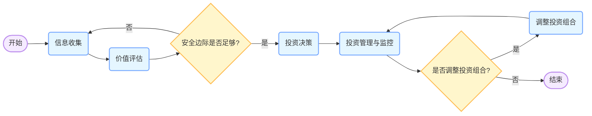

# 克里斯托弗·布朗的深度价值投资方法

> 关键词：克里斯托弗·布朗、深度价值投资、价值评估、安全边际、投资策略

> 摘要：本文深入探讨了克里斯托弗·布朗的深度价值投资方法。首先介绍了该方法产生的背景以及适用的读者群体等内容，接着详细阐述了深度价值投资的核心概念与联系，包括其原理和架构，并通过Mermaid流程图呈现。随后对核心算法原理进行剖析，结合Python代码详细说明操作步骤，同时给出相关数学模型和公式并举例。在项目实战部分，以具体代码案例展示开发环境搭建、代码实现及解读。还探讨了该投资方法的实际应用场景，推荐了相关学习资源、开发工具框架以及论文著作。最后总结了其未来发展趋势与挑战，提供常见问题解答和扩展阅读参考资料，旨在帮助读者全面理解和运用克里斯托弗·布朗的深度价值投资方法。

## 1. 背景介绍 
### 1.1 目的和范围
克里斯托弗·布朗的深度价值投资方法旨在为投资者提供一种基于价值分析的投资策略，以实现长期稳定的投资回报。其范围涵盖了股票、债券等多种金融资产的投资决策过程。该方法强调对资产内在价值的深入挖掘，通过寻找被市场低估的资产，在确保安全边际的前提下进行投资。其目的不仅在于获得资产价格上涨带来的收益，更在于通过对公司基本面的分析，评估公司的长期发展潜力，从而实现资产的增值。

### 1.2 预期读者
本文预期读者包括对价值投资感兴趣的个人投资者、金融专业学生、投资机构从业者以及研究价值投资理论的学者等。对于个人投资者而言，希望通过学习该方法，能够更加理性地进行投资决策，提高投资收益；金融专业学生可以将其作为学习价值投资理论的实践案例，加深对相关知识的理解；投资机构从业者则可以借鉴该方法，优化投资组合，提升机构的投资业绩；研究学者可以从理论和实践的角度对该方法进行深入研究，推动价值投资理论的发展。

### 1.3 文档结构概述
本文将按照以下结构进行阐述。首先介绍深度价值投资方法的背景信息，包括目的、预期读者和文档结构概述等内容。接着详细讲解核心概念与联系，通过文本示意图和Mermaid流程图展示其原理和架构。然后深入剖析核心算法原理，结合Python代码说明具体操作步骤，并给出相关数学模型和公式及举例。在项目实战部分，通过实际代码案例展示开发环境搭建、代码实现及解读。之后探讨该方法的实际应用场景，推荐相关学习资源、开发工具框架以及论文著作。最后总结其未来发展趋势与挑战，提供常见问题解答和扩展阅读参考资料。

### 1.4 术语表
#### 1.4.1 核心术语定义
- **深度价值投资**：是一种基于价值分析的投资策略，强调寻找被市场严重低估的资产，通过对公司基本面的深入研究，评估资产的内在价值，在确保安全边际的前提下进行投资，以实现长期稳定的投资回报。
- **内在价值**：指资产本身所具有的价值，是基于公司的财务状况、经营业绩、行业前景等因素综合评估得出的价值，与市场价格相对应。
- **安全边际**：是指投资时资产的市场价格低于其内在价值的幅度，安全边际越大，投资的风险越低。

#### 1.4.2 相关概念解释
- **基本面分析**：是指通过对公司的财务报表、行业竞争地位、管理层能力等方面进行分析，评估公司的内在价值和发展潜力的方法。基本面分析是深度价值投资的重要基础，通过对公司基本面的研究，可以更好地理解公司的经营状况和未来发展趋势。
- **市场效率**：是指市场价格反映资产内在价值的程度。在有效市场中，市场价格能够迅速、准确地反映资产的内在价值；而在无效市场中，市场价格可能会偏离资产的内在价值，从而为深度价值投资者提供投资机会。

#### 1.4.3 缩略词列表
- **PE**：市盈率（Price - Earnings Ratio），是指股票价格与每股收益的比率，用于衡量股票的估值水平。
- **PB**：市净率（Price - Book Ratio），是指股票价格与每股净资产的比率，用于衡量股票的估值水平。

## 2. 核心概念与联系 
### 核心概念原理
克里斯托弗·布朗的深度价值投资方法的核心原理是基于价值投资理论，认为市场并非总是有效的，资产的市场价格可能会偏离其内在价值。投资者的任务就是通过对公司基本面的深入研究，评估资产的内在价值，并寻找那些市场价格低于内在价值的资产进行投资。

深度价值投资强调安全边际的重要性，即投资者在购买资产时，要确保资产的市场价格与内在价值之间存在足够的差距，以降低投资风险。同时，该方法注重长期投资，认为市场的短期波动是不可预测的，但从长期来看，资产的价格会回归其内在价值。

### 架构的文本示意图
深度价值投资方法的架构可以分为以下几个层次：
1. **信息收集层**：收集公司的财务报表、行业报告、新闻资讯等相关信息，为后续的分析提供数据支持。
2. **价值评估层**：运用各种估值方法，如现金流折现法、相对估值法等，对公司的内在价值进行评估。
3. **安全边际评估层**：根据价值评估结果，计算资产的市场价格与内在价值之间的差距，评估安全边际的大小。
4. **投资决策层**：根据安全边际的大小和其他因素，做出投资决策，包括是否投资、投资的金额和时机等。
5. **投资管理与监控层**：在投资后，对投资组合进行管理和监控，根据市场变化和公司基本面的变化，及时调整投资组合。

### Mermaid 流程图


## 3. 核心算法原理 & 具体操作步骤 
### 核心算法原理
深度价值投资的核心算法原理主要围绕价值评估和安全边际计算展开。价值评估是确定资产内在价值的过程，常用的方法有现金流折现法（DCF）和相对估值法。

#### 现金流折现法（DCF）
现金流折现法的基本思想是将公司未来的现金流折现到当前，以计算公司的内在价值。其计算公式为：
$$V = \sum_{t = 1}^{n}\frac{CF_t}{(1 + r)^t}+\frac{TV}{(1 + r)^n}$$
其中，$V$ 表示公司的内在价值，$CF_t$ 表示第 $t$ 期的现金流，$r$ 表示折现率，$TV$ 表示终值，$n$ 表示预测期数。

#### 相对估值法
相对估值法是通过比较公司与同行业其他公司的估值指标，如市盈率（PE）、市净率（PB）等，来评估公司的价值。其计算公式为：
$$V = P\times\frac{EPS}{PE_{行业平均}}$$
其中，$V$ 表示公司的内在价值，$P$ 表示公司的市场价格，$EPS$ 表示每股收益，$PE_{行业平均}$ 表示同行业的平均市盈率。

### 具体操作步骤（Python 代码实现）
```python
# 现金流折现法示例
def dcf_valuation(cash_flows, discount_rate, terminal_value, num_periods):
    """
    现金流折现法计算公司内在价值
    :param cash_flows: 各期现金流列表
    :param discount_rate: 折现率
    :param terminal_value: 终值
    :param num_periods: 预测期数
    :return: 公司内在价值
    """
    value = 0
    for t in range(num_periods):
        value += cash_flows[t] / (1 + discount_rate) ** (t + 1)
    value += terminal_value / (1 + discount_rate) ** num_periods
    return value

# 相对估值法示例
def relative_valuation(market_price, eps, industry_pe):
    """
    相对估值法计算公司内在价值
    :param market_price: 公司市场价格
    :param eps: 每股收益
    :param industry_pe: 行业平均市盈率
    :return: 公司内在价值
    """
    return market_price * (eps / industry_pe)

# 示例数据
cash_flows = [100, 120, 150, 180, 200]
discount_rate = 0.1
terminal_value = 1000
num_periods = 5
market_price = 50
eps = 5
industry_pe = 10

# 计算内在价值
dcf_value = dcf_valuation(cash_flows, discount_rate, terminal_value, num_periods)
relative_value = relative_valuation(market_price, eps, industry_pe)

print(f"现金流折现法计算的内在价值: {dcf_value}")
print(f"相对估值法计算的内在价值: {relative_value}")
```

## 4. 数学模型和公式 & 详细讲解 & 举例说明 
### 现金流折现法（DCF）
#### 数学模型和公式
$$V = \sum_{t = 1}^{n}\frac{CF_t}{(1 + r)^t}+\frac{TV}{(1 + r)^n}$$
其中：
- $V$：公司的内在价值。
- $CF_t$：第 $t$ 期的现金流，反映了公司在该时期的经营活动产生的现金流量。
- $r$：折现率，是投资者要求的必要收益率，考虑了资金的时间价值和投资风险。
- $TV$：终值，是预测期结束后公司的价值，通常采用永续增长模型计算，公式为 $TV=\frac{CF_{n + 1}}{r - g}$，其中 $CF_{n + 1}$ 是预测期结束后下一期的现金流，$g$ 是永续增长率。
- $n$：预测期数，通常根据公司的发展阶段和行业特点确定。

#### 详细讲解
现金流折现法的核心思想是将公司未来的现金流折现到当前，以反映其真实价值。因为未来的现金流具有不确定性，所以需要通过折现率将其调整到当前的价值。折现率的选择非常重要，它反映了投资者对投资风险的预期。如果折现率过高，会低估公司的价值；如果折现率过低，会高估公司的价值。

预测期数的确定也需要综合考虑公司的发展阶段和行业特点。对于处于快速发展阶段的公司，预测期数可以适当延长；对于处于成熟阶段的公司，预测期数可以相对较短。

#### 举例说明
假设一家公司未来 5 年的现金流分别为 100 万元、120 万元、150 万元、180 万元、200 万元，折现率为 10%，预测期结束后公司的永续增长率为 3%。则预测期结束后下一期的现金流为 $200\times(1 + 0.03)=206$ 万元，终值为 $TV=\frac{206}{0.1 - 0.03}\approx2942.86$ 万元。

公司的内在价值为：
$$V=\frac{100}{(1 + 0.1)^1}+\frac{120}{(1 + 0.1)^2}+\frac{150}{(1 + 0.1)^3}+\frac{180}{(1 + 0.1)^4}+\frac{200}{(1 + 0.1)^5}+\frac{2942.86}{(1 + 0.1)^5}$$
$$V\approx90.91 + 99.17+112.70 + 122.94+124.18+1827.99\approx2377.89$$ 万元。

### 相对估值法
#### 数学模型和公式
$$V = P\times\frac{EPS}{PE_{行业平均}}$$
其中：
- $V$：公司的内在价值。
- $P$：公司的市场价格。
- $EPS$：每股收益，反映了公司的盈利能力。
- $PE_{行业平均}$：同行业的平均市盈率，是衡量行业估值水平的指标。

#### 详细讲解
相对估值法的基本思想是通过比较公司与同行业其他公司的估值指标，来评估公司的价值。如果公司的市盈率低于同行业平均市盈率，说明公司可能被低估；反之，如果公司的市盈率高于同行业平均市盈率，说明公司可能被高估。

相对估值法的优点是简单易懂，计算方便，适用于对同行业公司进行比较。但它也有局限性，因为不同公司的盈利能力、成长潜力等因素可能存在差异，单纯依靠市盈率进行比较可能不够准确。

#### 举例说明
假设一家公司的市场价格为 50 元，每股收益为 5 元，同行业的平均市盈率为 10 倍。则该公司的内在价值为：
$$V = 50\times\frac{5}{10}=25$$ 元。
如果该公司的市场价格高于 25 元，说明公司可能被高估；如果市场价格低于 25 元，说明公司可能被低估。

## 5. 项目实战：代码实际案例和详细解释说明 
### 5.1  开发环境搭建
#### 安装 Python
首先，需要安装 Python 环境。可以从 Python 官方网站（https://www.python.org/downloads/）下载适合自己操作系统的 Python 安装包，按照安装向导进行安装。安装完成后，可以在命令行中输入 `python --version` 来验证 Python 是否安装成功。

#### 安装必要的库
在进行深度价值投资的项目实战中，需要安装一些必要的库，如 `pandas` 用于数据处理，`numpy` 用于数值计算。可以使用 `pip` 命令进行安装：
```sh
pip install pandas numpy
```

### 5.2  源代码详细实现和代码解读
```python
import pandas as pd
import numpy as np

# 定义现金流折现法函数
def dcf_valuation(cash_flows, discount_rate, terminal_value, num_periods):
    """
    现金流折现法计算公司内在价值
    :param cash_flows: 各期现金流列表
    :param discount_rate: 折现率
    :param terminal_value: 终值
    :param num_periods: 预测期数
    :return: 公司内在价值
    """
    value = 0
    for t in range(num_periods):
        value += cash_flows[t] / (1 + discount_rate) ** (t + 1)
    value += terminal_value / (1 + discount_rate) ** num_periods
    return value

# 定义相对估值法函数
def relative_valuation(market_price, eps, industry_pe):
    """
    相对估值法计算公司内在价值
    :param market_price: 公司市场价格
    :param eps: 每股收益
    :param industry_pe: 行业平均市盈率
    :return: 公司内在价值
    """
    return market_price * (eps / industry_pe)

# 模拟数据
# 假设我们有 3 家公司的数据
data = {
    '公司名称': ['公司 A', '公司 B', '公司 C'],
    '市场价格': [50, 60, 70],
    '每股收益': [5, 6, 7],
    '行业平均市盈率': [10, 10, 10],
    '各期现金流': [
        [100, 120, 150, 180, 200],
        [110, 130, 160, 190, 210],
        [120, 140, 170, 200, 220]
    ],
    '折现率': [0.1, 0.1, 0.1],
    '终值': [1000, 1100, 1200],
    '预测期数': [5, 5, 5]
}

df = pd.DataFrame(data)

# 计算每家公司的内在价值
df['DCF 内在价值'] = df.apply(lambda row: dcf_valuation(row['各期现金流'], row['折现率'], row['终值'], row['预测期数']), axis=1)
df['相对估值内在价值'] = df.apply(lambda row: relative_valuation(row['市场价格'], row['每股收益'], row['行业平均市盈率']), axis=1)

# 计算安全边际
df['DCF 安全边际'] = (df['DCF 内在价值'] - df['市场价格']) / df['DCF 内在价值']
df['相对估值安全边际'] = (df['相对估值内在价值'] - df['市场价格']) / df['相对估值内在价值']

print(df)
```

### 5.3  代码解读与分析
#### 导入必要的库
```python
import pandas as pd
import numpy as np
```
导入 `pandas` 和 `numpy` 库，`pandas` 用于数据处理和分析，`numpy` 用于数值计算。

#### 定义估值函数
```python
def dcf_valuation(cash_flows, discount_rate, terminal_value, num_periods):
    ...
def relative_valuation(market_price, eps, industry_pe):
    ...
```
定义了现金流折现法和相对估值法的函数，用于计算公司的内在价值。

#### 模拟数据
```python
data = {
    '公司名称': ['公司 A', '公司 B', '公司 C'],
    '市场价格': [50, 60, 70],
    '每股收益': [5, 6, 7],
    '行业平均市盈率': [10, 10, 10],
    '各期现金流': [
        [100, 120, 150, 180, 200],
        [110, 130, 160, 190, 210],
        [120, 140, 170, 200, 220]
    ],
    '折现率': [0.1, 0.1, 0.1],
    '终值': [1000, 1100, 1200],
    '预测期数': [5, 5, 5]
}

df = pd.DataFrame(data)
```
创建一个包含 3 家公司数据的字典，并将其转换为 `pandas` 的 `DataFrame` 对象。

#### 计算内在价值和安全边际
```python
df['DCF 内在价值'] = df.apply(lambda row: dcf_valuation(row['各期现金流'], row['折现率'], row['终值'], row['预测期数']), axis=1)
df['相对估值内在价值'] = df.apply(lambda row: relative_valuation(row['市场价格'], row['每股收益'], row['行业平均市盈率']), axis=1)

df['DCF 安全边际'] = (df['DCF 内在价值'] - df['市场价格']) / df['DCF 内在价值']
df['相对估值安全边际'] = (df['相对估值内在价值'] - df['市场价格']) / df['相对估值内在价值']
```
使用 `apply` 方法对 `DataFrame` 中的每一行应用估值函数，计算每家公司的内在价值。然后根据内在价值和市场价格计算安全边际。

#### 输出结果
```python
print(df)
```
打印包含每家公司内在价值和安全边际的 `DataFrame`。

通过这个代码案例，我们可以对不同公司的内在价值和安全边际进行评估，从而为投资决策提供参考。

## 6. 实际应用场景 
### 股票投资
在股票投资中，克里斯托弗·布朗的深度价值投资方法可以帮助投资者筛选出被市场低估的股票。投资者可以通过对公司的财务报表、行业前景等进行分析，运用现金流折现法和相对估值法等方法计算股票的内在价值，并与市场价格进行比较。如果股票的市场价格低于其内在价值，且安全边际足够大，投资者可以考虑买入该股票。例如，在市场低迷时期，一些优质公司的股票价格可能会被过度打压，此时运用深度价值投资方法进行分析，可能会发现一些具有投资价值的股票。

### 债券投资
在债券投资中，深度价值投资方法同样适用。投资者可以通过对债券发行人的信用状况、财务状况等进行分析，评估债券的内在价值。例如，对于一些信用评级被下调但实际经营状况仍然良好的债券，其市场价格可能会下降，此时投资者可以通过分析其内在价值，判断是否存在投资机会。如果债券的内在价值高于市场价格，且安全边际足够大，投资者可以考虑买入该债券。

### 基金投资
对于基金投资者来说，深度价值投资方法可以帮助他们选择具有投资价值的基金。投资者可以通过分析基金的持仓情况、基金经理的投资策略等，评估基金的内在价值。例如，一些价值型基金可能会投资于被市场低估的股票，投资者可以运用深度价值投资方法对这些基金的持仓股票进行分析，判断基金的投资价值。如果基金的内在价值高于其净值，且安全边际足够大，投资者可以考虑买入该基金。

### 企业并购
在企业并购中，深度价值投资方法可以帮助并购方评估被并购企业的价值。并购方可以通过对被并购企业的财务状况、市场地位、技术实力等进行分析，运用现金流折现法和相对估值法等方法计算被并购企业的内在价值。如果被并购企业的市场价格低于其内在价值，且安全边际足够大，并购方可以考虑进行并购。这样可以降低并购成本，提高并购的成功率和收益。

## 7. 工具和资源推荐
### 7.1 学习资源推荐
#### 7.1.1 书籍推荐
- 《聪明的投资者》（The Intelligent Investor）：本杰明·格雷厄姆（Benjamin Graham）著，被誉为价值投资的圣经，书中详细阐述了价值投资的理念和方法，对克里斯托弗·布朗的深度价值投资方法有重要的理论基础作用。
- 《证券分析》（Security Analysis）：本杰明·格雷厄姆和戴维·多德（David Dodd）合著，是价值投资领域的经典著作，深入探讨了证券估值的方法和原则，为深度价值投资提供了理论支持。
- 《怎样选择成长股》（Common Stocks and Uncommon Profits）：菲利普·费雪（Philip Fisher）著，介绍了寻找成长型股票的方法和技巧，与深度价值投资方法相结合，可以帮助投资者更好地进行投资决策。

#### 7.1.2 在线课程
- Coursera 上的“投资学原理”（Principles of Investing）课程：由知名教授授课，涵盖了投资的基本理论和方法，包括价值投资的相关内容，适合初学者学习。
- edX 上的“金融市场”（Financial Markets）课程：耶鲁大学教授罗伯特·席勒（Robert Shiller）主讲，深入探讨了金融市场的运行机制和投资策略，对理解深度价值投资方法有很大帮助。

#### 7.1.3 技术博客和网站
- 雪球网（https://xueqiu.com/）：是一个投资交流社区，汇聚了众多投资者和投资专家，提供了丰富的投资资讯、研究报告和投资分析文章，对学习深度价值投资方法有很大的参考价值。
- 价值投资网（https://www.value-investing.com.cn/）：专注于价值投资领域，提供了价值投资的理论知识、案例分析和投资工具，是学习深度价值投资方法的重要资源。

### 7.2 开发工具框架推荐
#### 7.2.1 IDE和编辑器
- PyCharm：是一款专业的 Python 集成开发环境，具有代码编辑、调试、自动补全、代码分析等功能，适合进行深度价值投资相关的 Python 代码开发。
- Jupyter Notebook：是一个交互式的开发环境，支持 Python、R 等多种编程语言，适合进行数据探索、分析和可视化，对于深度价值投资中的数据处理和分析非常有用。

#### 7.2.2 调试和性能分析工具
- `pdb`：是 Python 内置的调试工具，可以帮助开发者在代码中设置断点、单步执行、查看变量值等，方便调试深度价值投资相关的 Python 代码。
- `cProfile`：是 Python 内置的性能分析工具，可以帮助开发者分析代码的性能瓶颈，优化深度价值投资相关的 Python 代码。

#### 7.2.3 相关框架和库
- `pandas`：是一个强大的数据处理和分析库，提供了丰富的数据结构和数据处理方法，适合处理深度价值投资中的财务数据和市场数据。
- `numpy`：是一个用于科学计算的库，提供了高效的数组操作和数学函数，对于深度价值投资中的数值计算非常有用。
- `matplotlib`：是一个用于数据可视化的库，可以帮助开发者将深度价值投资中的数据以图表的形式展示出来，方便分析和决策。

### 7.3 相关论文著作推荐
#### 7.3.1 经典论文
- 《The Arbitrage Pricing Theory of Capital Asset Pricing》（Stephen A. Ross）：提出了套利定价理论，对资产定价模型进行了深入探讨，为深度价值投资中的价值评估提供了理论基础。
- 《Efficient Capital Markets: A Review of Theory and Empirical Work》（Eugene F. Fama）：对有效市场假说进行了系统的阐述和总结，对理解市场效率和深度价值投资的机会来源有重要意义。

#### 7.3.2 最新研究成果
- 《Factor Investing in the Twenty - First Century》（Ronald Kahn, Scott L. Hsu, John K. Wald）：探讨了因子投资在现代投资组合中的应用，与深度价值投资方法相结合，可以为投资者提供更全面的投资策略。
- 《Machine Learning for Asset Managers》（Lopez de Prado, Marcos）：介绍了机器学习在资产管理中的应用，为深度价值投资中的数据处理和分析提供了新的方法和思路。

#### 7.3.3 应用案例分析
- 《Value Investing: From Graham to Buffett and Beyond》（Bruce C. N. Greenwald, Judd Kahn, Paul D. Sonkin, Michael van Biema）：通过大量的实际案例分析，阐述了价值投资的理念和方法，对理解克里斯托弗·布朗的深度价值投资方法的实际应用有很大帮助。

## 8. 总结：未来发展趋势与挑战
### 未来发展趋势
#### 与科技的融合
随着科技的不断发展，深度价值投资方法将与大数据、人工智能等技术更加紧密地融合。通过大数据技术，可以获取更全面、更准确的公司信息和市场数据，为价值评估提供更丰富的依据。人工智能技术可以帮助投资者更高效地分析数据，挖掘潜在的投资机会，提高投资决策的准确性和效率。例如，利用机器学习算法对公司的财务数据和市场数据进行分析，预测公司的未来业绩和股票价格走势。

#### 全球化投资
随着全球经济一体化的发展，深度价值投资将越来越注重全球化投资。投资者将不再局限于本国市场，而是会在全球范围内寻找被低估的资产。这将要求投资者具备更广泛的国际视野和跨文化投资经验，了解不同国家和地区的经济、政治、法律等环境，评估不同市场的投资风险和机会。

#### 社会责任投资的结合
未来，深度价值投资可能会与社会责任投资相结合。投资者在追求投资回报的同时，也会更加关注公司的社会责任表现，如环境保护、员工福利、社会公益等。具有良好社会责任表现的公司可能会被认为具有更高的长期投资价值，因为它们更有可能获得社会的认可和支持，从而实现可持续发展。

### 挑战
#### 数据质量和可靠性
深度价值投资方法依赖于大量的公司信息和市场数据，数据的质量和可靠性直接影响到价值评估的准确性和投资决策的正确性。然而，在实际应用中，数据可能存在不准确、不完整、滞后等问题，这给投资者带来了很大的挑战。例如，公司的财务报表可能存在造假的情况，市场数据可能受到人为操纵的影响。

#### 市场不确定性
市场是复杂多变的，存在着各种不确定性因素，如宏观经济环境的变化、政策法规的调整、行业竞争的加剧等。这些不确定性因素可能导致公司的基本面发生变化，从而影响资产的内在价值和市场价格。投资者很难准确预测这些不确定性因素的发生和影响，这增加了深度价值投资的风险。

#### 投资者情绪的影响
投资者情绪在市场中起着重要的作用，往往会导致市场价格的波动偏离资产的内在价值。当市场情绪乐观时，投资者可能会过度买入股票，导致股票价格高估；当市场情绪悲观时，投资者可能会过度卖出股票，导致股票价格低估。投资者很难完全克服情绪的影响，做出理性的投资决策。

## 9. 附录：常见问题与解答
### 1. 深度价值投资方法适用于所有市场吗？
深度价值投资方法并不是适用于所有市场。在有效市场中，资产的市场价格能够迅速、准确地反映其内在价值，很难找到被低估的资产，深度价值投资方法的应用空间相对较小。而在无效市场中，市场价格可能会偏离资产的内在价值，为深度价值投资提供了机会。但不同的市场环境具有不同的特点，投资者需要根据市场情况灵活调整投资策略。

### 2. 如何确定折现率和永续增长率？
折现率的确定需要综合考虑资金的时间价值和投资风险。一般来说，可以参考市场利率、行业平均收益率等因素，并根据投资的具体情况进行调整。永续增长率的确定需要考虑公司所处的行业发展阶段、市场竞争格局等因素。对于处于成熟行业的公司，永续增长率可以相对较低；对于处于快速发展行业的公司，永续增长率可以相对较高。但需要注意的是，折现率和永续增长率的确定具有一定的主观性，需要投资者根据自己的经验和判断进行合理估计。

### 3. 安全边际的大小如何确定？
安全边际的大小没有固定的标准，需要根据投资者的风险偏好、投资目标和市场情况等因素来确定。一般来说，安全边际越大，投资的风险越低，但同时可能也会错过一些投资机会。投资者可以根据自己的情况，设定一个合理的安全边际阈值，当资产的安全边际达到或超过该阈值时，才考虑进行投资。

### 4. 深度价值投资方法与成长投资方法有什么区别？
深度价值投资方法更注重资产的内在价值和安全边际，强调寻找被市场低估的资产，通过资产价格回归内在价值来获取收益。而成长投资方法更注重公司的成长潜力，强调投资于具有高成长潜力的公司，通过公司的业绩增长来获取收益。两者的投资理念和投资策略有所不同，投资者可以根据自己的投资目标和风险偏好选择适合自己的投资方法。

## 10. 扩展阅读 & 参考资料
### 扩展阅读
- 《巴菲特致股东的信：股份公司教程》（Warren Buffett's Letters to Shareholders: Lessons for Corporate America）：沃伦·巴菲特（Warren Buffett）著，通过巴菲特致股东的信，深入了解巴菲特的投资理念和方法，与克里斯托弗·布朗的深度价值投资方法相互印证和补充。
- 《金融炼金术》（The Alchemy of Finance）：乔治·索罗斯（George Soros）著，探讨了金融市场的运行机制和投资者的行为模式，对理解市场的不确定性和深度价值投资的挑战有很大帮助。

### 参考资料
- 格雷厄姆，本杰明. 《聪明的投资者》[M]. 人民邮电出版社, 2016.
- 格雷厄姆，本杰明；多德，戴维. 《证券分析》[M]. 海南出版社, 2006.
- 费雪，菲利普. 《怎样选择成长股》[M]. 机械工业出版社, 2013.
- Ross, Stephen A. "The Arbitrage Pricing Theory of Capital Asset Pricing." Journal of Economic Theory, 1976.
- Fama, Eugene F. "Efficient Capital Markets: A Review of Theory and Empirical Work." The Journal of Finance, 1970.
- Greenwald, Bruce C. N.; Kahn, Judd; Sonkin, Paul D.; van Biema, Michael. "Value Investing: From Graham to Buffett and Beyond." Wiley, 2001.