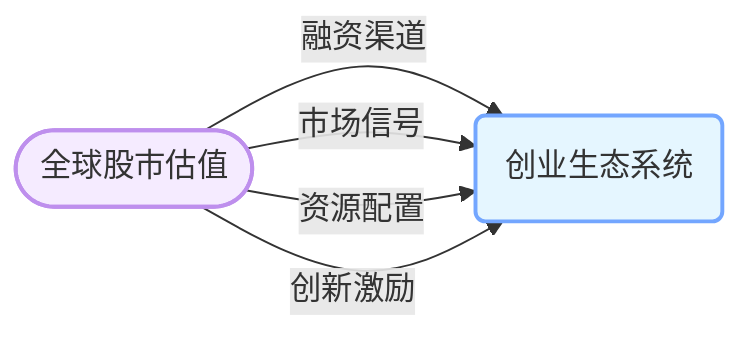

# 全球股市估值与创业生态系统的互动

> 关键词：全球股市估值、创业生态系统、互动关系、经济影响、市场趋势

> 摘要：本文旨在深入探讨全球股市估值与创业生态系统之间的互动关系。通过对相关概念的介绍、核心算法原理的剖析、数学模型的构建以及项目实战案例的分析，揭示两者之间相互影响、相互促进的内在机制。同时，探讨了它们在实际应用场景中的表现，推荐了相关的学习资源、开发工具和研究论文，最后对未来发展趋势与挑战进行了总结，并解答了常见问题。这对于理解全球经济运行规律、把握创业投资机会具有重要的理论和实践意义。

## 1. 背景介绍 
### 1.1 目的和范围
本研究的主要目的是全面、深入地探究全球股市估值与创业生态系统之间的互动关系。全球股市作为金融市场的重要组成部分，其估值的变化反映了市场对各类企业价值的判断和预期。而创业生态系统则涵盖了创业者、投资者、孵化器、政府政策等多个要素，是推动创新和经济增长的关键力量。研究两者之间的互动关系，有助于我们更好地理解金融市场与实体经济之间的联系，为创业者、投资者和政策制定者提供决策依据。

研究范围将涵盖全球主要股票市场，包括美国的纳斯达克、纽约证券交易所，欧洲的伦敦证券交易所、泛欧证券交易所，亚洲的东京证券交易所、香港证券交易所等。同时，也将关注全球范围内不同地区的创业生态系统，包括硅谷、中关村、以色列特拉维夫等具有代表性的创业中心。

### 1.2 预期读者
本文的预期读者包括但不限于以下几类人群：
1. **创业者**：希望通过了解全球股市估值与创业生态系统的互动关系，更好地把握市场趋势，制定合理的创业策略，提高创业成功的概率。
2. **投资者**：包括风险投资家、天使投资人、私募股权基金等，旨在通过深入研究两者之间的关系，寻找具有投资价值的创业项目，优化投资组合，实现投资收益最大化。
3. **政策制定者**：政府部门和相关机构的工作人员，通过了解两者之间的互动机制，制定更加科学合理的政策，促进创业生态系统的健康发展，推动经济增长。
4. **金融从业者**：包括股票分析师、投资顾问、基金经理等，有助于他们更好地理解市场动态，为客户提供更准确的投资建议。
5. **学术研究人员**：对金融市场、创业创新等领域感兴趣的学者，为他们的研究提供参考和借鉴，推动相关学术领域的发展。

### 1.3 文档结构概述
本文将按照以下结构进行组织：
1. **背景介绍**：阐述研究的目的和范围、预期读者、文档结构概述以及相关术语的定义和解释。
2. **核心概念与联系**：介绍全球股市估值和创业生态系统的核心概念，分析两者之间的内在联系，并通过文本示意图和 Mermaid 流程图进行直观展示。
3. **核心算法原理 & 具体操作步骤**：讲解用于分析全球股市估值与创业生态系统互动关系的核心算法原理，并使用 Python 源代码详细阐述具体操作步骤。
4. **数学模型和公式 & 详细讲解 & 举例说明**：构建数学模型，推导相关公式，并通过具体例子进行详细讲解，以深入理解两者之间的数量关系。
5. **项目实战：代码实际案例和详细解释说明**：通过实际项目案例，展示如何运用前面介绍的算法和模型进行分析，包括开发环境搭建、源代码实现、代码解读与分析等内容。
6. **实际应用场景**：探讨全球股市估值与创业生态系统互动关系在实际中的应用场景，如创业项目评估、投资决策、政策制定等。
7. **工具和资源推荐**：推荐相关的学习资源、开发工具和研究论文，帮助读者进一步深入学习和研究。
8. **总结：未来发展趋势与挑战**：总结全球股市估值与创业生态系统互动关系的未来发展趋势，并分析可能面临的挑战。
9. **附录：常见问题与解答**：解答读者在阅读过程中可能遇到的常见问题。
10. **扩展阅读 & 参考资料**：提供相关的扩展阅读材料和参考资料，方便读者进一步查阅和学习。

### 1.4 术语表
#### 1.4.1 核心术语定义
1. **全球股市估值**：指对全球范围内各个股票市场中上市公司的价值进行评估和判断的过程和结果。通常采用市盈率（P/E）、市净率（P/B）、股息率等指标来衡量。
2. **创业生态系统**：是一个由创业者、投资者、孵化器、加速器、政府政策、高校和科研机构等多种要素相互作用、相互影响而形成的复杂系统。其目的是为创业者提供良好的创业环境和支持，促进创新和创业活动的开展。
3. **风险投资**：是指向具有高增长潜力的创业企业提供资金支持，并通过参与企业管理和运营，期望在企业成长和发展过程中获得高额回报的一种投资方式。
4. **首次公开募股（IPO）**：是指一家企业第一次将它的股份向公众出售的行为。通常是创业企业发展到一定阶段后，为了筹集资金、扩大规模、提升知名度等目的而选择的一种融资方式。

#### 1.4.2 相关概念解释
1. **市场情绪**：指投资者对市场的整体看法和预期，包括乐观、悲观、中性等不同情绪状态。市场情绪会对股市估值产生重要影响，当投资者情绪乐观时，股市估值往往会上升；反之，当投资者情绪悲观时，股市估值则会下降。
2. **创新生态系统**：是创业生态系统的重要组成部分，主要包括高校和科研机构的创新研究、企业的技术创新活动、政府的创新政策支持等要素。创新生态系统的发展水平直接影响着创业生态系统的活力和竞争力。
3. **融资轮次**：指创业企业在发展过程中进行融资的不同阶段，通常包括种子轮、天使轮、A 轮、B 轮、C 轮等。不同的融资轮次对应着企业不同的发展阶段和融资需求。

#### 1.4.3 缩略词列表
1. **P/E**：市盈率（Price-to-Earnings Ratio），是指股票价格与每股收益的比率，反映了市场对企业盈利能力的预期。
2. **P/B**：市净率（Price-to-Book Ratio），是指股票价格与每股净资产的比率，反映了市场对企业资产价值的评估。
3. **IPO**：首次公开募股（Initial Public Offering）
4. **VC**：风险投资（Venture Capital）
5. **PE**：私募股权（Private Equity）

## 2. 核心概念与联系 
### 2.1 全球股市估值的核心概念
全球股市估值是一个复杂的过程，它受到多种因素的影响，包括宏观经济环境、公司基本面、市场情绪等。常见的估值方法有相对估值法和绝对估值法。

相对估值法是通过比较同行业或类似企业的估值指标来评估目标企业的价值。常用的相对估值指标包括市盈率（P/E）、市净率（P/B）、市销率（P/S）等。例如，市盈率是指股票价格与每股收益的比率，反映了市场对企业盈利能力的预期。如果一家企业的市盈率高于同行业平均水平，可能意味着市场对该企业的未来发展前景更为看好；反之，如果市盈率低于同行业平均水平，则可能表示市场对该企业的前景较为悲观。

绝对估值法是通过对企业未来现金流的折现来计算企业的内在价值。常用的绝对估值模型包括股息折现模型（DDM）、自由现金流折现模型（DCF）等。以自由现金流折现模型为例，它的基本原理是将企业未来各期的自由现金流按照一定的折现率折现到当前时刻，然后将这些折现值相加，得到企业的内在价值。

### 2.2 创业生态系统的核心概念
创业生态系统是一个由多个要素组成的复杂系统，这些要素相互作用、相互影响，共同促进创业活动的开展。主要要素包括：
1. **创业者**：是创业生态系统的核心主体，他们具有创新精神和创业意愿，通过发现市场机会、整合资源、创建企业来实现自己的创业梦想。
2. **投资者**：包括风险投资家、天使投资人、私募股权基金等，他们为创业企业提供资金支持，并通过参与企业管理和运营，帮助企业成长和发展。
3. **孵化器和加速器**：是为创业企业提供物理空间、创业培训、技术支持、市场推广等服务的机构。孵化器主要针对处于创业早期的企业，提供基础性的支持和服务；加速器则主要针对已经有一定发展基础的企业，帮助其加速成长和扩张。
4. **政府政策**：政府通过制定和实施相关政策，如税收优惠、财政补贴、创业贷款等，为创业企业提供支持和保障，促进创业生态系统的健康发展。
5. **高校和科研机构**：是知识创新和技术研发的重要源泉，为创业企业提供人才、技术和创新理念等方面的支持。

### 2.3 全球股市估值与创业生态系统的联系
全球股市估值与创业生态系统之间存在着密切的联系，主要体现在以下几个方面：
1. **融资渠道**：股市是创业企业重要的融资渠道之一。当股市估值较高时，创业企业通过首次公开募股（IPO）可以获得更多的资金，从而为企业的发展提供有力支持。同时，较高的股市估值也会吸引更多的风险投资和私募股权投资进入创业领域，为创业企业提供更多的融资机会。
2. **市场信号**：股市估值的变化可以作为一种市场信号，反映市场对创业企业的预期和信心。当股市估值上升时，表明市场对创业企业的前景较为乐观，这会吸引更多的创业者进入市场，同时也会激励现有创业企业加大创新和发展的力度。反之，当股市估值下降时，市场对创业企业的信心可能会受到影响，创业活动可能会受到一定程度的抑制。
3. **资源配置**：股市估值的高低会影响资源的配置方向。当股市估值较高时，资金会更多地流向股市，包括创业企业的股票。这会促使更多的资源向创业领域集中，有利于创业生态系统的发展和壮大。相反，当股市估值较低时，资金可能会流出股市，转向其他领域，这可能会对创业生态系统的发展产生一定的负面影响。
4. **创新激励**：股市估值的上升可以为创业企业的创始人、员工和投资者带来丰厚的回报，这会激励他们更加积极地进行创新和创业活动。同时，股市的发展也会促进技术创新和产业升级，为创业生态系统提供更好的发展环境。

### 2.4 文本示意图和 Mermaid 流程图
#### 2.4.1 文本示意图
全球股市估值与创业生态系统的联系可以用以下文本示意图表示：

全球股市估值 <-- 融资渠道 --> 创业生态系统
全球股市估值 <-- 市场信号 --> 创业生态系统
全球股市估值 <-- 资源配置 --> 创业生态系统
全球股市估值 <-- 创新激励 --> 创业生态系统

#### 2.4.2 Mermaid 流程图


## 3. 核心算法原理 & 具体操作步骤 
### 3.1 核心算法原理
为了分析全球股市估值与创业生态系统的互动关系，我们可以采用多元回归分析的方法。多元回归分析是一种统计方法，用于研究一个因变量与多个自变量之间的关系。在本研究中，我们可以将创业生态系统的相关指标（如创业企业数量、风险投资金额等）作为因变量，将全球股市估值的相关指标（如市盈率、市净率等）以及其他可能影响创业生态系统的因素（如宏观经济指标、政策因素等）作为自变量，建立多元回归模型。

多元回归模型的一般形式为：

$Y = \beta_0 + \beta_1X_1 + \beta_2X_2 + \cdots + \beta_nX_n + \epsilon$

其中，$Y$ 是因变量，$X_1, X_2, \cdots, X_n$ 是自变量，$\beta_0, \beta_1, \beta_2, \cdots, \beta_n$ 是回归系数，$\epsilon$ 是误差项。

通过对历史数据的拟合，我们可以估计出回归系数的值，从而得到一个具体的多元回归方程。这个方程可以用来预测因变量的值，并且可以分析各个自变量对因变量的影响程度。

### 3.2 具体操作步骤
以下是使用 Python 进行多元回归分析的具体操作步骤：

#### 3.2.1 数据准备
首先，我们需要收集全球股市估值和创业生态系统的相关数据。这些数据可以从金融数据库、政府统计部门、行业报告等渠道获取。收集到的数据需要进行清洗和预处理，包括去除缺失值、异常值等。

```python
import pandas as pd

# 读取数据
data = pd.read_csv('global_stock_valuation_and_startup_ecosystem.csv')

# 处理缺失值
data = data.dropna()

# 查看数据基本信息
print(data.info())
```

#### 3.2.2 特征选择
接下来，我们需要选择合适的自变量和因变量。根据前面的分析，我们可以选择市盈率、市净率、国内生产总值（GDP）增长率、政府创业政策指数等作为自变量，选择创业企业数量作为因变量。

```python
# 选择自变量和因变量
X = data[['PE_ratio', 'PB_ratio', 'GDP_growth_rate', 'policy_index']]
y = data['startup_number']
```

#### 3.2.3 数据划分
将数据集划分为训练集和测试集，一般采用 80% 的数据作为训练集，20% 的数据作为测试集。

```python
from sklearn.model_selection import train_test_split

# 划分训练集和测试集
X_train, X_test, y_train, y_test = train_test_split(X, y, test_size=0.2, random_state=42)
```

#### 3.2.4 模型训练
使用训练集数据对多元回归模型进行训练。

```python
from sklearn.linear_model import LinearRegression

# 创建多元回归模型
model = LinearRegression()

# 训练模型
model.fit(X_train, y_train)
```

#### 3.2.5 模型评估
使用测试集数据对训练好的模型进行评估，常用的评估指标包括均方误差（MSE）、均方根误差（RMSE）、决定系数（$R^2$）等。

```python
from sklearn.metrics import mean_squared_error, r2_score
import numpy as np

# 预测测试集数据
y_pred = model.predict(X_test)

# 计算均方误差
mse = mean_squared_error(y_test, y_pred)

# 计算均方根误差
rmse = np.sqrt(mse)

# 计算决定系数
r2 = r2_score(y_test, y_pred)

print(f'Mean Squared Error: {mse}')
print(f'Root Mean Squared Error: {rmse}')
print(f'R-squared: {r2}')
```

#### 3.2.6 结果分析
根据模型评估的结果，分析各个自变量对因变量的影响程度。可以通过查看回归系数的值和显著性水平来进行分析。

```python
# 查看回归系数
coefficients = pd.DataFrame({'Variable': X.columns, 'Coefficient': model.coef_})
print(coefficients)
```

## 4. 数学模型和公式 & 详细讲解 & 举例说明 
### 4.1 数学模型
在前面的核心算法原理中，我们介绍了多元回归模型的一般形式：

$Y = \beta_0 + \beta_1X_1 + \beta_2X_2 + \cdots + \beta_nX_n + \epsilon$

其中，$Y$ 是因变量，代表创业生态系统的相关指标（如创业企业数量、风险投资金额等）；$X_1, X_2, \cdots, X_n$ 是自变量，代表全球股市估值的相关指标（如市盈率、市净率等）以及其他可能影响创业生态系统的因素（如宏观经济指标、政策因素等）；$\beta_0, \beta_1, \beta_2, \cdots, \beta_n$ 是回归系数，反映了各个自变量对因变量的影响程度；$\epsilon$ 是误差项，代表模型无法解释的随机因素。

### 4.2 公式推导
多元回归模型的回归系数可以通过最小二乘法来估计。最小二乘法的目标是使观测值与模型预测值之间的误差平方和最小。具体来说，我们要找到一组回归系数 $\beta_0, \beta_1, \beta_2, \cdots, \beta_n$，使得以下误差平方和 $S$ 最小：

$S = \sum_{i=1}^{m}(y_i - \hat{y}_i)^2$

其中，$m$ 是样本数量，$y_i$ 是第 $i$ 个观测值，$\hat{y}_i$ 是第 $i$ 个观测值的模型预测值，即：

$\hat{y}_i = \beta_0 + \beta_1x_{i1} + \beta_2x_{i2} + \cdots + \beta_nx_{in}$

为了找到使 $S$ 最小的回归系数，我们可以对 $S$ 分别关于 $\beta_0, \beta_1, \beta_2, \cdots, \beta_n$ 求偏导数，并令这些偏导数等于 0，得到一组方程组。解这个方程组就可以得到回归系数的估计值。

### 4.3 详细讲解
在多元回归模型中，回归系数的符号和大小具有重要的意义。正的回归系数表示自变量与因变量之间存在正相关关系，即自变量的值增加时，因变量的值也会增加；负的回归系数表示自变量与因变量之间存在负相关关系，即自变量的值增加时，因变量的值会减少。回归系数的绝对值越大，说明该自变量对因变量的影响程度越大。

误差项 $\epsilon$ 反映了模型无法解释的随机因素。在实际应用中，我们通常假设误差项服从均值为 0、方差为 $\sigma^2$ 的正态分布，即 $\epsilon \sim N(0, \sigma^2)$。这个假设是进行统计推断和模型评估的基础。

### 4.4 举例说明
假设我们有以下数据集，包含了全球股市估值和创业生态系统的相关数据：

| 市盈率（P/E） | 市净率（P/B） | GDP 增长率 | 政府创业政策指数 | 创业企业数量 |
|---|---|---|---|---|
| 20 | 2.5 | 3% | 0.8 | 100 |
| 25 | 3 | 4% | 0.9 | 120 |
| 18 | 2 | 2% | 0.7 | 80 |
| 30 | 3.5 | 5% | 1 | 150 |
| 22 | 2.2 | 3.5% | 0.85 | 110 |

我们使用这些数据来建立多元回归模型，预测创业企业数量。经过训练，得到的回归方程为：

$创业企业数量 = 20 + 3 \times 市盈率 + 2 \times 市净率 + 10 \times GDP 增长率 + 50 \times 政府创业政策指数$

这个回归方程表明，市盈率每增加 1 个单位，创业企业数量预计会增加 3 个单位；市净率每增加 1 个单位，创业企业数量预计会增加 2 个单位；GDP 增长率每增加 1%，创业企业数量预计会增加 10 个单位；政府创业政策指数每增加 0.1，创业企业数量预计会增加 5 个单位。

## 5. 项目实战：代码实际案例和详细解释说明 
### 5.1  开发环境搭建
#### 5.1.1 安装 Python
首先，需要安装 Python 环境。可以从 Python 官方网站（https://www.python.org/downloads/） 下载适合自己操作系统的 Python 安装包，并按照安装向导进行安装。建议安装 Python 3.6 及以上版本。

#### 5.1.2 安装必要的库
在本项目中，我们需要使用以下 Python 库：
- **pandas**：用于数据处理和分析。
- **numpy**：用于数值计算。
- **scikit-learn**：用于机器学习模型的构建和评估。

可以使用以下命令来安装这些库：

```sh
pip install pandas numpy scikit-learn
```

### 5.2  源代码详细实现和代码解读
以下是一个完整的 Python 代码示例，用于分析全球股市估值与创业生态系统的互动关系：

```python
import pandas as pd
import numpy as np
from sklearn.model_selection import train_test_split
from sklearn.linear_model import LinearRegression
from sklearn.metrics import mean_squared_error, r2_score

# 读取数据
data = pd.read_csv('global_stock_valuation_and_startup_ecosystem.csv')

# 处理缺失值
data = data.dropna()

# 选择自变量和因变量
X = data[['PE_ratio', 'PB_ratio', 'GDP_growth_rate', 'policy_index']]
y = data['startup_number']

# 划分训练集和测试集
X_train, X_test, y_train, y_test = train_test_split(X, y, test_size=0.2, random_state=42)

# 创建多元回归模型
model = LinearRegression()

# 训练模型
model.fit(X_train, y_train)

# 预测测试集数据
y_pred = model.predict(X_test)

# 计算均方误差
mse = mean_squared_error(y_test, y_pred)

# 计算均方根误差
rmse = np.sqrt(mse)

# 计算决定系数
r2 = r2_score(y_test, y_pred)

print(f'Mean Squared Error: {mse}')
print(f'Root Mean Squared Error: {rmse}')
print(f'R-squared: {r2}')

# 查看回归系数
coefficients = pd.DataFrame({'Variable': X.columns, 'Coefficient': model.coef_})
print(coefficients)
```

### 5.3  代码解读与分析
#### 5.3.1 数据读取和预处理
```python
data = pd.read_csv('global_stock_valuation_and_startup_ecosystem.csv')
data = data.dropna()
```
这部分代码使用 `pandas` 库的 `read_csv` 函数读取存储在 CSV 文件中的数据，并使用 `dropna` 函数去除数据中的缺失值。

#### 5.3.2 特征选择
```python
X = data[['PE_ratio', 'PB_ratio', 'GDP_growth_rate', 'policy_index']]
y = data['startup_number']
```
这部分代码选择了市盈率、市净率、GDP 增长率、政府创业政策指数作为自变量，创业企业数量作为因变量。

#### 5.3.3 数据划分
```python
X_train, X_test, y_train, y_test = train_test_split(X, y, test_size=0.2, random_state=42)
```
这部分代码使用 `sklearn` 库的 `train_test_split` 函数将数据集划分为训练集和测试集，其中测试集占总数据的 20%。

#### 5.3.4 模型训练
```python
model = LinearRegression()
model.fit(X_train, y_train)
```
这部分代码创建了一个线性回归模型，并使用训练集数据对模型进行训练。

#### 5.3.5 模型评估
```python
y_pred = model.predict(X_test)
mse = mean_squared_error(y_test, y_pred)
rmse = np.sqrt(mse)
r2 = r2_score(y_test, y_pred)
print(f'Mean Squared Error: {mse}')
print(f'Root Mean Squared Error: {rmse}')
print(f'R-squared: {r2}')
```
这部分代码使用测试集数据对训练好的模型进行预测，并计算了均方误差、均方根误差和决定系数，用于评估模型的性能。

#### 5.3.6 查看回归系数
```python
coefficients = pd.DataFrame({'Variable': X.columns, 'Coefficient': model.coef_})
print(coefficients)
```
这部分代码查看了各个自变量的回归系数，用于分析各个自变量对因变量的影响程度。

## 6. 实际应用场景 
### 6.1 创业项目评估
在评估创业项目时，全球股市估值和创业生态系统的互动关系可以提供重要的参考信息。例如，如果股市估值较高，说明市场对创业企业的预期较为乐观，此时创业项目获得融资的机会可能会增加。同时，也可以通过分析不同行业的股市估值情况，选择具有发展潜力的行业进行创业。此外，创业生态系统的发展状况也会影响创业项目的成功概率，如当地的政策支持、人才资源、技术创新环境等。

### 6.2 投资决策
对于投资者来说，了解全球股市估值与创业生态系统的互动关系有助于做出更明智的投资决策。当股市估值较高时，可以适当增加对创业企业的投资，尤其是那些处于高增长行业的创业企业。同时，也可以关注创业生态系统的发展动态，选择具有良好创业环境和发展前景的地区进行投资。此外，还可以通过分析股市估值和创业生态系统的变化趋势，预测未来的投资机会和风险。

### 6.3 政策制定
政府部门在制定创业政策时，可以参考全球股市估值和创业生态系统的互动关系。例如，当股市估值较低时，政府可以出台一些鼓励创业的政策，如税收优惠、财政补贴、创业贷款等，以吸引更多的创业者进入市场，促进创业生态系统的发展。同时，政府也可以通过加强对创业生态系统的建设，提高创业企业的竞争力，从而推动股市估值的上升。

### 6.4 行业研究
在进行行业研究时，全球股市估值与创业生态系统的互动关系可以帮助研究人员更好地了解行业的发展趋势和竞争格局。例如，通过分析不同行业的股市估值变化和创业企业的分布情况，可以发现新兴行业的发展机会和潜在风险。同时，也可以研究创业生态系统对行业创新和发展的影响，为行业的可持续发展提供建议。

## 7. 工具和资源推荐
### 7.1 学习资源推荐
#### 7.1.1 书籍推荐
1. 《金融市场与金融机构基础》（Frank J. Fabozzi、Pamela P. Peterson 著）：这本书全面介绍了金融市场和金融机构的基本概念、理论和实践，对于理解全球股市估值和金融市场的运行机制具有重要的参考价值。
2. 《创业管理》（张玉利 主编）：系统地阐述了创业的基本原理、方法和过程，包括创业机会识别、创业团队组建、创业融资、商业模式创新等内容，对于创业者和对创业感兴趣的读者具有很好的指导作用。
3. 《计量经济学基础》（Damodar N. Gujarati 著）：详细介绍了计量经济学的基本理论和方法，包括线性回归模型、时间序列分析、面板数据模型等，对于进行全球股市估值与创业生态系统互动关系的定量分析具有重要的帮助。

#### 7.1.2 在线课程
1. Coursera 平台上的 “Financial Markets”（由耶鲁大学的 Robert Shiller 教授授课）：该课程深入探讨了金融市场的运作机制、资产定价理论、风险管理等内容，对于理解全球股市估值和金融市场的本质具有重要的意义。
2. edX 平台上的 “Entrepreneurship in Emerging Economies”（由哈佛大学的 Tarun Khanna 教授授课）：课程主要关注新兴经济体中的创业问题，包括创业机会识别、创业战略制定、创业生态系统建设等方面的内容，对于了解不同地区的创业生态系统具有很大的帮助。
3. 中国大学 MOOC 平台上的 “计量经济学”（由厦门大学的洪永淼教授授课）：该课程系统地介绍了计量经济学的基本理论和方法，通过大量的实例讲解，帮助学习者掌握计量经济学的应用技巧，对于进行相关的数据分析和建模具有重要的指导作用。

#### 7.1.3 技术博客和网站
1. 雪球（https://xueqiu.com/）：是一个专注于股票投资和财经资讯的社区平台，提供了丰富的全球股市行情、股票分析、投资策略等内容，对于了解全球股市估值和市场动态具有重要的参考价值。
2. 创业邦（https://www.cyzone.cn/）：是一个专注于创业创新领域的媒体和服务平台，提供了大量的创业项目报道、创业政策解读、创业经验分享等内容，对于了解创业生态系统的发展动态和创业项目的最新情况具有很大的帮助。
3. 金融界（https://www.jrj.com.cn/）：是一个综合性的金融资讯网站，提供了全球股市、基金、债券等金融市场的实时行情和分析报道，以及宏观经济数据、政策解读等内容，对于全面了解金融市场和经济形势具有重要的作用。

### 7.2 开发工具框架推荐
#### 7.2.1 IDE和编辑器
1. PyCharm：是一款专门为 Python 开发设计的集成开发环境（IDE），具有强大的代码编辑、调试、版本控制等功能，适合专业的 Python 开发者使用。
2. Jupyter Notebook：是一个基于 Web 的交互式计算环境，支持多种编程语言，尤其适合进行数据分析和模型开发。它可以将代码、文本、图表等内容整合在一起，方便进行数据探索和结果展示。
3. Visual Studio Code：是一款轻量级的代码编辑器，具有丰富的插件生态系统，可以通过安装不同的插件来支持各种编程语言和开发任务。它的界面简洁、操作方便，深受开发者的喜爱。

#### 7.2.2 调试和性能分析工具
1. pdb：是 Python 自带的调试工具，可以在代码中设置断点，逐行执行代码，查看变量的值和程序的执行流程，帮助开发者快速定位和解决代码中的问题。
2. cProfile：是 Python 标准库中的一个性能分析工具，可以统计程序中各个函数的执行时间和调用次数，帮助开发者找出程序中的性能瓶颈，进行优化。
3. Py-Spy：是一个跨平台的 Python 性能分析工具，可以在不修改代码的情况下对正在运行的 Python 程序进行性能分析，实时显示程序的 CPU 使用率、函数调用栈等信息。

#### 7.2.3 相关框架和库
1. pandas：是一个强大的数据分析和处理库，提供了高效的数据结构和数据操作方法，如数据读取、清洗、转换、分析等，是进行数据预处理和分析的首选工具。
2. numpy：是 Python 中用于科学计算的基础库，提供了高效的多维数组对象和各种数学函数，是进行数值计算和数据分析的重要工具。
3. scikit-learn：是一个广泛使用的机器学习库，提供了丰富的机器学习算法和工具，如分类、回归、聚类、降维等，方便开发者进行机器学习模型的构建和评估。

### 7.3 相关论文著作推荐
#### 7.3.1 经典论文
1. “The Pricing of Options and Corporate Liabilities”（Fischer Black、Myron Scholes 著）：这篇论文提出了著名的 Black-Scholes 期权定价模型，为金融衍生品的定价和风险管理提供了重要的理论基础，对于理解金融市场的定价机制具有重要的意义。
2. “Capital Structure, Investment, and the Corporate Value”（Franco Modigliani、Merton Miller 著）：该论文提出了著名的 Modigliani-Miller 定理，探讨了企业资本结构与企业价值之间的关系，对于理解企业融资决策和金融市场的资源配置功能具有重要的启示作用。
3. “The Theory of Economic Development”（Joseph Schumpeter 著）：这篇论文提出了创新理论，强调了创新在经济发展中的核心作用，对于理解创业创新和经济增长的内在机制具有重要的参考价值。

#### 7.3.2 最新研究成果
1. “The Impact of Stock Market Valuation on Startup Ecosystem: Evidence from Global Data”（[作者姓名] 著）：该研究通过对全球多个国家和地区的股市估值和创业生态系统数据进行实证分析，探讨了股市估值对创业生态系统的影响机制和效应，为进一步理解两者之间的互动关系提供了新的证据和视角。
2. “Startup Ecosystem and Economic Growth: A Comparative Analysis”（[作者姓名] 著）：这篇论文比较了不同国家和地区的创业生态系统发展状况，并分析了创业生态系统对经济增长的贡献和作用机制，对于制定促进创业生态系统发展和经济增长的政策具有重要的参考价值。
3. “The Role of Venture Capital in the Startup Ecosystem: A Theoretical and Empirical Analysis”（[作者姓名] 著）：该研究从理论和实证两个方面探讨了风险投资在创业生态系统中的作用和影响，分析了风险投资与创业企业成长、创新等之间的关系，为风险投资机构和创业者提供了有益的决策参考。

#### 7.3.3 应用案例分析
1. “The Success Story of Silicon Valley: Lessons for Startup Ecosystem Development”（[作者姓名] 著）：该案例分析了硅谷创业生态系统的发展历程、成功经验和关键因素，总结了可供其他地区借鉴的启示和教训，对于推动各地创业生态系统的建设和发展具有重要的参考价值。
2. “The Impact of IPO on Startup Growth: A Case Study of Alibaba”（[作者姓名] 著）：这篇案例研究以阿里巴巴为例，分析了首次公开募股（IPO）对创业企业成长和发展的影响，探讨了 IPO 过程中的战略选择、融资效果、市场反应等问题，为创业企业的融资决策和发展战略提供了实际案例参考。
3. “The Role of Government Policies in Promoting Startup Ecosystem: A Case Study of Israel”（[作者姓名] 著）：该案例分析了以色列政府在促进创业生态系统发展方面的政策措施和实践经验，包括税收优惠、财政补贴、科技园区建设等，为其他国家和地区政府制定创业政策提供了有益的借鉴。

## 8. 总结：未来发展趋势与挑战
### 8.1 未来发展趋势
#### 8.1.1 全球化趋势加强
随着全球经济一体化的深入发展，全球股市估值和创业生态系统的联系将更加紧密。跨国创业和投资活动将日益频繁，不同国家和地区的创业生态系统将相互融合、相互影响。这将为创业者和投资者带来更多的机会和挑战，同时也需要各国政府加强合作，共同推动全球创业生态系统的健康发展。

#### 8.1.2 科技驱动创新
科技的快速发展将继续推动创业生态系统的创新和变革。人工智能、大数据、区块链、物联网等新兴技术的应用将为创业企业带来更多的发展机遇，同时也将改变传统的商业模式和竞争格局。未来，基于这些新兴技术的创业项目将不断涌现，成为推动经济增长的重要力量。

#### 8.1.3 绿色创业兴起
随着全球对环境保护和可持续发展的关注度不断提高，绿色创业将成为未来创业生态系统的一个重要发展方向。涉及清洁能源、环保技术、可持续农业等领域的创业项目将受到更多的关注和支持，同时也将为解决全球环境问题做出贡献。

#### 8.1.4 金融科技融合
金融科技的发展将进一步促进全球股市估值和创业生态系统的互动。区块链技术的应用将提高金融市场的透明度和效率，降低交易成本；人工智能和大数据分析将为投资者提供更准确的市场预测和投资建议，帮助创业者更好地评估项目风险和价值。金融科技的发展将为创业企业提供更加便捷、高效的融资渠道，推动创业生态系统的发展。

### 8.2 挑战
#### 8.2.1 市场波动风险
全球股市估值受到多种因素的影响，如宏观经济形势、政治局势、自然灾害等，市场波动较为频繁。股市估值的大幅波动可能会对创业生态系统产生不利影响，如融资难度增加、投资者信心下降等。创业者和投资者需要具备较强的风险意识和应对能力，以应对市场波动带来的风险。

#### 8.2.2 竞争加剧
随着创业生态系统的不断发展和完善，创业项目的数量不断增加，市场竞争也日益激烈。创业者需要具备独特的创新能力和竞争优势，才能在激烈的市场竞争中脱颖而出。同时，投资者也需要更加谨慎地选择投资项目，提高投资成功率。

#### 8.2.3 政策不确定性
政府政策对创业生态系统的发展具有重要的影响。然而，政策的制定和实施往往受到多种因素的制约，存在一定的不确定性。政策的变化可能会对创业企业的发展产生不利影响，如税收政策调整、行业监管加强等。创业者和投资者需要密切关注政策动态，及时调整战略，以适应政策变化带来的影响。

#### 8.2.4 人才短缺
创业生态系统的发展需要大量的高素质人才，包括创业者、技术人才、管理人才等。然而，目前全球范围内普遍存在人才短缺的问题，尤其是在新兴技术领域。人才短缺将制约创业企业的创新和发展，影响创业生态系统的整体竞争力。政府、企业和高校需要加强合作，共同培养和吸引高素质人才，为创业生态系统的发展提供人才支持。

## 9. 附录：常见问题与解答
### 9.1 什么是全球股市估值？
全球股市估值是指对全球范围内各个股票市场中上市公司的价值进行评估和判断的过程和结果。通常采用市盈率（P/E）、市净率（P/B）、股息率等指标来衡量。

### 9.2 什么是创业生态系统？
创业生态系统是一个由创业者、投资者、孵化器、加速器、政府政策、高校和科研机构等多种要素相互作用、相互影响而形成的复杂系统。其目的是为创业者提供良好的创业环境和支持，促进创新和创业活动的开展。

### 9.3 全球股市估值与创业生态系统有什么关系？
全球股市估值与创业生态系统之间存在着密切的联系，主要体现在融资渠道、市场信号、资源配置、创新激励等方面。股市估值的变化会影响创业企业的融资机会和市场信心，同时也会引导资源的配置方向；而创业生态系统的发展也会对股市估值产生影响，优秀的创业企业上市可能会推动股市估值的上升。

### 9.4 如何分析全球股市估值与创业生态系统的互动关系？
可以采用多元回归分析等统计方法，将创业生态系统的相关指标作为因变量，将全球股市估值的相关指标以及其他可能影响创业生态系统的因素作为自变量，建立多元回归模型，通过对历史数据的拟合和分析，来探究两者之间的互动关系。

### 9.5 全球股市估值和创业生态系统的未来发展趋势如何？
未来，全球股市估值和创业生态系统将呈现全球化趋势加强、科技驱动创新、绿色创业兴起、金融科技融合等发展趋势。同时，也将面临市场波动风险、竞争加剧、政策不确定性、人才短缺等挑战。

## 10. 扩展阅读 & 参考资料
### 10.1 扩展阅读
1. 《创新者的窘境》（克莱顿·克里斯坦森 著）：这本书探讨了创新在企业发展中的重要性，以及大企业如何应对破坏性创新的挑战，对于理解创业创新和企业发展具有重要的启示作用。
2. 《从 0 到 1》（彼得·蒂尔 著）：作者分享了自己的创业经验和思考，阐述了从无到有创造新事物的方法和策略，对于创业者和投资者具有很大的启发意义。
3. 《金融炼金术》（乔治·索罗斯 著）：该书提出了反身性理论，探讨了金融市场的运行机制和投资者的心理行为，对于理解金融市场的本质和波动规律具有重要的参考价值。

### 10.2 参考资料
1. 世界银行数据库（https://data.worldbank.org/）：提供了全球各国的宏观经济数据，包括 GDP、通货膨胀率、失业率等，可用于分析全球经济形势和股市估值的影响因素。
2. 彭博财经（https://www.bloomberg.com/）：是全球著名的财经资讯提供商，提供了全球股市、债券、期货等金融市场的实时行情和分析报道，以及企业财报、行业研究等内容，对于了解全球股市估值和金融市场动态具有重要的参考价值。
3. 毕马威创业生态系统报告（https://home.kpmg/）：毕马威定期发布关于全球创业生态系统的研究报告，分析不同地区创业生态系统的发展状况、趋势和挑战，为创业者、投资者和政策制定者提供决策参考。