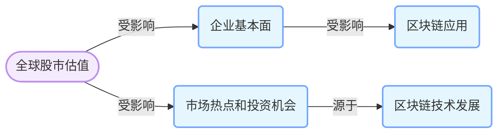

# 全球股市估值与区块链应用的关联

> 关键词：全球股市估值、区块链应用、关联机制、金融市场、技术创新

> 摘要：本文深入探讨全球股市估值与区块链应用之间的关联。随着区块链技术的兴起，其对金融市场包括全球股市产生了深远影响。文章将从背景介绍出发，阐述相关核心概念及联系，剖析核心算法原理与操作步骤，借助数学模型和公式进行理论分析，并通过项目实战案例展示具体应用，探讨实际应用场景，推荐学习资源、开发工具框架及相关论文著作，最后总结未来发展趋势与挑战，解答常见问题，提供参考资料，旨在全面揭示两者之间的内在联系，为投资者和研究者提供有益的参考。

## 1. 背景介绍 
### 1.1 目的和范围
本研究的目的在于深入探究全球股市估值与区块链应用之间的复杂关联。全球股市作为经济的重要组成部分，其估值受到多种因素的影响。而区块链技术作为一种新兴的技术力量，正逐渐渗透到金融领域。本研究将涵盖全球主要股票市场的估值情况，以及区块链技术在金融、企业管理等多个相关领域的应用，分析两者之间相互作用的机制和影响程度。

### 1.2 预期读者
本文预期读者包括金融市场的投资者，他们可以通过了解两者关联，更好地把握投资机会和风险；金融领域的研究人员，有助于他们深入研究市场动态和技术创新对金融市场的影响；区块链技术开发者，可从中获取区块链技术在金融市场应用的需求和方向；以及对金融和区块链技术感兴趣的普通读者，帮助他们拓宽知识面和视野。

### 1.3 文档结构概述
本文首先介绍研究的背景，包括目的、预期读者和文档结构概述等内容。接着阐述全球股市估值和区块链应用的核心概念及它们之间的联系，通过文本示意图和 Mermaid 流程图进行直观展示。然后剖析核心算法原理和具体操作步骤，结合 Python 源代码进行详细说明。再借助数学模型和公式深入讲解两者关联的理论基础，并举例说明。通过项目实战案例，展示代码实现和详细解释。探讨实际应用场景，推荐相关学习资源、开发工具框架和论文著作。最后总结未来发展趋势与挑战，解答常见问题并提供参考资料。

### 1.4 术语表
#### 1.4.1 核心术语定义
- **全球股市估值**：指对全球范围内各个股票市场中上市公司股票价值的评估，通常通过各种估值方法，如市盈率、市净率等，来确定股票的合理价格区间，反映市场对公司未来盈利和发展的预期。
- **区块链**：是一种分布式账本技术，通过去中心化、不可篡改、共识机制等特性，实现数据的安全存储和可信传输，确保交易的透明性和公正性。
- **智能合约**：是区块链上的一种自动执行的合约，由代码编写，当满足预设条件时自动执行相应的操作，无需第三方干预。

#### 1.4.2 相关概念解释
- **分布式账本**：是一种在多个节点之间共享、复制和同步的数据库，每个节点都有完整的数据副本，保证数据的一致性和可靠性。
- **共识机制**：是区块链网络中节点达成一致的算法，用于确保所有节点对交易的确认和账本的更新达成共识，常见的共识机制有工作量证明（PoW）、权益证明（PoS）等。

#### 1.4.3 缩略词列表
- **PoW**：Proof of Work，工作量证明
- **PoS**：Proof of Stake，权益证明
- **ICO**：Initial Coin Offering，首次代币发行

## 2. 核心概念与联系 

### 全球股市估值的原理
全球股市估值是基于对上市公司基本面的分析，包括公司的财务状况、盈利能力、市场竞争力等因素。常见的估值方法有绝对估值法和相对估值法。绝对估值法如现金流折现法（DCF），通过预测公司未来的现金流，并将其折现到当前时刻，来确定公司的内在价值。相对估值法如市盈率（P/E）、市净率（P/B）等，通过与同行业其他公司进行比较，来评估公司的估值水平。

### 区块链应用的原理
区块链技术基于分布式账本和共识机制，实现数据的安全存储和可信传输。区块链网络由多个节点组成，每个节点都有完整的账本副本。当有新的交易发生时，节点通过共识机制对交易进行验证和确认，并将其记录在区块链上。智能合约则是区块链上的自动化合约，通过代码实现合约的自动执行，提高交易效率和透明度。

### 两者的联系
区块链应用可以通过多种方式影响全球股市估值。一方面，区块链技术的应用可以提高企业的运营效率和透明度，增强市场对企业的信心，从而提升企业的估值。例如，区块链技术可以实现供应链的追溯和管理，提高供应链的效率和可靠性，降低企业的成本。另一方面，区块链技术的发展也可能带来新的投资机会和市场热点，影响股市的整体估值。例如，区块链相关企业的上市可能吸引更多投资者的关注，推动相关股票价格的上涨。

### 文本示意图
全球股市估值与区块链应用的联系可以用以下文本示意图表示：

全球股市估值 <-- 企业基本面变化 <-- 区块链应用（提高运营效率、透明度等）
全球股市估值 <-- 市场热点和投资机会 <-- 区块链技术发展

### Mermaid 流程图


## 3. 核心算法原理 & 具体操作步骤 

### 全球股市估值算法原理
以现金流折现法（DCF）为例，其基本原理是将公司未来的现金流折现到当前时刻，以确定公司的内在价值。具体步骤如下：
1. **预测未来现金流**：根据公司的历史财务数据和市场前景，预测公司未来若干年的自由现金流。
2. **确定折现率**：折现率反映了投资者对投资风险的预期，通常采用加权平均资本成本（WACC）作为折现率。
3. **计算现值**：将预测的未来现金流按照折现率折现到当前时刻，得到公司的内在价值。

以下是用 Python 实现现金流折现法的示例代码：
```python
import numpy as np

def dcf_valuation(cash_flows, discount_rate):
    """
    现金流折现法计算公司内在价值
    :param cash_flows: 未来现金流列表
    :param discount_rate: 折现率
    :return: 公司内在价值
    """
    present_values = []
    for i, cash_flow in enumerate(cash_flows):
        present_value = cash_flow / (1 + discount_rate) ** (i + 1)
        present_values.append(present_value)
    return np.sum(present_values)

# 示例数据
cash_flows = [100, 120, 150, 180, 200]
discount_rate = 0.1

# 计算内在价值
intrinsic_value = dcf_valuation(cash_flows, discount_rate)
print(f"公司内在价值: {intrinsic_value}")
```

### 区块链共识机制算法原理
以工作量证明（PoW）为例，其基本原理是通过节点竞争解决复杂的数学难题，第一个解决难题的节点将获得记账权，并将新的交易记录添加到区块链上。具体步骤如下：
1. **节点接收交易**：节点接收网络中的新交易，并将其打包成一个区块。
2. **竞争记账权**：节点通过不断尝试不同的随机数，计算区块的哈希值，直到找到一个满足特定条件的哈希值。
3. **广播区块**：当节点找到满足条件的哈希值后，将该区块广播到网络中，其他节点验证该区块的有效性。
4. **更新账本**：如果其他节点验证通过，将该区块添加到区块链上，并更新自己的账本。

以下是一个简化的 PoW 算法的 Python 示例代码：
```python
import hashlib
import time

class Block:
    def __init__(self, index, previous_hash, transactions):
        self.index = index
        self.previous_hash = previous_hash
        self.transactions = transactions
        self.timestamp = time.time()
        self.nonce = 0
        self.hash = self.calculate_hash()

    def calculate_hash(self):
        block_string = f"{self.index}{self.previous_hash}{self.transactions}{self.timestamp}{self.nonce}"
        return hashlib.sha256(block_string.encode()).hexdigest()

    def mine_block(self, difficulty):
        target = "0" * difficulty
        while self.hash[:difficulty] != target:
            self.nonce += 1
            self.hash = self.calculate_hash()
        print(f"Block mined: {self.hash}")

# 示例数据
transactions = ["Transaction 1", "Transaction 2", "Transaction 3"]
genesis_block = Block(0, "0", transactions)
genesis_block.mine_block(2)
```

## 4. 数学模型和公式 & 详细讲解 & 举例说明 

### 全球股市估值的数学模型和公式
#### 现金流折现法（DCF）
现金流折现法的基本公式为：
$$
V = \sum_{t=1}^{n} \frac{CF_t}{(1 + r)^t}
$$
其中，$V$ 表示公司的内在价值，$CF_t$ 表示第 $t$ 期的自由现金流，$r$ 表示折现率，$n$ 表示预测期数。

例如，假设某公司未来 5 年的自由现金流分别为 100 万元、120 万元、150 万元、180 万元和 200 万元，折现率为 10%。则该公司的内在价值为：
$$
\begin{align*}
V &= \frac{100}{(1 + 0.1)^1} + \frac{120}{(1 + 0.1)^2} + \frac{150}{(1 + 0.1)^3} + \frac{180}{(1 + 0.1)^4} + \frac{200}{(1 + 0.1)^5}\\
&= 90.91 + 99.17 + 112.70 + 122.94 + 124.18\\
&= 549.90 \text{（万元）}
\end{align*}
$$

#### 市盈率法（P/E）
市盈率法的基本公式为：
$$
P = EPS \times P/E
$$
其中，$P$ 表示股票价格，$EPS$ 表示每股收益，$P/E$ 表示市盈率。

例如，某公司的每股收益为 2 元，同行业平均市盈率为 15 倍。则该公司的股票价格为：
$$
P = 2 \times 15 = 30 \text{（元）}
$$

### 区块链共识机制的数学模型和公式
#### 工作量证明（PoW）
工作量证明的核心是通过计算哈希值来竞争记账权。哈希函数 $H$ 是一个单向函数，将输入数据 $x$ 映射到一个固定长度的哈希值 $y$：
$$
y = H(x)
$$
在 PoW 中，节点需要找到一个随机数 $n$，使得区块的哈希值 $H(block + n)$ 满足特定的条件，例如哈希值的前 $d$ 位为 0。这个条件可以表示为：
$$
H(block + n) < target
$$
其中，$block$ 表示区块的内容，$target$ 表示目标值，$d$ 表示难度系数。

例如，假设难度系数 $d = 2$，则目标值 $target$ 可以表示为一个哈希值，其前 2 位为 0。节点需要不断尝试不同的随机数 $n$，直到找到一个满足条件的哈希值。

## 5. 项目实战：代码实际案例和详细解释说明 

### 5.1  开发环境搭建
#### 全球股市估值项目
- **编程语言**：Python 3.x
- **开发环境**：Anaconda 或 PyCharm
- **相关库**：pandas、numpy、matplotlib 等

#### 区块链应用项目
- **编程语言**：Python 3.x
- **开发环境**：Anaconda 或 PyCharm
- **相关库**：hashlib、time 等

### 5.2  源代码详细实现和代码解读
#### 全球股市估值项目
以下是一个简单的全球股市估值项目的 Python 代码示例，使用市盈率法对股票进行估值：
```python
import pandas as pd

# 读取股票数据
stock_data = pd.read_csv('stock_data.csv')

# 计算每股收益
stock_data['EPS'] = stock_data['Net Income'] / stock_data['Shares Outstanding']

# 假设同行业平均市盈率为 15 倍
pe_ratio = 15

# 计算股票价格
stock_data['Stock Price'] = stock_data['EPS'] * pe_ratio

# 输出结果
print(stock_data[['Stock Symbol', 'Stock Price']])
```
代码解读：
1. **读取股票数据**：使用 `pandas` 库的 `read_csv` 函数读取股票数据文件。
2. **计算每股收益**：根据公司的净利润和流通股数计算每股收益。
3. **设定市盈率**：假设同行业平均市盈率为 15 倍。
4. **计算股票价格**：根据每股收益和市盈率计算股票价格。
5. **输出结果**：输出股票代码和股票价格。

#### 区块链应用项目
以下是一个简单的区块链应用项目的 Python 代码示例，实现一个简单的区块链：
```python
import hashlib
import time

class Block:
    def __init__(self, index, previous_hash, transactions):
        self.index = index
        self.previous_hash = previous_hash
        self.transactions = transactions
        self.timestamp = time.time()
        self.nonce = 0
        self.hash = self.calculate_hash()

    def calculate_hash(self):
        block_string = f"{self.index}{self.previous_hash}{self.transactions}{self.timestamp}{self.nonce}"
        return hashlib.sha256(block_string.encode()).hexdigest()

    def mine_block(self, difficulty):
        target = "0" * difficulty
        while self.hash[:difficulty] != target:
            self.nonce += 1
            self.hash = self.calculate_hash()
        print(f"Block mined: {self.hash}")

class Blockchain:
    def __init__(self):
        self.chain = [self.create_genesis_block()]
        self.difficulty = 2

    def create_genesis_block(self):
        return Block(0, "0", ["Genesis Transaction"])

    def get_latest_block(self):
        return self.chain[-1]

    def add_block(self, new_block):
        new_block.previous_hash = self.get_latest_block().hash
        new_block.mine_block(self.difficulty)
        self.chain.append(new_block)

# 创建区块链实例
blockchain = Blockchain()

# 添加新的区块
block1 = Block(1, "", ["Transaction 1", "Transaction 2"])
blockchain.add_block(block1)

block2 = Block(2, "", ["Transaction 3", "Transaction 4"])
blockchain.add_block(block2)
```
代码解读：
1. **定义区块类**：`Block` 类表示区块链中的一个区块，包含区块的索引、前一个区块的哈希值、交易记录、时间戳、随机数和当前区块的哈希值。
2. **计算哈希值**：`calculate_hash` 方法用于计算区块的哈希值。
3. **挖矿**：`mine_block` 方法用于挖矿，通过不断尝试不同的随机数，直到找到一个满足难度要求的哈希值。
4. **定义区块链类**：`Blockchain` 类表示整个区块链，包含区块链的链和难度系数。
5. **创建创世区块**：`create_genesis_block` 方法用于创建区块链的第一个区块。
6. **添加新的区块**：`add_block` 方法用于向区块链中添加新的区块。

### 5.3  代码解读与分析
#### 全球股市估值项目
- **数据来源**：股票数据通常来自金融数据提供商，如 Bloomberg、Yahoo Finance 等。在实际应用中，需要确保数据的准确性和及时性。
- **估值方法的局限性**：市盈率法是一种相对简单的估值方法，没有考虑公司的未来增长潜力和风险因素。在实际应用中，需要结合其他估值方法进行综合评估。

#### 区块链应用项目
- **共识机制的实现**：本示例中使用的是工作量证明（PoW）共识机制，这种机制通过计算哈希值来竞争记账权，保证了区块链的安全性和去中心化。
- **性能问题**：PoW 共识机制需要大量的计算资源和时间，导致区块链的性能较低。在实际应用中，需要考虑使用其他共识机制，如权益证明（PoS）、委托权益证明（DPoS）等。

## 6. 实际应用场景 
### 金融市场
- **股票发行与交易**：区块链技术可以实现股票的数字化发行和交易，提高交易效率和透明度，降低交易成本。例如，通过智能合约实现股票的自动交割和结算，减少中间环节，提高交易的安全性和可靠性。
- **风险管理**：区块链技术可以实现金融数据的共享和透明，帮助金融机构更好地进行风险管理。例如，通过区块链记录企业的信用信息和交易历史，金融机构可以更准确地评估企业的信用风险，降低贷款违约率。

### 企业管理
- **供应链管理**：区块链技术可以实现供应链的追溯和管理，提高供应链的效率和可靠性。例如，通过区块链记录产品的生产、运输和销售过程，消费者可以更清楚地了解产品的来源和质量，企业可以更好地管理供应链中的各个环节，降低成本和风险。
- **企业治理**：区块链技术可以实现企业治理的透明和公正，提高企业的管理效率和公信力。例如，通过区块链记录企业的股东信息、投票记录和决策过程，保证企业治理的公开、公平和公正。

### 政府监管
- **金融监管**：区块链技术可以实现金融监管的实时和有效，提高监管效率和准确性。例如，通过区块链记录金融交易的全过程，监管机构可以更及时地发现和防范金融风险，打击金融犯罪。
- **税收管理**：区块链技术可以实现税收管理的透明和公正，提高税收征管效率和准确性。例如，通过区块链记录企业的财务信息和交易记录，税务部门可以更准确地计算企业的应纳税额，减少税收漏洞。

## 7. 工具和资源推荐
### 7.1 学习资源推荐
#### 7.1.1 书籍推荐
- 《区块链：技术驱动金融》：本书由阿尔文德·纳拉亚南等著，全面介绍了区块链技术的原理、应用和发展趋势，是学习区块链技术的经典教材。
- 《金融市场与金融机构基础》：本书由弗兰克·J·法博齐等著，系统介绍了金融市场和金融机构的基本知识，对于理解全球股市估值和金融市场运行机制有很大帮助。

#### 7.1.2 在线课程
- Coursera 上的“区块链基础”课程：由普林斯顿大学教授讲授，全面介绍了区块链技术的基本原理和应用。
- edX 上的“金融市场”课程：由麻省理工学院教授讲授，系统介绍了金融市场的基本知识和运行机制。

#### 7.1.3 技术博客和网站
- 巴比特（https://www.8btc.com/）：国内领先的区块链资讯平台，提供区块链技术、行业动态、项目分析等方面的信息。
- 雪球（https://xueqiu.com/）：国内知名的财经社区，提供股票、基金、债券等金融产品的资讯和分析。

### 7.2 开发工具框架推荐
#### 7.2.1 IDE和编辑器
- PyCharm：一款专业的 Python 集成开发环境，提供代码编辑、调试、版本控制等功能，适合开发全球股市估值和区块链应用项目。
- Visual Studio Code：一款轻量级的代码编辑器，支持多种编程语言和插件，适合快速开发和调试代码。

#### 7.2.2 调试和性能分析工具
- PySnooper：一个简单易用的 Python 调试工具，可以自动记录函数的执行过程和变量的值，方便调试代码。
- cProfile：Python 内置的性能分析工具，可以分析代码的执行时间和调用关系，帮助优化代码性能。

#### 7.2.3 相关框架和库
- web3.py：一个 Python 库，用于与以太坊区块链进行交互，方便开发区块链应用。
- pandas：一个 Python 库，用于数据处理和分析，适合处理全球股市估值相关的数据。

### 7.3 相关论文著作推荐
#### 7.3.1 经典论文
- “Bitcoin: A Peer-to-Peer Electronic Cash System”：比特币的白皮书，由中本聪撰写，介绍了比特币的基本原理和实现方法，是区块链技术的奠基之作。
- “The Efficient Market Hypothesis and Its Critics”：有效市场假说的经典论文，由尤金·法玛撰写，探讨了金融市场的效率和有效性。

#### 7.3.2 最新研究成果
- 国际金融研究机构发布的关于区块链技术在金融市场应用的研究报告，及时了解区块链技术的最新发展和应用情况。
- 顶尖学术期刊上发表的关于全球股市估值和区块链技术的研究论文，掌握学术前沿动态。

#### 7.3.3 应用案例分析
- 国内外知名企业应用区块链技术的案例分析，如 IBM、微软等公司在供应链管理、金融服务等领域的区块链应用案例，学习实际应用经验。
- 金融机构应用区块链技术进行风险管理、证券交易等方面的案例分析，了解区块链技术在金融领域的具体应用和效果。

## 8. 总结：未来发展趋势与挑战
### 未来发展趋势
- **融合发展**：全球股市估值与区块链应用将进一步融合发展。区块链技术将为全球股市提供更加高效、透明、安全的交易环境，提高股市的运行效率和公信力。同时，全球股市的发展也将为区块链技术提供更广阔的应用场景和市场需求。
- **创新应用**：随着区块链技术的不断发展和创新，将出现更多的创新应用。例如，基于区块链的数字资产交易平台、智能投顾服务、供应链金融等应用将不断涌现，为金融市场和实体经济带来新的活力和机遇。
- **国际化合作**：全球股市和区块链技术都是全球性的领域，未来将加强国际化合作。各国政府和金融机构将加强在区块链技术标准制定、监管政策协调等方面的合作，推动全球股市和区块链技术的健康发展。

### 挑战
- **技术难题**：区块链技术目前还存在一些技术难题，如性能瓶颈、隐私保护、安全漏洞等。这些技术难题需要进一步研究和解决，才能实现区块链技术的大规模应用。
- **监管政策**：区块链技术的发展对传统的金融监管政策提出了挑战。如何制定合理的监管政策，既保护投资者的合法权益，又促进区块链技术的创新和发展，是当前面临的一个重要问题。
- **市场风险**：区块链技术的发展也带来了一些市场风险，如虚拟货币的价格波动、ICO 项目的欺诈风险等。投资者需要加强风险意识，谨慎投资。

## 9. 附录：常见问题与解答
### 全球股市估值相关问题
- **问**：全球股市估值的方法有哪些？
**答**：常见的全球股市估值方法有绝对估值法和相对估值法。绝对估值法如现金流折现法（DCF），相对估值法如市盈率（P/E）、市净率（P/B）等。

- **问**：如何选择合适的估值方法？
**答**：选择合适的估值方法需要考虑公司的行业特点、发展阶段、财务状况等因素。一般来说，对于成熟的公司可以使用相对估值法，对于成长型公司可以使用绝对估值法。

### 区块链应用相关问题
- **问**：区块链技术的安全性如何保障？
**答**：区块链技术通过分布式账本、加密算法、共识机制等多种技术手段保障其安全性。分布式账本保证了数据的一致性和可靠性，加密算法保证了数据的隐私性和完整性，共识机制保证了节点之间的一致性和公正性。

- **问**：区块链技术的应用场景有哪些？
**答**：区块链技术的应用场景非常广泛，包括金融、供应链管理、企业治理、政府监管等领域。例如，在金融领域可以实现数字货币、智能合约、跨境支付等应用；在供应链管理领域可以实现产品追溯、物流跟踪等应用。

## 10. 扩展阅读 & 参考资料
### 扩展阅读
- 《数字经济时代的金融科技与创新》
- 《区块链革命：比特币背后的技术如何改变货币、商业和世界》

### 参考资料
- 国际货币基金组织（IMF）发布的相关报告
- 世界银行发布的相关报告
- 各证券交易所发布的统计数据和研究报告
- 区块链技术相关的开源代码库和技术文档