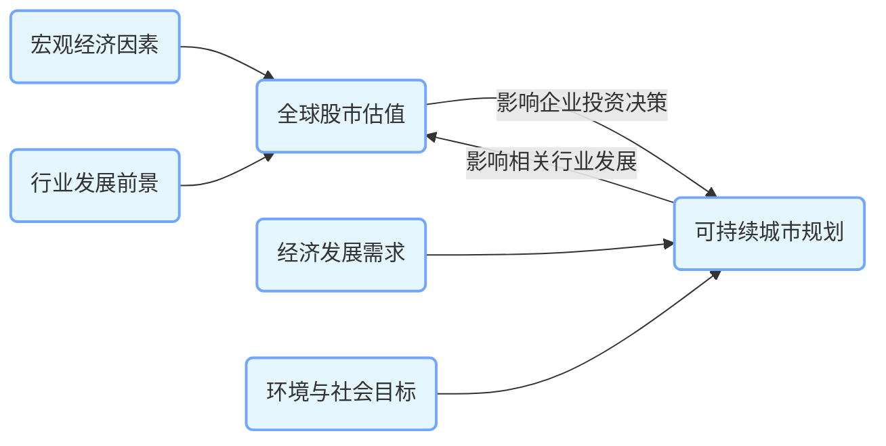

# 全球股市估值与可持续城市规划的关联

> 关键词：全球股市估值、可持续城市规划、经济发展、环境影响、社会效应、投资策略、城市发展模式

> 摘要：本文旨在深入探讨全球股市估值与可持续城市规划之间的关联。通过对两者核心概念、算法原理、数学模型等多方面的分析，揭示它们在经济、环境和社会层面的相互影响。结合项目实战案例，阐述如何在实际中发现和利用这种关联。同时介绍相关的工具和资源，为进一步研究和实践提供参考。最后总结未来发展趋势与挑战，帮助读者全面理解这一复杂而又重要的课题。

## 1. 背景介绍 
### 1.1 目的和范围
本研究的目的是全面剖析全球股市估值与可持续城市规划之间的内在联系。全球股市估值反映了全球范围内上市公司的市场价值，是经济形势的重要指标；而可持续城市规划则关注城市的长期发展，涉及经济、环境和社会的协调共进。本研究将涵盖全球不同地区的股市情况以及各类城市的可持续发展规划，通过多维度的分析，探寻两者之间的互动机制和潜在影响。

### 1.2 预期读者
本文预期读者包括金融领域的投资者、分析师，城市规划领域的专业人士，政策制定者以及对经济和城市发展感兴趣的学者和研究人员。投资者可以从本文中获取关于投资决策的新视角，城市规划者可以了解经济因素对城市规划的影响，政策制定者可以依据研究结果制定更合理的政策，学者和研究人员则可以在本研究的基础上进行更深入的探讨。

### 1.3 文档结构概述
本文首先介绍背景信息，包括目的、预期读者和文档结构。接着阐述核心概念与联系，通过文本示意图和 Mermaid 流程图展示两者的关系。然后详细讲解核心算法原理和具体操作步骤，用 Python 代码进行示例。再介绍数学模型和公式，并举例说明。之后通过项目实战案例，介绍开发环境搭建、源代码实现和代码解读。随后探讨实际应用场景，推荐相关的工具和资源。最后总结未来发展趋势与挑战，解答常见问题并提供扩展阅读和参考资料。

### 1.4 术语表
#### 1.4.1 核心术语定义
- **全球股市估值**：指全球范围内所有上市公司的股票市场价值总和，通过对股票价格和股本数量的计算得出，反映了市场对上市公司未来盈利能力的预期。
- **可持续城市规划**：是一种综合考虑经济、环境和社会因素的城市发展规划方法，旨在实现城市的长期、健康、可持续发展，满足当代人的需求，同时不损害后代人满足其需求的能力。

#### 1.4.2 相关概念解释
- **经济外部性**：指一个经济主体的经济活动对其他经济主体所产生的影响，可能是正外部性（如创新带来的技术扩散），也可能是负外部性（如污染对环境的破坏）。在股市估值和城市规划中，经济外部性都可能产生重要影响。
- **绿色经济**：是以市场为导向、以传统产业经济为基础、以经济与环境的和谐为目的而发展起来的一种新的经济形式，是产业经济为适应人类环保与健康需要而产生并表现出来的一种发展状态。可持续城市规划通常与绿色经济的发展密切相关。

#### 1.4.3 缩略词列表
- **GDP**：国内生产总值（Gross Domestic Product），是衡量一个国家或地区经济活动总量的重要指标。
- **ESG**：环境、社会和公司治理（Environmental, Social and Governance），是一种关注企业可持续发展的投资理念和评价标准。

## 2. 核心概念与联系 

### 核心概念原理
全球股市估值是由多种因素共同作用的结果。从宏观经济层面来看，GDP 增长率、通货膨胀率、利率等因素会影响整个股市的表现。例如，当 GDP 增长率较高时，企业的盈利能力通常也会增强，从而推动股票价格上涨，提高股市估值。从行业层面来看，不同行业的发展前景、竞争格局等因素会导致各行业股票的估值差异。例如，新兴的科技行业由于具有较高的增长潜力，其股票估值往往相对较高。

可持续城市规划则基于可持续发展的理念，强调经济、环境和社会的协调发展。在经济方面，要实现产业的多元化和升级，提高城市的经济竞争力；在环境方面，要注重资源的节约和环境保护，减少污染和生态破坏；在社会方面，要保障居民的基本权益，提高居民的生活质量，促进社会公平与和谐。

### 架构的文本示意图
全球股市估值与可持续城市规划之间存在着复杂的相互关系。一方面，可持续城市规划的实施会对股市估值产生影响。例如，城市的绿色发展规划会促进环保产业的发展，相关企业的股票估值可能会上升；城市的基础设施建设规划会带动建筑、建材等行业的发展，这些行业的股票也可能受益。另一方面，股市估值的变化也会影响可持续城市规划的实施。如果股市表现良好，企业的融资能力增强，可能会加大对可持续发展项目的投资，从而推动城市规划的实施；反之，如果股市低迷，企业的资金紧张，可能会减少对可持续发展项目的投入。

### Mermaid 流程图


## 3. 核心算法原理 & 具体操作步骤 

### 核心算法原理
为了分析全球股市估值与可持续城市规划之间的关联，我们可以采用回归分析的方法。回归分析是一种统计方法，用于研究自变量与因变量之间的关系。在本研究中，我们可以将可持续城市规划的相关指标（如绿色产业占比、环境质量指数等）作为自变量，将全球股市中相关行业的股票估值作为因变量，建立回归模型，通过分析回归系数来确定两者之间的关系。

### 具体操作步骤及 Python 源代码
以下是一个简单的 Python 示例，演示如何使用回归分析来研究全球股市估值与可持续城市规划之间的关联。假设我们已经收集了某城市的绿色产业占比数据和该城市相关环保企业的股票估值数据。

```python
import numpy as np
import pandas as pd
from sklearn.linear_model import LinearRegression
import matplotlib.pyplot as plt

# 生成示例数据
# 绿色产业占比数据
green_industry_ratio = np.array([0.1, 0.2, 0.3, 0.4, 0.5, 0.6, 0.7, 0.8, 0.9, 1.0])
# 相关环保企业股票估值数据
stock_valuation = np.array([100, 120, 140, 160, 180, 200, 220, 240, 260, 280])

# 将数据转换为 DataFrame 格式
data = pd.DataFrame({'green_industry_ratio': green_industry_ratio, 'stock_valuation': stock_valuation})

# 划分自变量和因变量
X = data[['green_industry_ratio']]
y = data['stock_valuation']

# 创建线性回归模型
model = LinearRegression()

# 拟合模型
model.fit(X, y)

# 输出回归系数和截距
print('回归系数:', model.coef_[0])
print('截距:', model.intercept_)

# 预测
new_green_industry_ratio = np.array([1.1]).reshape(-1, 1)
predicted_stock_valuation = model.predict(new_green_industry_ratio)
print('预测的股票估值:', predicted_stock_valuation[0])

# 绘制散点图和回归直线
plt.scatter(X, y, color='blue')
plt.plot(X, model.predict(X), color='red', linewidth=2)
plt.xlabel('绿色产业占比')
plt.ylabel('股票估值')
plt.title('绿色产业占比与股票估值的关系')
plt.show()
```

### 代码解释
1. **数据生成**：使用 `numpy` 数组生成绿色产业占比数据和相关环保企业股票估值数据。
2. **数据转换**：将数据转换为 `pandas` 的 `DataFrame` 格式，方便后续处理。
3. **划分自变量和因变量**：将绿色产业占比数据作为自变量 `X`，股票估值数据作为因变量 `y`。
4. **创建线性回归模型**：使用 `sklearn` 库中的 `LinearRegression` 类创建线性回归模型。
5. **拟合模型**：使用 `fit` 方法拟合模型，得到回归系数和截距。
6. **预测**：使用训练好的模型对新的绿色产业占比数据进行预测。
7. **绘制图形**：使用 `matplotlib` 库绘制散点图和回归直线，直观展示两者之间的关系。

## 4. 数学模型和公式 & 详细讲解 & 举例说明 

### 数学模型和公式
在回归分析中，我们使用的线性回归模型的数学公式为：

$$y = \beta_0 + \beta_1x + \epsilon$$

其中，$y$ 是因变量（股票估值），$x$ 是自变量（绿色产业占比），$\beta_0$ 是截距，$\beta_1$ 是回归系数，$\epsilon$ 是误差项，表示模型无法解释的随机因素。

回归系数 $\beta_1$ 的计算公式为：

$$\beta_1 = \frac{\sum_{i=1}^{n}(x_i - \bar{x})(y_i - \bar{y})}{\sum_{i=1}^{n}(x_i - \bar{x})^2}$$

截距 $\beta_0$ 的计算公式为：

$$\beta_0 = \bar{y} - \beta_1\bar{x}$$

其中，$n$ 是样本数量，$\bar{x}$ 和 $\bar{y}$ 分别是自变量和因变量的均值。

### 详细讲解
回归系数 $\beta_1$ 表示自变量 $x$ 每增加一个单位，因变量 $y$ 的平均变化量。如果 $\beta_1$ 为正数，说明自变量和因变量之间存在正相关关系，即绿色产业占比增加，股票估值也会增加；如果 $\beta_1$ 为负数，说明两者之间存在负相关关系。

截距 $\beta_0$ 表示当自变量 $x$ 为 0 时，因变量 $y$ 的取值。在实际应用中，截距的意义需要根据具体情况进行解释。

误差项 $\epsilon$ 反映了模型的不确定性。由于实际情况中存在很多无法控制的因素，因此模型无法完全准确地预测因变量的值，误差项就是这些无法解释的因素的综合体现。

### 举例说明
假设我们通过回归分析得到回归系数 $\beta_1 = 200$，截距 $\beta_0 = 80$。这意味着绿色产业占比每增加 1%，相关环保企业的股票估值平均会增加 200 个单位；当绿色产业占比为 0 时，股票估值为 80 个单位。

如果某城市的绿色产业占比为 0.3，我们可以使用回归模型预测该城市相关环保企业的股票估值：

$$y = 80 + 200 \times 0.3 = 140$$

即预测的股票估值为 140 个单位。

## 5. 项目实战：代码实际案例和详细解释说明 

### 5.1  开发环境搭建
为了运行上述 Python 代码，我们需要搭建相应的开发环境。以下是具体步骤：

1. **安装 Python**：从 Python 官方网站（https://www.python.org/downloads/）下载并安装 Python 3.x 版本。
2. **安装必要的库**：使用 `pip` 命令安装 `numpy`、`pandas`、`sklearn` 和 `matplotlib` 库。打开命令行窗口，输入以下命令：

```sh
pip install numpy pandas scikit-learn matplotlib
```

3. **选择开发工具**：可以选择使用 PyCharm、Jupyter Notebook 等开发工具。这里以 Jupyter Notebook 为例，安装方法如下：

```sh
pip install jupyter notebook
```

安装完成后，在命令行窗口中输入 `jupyter notebook` 启动 Jupyter Notebook，然后在浏览器中打开相应的页面，创建一个新的 Python 笔记本，即可开始编写和运行代码。

### 5.2  源代码详细实现和代码解读
以下是一个更完整的项目实战案例，假设我们要分析多个城市的绿色产业占比与相关环保企业股票估值之间的关系。

```python
import numpy as np
import pandas as pd
from sklearn.linear_model import LinearRegression
import matplotlib.pyplot as plt

# 读取数据
data = pd.read_csv('city_data.csv')

# 划分自变量和因变量
X = data[['green_industry_ratio']]
y = data['stock_valuation']

# 创建线性回归模型
model = LinearRegression()

# 拟合模型
model.fit(X, y)

# 输出回归系数和截距
print('回归系数:', model.coef_[0])
print('截距:', model.intercept_)

# 预测
new_green_industry_ratio = np.array([0.35]).reshape(-1, 1)
predicted_stock_valuation = model.predict(new_green_industry_ratio)
print('预测的股票估值:', predicted_stock_valuation[0])

# 绘制散点图和回归直线
plt.scatter(X, y, color='blue')
plt.plot(X, model.predict(X), color='red', linewidth=2)
plt.xlabel('绿色产业占比')
plt.ylabel('股票估值')
plt.title('绿色产业占比与股票估值的关系')
plt.show()
```

### 代码解读
1. **数据读取**：使用 `pandas` 的 `read_csv` 函数读取存储在 `city_data.csv` 文件中的数据。该文件应包含两列数据，分别是绿色产业占比和相关环保企业的股票估值。
2. **划分自变量和因变量**：将绿色产业占比数据作为自变量 `X`，股票估值数据作为因变量 `y`。
3. **创建线性回归模型**：使用 `sklearn` 库中的 `LinearRegression` 类创建线性回归模型。
4. **拟合模型**：使用 `fit` 方法拟合模型，得到回归系数和截距。
5. **预测**：使用训练好的模型对新的绿色产业占比数据进行预测。
6. **绘制图形**：使用 `matplotlib` 库绘制散点图和回归直线，直观展示两者之间的关系。

### 5.3  代码解读与分析
通过上述代码，我们可以得到绿色产业占比与相关环保企业股票估值之间的线性关系。回归系数和截距反映了这种关系的具体特征。如果回归系数为正，说明绿色产业占比的增加会导致股票估值的上升，这可能意味着可持续城市规划中绿色产业的发展对股市估值有积极的影响。

同时，我们可以通过绘制散点图和回归直线，直观地观察数据的分布和线性关系的拟合程度。如果数据点大致分布在回归直线附近，说明线性回归模型能够较好地拟合数据；如果数据点偏离回归直线较远，可能需要考虑使用更复杂的模型或者检查数据是否存在异常值。

## 6. 实际应用场景 
### 投资决策
投资者可以根据可持续城市规划的发展趋势，调整自己的投资组合。例如，如果某个城市正在大力推进绿色城市建设，加大对环保产业的投入，那么相关环保企业的股票可能具有较大的投资潜力。投资者可以通过分析该城市的绿色产业占比、政策支持力度等因素，结合回归分析等方法，预测相关企业的股票估值变化，从而做出更明智的投资决策。

### 城市规划制定
城市规划者可以参考股市估值的变化来优化城市规划方案。如果某一行业的股票估值持续上升，说明该行业具有较强的发展活力和市场竞争力，城市规划者可以考虑加大对该行业的支持力度，如提供更多的土地资源、完善相关的基础设施等，以促进该行业的进一步发展。同时，城市规划者也可以通过分析股市估值与不同产业的关系，调整城市的产业结构，实现经济的可持续发展。

### 政策制定
政策制定者可以根据全球股市估值与可持续城市规划之间的关联，制定更加合理的政策。例如，如果发现股市估值与绿色产业的发展密切相关，政策制定者可以出台更多的优惠政策，鼓励企业投资绿色产业，推动可持续城市规划的实施。同时，政策制定者也可以通过调控股市，引导资金流向有利于可持续城市发展的领域。

## 7. 工具和资源推荐
### 7.1 学习资源推荐
#### 7.1.1 书籍推荐
- 《金融市场学》：全面介绍了金融市场的基本概念、运行机制和分析方法，对于理解全球股市估值具有重要的参考价值。
- 《可持续城市发展规划》：系统阐述了可持续城市规划的理论、方法和实践案例，有助于深入了解可持续城市规划的相关知识。
- 《计量经济学》：介绍了计量经济学的基本原理和方法，包括回归分析等，对于进行数据分析和模型建立非常有帮助。

#### 7.1.2 在线课程
- Coursera 平台上的“金融市场分析”课程：由知名高校的教授授课，讲解了金融市场的分析方法和工具，适合对金融市场感兴趣的学习者。
- edX 平台上的“可持续城市发展”课程：介绍了可持续城市发展的理念、策略和实践，帮助学习者了解可持续城市规划的最新动态。
- 中国大学 MOOC 上的“计量经济学基础”课程：系统讲解了计量经济学的基本理论和方法，通过实际案例进行分析和应用，有助于提高学习者的数据分析能力。

#### 7.1.3 技术博客和网站
- 雪球网：是一个投资者社区，提供了丰富的股市资讯和分析文章，对于了解全球股市动态和投资策略非常有帮助。
- 世界银行官网：发布了大量关于可持续发展和城市规划的研究报告和数据，是获取相关信息的重要来源。
- 中国城市规划网：提供了城市规划领域的最新政策、技术和案例，对于城市规划者和研究者具有重要的参考价值。

### 7.2 开发工具框架推荐
#### 7.2.1 IDE和编辑器
- PyCharm：是一款专业的 Python 集成开发环境，具有强大的代码编辑、调试和分析功能，适合开发和运行 Python 代码。
- Jupyter Notebook：是一个交互式的开发环境，支持多种编程语言，方便进行数据探索、分析和可视化，非常适合进行数据分析和机器学习项目。

#### 7.2.2 调试和性能分析工具
- `pdb`：是 Python 自带的调试工具，可以帮助开发者在代码运行过程中进行调试，查找和解决问题。
- `cProfile`：是 Python 的性能分析工具，可以分析代码的运行时间和函数调用情况，帮助开发者优化代码性能。

#### 7.2.3 相关框架和库
- `numpy`：是 Python 中用于科学计算的基础库，提供了高效的数组操作和数学函数，对于数据分析和模型建立非常有用。
- `pandas`：是 Python 中用于数据处理和分析的库，提供了数据结构和数据操作方法，方便进行数据清洗、转换和分析。
- `scikit-learn`：是 Python 中用于机器学习的库，提供了丰富的机器学习算法和工具，包括回归分析、分类、聚类等，适合进行数据分析和模型建立。

### 7.3 相关论文著作推荐
#### 7.3.1 经典论文
- “The Impact of Sustainable Development on Stock Market Valuation”：研究了可持续发展对股市估值的影响，通过实证分析揭示了两者之间的关系。
- “Sustainable Urban Planning: A Review of Theories and Practices”：对可持续城市规划的理论和实践进行了全面的综述，为进一步研究提供了重要的参考。

#### 7.3.2 最新研究成果
- 关注《Journal of Financial Economics》、《Urban Studies》等学术期刊，这些期刊经常发表关于金融市场和城市规划的最新研究成果。

#### 7.3.3 应用案例分析
- 可以参考一些国际知名城市的可持续城市规划案例，如新加坡的花园城市建设、哥本哈根的低碳城市发展等，了解这些城市在实践中如何实现经济、环境和社会的协调发展，以及对股市估值的影响。

## 8. 总结：未来发展趋势与挑战
### 未来发展趋势
- **深度融合**：全球股市估值与可持续城市规划将更加紧密地融合在一起。随着可持续发展理念的深入人心，投资者将更加关注企业的可持续发展能力，股市估值也将更多地反映企业在环境、社会和公司治理方面的表现。同时，城市规划者也将更加注重利用金融市场的力量来推动可持续城市的建设，如通过发行绿色债券等方式筹集资金。
- **技术驱动**：大数据、人工智能等技术将在分析全球股市估值与可持续城市规划之间的关联中发挥越来越重要的作用。通过对海量数据的分析和挖掘，可以更准确地把握两者之间的关系，为投资决策、城市规划和政策制定提供更科学的依据。
- **国际合作加强**：全球范围内的可持续城市发展需要各国的共同努力，因此国际合作将不断加强。各国之间将分享可持续城市规划的经验和技术，协调金融政策，共同推动全球股市估值与可持续城市规划的良性互动。

### 挑战
- **数据获取和质量**：要准确分析全球股市估值与可持续城市规划之间的关联，需要大量高质量的数据。然而，目前相关数据的获取存在一定的困难，数据的准确性和完整性也有待提高。
- **复杂的影响因素**：全球股市估值和可持续城市规划都受到多种因素的影响，这些因素之间相互作用、相互影响，使得两者之间的关系非常复杂。如何准确地分离和分析这些因素的影响，是一个挑战。
- **政策协调**：不同国家和地区的金融政策和城市规划政策存在差异，如何协调这些政策，促进全球股市估值与可持续城市规划的协调发展，是一个需要解决的问题。

## 9. 附录：常见问题与解答
### 问题 1：回归分析是否能够完全准确地反映全球股市估值与可持续城市规划之间的关系？
解答：回归分析只是一种统计方法，它可以帮助我们发现两者之间的大致关系，但不能完全准确地反映它们之间的关系。因为实际情况中存在很多无法控制的因素，这些因素可能会影响回归模型的准确性。此外，回归分析假设自变量和因变量之间存在线性关系，但实际情况可能并非如此。因此，在使用回归分析结果时，需要结合其他方法和实际情况进行综合判断。

### 问题 2：如何选择合适的自变量和因变量来分析全球股市估值与可持续城市规划之间的关联？
解答：选择自变量和因变量需要根据研究目的和实际情况进行。一般来说，自变量应该是与可持续城市规划相关的指标，如绿色产业占比、环境质量指数、基础设施建设水平等；因变量可以是全球股市中相关行业的股票估值。在选择自变量和因变量时，需要考虑它们之间的逻辑关系和数据的可获取性。

### 问题 3：在实际应用中，如何利用全球股市估值与可持续城市规划之间的关联来做出决策？
解答：在投资决策中，可以根据可持续城市规划的发展趋势，选择具有投资潜力的行业和企业。例如，如果某个城市正在大力推进绿色城市建设，相关环保企业的股票可能具有较大的投资价值。在城市规划制定中，可以参考股市估值的变化，调整城市的产业结构和发展策略。在政策制定中，可以根据两者之间的关联，出台相应的政策，引导资金流向有利于可持续城市发展的领域。

## 10. 扩展阅读 & 参考资料
### 扩展阅读
- 《金融炼金术》：乔治·索罗斯的著作，探讨了金融市场的运行机制和投资者的心理，对于理解全球股市估值具有一定的启发作用。
- 《明日之城》：介绍了城市规划的历史和未来发展趋势，有助于拓宽对可持续城市规划的认识。

### 参考资料
- 相关学术期刊和研究报告，如《Journal of Financial Economics》、《Urban Studies》等。
- 国际组织和政府机构发布的统计数据和政策文件，如世界银行、联合国等。
- 相关的专业书籍和教材，如《金融市场学》、《可持续城市发展规划》等。