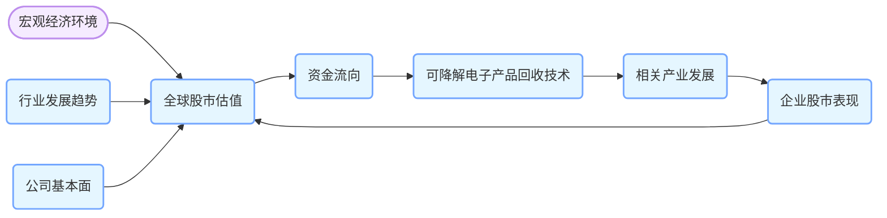

# 全球股市估值与可降解电子产品回收技术的关联

> 关键词：全球股市估值、可降解电子产品、回收技术、市场趋势、产业发展、经济影响、技术创新

> 摘要：本文旨在深入探讨全球股市估值与可降解电子产品回收技术之间的关联。通过对背景的介绍，明确研究的目的、范围和预期读者。详细阐述核心概念及联系，分析核心算法原理和具体操作步骤，引入数学模型和公式进行理论支撑，并通过项目实战案例加深理解。同时，探讨该关联在实际应用场景中的体现，推荐相关的工具和资源，最后总结未来发展趋势与挑战，解答常见问题并提供扩展阅读和参考资料。希望能为投资者、技术开发者和相关研究人员提供全面且有价值的参考。

## 1. 背景介绍 
### 1.1 目的和范围
本研究的主要目的是揭示全球股市估值与可降解电子产品回收技术之间的潜在联系。全球股市作为经济的重要风向标，其估值受到众多因素的影响，包括宏观经济环境、行业发展趋势等。而可降解电子产品回收技术作为新兴的环保技术领域，正逐渐影响着相关产业的发展。通过研究两者之间的关联，有助于投资者更好地把握市场趋势，企业能够更准确地制定发展战略，政策制定者也能依据相关结论制定合理的政策。

研究范围涵盖全球主要股票市场，包括但不限于美国、欧洲、亚洲等地区的股市。同时，对可降解电子产品回收技术的研究涉及技术原理、发展现状、应用前景等多个方面。

### 1.2 预期读者
本文预期读者包括金融投资者，他们可以通过了解两者的关联，优化投资组合，寻找具有潜力的投资机会；电子产业从业者，有助于他们把握行业发展趋势，调整企业发展战略；环保技术研究人员，为其技术研发提供市场需求和经济层面的参考；政策制定者，为制定相关产业政策和环保政策提供依据。

### 1.3 文档结构概述
本文首先介绍研究的背景，包括目的、范围、预期读者和文档结构概述，同时给出相关术语表。接着阐述核心概念与联系，用文本示意图和 Mermaid 流程图展示其架构。然后详细讲解核心算法原理和具体操作步骤，结合 Python 源代码进行说明。引入数学模型和公式，并举例说明。通过项目实战案例，包括开发环境搭建、源代码实现和代码解读，深入分析两者的关联。探讨实际应用场景，推荐相关的工具和资源，最后总结未来发展趋势与挑战，解答常见问题并提供扩展阅读和参考资料。

### 1.4 术语表
#### 1.4.1 核心术语定义
- **全球股市估值**：指对全球范围内各个股票市场中上市公司股票价值的综合评估，通常通过各种估值方法，如市盈率、市净率等，来衡量股票的相对价值。
- **可降解电子产品**：是指在一定条件下能够自然分解或通过特定处理方式快速降解的电子产品，旨在减少电子垃圾对环境的污染。
- **回收技术**：针对可降解电子产品，将其废弃部分进行收集、处理和再利用的一系列技术手段。

#### 1.4.2 相关概念解释
- **股市趋势**：指股票市场在一段时间内的总体走势，包括上升趋势、下降趋势和盘整趋势。
- **技术创新周期**：可降解电子产品回收技术从研发、应用到成熟的整个过程所经历的时间周期。
- **产业生态系统**：由可降解电子产品的生产、销售、回收等相关企业和机构组成的相互依存、相互作用的生态系统。

#### 1.4.3 缩略词列表
- **PE**：市盈率（Price - Earnings Ratio）
- **PB**：市净率（Price - Book Ratio）
- **R & D**：研究与开发（Research and Development）

## 2. 核心概念与联系 
### 核心概念原理
全球股市估值反映了市场对上市公司未来盈利能力和发展前景的预期。其受到宏观经济因素（如 GDP 增长、通货膨胀率等）、行业竞争格局、公司财务状况等多种因素的影响。

可降解电子产品回收技术的原理基于材料科学和环境科学。通过研究可降解材料的特性，开发出能够有效分解和回收这些材料的技术。例如，利用生物降解材料制造电子产品，在其废弃后，通过微生物的作用使其自然分解，再通过物理或化学方法提取其中的有用成分进行再利用。

### 架构的文本示意图
全球股市估值受到宏观经济环境、行业发展趋势、公司基本面等因素的影响。可降解电子产品回收技术的发展推动了相关产业的进步，包括可降解电子产品的生产企业、回收处理企业等。这些企业的发展状况会影响其在股市中的表现，进而影响全球股市估值。同时，股市的资金流向也会影响可降解电子产品回收技术的研发和产业化进程。

### Mermaid 流程图


## 3. 核心算法原理 & 具体操作步骤 
### 核心算法原理
为了分析全球股市估值与可降解电子产品回收技术之间的关联，我们可以采用多元线性回归模型。该模型可以通过建立股市估值指标（如市盈率）与可降解电子产品回收技术相关指标（如技术研发投入、回收利用率等）之间的线性关系，来量化两者之间的关联程度。

### 具体操作步骤
1. **数据收集**：收集全球主要股票市场的相关数据，包括股票价格、公司财务报表等，计算出市盈率、市净率等估值指标。同时，收集可降解电子产品回收技术的相关数据，如研发投入金额、回收利用率、技术专利数量等。
2. **数据预处理**：对收集到的数据进行清洗，去除缺失值和异常值。对数据进行标准化处理，使不同指标的数据具有可比性。
3. **模型建立**：使用 Python 的`scikit - learn`库建立多元线性回归模型。假设股市估值指标为 $y$，可降解电子产品回收技术相关指标为 $x_1, x_2, \cdots, x_n$，则多元线性回归模型的表达式为：
$y = \beta_0+\beta_1x_1+\beta_2x_2+\cdots+\beta_nx_n+\epsilon$
其中，$\beta_0$ 为截距项，$\beta_1, \beta_2, \cdots, \beta_n$ 为回归系数，$\epsilon$ 为误差项。

### Python 源代码实现
```python
import numpy as np
from sklearn.linear_model import LinearRegression
from sklearn.preprocessing import StandardScaler
from sklearn.model_selection import train_test_split

# 示例数据
# 假设 X 是可降解电子产品回收技术相关指标矩阵，y 是股市估值指标向量
X = np.array([[10, 20, 30], [15, 25, 35], [20, 30, 40], [25, 35, 45]])
y = np.array([100, 120, 140, 160])

# 数据标准化处理
scaler = StandardScaler()
X_scaled = scaler.fit_transform(X)

# 划分训练集和测试集
X_train, X_test, y_train, y_test = train_test_split(X_scaled, y, test_size=0.2, random_state=42)

# 建立多元线性回归模型
model = LinearRegression()
model.fit(X_train, y_train)

# 预测
y_pred = model.predict(X_test)

# 输出回归系数和截距
print("回归系数:", model.coef_)
print("截距:", model.intercept_)
```

## 4. 数学模型和公式 & 详细讲解 & 举例说明 
### 数学模型和公式
在上述多元线性回归模型中，我们使用最小二乘法来估计回归系数 $\beta_0, \beta_1, \cdots, \beta_n$。最小二乘法的目标是使误差项 $\epsilon$ 的平方和最小，即：
$$
\min_{\beta_0,\beta_1,\cdots,\beta_n}\sum_{i = 1}^{m}(y_i - (\beta_0+\beta_1x_{i1}+\beta_2x_{i2}+\cdots+\beta_nx_{in}))^2
$$
其中，$m$ 为样本数量，$y_i$ 为第 $i$ 个样本的股市估值指标值，$x_{ij}$ 为第 $i$ 个样本的第 $j$ 个可降解电子产品回收技术相关指标值。

### 详细讲解
最小二乘法的原理是通过对误差项平方和求偏导数，并令其等于 0，得到一组正规方程组。解这个正规方程组就可以得到回归系数的估计值。

### 举例说明
假设我们有以下数据：
| 研发投入（万元）$x_1$ | 回收利用率（%）$x_2$ | 市盈率 $y$ |
|---|---|---|
| 10 | 20 | 100 |
| 15 | 25 | 120 |
| 20 | 30 | 140 |
| 25 | 35 | 160 |

我们将这些数据代入上述多元线性回归模型中，通过最小二乘法求解回归系数。假设求解得到的回归系数为 $\beta_0 = 20$，$\beta_1 = 3$，$\beta_2 = 2$，则回归方程为：
$y = 20 + 3x_1+2x_2$

如果我们已知一个新的样本，其研发投入为 30 万元，回收利用率为 40%，则可以预测其市盈率为：
$y = 20 + 3\times30+2\times40 = 20 + 90 + 80 = 190$

## 5. 项目实战：代码实际案例和详细解释说明 
### 5.1  开发环境搭建
1. **安装 Python**：建议使用 Python 3.7 及以上版本。可以从 Python 官方网站（https://www.python.org/downloads/）下载并安装。
2. **安装必要的库**：使用`pip`命令安装`numpy`、`pandas`、`scikit - learn`等库。
```sh
pip install numpy pandas scikit-learn
```
3. **选择开发工具**：可以使用 PyCharm、Jupyter Notebook 等开发工具。

### 5.2  源代码详细实现和代码解读
```python
import numpy as np
import pandas as pd
from sklearn.linear_model import LinearRegression
from sklearn.preprocessing import StandardScaler
from sklearn.model_selection import train_test_split

# 读取数据
data = pd.read_csv('stock_valuation_and_recycling_data.csv')

# 提取特征和目标变量
X = data[['R&D_Investment', 'Recycling_Rate']].values
y = data['PE_Ratio'].values

# 数据标准化处理
scaler = StandardScaler()
X_scaled = scaler.fit_transform(X)

# 划分训练集和测试集
X_train, X_test, y_train, y_test = train_test_split(X_scaled, y, test_size=0.2, random_state=42)

# 建立多元线性回归模型
model = LinearRegression()
model.fit(X_train, y_train)

# 预测
y_pred = model.predict(X_test)

# 计算均方误差
from sklearn.metrics import mean_squared_error
mse = mean_squared_error(y_test, y_pred)
print("均方误差:", mse)

# 输出回归系数和截距
print("回归系数:", model.coef_)
print("截距:", model.intercept_)
```
### 代码解读与分析
1. **数据读取**：使用`pandas`库的`read_csv`函数读取存储在 CSV 文件中的数据。
2. **特征提取**：从数据中提取可降解电子产品回收技术相关指标（研发投入和回收利用率）作为特征变量 $X$，提取市盈率作为目标变量 $y$。
3. **数据标准化**：使用`StandardScaler`对特征变量进行标准化处理，使不同特征具有相同的尺度。
4. **划分训练集和测试集**：使用`train_test_split`函数将数据划分为训练集和测试集，测试集占比为 20%。
5. **模型训练**：使用`LinearRegression`建立多元线性回归模型，并使用训练集数据进行训练。
6. **预测和评估**：使用训练好的模型对测试集数据进行预测，并计算均方误差来评估模型的性能。
7. **输出结果**：输出回归系数和截距，回归系数表示每个特征变量对目标变量的影响程度。

## 6. 实际应用场景 
### 投资决策
投资者可以通过关注可降解电子产品回收技术的发展趋势，预测相关企业的未来盈利能力，从而调整投资组合。例如，如果某家可降解电子产品生产企业在回收技术方面取得重大突破，其市场竞争力可能增强，股票估值有望上升，投资者可以考虑增加对该企业股票的投资。

### 企业战略制定
电子企业可以根据可降解电子产品回收技术的发展和股市估值的变化，制定合理的发展战略。如果股市对可降解电子产品相关企业的估值较高，企业可以加大研发投入，扩大生产规模，提高市场份额。

### 政策制定
政府可以根据两者的关联制定相关政策。例如，为了推动可降解电子产品回收技术的发展，可以出台税收优惠政策，鼓励企业加大研发投入。同时，通过政策引导资金流向相关产业，促进产业的发展，进而影响股市估值。

## 7. 工具和资源推荐
### 7.1 学习资源推荐
#### 7.1.1 书籍推荐
- 《金融市场学》：全面介绍金融市场的基本概念、运行机制和投资策略，有助于读者了解全球股市的基本原理。
- 《材料科学与工程基础》：介绍材料科学的基本理论和方法，对于理解可降解电子产品的材料特性和回收技术有很大帮助。
- 《机器学习》：详细讲解机器学习的算法原理和应用，对于理解多元线性回归等数据分析方法有重要作用。

#### 7.1.2 在线课程
- Coursera 上的“Financial Markets”课程：由知名教授授课，深入讲解金融市场的各个方面。
- edX 上的“Materials Science: An Introduction”课程：系统介绍材料科学的基础知识。
- 吴恩达的“Machine Learning”课程：经典的机器学习课程，适合初学者入门。

#### 7.1.3 技术博客和网站
- 金融界（https://www.jrj.com.cn/）：提供丰富的金融资讯和股市分析。
- 材料人网（https://www.cailiaoren.com/）：专注于材料科学领域的技术交流和资讯分享。
- Medium 上的机器学习相关博客：有很多关于数据分析和机器学习算法的优质文章。

### 7.2 开发工具框架推荐
#### 7.2.1 IDE和编辑器
- PyCharm：功能强大的 Python 集成开发环境，适合大规模项目开发。
- Jupyter Notebook：交互式的开发环境，方便进行数据探索和模型调试。

#### 7.2.2 调试和性能分析工具
- `pdb`：Python 内置的调试工具，可用于调试 Python 代码。
- `scikit - learn`中的`cross_val_score`函数：可用于评估机器学习模型的性能。

#### 7.2.3 相关框架和库
- `pandas`：用于数据处理和分析的 Python 库，提供了丰富的数据结构和数据操作方法。
- `numpy`：Python 的数值计算库，支持高效的数组操作。
- `scikit - learn`：机器学习库，提供了多种机器学习算法和工具。

### 7.3 相关论文著作推荐
#### 7.3.1 经典论文
- “The Efficient Market Hypothesis and Its Critics”：探讨了有效市场假说及其争议，对于理解股市估值有重要意义。
- “Biodegradable Polymers for Electronics”：介绍了可降解聚合物在电子领域的应用和发展。

#### 7.3.2 最新研究成果
- 关注《Nature》《Science》等顶级学术期刊上关于可降解电子产品回收技术和金融市场的最新研究成果。

#### 7.3.3 应用案例分析
- 一些行业报告和研究机构发布的关于可降解电子产品企业的案例分析，有助于了解实际应用中的情况。

## 8. 总结：未来发展趋势与挑战
### 未来发展趋势
1. **技术创新加速**：随着科技的不断进步，可降解电子产品回收技术将不断创新，回收效率和回收率将不断提高，这将推动相关产业的快速发展，进而影响股市估值。
2. **市场需求增长**：环保意识的不断提高将促使消费者对可降解电子产品的需求增加，相关企业的市场份额将扩大，股市对这些企业的估值也将上升。
3. **产业融合加深**：可降解电子产品回收技术将与其他产业，如新能源、人工智能等深度融合，创造出更多的商业机会，进一步影响股市估值。

### 挑战
1. **技术难题**：可降解电子产品回收技术仍面临一些技术难题，如材料的降解速度、回收过程中的环境污染等，需要进一步的研发和创新。
2. **成本压力**：目前可降解电子产品的生产成本较高，回收技术的应用成本也较大，这将影响企业的盈利能力和市场竞争力，进而对股市估值产生负面影响。
3. **政策法规不完善**：相关的政策法规还不够完善，缺乏统一的标准和规范，这将影响可降解电子产品回收技术的推广和应用，以及产业的健康发展。

## 9. 附录：常见问题与解答
### 问题 1：如何准确衡量可降解电子产品回收技术对股市估值的影响？
解答：可以通过建立多元线性回归模型等数据分析方法，结合相关指标（如研发投入、回收利用率等）来量化两者之间的关联程度。同时，还需要考虑其他因素的影响，如宏观经济环境、行业竞争格局等。

### 问题 2：可降解电子产品回收技术的发展需要哪些条件？
解答：需要技术研发的支持，包括材料科学、化学工程等领域的创新。还需要政策的引导和支持，如税收优惠、补贴等。此外，市场需求的增长和消费者环保意识的提高也是重要条件。

### 问题 3：股市估值的变化对可降解电子产品回收技术的发展有何影响？
解答：如果股市对可降解电子产品相关企业的估值较高，企业可以获得更多的资金支持，从而加大研发投入，推动技术的发展。反之，如果估值较低，企业的融资难度增加，可能会影响技术的研发和产业化进程。

## 10. 扩展阅读 & 参考资料
### 扩展阅读
- 《循环经济与可持续发展》：深入探讨循环经济的理论和实践，对于理解可降解电子产品回收技术的发展具有重要意义。
- 《金融科技创新》：介绍金融领域的创新趋势，有助于了解金融市场与新兴技术的融合。

### 参考资料
- 国际金融组织发布的相关报告和统计数据。
- 可降解电子产品回收技术领域的研究论文和专利文献。
- 各大股票交易所发布的股市数据和分析报告。