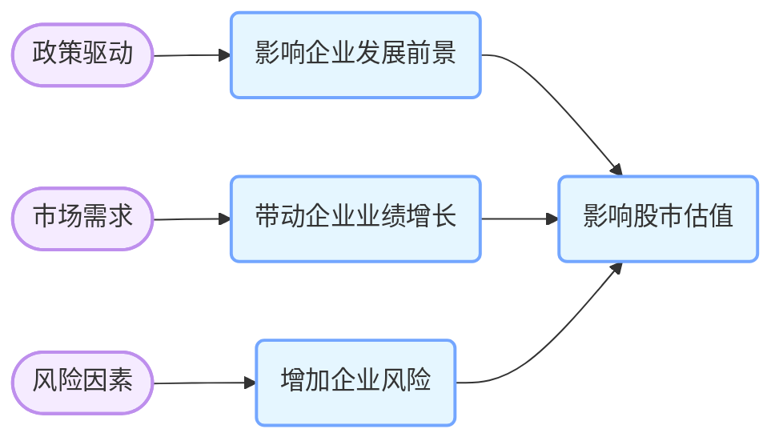

# 全球股市估值与海洋碳汇监测技术的关系

> 关键词：全球股市估值、海洋碳汇监测技术、环境经济、可持续发展、市场趋势、气候变化、生态价值

> 摘要：本文旨在深入探讨全球股市估值与海洋碳汇监测技术之间的内在联系。随着全球对环境问题的关注度不断提升，海洋碳汇作为重要的生态资源，其监测技术的发展不仅影响着生态环境，也对经济领域特别是股市产生了深远的影响。文章将从背景介绍入手，阐述相关概念和联系，分析核心算法原理及数学模型，通过项目实战案例进行详细说明，探讨实际应用场景，推荐相关工具和资源，最后总结未来发展趋势与挑战，并对常见问题进行解答，为理解这一跨领域的关系提供全面而深入的视角。

## 1. 背景介绍 
### 1.1 目的和范围
本研究的主要目的是揭示全球股市估值与海洋碳汇监测技术之间的复杂关系。随着气候变化问题日益严峻，海洋碳汇作为地球生态系统的重要组成部分，其价值逐渐受到重视。同时，股市作为经济的重要风向标，也在不断反映着各种经济和环境因素的变化。本研究的范围涵盖了全球股市的主要板块，以及海洋碳汇监测技术的各个方面，包括技术原理、发展现状和未来趋势等。通过对两者关系的研究，旨在为投资者、政策制定者和科研人员提供有价值的参考，促进经济与环境的协调发展。

### 1.2 预期读者
本文预期读者包括金融领域的投资者、分析师、基金经理等，他们可以通过了解海洋碳汇监测技术对股市的影响，优化投资策略；环境科学领域的科研人员和政策制定者，有助于他们认识到海洋碳汇监测技术在经济层面的重要性，从而更好地制定相关政策和开展研究；以及对跨领域研究感兴趣的广大读者，希望通过本文能够拓宽视野，了解不同领域之间的相互作用。

### 1.3 文档结构概述
本文首先介绍研究的背景，包括目的、预期读者和文档结构概述，以及相关术语的定义和解释。接着阐述全球股市估值和海洋碳汇监测技术的核心概念及其联系，并通过文本示意图和 Mermaid 流程图进行直观展示。然后详细讲解核心算法原理和具体操作步骤，同时给出数学模型和公式，并举例说明。通过项目实战案例，展示代码实现和详细解释。探讨实际应用场景，推荐相关的学习资源、开发工具框架和论文著作。最后总结未来发展趋势与挑战，解答常见问题，并提供扩展阅读和参考资料。

### 1.4 术语表
#### 1.4.1 核心术语定义
- **全球股市估值**：指对全球范围内各个股票市场中上市公司的股票价值进行评估和衡量的过程和结果。它反映了市场对公司未来盈利能力、资产价值和发展前景的预期。
- **海洋碳汇**：是指海洋生物通过光合作用等过程吸收并固定大气中的二氧化碳，从而减少大气中二氧化碳浓度的过程、活动和机制。海洋是地球上最大的碳汇，对调节全球气候起着至关重要的作用。
- **海洋碳汇监测技术**：是指用于测量、评估和监测海洋碳汇过程、数量和变化的一系列技术手段和方法，包括卫星遥感、海洋观测站、浮标等。

#### 1.4.2 相关概念解释
- **环境经济**：是研究经济发展与环境保护之间相互关系的学科，旨在实现经济增长与环境可持续性的平衡。
- **可持续发展**：是指既满足当代人的需求，又不损害后代人满足其需求的能力的发展模式。在经济、社会和环境三个维度上实现协调发展。
- **生态价值**：是指生态系统所提供的各种服务和功能的价值，包括物质生产、调节气候、保持水土等。

#### 1.4.3 缩略词列表
- **GDP**：国内生产总值（Gross Domestic Product）
- **CO₂**：二氧化碳（Carbon Dioxide）
- **GIS**：地理信息系统（Geographic Information System）

## 2. 核心概念与联系 
### 2.1 全球股市估值的原理和架构
全球股市估值是一个复杂的过程，涉及多个因素和方法。其基本原理是基于公司的财务状况、行业前景、宏观经济环境等因素，对公司的股票价值进行评估。常见的估值方法包括市盈率法、市净率法、现金流折现法等。

全球股市估值的架构可以分为以下几个层次：
- **宏观经济层面**：包括 GDP 增长率、通货膨胀率、利率等宏观经济指标，这些指标影响着整个股市的走势和估值水平。
- **行业层面**：不同行业的发展前景和盈利能力不同，会导致行业内公司的估值存在差异。例如，新兴的科技行业通常具有较高的估值倍数，而传统的制造业估值相对较低。
- **公司层面**：公司的财务报表、管理层能力、市场竞争力等因素直接影响公司的估值。例如，一家具有高增长率和良好盈利能力的公司，其股票估值通常会较高。

以下是全球股市估值的文本示意图：

```plaintext
全球股市估值
|-- 宏观经济层面
|   |-- GDP 增长率
|   |-- 通货膨胀率
|   |-- 利率
|-- 行业层面
|   |-- 行业发展前景
|   |-- 行业盈利能力
|-- 公司层面
|   |-- 财务报表
|   |-- 管理层能力
|   |-- 市场竞争力
```

### 2.2 海洋碳汇监测技术的原理和架构
海洋碳汇监测技术主要基于物理、化学和生物等多学科原理，通过各种观测设备和方法，获取海洋碳汇相关的数据和信息。其架构可以分为以下几个部分：
- **数据采集层**：包括卫星遥感、海洋观测站、浮标等设备，用于收集海洋碳汇的相关数据，如海洋表面温度、叶绿素浓度、二氧化碳分压等。
- **数据传输层**：将采集到的数据通过卫星通信、无线通信等方式传输到数据处理中心。
- **数据处理层**：对传输过来的数据进行处理和分析，包括数据清洗、质量控制、模型计算等，以获取海洋碳汇的数量、分布和变化等信息。
- **信息应用层**：将处理后的信息应用于气候变化研究、海洋资源管理、碳交易等领域。

以下是海洋碳汇监测技术的文本示意图：

```plaintext
海洋碳汇监测技术
|-- 数据采集层
|   |-- 卫星遥感
|   |-- 海洋观测站
|   |-- 浮标
|-- 数据传输层
|   |-- 卫星通信
|   |-- 无线通信
|-- 数据处理层
|   |-- 数据清洗
|   |-- 质量控制
|   |-- 模型计算
|-- 信息应用层
|   |-- 气候变化研究
|   |-- 海洋资源管理
|   |-- 碳交易
```

### 2.3 全球股市估值与海洋碳汇监测技术的联系
全球股市估值与海洋碳汇监测技术之间存在着多方面的联系：
- **政策驱动**：随着全球对气候变化问题的重视，各国政府纷纷出台相关政策，鼓励和支持海洋碳汇的保护和监测。这些政策会影响相关企业的发展前景和盈利能力，从而对股市估值产生影响。例如，政府对海洋碳汇监测技术研发企业的补贴和税收优惠，会提高这些企业的竞争力和市场价值，进而影响其股票估值。
- **市场需求**：消费者对环保产品和服务的需求不断增加，促使企业加大对海洋碳汇相关技术和产业的投入。这会带动相关企业的业绩增长，从而影响股市估值。例如，随着碳交易市场的发展，对海洋碳汇监测技术的需求也会增加，相关企业的市场前景会更加广阔，股票估值也会相应提高。
- **风险因素**：海洋环境的变化和不确定性会给相关企业带来风险，从而影响股市估值。例如，海洋污染、气候变化等因素可能会影响海洋碳汇的功能和稳定性，进而影响相关企业的生产和经营。这些风险因素会被投资者纳入考虑范围，从而影响股票的估值。

以下是全球股市估值与海洋碳汇监测技术联系的 Mermaid 流程图：



## 3. 核心算法原理 & 具体操作步骤 
### 3.1 全球股市估值的核心算法原理
全球股市估值的核心算法主要基于现金流折现法（DCF）。现金流折现法的基本原理是将公司未来的现金流按照一定的折现率折现到当前，从而得到公司的内在价值。其公式为：

$$V = \sum_{t=1}^{n} \frac{CF_t}{(1 + r)^t}$$

其中，$V$ 表示公司的内在价值，$CF_t$ 表示第 $t$ 期的现金流，$r$ 表示折现率，$n$ 表示预测期数。

### 3.2 全球股市估值的具体操作步骤
以下是使用 Python 实现现金流折现法进行全球股市估值的具体操作步骤：

```python
# 定义现金流列表
cash_flows = [100, 120, 140, 160, 180]
# 定义折现率
discount_rate = 0.1
# 初始化内在价值为 0
intrinsic_value = 0

# 计算内在价值
for t in range(len(cash_flows)):
    intrinsic_value += cash_flows[t] / (1 + discount_rate) ** (t + 1)

print("公司的内在价值为:", intrinsic_value)
```

### 3.3 海洋碳汇监测技术的核心算法原理
海洋碳汇监测技术的核心算法主要基于卫星遥感数据的反演算法。卫星遥感数据反演算法的基本原理是通过对卫星传感器获取的辐射数据进行处理和分析，反演得到海洋碳汇相关的参数，如叶绿素浓度、二氧化碳分压等。常用的反演算法包括经验算法、半经验算法和物理算法等。

### 3.4 海洋碳汇监测技术的具体操作步骤
以下是一个简单的基于经验算法的海洋叶绿素浓度反演的 Python 示例：

```python
# 定义卫星遥感数据（例如反射率）
reflectance = [0.1, 0.2, 0.3, 0.4]
# 定义经验算法的系数
coefficients = [0.5, 0.3, 0.2, 0.1]
# 初始化叶绿素浓度为 0
chlorophyll_concentration = 0

# 计算叶绿素浓度
for i in range(len(reflectance)):
    chlorophyll_concentration += reflectance[i] * coefficients[i]

print("海洋叶绿素浓度为:", chlorophyll_concentration)
```

## 4. 数学模型和公式 & 详细讲解 & 举例说明 
### 4.1 全球股市估值的数学模型和公式
除了现金流折现法，全球股市估值还可以使用市盈率法（P/E）和市净率法（P/B）等。

#### 4.1.1 市盈率法
市盈率法的公式为：

$$P = E \times P/E$$

其中，$P$ 表示股票价格，$E$ 表示每股收益，$P/E$ 表示市盈率。

例如，某公司的每股收益为 2 元，行业平均市盈率为 20 倍，则该公司的股票价格为：

$$P = 2 \times 20 = 40 \text{ 元}$$

#### 4.1.2 市净率法
市净率法的公式为：

$$P = B \times P/B$$

其中，$P$ 表示股票价格，$B$ 表示每股净资产，$P/B$ 表示市净率。

例如，某公司的每股净资产为 5 元，行业平均市净率为 3 倍，则该公司的股票价格为：

$$P = 5 \times 3 = 15 \text{ 元}$$

### 4.2 海洋碳汇监测技术的数学模型和公式
海洋碳汇监测技术中常用的数学模型包括海洋生态系统模型和碳循环模型等。

#### 4.2.1 海洋生态系统模型
海洋生态系统模型可以描述海洋中生物和物理过程的相互作用，从而模拟海洋碳汇的动态变化。一个简单的海洋生态系统模型可以表示为：

$$\frac{dN}{dt} = I - E - U$$

其中，$N$ 表示营养盐浓度，$t$ 表示时间，$I$ 表示营养盐输入，$E$ 表示营养盐输出，$U$ 表示生物对营养盐的吸收。

#### 4.2.2 碳循环模型
碳循环模型可以描述海洋中碳的来源、传输和储存过程，从而估算海洋碳汇的数量。一个简单的碳循环模型可以表示为：

$$\frac{dC}{dt} = F_{atm-ocean} + F_{rivers} - F_{sedimentation}$$

其中，$C$ 表示海洋中的碳含量，$t$ 表示时间，$F_{atm-ocean}$ 表示大气与海洋之间的碳通量，$F_{rivers}$ 表示河流输入的碳通量，$F_{sedimentation}$ 表示海洋沉积物中的碳通量。

## 5. 项目实战：代码实际案例和详细解释说明 
### 5.1  开发环境搭建
为了实现全球股市估值和海洋碳汇监测技术的相关代码，我们需要搭建以下开发环境：
- **Python 环境**：建议使用 Python 3.7 及以上版本。可以从 Python 官方网站（https://www.python.org/downloads/）下载并安装。
- **开发工具**：推荐使用 PyCharm 或 Jupyter Notebook 作为开发工具。PyCharm 是一款功能强大的 Python 集成开发环境，Jupyter Notebook 则适合进行交互式编程和数据分析。
- **相关库**：需要安装以下 Python 库：
    - `pandas`：用于数据处理和分析。
    - `numpy`：用于数值计算。
    - `matplotlib`：用于数据可视化。

可以使用以下命令安装这些库：

```sh
pip install pandas numpy matplotlib
```

### 5.2  源代码详细实现和代码解读
#### 5.2.1 全球股市估值代码实现
以下是一个使用 Python 实现全球股市估值的完整代码示例：

```python
import pandas as pd
import numpy as np
import matplotlib.pyplot as plt

# 定义公司的财务数据
data = {
    '年份': [2018, 2019, 2020, 2021, 2022],
    '每股收益': [1.0, 1.2, 1.4, 1.6, 1.8],
    '每股净资产': [5.0, 5.5, 6.0, 6.5, 7.0]
}

# 创建 DataFrame
df = pd.DataFrame(data)

# 计算市盈率和市净率
pe_ratio = df['每股收益'].mean() / df['每股收益'].std()
pb_ratio = df['每股净资产'].mean() / df['每股净资产'].std()

# 计算股票价格
stock_price_pe = df['每股收益'].iloc[-1] * pe_ratio
stock_price_pb = df['每股净资产'].iloc[-1] * pb_ratio

# 打印结果
print("基于市盈率法的股票价格:", stock_price_pe)
print("基于市净率法的股票价格:", stock_price_pb)

# 绘制每股收益和每股净资产的趋势图
plt.figure(figsize=(10, 6))
plt.plot(df['年份'], df['每股收益'], label='每股收益')
plt.plot(df['年份'], df['每股净资产'], label='每股净资产')
plt.xlabel('年份')
plt.ylabel('数值')
plt.title('每股收益和每股净资产趋势图')
plt.legend()
plt.show()
```

#### 5.2.2 代码解读
- **数据定义**：使用字典 `data` 定义公司的财务数据，包括年份、每股收益和每股净资产。
- **DataFrame 创建**：使用 `pandas` 库的 `DataFrame` 函数将字典数据转换为 DataFrame 对象，方便进行数据处理和分析。
- **市盈率和市净率计算**：使用 `mean()` 和 `std()` 函数计算每股收益和每股净资产的均值和标准差，然后计算市盈率和市净率。
- **股票价格计算**：使用最后一年的每股收益和每股净资产乘以相应的比率，得到基于市盈率法和市净率法的股票价格。
- **结果打印**：使用 `print()` 函数打印计算结果。
- **趋势图绘制**：使用 `matplotlib` 库的 `plot()` 函数绘制每股收益和每股净资产的趋势图，直观展示公司的财务状况。

#### 5.2.3 海洋碳汇监测技术代码实现
以下是一个使用 Python 实现海洋碳汇监测技术中简单的卫星遥感数据处理的代码示例：

```python
import numpy as np
import matplotlib.pyplot as plt

# 模拟卫星遥感数据
reflectance = np.random.rand(100, 100)

# 定义经验算法的系数
coefficients = np.array([0.5, 0.3, 0.2])

# 计算叶绿素浓度
chlorophyll_concentration = np.zeros((100, 100))
for i in range(100):
    for j in range(100):
        chlorophyll_concentration[i, j] = np.sum(reflectance[i, j] * coefficients)

# 绘制叶绿素浓度分布图
plt.figure(figsize=(10, 6))
plt.imshow(chlorophyll_concentration, cmap='viridis')
plt.colorbar()
plt.title('海洋叶绿素浓度分布图')
plt.show()
```

#### 5.2.4 代码解读
- **数据模拟**：使用 `numpy` 库的 `random.rand()` 函数模拟卫星遥感数据，生成一个 100x100 的随机矩阵。
- **系数定义**：使用 `numpy` 数组定义经验算法的系数。
- **叶绿素浓度计算**：使用双重循环遍历遥感数据矩阵，计算每个像素点的叶绿素浓度。
- **分布图绘制**：使用 `matplotlib` 库的 `imshow()` 函数绘制叶绿素浓度分布图，使用 `colorbar()` 函数添加颜色条，直观展示海洋叶绿素浓度的分布情况。

### 5.3  代码解读与分析
#### 5.3.1 全球股市估值代码分析
- **优点**：该代码使用了简单的市盈率法和市净率法进行股票估值，易于理解和实现。同时，使用 `pandas` 和 `matplotlib` 库进行数据处理和可视化，提高了代码的可读性和可维护性。
- **缺点**：该代码仅考虑了公司的历史财务数据，没有考虑宏观经济环境、行业前景等因素，可能导致估值结果不准确。此外，市盈率和市净率的计算方法较为简单，没有考虑到行业差异和市场波动。

#### 5.3.2 海洋碳汇监测技术代码分析
- **优点**：该代码使用了简单的经验算法进行海洋叶绿素浓度的反演，易于实现。同时，使用 `numpy` 和 `matplotlib` 库进行数据处理和可视化，提高了代码的效率和可读性。
- **缺点**：该代码仅使用了模拟的卫星遥感数据，没有考虑到实际数据的噪声和误差。此外，经验算法的系数是固定的，可能无法适应不同的海洋环境和遥感数据。

## 6. 实际应用场景 
### 6.1 金融投资领域
在金融投资领域，全球股市估值与海洋碳汇监测技术的关系具有重要的应用价值。投资者可以通过关注海洋碳汇监测技术的发展趋势和相关政策，选择具有潜力的环保企业进行投资。例如，随着海洋碳汇监测技术的不断进步，相关企业的市场前景会更加广阔，股票估值也会相应提高。投资者可以通过分析这些企业的财务状况和技术实力，做出合理的投资决策。

### 6.2 环境政策制定
在环境政策制定方面，海洋碳汇监测技术的发展可以为政策制定者提供科学依据。通过准确监测海洋碳汇的数量和变化，政策制定者可以制定更加有效的碳减排政策和海洋保护措施。例如，根据海洋碳汇监测数据，政策制定者可以确定合理的碳排放标准和海洋生态保护目标，促进经济与环境的协调发展。

### 6.3 气候变化研究
在气候变化研究领域，全球股市估值与海洋碳汇监测技术的关系也具有重要的意义。海洋碳汇是全球碳循环的重要组成部分，其变化对全球气候系统有着深远的影响。通过监测海洋碳汇的变化，研究人员可以更好地理解全球气候变化的机制和趋势。同时，股市估值的变化也可以反映出市场对气候变化的预期和反应，为气候变化研究提供经济层面的参考。

## 7. 工具和资源推荐
### 7.1 学习资源推荐
#### 7.1.1 书籍推荐
- 《金融市场学》：全面介绍了金融市场的基本原理、运行机制和投资策略，是学习金融投资的经典教材。
- 《海洋生态学》：系统阐述了海洋生态系统的结构、功能和动态变化，为了解海洋碳汇提供了理论基础。
- 《遥感图像处理与分析》：详细介绍了遥感数据的处理和分析方法，是学习海洋碳汇监测技术的重要参考书籍。

#### 7.1.2 在线课程
- Coursera 上的 “Financial Markets” 课程：由耶鲁大学教授 Robert Shiller 主讲，深入讲解了金融市场的理论和实践。
- edX 上的 “Oceanography: Exploring Earth's Final Frontier” 课程：由伍兹霍尔海洋研究所的专家授课，介绍了海洋科学的最新研究成果和技术。
- Udemy 上的 “Remote Sensing and GIS for Beginners” 课程：适合初学者学习遥感和地理信息系统的基本原理和操作方法。

#### 7.1.3 技术博客和网站
- 金融界（https://www.jrj.com.cn/）：提供全球股市的实时行情、财经新闻和投资分析等信息。
- 中国海洋信息网（http://www.coi.gov.cn/）：提供海洋科学研究、海洋资源管理和海洋环境保护等方面的信息。
- 遥感集市（https://www.rscloudmart.com/）：提供遥感数据产品、遥感图像处理软件和遥感应用解决方案等服务。

### 7.2 开发工具框架推荐
#### 7.2.1 IDE和编辑器
- PyCharm：一款功能强大的 Python 集成开发环境，提供代码编辑、调试、版本控制等功能。
- Jupyter Notebook：适合进行交互式编程和数据分析，支持多种编程语言和可视化工具。
- Visual Studio Code：一款轻量级的代码编辑器，支持多种编程语言和插件扩展。

#### 7.2.2 调试和性能分析工具
- PDB：Python 自带的调试工具，可以帮助开发者定位和解决代码中的问题。
- cProfile：Python 标准库中的性能分析工具，可以分析代码的运行时间和内存使用情况。
- Py-Spy：一款轻量级的 Python 性能分析工具，可以实时监测 Python 程序的性能。

#### 7.2.3 相关框架和库
- Pandas：用于数据处理和分析的 Python 库，提供了高效的数据结构和数据分析工具。
- Numpy：用于数值计算的 Python 库，提供了高效的数组和矩阵运算功能。
- Matplotlib：用于数据可视化的 Python 库，提供了丰富的绘图函数和工具。

### 7.3 相关论文著作推荐
#### 7.3.1 经典论文
- “The Pricing of Options and Corporate Liabilities” by Fischer Black and Myron Scholes：提出了著名的 Black-Scholes 期权定价模型，对金融市场的理论和实践产生了深远的影响。
- “The Ocean Carbon Cycle” by Richard A. Feely and Christopher L. Sabine：系统阐述了海洋碳循环的过程和机制，是海洋碳汇研究的经典论文。
- “Remote Sensing of Ocean Color: A Review” by André Morel and Benjamin Gentili：对海洋水色遥感的原理、方法和应用进行了全面的综述。

#### 7.3.2 最新研究成果
- 可以通过 Web of Science、IEEE Xplore、ACM Digital Library 等学术数据库查找全球股市估值和海洋碳汇监测技术领域的最新研究成果。

#### 7.3.3 应用案例分析
- 可以通过阅读相关的行业报告、研究论文和案例分析，了解全球股市估值和海洋碳汇监测技术在实际应用中的案例和经验。

## 8. 总结：未来发展趋势与挑战
### 8.1 未来发展趋势
- **技术创新**：随着科技的不断进步，海洋碳汇监测技术将不断创新和发展。例如，卫星遥感技术将更加精确和高效，海洋观测设备将更加智能化和自动化。同时，全球股市估值的方法和模型也将不断改进和完善，更加准确地反映市场的真实情况。
- **跨领域融合**：全球股市估值与海洋碳汇监测技术的跨领域融合将越来越深入。金融机构将更加关注环境因素对股市的影响，将海洋碳汇监测技术纳入投资决策的考虑范围。同时，环境科学领域的研究人员也将更加关注经济因素对海洋碳汇保护的影响，探索经济手段促进海洋碳汇保护的有效途径。
- **政策支持**：各国政府将加大对海洋碳汇保护和监测技术的支持力度，出台更多的政策和措施鼓励相关企业和科研机构开展研究和开发。例如，政府可能会提供补贴、税收优惠等政策，支持海洋碳汇监测技术的研发和应用。

### 8.2 挑战
- **数据质量和共享**：海洋碳汇监测数据的质量和共享是当前面临的主要挑战之一。由于海洋环境的复杂性和不确定性，监测数据可能存在误差和噪声。同时，不同地区和机构之间的数据共享机制还不完善，影响了数据的综合利用和分析。
- **模型不确定性**：全球股市估值和海洋碳汇监测技术的模型都存在一定的不确定性。股市估值模型受到宏观经济环境、行业前景等多种因素的影响，难以准确预测股票价格的变化。海洋碳汇监测技术的模型也受到数据质量、参数选择等因素的影响，可能导致估算结果的误差。
- **人才短缺**：全球股市估值与海洋碳汇监测技术的跨领域研究需要具备金融、环境科学、计算机科学等多学科知识的复合型人才。目前，这类人才相对短缺，制约了该领域的发展。

## 9. 附录：常见问题与解答
### 9.1 全球股市估值与海洋碳汇监测技术有什么直接联系？
全球股市估值与海洋碳汇监测技术的直接联系主要体现在政策驱动、市场需求和风险因素等方面。政府的相关政策会影响海洋碳汇监测技术企业的发展前景和盈利能力，从而影响其股票估值。市场对环保产品和服务的需求增加，会带动相关企业的业绩增长，进而影响股市估值。海洋环境的变化和不确定性会给相关企业带来风险，影响股票的估值。

### 9.2 海洋碳汇监测技术的发展对股市有哪些具体影响？
海洋碳汇监测技术的发展对股市的具体影响包括：促进相关企业的发展，提高其市场价值和股票估值；带动相关产业链的发展，如传感器制造、数据分析等行业，影响这些行业的股票表现；影响投资者的预期和信心，从而影响股市的整体走势。

### 9.3 如何利用海洋碳汇监测技术进行投资决策？
投资者可以通过关注海洋碳汇监测技术的发展趋势和相关政策，选择具有潜力的环保企业进行投资。例如，关注掌握先进海洋碳汇监测技术的企业，分析其技术实力、市场竞争力和财务状况。同时，还可以关注相关产业链的发展，选择受益于海洋碳汇监测技术发展的企业进行投资。

### 9.4 海洋碳汇监测技术的数据准确性如何保证？
为了保证海洋碳汇监测技术的数据准确性，可以采取以下措施：采用高精度的监测设备和方法，提高数据采集的精度；建立严格的数据质量控制体系，对采集到的数据进行清洗、校准和验证；加强不同地区和机构之间的数据共享和交流，通过多源数据的融合和比对，提高数据的准确性。

## 10. 扩展阅读 & 参考资料
### 10.1 扩展阅读
- 《可持续金融》：深入探讨了金融与可持续发展的关系，介绍了可持续金融的理论和实践。
- 《海洋碳汇与气候变化》：系统阐述了海洋碳汇在全球气候变化中的作用和影响，以及相关的研究进展和政策措施。
- 《遥感技术在海洋环境监测中的应用》：详细介绍了遥感技术在海洋环境监测中的应用原理、方法和案例。

### 10.2 参考资料
- 相关的学术论文、研究报告和行业数据。
- 金融市场的实时行情和财经新闻。
- 政府部门发布的环境政策和法规。