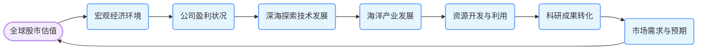

# 全球股市估值与深海探索技术的关系

> 关键词：全球股市估值、深海探索技术、经济影响、技术创新、市场趋势、产业发展、相关性分析

> 摘要：本文旨在深入探讨全球股市估值与深海探索技术之间的关系。通过对相关概念的介绍、核心算法原理的分析、数学模型的构建以及实际案例的研究，揭示两者之间潜在的联系和相互影响。研究发现，深海探索技术的发展不仅推动了相关产业的进步，也对全球股市估值产生了多方面的影响。同时，股市的表现也会在一定程度上影响深海探索技术的研发和应用。本文将为投资者、科研人员和政策制定者提供有价值的参考，帮助他们更好地理解这一复杂关系，并做出合理的决策。

## 1. 背景介绍 
### 1.1 目的和范围
本研究的目的在于全面分析全球股市估值与深海探索技术之间的关系，探讨这种关系的内在机制和影响因素。范围涵盖了全球主要股票市场以及深海探索技术的各个领域，包括海洋资源开发、海洋科研、海洋工程等。通过对历史数据的分析和未来趋势的预测，为相关利益者提供决策依据。

### 1.2 预期读者
本文预期读者包括金融投资者、深海探索技术领域的科研人员、政策制定者、行业分析师以及对经济和科技发展感兴趣的普通读者。对于投资者来说，了解两者之间的关系有助于优化投资组合，降低风险；对于科研人员和政策制定者，有助于制定合理的研发和产业政策；对于行业分析师，可为其研究提供新的视角和方法；对于普通读者，可增进对经济和科技领域的认识。

### 1.3 文档结构概述
本文首先介绍相关背景信息，包括目的、预期读者和文档结构。接着阐述核心概念与联系，通过文本示意图和 Mermaid 流程图展示两者的关系。然后详细讲解核心算法原理和具体操作步骤，包括使用 Python 源代码进行分析。之后构建数学模型和公式，并举例说明。再通过项目实战，展示代码实际案例并进行详细解释。随后探讨实际应用场景，推荐相关工具和资源。最后总结未来发展趋势与挑战，提供常见问题与解答以及扩展阅读和参考资料。

### 1.4 术语表
#### 1.4.1 核心术语定义
- **全球股市估值**：指对全球范围内股票市场整体价值的评估，通常通过股票指数、市盈率、市净率等指标来衡量。
- **深海探索技术**：是指用于探索深海环境、开发深海资源、进行海洋科学研究等的一系列技术手段，包括水下机器人、深海探测器、海洋传感器等。

#### 1.4.2 相关概念解释
- **股市估值模型**：是一种用于计算股票市场合理价值的数学模型，常见的有股息贴现模型、现金流贴现模型等。
- **深海资源**：指蕴藏在深海区域的各种自然资源，如石油、天然气、多金属结核、热液硫化物等。

#### 1.4.3 缩略词列表
- **GDP**：国内生产总值（Gross Domestic Product）
- **ROE**：净资产收益率（Return on Equity）
- **AUV**：自主水下航行器（Autonomous Underwater Vehicle）
- **ROV**：遥控水下航行器（Remotely Operated Vehicle）

## 2. 核心概念与联系 
### 2.1 全球股市估值的核心概念
全球股市估值是衡量股票市场整体价值的重要指标。它受到多种因素的影响，包括宏观经济环境、公司盈利状况、利率水平、市场情绪等。常见的估值方法有相对估值法和绝对估值法。相对估值法通过与同行业或其他市场的类似公司进行比较，来评估股票的价值，如市盈率（P/E）、市净率（P/B）等。绝对估值法是通过预测公司未来的现金流，并将其折现到当前来计算股票的内在价值，如股息贴现模型（DDM）、自由现金流贴现模型（DCF）等。

### 2.2 深海探索技术的核心概念
深海探索技术是人类探索深海世界的重要手段。它涉及到多个学科领域，包括海洋学、物理学、化学、生物学、工程学等。深海探索技术的发展经历了从简单的潜水设备到复杂的水下机器人和深海探测器的过程。目前，深海探索技术主要包括水下航行器技术、深海探测技术、海洋传感器技术等。水下航行器技术可分为自主水下航行器（AUV）和遥控水下航行器（ROV），它们能够在深海环境中进行自主或遥控作业。深海探测技术可用于探测深海地形、地质结构、海洋生物等信息。海洋传感器技术可实时监测海洋环境参数，如温度、盐度、压力等。

### 2.3 两者的联系
全球股市估值与深海探索技术之间存在着密切的联系。一方面，深海探索技术的发展推动了相关产业的进步，如海洋资源开发、海洋科研仪器制造等。这些产业的发展会影响相关公司的盈利状况，进而影响全球股市估值。例如，深海石油开采技术的进步可能会提高石油公司的产量和利润，从而提升其股票价格，推动股市估值上升。另一方面，全球股市的表现也会影响深海探索技术的研发和应用。当股市表现良好时，企业融资相对容易，有更多的资金投入到深海探索技术的研发中；而当股市低迷时，企业可能会减少研发投入，从而影响深海探索技术的发展速度。

### 2.4 文本示意图
全球股市估值与深海探索技术的关系可以用以下文本示意图表示：

全球股市估值 <-> 宏观经济环境 <-> 公司盈利状况 <-> 深海探索技术发展 <-> 海洋产业发展 <-> 资源开发与利用 <-> 科研成果转化 <-> 市场需求与预期

### 2.5 Mermaid 流程图


## 3. 核心算法原理 & 具体操作步骤 
### 3.1 核心算法原理
为了分析全球股市估值与深海探索技术之间的关系，我们可以采用时间序列分析方法。时间序列分析是一种用于处理时间序列数据的统计方法，它可以帮助我们发现数据中的趋势、季节性和周期性等特征。在本研究中，我们将使用自回归积分滑动平均模型（ARIMA）来对全球股市估值和深海探索技术相关指标进行建模和预测。

ARIMA 模型的一般形式为：

$$ARIMA(p, d, q)$$

其中，$p$ 是自回归项的阶数，$d$ 是差分的阶数，$q$ 是移动平均项的阶数。

### 3.2 具体操作步骤
#### 3.2.1 数据收集
收集全球主要股票市场的指数数据，如标普 500 指数、道琼斯工业平均指数、上证指数等，以及深海探索技术相关指标数据，如深海探测设备的研发投入、深海资源开发产量等。数据的时间跨度应尽可能长，以保证分析的准确性。

#### 3.2.2 数据预处理
对收集到的数据进行清洗和预处理，包括去除缺失值、异常值，进行数据标准化等操作。

#### 3.2.3 模型选择
使用自相关函数（ACF）和偏自相关函数（PACF）来确定 ARIMA 模型的阶数 $p$、$d$ 和 $q$。

#### 3.2.4 模型训练
使用训练数据对 ARIMA 模型进行训练，估计模型的参数。

#### 3.2.5 模型评估
使用测试数据对训练好的模型进行评估，计算模型的预测误差，如均方误差（MSE）、平均绝对误差（MAE）等。

#### 3.2.6 模型预测
使用训练好的模型对未来的全球股市估值和深海探索技术相关指标进行预测。

### 3.3 Python 源代码实现
```python
import pandas as pd
import numpy as np
from statsmodels.tsa.arima.model import ARIMA
from sklearn.metrics import mean_squared_error, mean_absolute_error
import matplotlib.pyplot as plt

# 读取数据
stock_data = pd.read_csv('stock_data.csv', index_col='date', parse_dates=True)
tech_data = pd.read_csv('tech_data.csv', index_col='date', parse_dates=True)

# 数据预处理
stock_data = stock_data.dropna()
tech_data = tech_data.dropna()

# 划分训练集和测试集
train_size = int(len(stock_data) * 0.8)
stock_train, stock_test = stock_data[:train_size], stock_data[train_size:]
tech_train, tech_test = tech_data[:train_size], tech_data[train_size:]

# 选择 ARIMA 模型的阶数
p, d, q = 1, 1, 1  # 示例阶数

# 训练 ARIMA 模型
stock_model = ARIMA(stock_train, order=(p, d, q))
stock_model_fit = stock_model.fit()

tech_model = ARIMA(tech_train, order=(p, d, q))
tech_model_fit = tech_model.fit()

# 模型预测
stock_pred = stock_model_fit.predict(start=len(stock_train), end=len(stock_data) - 1)
tech_pred = tech_model_fit.predict(start=len(tech_train), end=len(tech_data) - 1)

# 模型评估
stock_mse = mean_squared_error(stock_test, stock_pred)
stock_mae = mean_absolute_error(stock_test, stock_pred)

tech_mse = mean_squared_error(tech_test, tech_pred)
tech_mae = mean_absolute_error(tech_test, tech_pred)

print(f"Stock MSE: {stock_mse}, Stock MAE: {stock_mae}")
print(f"Tech MSE: {tech_mse}, Tech MAE: {tech_mae}")

# 绘制预测结果
plt.figure(figsize=(12, 6))
plt.plot(stock_test, label='Actual Stock Data')
plt.plot(stock_pred, label='Predicted Stock Data')
plt.title('Stock Data Prediction')
plt.xlabel('Date')
plt.ylabel('Stock Index')
plt.legend()
plt.show()

plt.figure(figsize=(12, 6))
plt.plot(tech_test, label='Actual Tech Data')
plt.plot(tech_pred, label='Predicted Tech Data')
plt.title('Tech Data Prediction')
plt.xlabel('Date')
plt.ylabel('Tech Index')
plt.legend()
plt.show()
```

## 4. 数学模型和公式 & 详细讲解 & 举例说明 
### 4.1 ARIMA 模型的数学公式
ARIMA 模型的数学公式可以表示为：

$$\phi(B)(1 - B)^d Y_t = \theta(B) \epsilon_t$$

其中，$Y_t$ 是时间序列数据，$B$ 是滞后算子，$(1 - B)^d$ 表示对时间序列进行 $d$ 阶差分，$\phi(B)$ 是自回归多项式，$\theta(B)$ 是移动平均多项式，$\epsilon_t$ 是白噪声序列。

自回归多项式 $\phi(B)$ 可以表示为：

$$\phi(B) = 1 - \phi_1 B - \phi_2 B^2 - \cdots - \phi_p B^p$$

移动平均多项式 $\theta(B)$ 可以表示为：

$$\theta(B) = 1 + \theta_1 B + \theta_2 B^2 + \cdots + \theta_q B^q$$

### 4.2 详细讲解
ARIMA 模型的核心思想是通过对时间序列进行差分来使其平稳，然后使用自回归和移动平均的方法来建模。差分的阶数 $d$ 用于消除时间序列中的趋势和季节性。自回归项的阶数 $p$ 表示当前值与过去 $p$ 个值之间的关系，移动平均项的阶数 $q$ 表示当前值与过去 $q$ 个误差项之间的关系。

### 4.3 举例说明
假设我们有一个时间序列数据 $Y_t$，其自相关函数（ACF）和偏自相关函数（PACF）显示该序列具有一阶自回归和一阶移动平均的特征。我们可以选择 $p = 1$，$d = 0$，$q = 1$ 的 ARIMA 模型来对其进行建模。

模型的具体形式为：

$$Y_t = \phi_1 Y_{t - 1} + \epsilon_t + \theta_1 \epsilon_{t - 1}$$

其中，$\phi_1$ 是自回归系数，$\theta_1$ 是移动平均系数，$\epsilon_t$ 是白噪声序列。

我们可以使用最大似然估计的方法来估计模型的参数 $\phi_1$ 和 $\theta_1$。估计得到参数后，我们就可以使用该模型对未来的 $Y_t$ 值进行预测。

## 5. 项目实战：代码实际案例和详细解释说明 
### 5.1  开发环境搭建
#### 5.1.1 安装 Python
首先，需要安装 Python 环境。可以从 Python 官方网站（https://www.python.org/downloads/） 下载适合自己操作系统的 Python 安装包，并按照安装向导进行安装。

#### 5.1.2 安装必要的库
使用 pip 命令安装必要的 Python 库，包括 pandas、numpy、statsmodels、matplotlib 等。

```sh
pip install pandas numpy statsmodels matplotlib
```

### 5.2  源代码详细实现和代码解读
```python
import pandas as pd
import numpy as np
from statsmodels.tsa.arima.model import ARIMA
from sklearn.metrics import mean_squared_error, mean_absolute_error
import matplotlib.pyplot as plt

# 读取数据
stock_data = pd.read_csv('stock_data.csv', index_col='date', parse_dates=True)
tech_data = pd.read_csv('tech_data.csv', index_col='date', parse_dates=True)

# 代码解读：使用 pandas 库的 read_csv 函数读取股票数据和深海探索技术相关数据，并将日期列作为索引，同时解析日期格式。

# 数据预处理
stock_data = stock_data.dropna()
tech_data = tech_data.dropna()

# 代码解读：使用 dropna 方法去除数据中的缺失值，确保数据的完整性。

# 划分训练集和测试集
train_size = int(len(stock_data) * 0.8)
stock_train, stock_test = stock_data[:train_size], stock_data[train_size:]
tech_train, tech_test = tech_data[:train_size], tech_data[train_size:]

# 代码解读：将数据按照 80% 和 20% 的比例划分为训练集和测试集，用于模型的训练和评估。

# 选择 ARIMA 模型的阶数
p, d, q = 1, 1, 1  # 示例阶数

# 代码解读：这里简单地选择了 p = 1，d = 1，q = 1 作为 ARIMA 模型的阶数，实际应用中需要根据自相关函数和偏自相关函数来确定合适的阶数。

# 训练 ARIMA 模型
stock_model = ARIMA(stock_train, order=(p, d, q))
stock_model_fit = stock_model.fit()

tech_model = ARIMA(tech_train, order=(p, d, q))
tech_model_fit = tech_model.fit()

# 代码解读：使用 ARIMA 类创建股票数据和深海探索技术数据的 ARIMA 模型，并使用 fit 方法进行训练，得到模型的拟合结果。

# 模型预测
stock_pred = stock_model_fit.predict(start=len(stock_train), end=len(stock_data) - 1)
tech_pred = tech_model_fit.predict(start=len(tech_train), end=len(tech_data) - 1)

# 代码解读：使用训练好的模型对测试集数据进行预测，得到预测结果。

# 模型评估
stock_mse = mean_squared_error(stock_test, stock_pred)
stock_mae = mean_absolute_error(stock_test, stock_pred)

tech_mse = mean_squared_error(tech_test, tech_pred)
tech_mae = mean_absolute_error(tech_test, tech_pred)

print(f"Stock MSE: {stock_mse}, Stock MAE: {stock_mae}")
print(f"Tech MSE: {tech_mse}, Tech MAE: {tech_mae}")

# 代码解读：使用 mean_squared_error 和 mean_absolute_error 函数计算模型的均方误差和平均绝对误差，评估模型的预测性能。

# 绘制预测结果
plt.figure(figsize=(12, 6))
plt.plot(stock_test, label='Actual Stock Data')
plt.plot(stock_pred, label='Predicted Stock Data')
plt.title('Stock Data Prediction')
plt.xlabel('Date')
plt.ylabel('Stock Index')
plt.legend()
plt.show()

plt.figure(figsize=(12, 6))
plt.plot(tech_test, label='Actual Tech Data')
plt.plot(tech_pred, label='Predicted Tech Data')
plt.title('Tech Data Prediction')
plt.xlabel('Date')
plt.ylabel('Tech Index')
plt.legend()
plt.show()

# 代码解读：使用 matplotlib 库绘制实际数据和预测数据的折线图，直观地展示模型的预测效果。
```

### 5.3  代码解读与分析
#### 5.3.1 数据处理
数据处理是整个项目的基础。通过读取数据、去除缺失值和划分训练集测试集，确保了数据的质量和可用性。在实际应用中，可能还需要对数据进行更复杂的预处理，如数据标准化、平滑处理等。

#### 5.3.2 模型选择
ARIMA 模型的阶数选择是一个关键步骤。在本示例中，我们简单地选择了 $p = 1$，$d = 1$，$q = 1$，但实际应用中需要根据数据的自相关函数和偏自相关函数来确定合适的阶数。可以使用 `statsmodels` 库中的 `acf` 和 `pacf` 函数来计算自相关函数和偏自相关函数。

#### 5.3.3 模型训练和预测
使用 `ARIMA` 类创建模型并使用 `fit` 方法进行训练，然后使用 `predict` 方法进行预测。在训练过程中，模型会自动估计参数，以最小化预测误差。

#### 5.3.4 模型评估
使用均方误差（MSE）和平均绝对误差（MAE）来评估模型的预测性能。MSE 衡量了预测值与实际值之间的平均平方误差，MAE 衡量了预测值与实际值之间的平均绝对误差。误差值越小，说明模型的预测性能越好。

#### 5.3.5 结果可视化
使用 `matplotlib` 库绘制实际数据和预测数据的折线图，直观地展示模型的预测效果。通过可视化可以帮助我们更好地理解模型的性能和数据的变化趋势。

## 6. 实际应用场景 
### 6.1 投资决策
对于投资者来说，了解全球股市估值与深海探索技术之间的关系可以帮助他们做出更合理的投资决策。例如，如果深海探索技术取得重大突破，可能会推动相关产业的发展，从而提升相关公司的股票价值。投资者可以提前布局这些股票，获取投资收益。反之，如果股市整体表现不佳，可能会影响深海探索技术相关企业的融资和发展，投资者可以适当减少对这些企业的投资。

### 6.2 产业政策制定
政策制定者可以根据全球股市估值与深海探索技术之间的关系制定合理的产业政策。当股市表现良好时，可以加大对深海探索技术研发的支持力度，促进技术创新和产业发展。当股市低迷时，可以采取措施稳定股市，为深海探索技术相关企业提供融资支持，帮助其度过难关。

### 6.3 科研规划
科研人员可以参考全球股市估值与深海探索技术之间的关系来规划科研项目。当股市对深海探索技术相关产业表现出较高的关注度和预期时，科研人员可以加大在相关领域的研究投入，争取取得更多的科研成果。同时，科研成果的转化也可以借助股市的力量，吸引更多的资金和资源。

### 6.4 风险管理
企业可以通过分析全球股市估值与深海探索技术之间的关系来进行风险管理。例如，当股市波动较大时，企业可以采取措施降低风险，如调整投资策略、优化资产结构等。对于深海探索技术相关企业来说，还可以通过技术创新和产业升级来提高自身的抗风险能力。

## 7. 工具和资源推荐
### 7.1 学习资源推荐
#### 7.1.1 书籍推荐
- 《金融市场与金融机构》：这本书全面介绍了金融市场和金融机构的基本概念、运作机制和风险管理等内容，对于理解全球股市估值有很大帮助。
- 《海洋科学导论》：涵盖了海洋科学的各个领域，包括海洋物理、海洋化学、海洋生物等，有助于了解深海探索技术的背景和应用。
- 《时间序列分析：预测与控制》：详细介绍了时间序列分析的理论和方法，是学习 ARIMA 模型等时间序列分析技术的经典教材。

#### 7.1.2 在线课程
- Coursera 上的“Financial Markets”：由耶鲁大学教授 Robert Shiller 授课，讲解了金融市场的基本原理和投资策略。
- edX 上的“Ocean Exploration: Science and Technology”：介绍了海洋探索的科学和技术，包括深海探索技术的发展和应用。
- Udemy 上的“Time Series Analysis in Python”：通过实际案例讲解了如何使用 Python 进行时间序列分析，包括 ARIMA 模型的应用。

#### 7.1.3 技术博客和网站
- Seeking Alpha：提供全球股市的分析和评论，以及相关的投资建议。
- Oceanography for Everyone：分享海洋科学和海洋探索技术的最新研究成果和发展动态。
- Towards Data Science：发表了许多关于数据分析和机器学习的技术文章，包括时间序列分析的相关内容。

### 7.2 开发工具框架推荐
#### 7.2.1 IDE和编辑器
- PyCharm：一款功能强大的 Python 集成开发环境，提供代码编辑、调试、版本控制等功能。
- Jupyter Notebook：一个交互式的编程环境，适合进行数据分析和模型开发，支持 Python、R 等多种编程语言。

#### 7.2.2 调试和性能分析工具
- pdb：Python 自带的调试工具，可以帮助开发者定位代码中的问题。
- cProfile：Python 标准库中的性能分析工具，可以分析代码的运行时间和函数调用情况。

#### 7.2.3 相关框架和库
- pandas：用于数据处理和分析的 Python 库，提供了高效的数据结构和数据操作方法。
- numpy：Python 的数值计算库，提供了高性能的数组和矩阵运算功能。
- statsmodels：用于统计建模和分析的 Python 库，支持 ARIMA 模型等多种时间序列分析方法。
- matplotlib：用于数据可视化的 Python 库，可以绘制各种类型的图表。

### 7.3 相关论文著作推荐
#### 7.3.1 经典论文
- Fama, E. F., & French, K. R. (1992). The cross-section of expected stock returns. The Journal of Finance, 47(2), 427-465. 这篇论文提出了著名的 Fama-French 三因子模型，对股票市场的估值和定价进行了深入研究。
- Harris, P. T., & Whiteway, T. (2011). An overview of the evolving seabed mapping technologies. Marine Geophysical Research, 32(3), 235-245. 该论文概述了海底测绘技术的发展历程和现状，对于了解深海探索技术有重要参考价值。

#### 7.3.2 最新研究成果
- 关注《Journal of Financial Economics》《Ocean Engineering》等学术期刊，获取全球股市估值和深海探索技术领域的最新研究成果。

#### 7.3.3 应用案例分析
- 研究一些知名企业在深海探索技术领域的投资和发展案例，如壳牌公司在深海石油开采技术方面的应用，分析其对股市估值的影响。

## 8. 总结：未来发展趋势与挑战
### 8.1 未来发展趋势
#### 8.1.1 技术创新推动产业发展
随着科技的不断进步，深海探索技术将不断创新和发展。例如，更先进的水下机器人、深海探测器和海洋传感器将被研发出来，提高深海探索的效率和精度。这将推动海洋资源开发、海洋科研等相关产业的发展，进而影响全球股市估值。

#### 8.1.2 跨学科融合趋势明显
深海探索技术涉及多个学科领域，未来跨学科融合的趋势将更加明显。例如，将人工智能、大数据、物联网等技术应用于深海探索中，可以实现深海数据的实时监测和分析，提高深海探索的智能化水平。这种跨学科融合将为相关产业带来新的发展机遇，也将对全球股市估值产生影响。

#### 8.1.3 国际合作加强
深海是人类共同的资源，国际合作在深海探索中至关重要。未来，各国将加强在深海探索技术研发、资源开发等方面的合作，共同应对深海探索中的挑战。这种国际合作将促进深海探索技术的共享和交流，推动全球海洋产业的发展，进而影响全球股市估值。

### 8.2 挑战
#### 8.2.1 技术难题
深海环境复杂恶劣，深海探索技术面临诸多技术难题。例如，深海高压、低温、黑暗等环境条件对设备的性能和可靠性提出了很高的要求；深海数据的传输和处理也面临着巨大的挑战。解决这些技术难题需要大量的研发投入和时间。

#### 8.2.2 资金短缺
深海探索技术的研发和应用需要大量的资金投入。目前，深海探索技术相关企业面临着资金短缺的问题，尤其是在股市低迷时，企业融资更加困难。这将限制深海探索技术的发展速度。

#### 8.2.3 环境和法律问题
深海探索和资源开发可能会对海洋环境造成一定的影响，因此需要解决环境和法律问题。例如，如何在开发海洋资源的同时保护海洋生态环境，如何制定合理的深海资源开发法律法规等。这些问题的解决将影响深海探索技术的发展和应用。

## 9. 附录：常见问题与解答
### 9.1 全球股市估值与深海探索技术之间的关系是因果关系吗？
不是严格的因果关系。两者之间存在着相互影响的关系。深海探索技术的发展会影响相关产业的发展，进而影响全球股市估值；而全球股市的表现也会影响深海探索技术的研发和应用。

### 9.2 ARIMA 模型的阶数如何确定？
可以使用自相关函数（ACF）和偏自相关函数（PACF）来确定 ARIMA 模型的阶数。自相关函数反映了时间序列与自身滞后值之间的相关性，偏自相关函数反映了在去除中间滞后值影响后，时间序列与自身滞后值之间的相关性。通过观察 ACF 和 PACF 图的截尾和拖尾情况，可以确定合适的 $p$、$d$ 和 $q$ 值。

### 9.3 如何提高 ARIMA 模型的预测精度？
可以从以下几个方面提高 ARIMA 模型的预测精度：
- 选择合适的阶数：通过仔细分析自相关函数和偏自相关函数，选择最适合数据的 $p$、$d$ 和 $q$ 值。
- 数据预处理：对数据进行清洗、平滑处理、标准化等操作，提高数据的质量。
- 模型评估和优化：使用多种评估指标对模型进行评估，根据评估结果对模型进行优化。
- 结合其他模型：可以将 ARIMA 模型与其他时间序列模型或机器学习模型结合使用，提高预测精度。

### 9.4 深海探索技术的发展对哪些行业有影响？
深海探索技术的发展对多个行业有影响，主要包括：
- 海洋资源开发行业：如深海石油开采、深海矿产资源开发等。
- 海洋科研仪器制造行业：为深海探索提供各种仪器设备。
- 海洋工程行业：包括深海平台建设、海底管道铺设等。
- 海洋环保行业：监测和保护海洋环境。

### 9.5 如何获取全球股市估值和深海探索技术相关的数据？
可以通过以下途径获取相关数据：
- 金融数据提供商：如 Bloomberg、Wind 等，提供全球股市的各种数据。
- 科研机构和政府部门：如国家海洋局、海洋科研院所等，发布深海探索技术相关的数据和研究报告。
- 公开数据集：一些网站提供免费的公开数据集，如 Kaggle、Data.gov 等。

## 10. 扩展阅读 & 参考资料
### 10.1 扩展阅读
- 《聪明的投资者》：本杰明·格雷厄姆的经典著作，介绍了价值投资的理念和方法，对于理解股票市场估值有重要意义。
- 《海洋的秘密》：以科普的方式介绍了海洋的奥秘和深海探索的历史，适合对海洋科学感兴趣的读者阅读。
- 《数据分析实战》：通过实际案例讲解了数据分析的方法和技巧，对于学习时间序列分析和数据挖掘有帮助。

### 10.2 参考资料
- Fama, E. F., & French, K. R. (1992). The cross-section of expected stock returns. The Journal of Finance, 47(2), 427-465.
- Harris, P. T., & Whiteway, T. (2011). An overview of the evolving seabed mapping technologies. Marine Geophysical Research, 32(3), 235-245.
- Hyndman, R. J., & Athanasopoulos, G. (2018). Forecasting: principles and practice. OTexts.
- 相关金融数据和海洋科研报告，如 Bloomberg 数据库、国家海洋局发布的报告等。