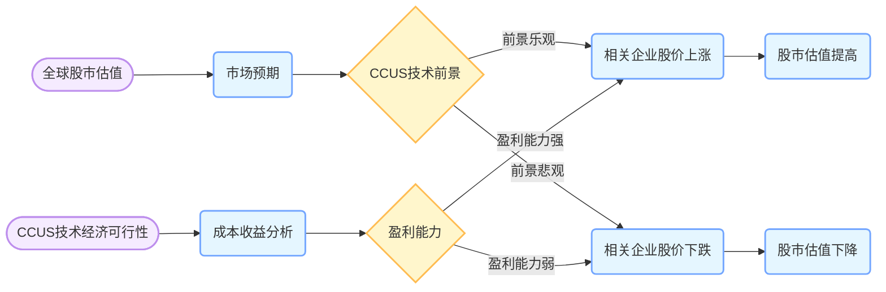

# 全球股市估值与碳捕获与利用技术的经济可行性

> 关键词：全球股市估值、碳捕获与利用技术、经济可行性、市场趋势、投资分析

> 摘要：本文旨在深入探讨全球股市估值与碳捕获与利用（CCUS）技术的经济可行性之间的关联。首先介绍了研究的背景和相关概念，包括全球股市估值的基本原理以及CCUS技术的定义和发展现状。接着详细阐述了CCUS技术的核心概念、算法原理、数学模型等内容。通过项目实战案例展示了如何在实际中分析CCUS技术相关企业的股市表现。还探讨了该技术的实际应用场景以及相关的工具和资源。最后总结了未来的发展趋势与挑战，并对常见问题进行了解答。通过全面的分析，为投资者和相关从业者提供有价值的参考，以便更好地理解CCUS技术在全球股市中的地位和经济可行性。

## 1. 背景介绍 
### 1.1 目的和范围
本研究的主要目的是深入剖析全球股市估值与碳捕获与利用技术经济可行性之间的内在联系。在当前全球经济和环境形势下，气候变化问题日益严峻，碳捕获与利用技术作为应对气候变化的关键手段之一，其发展前景备受关注。同时，全球股市作为经济的重要晴雨表，其对CCUS技术相关企业的估值也反映了市场对该技术的预期和信心。本研究的范围涵盖了全球主要股市中与CCUS技术相关的企业，包括从事CCUS技术研发、设备制造、项目运营等各个环节的企业。通过对这些企业的股市表现进行分析，结合CCUS技术的经济可行性评估，揭示两者之间的相互关系，为投资者、政策制定者和相关从业者提供决策依据。

### 1.2 预期读者
本文的预期读者主要包括以下几类人群：
1. **投资者**：包括股票投资者、风险投资者、私募股权投资者等。他们希望通过了解全球股市估值与CCUS技术经济可行性的关系，寻找有潜力的投资机会，评估投资风险，优化投资组合。
2. **政策制定者**：政府部门和国际组织的政策制定者，他们需要依据市场动态和技术发展情况制定相关的政策和法规，推动CCUS技术的发展和应用，实现应对气候变化的目标。
3. **企业管理者**：CCUS技术相关企业的管理者，他们需要了解市场对企业的估值情况，以及技术的经济可行性，以便制定企业的发展战略、融资计划和运营决策。
4. **科研人员**：从事CCUS技术研究和开发的科研人员，他们可以从经济可行性的角度出发，优化技术方案，提高技术的市场竞争力。
5. **学术研究人员**：对金融市场、能源经济、环境科学等领域感兴趣的学术研究人员，他们可以从本文中获取相关的研究思路和数据，开展进一步的学术研究。

### 1.3 文档结构概述
本文的结构如下：
1. **背景介绍**：阐述研究的目的、范围、预期读者和文档结构概述，以及相关的术语和概念。
2. **核心概念与联系**：介绍全球股市估值和碳捕获与利用技术的核心概念，以及两者之间的内在联系。通过文本示意图和Mermaid流程图进行直观展示。
3. **核心算法原理 & 具体操作步骤**：详细讲解用于评估CCUS技术经济可行性的核心算法原理，并给出具体的操作步骤，同时使用Python源代码进行详细阐述。
4. **数学模型和公式 & 详细讲解 & 举例说明**：建立数学模型和公式，对CCUS技术的经济可行性进行量化分析，并通过具体的例子进行说明。
5. **项目实战：代码实际案例和详细解释说明**：通过实际的项目案例，展示如何运用上述算法和模型进行分析，包括开发环境搭建、源代码详细实现和代码解读。
6. **实际应用场景**：探讨CCUS技术在不同领域的实际应用场景，以及这些应用场景对股市估值的影响。
7. **工具和资源推荐**：推荐相关的学习资源、开发工具框架和论文著作，为读者提供进一步学习和研究的参考。
8. **总结：未来发展趋势与挑战**：总结CCUS技术的未来发展趋势和面临的挑战，以及对全球股市估值的影响。
9. **附录：常见问题与解答**：解答读者在阅读过程中可能遇到的常见问题。
10. **扩展阅读 & 参考资料**：提供相关的扩展阅读材料和参考资料，方便读者深入研究。

### 1.4 术语表
#### 1.4.1 核心术语定义
1. **全球股市估值**：指对全球范围内股票市场中上市公司的价值进行评估的过程和结果。股市估值通常基于公司的财务状况、盈利能力、发展前景等因素，通过各种估值方法（如市盈率法、市净率法、现金流折现法等）来确定股票的合理价格。
2. **碳捕获与利用技术（CCUS）**：是一种将二氧化碳从工业生产、能源利用等过程中捕获并加以利用或封存的技术。CCUS技术主要包括二氧化碳的捕获、运输、利用和封存四个环节。通过CCUS技术，可以减少二氧化碳的排放，同时实现二氧化碳的资源化利用，具有重要的环境和经济意义。
3. **经济可行性**：指一项技术、项目或投资在经济上是否可行的评估。经济可行性评估通常考虑成本、收益、投资回报率、净现值等经济指标，以确定项目是否能够在经济上实现可持续发展。

#### 1.4.2 相关概念解释
1. **碳排放权交易**：是一种基于市场机制的减排手段，通过设定碳排放总量上限，将碳排放权作为一种商品在市场上进行交易。企业可以根据自身的碳排放情况，在市场上购买或出售碳排放权，从而实现减排目标。碳排放权交易市场的发展对CCUS技术的经济可行性具有重要影响。
2. **清洁能源转型**：指从传统的化石能源向清洁能源（如太阳能、风能、水能等）的转变过程。清洁能源转型是应对气候变化的重要举措，CCUS技术可以作为清洁能源转型的辅助手段，提高能源利用效率，减少碳排放。
3. **可持续发展**：指既满足当代人的需求，又不损害后代人满足其需求的能力的发展模式。CCUS技术作为一种应对气候变化的技术，符合可持续发展的理念，对于实现全球可持续发展目标具有重要意义。

#### 1.4.3 缩略词列表
1. **CCUS**：Carbon Capture, Utilization and Storage，碳捕获与利用技术
2. **NPV**：Net Present Value，净现值
3. **IRR**：Internal Rate of Return，内部收益率
4. **CO₂**：Carbon Dioxide，二氧化碳

## 2. 核心概念与联系 
### 全球股市估值核心概念
全球股市估值是金融领域的重要研究内容，它反映了市场对上市公司价值的预期。常见的股市估值方法包括相对估值法和绝对估值法。相对估值法是通过比较同行业或类似公司的估值指标（如市盈率、市净率等）来确定目标公司的价值。例如，市盈率（P/E）是指股票价格与每股收益的比率，它反映了投资者为获取公司每一元盈利所愿意支付的价格。市净率（P/B）是指股票价格与每股净资产的比率，它反映了投资者为获取公司每一元净资产所愿意支付的价格。

绝对估值法是通过对公司未来现金流的预测和折现来确定公司的价值。其中，最常用的方法是现金流折现法（DCF）。该方法的基本原理是将公司未来的自由现金流按照一定的折现率折现到当前时刻，得到公司的内在价值。公式如下：

$$V = \sum_{t=1}^{n} \frac{FCF_t}{(1 + r)^t}$$

其中，$V$ 表示公司的内在价值，$FCF_t$ 表示第 $t$ 期的自由现金流，$r$ 表示折现率，$n$ 表示预测期数。

### 碳捕获与利用技术核心概念
碳捕获与利用技术（CCUS）是一种综合性的技术体系，旨在减少二氧化碳的排放并实现其资源化利用。该技术主要包括以下几个环节：
1. **二氧化碳捕获**：从工业生产、能源利用等过程中分离和捕获二氧化碳。常见的捕获技术包括燃烧前捕获、燃烧后捕获和富氧燃烧捕获等。
2. **二氧化碳运输**：将捕获的二氧化碳从捕获源运输到利用或封存地点。运输方式主要包括管道运输、公路运输和水路运输等。
3. **二氧化碳利用**：将捕获的二氧化碳转化为有价值的产品或用于其他工业过程。常见的利用方式包括二氧化碳驱油、二氧化碳合成化学品、二氧化碳生物利用等。
4. **二氧化碳封存**：将无法利用的二氧化碳注入地下深部地质构造中进行永久封存，以防止其进入大气。

### 两者之间的联系
全球股市估值与碳捕获与利用技术的经济可行性之间存在着密切的联系。一方面，股市估值反映了市场对CCUS技术相关企业的预期和信心。如果市场认为CCUS技术具有广阔的发展前景和经济可行性，那么相关企业的股票价格可能会上涨，估值也会相应提高。另一方面，CCUS技术的经济可行性也会影响股市估值。如果CCUS技术的成本过高、收益过低，那么相关企业的盈利能力将受到影响，股市估值也会下降。

以下是两者联系的Mermaid流程图：


## 3. 核心算法原理 & 具体操作步骤 
### 评估CCUS技术经济可行性的核心算法原理
评估CCUS技术的经济可行性通常需要考虑多个因素，包括成本、收益、投资回报率等。其中，净现值（NPV）和内部收益率（IRR）是常用的评估指标。

#### 净现值（NPV）
净现值是指项目在整个寿命期内的现金流入现值与现金流出现值之差。其计算公式为：

$$NPV = \sum_{t=0}^{n} \frac{CF_t}{(1 + r)^t}$$

其中，$NPV$ 表示净现值，$CF_t$ 表示第 $t$ 期的净现金流量，$r$ 表示折现率，$n$ 表示项目寿命期。

如果 $NPV > 0$，则项目在经济上是可行的；如果 $NPV < 0$，则项目在经济上不可行。

#### 内部收益率（IRR）
内部收益率是指使项目净现值为零的折现率。其计算公式为：

$$\sum_{t=0}^{n} \frac{CF_t}{(1 + IRR)^t} = 0$$

其中，$IRR$ 表示内部收益率，$CF_t$ 表示第 $t$ 期的净现金流量，$n$ 表示项目寿命期。

内部收益率反映了项目的实际盈利能力。一般来说，内部收益率越高，项目的经济可行性越强。

### 具体操作步骤
1. **确定项目寿命期**：根据CCUS项目的特点和实际情况，确定项目的寿命期 $n$。
2. **预测净现金流量**：对CCUS项目在整个寿命期内的现金流入和现金流出进行预测，得到各期的净现金流量 $CF_t$。现金流入主要包括二氧化碳利用的收益、碳排放权交易的收入等；现金流出主要包括设备投资、运营成本、维护成本等。
3. **确定折现率**：根据项目的风险程度和市场情况，确定合适的折现率 $r$。折现率通常可以参考市场利率、行业基准收益率等。
4. **计算净现值和内部收益率**：根据上述公式，计算CCUS项目的净现值 $NPV$ 和内部收益率 $IRR$。
5. **评估经济可行性**：根据净现值和内部收益率的计算结果，评估CCUS项目的经济可行性。如果 $NPV > 0$ 且 $IRR$ 大于行业基准收益率，则项目在经济上是可行的；否则，项目在经济上不可行。

### Python源代码实现
```python
import numpy as np
from scipy.optimize import newton

def calculate_npv(cash_flows, discount_rate):
    """
    计算净现值
    :param cash_flows: 净现金流量列表，第一个元素为初始投资（负数）
    :param discount_rate: 折现率
    :return: 净现值
    """
    npv = 0
    for t in range(len(cash_flows)):
        npv += cash_flows[t] / (1 + discount_rate) ** t
    return npv

def calculate_irr(cash_flows):
    """
    计算内部收益率
    :param cash_flows: 净现金流量列表，第一个元素为初始投资（负数）
    :return: 内部收益率
    """
    def npv_func(irr):
        return calculate_npv(cash_flows, irr)
    try:
        irr = newton(npv_func, 0.1)
        return irr
    except:
        return None

# 示例数据
cash_flows = [-1000, 200, 300, 400, 500]  # 初始投资1000，后续各期净现金流量
discount_rate = 0.1  # 折现率10%

# 计算净现值
npv = calculate_npv(cash_flows, discount_rate)
print(f"净现值: {npv}")

# 计算内部收益率
irr = calculate_irr(cash_flows)
if irr is not None:
    print(f"内部收益率: {irr * 100:.2f}%")
else:
    print("无法计算内部收益率")
```

## 4. 数学模型和公式 & 详细讲解 & 举例说明 
### 数学模型
在评估CCUS技术的经济可行性时，我们可以建立一个基于净现值和内部收益率的数学模型。假设CCUS项目的寿命期为 $n$ 年，第 $t$ 年的现金流入为 $CI_t$，现金流出为 $CO_t$，则第 $t$ 年的净现金流量为 $CF_t = CI_t - CO_t$。

净现值的计算公式为：

$$NPV = \sum_{t=0}^{n} \frac{CI_t - CO_t}{(1 + r)^t}$$

内部收益率的计算公式为：

$$\sum_{t=0}^{n} \frac{CI_t - CO_t}{(1 + IRR)^t} = 0$$

### 详细讲解
1. **净现值（NPV）**：净现值是评估项目经济可行性的重要指标之一。它考虑了项目在整个寿命期内的现金流入和现金流出，并将其折现到当前时刻。净现值的大小反映了项目的盈利能力和投资价值。如果净现值大于零，则说明项目的收益大于成本，项目在经济上是可行的；如果净现值小于零，则说明项目的收益小于成本，项目在经济上不可行。
2. **内部收益率（IRR）**：内部收益率是使项目净现值为零的折现率。它反映了项目的实际盈利能力。内部收益率越高，说明项目的盈利能力越强。一般来说，当内部收益率大于行业基准收益率时，项目在经济上是可行的。

### 举例说明
假设一个CCUS项目的初始投资为 $1000$ 万元，项目寿命期为 $5$ 年。各年的现金流入和现金流出如下表所示：

| 年份 | 现金流入（万元） | 现金流出（万元） |
| ---- | ---- | ---- |
| 0 | 0 | 1000 |
| 1 | 200 | 100 |
| 2 | 300 | 150 |
| 3 | 400 | 200 |
| 4 | 500 | 250 |
| 5 | 600 | 300 |

折现率为 $10\%$。

1. **计算净现金流量**
    - 第 $0$ 年：$CF_0 = 0 - 1000 = -1000$（万元）
    - 第 $1$ 年：$CF_1 = 200 - 100 = 100$（万元）
    - 第 $2$ 年：$CF_2 = 300 - 150 = 150$（万元）
    - 第 $3$ 年：$CF_3 = 400 - 200 = 200$（万元）
    - 第 $4$ 年：$CF_4 = 500 - 250 = 250$（万元）
    - 第 $5$ 年：$CF_5 = 600 - 300 = 300$（万元）

2. **计算净现值**
$$NPV = -1000 + \frac{100}{(1 + 0.1)^1} + \frac{150}{(1 + 0.1)^2} + \frac{200}{(1 + 0.1)^3} + \frac{250}{(1 + 0.1)^4} + \frac{300}{(1 + 0.1)^5}$$
```python
import numpy as np

cash_flows = [-1000, 100, 150, 200, 250, 300]
discount_rate = 0.1
npv = 0
for t in range(len(cash_flows)):
    npv += cash_flows[t] / (1 + discount_rate) ** t
print(f"净现值: {npv:.2f}万元")
```
计算结果为 $NPV \approx -1000 + 90.91 + 123.97 + 150.26 + 170.75 + 186.28 = -277.83$（万元）

3. **计算内部收益率**
使用Python的 `scipy.optimize.newton` 函数计算内部收益率：
```python
from scipy.optimize import newton

def npv_func(irr):
    npv = 0
    for t in range(len(cash_flows)):
        npv += cash_flows[t] / (1 + irr) ** t
    return npv

try:
    irr = newton(npv_func, 0.1)
    print(f"内部收益率: {irr * 100:.2f}%")
except:
    print("无法计算内部收益率")
```
计算结果为内部收益率约为 $-2.78\%$。

由于净现值小于零，内部收益率小于折现率，该CCUS项目在经济上不可行。

## 5. 项目实战：代码实际案例和详细解释说明 
### 5.1  开发环境搭建
本项目实战使用Python进行开发，所需的开发环境如下：
1. **Python环境**：建议使用Python 3.7及以上版本。可以从Python官方网站（https://www.python.org/downloads/）下载并安装。
2. **开发工具**：推荐使用PyCharm作为开发工具。PyCharm是一款功能强大的Python集成开发环境（IDE），可以提供代码编辑、调试、运行等功能。可以从JetBrains官方网站（https://www.jetbrains.com/pycharm/download/）下载并安装。
3. **相关库**：本项目需要使用 `numpy` 和 `scipy` 库。可以使用以下命令进行安装：
```sh
pip install numpy scipy
```

### 5.2  源代码详细实现和代码解读
以下是一个完整的Python代码示例，用于评估CCUS项目的经济可行性：
```python
import numpy as np
from scipy.optimize import newton

def calculate_npv(cash_flows, discount_rate):
    """
    计算净现值
    :param cash_flows: 净现金流量列表，第一个元素为初始投资（负数）
    :param discount_rate: 折现率
    :return: 净现值
    """
    npv = 0
    for t in range(len(cash_flows)):
        npv += cash_flows[t] / (1 + discount_rate) ** t
    return npv

def calculate_irr(cash_flows):
    """
    计算内部收益率
    :param cash_flows: 净现金流量列表，第一个元素为初始投资（负数）
    :return: 内部收益率
    """
    def npv_func(irr):
        return calculate_npv(cash_flows, irr)
    try:
        irr = newton(npv_func, 0.1)
        return irr
    except:
        return None

def evaluate_ccus_project(initial_investment, cash_inflows, cash_outflows, discount_rate):
    """
    评估CCUS项目的经济可行性
    :param initial_investment: 初始投资
    :param cash_inflows: 各年现金流入列表
    :param cash_outflows: 各年现金流出列表
    :param discount_rate: 折现率
    :return: 净现值和内部收益率
    """
    # 计算净现金流量
    cash_flows = [-initial_investment]
    for i in range(len(cash_inflows)):
        cash_flows.append(cash_inflows[i] - cash_outflows[i])
    
    # 计算净现值
    npv = calculate_npv(cash_flows, discount_rate)
    
    # 计算内部收益率
    irr = calculate_irr(cash_flows)
    
    return npv, irr

# 示例数据
initial_investment = 1000  # 初始投资1000万元
cash_inflows = [200, 300, 400, 500, 600]  # 各年现金流入
cash_outflows = [100, 150, 200, 250, 300]  # 各年现金流出
discount_rate = 0.1  # 折现率10%

# 评估CCUS项目
npv, irr = evaluate_ccus_project(initial_investment, cash_inflows, cash_outflows, discount_rate)

# 输出结果
print(f"净现值: {npv:.2f}万元")
if irr is not None:
    print(f"内部收益率: {irr * 100:.2f}%")
else:
    print("无法计算内部收益率")
```

### 5.3  代码解读与分析
1. **`calculate_npv` 函数**：该函数用于计算净现值。它接受净现金流量列表和折现率作为输入，通过循环遍历净现金流量列表，将各期的净现金流量折现到当前时刻，并求和得到净现值。
2. **`calculate_irr` 函数**：该函数用于计算内部收益率。它定义了一个内部函数 `npv_func`，用于计算给定折现率下的净现值。然后使用 `scipy.optimize.newton` 函数求解使净现值为零的折现率，即内部收益率。
3. **`evaluate_ccus_project` 函数**：该函数用于评估CCUS项目的经济可行性。它接受初始投资、各年现金流入、各年现金流出和折现率作为输入，首先计算净现金流量，然后调用 `calculate_npv` 和 `calculate_irr` 函数计算净现值和内部收益率。
4. **主程序**：定义示例数据，调用 `evaluate_ccus_project` 函数评估CCUS项目，并输出净现值和内部收益率。

通过上述代码，我们可以方便地评估CCUS项目的经济可行性，为投资决策提供参考。

## 6. 实际应用场景 
### 能源行业
在能源行业，CCUS技术可以应用于煤炭、石油、天然气等化石能源的生产和利用过程中。例如，在煤炭发电过程中，采用CCUS技术可以捕获燃烧产生的二氧化碳，减少碳排放。捕获的二氧化碳可以用于提高石油采收率（EOR），将其注入油层中，增加油层压力，提高原油采收率。此外，二氧化碳还可以用于合成甲醇、尿素等化学品，实现二氧化碳的资源化利用。

### 工业领域
在工业领域，CCUS技术可以应用于钢铁、水泥、化工等行业。这些行业是二氧化碳排放的大户，采用CCUS技术可以有效减少其碳排放。例如，在钢铁生产过程中，通过捕获高炉煤气中的二氧化碳，可以降低钢铁生产的碳排放强度。在水泥生产过程中，采用CCUS技术可以捕获煅烧石灰石产生的二氧化碳，减少水泥生产的碳排放。

### 农业领域
在农业领域，CCUS技术也有一定的应用前景。例如，将二氧化碳注入土壤中，可以提高土壤的肥力，促进植物的生长。此外，二氧化碳还可以用于温室气体施肥，增加农作物的产量。

### 对股市估值的影响
CCUS技术在上述领域的应用，将对相关企业的股市估值产生影响。如果企业能够成功应用CCUS技术，减少碳排放，实现二氧化碳的资源化利用，将提高企业的社会形象和市场竞争力，从而提升企业的股市估值。例如，一些能源企业通过采用CCUS技术，实现了绿色转型，其股票价格可能会受到市场的青睐，估值也会相应提高。

## 7. 工具和资源推荐
### 7.1 学习资源推荐
#### 7.1.1 书籍推荐
1. 《碳捕获、利用与封存技术》：本书全面介绍了碳捕获、利用与封存技术的原理、方法和应用。书中详细阐述了二氧化碳捕获、运输、利用和封存的各个环节，以及相关的技术和政策。
2. 《金融市场学》：本书系统地介绍了金融市场的基本概念、理论和实践。书中涵盖了股票市场、债券市场、期货市场等金融市场的各个方面，对于理解全球股市估值具有重要的参考价值。
3. 《投资学》：本书介绍了投资的基本原理、方法和策略。书中详细阐述了股票投资、债券投资、基金投资等投资方式，以及投资组合理论、资本资产定价模型等投资理论，对于投资者进行投资决策具有重要的指导意义。

#### 7.1.2 在线课程
1. Coursera上的“Carbon Capture, Utilization, and Storage”：该课程由国际知名学者授课，全面介绍了碳捕获、利用与封存技术的最新进展和应用案例。
2. edX上的“Financial Markets”：该课程由著名经济学家授课，系统地介绍了金融市场的基本概念、理论和实践。
3. Udemy上的“Investment Strategies for Beginners”：该课程适合初学者，介绍了投资的基本原理、方法和策略，帮助投资者快速入门。

#### 7.1.3 技术博客和网站
1. Carbon Capture Journal：该网站是碳捕获、利用与封存技术领域的专业媒体，提供了最新的技术动态、研究成果和行业资讯。
2. Bloomberg Terminal：该网站是全球知名的金融信息服务提供商，提供了全球股市、债券市场、期货市场等金融市场的实时行情和分析报告。
3. Seeking Alpha：该网站是一个金融投资社区，提供了大量的股票分析、投资策略和市场评论，对于投资者进行投资决策具有重要的参考价值。

### 7.2 开发工具框架推荐
#### 7.2.1 IDE和编辑器
1. PyCharm：一款功能强大的Python集成开发环境（IDE），提供了代码编辑、调试、运行等功能，适合Python开发。
2. Visual Studio Code：一款轻量级的代码编辑器，支持多种编程语言，具有丰富的插件和扩展功能，适合快速开发。

#### 7.2.2 调试和性能分析工具
1. PDB：Python自带的调试工具，可以帮助开发者定位和解决代码中的问题。
2. cProfile：Python的性能分析工具，可以帮助开发者分析代码的性能瓶颈，优化代码。

#### 7.2.3 相关框架和库
1. NumPy：Python的科学计算库，提供了高效的数组和矩阵运算功能，适合数值计算。
2. SciPy：Python的科学计算库，提供了优化、积分、插值等功能，适合科学计算和工程应用。

### 7.3 相关论文著作推荐
#### 7.3.1 经典论文
1. “Carbon Capture and Storage: How Green Can Black Be?” by Howard Herzog：该论文全面介绍了碳捕获与封存技术的原理、方法和应用，是该领域的经典论文之一。
2. “The Pricing of Options and Corporate Liabilities” by Fischer Black and Myron Scholes：该论文提出了著名的Black-Scholes期权定价模型，对于金融市场的定价理论具有重要的贡献。

#### 7.3.2 最新研究成果
1. “Advances in Carbon Capture, Utilization, and Storage Technologies”：该研究成果介绍了碳捕获、利用与封存技术的最新进展和应用案例，对于了解该领域的前沿动态具有重要的参考价值。
2. “The Impact of Climate Change on Global Financial Markets”：该研究成果分析了气候变化对全球金融市场的影响，对于投资者和政策制定者具有重要的启示。

#### 7.3.3 应用案例分析
1. “Case Studies of Carbon Capture and Storage Projects around the World”：该案例分析介绍了全球各地的碳捕获与封存项目的实施情况和经验教训，对于项目开发者和投资者具有重要的参考价值。
2. “Analysis of the Stock Performance of CCUS-Related Companies”：该案例分析分析了CCUS技术相关企业的股票表现，对于投资者了解该领域的投资机会和风险具有重要的参考价值。

## 8. 总结：未来发展趋势与挑战
### 未来发展趋势
1. **技术创新加速**：随着科技的不断进步，CCUS技术将不断创新和发展。例如，新型的二氧化碳捕获材料和技术将不断涌现，提高二氧化碳捕获的效率和降低成本。同时，二氧化碳利用技术也将不断拓展，实现更多的资源化利用途径。
2. **政策支持加强**：为了应对气候变化，各国政府将加强对CCUS技术的政策支持。例如，出台相关的法律法规和激励政策，鼓励企业投资和应用CCUS技术。此外，国际合作也将不断加强，共同推动CCUS技术的发展和应用。
3. **市场需求增长**：随着全球对气候变化问题的关注度不断提高，市场对CCUS技术的需求将不断增长。例如，能源企业、工业企业等将加大对CCUS技术的投资和应用，以满足减排要求和实现可持续发展。

### 挑战
1. **成本问题**：目前，CCUS技术的成本仍然较高，限制了其大规模应用。例如，二氧化碳捕获设备的投资成本和运营成本较高，二氧化碳运输和封存的成本也较大。因此，降低CCUS技术的成本是其未来发展的关键。
2. **技术可靠性**：CCUS技术的可靠性和稳定性还需要进一步提高。例如，二氧化碳捕获设备的长期运行性能、二氧化碳运输和封存的安全性等问题都需要得到解决。
3. **社会接受度**：CCUS技术的社会接受度也是一个重要的挑战。一些人对二氧化碳封存的安全性存在疑虑，担心会对环境和人类健康造成影响。因此，需要加强对CCUS技术的宣传和科普，提高社会接受度。

### 对全球股市估值的影响
CCUS技术的未来发展趋势和挑战将对全球股市估值产生影响。如果CCUS技术能够实现技术创新和成本降低，得到政策支持和市场认可，那么相关企业的股市估值将有望提高。相反，如果CCUS技术面临成本高、技术可靠性差、社会接受度低等问题，那么相关企业的股市估值将受到影响。

## 9. 附录：常见问题与解答
### 1. 什么是碳捕获与利用技术？
碳捕获与利用技术（CCUS）是一种将二氧化碳从工业生产、能源利用等过程中捕获并加以利用或封存的技术。该技术主要包括二氧化碳的捕获、运输、利用和封存四个环节。

### 2. 如何评估CCUS技术的经济可行性？
评估CCUS技术的经济可行性通常需要考虑多个因素，包括成本、收益、投资回报率等。常用的评估指标包括净现值（NPV）和内部收益率（IRR）。如果净现值大于零且内部收益率大于行业基准收益率，则说明CCUS技术在经济上是可行的。

### 3. CCUS技术对全球股市估值有什么影响？
CCUS技术对全球股市估值的影响主要取决于市场对该技术的预期和信心。如果市场认为CCUS技术具有广阔的发展前景和经济可行性，那么相关企业的股票价格可能会上涨，估值也会相应提高。反之，如果市场对CCUS技术的前景不看好，那么相关企业的股市估值可能会下降。

### 4. CCUS技术面临哪些挑战？
CCUS技术面临的挑战主要包括成本问题、技术可靠性问题和社会接受度问题。目前，CCUS技术的成本仍然较高，技术可靠性和稳定性还需要进一步提高，社会对二氧化碳封存的安全性也存在疑虑。

### 5. 如何降低CCUS技术的成本？
降低CCUS技术的成本可以从多个方面入手。例如，研发新型的二氧化碳捕获材料和技术，提高二氧化碳捕获的效率；优化二氧化碳运输和封存方案，降低运输和封存成本；加强技术创新和产业协同，实现规模经济等。

## 10. 扩展阅读 & 参考资料
### 扩展阅读
1. 《气候变化经济学》：本书介绍了气候变化对经济的影响以及应对气候变化的经济政策和措施。
2. 《可持续能源——现在与未来》：本书介绍了可持续能源的发展现状和未来趋势，包括太阳能、风能、水能等清洁能源的利用。
3. 《金融科技前沿》：本书介绍了金融科技的最新发展和应用，包括人工智能、区块链、大数据等技术在金融领域的应用。

### 参考资料
1. International Energy Agency (IEA). Carbon Capture, Utilization and Storage (CCUS) Technology Roadmap.
2. Intergovernmental Panel on Climate Change (IPCC). Climate Change 2021: The Physical Science Basis.
3. Bloomberg. Global Financial Markets Data and Analysis.
4. Carbon Capture Journal. Latest News and Research on CCUS Technology.
5. Seeking Alpha. Stock Analysis and Investment Strategies.