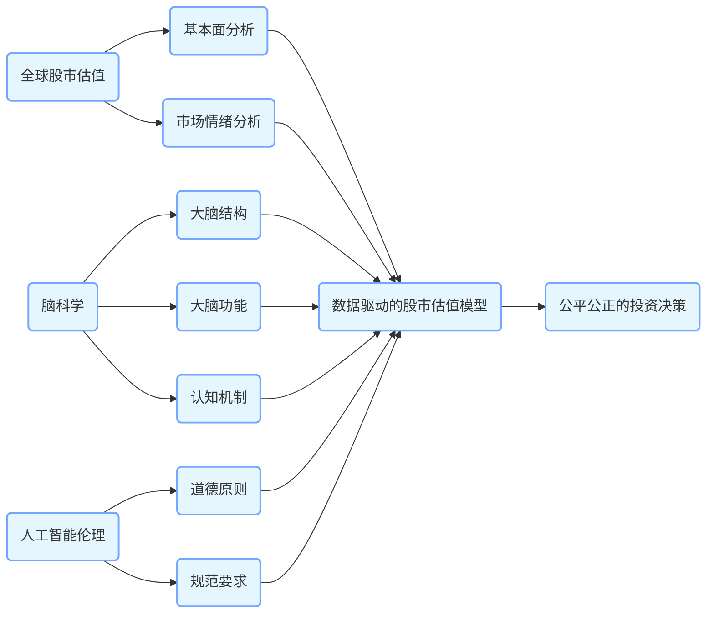

# 全球股市估值与脑科学在人工智能伦理中的应用

> 关键词：全球股市估值、脑科学、人工智能伦理、数据驱动、道德决策

> 摘要：本文旨在探讨全球股市估值与脑科学在人工智能伦理中的创新应用。首先阐述全球股市估值的基本原理与方法，为理解金融市场的运行规律奠定基础。接着深入剖析脑科学的相关理论，揭示大脑认知和决策的机制。然后重点研究如何将脑科学的成果融入人工智能伦理体系，通过数据驱动的方式实现更具道德性和合理性的人工智能决策。同时，结合实际案例说明这一融合在全球股市估值及其他领域的应用效果。最后，对未来的发展趋势和面临的挑战进行分析，为相关领域的研究和实践提供有价值的参考。

## 1. 背景介绍 
### 1.1 目的和范围
本研究的目的在于探索全球股市估值与脑科学在人工智能伦理领域的交叉应用，揭示其内在联系和潜在价值。范围涵盖全球股市估值的基本理论、脑科学的关键概念和方法，以及人工智能伦理的核心原则和实践。通过综合分析这些领域的知识，旨在为金融市场的决策和人工智能的发展提供新的思路和方法。

### 1.2 预期读者
本文预期读者包括金融领域的从业者，如股票分析师、投资经理等，他们可以从脑科学和人工智能伦理的角度获得对股市估值的新见解；人工智能领域的研究人员和开发者，有助于他们在设计和实现人工智能系统时更好地考虑伦理因素；以及对跨学科研究感兴趣的学者和爱好者，了解不同领域之间的融合和创新。

### 1.3 文档结构概述
本文首先介绍全球股市估值和脑科学的背景知识，包括其基本概念、原理和方法。接着探讨两者在人工智能伦理中的应用，分析其内在联系和作用机制。然后通过实际案例展示这一应用的效果和价值。最后对未来的发展趋势和挑战进行展望，提出相应的建议和对策。

### 1.4 术语表
#### 1.4.1 核心术语定义
- **全球股市估值**：对全球范围内股票市场的价值进行评估和预测的过程和方法。
- **脑科学**：研究大脑结构、功能和认知机制的科学领域。
- **人工智能伦理**：探讨人工智能系统在设计、开发和应用过程中应遵循的道德原则和规范。
- **数据驱动**：基于大量数据进行分析和决策的方法和理念。
- **道德决策**：在面临道德困境时，依据一定的道德原则和价值观做出的决策。

#### 1.4.2 相关概念解释
- **股票估值模型**：用于评估股票价值的数学模型，常见的有股息贴现模型、市盈率模型等。
- **大脑神经网络**：大脑中神经元之间相互连接形成的网络，负责信息的传递和处理。
- **人工智能算法**：实现人工智能功能的计算方法，如机器学习算法、深度学习算法等。
- **伦理困境**：在道德选择中面临的冲突和难题，需要权衡不同的道德原则和利益。

#### 1.4.3 缩略词列表
- **AI**：Artificial Intelligence，人工智能
- **ML**：Machine Learning，机器学习
- **DL**：Deep Learning，深度学习
- **PE**：Price-to-Earnings Ratio，市盈率
- **DDM**：Dividend Discount Model，股息贴现模型

## 2. 核心概念与联系 

### 2.1 全球股市估值的原理与方法
全球股市估值是金融领域的重要课题，其目的是评估股票市场的整体价值和风险。常见的估值方法包括基于基本面分析的方法和基于市场情绪分析的方法。

基于基本面分析的方法主要关注公司的财务状况、盈利能力、行业前景等因素。例如，股息贴现模型（DDM）假设股票的价值等于其未来股息的现值之和，通过预测公司的股息增长和贴现率来计算股票的内在价值。市盈率模型（PE）则是通过比较股票的价格与每股收益的比率来评估股票的相对价值。

基于市场情绪分析的方法则考虑投资者的心理和行为因素。投资者的情绪和信心会影响他们的投资决策，从而影响股票市场的价格波动。例如，当投资者对市场前景乐观时，他们会更愿意买入股票，推动股价上涨；反之，当投资者对市场前景悲观时，他们会更倾向于卖出股票，导致股价下跌。

### 2.2 脑科学的关键概念和理论
脑科学是研究大脑结构、功能和认知机制的科学领域。大脑是人体最复杂的器官，由数十亿个神经元组成，这些神经元通过突触相互连接形成复杂的神经网络。

大脑的认知过程包括感知、注意、记忆、思维等多个环节。感知是大脑对外部信息的接收和处理，注意是大脑对特定信息的选择和集中，记忆是大脑对信息的存储和提取，思维是大脑对信息的加工和推理。

大脑的决策机制是一个复杂的过程，涉及多个脑区的协同作用。在决策过程中，大脑会根据不同的信息和目标，权衡不同的选择和后果，最终做出决策。例如，在投资决策中，投资者的大脑会考虑股票的基本面信息、市场情绪信息以及自身的风险偏好等因素，做出买入、卖出或持有股票的决策。

### 2.3 人工智能伦理的核心原则和实践
人工智能伦理是探讨人工智能系统在设计、开发和应用过程中应遵循的道德原则和规范。随着人工智能技术的快速发展，人工智能伦理问题日益受到关注。

人工智能伦理的核心原则包括尊重人类尊严、保护隐私、公平公正、责任追究等。在人工智能系统的设计和开发过程中，需要遵循这些原则，确保人工智能系统的行为符合人类的道德和法律要求。

例如，在设计人工智能投资顾问系统时，需要确保系统的推荐是基于客观、准确的信息，而不是受到偏见或利益的影响。同时，需要保护投资者的隐私，不泄露他们的个人信息和投资决策。

### 2.4 三者之间的联系
全球股市估值、脑科学和人工智能伦理之间存在着密切的联系。全球股市估值需要考虑投资者的心理和行为因素，而脑科学可以为理解投资者的心理和行为提供理论支持。人工智能技术可以用于分析大量的股市数据和投资者行为数据，从而提高股市估值的准确性和效率。

同时，人工智能伦理的原则和规范也适用于股市估值和投资决策。在设计和应用人工智能股市估值模型和投资决策系统时，需要遵循人工智能伦理的原则，确保系统的行为符合道德和法律要求。

例如，脑科学的研究成果可以帮助我们更好地理解投资者的决策过程和心理机制，从而在设计人工智能股市估值模型时，考虑这些因素，提高模型的准确性和可靠性。同时，人工智能伦理的原则可以指导我们在应用这些模型时，确保决策的公平性和公正性，保护投资者的利益。

### 2.5 核心概念原理和架构的文本示意图
全球股市估值、脑科学和人工智能伦理的核心概念原理和架构可以用以下文本示意图表示：

全球股市估值：基于基本面分析和市场情绪分析的方法，评估股票市场的整体价值和风险。

脑科学：研究大脑结构、功能和认知机制，揭示投资者的决策过程和心理机制。

人工智能伦理：探讨人工智能系统在设计、开发和应用过程中应遵循的道德原则和规范。

三者之间的联系：脑科学为全球股市估值提供理论支持，人工智能技术提高股市估值的准确性和效率，人工智能伦理确保股市估值和投资决策的公平性和公正性。

### 2.6 Mermaid 流程图


## 3. 核心算法原理 & 具体操作步骤 

### 3.1 基于数据驱动的全球股市估值算法原理
基于数据驱动的全球股市估值算法主要利用机器学习和深度学习技术，对大量的股市数据进行分析和建模。这些数据包括股票的价格、成交量、财务报表、行业数据等。

机器学习算法可以通过对历史数据的学习，发现数据中的规律和模式，从而预测股票的未来价格和走势。常见的机器学习算法包括线性回归、逻辑回归、决策树、随机森林、支持向量机等。

深度学习算法则是一种更复杂的机器学习算法，它可以自动提取数据中的特征和模式，从而提高预测的准确性和效率。常见的深度学习算法包括人工神经网络、卷积神经网络、循环神经网络等。

以下是一个基于线性回归的全球股市估值算法的 Python 源代码示例：

```python
import pandas as pd
from sklearn.linear_model import LinearRegression
from sklearn.model_selection import train_test_split
from sklearn.metrics import mean_squared_error

# 加载股市数据
data = pd.read_csv('stock_data.csv')

# 提取特征和目标变量
X = data[['feature1', 'feature2', 'feature3']]  # 特征变量
y = data['target']  # 目标变量

# 划分训练集和测试集
X_train, X_test, y_train, y_test = train_test_split(X, y, test_size=0.2, random_state=42)

# 创建线性回归模型
model = LinearRegression()

# 训练模型
model.fit(X_train, y_train)

# 预测
y_pred = model.predict(X_test)

# 评估模型
mse = mean_squared_error(y_test, y_pred)
print('均方误差:', mse)
```

### 3.2 结合脑科学的人工智能伦理决策算法原理
结合脑科学的人工智能伦理决策算法主要考虑人类的认知和决策机制，以及人工智能伦理的原则和规范。该算法通过对人类决策过程的模拟和优化，实现更具道德性和合理性的人工智能决策。

具体步骤如下：
1. **数据收集**：收集与决策相关的各种数据，包括人类的决策行为数据、脑电信号数据、伦理规则数据等。
2. **特征提取**：从收集到的数据中提取与决策相关的特征，例如人类的情绪状态、认知能力、伦理偏好等。
3. **模型训练**：使用机器学习和深度学习算法，对提取的特征进行训练，建立决策模型。
4. **伦理评估**：在决策过程中，根据人工智能伦理的原则和规范，对决策结果进行评估和调整。
5. **决策输出**：输出符合伦理要求的决策结果。

以下是一个简单的结合脑科学的人工智能伦理决策算法的 Python 源代码示例：

```python
import numpy as np

# 定义伦理规则
ethical_rules = {
    'rule1': lambda x: x > 0,  # 示例规则：决策结果必须大于 0
    'rule2': lambda x: x < 10  # 示例规则：决策结果必须小于 10
}

# 定义决策模型
def decision_model(input_data):
    # 简单的线性决策模型
    weights = np.array([0.5, 0.3, 0.2])
    decision = np.dot(input_data, weights)
    return decision

# 定义伦理评估函数
def ethical_evaluation(decision):
    for rule_name, rule_func in ethical_rules.items():
        if not rule_func(decision):
            return False
    return True

# 定义决策过程
def ethical_decision_making(input_data):
    decision = decision_model(input_data)
    if ethical_evaluation(decision):
        return decision
    else:
        # 调整决策结果以符合伦理规则
        while not ethical_evaluation(decision):
            decision = decision * 0.9  # 简单的调整策略
        return decision

# 示例输入数据
input_data = np.array([1, 2, 3])

# 进行伦理决策
final_decision = ethical_decision_making(input_data)
print('最终决策结果:', final_decision)
```

### 3.3 具体操作步骤
#### 3.3.1 数据准备
- 收集全球股市的相关数据，包括股票价格、成交量、财务报表等。
- 收集与脑科学相关的数据，如脑电信号数据、认知行为数据等。
- 收集人工智能伦理的规则和案例数据。

#### 3.3.2 数据预处理
- 对收集到的数据进行清洗，去除缺失值、异常值等。
- 对数据进行标准化、归一化等处理，以提高模型的训练效果。

#### 3.3.3 模型训练
- 根据数据的特点和问题的需求，选择合适的机器学习或深度学习算法。
- 使用训练数据对模型进行训练，调整模型的参数，以提高模型的性能。

#### 3.3.4 模型评估
- 使用测试数据对训练好的模型进行评估，计算模型的准确率、召回率、均方误差等指标。
- 根据评估结果，对模型进行优化和改进。

#### 3.3.5 伦理决策
- 在实际应用中，使用训练好的模型进行决策。
- 在决策过程中，根据人工智能伦理的原则和规范，对决策结果进行评估和调整，确保决策的道德性和合理性。

## 4. 数学模型和公式 & 详细讲解 & 举例说明 

### 4.1 全球股市估值的数学模型和公式
#### 4.1.1 股息贴现模型（DDM）
股息贴现模型是一种基于现金流折现的股票估值模型，其基本思想是股票的价值等于其未来股息的现值之和。

数学公式为：
$$V = \sum_{t=1}^{\infty} \frac{D_t}{(1 + r)^t}$$
其中，$V$ 表示股票的内在价值，$D_t$ 表示第 $t$ 期的股息，$r$ 表示贴现率。

在实际应用中，通常假设股息以固定的增长率 $g$ 增长，则公式可以简化为：
$$V = \frac{D_1}{r - g}$$
其中，$D_1$ 表示下一期的股息。

举例说明：假设某股票下一期的股息为 $2$ 元，股息增长率为 $5\%$，贴现率为 $10\%$，则该股票的内在价值为：
$$V = \frac{2}{0.1 - 0.05} = 40$$（元）

#### 4.1.2 市盈率模型（PE）
市盈率模型是一种基于相对估值的股票估值模型，其基本思想是通过比较股票的价格与每股收益的比率来评估股票的相对价值。

数学公式为：
$$P = PE \times EPS$$
其中，$P$ 表示股票的价格，$PE$ 表示市盈率，$EPS$ 表示每股收益。

举例说明：假设某股票的市盈率为 $20$，每股收益为 $2$ 元，则该股票的价格为：
$$P = 20 \times 2 = 40$$（元）

### 4.2 结合脑科学的人工智能伦理决策的数学模型和公式
#### 4.2.1 基于效用理论的伦理决策模型
效用理论是一种用于决策分析的理论，其基本思想是在面临多个选择时，决策者会选择能够最大化其效用的选项。

在结合脑科学的人工智能伦理决策中，可以将伦理原则和规范转化为效用函数，通过最大化效用函数来实现伦理决策。

数学公式为：
$$\max U(x)$$
其中，$U(x)$ 表示效用函数，$x$ 表示决策变量。

举例说明：假设在一个投资决策中，有两个投资方案 $A$ 和 $B$，其收益和风险分别为 $R_A$、$R_B$ 和 $S_A$、$S_B$。同时，伦理原则要求投资方案的风险不能超过一定的阈值 $S_{max}$。则效用函数可以定义为：
$$U(x) = \begin{cases}
R_A, & \text{if } S_A \leq S_{max} \\
R_B, & \text{if } S_B \leq S_{max} \\
-\infty, & \text{otherwise}
\end{cases}$$
通过比较 $U(A)$ 和 $U(B)$ 的大小，选择效用最大的投资方案。

#### 4.2.2 基于贝叶斯网络的伦理决策模型
贝叶斯网络是一种概率图模型，用于表示变量之间的因果关系和概率分布。

在结合脑科学的人工智能伦理决策中，可以使用贝叶斯网络来表示人类的认知和决策过程，以及伦理规则和案例数据。通过贝叶斯推理，可以计算在不同条件下的决策结果的概率，从而实现伦理决策。

数学公式为：
$$P(X|E) = \frac{P(E|X)P(X)}{\sum_{x} P(E|x)P(x)}$$
其中，$P(X|E)$ 表示在证据 $E$ 下变量 $X$ 的后验概率，$P(E|X)$ 表示在变量 $X$ 下证据 $E$ 的似然概率，$P(X)$ 表示变量 $X$ 的先验概率。

举例说明：假设在一个医疗决策中，有三个变量：疾病 $D$、症状 $S$ 和治疗方案 $T$。通过贝叶斯网络可以表示这三个变量之间的因果关系和概率分布。已知患者的症状 $S$，可以通过贝叶斯推理计算出不同疾病 $D$ 的概率，以及在不同疾病下不同治疗方案 $T$ 的效果和风险。根据伦理原则和患者的偏好，选择最优的治疗方案。

## 5. 项目实战：代码实际案例和详细解释说明 

### 5.1  开发环境搭建
#### 5.1.1 安装 Python
首先需要安装 Python 编程语言，建议使用 Python 3.7 及以上版本。可以从 Python 官方网站（https://www.python.org/downloads/） 下载安装包，按照安装向导进行安装。

#### 5.1.2 安装必要的库
在开发过程中，需要使用一些 Python 库，如 Pandas、NumPy、Scikit-learn、TensorFlow 等。可以使用以下命令进行安装：
```sh
pip install pandas numpy scikit-learn tensorflow
```

#### 5.1.3 配置开发环境
可以使用集成开发环境（IDE），如 PyCharm、Jupyter Notebook 等，来编写和运行代码。以下以 Jupyter Notebook 为例进行配置：
1. 安装 Jupyter Notebook：
```sh
pip install jupyter notebook
```
2. 启动 Jupyter Notebook：
```sh
jupyter notebook
```
3. 在浏览器中打开 Jupyter Notebook 的界面，创建新的 Notebook 文件进行代码编写。

### 5.2  源代码详细实现和代码解读
#### 5.2.1 全球股市估值模型的实现
以下是一个基于机器学习的全球股市估值模型的实现代码：

```python
import pandas as pd
from sklearn.linear_model import LinearRegression
from sklearn.model_selection import train_test_split
from sklearn.metrics import mean_squared_error

# 加载股市数据
data = pd.read_csv('stock_data.csv')

# 提取特征和目标变量
X = data[['feature1', 'feature2', 'feature3']]  # 特征变量
y = data['target']  # 目标变量

# 划分训练集和测试集
X_train, X_test, y_train, y_test = train_test_split(X, y, test_size=0.2, random_state=42)

# 创建线性回归模型
model = LinearRegression()

# 训练模型
model.fit(X_train, y_train)

# 预测
y_pred = model.predict(X_test)

# 评估模型
mse = mean_squared_error(y_test, y_pred)
print('均方误差:', mse)
```

代码解读：
1. **数据加载**：使用 Pandas 库的 `read_csv` 函数加载股市数据文件 `stock_data.csv`。
2. **特征提取**：从数据中提取特征变量 `X` 和目标变量 `y`。
3. **数据集划分**：使用 `train_test_split` 函数将数据集划分为训练集和测试集，其中测试集占比为 $20\%$。
4. **模型创建**：创建一个线性回归模型 `LinearRegression`。
5. **模型训练**：使用训练集数据对模型进行训练，调用 `fit` 方法。
6. **模型预测**：使用训练好的模型对测试集数据进行预测，调用 `predict` 方法。
7. **模型评估**：使用均方误差（MSE）评估模型的性能，调用 `mean_squared_error` 函数。

#### 5.2.2 结合脑科学的人工智能伦理决策模型的实现
以下是一个简单的结合脑科学的人工智能伦理决策模型的实现代码：

```python
import numpy as np

# 定义伦理规则
ethical_rules = {
    'rule1': lambda x: x > 0,  # 示例规则：决策结果必须大于 0
    'rule2': lambda x: x < 10  # 示例规则：决策结果必须小于 10
}

# 定义决策模型
def decision_model(input_data):
    # 简单的线性决策模型
    weights = np.array([0.5, 0.3, 0.2])
    decision = np.dot(input_data, weights)
    return decision

# 定义伦理评估函数
def ethical_evaluation(decision):
    for rule_name, rule_func in ethical_rules.items():
        if not rule_func(decision):
            return False
    return True

# 定义决策过程
def ethical_decision_making(input_data):
    decision = decision_model(input_data)
    if ethical_evaluation(decision):
        return decision
    else:
        # 调整决策结果以符合伦理规则
        while not ethical_evaluation(decision):
            decision = decision * 0.9  # 简单的调整策略
        return decision

# 示例输入数据
input_data = np.array([1, 2, 3])

# 进行伦理决策
final_decision = ethical_decision_making(input_data)
print('最终决策结果:', final_decision)
```

代码解读：
1. **伦理规则定义**：使用字典 `ethical_rules` 定义伦理规则，每个规则是一个匿名函数。
2. **决策模型定义**：定义一个简单的线性决策模型 `decision_model`，通过输入数据和权重的点积计算决策结果。
3. **伦理评估函数定义**：定义一个伦理评估函数 `ethical_evaluation`，用于检查决策结果是否符合伦理规则。
4. **决策过程定义**：定义一个决策过程函数 `ethical_decision_making`，首先调用决策模型计算决策结果，然后调用伦理评估函数进行评估。如果决策结果不符合伦理规则，则进行调整，直到符合规则为止。
5. **示例输入和决策**：定义示例输入数据 `input_data`，调用 `ethical_decision_making` 函数进行伦理决策，输出最终决策结果。

### 5.3  代码解读与分析
#### 5.3.1 全球股市估值模型的分析
- **优点**：线性回归模型简单易懂，计算效率高，适用于处理大规模数据。同时，通过调整特征变量和模型参数，可以对模型进行优化，提高预测的准确性。
- **缺点**：线性回归模型假设特征变量和目标变量之间存在线性关系，对于复杂的非线性关系可能无法准确建模。此外，模型的性能受到数据质量和特征选择的影响较大。

#### 5.3.2 结合脑科学的人工智能伦理决策模型的分析
- **优点**：该模型考虑了伦理规则和决策结果的一致性，通过调整决策结果可以确保决策的道德性和合理性。同时，模型的实现相对简单，易于理解和扩展。
- **缺点**：伦理规则的定义和调整策略可能存在主观性，不同的人可能有不同的理解和判断。此外，模型没有考虑到决策过程中的不确定性和复杂性，对于一些复杂的伦理困境可能无法给出满意的解决方案。

## 6. 实际应用场景 
### 6.1 金融投资决策
在金融投资决策中，全球股市估值和脑科学在人工智能伦理中的应用可以帮助投资者更准确地评估股票的价值和风险，做出更合理的投资决策。

例如，通过结合脑科学的研究成果，了解投资者的心理和行为特点，开发出更符合投资者需求的投资决策模型。同时，在模型的设计和应用过程中，遵循人工智能伦理的原则和规范，确保决策的公平性和公正性，保护投资者的利益。

### 6.2 智能投顾服务
智能投顾服务是一种基于人工智能技术的投资顾问服务，它可以根据投资者的风险偏好、投资目标等因素，为投资者提供个性化的投资建议。

全球股市估值和脑科学在人工智能伦理中的应用可以提高智能投顾服务的质量和效率。例如，通过对全球股市数据的分析和建模，为投资者提供更准确的投资建议。同时，结合脑科学的研究成果，了解投资者的心理和行为特点，优化投资建议的表达方式和内容，提高投资者的满意度。

### 6.3 金融监管
在金融监管中，全球股市估值和脑科学在人工智能伦理中的应用可以帮助监管机构更好地监测金融市场的运行情况，防范金融风险。

例如，通过对全球股市数据的实时监测和分析，及时发现市场异常波动和潜在风险。同时，结合脑科学的研究成果，了解投资者的心理和行为特点，制定更有效的监管政策和措施，引导投资者理性投资，维护金融市场的稳定和健康发展。

### 6.4 人工智能系统的设计和开发
在人工智能系统的设计和开发过程中，全球股市估值和脑科学在人工智能伦理中的应用可以确保系统的行为符合人类的道德和法律要求。

例如，在设计人工智能投资决策系统时，考虑投资者的心理和行为特点，以及人工智能伦理的原则和规范，确保系统的推荐是基于客观、准确的信息，而不是受到偏见或利益的影响。同时，保护投资者的隐私，不泄露他们的个人信息和投资决策。

## 7. 工具和资源推荐
### 7.1 学习资源推荐
#### 7.1.1 书籍推荐
- 《金融市场学》：介绍金融市场的基本原理和运行机制，是学习全球股市估值的基础书籍。
- 《脑与意识》：探讨大脑的认知和意识机制，对于理解脑科学的相关知识有很大帮助。
- 《人工智能伦理》：系统阐述人工智能伦理的原则和规范，是学习人工智能伦理的重要参考书籍。
- 《Python 数据分析实战》：介绍如何使用 Python 进行数据分析和建模，对于实现全球股市估值和人工智能伦理决策模型有很大帮助。

#### 7.1.2 在线课程
- Coursera 上的 “Financial Markets” 课程：由耶鲁大学教授罗伯特·席勒（Robert Shiller）授课，介绍金融市场的基本原理和运行机制。
- edX 上的 “Fundamentals of Brain Science” 课程：由麻省理工学院（MIT）教授神经科学家罗伯特·德西蒙（Robert Desimone）授课，介绍脑科学的基本概念和研究方法。
- Udemy 上的 “Artificial Intelligence Ethics” 课程：介绍人工智能伦理的原则和规范，以及如何在人工智能系统的设计和开发中应用这些原则。
- 中国大学 MOOC 上的 “Python 数据分析与应用” 课程：介绍如何使用 Python 进行数据分析和建模，适合初学者学习。

#### 7.1.3 技术博客和网站
- Medium 上的 “Towards Data Science”：提供关于数据分析、机器学习、人工智能等领域的最新技术和研究成果。
- arXiv 上的 “Neuroscience” 和 “Artificial Intelligence” 板块：提供脑科学和人工智能领域的最新研究论文。
- 金融界网站（https://www.jrj.com.cn/）：提供全球股市的实时行情和分析报告。
- 中国脑科学网（http://www.brainnet.cn/）：提供脑科学领域的最新研究动态和学术交流信息。

### 7.2 开发工具框架推荐
#### 7.2.1 IDE和编辑器
- PyCharm：一款功能强大的 Python 集成开发环境，提供代码编辑、调试、版本控制等功能。
- Jupyter Notebook：一种交互式的开发环境，适合进行数据分析和模型开发，支持多种编程语言。
- Visual Studio Code：一款轻量级的代码编辑器，支持多种编程语言和插件扩展，适合快速开发和调试。

#### 7.2.2 调试和性能分析工具
- PDB：Python 自带的调试工具，可以帮助开发者定位和解决代码中的问题。
- TensorBoard：TensorFlow 提供的可视化工具，可以帮助开发者分析和优化模型的性能。
- Scikit-learn 的 `GridSearchCV` 和 `RandomizedSearchCV`：用于模型调优和参数搜索，可以提高模型的性能。

#### 7.2.3 相关框架和库
- Pandas：用于数据处理和分析的 Python 库，提供高效的数据结构和数据操作方法。
- NumPy：用于科学计算的 Python 库，提供高效的数组操作和数学函数。
- Scikit-learn：用于机器学习的 Python 库，提供各种机器学习算法和工具。
- TensorFlow 和 PyTorch：用于深度学习的开源框架，提供高效的深度学习模型开发和训练工具。

### 7.3 相关论文著作推荐
#### 7.3.1 经典论文
- Fama, E. F., & French, K. R. (1992). The cross-section of expected stock returns. The Journal of Finance, 47(2), 427-465.：提出了著名的 Fama-French 三因子模型，用于解释股票收益率的横截面差异。
- Kahneman, D., & Tversky, A. (1979). Prospect theory: An analysis of decision under risk. Econometrica, 47(2), 263-292.：提出了前景理论，解释了人类在决策过程中的行为偏差。
- Floridi, L., & Sanders, J. W. (2004). On the morality of artificial agents. Minds and Machines, 14(3), 349-379.：探讨了人工智能伦理的基本问题和原则。

#### 7.3.2 最新研究成果
- 近年来，关于全球股市估值、脑科学和人工智能伦理的研究不断涌现。可以通过 arXiv、IEEE Xplore、ACM Digital Library 等学术数据库查找最新的研究论文。

#### 7.3.3 应用案例分析
- 《人工智能时代的金融创新与监管》：介绍了人工智能在金融领域的应用案例和监管实践。
- 《脑机接口技术与应用》：介绍了脑机接口技术的原理和应用案例，对于理解脑科学在人工智能中的应用有很大帮助。

## 8. 总结：未来发展趋势与挑战
### 8.1 未来发展趋势
#### 8.1.1 跨学科融合的深入发展
全球股市估值、脑科学和人工智能伦理的跨学科融合将越来越深入。未来的研究和实践将更加注重不同学科之间的交叉和渗透，充分发挥各学科的优势，实现更高效、更智能、更道德的决策和应用。

#### 8.1.2 数据驱动的决策和应用
随着大数据和人工智能技术的不断发展，数据驱动的决策和应用将成为未来的主流。通过对大量的全球股市数据、脑科学数据和伦理规则数据的分析和建模，可以实现更准确、更智能、更道德的决策和应用。

#### 8.1.3 人工智能伦理的重要性日益凸显
随着人工智能技术的广泛应用，人工智能伦理的重要性日益凸显。未来的研究和实践将更加注重人工智能伦理的原则和规范，确保人工智能系统的行为符合人类的道德和法律要求。

#### 8.1.4 个性化和定制化的服务
未来的金融投资决策和智能投顾服务将更加注重个性化和定制化。通过结合脑科学的研究成果，了解投资者的心理和行为特点，为投资者提供更符合其需求的个性化和定制化的服务。

### 8.2 挑战
#### 8.2.1 数据质量和隐私保护
在数据驱动的决策和应用中，数据质量和隐私保护是重要的挑战。全球股市数据、脑科学数据和伦理规则数据的质量直接影响决策的准确性和可靠性。同时，这些数据涉及到投资者的隐私和敏感信息，需要加强隐私保护和数据安全管理。

#### 8.2.2 伦理规则的制定和执行
人工智能伦理的规则和规范的制定和执行是一个复杂的问题。不同的人对伦理问题的理解和判断可能存在差异，需要制定统一的伦理标准和规范。同时，需要建立有效的监督和执行机制，确保人工智能系统的行为符合伦理要求。

#### 8.2.3 技术的复杂性和可解释性
全球股市估值、脑科学和人工智能伦理的相关技术都具有较高的复杂性。例如，深度学习模型的训练和优化需要大量的计算资源和专业知识。同时，这些模型的决策过程往往难以解释，需要提高模型的可解释性，以便用户更好地理解和信任模型的决策结果。

#### 8.2.4 人才短缺
跨学科融合的研究和实践需要具备多学科知识和技能的人才。目前，全球范围内缺乏既懂金融、又懂脑科学和人工智能伦理的复合型人才，需要加强相关领域的人才培养和教育。

## 9. 附录：常见问题与解答
### 9.1 全球股市估值的方法有哪些？
全球股市估值的方法主要包括基于基本面分析的方法和基于市场情绪分析的方法。基于基本面分析的方法如股息贴现模型、市盈率模型等，通过分析公司的财务状况、盈利能力等因素来评估股票的价值。基于市场情绪分析的方法则考虑投资者的心理和行为因素，如投资者的情绪和信心会影响股票市场的价格波动。

### 9.2 脑科学与人工智能有什么关系？
脑科学为人工智能的发展提供了重要的理论支持和灵感来源。脑科学的研究成果可以帮助我们更好地理解人类的认知和决策机制，从而在人工智能系统的设计和开发中模拟人类的智能行为。例如，深度学习算法的发展就受到了大脑神经网络的启发。

### 9.3 人工智能伦理的核心原则有哪些？
人工智能伦理的核心原则包括尊重人类尊严、保护隐私、公平公正、责任追究等。在人工智能系统的设计、开发和应用过程中，需要遵循这些原则，确保人工智能系统的行为符合人类的道德和法律要求。

### 9.4 如何确保人工智能系统的决策符合伦理要求？
可以通过以下几种方式确保人工智能系统的决策符合伦理要求：
1. **明确伦理规则**：在系统设计和开发过程中，明确伦理规则和规范，并将其融入到系统的算法和模型中。
2. **进行伦理评估**：在决策过程中，对决策结果进行伦理评估，检查其是否符合伦理规则。
3. **建立监督机制**：建立有效的监督机制，对人工智能系统的行为进行监督和管理，及时发现和纠正不符合伦理要求的行为。
4. **提高透明度和可解释性**：提高人工智能系统的透明度和可解释性，让用户能够理解系统的决策过程和依据，从而更好地判断决策是否符合伦理要求。

### 9.5 全球股市估值、脑科学和人工智能伦理的跨学科研究有什么意义？
全球股市估值、脑科学和人工智能伦理的跨学科研究具有重要的意义。通过跨学科研究，可以充分发挥各学科的优势，实现更高效、更智能、更道德的决策和应用。例如，在金融投资决策中，结合脑科学的研究成果可以更好地理解投资者的心理和行为特点，提高决策的准确性和合理性；同时，遵循人工智能伦理的原则和规范可以确保决策的公平性和公正性，保护投资者的利益。

## 10. 扩展阅读 & 参考资料
### 10.1 扩展阅读
- 《思考，快与慢》：作者丹尼尔·卡尼曼（Daniel Kahneman）是行为经济学领域的先驱，该书介绍了人类思维的两种模式：快思考和慢思考，以及它们在决策过程中的作用。
- 《人类简史：从动物到上帝》：作者尤瓦尔·赫拉利（Yuval Noah Harari）以全新的视角讲述了人类的历史，探讨了人类的认知革命、农业革命和科学革命对人类社会的影响。
- 《奇点临近》：作者雷·库兹韦尔（Ray Kurzweil）预测了人工智能和技术发展的未来趋势，提出了奇点的概念，即技术发展将达到一个临界点，之后人工智能将超越人类智能。

### 10.2 参考资料
- Fama, E. F., & French, K. R. (1992). The cross-section of expected stock returns. The Journal of Finance, 47(2), 427-465.
- Kahneman, D., & Tversky, A. (1979). Prospect theory: An analysis of decision under risk. Econometrica, 47(2), 263-292.
- Floridi, L., & Sanders, J. W. (2004). On the morality of artificial agents. Minds and Machines, 14(3), 349-379.
- 相关的学术论文、研究报告、技术文档等。