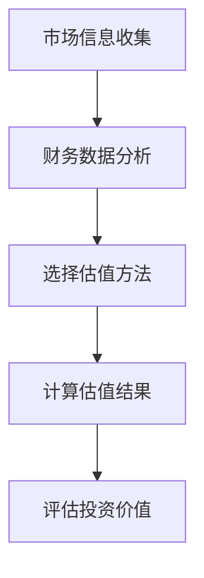
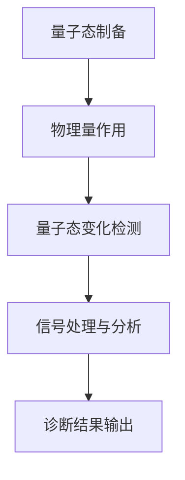

# 全球股市估值与量子传感器在医疗诊断中的应用

> 关键词：全球股市估值、量子传感器、医疗诊断、估值模型、传感器原理

> 摘要：本文聚焦于两个看似不相关却又在科技与金融领域各自占据重要地位的主题——全球股市估值和量子传感器在医疗诊断中的应用。在全球股市估值部分，深入探讨了股市估值的多种方法、影响因素以及其在金融市场中的重要性。而对于量子传感器在医疗诊断中的应用，详细介绍了量子传感器的原理、技术特点以及其在医疗领域所带来的创新变革。通过对这两个领域的研究，旨在为读者提供全面而深入的知识，帮助读者理解科技与金融之间的潜在联系以及它们各自的发展趋势和应用前景。

## 1. 背景介绍 
### 1.1 目的和范围
本文章的目的在于全面且深入地探讨全球股市估值和量子传感器在医疗诊断中的应用这两个不同但极具影响力的领域。对于全球股市估值，我们将研究其理论基础、常见的估值方法、影响估值的各种因素以及在实际金融市场中的应用和意义。而对于量子传感器在医疗诊断中的应用，我们将聚焦于量子传感器的原理、技术优势以及其在医疗诊断各个环节中的具体应用案例和未来发展潜力。通过这样的研究，希望能为投资者、医疗从业者、科研人员以及对相关领域感兴趣的读者提供有价值的参考和见解。

### 1.2 预期读者
本文预期读者包括金融领域的投资者、分析师、研究人员，他们可以从全球股市估值的研究中获取新的思路和方法，以辅助投资决策和市场分析。医疗行业的从业者，如医生、医学研究人员和医疗器械研发人员，能从量子传感器在医疗诊断中的应用部分了解到最新的技术动态和潜在的应用前景。同时，对科技和金融领域感兴趣的普通读者也可以通过本文初步了解这两个领域的核心知识和发展趋势。

### 1.3 文档结构概述
本文首先对全球股市估值和量子传感器在医疗诊断中的应用这两个主题的背景进行介绍，明确目的、读者对象和文档结构。接着分别深入探讨两个主题的核心概念与联系，包括其原理、架构和相互之间可能存在的潜在联系。然后详细阐述各自的核心算法原理、具体操作步骤、数学模型和公式，并通过举例进行说明。在项目实战部分，给出相关的代码实际案例并进行详细解释。之后介绍实际应用场景，为读者展示这两个领域在现实世界中的具体应用。再推荐相关的工具和资源，包括学习资源、开发工具框架和相关论文著作。最后对未来发展趋势与挑战进行总结，并在附录中解答常见问题，提供扩展阅读和参考资料。

### 1.4 术语表
#### 1.4.1 核心术语定义
- **全球股市估值**：指对全球范围内各个股票市场中的上市公司的价值进行评估和测算的过程和方法，以确定股票的合理价格和投资价值。
- **量子传感器**：基于量子力学原理设计和制造的传感器，利用量子态的特性来实现对物理量的高精度测量和感知。
- **医疗诊断**：通过各种检查手段和方法，对患者的疾病进行识别、判断和确定的过程。

#### 1.4.2 相关概念解释
- **股市估值模型**：是用于计算股票价值的数学模型，常见的有股息贴现模型、市盈率模型等，通过对公司的财务数据、盈利预期等因素进行分析和计算，来评估股票的内在价值。
- **量子态**：量子系统的一种状态，具有叠加、纠缠等特殊性质，这些性质使得量子传感器能够实现传统传感器无法达到的高精度测量。
- **医疗影像诊断**：利用各种医学影像技术，如X光、CT、MRI等，对患者的身体内部结构和病变情况进行观察和分析，以辅助疾病的诊断。

#### 1.4.3 缩略词列表
- **DCF**：Discounted Cash Flow，现金流贴现模型，一种常见的股市估值方法。
- **MRI**：Magnetic Resonance Imaging，磁共振成像，一种医疗影像诊断技术。
- **MEMS**：Micro-Electro-Mechanical Systems，微机电系统，与传感器技术相关的一种制造技术。

## 2. 核心概念与联系 

### 全球股市估值核心概念
全球股市估值是金融领域的重要研究内容，其核心目标是确定股票的合理价值，为投资者提供投资决策的依据。常见的股市估值方法包括相对估值法和绝对估值法。相对估值法通过比较同行业或类似公司的估值指标，如市盈率（P/E）、市净率（P/B）等，来评估目标公司的价值。绝对估值法主要基于公司的未来现金流或股息，通过贴现的方式计算公司的内在价值，如股息贴现模型（DDM）和现金流贴现模型（DCF）。

其架构可以表示为：市场信息收集 -> 财务数据分析 -> 选择估值方法 -> 计算估值结果 -> 评估投资价值。

以下是对应的 Mermaid 流程图：


### 量子传感器在医疗诊断中的核心概念
量子传感器是利用量子力学原理实现对物理量高精度测量的传感器。在医疗诊断中，量子传感器可以用于检测生物分子、生理信号、磁场变化等多种信息。其原理基于量子态的特性，如量子叠加和量子纠缠。当外界物理量作用于量子传感器时，会引起量子态的变化，通过检测这种变化就可以实现对物理量的测量。

其架构可以表示为：量子态制备 -> 物理量作用 -> 量子态变化检测 -> 信号处理与分析 -> 诊断结果输出。

以下是对应的 Mermaid 流程图：


### 两者的联系
虽然全球股市估值和量子传感器在医疗诊断中的应用看似没有直接联系，但实际上在某些方面存在潜在的关联。例如，量子传感器技术的发展和应用可能会推动医疗行业的创新和发展，从而影响相关医疗企业的业绩和前景，进而对股市中医疗板块的估值产生影响。另一方面，金融市场的资金流向和投资者情绪也可能会影响对量子传感器等新兴技术的研发投入和商业化进程。

## 3. 核心算法原理 & 具体操作步骤 

### 全球股市估值核心算法原理及步骤

#### 股息贴现模型（DDM）原理
股息贴现模型基于股票的内在价值等于其未来股息的现值之和的理论。假设股票的股息以固定增长率 $g$ 增长，必要收益率为 $r$，第 $n$ 期的股息为 $D_n$，则股票的内在价值 $V$ 可以表示为：
$V = \frac{D_1}{r - g}$
其中 $D_1$ 为下一期的股息。

#### Python 代码实现
```python
def ddm_valuation(D1, r, g):
    """
    股息贴现模型计算股票价值
    :param D1: 下一期股息
    :param r: 必要收益率
    :param g: 股息增长率
    :return: 股票内在价值
    """
    if r <= g:
        raise ValueError("必要收益率必须大于股息增长率")
    return D1 / (r - g)

# 示例参数
D1 = 2
r = 0.1
g = 0.05

# 计算股票价值
value = ddm_valuation(D1, r, g)
print(f"股票内在价值: {value}")
```

#### 操作步骤
1. 收集公司的股息历史数据，分析股息的增长趋势，确定股息增长率 $g$。
2. 根据市场情况和公司的风险水平，确定必要收益率 $r$。
3. 预测下一期的股息 $D_1$。
4. 将 $D_1$、$r$ 和 $g$ 代入股息贴现模型公式，计算股票的内在价值。

### 量子传感器信号处理算法原理及步骤

#### 原理
量子传感器检测到的信号通常是微弱的量子态变化信号，需要进行放大、滤波和特征提取等处理。一种常见的方法是采用小波变换进行信号滤波和特征提取。小波变换可以将信号分解为不同尺度和频率的分量，通过选择合适的小波基和分解层数，可以去除噪声并提取有用的信号特征。

#### Python 代码实现
```python
import pywt
import numpy as np

def wavelet_denoise(signal, wavelet='db4', level=3):
    """
    小波变换去噪
    :param signal: 输入信号
    :param wavelet: 小波基
    :param level: 分解层数
    :return: 去噪后的信号
    """
    # 小波分解
    coeffs = pywt.wavedec(signal, wavelet, level=level)
    # 阈值处理
    threshold = np.std(coeffs[-1]) * np.sqrt(2 * np.log(len(signal)))
    coeffs[1:] = (pywt.threshold(i, value=threshold, mode='soft') for i in coeffs[1:])
    # 小波重构
    return pywt.waverec(coeffs, wavelet)

# 示例信号
signal = np.random.randn(100)
denoised_signal = wavelet_denoise(signal)
print(f"去噪后的信号: {denoised_signal}")
```

#### 操作步骤
1. 采集量子传感器的原始信号。
2. 选择合适的小波基和分解层数。
3. 对原始信号进行小波分解，得到不同尺度和频率的系数。
4. 对分解后的系数进行阈值处理，去除噪声。
5. 对处理后的系数进行小波重构，得到去噪后的信号。

## 4. 数学模型和公式 & 详细讲解 & 举例说明 

### 全球股市估值数学模型和公式

#### 市盈率模型
市盈率（P/E）是最常用的相对估值指标之一，其计算公式为：
$P/E = \frac{股价}{每股收益}$
通过比较目标公司的市盈率与同行业平均市盈率或类似公司的市盈率，可以评估目标公司的估值水平。如果目标公司的市盈率低于同行业平均市盈率，则可能被低估；反之，则可能被高估。

举例说明：假设某公司的股价为 50 元，每股收益为 5 元，则该公司的市盈率为：
$P/E = \frac{50}{5} = 10$
如果同行业平均市盈率为 15，则该公司可能被低估。

#### 现金流贴现模型（DCF）
现金流贴现模型基于公司的未来自由现金流，通过贴现的方式计算公司的内在价值。其基本公式为：
$V = \sum_{t=1}^{n} \frac{FCF_t}{(1 + r)^t} + \frac{TV}{(1 + r)^n}$
其中 $V$ 为公司的内在价值，$FCF_t$ 为第 $t$ 期的自由现金流，$r$ 为贴现率，$TV$ 为终值，$n$ 为预测期数。

举例说明：假设某公司未来 5 年的自由现金流分别为 100 万元、120 万元、140 万元、160 万元、180 万元，贴现率为 10%，终值为 1000 万元，则该公司的内在价值为：
$V = \frac{100}{(1 + 0.1)^1} + \frac{120}{(1 + 0.1)^2} + \frac{140}{(1 + 0.1)^3} + \frac{160}{(1 + 0.1)^4} + \frac{180}{(1 + 0.1)^5} + \frac{1000}{(1 + 0.1)^5} \approx 1028.57$（万元）

### 量子传感器数学模型和公式

#### 量子比特测量模型
在量子传感器中，常用量子比特来表示量子态。量子比特可以处于叠加态，其状态可以用一个二维复向量表示：
$\vert\psi\rangle = \alpha\vert0\rangle + \beta\vert1\rangle$
其中 $\alpha$ 和 $\beta$ 是复数，且满足 $\vert\alpha\vert^2 + \vert\beta\vert^2 = 1$。当对量子比特进行测量时，测量结果为 $\vert0\rangle$ 的概率为 $\vert\alpha\vert^2$，测量结果为 $\vert1\rangle$ 的概率为 $\vert\beta\vert^2$。

举例说明：假设量子比特的状态为 $\vert\psi\rangle = \frac{1}{\sqrt{2}}\vert0\rangle + \frac{1}{\sqrt{2}}\vert1\rangle$，则测量结果为 $\vert0\rangle$ 的概率为 $\vert\frac{1}{\sqrt{2}}\vert^2 = \frac{1}{2}$，测量结果为 $\vert1\rangle$ 的概率也为 $\frac{1}{2}$。

#### 量子纠缠模型
量子纠缠是量子传感器中的重要特性之一。考虑两个纠缠的量子比特 $\vert\psi_{AB}\rangle$，其状态可以表示为：
$\vert\psi_{AB}\rangle = \frac{1}{\sqrt{2}}(\vert0_A0_B\rangle + \vert1_A1_B\rangle)$
其中 $A$ 和 $B$ 表示两个不同的量子比特。当对其中一个量子比特进行测量时，另一个量子比特的状态会瞬间确定。

举例说明：如果对量子比特 $A$ 进行测量，结果为 $\vert0\rangle$，则量子比特 $B$ 的状态也会确定为 $\vert0\rangle$；如果测量结果为 $\vert1\rangle$，则量子比特 $B$ 的状态会确定为 $\vert1\rangle$。

## 5. 项目实战：代码实际案例和详细解释说明 

### 5.1  开发环境搭建

#### 全球股市估值项目
- **编程语言**：Python 3.x
- **开发环境**：可以选择 Anaconda 集成开发环境，它包含了许多常用的科学计算库。
- **必要库**：`pandas` 用于数据处理和分析，`numpy` 用于数值计算，`matplotlib` 用于数据可视化。可以使用以下命令安装：
```sh
pip install pandas numpy matplotlib
```

#### 量子传感器信号处理项目
- **编程语言**：Python 3.x
- **开发环境**：同样可以使用 Anaconda 集成开发环境。
- **必要库**：`pywt` 用于小波变换，`scipy` 用于科学计算。可以使用以下命令安装：
```sh
pip install pywt scipy
```

### 5.2  源代码详细实现和代码解读

#### 全球股市估值项目代码实现
```python
import pandas as pd
import numpy as np
import matplotlib.pyplot as plt

# 模拟股票数据
data = {
    '股票代码': ['000001', '000002', '000003'],
    '股价': [10, 20, 30],
    '每股收益': [1, 2, 3]
}
df = pd.DataFrame(data)

# 计算市盈率
df['市盈率'] = df['股价'] / df['每股收益']

# 绘制市盈率柱状图
plt.bar(df['股票代码'], df['市盈率'])
plt.xlabel('股票代码')
plt.ylabel('市盈率')
plt.title('股票市盈率')
plt.show()

print(df)
```

#### 代码解读
1. **数据模拟**：使用 `pandas` 库创建一个包含股票代码、股价和每股收益的 DataFrame。
2. **市盈率计算**：通过将股价除以每股收益，计算出每只股票的市盈率，并将结果添加到 DataFrame 中。
3. **数据可视化**：使用 `matplotlib` 库绘制市盈率的柱状图，直观展示不同股票的市盈率情况。
4. **结果输出**：打印包含市盈率信息的 DataFrame。

#### 量子传感器信号处理项目代码实现
```python
import pywt
import numpy as np
import matplotlib.pyplot as plt

# 生成模拟信号
t = np.linspace(0, 1, 1000)
signal = np.sin(2 * np.pi * 10 * t) + 0.5 * np.sin(2 * np.pi * 20 * t)
noisy_signal = signal + 0.2 * np.random.randn(len(t))

# 小波去噪
denoised_signal = wavelet_denoise(noisy_signal)

# 绘制原始信号、含噪信号和去噪信号
plt.figure(figsize=(12, 8))
plt.subplot(3, 1, 1)
plt.plot(t, signal)
plt.title('原始信号')
plt.subplot(3, 1, 2)
plt.plot(t, noisy_signal)
plt.title('含噪信号')
plt.subplot(3, 1, 3)
plt.plot(t, denoised_signal)
plt.title('去噪信号')
plt.tight_layout()
plt.show()
```

#### 代码解读
1. **信号生成**：使用 `numpy` 库生成一个包含两个正弦波的模拟信号，并添加高斯噪声。
2. **小波去噪**：调用之前定义的 `wavelet_denoise` 函数对含噪信号进行去噪处理。
3. **数据可视化**：使用 `matplotlib` 库绘制原始信号、含噪信号和去噪信号的图像，直观展示去噪效果。

### 5.3  代码解读与分析

#### 全球股市估值项目
- **优点**：代码简单易懂，使用 `pandas` 库可以方便地进行数据处理和分析，`matplotlib` 库可以直观地展示数据。
- **局限性**：模拟数据只是简单示例，实际应用中需要从真实数据源获取数据，并且市盈率模型只是一种相对估值方法，有一定的局限性。

#### 量子传感器信号处理项目
- **优点**：小波去噪算法可以有效去除信号中的噪声，`pywt` 库提供了方便的小波变换功能，`matplotlib` 库可以直观地展示去噪效果。
- **局限性**：小波基和分解层数的选择需要根据具体信号进行调整，不同的选择可能会影响去噪效果。

## 6. 实际应用场景 

### 全球股市估值的实际应用场景
- **投资决策**：投资者可以通过对全球股市中不同股票的估值分析，选择被低估的股票进行投资，以获取更高的收益。例如，在分析某行业的股票时，通过比较不同公司的市盈率、市净率等估值指标，选择估值相对较低且具有良好发展前景的公司进行投资。
- **风险管理**：金融机构和投资者可以通过股市估值来评估投资组合的风险。如果投资组合中大部分股票的估值过高，可能面临较大的下跌风险，此时可以调整投资组合，降低风险。
- **公司并购**：在公司并购过程中，需要对目标公司进行估值，以确定合理的收购价格。通过股市估值方法，可以评估目标公司的内在价值，为并购决策提供依据。

### 量子传感器在医疗诊断中的实际应用场景
- **疾病早期诊断**：量子传感器可以检测生物分子的微小变化，如肿瘤标志物的浓度变化，从而实现疾病的早期诊断。例如，通过检测血液中特定蛋白质的含量，可以早期发现癌症等疾病。
- **神经活动监测**：量子传感器可以检测神经活动产生的微弱磁场变化，用于监测大脑的神经活动。这对于神经系统疾病的诊断和研究具有重要意义，如癫痫、帕金森病等。
- **药物研发**：在药物研发过程中，量子传感器可以用于监测药物与生物分子的相互作用，评估药物的疗效和安全性。例如，通过检测药物对细胞内生物分子的影响，筛选出更有效的药物。

## 7. 工具和资源推荐
### 7.1 学习资源推荐
#### 7.1.1 书籍推荐
- 《金融市场学》：全面介绍金融市场的基本理论和实践，包括股票市场、债券市场等，对于理解全球股市估值的背景和原理有很大帮助。
- 《量子力学》：系统阐述量子力学的基本概念和理论，是学习量子传感器原理的基础书籍。
- 《医疗设备原理与设计》：介绍医疗设备的基本原理和设计方法，对于了解量子传感器在医疗诊断中的应用有参考价值。

#### 7.1.2 在线课程
- Coursera 上的“金融市场分析”课程：由知名教授授课，讲解金融市场的分析方法和工具，包括股市估值的相关内容。
- edX 上的“量子物理学基础”课程：深入讲解量子物理学的基础知识，为学习量子传感器提供理论支持。
- 中国大学 MOOC 上的“医学传感器技术”课程：介绍医学传感器的原理、应用和发展趋势，包括量子传感器在医疗领域的应用。

#### 7.1.3 技术博客和网站
- 雪球网：是一个专注于股票投资的社区，有大量的股票分析文章和讨论，对于学习全球股市估值和投资策略有很大帮助。
- 量子比特网：专注于量子科技领域的资讯和技术分享，提供量子传感器等量子技术的最新发展动态。
- 丁香园：是医疗行业的专业网站，有丰富的医学知识和临床经验分享，对于了解医疗诊断和量子传感器在医疗中的应用有参考价值。

### 7.2 开发工具框架推荐
#### 7.2.1 IDE和编辑器
- PyCharm：是一款功能强大的 Python 集成开发环境，提供代码编辑、调试、版本控制等功能，适合开发全球股市估值和量子传感器信号处理相关的 Python 代码。
- Jupyter Notebook：是一个交互式的开发环境，支持多种编程语言，适合进行数据探索、代码演示和实验，对于学习和实践相关算法很有帮助。

#### 7.2.2 调试和性能分析工具
- `pdb`：Python 自带的调试工具，可以帮助开发者在代码中设置断点、单步执行等，方便调试代码。
- `cProfile`：Python 内置的性能分析工具，可以分析代码的运行时间和函数调用次数，帮助优化代码性能。

#### 7.2.3 相关框架和库
- `pandas`：是 Python 中用于数据处理和分析的强大库，提供了 DataFrame 等数据结构，方便处理股票数据和量子传感器信号数据。
- `numpy`：是 Python 中用于数值计算的基础库，提供了高效的数组操作和数学函数，在股市估值和信号处理中都有广泛应用。
- `pywt`：是 Python 中用于小波变换的库，提供了多种小波基和分解方法，可用于量子传感器信号的去噪和特征提取。

### 7.3 相关论文著作推荐
#### 7.3.1 经典论文
- Fama, E. F., & French, K. R. (1992). The cross-section of expected stock returns. The Journal of Finance, 47(2), 427-465. 该论文提出了著名的 Fama-French 三因子模型，对股市估值和资产定价理论有重要贡献。
- Schrodinger, E. (1935). Die gegenwärtige Situation in der Quantenmechanik. Naturwissenschaften, 23(48), 807-812. 薛定谔的这篇论文提出了著名的“薛定谔的猫”思想实验，对量子力学的发展和理解有深远影响。

#### 7.3.2 最新研究成果
- 关注《Nature》《Science》等顶级学术期刊，以及《Physical Review Letters》《Journal of Finance》等专业期刊上关于量子传感器和全球股市估值的最新研究论文，了解最新的研究动态和技术进展。

#### 7.3.3 应用案例分析
- 一些行业报告和研究机构发布的关于量子传感器在医疗诊断中的应用案例分析，以及金融机构发布的关于全球股市估值的投资策略和案例分析，可以为实际应用提供参考和借鉴。

## 8. 总结：未来发展趋势与挑战

### 全球股市估值的未来发展趋势与挑战
#### 发展趋势
- **智能化和自动化**：随着人工智能和大数据技术的发展，股市估值将越来越多地采用智能化和自动化的方法。通过机器学习和深度学习算法，可以对大量的市场数据和公司信息进行分析和处理，提高估值的准确性和效率。
- **全球化和多元化**：全球股市的联系越来越紧密，投资者的投资范围也越来越广泛。未来的股市估值需要考虑全球市场的因素，包括不同国家和地区的经济、政治、文化等因素，以及不同行业和公司的特点，实现多元化的估值。
- **跨学科融合**：股市估值将与其他学科，如物理学、生物学、心理学等进行更深入的融合。例如，借鉴量子力学的思想和方法，可能会为股市估值带来新的思路和方法。

#### 挑战
- **数据质量和可靠性**：股市估值需要大量的市场数据和公司信息，数据的质量和可靠性直接影响估值的准确性。然而，数据的获取、整理和分析过程中可能存在误差和噪声，如何提高数据的质量和可靠性是一个挑战。
- **市场不确定性**：股市是一个复杂的系统，受到多种因素的影响，如经济形势、政策变化、投资者情绪等。市场的不确定性增加了股市估值的难度，如何准确地预测市场走势和公司业绩是一个挑战。
- **模型的局限性**：现有的股市估值模型都有一定的局限性，不能完全准确地反映股票的真实价值。如何改进和创新估值模型，提高模型的适应性和准确性是一个挑战。

### 量子传感器在医疗诊断中的未来发展趋势与挑战
#### 发展趋势
- **小型化和集成化**：未来的量子传感器将越来越小型化和集成化，可以实现更便捷的医疗诊断。例如，将量子传感器集成到可穿戴设备中，实现实时、连续的健康监测。
- **多模态检测**：量子传感器将与其他检测技术，如光学检测、电学检测等相结合，实现多模态检测。通过多种检测手段的互补，可以提高医疗诊断的准确性和可靠性。
- **个性化医疗**：量子传感器可以检测个体生物分子的差异，为个性化医疗提供支持。根据个体的基因信息、生理状态等，制定个性化的治疗方案，提高治疗效果。

#### 挑战
- **技术成熟度**：量子传感器技术还处于发展阶段，存在技术稳定性和可靠性等问题。如何提高量子传感器的技术成熟度，降低成本，是实现其大规模应用的关键。
- **生物兼容性**：量子传感器在医疗诊断中的应用需要与生物组织和细胞具有良好的兼容性，避免对生物组织造成损伤。如何提高量子传感器的生物兼容性是一个挑战。
- **伦理和法律问题**：量子传感器在医疗诊断中的应用可能会涉及到伦理和法律问题，如个人隐私保护、数据安全等。如何制定相应的伦理和法律规范，保障患者的权益是一个挑战。

## 9. 附录：常见问题与解答

### 全球股市估值常见问题
- **问**：不同的股市估值方法有什么优缺点？
**答**：相对估值法简单易懂，容易计算，但比较依赖同行业或类似公司的可比性，可能存在局限性。绝对估值法考虑了公司的未来现金流和股息，但需要对未来进行预测，预测的准确性会影响估值结果。

- **问**：如何确定股息增长率和必要收益率？
**答**：股息增长率可以通过分析公司的历史股息数据和未来发展前景来确定。必要收益率可以根据市场情况、公司的风险水平和投资者的要求来确定，通常可以参考无风险利率和风险溢价。

### 量子传感器在医疗诊断中常见问题
- **问**：量子传感器与传统传感器有什么区别？
**答**：量子传感器基于量子力学原理，利用量子态的特性实现对物理量的高精度测量，具有更高的灵敏度和分辨率。而传统传感器通常基于经典物理原理，测量精度相对较低。

- **问**：量子传感器在医疗诊断中的应用面临哪些技术难题？
**答**：主要面临技术稳定性和可靠性问题、生物兼容性问题、量子态的控制和测量问题等。如何解决这些技术难题，是实现量子传感器在医疗诊断中大规模应用的关键。

## 10. 扩展阅读 & 参考资料
- 博迪, 凯恩, 马库斯. 《投资学》. 机械工业出版社.
- 格里菲斯. 《量子力学概论》. 机械工业出版社.
- 百度学术、谷歌学术等学术搜索引擎，可查找相关的学术论文和研究报告。
- 金融时报、华尔街日报等财经媒体，可获取全球股市的最新动态和分析。
- 科学网、中国科技论文在线等科技媒体，可了解量子传感器等科技领域的最新进展。