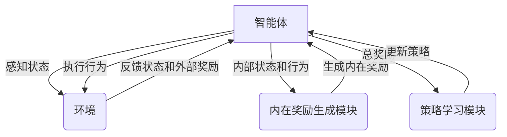

# 内在奖励机制设计:驱动AI自主探索学习

> 关键词：内在奖励机制、AI、自主探索学习、强化学习、奖励函数、智能体、环境交互

> 摘要：本文聚焦于内在奖励机制在驱动AI自主探索学习方面的重要作用。首先介绍了相关背景，包括目的、预期读者、文档结构等内容。接着深入探讨了内在奖励机制的核心概念与联系，详细阐述其原理和架构，并通过Mermaid流程图直观展示。在核心算法原理部分，使用Python源代码进行详细阐述。同时给出了相关的数学模型和公式，并举例说明。通过项目实战，展示代码实际案例并进行详细解释。分析了内在奖励机制的实际应用场景，推荐了相关的工具和资源。最后总结未来发展趋势与挑战，解答常见问题并提供扩展阅读与参考资料，旨在全面深入地介绍内在奖励机制如何驱动AI自主探索学习。

## 1. 背景介绍 
### 1.1 目的和范围
在人工智能的发展历程中，实现AI的自主探索学习一直是重要的研究目标。传统的监督学习需要大量的标注数据，而在许多复杂的现实场景中，获取这些标注数据是困难且昂贵的。强化学习虽然在一定程度上能够让智能体通过与环境的交互来学习，但往往依赖于外部给定的明确奖励信号。内在奖励机制的出现，为解决这些问题提供了新的思路。其目的在于设计一种机制，使AI能够在没有外部明确奖励的情况下，自主地探索环境、发现新的知识和技能，从而提高其学习的自主性和泛化能力。

本文的范围涵盖了内在奖励机制的基本概念、核心算法原理、数学模型、实际应用场景等多个方面。通过理论分析和实际案例相结合的方式，全面深入地探讨内在奖励机制如何驱动AI自主探索学习。

### 1.2 预期读者
本文预期读者包括人工智能领域的研究人员、开发者、学生以及对AI自主学习感兴趣的技术爱好者。对于研究人员来说，本文可以提供关于内在奖励机制的最新研究进展和理论基础；对于开发者而言，能够学习到具体的算法实现和项目实践经验；对于学生来说，有助于他们理解AI自主探索学习的基本概念和方法；对于技术爱好者，可以让他们了解到AI领域的前沿技术和发展趋势。

### 1.3 文档结构概述
本文将按照以下结构进行组织：首先介绍内在奖励机制的背景信息，包括目的、预期读者和文档结构等内容。接着深入探讨核心概念与联系，通过文本示意图和Mermaid流程图展示其原理和架构。然后详细阐述核心算法原理，并使用Python源代码进行具体实现。之后给出相关的数学模型和公式，并举例说明。通过项目实战展示代码实际案例并进行详细解释。分析内在奖励机制的实际应用场景，推荐相关的工具和资源。最后总结未来发展趋势与挑战，解答常见问题并提供扩展阅读与参考资料。

### 1.4 术语表
#### 1.4.1 核心术语定义
- **内在奖励机制**：一种在智能体与环境交互过程中，基于智能体自身的内部状态和行为产生的奖励信号机制，用于驱动智能体自主探索和学习。
- **AI（人工智能）**：研究、开发用于模拟、延伸和扩展人的智能的理论、方法、技术及应用系统的一门新的技术科学。
- **自主探索学习**：智能体在没有外部明确指导的情况下，主动地与环境进行交互，发现新的知识和技能的学习方式。
- **强化学习**：一种通过智能体与环境进行交互，根据环境反馈的奖励信号来学习最优行为策略的机器学习方法。
- **智能体**：能够感知环境状态，并根据一定的策略做出行为决策的实体。
- **环境**：智能体所处的外部世界，智能体通过与环境的交互来获取信息和执行行为。

#### 1.4.2 相关概念解释
- **奖励函数**：在强化学习中，用于量化智能体行为好坏的函数。外部奖励函数通常由任务设计者根据任务目标设定，而内在奖励函数则是基于智能体自身的内部状态和行为产生。
- **策略**：智能体根据当前环境状态选择行为的规则。在强化学习中，策略通常是一个从环境状态到行为的映射。
- **状态空间**：环境中所有可能状态的集合。智能体在与环境交互过程中，会处于不同的状态。
- **动作空间**：智能体所有可能采取的行为的集合。智能体根据当前状态从动作空间中选择一个行为执行。

#### 1.4.3 缩略词列表
- **AI**：Artificial Intelligence（人工智能）
- **RL**：Reinforcement Learning（强化学习）

## 2. 核心概念与联系 

### 核心概念原理
内在奖励机制的核心思想是在智能体与环境交互过程中，引入一种基于智能体自身内部状态和行为的奖励信号，以驱动智能体自主地探索环境。与传统的外部奖励机制不同，内在奖励机制不依赖于外部任务设计者给定的明确奖励信号，而是让智能体根据自身的好奇心、探索欲望等内在因素来学习。

例如，在一个未知的迷宫环境中，智能体如果仅仅依靠外部奖励（如到达迷宫出口获得奖励），可能会陷入局部最优解，只探索到通往出口的部分路径。而引入内在奖励机制后，智能体可以根据自身对未知区域的探索欲望，主动地去探索迷宫的各个角落，从而发现更多的路径和信息。

### 架构的文本示意图
内在奖励机制的架构主要包括智能体、环境、内在奖励生成模块和策略学习模块。智能体与环境进行交互，感知环境状态并执行行为。内在奖励生成模块根据智能体的内部状态和行为，生成内在奖励信号。策略学习模块根据环境反馈的奖励信号（包括外部奖励和内在奖励），学习最优的行为策略。

具体来说，智能体在每个时间步 $t$ 感知环境状态 $s_t$，根据当前策略 $\pi$ 选择一个行为 $a_t$ 执行。环境根据智能体的行为，反馈下一个状态 $s_{t+1}$ 和外部奖励 $r_t^e$。同时，内在奖励生成模块根据智能体的内部状态和行为，生成内在奖励 $r_t^i$。策略学习模块根据总奖励 $r_t = r_t^e + r_t^i$，更新策略 $\pi$。

### Mermaid 流程图


## 3. 核心算法原理 & 具体操作步骤 

### 算法原理讲解
内在奖励机制的一种常见实现方式是基于预测误差的方法。其基本思想是，智能体学习一个预测模型，用于预测环境的下一个状态。当实际观察到的状态与预测的状态之间存在较大误差时，说明智能体遇到了新的、未知的情况，此时给予较高的内在奖励，以鼓励智能体进一步探索。

具体来说，智能体使用一个神经网络 $f_{\theta}$ 作为预测模型，输入当前状态 $s_t$ 和行为 $a_t$，输出预测的下一个状态 $\hat{s}_{t+1}$。预测误差 $e_t$ 可以定义为实际观察到的状态 $s_{t+1}$ 与预测的状态 $\hat{s}_{t+1}$ 之间的均方误差：

$e_t = \frac{1}{2} || s_{t+1} - \hat{s}_{t+1} ||^2$

内在奖励 $r_t^i$ 可以根据预测误差 $e_t$ 生成，例如：

$r_t^i = \alpha e_t$

其中 $\alpha$ 是一个超参数，用于控制内在奖励的强度。

### Python源代码详细阐述
```python
import torch
import torch.nn as nn
import torch.optim as optim
import numpy as np

# 定义预测模型
class Predictor(nn.Module):
    def __init__(self, state_dim, action_dim, hidden_dim):
        super(Predictor, self).__init__()
        self.fc1 = nn.Linear(state_dim + action_dim, hidden_dim)
        self.fc2 = nn.Linear(hidden_dim, state_dim)

    def forward(self, state, action):
        x = torch.cat([state, action], dim=1)
        x = torch.relu(self.fc1(x))
        x = self.fc2(x)
        return x

# 定义智能体类
class Agent:
    def __init__(self, state_dim, action_dim, hidden_dim, alpha):
        self.predictor = Predictor(state_dim, action_dim, hidden_dim)
        self.optimizer = optim.Adam(self.predictor.parameters(), lr=0.001)
        self.alpha = alpha

    def get_intrinsic_reward(self, state, action, next_state):
        state = torch.FloatTensor(state).unsqueeze(0)
        action = torch.FloatTensor(action).unsqueeze(0)
        next_state = torch.FloatTensor(next_state).unsqueeze(0)

        # 预测下一个状态
        predicted_next_state = self.predictor(state, action)

        # 计算预测误差
        error = 0.5 * torch.sum((next_state - predicted_next_state) ** 2)

        # 生成内在奖励
        intrinsic_reward = self.alpha * error.item()

        # 更新预测模型
        self.optimizer.zero_grad()
        error.backward()
        self.optimizer.step()

        return intrinsic_reward

# 示例使用
state_dim = 4
action_dim = 2
hidden_dim = 16
alpha = 0.1

agent = Agent(state_dim, action_dim, hidden_dim, alpha)

# 模拟环境交互
state = np.random.rand(state_dim)
action = np.random.rand(action_dim)
next_state = np.random.rand(state_dim)

intrinsic_reward = agent.get_intrinsic_reward(state, action, next_state)
print("Intrinsic reward:", intrinsic_reward)
```

### 具体操作步骤
1. **初始化预测模型和智能体**：定义预测模型的结构和参数，初始化智能体的相关参数，如预测模型、优化器和内在奖励强度 $\alpha$。
2. **环境交互**：智能体在每个时间步感知环境状态 $s_t$，根据当前策略选择一个行为 $a_t$ 执行。环境反馈下一个状态 $s_{t+1}$ 和外部奖励 $r_t^e$。
3. **计算内在奖励**：智能体使用预测模型预测下一个状态 $\hat{s}_{t+1}$，计算预测误差 $e_t$，并根据预测误差生成内在奖励 $r_t^i$。
4. **更新预测模型**：使用预测误差对预测模型进行更新，以提高预测的准确性。
5. **更新策略**：根据总奖励 $r_t = r_t^e + r_t^i$，更新智能体的行为策略。

## 4. 数学模型和公式 & 详细讲解 & 举例说明 

### 数学模型和公式
#### 预测误差公式
预测误差 $e_t$ 用于衡量预测的下一个状态 $\hat{s}_{t+1}$ 与实际观察到的状态 $s_{t+1}$ 之间的差异，通常使用均方误差来计算：

$$e_t = \frac{1}{2} || s_{t+1} - \hat{s}_{t+1} ||^2$$

其中 $|| \cdot ||$ 表示向量的欧几里得范数。

#### 内在奖励公式
内在奖励 $r_t^i$ 可以根据预测误差 $e_t$ 生成，常见的形式为：

$$r_t^i = \alpha e_t$$

其中 $\alpha$ 是一个超参数，用于控制内在奖励的强度。$\alpha$ 值越大，智能体对预测误差的敏感性越高，越倾向于探索新的环境。

#### 总奖励公式
总奖励 $r_t$ 是外部奖励 $r_t^e$ 和内在奖励 $r_t^i$ 的总和：

$$r_t = r_t^e + r_t^i$$

### 详细讲解
预测误差公式的作用是量化预测模型的准确性。当预测误差较大时，说明预测模型对当前环境的理解还不够准确，智能体可能遇到了新的、未知的情况。此时，通过内在奖励公式给予智能体较高的内在奖励，鼓励智能体进一步探索这些未知区域。

总奖励公式将外部奖励和内在奖励结合起来，使得智能体在追求外部任务目标的同时，也能够积极地进行自主探索。在不同的任务中，可以根据具体需求调整 $\alpha$ 的值，以平衡智能体的探索和利用行为。

### 举例说明
假设在一个简单的二维网格环境中，智能体的状态 $s_t$ 表示其在网格中的位置 $(x_t, y_t)$，行为 $a_t$ 表示其在四个方向（上、下、左、右）的移动。预测模型根据当前状态和行为，预测智能体的下一个位置 $\hat{s}_{t+1} = (\hat{x}_{t+1}, \hat{y}_{t+1})$。

如果智能体在某个时间步移动到了一个新的、从未访问过的网格位置，预测模型可能无法准确预测其下一个位置，导致预测误差 $e_t$ 较大。此时，根据内在奖励公式，智能体将获得较高的内在奖励，从而鼓励它继续探索这个未知区域。

## 5. 项目实战：代码实际案例和详细解释说明 

### 5.1  开发环境搭建
#### 安装Python
首先需要安装Python，建议使用Python 3.7及以上版本。可以从Python官方网站（https://www.python.org/downloads/） 下载安装包，按照安装向导进行安装。

#### 安装必要的库
本项目需要使用PyTorch、NumPy等库。可以使用以下命令进行安装：
```sh
pip install torch numpy
```

### 5.2  源代码详细实现和代码解读
```python
import torch
import torch.nn as nn
import torch.optim as optim
import numpy as np
import gym

# 定义预测模型
class Predictor(nn.Module):
    def __init__(self, state_dim, action_dim, hidden_dim):
        super(Predictor, self).__init__()
        self.fc1 = nn.Linear(state_dim + action_dim, hidden_dim)
        self.fc2 = nn.Linear(hidden_dim, state_dim)

    def forward(self, state, action):
        x = torch.cat([state, action], dim=1)
        x = torch.relu(self.fc1(x))
        x = self.fc2(x)
        return x

# 定义智能体类
class Agent:
    def __init__(self, state_dim, action_dim, hidden_dim, alpha):
        self.predictor = Predictor(state_dim, action_dim, hidden_dim)
        self.optimizer = optim.Adam(self.predictor.parameters(), lr=0.001)
        self.alpha = alpha

    def get_intrinsic_reward(self, state, action, next_state):
        state = torch.FloatTensor(state).unsqueeze(0)
        action = torch.FloatTensor(action).unsqueeze(0)
        next_state = torch.FloatTensor(next_state).unsqueeze(0)

        # 预测下一个状态
        predicted_next_state = self.predictor(state, action)

        # 计算预测误差
        error = 0.5 * torch.sum((next_state - predicted_next_state) ** 2)

        # 生成内在奖励
        intrinsic_reward = self.alpha * error.item()

        # 更新预测模型
        self.optimizer.zero_grad()
        error.backward()
        self.optimizer.step()

        return intrinsic_reward

# 主函数
def main():
    # 创建环境
    env = gym.make('CartPole-v1')
    state_dim = env.observation_space.shape[0]
    action_dim = env.action_space.n
    hidden_dim = 16
    alpha = 0.1

    agent = Agent(state_dim, action_dim, hidden_dim, alpha)

    num_episodes = 100
    for episode in range(num_episodes):
        state = env.reset()
        total_reward = 0
        done = False

        while not done:
            # 选择随机行为
            action = env.action_space.sample()

            # 执行行为
            next_state, external_reward, done, _ = env.step(action)

            # 计算内在奖励
            intrinsic_reward = agent.get_intrinsic_reward(state, action, next_state)

            # 总奖励
            total_reward += external_reward + intrinsic_reward

            state = next_state

        print(f"Episode {episode + 1}: Total reward = {total_reward}")

    env.close()

if __name__ == "__main__":
    main()
```

### 代码解读与分析
#### 预测模型
`Predictor` 类定义了一个简单的全连接神经网络，用于预测下一个状态。输入是当前状态和行为的拼接，经过两个全连接层后输出预测的下一个状态。

#### 智能体类
`Agent` 类包含预测模型、优化器和内在奖励强度 $\alpha$。`get_intrinsic_reward` 方法用于计算内在奖励，并更新预测模型。具体步骤包括：将状态、行为和下一个状态转换为张量，使用预测模型预测下一个状态，计算预测误差，根据预测误差生成内在奖励，最后更新预测模型。

#### 主函数
`main` 函数创建了一个 `CartPole-v1` 环境，初始化智能体，进行多个回合的训练。在每个回合中，智能体选择随机行为，执行行为后获取外部奖励，计算内在奖励，更新总奖励。训练结束后，打印每个回合的总奖励。

通过这个项目实战，我们可以看到内在奖励机制如何在实际环境中驱动智能体进行自主探索学习。

## 6. 实际应用场景 
### 机器人探索
在机器人探索未知环境的任务中，内在奖励机制可以发挥重要作用。例如，在一个未知的废墟环境中，机器人需要寻找幸存者或其他有用的信息。传统的方法可能需要人为地设定明确的奖励信号，如找到幸存者给予高奖励。但在这种复杂的未知环境中，很难预先设定所有可能的情况。使用内在奖励机制，机器人可以根据自身对未知区域的探索欲望，主动地探索废墟的各个角落，发现更多的信息。当机器人进入一个新的、从未探索过的区域时，预测误差较大，获得较高的内在奖励，从而鼓励它继续探索。

### 游戏AI
在游戏领域，内在奖励机制可以提高游戏AI的智能水平和趣味性。例如，在一个开放世界游戏中，游戏AI可以根据自身的探索欲望，自主地探索游戏世界的各个角落，发现隐藏的任务、道具和场景。当游戏AI探索到一个新的区域或发现一个新的道具时，预测误差较大，获得较高的内在奖励，从而鼓励它继续探索。这样可以使游戏AI的行为更加多样化和智能，增加游戏的趣味性。

### 自动驾驶
在自动驾驶领域，内在奖励机制可以帮助自动驾驶车辆更好地适应复杂的交通环境。例如，当自动驾驶车辆遇到一个新的交通场景，如道路施工、特殊交通标志等，预测误差较大，获得较高的内在奖励。这将鼓励自动驾驶车辆更加谨慎地探索和学习这些新的交通场景，提高其在复杂环境下的驾驶能力。

## 7. 工具和资源推荐
### 7.1 学习资源推荐
#### 7.1.1 书籍推荐
- 《Reinforcement Learning: An Introduction》（Richard S. Sutton和Andrew G. Barto著）：这是强化学习领域的经典教材，全面介绍了强化学习的基本概念、算法和应用，对于理解内在奖励机制的基础理论非常有帮助。
- 《Deep Learning》（Ian Goodfellow、Yoshua Bengio和Aaron Courville著）：深度学习是实现内在奖励机制的重要技术手段，这本书详细介绍了深度学习的原理、算法和应用，对于深入理解内在奖励机制的实现方法有很大的帮助。

#### 7.1.2 在线课程
- Coursera上的《Reinforcement Learning Specialization》：由DeepMind的研究员授课，系统地介绍了强化学习的理论和实践，包括内在奖励机制等前沿内容。
- edX上的《Introduction to Artificial Intelligence》：全面介绍了人工智能的基本概念和方法，对于初学者理解内在奖励机制的背景和应用场景有很大的帮助。

#### 7.1.3 技术博客和网站
- OpenAI博客（https://openai.com/blog/）：OpenAI是人工智能领域的领先研究机构，其博客上经常发布关于强化学习、内在奖励机制等前沿技术的研究成果和应用案例。
- Medium上的AI相关博客：Medium上有许多AI领域的优秀博主，他们会分享关于内在奖励机制、强化学习等方面的技术文章和实践经验。

### 7.2 开发工具框架推荐
#### 7.2.1 IDE和编辑器
- PyCharm：一款专业的Python集成开发环境，提供了丰富的代码编辑、调试和性能分析工具，非常适合开发基于Python的内在奖励机制相关项目。
- Jupyter Notebook：一种交互式的开发环境，可以方便地进行代码编写、实验和结果展示，对于快速验证内在奖励机制的算法和模型非常有用。

#### 7.2.2 调试和性能分析工具
- TensorBoard：TensorFlow的可视化工具，可以帮助开发者直观地观察模型的训练过程、性能指标等信息，对于调试和优化内在奖励机制的模型非常有帮助。
- Py-Spy：一个轻量级的Python性能分析工具，可以帮助开发者找出代码中的性能瓶颈，提高内在奖励机制相关代码的运行效率。

#### 7.2.3 相关框架和库
- PyTorch：一个开源的深度学习框架，提供了丰富的神经网络模块和优化算法，非常适合实现内在奖励机制的预测模型和策略学习模块。
- OpenAI Gym：一个开源的强化学习环境库，提供了多种不同类型的环境，方便开发者进行内在奖励机制的实验和验证。

### 7.3 相关论文著作推荐
#### 7.3.1 经典论文
- “Curiosity-driven Exploration by Self-supervised Prediction”（DeepMind）：这篇论文提出了一种基于预测误差的内在奖励机制，为后续的研究奠定了基础。
- “Exploration by Random Network Distillation”（OpenAI）：该论文提出了一种基于随机网络蒸馏的探索方法，通过引入随机网络来产生内在奖励，提高智能体的探索能力。

#### 7.3.2 最新研究成果
- 关注NeurIPS、ICML、AAAI等顶级人工智能会议的论文，这些会议上经常会有关于内在奖励机制的最新研究成果。

#### 7.3.3 应用案例分析
- 一些知名研究机构和企业发布的技术报告和案例分析，如Google DeepMind在机器人、游戏等领域的应用案例，对于理解内在奖励机制的实际应用非常有帮助。

## 8. 总结：未来发展趋势与挑战
### 未来发展趋势
#### 与其他技术的融合
内在奖励机制将与深度学习、迁移学习、元学习等技术进一步融合，提高AI的学习效率和泛化能力。例如，结合迁移学习可以将在一个任务中学习到的内在奖励机制知识迁移到其他相关任务中，减少训练时间和数据需求。

#### 多智能体系统中的应用
随着多智能体系统的发展，内在奖励机制将在多智能体协作和竞争中发挥重要作用。例如，在多个机器人协作探索未知环境的任务中，每个机器人可以根据自身的内在奖励机制进行自主探索，同时通过协作来提高整体的探索效率。

#### 更加复杂的环境和任务
未来的内在奖励机制将应用于更加复杂的环境和任务中，如太空探索、深海探测等。在这些极端环境中，外部奖励信号往往难以获取，内在奖励机制将成为驱动AI自主探索学习的关键技术。

### 挑战
#### 内在奖励的设计和调整
如何设计合理的内在奖励函数是一个挑战。不同的任务和环境可能需要不同的内在奖励函数，而且内在奖励的强度和权重也需要根据具体情况进行调整。如果内在奖励设计不当，可能会导致智能体过度探索或陷入局部最优解。

#### 计算资源和时间成本
内在奖励机制通常需要额外的计算资源来实现预测模型和计算内在奖励。在大规模的复杂环境中，计算资源和时间成本可能会成为限制其应用的因素。

#### 可解释性和安全性
内在奖励机制的决策过程往往比较复杂，缺乏可解释性。在一些安全关键的应用场景中，如自动驾驶、医疗诊断等，需要确保内在奖励机制的决策是可解释和安全的。

## 9. 附录：常见问题与解答
### 问题1：内在奖励机制与传统强化学习有什么区别？
传统强化学习依赖于外部给定的明确奖励信号，智能体的学习目标是最大化这些外部奖励。而内在奖励机制引入了基于智能体自身内部状态和行为的奖励信号，即使在没有外部明确奖励的情况下，智能体也能够自主地探索环境、发现新的知识和技能。

### 问题2：如何选择合适的内在奖励强度 $\alpha$？
$\alpha$ 的选择需要根据具体的任务和环境进行调整。一般来说，可以通过实验的方法，尝试不同的 $\alpha$ 值，观察智能体的学习效果和行为表现。如果 $\alpha$ 值过大，智能体可能会过度探索，忽略外部任务目标；如果 $\alpha$ 值过小，智能体的探索欲望可能不足，无法发现新的知识和技能。

### 问题3：内在奖励机制在实际应用中存在哪些局限性？
内在奖励机制在实际应用中可能存在计算资源和时间成本高、内在奖励设计和调整困难、可解释性和安全性差等局限性。在使用内在奖励机制时，需要充分考虑这些局限性，并采取相应的措施来解决。

## 10. 扩展阅读 & 参考资料
### 扩展阅读
- 阅读一些关于人工智能哲学和认知科学的书籍，如《Artificial Intelligence: A Modern Approach》（Stuart J. Russell和Peter Norvig著），可以帮助我们从更宏观的角度理解内在奖励机制的意义和价值。
- 关注一些新兴的研究领域，如情感计算、认知机器人等，这些领域的研究成果可能会为内在奖励机制的发展提供新的思路和方法。

### 参考资料
- Sutton, R. S., & Barto, A. G. (2018). Reinforcement Learning: An Introduction. MIT press.
- Goodfellow, I., Bengio, Y., & Courville, A. (2016). Deep Learning. MIT press.
- Pathak, D., Agrawal, P., Efros, A. A., & Darrell, T. (2017). Curiosity-driven Exploration by Self-supervised Prediction. arXiv preprint arXiv:1705.05363.
- Burda, Y., Edwards, H., Storkey, A., & Klimov, O. (2018). Exploration by Random Network Distillation. arXiv preprint arXiv:1810.12894.