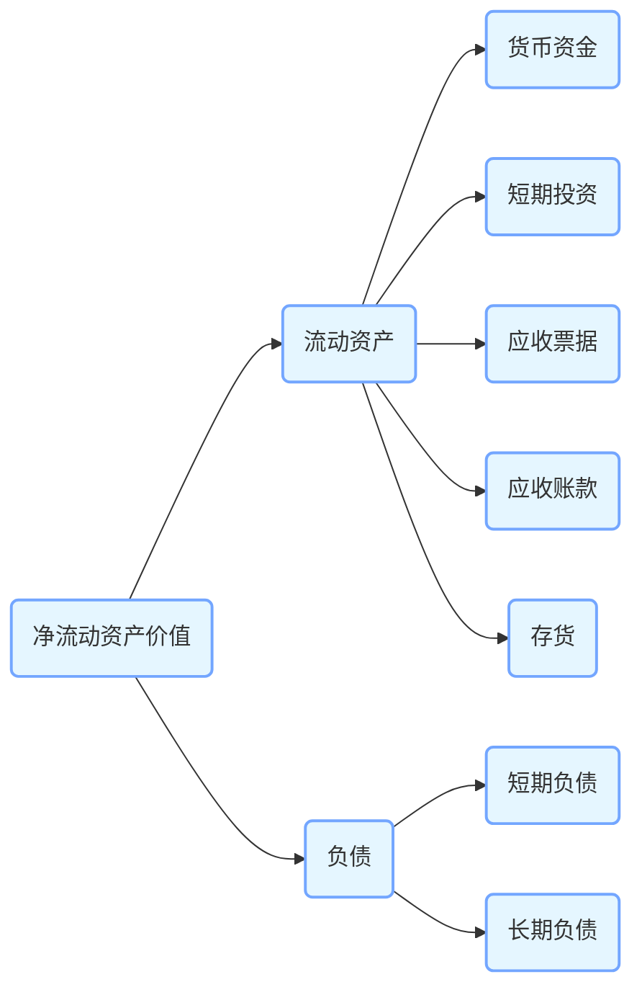

# 净流动资产价值在股票选择中的重要性

> 关键词：净流动资产价值、股票选择、财务分析、投资策略、估值方法、价值投资、基本面分析

> 摘要：本文围绕净流动资产价值在股票选择中的重要性展开深入探讨。首先介绍净流动资产价值的相关背景知识，包括其目的、适用读者群体等。接着阐述净流动资产价值的核心概念、原理及架构，并通过流程图呈现其逻辑关系。详细讲解其核心算法原理，用 Python 代码实现相关计算步骤。引入数学模型和公式进行理论支撑，并举例说明。通过项目实战，从开发环境搭建到源代码实现与解读，展示净流动资产价值在实际股票分析中的应用。分析其在不同场景下的实际应用，推荐相关学习资源、开发工具及论文著作。最后总结净流动资产价值在股票选择领域的未来发展趋势与挑战，解答常见问题并提供扩展阅读和参考资料，旨在为投资者和相关研究人员提供全面而深入的技术分析和投资决策参考。

## 1. 背景介绍 
### 1.1 目的和范围
净流动资产价值作为一种重要的财务指标，在股票选择过程中具有关键作用。本文的目的在于全面、深入地剖析净流动资产价值的概念、计算方法及其在股票选择中的实际应用，帮助投资者更好地理解该指标的意义和价值，从而在投资决策中做出更为明智的选择。

文章的范围涵盖了净流动资产价值的基本理论知识，包括其定义、相关概念及与其他财务指标的联系；详细介绍计算净流动资产价值的核心算法原理，并给出 Python 代码实现；通过数学模型和公式对其进行理论解释和说明；结合实际项目案例，展示如何运用净流动资产价值进行股票分析和选择；探讨其在不同实际场景中的应用；推荐相关的学习资源、开发工具和论文著作；总结其未来发展趋势与挑战，并解答常见问题。

### 1.2 预期读者
本文预期读者主要包括以下几类人群：
- **投资者**：无论是个人投资者还是机构投资者，都希望通过深入了解净流动资产价值来优化自己的投资策略，提高投资决策的准确性和成功率。
- **金融分析师**：需要掌握净流动资产价值的分析方法和应用技巧，以便为客户提供更专业的投资建议和研究报告。
- **财务专业学生**：作为学习财务分析和投资学的重要内容，本文可以帮助他们系统地学习净流动资产价值的相关知识，加深对财务指标和股票选择的理解。
- **研究人员**：对金融市场和投资领域的研究人员来说，本文可以提供关于净流动资产价值的最新研究成果和实践经验，为进一步的研究提供参考。

### 1.3 文档结构概述
本文将按照以下结构进行详细阐述：
1. **背景介绍**：介绍文章的目的、范围、预期读者、文档结构概述以及相关术语表。
2. **核心概念与联系**：阐述净流动资产价值的核心概念、原理及架构，并通过文本示意图和 Mermaid 流程图展示其逻辑关系。
3. **核心算法原理 & 具体操作步骤**：详细讲解计算净流动资产价值的核心算法原理，并用 Python 代码实现具体操作步骤。
4. **数学模型和公式 & 详细讲解 & 举例说明**：引入数学模型和公式对净流动资产价值进行理论解释和说明，并通过具体例子加深理解。
5. **项目实战：代码实际案例和详细解释说明**：从开发环境搭建到源代码实现与解读，展示如何运用净流动资产价值进行实际的股票分析和选择。
6. **实际应用场景**：分析净流动资产价值在不同实际场景中的应用，为投资者提供实践指导。
7. **工具和资源推荐**：推荐相关的学习资源、开发工具和论文著作，帮助读者进一步深入学习和研究。
8. **总结：未来发展趋势与挑战**：总结净流动资产价值在股票选择领域的未来发展趋势与挑战。
9. **附录：常见问题与解答**：解答读者在学习和应用净流动资产价值过程中可能遇到的常见问题。
10. **扩展阅读 & 参考资料**：提供相关的扩展阅读材料和参考资料，方便读者进一步查阅和研究。

### 1.4 术语表
#### 1.4.1 核心术语定义
- **净流动资产价值（Net Current Asset Value，NCAV）**：是指公司的流动资产减去所有负债后的价值。它反映了公司在短期内可以变现的资产净值，是衡量公司财务健康状况和内在价值的重要指标之一。
- **流动资产（Current Assets）**：是指企业可以在一年或者超过一年的一个营业周期内变现或者运用的资产，包括货币资金、短期投资、应收票据、应收账款和存货等。
- **负债（Liabilities）**：是指企业过去的交易或者事项形成的、预期会导致经济利益流出企业的现时义务，包括短期负债和长期负债。

#### 1.4.2 相关概念解释
- **账面价值（Book Value）**：是指账户的账面余额减去相关备抵项目后的净额，即固定资产、无形资产的账面余额与其累计折旧、累计摊销的差额。账面价值是一种基于会计核算的价值衡量方式，与净流动资产价值有一定的关联，但也存在区别。
- **市场价值（Market Value）**：是指一项资产在市场上的交易价格，它反映了市场参与者对该资产的预期和评价。净流动资产价值与市场价值之间的差异可以为投资者提供投资机会和风险提示。

#### 1.4.3 缩略词列表
- **NCAV**：Net Current Asset Value，净流动资产价值
- **CA**：Current Assets，流动资产
- **L**：Liabilities，负债

## 2. 核心概念与联系 

### 核心概念原理
净流动资产价值的核心原理基于对公司资产和负债的分析。流动资产是公司短期内可以变现的资产，而负债则是公司需要偿还的债务。通过计算流动资产减去负债后的净值，我们可以得到公司的净流动资产价值。这个价值反映了公司在极端情况下，即清算所有流动资产来偿还债务后，股东可能获得的剩余价值。

从投资的角度来看，净流动资产价值可以作为一种衡量股票内在价值的方法。如果股票的市场价格低于其净流动资产价值，那么从理论上讲，该股票可能被低估，具有投资价值。因为即使公司面临困境需要清算，股东也有可能获得超过股票市场价格的回报。

### 架构的文本示意图
```plaintext
净流动资产价值
|
|-- 流动资产
|   |-- 货币资金
|   |-- 短期投资
|   |-- 应收票据
|   |-- 应收账款
|   |-- 存货
|
|-- 负债
|   |-- 短期负债
|   |-- 长期负债
```

### Mermaid 流程图


## 3. 核心算法原理 & 具体操作步骤 

### 核心算法原理
净流动资产价值的计算基于以下公式：
\[ NCAV = CA - L \]
其中，\(NCAV\) 表示净流动资产价值，\(CA\) 表示流动资产，\(L\) 表示负债。

### 具体操作步骤
1. **收集财务数据**：从公司的财务报表中获取流动资产和负债的数据。这些数据通常可以在公司的资产负债表中找到。
2. **数据整理和清洗**：对收集到的数据进行整理和清洗，确保数据的准确性和完整性。例如，去除异常值、处理缺失值等。
3. **计算净流动资产价值**：将流动资产数据减去负债数据，得到净流动资产价值。
4. **分析和决策**：将计算得到的净流动资产价值与股票的市场价格进行比较，判断股票是否被低估或高估，从而做出投资决策。

### Python 源代码实现
```python
# 定义计算净流动资产价值的函数
def calculate_ncav(current_assets, liabilities):
    """
    计算净流动资产价值
    :param current_assets: 流动资产
    :param liabilities: 负债
    :return: 净流动资产价值
    """
    return current_assets - liabilities

# 示例数据
current_assets = 1000000  # 流动资产为 100 万
liabilities = 500000  # 负债为 50 万

# 调用函数计算净流动资产价值
ncav = calculate_ncav(current_assets, liabilities)

# 输出结果
print(f"净流动资产价值为: {ncav}")
```

### 代码解释
- `calculate_ncav` 函数接受两个参数：`current_assets` 和 `liabilities`，分别表示流动资产和负债。
- 函数内部将流动资产减去负债，得到净流动资产价值，并将其返回。
- 在示例中，我们定义了流动资产为 100 万，负债为 50 万，然后调用 `calculate_ncav` 函数计算净流动资产价值，并将结果输出。

## 4. 数学模型和公式 & 详细讲解 & 举例说明 

### 数学模型和公式
净流动资产价值的基本数学模型为：
\[ NCAV = CA - L \]
其中，\(NCAV\) 表示净流动资产价值，\(CA\) 表示流动资产，\(L\) 表示负债。

### 详细讲解
这个公式的核心思想是通过计算公司流动资产与负债的差值，来评估公司在短期内可以变现的资产净值。流动资产是公司可以在短期内转化为现金的资产，而负债是公司需要偿还的债务。当流动资产大于负债时，净流动资产价值为正，说明公司在清算流动资产后有剩余价值；当流动资产小于负债时，净流动资产价值为负，说明公司的负债超过了其流动资产，可能面临财务风险。

### 举例说明
假设公司 A 的资产负债表显示，其流动资产为 200 万元，包括货币资金 50 万元、短期投资 30 万元、应收票据 20 万元、应收账款 60 万元和存货 40 万元；负债为 150 万元，其中短期负债 80 万元，长期负债 70 万元。

根据公式计算净流动资产价值：
\[ NCAV = CA - L = 200 - 150 = 50 \text{（万元）} \]

这意味着公司 A 在清算所有流动资产来偿还债务后，还剩余 50 万元的价值。如果公司 A 的股票市场价格对应的总市值低于 50 万元，那么从净流动资产价值的角度来看，该股票可能被低估，具有投资价值。

## 5. 项目实战：代码实际案例和详细解释说明 

### 5.1  开发环境搭建
在进行项目实战之前，需要搭建相应的开发环境。以下是具体步骤：

#### 安装 Python
首先，需要安装 Python 解释器。可以从 Python 官方网站（https://www.python.org/downloads/）下载适合自己操作系统的 Python 版本，并按照安装向导进行安装。

#### 安装必要的库
在本项目中，我们需要使用 `pandas` 库来处理财务数据。可以使用以下命令来安装 `pandas` 库：
```sh
pip install pandas
```

### 5.2  源代码详细实现和代码解读
以下是一个完整的 Python 代码示例，用于从 CSV 文件中读取公司的财务数据，计算净流动资产价值，并将结果保存到新的 CSV 文件中。

```python
import pandas as pd

def calculate_ncav_from_csv(input_file, output_file):
    """
    从 CSV 文件中读取财务数据，计算净流动资产价值，并将结果保存到新的 CSV 文件中
    :param input_file: 输入的 CSV 文件路径
    :param output_file: 输出的 CSV 文件路径
    """
    # 读取 CSV 文件
    df = pd.read_csv(input_file)
    
    # 检查数据中是否包含所需的列
    if 'current_assets' not in df.columns or 'liabilities' not in df.columns:
        raise ValueError("输入的 CSV 文件中缺少必要的列：current_assets 或 liabilities")
    
    # 计算净流动资产价值
    df['ncav'] = df['current_assets'] - df['liabilities']
    
    # 将结果保存到新的 CSV 文件中
    df.to_csv(output_file, index=False)

# 示例调用
input_file = 'financial_data.csv'
output_file = 'ncav_data.csv'
calculate_ncav_from_csv(input_file, output_file)
```

### 5.3  代码解读与分析
- **导入必要的库**：使用 `import pandas as pd` 导入 `pandas` 库，用于处理数据。
- **定义函数 `calculate_ncav_from_csv`**：该函数接受两个参数：`input_file` 和 `output_file`，分别表示输入的 CSV 文件路径和输出的 CSV 文件路径。
- **读取 CSV 文件**：使用 `pd.read_csv(input_file)` 读取输入的 CSV 文件，并将数据存储在 `df` 数据框中。
- **检查数据列**：使用 `if 'current_assets' not in df.columns or 'liabilities' not in df.columns` 检查数据中是否包含所需的列，如果缺少则抛出异常。
- **计算净流动资产价值**：使用 `df['ncav'] = df['current_assets'] - df['liabilities']` 计算净流动资产价值，并将结果添加到数据框的新列 `ncav` 中。
- **保存结果**：使用 `df.to_csv(output_file, index=False)` 将结果保存到新的 CSV 文件中，`index=False` 表示不保存行索引。

## 6. 实际应用场景 
### 价值投资策略
净流动资产价值在价值投资策略中具有重要应用。价值投资者通常会寻找那些市场价格低于其内在价值的股票，而净流动资产价值可以作为一种衡量股票内在价值的方法。当股票的市场价格低于其净流动资产价值时，价值投资者认为该股票被低估，具有投资价值。他们会买入这些股票，等待市场价格回归其内在价值，从而获得投资收益。

### 风险评估
净流动资产价值也可以用于评估公司的财务风险。如果公司的净流动资产价值为负，说明公司的负债超过了其流动资产，可能面临财务困境。投资者在选择股票时，会关注公司的净流动资产价值，避免投资那些财务风险较高的公司。

### 并购和重组分析
在并购和重组活动中，净流动资产价值是评估目标公司价值的重要指标之一。收购方会关注目标公司的净流动资产价值，以确定其在清算情况下的剩余价值。如果目标公司的净流动资产价值较高，那么收购方在并购后可以通过处置其流动资产来偿还债务，降低并购风险。

### 行业比较
净流动资产价值还可以用于不同行业之间的比较。不同行业的公司具有不同的资产结构和财务特征，通过比较不同行业公司的净流动资产价值，可以了解各行业的财务健康状况和投资价值。例如，一些轻资产行业的公司可能净流动资产价值相对较低，而一些重资产行业的公司可能净流动资产价值相对较高。

## 7. 工具和资源推荐
### 7.1 学习资源推荐
#### 7.1.1 书籍推荐
- 《聪明的投资者》（The Intelligent Investor）：作者是本杰明·格雷厄姆（Benjamin Graham），这本书是价值投资领域的经典之作，详细介绍了包括净流动资产价值在内的价值投资理念和方法。
- 《财务报表分析》（Financial Statement Analysis）：作者是杰拉尔德·怀特（Gerald I. White）等，该书系统地介绍了财务报表分析的方法和技巧，对于理解净流动资产价值的计算和应用具有重要帮助。

#### 7.1.2 在线课程
- Coursera 平台上的“财务分析与决策”课程：该课程由知名大学的教授授课，内容涵盖了财务报表分析、估值方法等多个方面，包括净流动资产价值的相关内容。
- edX 平台上的“投资学原理”课程：该课程介绍了投资学的基本原理和方法，对于理解净流动资产价值在股票选择中的应用具有重要指导意义。

#### 7.1.3 技术博客和网站
- 雪球网（https://xueqiu.com/）：是一个投资者社区，提供了丰富的股票分析和投资策略分享，其中包括对净流动资产价值的讨论和应用案例。
- 东方财富网（https://www.eastmoney.com/）：是国内知名的金融信息网站，提供了大量的财务数据和研究报告，方便投资者获取公司的财务信息，进行净流动资产价值的计算和分析。

### 7.2 开发工具框架推荐
#### 7.2.1 IDE和编辑器
- PyCharm：是一款专业的 Python 集成开发环境，提供了丰富的代码编辑、调试和项目管理功能，适合开发与净流动资产价值计算和分析相关的 Python 程序。
- Jupyter Notebook：是一个交互式的开发环境，适合进行数据探索和分析，方便展示净流动资产价值的计算过程和结果。

#### 7.2.2 调试和性能分析工具
- pdb：是 Python 自带的调试工具，可以帮助开发者在代码中设置断点，逐步执行代码，查找问题。
- cProfile：是 Python 标准库中的性能分析工具，可以分析代码的运行时间和函数调用情况，帮助优化代码性能。

#### 7.2.3 相关框架和库
- pandas：是一个强大的数据处理和分析库，提供了丰富的数据结构和函数，方便处理和分析财务数据，进行净流动资产价值的计算。
- numpy：是 Python 的数值计算库，提供了高效的数组和矩阵运算功能，在处理大规模财务数据时具有重要作用。

### 7.3 相关论文著作推荐
#### 7.3.1 经典论文
- “The Security Analysis of Benjamin Graham and David Dodd”：这篇论文详细介绍了本杰明·格雷厄姆和大卫·多德的价值投资理论，包括净流动资产价值的概念和应用。
- “The Relationship between Net Current Asset Value and Stock Returns”：该论文研究了净流动资产价值与股票回报之间的关系，为投资者提供了重要的理论依据。

#### 7.3.2 最新研究成果
- 可以通过学术数据库（如 Web of Science、EBSCOhost 等）搜索关于净流动资产价值的最新研究论文，了解该领域的最新研究动态和成果。

#### 7.3.3 应用案例分析
- 一些财经杂志和研究机构会发布关于净流动资产价值应用案例的分析报告，如《财经》杂志、麦肯锡咨询公司等。这些案例分析可以帮助投资者更好地理解净流动资产价值在实际投资中的应用。

## 8. 总结：未来发展趋势与挑战
### 未来发展趋势
- **与大数据和人工智能的结合**：随着大数据和人工智能技术的不断发展，未来可以利用这些技术收集和分析更多的财务数据，提高净流动资产价值计算的准确性和效率。例如，通过机器学习算法对财务数据进行预测和分析，为投资者提供更准确的投资建议。
- **跨学科应用**：净流动资产价值的应用将不再局限于金融领域，而是与其他学科（如管理学、经济学等）进行更深入的融合。例如，在企业战略管理中，净流动资产价值可以作为评估企业财务状况和战略决策的重要指标。
- **国际化应用**：随着全球经济一体化的发展，净流动资产价值的应用将越来越国际化。投资者可以通过比较不同国家和地区公司的净流动资产价值，进行跨国投资和资产配置。

### 挑战
- **数据质量问题**：净流动资产价值的计算依赖于准确的财务数据，但在实际应用中，财务数据可能存在质量问题，如数据造假、数据缺失等。这些问题会影响净流动资产价值计算的准确性，给投资者带来风险。
- **市场环境变化**：市场环境是不断变化的，净流动资产价值的计算和应用需要考虑市场环境的变化。例如，在经济衰退时期，公司的流动资产可能会贬值，负债可能会增加，从而影响净流动资产价值的计算和投资决策。
- **行业差异**：不同行业的公司具有不同的资产结构和财务特征，净流动资产价值在不同行业的应用可能存在差异。投资者需要根据不同行业的特点，合理调整净流动资产价值的计算和分析方法。

## 9. 附录：常见问题与解答
### 问题 1：净流动资产价值是否适用于所有行业的公司？
解答：净流动资产价值并不适用于所有行业的公司。一些轻资产行业（如互联网、软件等）的公司，其资产主要以无形资产（如知识产权、品牌等）为主，流动资产相对较少，净流动资产价值可能不能准确反映其内在价值。而一些重资产行业（如制造业、房地产等）的公司，其流动资产和负债相对较多，净流动资产价值可能更具有参考价值。

### 问题 2：如何确定股票的市场价格低于其净流动资产价值就是被低估？
解答：股票的市场价格低于其净流动资产价值只是一个参考指标，不能单纯以此来判断股票是否被低估。还需要考虑其他因素，如公司的盈利能力、行业前景、管理团队等。此外，市场价格低于净流动资产价值也可能是由于市场对公司存在负面预期，投资者需要进一步分析原因，综合判断股票的投资价值。

### 问题 3：净流动资产价值的计算是否考虑了资产的变现能力？
解答：净流动资产价值的计算并没有直接考虑资产的变现能力。在计算过程中，流动资产是按照账面价值进行计算的，但在实际变现过程中，资产的变现价值可能会低于账面价值。例如，存货可能存在滞销、贬值等问题，应收账款可能存在坏账风险。因此，在使用净流动资产价值进行投资决策时，需要考虑资产的变现能力。

## 10. 扩展阅读 & 参考资料
### 扩展阅读
- 《证券分析》（Security Analysis）：本杰明·格雷厄姆和大卫·多德的另一部经典著作，深入探讨了证券分析的理论和方法，对于理解净流动资产价值的应用具有重要参考价值。
- 《投资最重要的事》（The Most Important Thing Illuminated）：作者是霍华德·马克斯（Howard Marks），该书介绍了投资的重要原则和方法，包括如何评估股票的价值和风险，与净流动资产价值的应用密切相关。

### 参考资料
- 公司的财务报表：可以从公司的官方网站、证券交易所网站等渠道获取公司的财务报表，这些报表是计算净流动资产价值的重要数据来源。
- 金融研究机构的报告：如高盛、摩根士丹利等金融研究机构发布的研究报告，提供了关于股票市场和公司财务分析的专业观点和数据。
- 学术数据库：如 Web of Science、EBSCOhost、中国知网等，提供了大量关于净流动资产价值和股票投资的学术论文和研究成果。