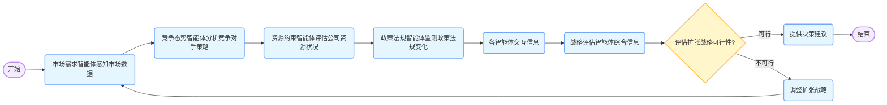

# 利用多智能体AI优化公司扩张战略评估

> 关键词：多智能体AI、公司扩张战略、战略评估、优化、决策支持

> 摘要：本文聚焦于利用多智能体AI技术来优化公司扩张战略评估。在当今竞争激烈且复杂多变的商业环境中，公司的扩张战略决策至关重要。多智能体AI作为一种先进的技术手段，能够模拟多个具有不同行为和决策能力的智能体之间的交互，从而更全面、准确地评估扩张战略的可行性和潜在效益。文章首先介绍了相关背景，包括目的范围、预期读者等内容；接着阐述了多智能体AI和公司扩张战略评估的核心概念及联系；详细讲解了核心算法原理和具体操作步骤，并用Python代码进行了说明；给出了相关数学模型和公式；通过项目实战展示了如何运用该技术进行战略评估；探讨了实际应用场景；推荐了相关工具和资源；最后总结了未来发展趋势与挑战，并对常见问题进行了解答，还提供了扩展阅读和参考资料。

## 1. 背景介绍 
### 1.1 目的和范围
在全球经济快速发展和市场竞争日益激烈的背景下，公司的扩张战略对于其长期发展和市场地位的巩固至关重要。然而，扩张战略的制定和评估是一个复杂的过程，涉及到众多因素，如市场需求、竞争态势、资源约束、政策法规等。传统的战略评估方法往往难以全面考虑这些因素之间的相互作用和动态变化，导致评估结果不够准确和可靠。

本文的目的是探讨如何利用多智能体AI技术来优化公司扩张战略评估，提高评估的准确性和可靠性，为公司的战略决策提供更科学的支持。具体范围包括多智能体AI的基本原理、公司扩张战略评估的关键要素、如何将多智能体AI应用于战略评估过程、以及相关的数学模型和实际案例分析等。

### 1.2 预期读者
本文的预期读者包括公司的高层管理人员、战略规划人员、市场分析人员等，他们需要对公司的扩张战略进行决策和评估。同时，也适合对多智能体AI技术和商业战略决策感兴趣的研究人员、学者以及相关专业的学生阅读，为他们提供理论和实践方面的参考。

### 1.3 文档结构概述
本文将按照以下结构进行组织：
- 核心概念与联系：介绍多智能体AI和公司扩张战略评估的核心概念，以及它们之间的联系，并通过文本示意图和Mermaid流程图进行展示。
- 核心算法原理 & 具体操作步骤：详细讲解多智能体AI用于战略评估的核心算法原理，并给出具体的操作步骤，同时用Python代码进行说明。
- 数学模型和公式 & 详细讲解 & 举例说明：建立相关的数学模型和公式，对其进行详细讲解，并通过具体例子进行说明。
- 项目实战：代码实际案例和详细解释说明：通过一个实际项目案例，展示如何运用多智能体AI进行公司扩张战略评估，包括开发环境搭建、源代码详细实现和代码解读等。
- 实际应用场景：探讨多智能体AI在公司扩张战略评估中的实际应用场景。
- 工具和资源推荐：推荐相关的学习资源、开发工具框架和论文著作等。
- 总结：未来发展趋势与挑战：总结多智能体AI在公司扩张战略评估中的应用现状，分析未来发展趋势和面临的挑战。
- 附录：常见问题与解答：对读者可能关心的常见问题进行解答。
- 扩展阅读 & 参考资料：提供相关的扩展阅读材料和参考资料，方便读者进一步深入学习。

### 1.4 术语表
#### 1.4.1 核心术语定义
- **多智能体AI（Multi - Agent AI）**：由多个智能体组成的人工智能系统，每个智能体具有一定的自主性、交互性和学习能力，能够在复杂环境中通过与其他智能体和环境的交互来完成特定任务。
- **公司扩张战略**：公司为了实现业务增长、提高市场份额、增强竞争力等目标而采取的一系列战略举措，包括市场扩张、产品扩张、地域扩张等。
- **战略评估**：对公司战略的可行性、有效性、风险等方面进行全面、系统的分析和评价，为战略决策提供依据。

#### 1.4.2 相关概念解释
- **智能体（Agent）**：在多智能体系统中，智能体是具有感知、决策和行动能力的实体。它能够感知周围环境的信息，根据自身的目标和规则进行决策，并采取相应的行动。
- **环境（Environment）**：智能体所处的外部世界，包括其他智能体、物理环境、社会环境等。智能体通过与环境的交互来获取信息和实现自身目标。
- **交互（Interaction）**：智能体之间以及智能体与环境之间的信息传递和行为影响。交互是多智能体系统实现协同工作和完成复杂任务的关键机制。

#### 1.4.3 缩略词列表
- **AI**：Artificial Intelligence（人工智能）
- **MAS**：Multi - Agent System（多智能体系统）

## 2. 核心概念与联系 

### 2.1 多智能体AI原理
多智能体AI是一种模拟多个自主个体在环境中交互的人工智能范式。每个智能体都有自己的目标、知识和行为规则，它们通过感知环境信息和与其他智能体进行通信来做出决策和采取行动。多智能体系统的核心在于智能体之间的协作和竞争关系，通过这种交互来实现系统的整体目标。

智能体通常具有以下几个基本特征：
- **自主性**：智能体能够独立地感知环境、做出决策和执行行动，不受其他智能体的直接控制。
- **交互性**：智能体能够与其他智能体和环境进行信息交换和行为影响，通过通信和协作来完成任务。
- **学习能力**：智能体可以根据自身的经验和环境反馈来调整自己的行为和策略，以提高性能和适应性。

### 2.2 公司扩张战略评估要素
公司扩张战略评估涉及到多个关键要素，主要包括以下几个方面：
- **市场需求**：了解目标市场的规模、增长趋势、消费者需求等，评估扩张战略是否能够满足市场需求，实现市场份额的增长。
- **竞争态势**：分析竞争对手的优势、劣势、市场策略等，评估公司在扩张过程中面临的竞争压力，以及战略是否能够帮助公司在竞争中取得优势。
- **资源约束**：考虑公司的资金、人力、技术等资源状况，评估扩张战略是否在公司的资源承受范围内，是否能够有效地配置和利用资源。
- **政策法规**：关注相关的政策法规变化，评估扩张战略是否符合政策要求，是否面临政策风险。

### 2.3 核心概念联系
多智能体AI与公司扩张战略评估之间存在着紧密的联系。可以将公司扩张战略评估中的各个要素看作不同的智能体，例如市场需求智能体、竞争态势智能体、资源约束智能体等。这些智能体之间相互交互和影响，共同决定了公司扩张战略的可行性和效果。

通过多智能体AI技术，可以模拟这些智能体之间的复杂关系和动态变化，更全面、准确地评估公司扩张战略。例如，市场需求智能体可以根据市场数据和趋势预测市场需求的变化，竞争态势智能体可以模拟竞争对手的策略调整，资源约束智能体可以评估公司资源的分配和利用情况。各个智能体之间通过信息共享和协作，为公司提供更科学的战略评估结果。

### 2.4 文本示意图
多智能体AI与公司扩张战略评估的关系可以用以下文本示意图表示：

多智能体AI系统
|-- 市场需求智能体
|   |-- 感知市场数据
|   |-- 预测市场需求变化
|   |-- 与其他智能体交互
|-- 竞争态势智能体
|   |-- 分析竞争对手策略
|   |-- 模拟竞争动态
|   |-- 与其他智能体交互
|-- 资源约束智能体
|   |-- 评估公司资源状况
|   |-- 优化资源分配
|   |-- 与其他智能体交互
|-- 政策法规智能体
|   |-- 监测政策法规变化
|   |-- 评估政策风险
|   |-- 与其他智能体交互
|-- 战略评估智能体
    |-- 综合各智能体信息
    |-- 评估扩张战略可行性
    |-- 提供决策建议

### 2.5 Mermaid流程图


## 3. 核心算法原理 & 具体操作步骤 

### 3.1 核心算法原理
多智能体AI用于公司扩张战略评估的核心算法主要基于智能体的决策模型和交互机制。常见的智能体决策模型包括基于规则的决策模型、基于效用的决策模型和基于学习的决策模型等。

#### 3.1.1 基于规则的决策模型
基于规则的决策模型是一种简单直观的决策方法，智能体根据预先定义的规则来做出决策。例如，市场需求智能体可以根据市场增长率和市场份额等指标，按照以下规则进行决策：
- 如果市场增长率大于某个阈值且市场份额低于某个阈值，则建议采取扩张策略。
- 如果市场增长率小于某个阈值且市场份额高于某个阈值，则建议维持现状。

#### 3.1.2 基于效用的决策模型
基于效用的决策模型通过计算不同决策方案的效用值来选择最优决策。效用值是一个综合考虑各种因素的指标，例如市场收益、成本、风险等。智能体选择效用值最大的决策方案。

#### 3.1.3 基于学习的决策模型
基于学习的决策模型通过智能体的学习能力来不断优化决策策略。常见的学习方法包括强化学习、深度学习等。例如，智能体可以通过强化学习算法在与环境的交互中不断尝试不同的决策，根据奖励信号来调整自己的策略，以获得最大的长期收益。

### 3.2 具体操作步骤
#### 3.2.1 定义智能体和环境
首先，需要定义多智能体系统中的各个智能体，包括市场需求智能体、竞争态势智能体、资源约束智能体等，并确定它们的属性和行为规则。同时，要定义智能体所处的环境，包括市场环境、竞争环境、政策法规环境等。

#### 3.2.2 初始化智能体状态
对每个智能体的初始状态进行初始化，包括其拥有的信息、目标、资源等。例如，市场需求智能体的初始状态可以是当前市场的规模、增长率等数据。

#### 3.2.3 智能体交互和决策
在每个时间步，智能体根据自身的感知能力获取环境信息，并与其他智能体进行交互。然后，根据自身的决策模型做出决策，并采取相应的行动。例如，竞争态势智能体可以根据其他智能体提供的信息和自身的分析结果，调整模拟的竞争对手策略。

#### 3.2.4 评估和更新
在一定的时间间隔内，对公司扩张战略进行评估，综合各个智能体的信息和决策结果，判断战略的可行性和效果。根据评估结果，更新智能体的状态和决策策略，以适应环境的变化。

### 3.3 Python源代码示例
以下是一个简单的基于规则的多智能体AI模拟公司扩张战略评估的Python代码示例：

```python
# 定义市场需求智能体
class MarketDemandAgent:
    def __init__(self, growth_rate, market_share):
        self.growth_rate = growth_rate
        self.market_share = market_share

    def make_decision(self):
        if self.growth_rate > 0.1 and self.market_share < 0.3:
            return "扩张策略"
        elif self.growth_rate < 0.05 and self.market_share > 0.5:
            return "维持现状"
        else:
            return "待定"

# 定义竞争态势智能体
class CompetitionAgent:
    def __init__(self, competitor_strength):
        self.competitor_strength = competitor_strength

    def analyze_competition(self):
        if self.competitor_strength > 0.8:
            return "竞争激烈"
        else:
            return "竞争一般"

# 定义资源约束智能体
class ResourceAgent:
    def __init__(self, resource_level):
        self.resource_level = resource_level

    def assess_resources(self):
        if self.resource_level > 0.7:
            return "资源充足"
        elif self.resource_level < 0.3:
            return "资源匮乏"
        else:
            return "资源一般"

# 定义战略评估智能体
class StrategyEvaluationAgent:
    def __init__(self, market_agent, competition_agent, resource_agent):
        self.market_agent = market_agent
        self.competition_agent = competition_agent
        self.resource_agent = resource_agent

    def evaluate_strategy(self):
        market_decision = self.market_agent.make_decision()
        competition_status = self.competition_agent.analyze_competition()
        resource_status = self.resource_agent.assess_resources()

        if market_decision == "扩张策略" and competition_status == "竞争一般" and resource_status == "资源充足":
            return "扩张战略可行"
        else:
            return "扩张战略需谨慎"

# 初始化智能体
market_agent = MarketDemandAgent(0.15, 0.2)
competition_agent = CompetitionAgent(0.6)
resource_agent = ResourceAgent(0.8)

# 初始化战略评估智能体
evaluation_agent = StrategyEvaluationAgent(market_agent, competition_agent, resource_agent)

# 进行战略评估
result = evaluation_agent.evaluate_strategy()
print("战略评估结果:", result)
```

## 4. 数学模型和公式 & 详细讲解 & 举例说明 

### 4.1 基于效用的决策数学模型
在基于效用的决策模型中，智能体通过计算不同决策方案的效用值来选择最优决策。假设智能体面临 $n$ 个决策方案 $d_1, d_2, \cdots, d_n$，每个决策方案的效用值 $U(d_i)$ 可以通过以下公式计算：

$$U(d_i) = \sum_{j = 1}^{m} w_j \cdot v_{ij}$$

其中，$m$ 是影响决策的因素数量，$w_j$ 是第 $j$ 个因素的权重，满足 $\sum_{j = 1}^{m} w_j = 1$，$v_{ij}$ 是第 $i$ 个决策方案在第 $j$ 个因素上的取值。

### 4.2 详细讲解
- **因素权重 $w_j$**：因素权重反映了每个因素在决策中的重要程度。例如，在公司扩张战略评估中，市场收益、成本、风险等因素的权重可以根据公司的战略目标和发展阶段来确定。如果公司更注重短期收益，那么市场收益因素的权重可能会相对较高。
- **因素取值 $v_{ij}$**：因素取值表示每个决策方案在各个因素上的表现。例如，对于市场收益因素，$v_{ij}$ 可以是第 $i$ 个决策方案预计带来的市场收益金额；对于风险因素，$v_{ij}$ 可以是第 $i$ 个决策方案的风险评估得分。

### 4.3 举例说明
假设公司在考虑两个扩张战略方案 $d_1$ 和 $d_2$，影响决策的因素有市场收益、成本和风险，权重分别为 $w_1 = 0.5$，$w_2 = 0.3$，$w_3 = 0.2$。各个方案在不同因素上的取值如下表所示：

| 决策方案 | 市场收益（万元） | 成本（万元） | 风险评估得分 |
| --- | --- | --- | --- |
| $d_1$ | 100 | 30 | 0.6 |
| $d_2$ | 120 | 40 | 0.8 |

首先，需要对成本和风险评估得分进行标准化处理，使其与市场收益的取值范围具有可比性。假设成本的标准化公式为 $v_{cost}^{norm} = \frac{1}{cost}$，风险评估得分的标准化公式为 $v_{risk}^{norm} = 1 - risk$。

对于方案 $d_1$：
- 市场收益标准化值：$v_{11} = 100$
- 成本标准化值：$v_{12} = \frac{1}{30} \approx 0.033$
- 风险评估得分标准化值：$v_{13} = 1 - 0.6 = 0.4$

则方案 $d_1$ 的效用值为：

$$U(d_1) = 0.5 \times 100 + 0.3 \times 0.033 + 0.2 \times 0.4 = 50 + 0.0099 + 0.08 = 50.0899$$

对于方案 $d_2$：
- 市场收益标准化值：$v_{21} = 120$
- 成本标准化值：$v_{22} = \frac{1}{40} = 0.025$
- 风险评估得分标准化值：$v_{23} = 1 - 0.8 = 0.2$

则方案 $d_2$ 的效用值为：

$$U(d_2) = 0.5 \times 120 + 0.3 \times 0.025 + 0.2 \times 0.2 = 60 + 0.0075 + 0.04 = 60.0475$$

由于 $U(d_2) > U(d_1)$，所以选择方案 $d_2$ 作为最优决策方案。

## 5. 项目实战：代码实际案例和详细解释说明 

### 5.1  开发环境搭建
#### 5.1.1 安装Python
首先，需要安装Python开发环境。可以从Python官方网站（https://www.python.org/downloads/） 下载适合自己操作系统的Python版本，并按照安装向导进行安装。建议安装Python 3.6及以上版本。

#### 5.1.2 安装相关库
在本项目中，需要使用一些Python库来实现多智能体AI和数据处理等功能。可以使用以下命令来安装所需的库：
```sh
pip install numpy pandas matplotlib
```
- **numpy**：用于数值计算和数组操作。
- **pandas**：用于数据处理和分析。
- **matplotlib**：用于数据可视化。

### 5.2  源代码详细实现和代码解读
以下是一个更复杂的基于多智能体AI的公司扩张战略评估的Python代码示例：

```python
import numpy as np
import pandas as pd
import matplotlib.pyplot as plt

# 定义智能体基类
class Agent:
    def __init__(self, name):
        self.name = name

    def perceive(self, environment):
        pass

    def make_decision(self):
        pass

# 定义市场需求智能体
class MarketDemandAgent(Agent):
    def __init__(self, name, growth_rate_history, market_share_history):
        super().__init__(name)
        self.growth_rate_history = growth_rate_history
        self.market_share_history = market_share_history

    def perceive(self, environment):
        # 模拟感知市场数据
        new_growth_rate = np.random.normal(np.mean(self.growth_rate_history), 0.01)
        new_market_share = np.random.normal(np.mean(self.market_share_history), 0.02)
        self.growth_rate_history.append(new_growth_rate)
        self.market_share_history.append(new_market_share)

    def make_decision(self):
        recent_growth_rate = self.growth_rate_history[-1]
        recent_market_share = self.market_share_history[-1]
        if recent_growth_rate > 0.1 and recent_market_share < 0.3:
            return "扩张策略"
        elif recent_growth_rate < 0.05 and recent_market_share > 0.5:
            return "维持现状"
        else:
            return "待定"

# 定义竞争态势智能体
class CompetitionAgent(Agent):
    def __init__(self, name, competitor_strength_history):
        super().__init__(name)
        self.competitor_strength_history = competitor_strength_history

    def perceive(self, environment):
        # 模拟感知竞争数据
        new_competitor_strength = np.random.normal(np.mean(self.competitor_strength_history), 0.05)
        self.competitor_strength_history.append(new_competitor_strength)

    def make_decision(self):
        recent_competitor_strength = self.competitor_strength_history[-1]
        if recent_competitor_strength > 0.8:
            return "竞争激烈"
        else:
            return "竞争一般"

# 定义资源约束智能体
class ResourceAgent(Agent):
    def __init__(self, name, resource_level_history):
        super().__init__(name)
        self.resource_level_history = resource_level_history

    def perceive(self, environment):
        # 模拟感知资源数据
        new_resource_level = np.random.normal(np.mean(self.resource_level_history), 0.03)
        self.resource_level_history.append(new_resource_level)

    def make_decision(self):
        recent_resource_level = self.resource_level_history[-1]
        if recent_resource_level > 0.7:
            return "资源充足"
        elif recent_resource_level < 0.3:
            return "资源匮乏"
        else:
            return "资源一般"

# 定义战略评估智能体
class StrategyEvaluationAgent(Agent):
    def __init__(self, name, market_agent, competition_agent, resource_agent):
        super().__init__(name)
        self.market_agent = market_agent
        self.competition_agent = competition_agent
        self.resource_agent = resource_agent
        self.evaluation_history = []

    def perceive(self, environment):
        self.market_agent.perceive(environment)
        self.competition_agent.perceive(environment)
        self.resource_agent.perceive(environment)

    def make_decision(self):
        market_decision = self.market_agent.make_decision()
        competition_status = self.competition_agent.make_decision()
        resource_status = self.resource_agent.make_decision()

        if market_decision == "扩张策略" and competition_status == "竞争一般" and resource_status == "资源充足":
            evaluation_result = "扩张战略可行"
        else:
            evaluation_result = "扩张战略需谨慎"

        self.evaluation_history.append(evaluation_result)
        return evaluation_result

# 初始化智能体
market_agent = MarketDemandAgent("市场需求智能体", [0.1, 0.12, 0.11], [0.2, 0.22, 0.21])
competition_agent = CompetitionAgent("竞争态势智能体", [0.6, 0.65, 0.62])
resource_agent = ResourceAgent("资源约束智能体", [0.8, 0.82, 0.81])
evaluation_agent = StrategyEvaluationAgent("战略评估智能体", market_agent, competition_agent, resource_agent)

# 模拟多个时间步
time_steps = 20
for step in range(time_steps):
    evaluation_agent.perceive(None)
    result = evaluation_agent.make_decision()
    print(f"时间步 {step + 1}: {result}")

# 可视化市场需求数据
plt.figure(figsize=(10, 6))
plt.plot(market_agent.growth_rate_history, label="市场增长率")
plt.plot(market_agent.market_share_history, label="市场份额")
plt.xlabel("时间步")
plt.ylabel("数值")
plt.title("市场需求数据变化")
plt.legend()
plt.show()
```

### 5.3  代码解读与分析
#### 5.3.1 智能体基类 `Agent`
定义了智能体的基类，包含智能体的名称，以及 `perceive` 和 `make_decision` 两个方法。`perceive` 方法用于感知环境信息，`make_decision` 方法用于根据感知到的信息做出决策。

#### 5.3.2 市场需求智能体 `MarketDemandAgent`
继承自 `Agent` 类，维护了市场增长率和市场份额的历史数据。`perceive` 方法模拟感知市场数据，更新历史数据。`make_decision` 方法根据最近的市场增长率和市场份额数据做出决策。

#### 5.3.3 竞争态势智能体 `CompetitionAgent`
继承自 `Agent` 类，维护了竞争对手实力的历史数据。`perceive` 方法模拟感知竞争数据，更新历史数据。`make_decision` 方法根据最近的竞争对手实力数据做出决策。

#### 5.3.4 资源约束智能体 `ResourceAgent`
继承自 `Agent` 类，维护了资源水平的历史数据。`perceive` 方法模拟感知资源数据，更新历史数据。`make_decision` 方法根据最近的资源水平数据做出决策。

#### 5.3.5 战略评估智能体 `StrategyEvaluationAgent`
继承自 `Agent` 类，包含市场需求智能体、竞争态势智能体和资源约束智能体。`perceive` 方法调用其他智能体的 `perceive` 方法，更新环境信息。`make_decision` 方法综合其他智能体的决策结果，对公司扩张战略进行评估。

#### 5.3.6 模拟和可视化
通过循环模拟多个时间步，每个时间步调用战略评估智能体的 `perceive` 和 `make_decision` 方法，输出战略评估结果。最后，使用 `matplotlib` 库可视化市场需求数据的变化。

## 6. 实际应用场景 
### 6.1 市场扩张决策
在公司考虑进入新的市场时，多智能体AI可以帮助评估市场的潜力和风险。市场需求智能体可以分析新市场的需求规模、增长趋势和消费者偏好；竞争态势智能体可以研究竞争对手在该市场的布局和竞争策略；资源约束智能体可以评估公司是否有足够的资源进入该市场。通过综合各智能体的信息，公司可以更准确地判断市场扩张战略的可行性，选择最有潜力的市场进行进入。

### 6.2 产品扩张决策
当公司计划推出新的产品时，多智能体AI可以辅助评估产品的市场前景和竞争力。市场需求智能体可以预测新产品的市场需求和接受程度；竞争态势智能体可以分析竞争对手的类似产品情况；资源约束智能体可以评估公司在产品研发、生产和营销等方面的资源投入能力。根据这些信息，公司可以优化产品扩张战略，提高新产品的成功率。

### 6.3 地域扩张决策
对于跨国或跨地区经营的公司，地域扩张是常见的战略选择。多智能体AI可以帮助评估不同地域的市场环境、政策法规、文化差异等因素。政策法规智能体可以监测目标地域的政策法规变化，评估潜在的政策风险；市场需求智能体可以分析当地的市场需求特点；资源约束智能体可以考虑在不同地域扩张所需的资源成本。通过全面评估，公司可以制定更合理的地域扩张战略。

### 6.4 战略调整和优化
在公司实施扩张战略的过程中，市场环境和竞争态势可能会发生变化。多智能体AI可以实时监测这些变化，并根据新的信息对战略进行调整和优化。例如，当市场需求智能体感知到市场需求下降时，战略评估智能体可以建议公司调整扩张节奏或改变战略方向；当竞争态势智能体发现竞争对手推出新的竞争策略时，公司可以及时采取应对措施，保持竞争优势。

## 7. 工具和资源推荐
### 7.1 学习资源推荐
#### 7.1.1 书籍推荐
- 《多智能体系统：原理与编程》：系统介绍了多智能体系统的基本原理、设计方法和编程实现，是学习多智能体AI的经典教材。
- 《人工智能：一种现代的方法》：全面涵盖了人工智能的各个领域，包括多智能体系统，对多智能体AI的理论和应用有深入的讲解。
- 《商业战略管理》：从管理学的角度介绍了公司战略制定和评估的方法和案例，有助于理解公司扩张战略的相关概念和实践。

#### 7.1.2 在线课程
- Coursera平台上的“Multi - Agent Systems”课程：由知名高校的教授授课，详细讲解多智能体系统的理论和应用。
- edX平台上的“Artificial Intelligence”课程：涵盖了人工智能的多个方面，包括多智能体AI的相关内容。
- 中国大学MOOC平台上的“战略管理”课程：介绍了公司战略管理的基本理论和方法，对公司扩张战略评估有实际的指导作用。

#### 7.1.3 技术博客和网站
- Medium上的人工智能相关博客：有许多关于多智能体AI的技术文章和案例分享，及时了解最新的研究成果和应用实践。
- arXiv.org：提供了大量的学术论文，包括多智能体AI在各个领域的研究论文，可以深入学习相关的理论和算法。
- AI Stack Exchange：一个人工智能领域的问答社区，可以在这里提问和交流多智能体AI的相关问题。

### 7.2 开发工具框架推荐
#### 7.2.1 IDE和编辑器
- PyCharm：一款专业的Python集成开发环境，具有强大的代码编辑、调试和项目管理功能，适合开发基于Python的多智能体AI应用。
- Visual Studio Code：一款轻量级的代码编辑器，支持多种编程语言和插件扩展，方便进行多智能体AI代码的编写和调试。

#### 7.2.2 调试和性能分析工具
- pdb：Python自带的调试器，可以帮助开发者定位和解决代码中的问题。
- cProfile：Python的性能分析工具，可以分析代码的运行时间和函数调用情况，优化代码性能。

#### 7.2.3 相关框架和库
- Mesa：一个用于构建多智能体系统的Python框架，提供了丰富的智能体模型和交互机制，方便快速开发多智能体AI应用。
- NetworkX：一个用于复杂网络分析的Python库，可以用于模拟智能体之间的交互网络，分析多智能体系统的结构和动态。

### 7.3 相关论文著作推荐
#### 7.3.1 经典论文
- “Multi - Agent Systems: A Modern Approach to Distributed Artificial Intelligence”：该论文系统地介绍了多智能体系统的基本概念、理论和方法，是多智能体AI领域的经典文献。
- “Game - Theoretic Foundations of Multi - Agent Systems”：从博弈论的角度探讨了多智能体系统中的决策和交互问题，为多智能体AI的研究提供了理论基础。

#### 7.3.2 最新研究成果
- 关注顶级学术会议如AAAI（Association for the Advancement of Artificial Intelligence）、IJCAI（International Joint Conference on Artificial Intelligence）等上发表的关于多智能体AI的研究论文，了解最新的研究进展和技术趋势。
- 查阅相关学术期刊如Artificial Intelligence、Journal of Artificial Intelligence Research等上的多智能体AI研究成果。

#### 7.3.3 应用案例分析
- 一些商业管理类期刊和案例库中会有关于公司战略决策和评估的实际案例分析，可以从中学习多智能体AI在公司扩张战略评估中的应用经验和方法。

## 8. 总结：未来发展趋势与挑战
### 8.1 未来发展趋势
#### 8.1.1 与其他技术的融合
多智能体AI将与大数据、云计算、物联网等技术深度融合。通过大数据技术，可以获取更全面、准确的市场信息和环境数据，为智能体的决策提供更丰富的依据；云计算技术可以提供强大的计算能力，支持大规模多智能体系统的运行；物联网技术可以实现智能体与物理世界的实时交互，提高系统的响应速度和适应性。

#### 8.1.2 强化学习和深度学习的应用
强化学习和深度学习将在多智能体AI中得到更广泛的应用。强化学习可以使智能体在复杂环境中通过不断试错来优化决策策略，提高系统的性能和效率；深度学习可以用于处理复杂的非结构化数据，如文本、图像、视频等，增强智能体的感知和理解能力。

#### 8.1.3 跨领域应用拓展
多智能体AI将在更多领域得到应用，除了公司扩张战略评估，还将涉及交通管理、能源系统、医疗保健、军事等领域。在不同领域中，多智能体AI可以模拟和解决复杂的系统问题，提高系统的智能化水平和管理效率。

### 8.2 面临的挑战
#### 8.2.1 智能体建模和设计
如何准确地建模和设计智能体的行为和决策规则是一个挑战。不同领域的智能体具有不同的特点和需求，需要根据具体情况进行定制化设计。同时，智能体之间的交互和协作机制也需要进一步优化，以提高系统的整体性能。

#### 8.2.2 数据质量和安全
多智能体AI依赖于大量的数据来进行决策和学习，数据的质量和安全至关重要。低质量的数据可能导致智能体的决策错误，而数据安全问题可能会泄露公司的机密信息和用户隐私。因此，需要建立有效的数据质量管理和安全保障机制。

#### 8.2.3 计算资源和效率
大规模多智能体系统的运行需要大量的计算资源，计算效率也是一个关键问题。如何优化算法和模型结构，减少计算复杂度，提高系统的运行效率，是未来需要解决的问题。

#### 8.2.4 伦理和法律问题
随着多智能体AI的广泛应用，伦理和法律问题也日益凸显。例如，智能体的决策责任如何界定，智能体的行为是否符合道德和法律规范等。需要建立相应的伦理和法律框架来规范多智能体AI的应用。

## 9. 附录：常见问题与解答
### 9.1 多智能体AI与传统AI有什么区别？
传统AI通常是单个智能体的系统，主要关注单个智能体的决策和行为。而多智能体AI由多个智能体组成，强调智能体之间的交互和协作。多智能体AI可以模拟更复杂的社会和组织行为，处理更复杂的问题，适用于需要考虑多个因素和利益主体的场景。

### 9.2 如何确定多智能体系统中智能体的数量和类型？
智能体的数量和类型需要根据具体的应用场景和问题来确定。一般来说，智能体的类型应该覆盖问题的关键因素和利益主体，例如在公司扩张战略评估中，需要包括市场需求、竞争态势、资源约束等智能体。智能体的数量应该在保证系统能够全面反映问题的前提下，尽量控制在合理范围内，以避免系统过于复杂。

### 9.3 多智能体AI在实际应用中如何保证决策的准确性？
为了保证决策的准确性，可以采取以下措施：
- 收集准确、全面的数据，为智能体的决策提供可靠的依据。
- 优化智能体的决策模型和算法，提高决策的科学性和合理性。
- 进行大量的实验和模拟，对决策结果进行验证和评估，不断调整和优化智能体的行为和策略。
- 引入人类专家的知识和经验，与多智能体AI相结合，提高决策的准确性和可靠性。

### 9.4 多智能体AI的开发难度大吗？
多智能体AI的开发难度相对较大，需要掌握人工智能、计算机科学、数学等多个领域的知识。同时，还需要处理智能体之间的交互和协作、复杂的环境建模等问题。但是，随着相关技术的发展和工具的不断完善，开发难度也在逐渐降低。可以借助现有的多智能体框架和库来快速开发多智能体AI应用。

## 10. 扩展阅读 & 参考资料
### 10.1 扩展阅读
- 《复杂系统与复杂网络》：介绍了复杂系统和复杂网络的基本概念和理论，有助于理解多智能体系统的结构和动态。
- 《行为经济学》：探讨了人类决策行为中的心理和认知因素，对理解智能体的决策机制有一定的参考价值。
- 《智能交通系统》：介绍了多智能体AI在交通管理领域的应用案例和技术方法。

### 10.2 参考资料
- 相关学术论文和研究报告，如在IEEE、ACM等学术数据库中搜索关于多智能体AI和公司战略评估的文献。
- 商业管理类书籍和案例集，如《哈佛商业评论》、《麦肯锡季刊》等杂志上的相关文章和案例。
- 相关的行业报告和统计数据，如市场研究机构发布的关于市场趋势、竞争态势等方面的报告。